# Advanced Operating Systems and Virtualization

[[_TOC_]]

## Disclaimer

- This summary has been done watching and using Pellegrini's material and lessons
- **Thanks A HUGE LOT to "Aless.." (i don't know the surname and the full name)**
  - I wrote this summary looking at the lessons and at the slides with Aless's notes. His/her notes have been very helpful, cheers to Aless*! 

## Theory

### Hardware Architectures

- Moore's Law: "The number of transistors in a dense integrated circuit doubles approximately every two years"
  - Problem: in single core too much power consumption (heat)
  - Solutions
    - Temporal parallelism (1980): pipelining, different "stages" (part of the calculation process) at the same time instance are doing different things
    - Superscalar architecture (1990): instructions simultaneously executed on the same CPU using redundant functional units (pipelines) that can operate in parallel
      - Run-time scheduling is needed because pipelines can't execute instructions that depend on others
      - Speculation: a guess on the outcome of a compare is made; if wrong the result is discarded, if right the result is flushed
        - Branch prediction: prediction on the branch to take
          - Types
            - Static: the programmer tells the compiler which is the branch that will be most likely executed
            - Dynamic: observe the control flow of the program and take decision based on the history of decisions
          - Well known methods
            - Branch prediction table: small memory indexed by the lower bits of the address of conditional branch instruction
              - Each instruction is associated with a prediction: take or not take the branch
                - Prediction take correct: 1 cycle penalty, this because you already fetched the next instruction ("not take") so you have to refetch the new instruction (the one you should jump to)
                - Prediction not take correct: no penalty, for the same (specular) of the previous case
                - Prediction incorrect: flush the pipeline and fetch the correct instruction (2 cycles penalty)
            - Two-bit saturating counter: evolution of branch prediction table

              

              - Two bits to take the decision (4 states)
              - You must be wrong two times to change your decision
            - IMPORTANT: doesn't work well with nested loops so not so useful in modern architectures and object oriented programming
          - Improvements
            - Improve the prediction
              - Correlated predictor: some branch outcomes are correlated; use a history of past `m` branches, representing a path through the program
                - Pattern History Table (PHT)
                  - Put the global branch history in a global history register
                  - Use its value to access a PHT of 2 bit saturating counters (last method used but with an history)
                  - The entry of the PHT identified by the global history register identifies a specific branch history to which 2 bit saturating counters method is applied to predict the next branch

                  

              - Tournament predictor (hybrid local/global predictor): combination of different branch predictors
                - A local predictor selected using the branch address
                - A correlated predictor based on the last `m` branches accessed by the local history
                - An indicator of which has been the best predictor for this branch: 2 bit counter which is increased for one and decreased for the other
            - Determine the target earlier: to solve the problem of more complicated branches and indirect jumps (ex: rets, can be any memory address in memory)
              - Branch target buffer: small cache memory accessed via `PC` during the fetch phase

                

                - The address of the fetched instruction is looked up in the table, if it is found (hit) this means that it has been already visited so the prefetched target is used
                - To define if a target is good or not, prediction bits are used; these vary on how many times the prefetched target changed (a lot of changes = bad)
                - When a miss happens (i suppose) that the address of the fecthed instruction is substituted with the new one and prediction bits are updated accordingly
              - Return address stack: stack dedicated only to return addresses; placed directly in the CPU
            - Reduce misprediction penalty
              - Fetch both instruction streams: fetch both targets of the branch
                - Doesn't work well with `switch`
                - Require a lot of cache bandwidth
      - Simultaneous Multi Threading (SMT, 2000): physical processor appears as multiple logical processors
        - There is a copy of the architecture state (ex: control registers) for each logical processor
        - A single set of physical execution resources is shared among logical processors
        - Requires less hardware but some sort of arbitration is mandatory
        - Example: Intel Hyper-Threading
          - Goals
            1. Share of the majority of architecture resources
            2. When one logical processor stalls the other logical process can progress
            3. In case the feature is not needed incur in no cost penalty 
          - Architecture
            - Frontend: take CISC instructions (16 bytes) and translate them into superset of RISC instructions that gets cached (Execution Trace Cache, TC); traduction executed by a specialized ROM
              - Execution Trace Cache
                - Two colors because two logical processor
                - One logical processor never fills the cache, it has some sort of upper bound, so that if it gets stuck it doesn't stuck the other logical processor 
                - Cache hit: pass fetched instruction to operation queue
                
                  

                - Cache miss

                  

                  1. Instruction Tranlsation Lookaside Buffer (ITLB) fetches CISC instructions from L2 cache and queue them
                     - There is one ITLB for each logical processor
                  2. CISC instructions are decoded in RISC by the above cited ROM and queued (queue because if TC is full problem occurs)
                  3. From the queue operations are cached in the TC and then the mechanism of cache hit is used
            - Out of order execution engine: used to make possible point `2`

              

              1. Rename
                 - Register rename unit: map logical registers with physical ones
                 - Allocation unit: assign mapped physical registers (could be not 100% sure because of physical time gaps, solution: schedulers)
              2. Sched
                 - Schedulers, as soon as units (registers) are available instructions are taken from the queue and scheduled for execution
              3. Traditional instruction execution following the scheduled instructions
              4. Retire
                 - Reorder unit/buffer: waits for all RISC instructions that compose a CISC instruction (recognize them because they are all marked with the address of the original instruction)
    - Multicores (2000): `N` cores running independently
      - Problem: race condition on data
        - Each core has a level of private cache and some other of shared, how can we grant that race conditions won't break anything?
      - Solution: Cache Coherence (CC)
        - Definition: set of rules that defines how cache system should work in a multi cache architecture
        - Types
          - Strong coherence: all memory read/write operations to a single location `A` coming from all cores must be executed in a total order that respects the order in which each core commits its own memory operations
            - Single Writer Multiple Readers (SWMR): for any memory location `A` at any given epoch either a single core may read and write to `A` or some number of cores may only read `A`
            - Data-Value (DV): the value of a memory location at the start of an epoch is the same as its value at the end of its latest read/write epoch
            - Machines aren't usually strong coherent, the compiler underneath make your program coherent
          - Weak coherence: performance purposes
            - SWMR might be dropped: multiple cores might write to the same location `A` and one core might read `A` while another core is writing to it
            - DV might hold only eventually: stores are guaranteed to propagate to all cores in `d` epochs so loads see the last value written only after `d` epochs
            - In C/C++ you could use this (ex: mutex etc..)
          - No coherence: all read write operations by all cores can occur simultaneously
            - No guarantees on the value observed by a read operation
            - No guarantees on the propagation of values from write operations
            - Programmers must explicitly coordinate caches across cores
        - Protocols
          - Definition: distributed algorithm in a message passing distributed system model
          - Description
            - Requests
              - `Load(A)`: read the value of `A`
              - `Store(A,v)`: store in `A` the value `v`
            - Transactions
              - `Get`: load a cache block `b` into cache line `l` (get updates)
              - `Put`: evict a cache block `b` out of cache line `l` (push updates)
            - Enforces a single coherence type (strong, weak, none)
            - Actors (communicate through an interconnection network)
              - Types
                - Cache controllers
                - Memory controllers

                
              
              - How they work: they are "clusters" of finite state machines; these FSM describe locally the state of a cache line in the cache controller
                - A single FSM for each cache line
                - States
                  - Stable: at the beginning/end of a transaction
                  - Transient: in the mid of a transaction (for simplicity we will not deal with them)
                - Events: something that triggers state transitions
                  - Remote: reception of a coherency message (continuously watching the network to see if something triggers state transitions)
                  - Local: issued by the parent cache controller
                - Actions: when you have a transition you trigger an action
                  - Remote: producing the sending of a coherency message
                  - Local: only visible to the parent cache controller
          - Families
            - Invalidate: when a core writes to a block all other copies are invalidated
              - Only the writer has an up to date copy of the block
              - Trades latency for bandwidth
            - Update: when a core writes to a block it updates all other copies
              - All cores have an up to date copy of the block
              - Trades bandwidth for latency
            - Snooping: coherence requests for a block are broadcast to all controllers through interconnection layer which can total order requests (if a lot of actors performance drops because serial talk on the interconnection layer)

              

            - Directory Based (today): coherence requests for a block are unicast to a directory (set of cores), scalable but not fast

              

              - The directory controller receives the (ex) "cache line modified" message and propagates this information to all the cache controllers that use that cache line
          - What a protocol should offer (the more properties are captured the more aggressive is the optimization and the space overhead)
            - Validity: a valid block has the most up to date value for this block; it can be read but can be written only if it is exclusive
            - Dirtiness: a block is dirty if its value is the most up to date value and it differs from the one stored in the LLC/Memory
            - Exclusivity: a cache block is exclusive if it is the only privately cached copy of that block in the system (except for the LLC/Memory)
            - Ownership: a cache controller is the owner of the block if it is responsible for responding to coherence requests for that block
          - MOESI stable states
            - States
              - Modified (M)
                - The block is valid, exclusive, owned and potentially dirty
                - It can be read or written and the cache has the only valid copy of the block
              - Owned (O)
                - The block is valid, owned and potentially dirty but not exclusive
                - It can be only read and the cache must respond to block requests
              - Exclusive (E)
                - The block is valid, exclusive and clean
                - It can be only read
                - No other caches have a valid copy of the block
                - The LLC/Memory block is up to date
              - Shared (S)
                - The block is valid but not exclusive, not dirty and not owned
                - It can be only read
                - Other caches may have valid or read only copies of the block
              - Invalid (I)
                - The block is invalid
                - The cache either does not contain the block or the block is potentially stale
                - It cannot be read nor written

              

            - Variants: MESI and MSI
        - Write-back vs Write-through caches
          - Write-through: write is done synchronously both to the cache and to the main memory
          - Write-back (write-behind): initially, writing is done only to the cache; the write to the main memory is postponed until the modified content is about to be replaced by another cache line
        - False cache sharing
          - This problem arises whenever two cores access different data items that lie on the same cache line
          - Can be solved using sub block coherence or speculation, better if prevented by good programming practices (put values accessed together in two different cache lines)

          

        - Virtual vs Physical Memory addressing
          - Virtual memory: layer of abstraction between the memory address layout that most software sees and the physical devices backing that memory
            - Allows applications to utilize more memory than the machine actually has
            - The virtual to physical translation is supported by hardware/firmware (Translation Lookaside Buffer, TLB) cooperating with the Operating System
              - Translating addresses is expensive; the TLB is a cache to avoid continuous translation

              

            - Where to put the L1 cache

              

              - Virtual caches (used now): L1 cache mapped with virtual addresses (second image)
                - One step process in case of a hit
                - If miss, while searching in the L1 cache we are searching also in the TLB, very efficient
                - Virtual aliasing: homonyms and synonyms
                  - Sub-problems
                    - Homonyms: same virtual address corresponds to several physical addresses
                      - Homonyms lead to cache accessing the wrong data
                      - Solution
                        - Tag virtual address with address space ID (ASID): disambiguate virtual addresses (makes them globally valid), should be more or less like adding the page id
                        - Use physical tags: tag cache virtual memory address with its physical one
                        - Flush cache on context switch (Linux does this)
                    - Synonyms: several virtual addresses map to the same physical address
                      - Frames shared between processes
                      - Multiple mappings of a frame within an address space
                      - Synonyms in cache may lead to accessing stale ("stantio") data
                        - Same data may be cached in several lines
                        - On write, one synonym is updated; a subsequent read on the other synonym returns the old value
                      - Physical tagging doesn't help, ASIDs don't help either
                      - Solution
                        - Hardware synonym detection (disallow aliases to coexist in cache): every time a cache line is added scan to see if there are synonyms
                        - Flush cache on context switch (Linux does this)
                        - Virtual memory addresses which are synonyms map to same cache line 
                  - Implemented solutions
                    - x86, virtually indexed: the MMU in parallel queries the TLB; if the TLB notices that the requested memory address appertains to a process which is different from the one returned by the cache, eventually the MMU sends a warning signal to the core which will flush its pipeline
                    - ARM, virtually indexed, virtually tagged: here in the cache there is also a tag that defines which physical address the virtual one points to, so faster sanity check
                    - MIPS, virtually indexed, physically tagged: more or less like ARM
      - Memory consistency: defines the correct behavior of shared memory subsystems regardless of how they are implemented
        - Example

          

        - Note: cache coherence is different from memory consistency; a memory consistency implementation can use cache coherence as a useful "black box"
        - Reordering of memory accesses
          - A core will commit operations in a certain order, different cores might observe these operations in a different order
          - Examples
            - Out of order execution: if an operation is blocked then probably the next one is executed before
            - Speculation: when performing speculation a portion of a program could be delayed in favor to speculation, this is associated with the previous case
          - Types (invert the order of operations)
            - Store-store (OK)
            - Load-load (OK)
            - Store-load (PROBLEM)
              - Example

                

                - Reordering possible
                  - `(r1,r2)=(0,NEW)[S1,L1,S2,L2]`
                  - `(r1,r2)=(NEW,0)[S2,L2,S1,L1]`
                  - `(r1,r2)=(NEW,NEW)[S1,S2,L1,L2]`
                  - `(r1,r2)=(0,0)[L1,L2,S1,S2]`
            - Load-store (PROBLEM): more or less like Store-load
        - Total order
          - Types
            - Program order (≺p): per-core total order that captures the order in which each core logically executes memory operations
            - Memory order (≺m): system-wide total order that captures the order in which memory logically serializes memory operations from all cores
          - Memory consistency can be defined imposing constraints on how ≺p and ≺m relate to each other
        - Consistency types
          - Sequential
            - Properties
              - Program order and memory order must be the same, regardless the address loaded/stored
              - Every load gets its value from the last store (on the same address) before it as seen in memory order
            - Example

              

              - Sequential

                

                

                

              - NON sequential: allowed in a lot of real world architecture (they use weak consistency)

                

          - Weak
            - Total store order (TSO)
              - Store operations (slower) are hold in a FIFO store buffer to wait for the cache to be ready
              - When a load is issued by a core the store buffer is looked up for a matching store
                - If found the load is served by the store buffer (forwarding)
                - Else it is served by the memory subsystem (bypassing)
            - To avoid this situation you have to explicitly (programming level) synchronize program and memory order
              
              

              - Solutions
                - Memory fences (critical section from the perspective of the compiler)
                  - Make the memory order respect the program order before and after a fence
                    - `If X(a) ≺p FENCE ⇒ X(a) ≺m FENCE`
                    - `If FENCE ≺p X(a) ⇒ FENCE ≺m X(a)`
                    - `If FENCE ≺p FENCE ⇒ FENCE ≺m FENCE`
                  - Example: x86
                    - Fences
                      - MFENCE (full barrier): `If X(a) ≺p MFENCE ≺p X(b) ⇒ X(a) ≺m MFENCE ≺m X(b)`
                      - SFENCE (store/store barrier, is an MFENCE): `If S(a) ≺p SFENCE ≺p S(b) ⇒ S(a) ≺m SFENCE ≺mS(b)`
                      - LFENCE (load/load and load/store barrier): `If L(a) ≺p LFENCE ≺p X(b) ⇒ L(a) ≺m LFENCE ≺m X(b)`
                    - Implementation: both MFENCE and SFENCE drain the store buffer, costly
                - Atomic operations (Read-Modify-Write Instructions): read memory and modify its content in an apparently instantaneous fashion
                  - Use dedicated circuits so better than fences
                  - Some types
                    - Compare and Swap (CAS): provide a new value, an old value, and a memory location; access memory, take the content, compare it with the old value, if they match write the new value else fail
                    - Fetch and Add (FAA): read memory location, perform an addition, write back the result and give the old value 
                    - Test and Set (TAS): read memory location, if is not set you set it
                    - Load Link Store Conditional (LLSC): like CAS but in ARM, split it in two separate instructions
                  - Example usage (x86): `lock` prefix
                    - Definitions
                      - About memory consistency: locked instructions can be used to synchronize data written by one processor and read by another processor; locked operations serialize all outstanding load and store operations (wait for them to complete)
                      - About cache coherence: if the area of memory being locked during a LOCK operation is cached in the processor that is performing the LOCK operation the processor may not assert the LOCK signal on the bus; instead it will modify the memory location internally and allow its cache coherency mechanism to ensure that the operation is carried out atomically (cache locking), this works for the MESI exclusive state (hold for more time exclusive state)
                    - How it works
                      1. Draining the store buffer so as to prevent reordering effects due to forwarding bypassing
                      2. Loading the cache block using a `GetM` operation so as to limit the effect of concurrent transactions
                      3. Retaining the bus so as to lock the state of the cache block until the RMW completes

                    ```assembly
                    // WRONG: xchgl could use an old value of eax 
                    1:
                      movl $1,%eax
                      xchgl %eax, spinlock
                      test %eax, %eax
                      jnz 1b
                    // CORRECT
                    1:
                      movl $1,%eax
                      lock xchgl %eax, spinlock // Make the instruction atomic, don't reorder
                      test %eax, %eax
                      jnz 1b
                    ```
      - Security aspects
        - A speculative processor can let an attacker exploit micro architectural effects by using phantom instructions (instructions that will neve be committed but that are in pipeline for a certain amount of time) even though the pipeline is flushed
        - Side channel: memory which allows to read other memory content
          - [Meltdown](https://www.youtube.com/watch?v=JSqDqNysycQ)
            ```c
            // One byte for each possible byte values of the final memory location we want to read + some padding
            uint8_t *probe_array = new uint8_t[256 * 4096];
            // Make sure probe_array is not cached

            // Instructions that should not work
            uint8_t kernel_memory = *(uint8_t*)(kernel_address);
            uint64_t final_kernel_memory = kernel_memory * 4096;
            uint8_t dummy = probe_array[final_kernel_memory];
            // Instructions that should not work

            // Handle (eventual) SEGFAULT (you couldn't do the upper instruction)
            // Determine which of 256 slots in probe_array is cached

            // Simply measuring the latency to access probe_array at the end of this execution path allows to know the value of the kernel memory byte
            // So you simply use the kernel memory content as the index of the probe_array; you shouldn't be able to do this but with the out of order pipeline this is done anyway and too fast to be caught 
            ```
          - [Spectre](https://www.youtube.com/watch?v=q3-xCvzBjGs)
            ```c
            if(x < array1_size){
              y=array2[array1[x] * 4096];
            }
            
            // It is then possible to inspect the cache state of array2 to see what was the speculatively accessed value of array1[x]
            ```
      - Inter-core connection (bus types)
        - Front-side bus (2004)

          

        - Dual independent bus (2005)

          

        - Dedicated high-speed interconnects (2007)

          

        - Quick path interconnect (2009)

          

      - UMA vs NUMA
        - Uniform Memory Access (UMA): single memory controller is shared among all CPUs 

          

        - Non Uniform Memory Architectures (NUMA): multiple buses and memory controllers

          

          - Each CPU has its own local memory which is accessed faster
          - Shared memory is the union of local memories
          - The latency to access remote memory depends on the distance
          - A processor made of multiple cores and the memory local to it form a NUMA node
          - There are commodity systems which are not fully meshed remote nodes can be only accessed with multiple hops
          - Linux is NUMA-aware
            - `libnuma`
              - Requires `#include<numa.h>` and linking with `-lnuma`
              - Some symbols are exposed through `numaif.h`
              - `numactl`: command line tool to run processes with a specific NUMA policy without changing the code or to gather information on the NUMA system
                - `numactl --cpubin=0 --membind=0,1 program`: run program on CPUs of node 0 and allocate memory from nodes 0 and 1
                - `numactl --preferred 1 numactl --show`: allocate memory preferably from node 1 and show the resulting state
                - `numactl --interleave=all program`: run program with memory interleaved over all available nodes
                - `numactl --offset=1G --length=1G --membind=1 --file dev/shm/A --touch`: bind the second gigabyte in the tempfs file `/dev/shm/A` to node 1
                - `numactl --localalloc /dev/shm/file`: reset the policy for the shared memory file `/dev/shm/file`
                - `numactl --hardware`: print an overview of the available nodes

### x86 Initial Boot Sequence

- Initial fundamental note: boot sequence has been designed incrementally; it is fully retro-compatible


1. BIOS/UEFI initialization: hardware setup
   1. Hardware Power Sequences
      - When someone pushes the power button the CPU cant simply jump up and start fetching code from flash memory
      - The hardware waits for the power supply to settle to its nominal state
      - Additional voltages must be supplied: `1,5 3 3,5 12 V`, these must be provided in a particular order 
      - The power is sequenced by controlling analog switches; the sequence is often driven by a Complex Program Logic Device (CPLD)
   2. Clocks
      - The full power is given to the CPU when platform clocks (derived from input clocks and oscillator sources) converge to a same time 
   3. Basic state
      - Caches are disabled
      - The Memory Management Unit (MMU) is disabled
      - Only one core can run actual code
      - Nothing is in RAM
      - Segmented memory
        - `logical address = <seg.id:offset> (ex: <A:0x10>)`
        
          
        
        - 16 bit segment registers
          - `CS`: code segment, contains current instruction
          - `DS`: data segment, contains data used by the application
          - `SS`: stack segment, contains stack
          - `ES`: extra segment (to be used by the programmer)
          - `FS`: used for thread local storage
          - `GS`: used for per-CPU variables
        - The CPU is executing in Real Mode
          - 16 bit instruction execution mode
          - 20 bit segmented memory address space (1 MB of total addressable memory)
          - Address in segment registers is the 16 bits higher part
          - Each segment can range from 1 byte to 65 536 bytes (16 bit offset)
        - Address resolution

          

          - Each instruction that touches memory implicitly uses a segment register
            - `jump` instruction uses `CS`
            - `push` instruction uses `SS`
            - Most segment registers can be loaded using a `mov` instruction
            - `CS` can be loaded only with a `jmp` or a `call`
          - Resolution method

            

            

            - Segment selector = `CS`
            - `hex(0x1000 * 16 + 0x6025) = 0x16025`
            - Segments could overlap
            - If you don't pay attention you could overflow the memory; we have 20 bits of addressable memory (`FFFFF`) but `FFFF:FFFF` are more
   1. First fetched instruction: `F000:FFF0` (`FFFF0`), this is the reset vector
      - Mapped to the last 16 bytes of a ROM (the BIOS)
      - These 16 bytes contain the first instruction: `ljmp $0xf000,$0xe05b`
      - Using this instruction the BIOS tells the CPU where BIOS code starts (long jumps can edit the `CS` register)
   2. BIOS operations
      1. The BIOS looks for video adapters that may need to load their own routines, these ROMs are mapped from `C000:0000` to `C780:0000`
         - So the BIOS is now able to print messages to screen
      2. Power-On Self-Test (POST)
         - Depends on the actual BIOS
         - Test devices (keyboard, mouse)
         - Video Card Initialization
         - RAM consistency check
      3. Boot configuration loaded from `CMOS` (64 bytes); for example the boot order and boot devices
      4. Shadow RAM initialization: the BIOS copies itself into RAM for faster access
      5. The BIOS tries to identify the Stage 1 bootloader of the OS (512 bytes) using the specified boot order and loads it to memory at `0000:7c00`; control is given with `ljmp $0x0000,$0x7c00`
      - RAM layout after this process

         

        - BIOS ROM: BIOS shadow copy
        - 16-bit devices expansion ROM: additional device drivers
        - VGA Display: video controller basic drivers
2. Bootloader stage 1: executes the Stage 2 bootloader (skipped in case of UEFI)
   - Bootloader stage 1 is in memory and is called Master Boot Record (MBR)
   - It comprehends stage 1 executable code and a 4 entry partition table identifying different device partitions in terms of positioning on the hard drive
   - In case the partition is extended then it can additionally keep up to 4 sub partitions
    
   

   
   
   1. The basic order of operations that happens while a BIOS is trying to find something to boot is:
      1. Load first sector (512 bytes) of the device you're trying to boot from (HDD, SSD, Floppy Disk, Optical Disc, etc) into memory
      2. Check if the 511th and 512th bytes are `0x55` and `0xAA`
         - If not, go back to step 1 and try the next device, or give up if there aren't any more
         - If yes, start executing code at the beginning of this sector
      - The initial bytes of the MBR can contain the BIOS Parameter Block (BPB): data structure describing the physical layout of a data storage volume (used by FAT16, FAT32 and NTFS)
        - We know that the first bytes of the MBR gets executed; the solution is inserting in the BPB a dummy entry containing a `jmp` to the actual code (after BPB)

        

        - `cli`: disable interrupts 
        - All registers set to `0` (`movw`); the `CS` is already set to `0` (done before)
   2. Enable address A20 (enable using more than 1 Mb of memory, more than 20 lines of memory, 16 Mb)
      - Intel 80286 increased the addressable memory to from 8086 1 Mb to 16 Mb (24 address lines)
      - Wrap around problem
        - In 8086 overflow was used to access OS memory to call syscalls

          

        - When memory enlarged old programs no more worked

          

        - Solution: by default address line 20 (we start counting from 0) is forced to zero
          - To enable/disable this line use the 8042 keyboard controller: it had a spare pin which they decided to route the A20 line through
            ```asm
            call wait_for_8042
            movb $0xd1, %al # command write
            outb %al, $0x64 # port used to communicate an operation to the controller
            call wait_for_8042
            movb $0xdf, %al # enable A20 (0xdd = disable)
            outb %al, $0x60 # port used to enable/disable
            call wait_for_8042
            
            ...
            
            wait_for_8042:
              inb %al, $0x64
              tesb $2, %al # bit 2 set = busy
              jnz wait_for_8042
              ret
            ```
   3. Switch to 32 bit (and eventually 64 bit) protected mode (**BASIC**)
      - Introduced in 80286 (1982) for security reasons: memory was world writable
      - With 80386 (1985) it was extended by adding paging
      - CPUs start in Real Mode for backwards compatibility; still today x86 Protected Mode must be activated during system startup
      - Entering **BASIC** protected mode
        1. The code must set bit `0` (PE) of register `CR0`; this does not immediately activate all its facilites
           - All registers used in x86_64

             

             - CR: control registers

               

             - DR: debug registers
        2. Happens when the CS register is first updated
        3. After this code executes in 32/64-bit mode
        ```asm
        ljmp 0x0000, PE_mode
        
        .code32
        PE_mode:
          # Setup the protected-mode data segment registers
          movw $PROT_MODE_DSEG, %ax
          movw %ax, %ds
          movw %ax, %es
          movw %ax, %fs
          movw %ax, %gs
          movw %ax, %ss
        ```
      - Segment registers in protected mode
        - A segment register is no longer a raw number, it contains also an index into a table of segment descriptors
        - In the table exist multiple types of segments:
          - code
          - data
          - system
      - Descriptor table entry

        

        - Base: 32 bit linear addressing pointing to the beginning of the segment (same as the previous number used in real mode)
        - Limit: size of the segment
        - G (Granularity): if set size (limit) is to be multiplied by 4096
        - Descriptor Privilege Level (DPL): number in [0-3] that specifies in what execution mode you can access this segment

          

          - A lot of times ring 1 and 2 are not used (hard to use)
      - Descriptor tables (each core has its couple)
        - Global Descriptor Table (GDT): system wide table of descriptors pointed by the GDTR register
        - Local Descriptor Table (LDT): process specific table of descriptors pointed by the LDTR register, not used anymore
      - Segment selectors

        

        - TI: set to 0 for the GDT, set to 1 fort the LDT
        - Index: segment selector within the associated table
        - Data vs code segment

          

          - RPL is present only in data segments selectors (ex: SS or DS)
          - Current Privilege Level (CPL): only in CS which can be loaded only with a `ljmp/lcall`
            - Managed by the CPU
            - Always equal to the current CPU privilege level
      - Segmented addressing resolution in protected mode

        

        - The calculated base address will be 99% of the times 0, this is not very performance friendly
        - The solution is in the implementation: segment caching

          

          - Descriptor cached in the non-programmable part (can not edit it via software)
          - If a segment descriptor is changed you have to flush the non-programmable part
            - To do this you have to rewrite the same content into the segment register to invalidate the descriptor and force the firmware to reload the content form the actual descriptor table
      - Enforcing protection in x86 architecture
        - The firmware must check if an access to a certain segment is allowed
        - There must be away to change current privilege

          

        - Protection upon segment load

          

          - `MAX`: returns the lower, higher privileges are lower numbers
        - Getting higher privileges
          - To gain higher privileges code must pass through a controlled gate
            - Gate descriptors are used to identify possible gates through which control can pass; they are segment descriptors of type system

              

            - System type segment descriptors (gate descriptors) are subdivided into
              - Call-gate descriptors: allow us to call routines passing from one ring to the other
              - Interrupt-gate descriptors: used to implement interrupts of IO devices
                - Referenced by the Interrupt Descriptor Table (IDT) pointed by the IDTR register

                  

                  1. Hardware interrupt comes
                  2. Firmware will look at the IDTR register
                  3. Find the corresponding entry in the IDT table
                  4. Look at the selector
                  5. Look ad the GDTR register
                  6. Find the correct segment descriptor
                  7. Use the address + the offset to locate the interrupt handler
              - Trap-gate descriptors: transition from user space to kernel space
            - Linux in the GDT has kernel and user space references, used every time there is a transition between user space and kernel space

              

            - **IMPORTANT**: The mechanism just explained is used to change privilege level; this process is just done referencing (for example) kernel memory in a particular way (the one described) which is the only way that is accepted by the computer; software interrupts are used to change execution level (that's why we use IDT) 
      - GDT in Linux

        

        - One copy of this table for each core
        - TLS (thread local storage)
        - Kernel code: contains kernel code segment address
        - Kernel data: contains kernel data segment address
        - User code: contains user code segment address
        - User data: contains user data segment address
        - *BIOS: to make BIOS work
        - LDT: not used, just a dummy value (shared across all cores)
        - TSS (task state segment)
          - Different for all cores
          - Structure keeping information about a task (keep information about different rings tasks)
          - Stores
            - Processor registers state: values of registers
            - I/O Port Permissions (I/O map base address)
            - Inner level Stack Pointers
              - The TSS contains 6 fields for specifying the new stack pointer when a privilege level change happens
                - `SS0` contains the stack segment selector for `CPL=0`
                - `ESP0/RSP0` contains the new `ESP/RSP` value for `CPL=0`
              - When an interrupt happens in protected (32-bit) mode, the x86 CPU will look in the TSS for `SS0` and `ESP0` and load their values into `SS` and `ESP` respectively; this allows for the kernel to use a different stack than the user program, and also have this stack be unique for each user program
            - Previous TSS link: chain all the TSSs
              - Each TSS is stored in the `int_tss` array
          - The selector is kept in the Task Register (TR)
            - It can be loaded using the privileged `ltr` instruction (`CPL=0`)
            - The Base field within then n-th core TSS register points to the n-th entry of the `int_tss` array
            - `G=0` and `Limit=0xeb`: TSS is 236 bytes in size
            - `DPL=0`: TSS cannot be accessed in user mode
          - TSS in x86

            

          - TSS in x64

            

            - Interrupt Stack Table (IST): identifies 7 stack pointers (14 if high and low) to handle interrupts
            - Registers are gone (R3): when privilege context switch happens the R3 registers are saved in the R0 stack and when the kernel operations concludes R3 registers are restored using the `iret` instruction (more or less)
            - Entries in the IDT are modified to allow picking one of these stacks
            - Value 0 tells the firmware not to use the IST mechanism
            - RSP* same as ESP*
      - From R3 to R0

        

        - Hardware interrupts: look just at CPL and DPL (example in picture)
        - Software interrupts
          - Triggered using the `int $vector` (`int 0x80`)
          - Segment selector points in the GDT to some segment which has DPL 0 but in the interrupt/trap gate descriptor the DPL is 3
      - Protected mode paging: additional step in address translation to enhance security

        

        - Paging has to be explicitly enabled in Protected Mode
        - Several data structures must be setup
        - Paging allows to manage memory protection at a smaller granularity than segmentation
        - How it works (32 bit)

          

          - Linear addresses provided by te segmentation unit are converted in physical addresses using paging unit
          - In paging system page directory, page table, CR3 addresses are physical
          - When paging is setup the page directory is created; for each pointer inside the page directory a page table is created; for each pointer in the page table 4Kb of memory are allocated
          - Total addressable memory (32 bit): `1024 x 1024 x 4Kb = 4Gb`
            - Physical memory could also have been more
          - Entries in page structures are all 32 bits but for addressing are used 20 bits
            - Page directory entries

              

              - User/supervisor: user or kernel memory?
              - Present: sometimes a PDE could point to memory which is not mapped for some error in the running application, this is the bit that checks this case (0 = bad, segmentation fault)
                - Another case in which this could happen is for swapping mechanism: when virtual memory is lower than physical and physical is full then some pages are written to disk (swap) and content of these pages is replaced with other memory values; so also in this case the present bit is set to 0
                - In this case, however, Present bit in the Page table entry associated is set to 0 so, when the swapped page is requested it is restored from disk and the PTE will then contain the correct address of the new used page (now Present bit in PTE set to 1)
              - Read/write: memory accessible in read mode or write mode
              - Accessed: if the firmware accessed this page in a certain amount of time (used to lower the overhead)
              - Page size: if it is 0 you are using 4Kb pages, else you are using huge pages
                - From page directory you can go to page table only if page size is set to 0
                - In the opposite case table and offset bits are directly referencing a physical memory address (huge page, 2Mb)

                  

            - Page table entries

              

      - Total virtual to physical translation process (recap)

        

      - Translation lookaside buffer: buffer of virtual page numbers converted in physical

        

        1. Upon a TLB miss firmware accesses the page table
        2. The first checked bit is PRESENT
        3. If this bit is zero a page fault occurs which gives rise to a trap
        4. CPU registers including EIP and CS are saved on the system stack; they will be restored when returning from trap
        5. The trapped instruction is re-executed (let's say we succeded in swapping a page, the second time the trapped instruction is executed it will be all ok!)
        6. Re-execution might give rise to additional traps depending on firmware checks on the page table
           - Example: the attempt to access a read only page in write mode will give rise to a trap which triggers the segmentation fault handler
      - Linux memory layout (x86)

        

        - Core part of the kernel will always be in memory
        - In windows 2Gb of kernel and 2Gb of user
      - Physical address extension (PAE)
        - Attempt to extend over the 4 GB memory
        - Addressing is extended to 36 bits (64 GB of RAM)
        - Paging uses 3 levels
        - CR4.PAE-bit (bit 5) tells if PAE is enabled

        

      - x64 paging
        - Intel created IA64, not compatible with IA32 (no retrocompatibility); then AMD created a 64 bit architecture compatible with IA32 (actually used)
        - PAE is extended via the so called long addressing
        - `2^64` bytes of logical memory in theory
        - Bits `[49-64]` are short circuited (save some wires)
          - Up to `2^48` canonical form addresses (lower and upper half)
          - A total of 256 TB addressable memory
        - Linux currently allows for 128 TB of logical addressing of individual processes and 64 TB for physical addressing
        - Bits `[49-64]` are short circuited??? Canonical addresses

          

          - If the pointed bit is 0 then the next will be 0, if it is 1 then the next will be 1
          - There is a "jump" from lower to higher half
        - Linux memory layout (x64)

          

        - 48 bit page table (4 levels of cache)

          

          - 512 entries because we are using 40 bits (64) instead of 20 (32) as entry pointers
        - Problem: in x86 there isn't a distinction between executable and non executable portion of memory
          - Solution in x64: introduce 1 bit that defines this (NX bit)

            

        - Final memory handling structures

          

          - XD bit is on every entry because like this you can handle memory at a higher level of granularity: instead of setting the XD bit at every 4Kb page you set it at an upper level of paging so that all the pages identified by that entry are (for example) read only
        - Huge pages handling
          - Allocate using `mmap` with `MAP_HUGETLB` flag
          - To say to the OS that we will use huge pages (so tell him to maybe allocate a lot of memory) use `madvise` with `MADV_HUGEPAGE` flag
        - Enable long mode (long addresses)
          - Problem: AMD couldn't use control registers to do this, maybe Intel could have used that control bit for something else!
          - Solution: Model specific registers (MSR), enable controlling specific capabilities of CPUs
            ```asm
            # From linux kernel
            movl $MSR_EFER, %ecx # Extended feature enable register, save its reference in ecx
            rdmsr # Read msr, load ("dereferenciating") what is inside ecx to eax
            btsl $_EFER_LME, %eax # A bit called Long mode enable, set it using btsl (write a bit) in the eax content (EFER)
            wrmsr # Write msr
            # Now long mode is enabled (but not activated until you enable protected mode, PE)
            # Next instructions are also used to craft the stack so that the iret instruction can be executed last (so that it seems that this entire function has been called by an icall instruction which pushes CS and RET on the stack)
            pushl $__KERNEL_CS # Save in a newly created stack the kernel code segment
            leal startup_64(%ebp), %eax # Compute the address of startup_64 (finalization code) based on the ebp (PIE, because we don't know anything by now)
            pushl %eax # Push startup_64 address on the stack
            movl $(X86_CR0_PG|X86_CR0_PE), %eax # Or paging bit and protection execution bit and move the result in eax
            movl %eax,%cr0 # Set PG and PE in cr0
            lret # Pop from the stack the ret AND the kernel code segment
            ```

            

3. Bootloader stage 2: load initial kernel image and enable multicore
   - Various versions of this software 
     - In GRUB it is GRUB Stage 2
     - In Win NT it is `c:\ntldr`
   - The second stage boot loader reads a configuration file to startup a boots election menu
     - `grub.conf` in GRUB
     - `boot.ini` in Win NT
   - The kernel initial image is loaded in memory using BIOS disk I/O services
     - For Linux it is `/boot/vmlinuz-*`
     - For Win NT it is `c:\Windows\System32\ntoskrnl.exe`
   - Unified Extensible Firmware Interface (UEFI): different from BIOS
     - General information
       - Bootloader stage 2 that comprehends also stage 1
       - Modular: you can extend it with drivers
       - Runs on various platforms
       - Its written in C
       - It supports a bytecode (portability to other architectures)
     - How it works
       1. UEFI boot manager takes control right after the system is powered on
       2. It looks at the boot configuration
       3. It loads the firmware settings into RAM 
       - Startup files a restored on a dedicated EFI System Partition (ESP)
         - It's a FAT32 partition
         - It has one folder for each OS on the system
     - MBR cannot handle disks larger than 2 TB
     - GUID partition table

       

       - PMBR: dedicated to MBR, UEFI is also retro compatible 
       - Backup partition table: if the partition table sector gets corrupted
     - Secure boot
       - In MBR this section could be overwritten: MBR rootkit
         - Hijack the IDT for I/O operations to execute their own wrapper
         - When the kernel is being loaded the RootKit notices that and patches the binary code while loading it into RAM
       - UEFI allows to load only signed executables
         - Keys to verify signatures are installed in UEFI configuration
         - In Linux if you aren't using a mainline distro you can't use secure boot
   - Dealing with multicores
     - Who shall execute the startup code?
       - For legacy reasons the code is purely sequential
       - Only one CPU core, the master, should run the code
       - At startup only one core is active the others are in an idle state
       - The startup procedure has to wake up other cores during kernel startup
     - Interrupts on Multicore Architectures
       - The Advanced Programmable Interrupt Controller (APIC) is used for sophisticated interrupt sending/redirection
       - Each core has a Local APIC (LAPIC) controller which can send Inter-Processor Interrupts (IPIs) to inform other cores that they are doing X
         - LAPICs are connected through the logical APIC Bus
           - Lines
             - LINT 0: normal interrupts (can be "muted" using interrupt flag)
             - LINT 1: non maskable Interrupts (they can not be "muted")
       - I/O APICs contain a redirection table which is used to route the interrupts it receives from peripheral buses to one or more local APICs

       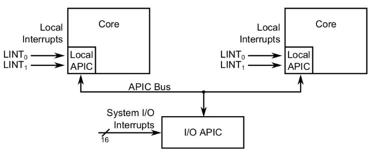

       - Send an interrupt: Interrupt Control Register (ICR) is used to initiate an IPI; values written into it specify the type of interrupt to be sent and the target core

         

         - Upper
           - Reserved: used to enlarge destination field (multiple cores as destination)
         - Lower
           - Destination shorthand: instead of using the destination field we could use these shorthands
           - Delivery mode: attributes of the signal
             - NMI: non maskable
             - INIT: wake up a core
             - Start Up: make the waken up core start executing
           - Vector field: maps to a field of the IDT, this IDT handler runs at the end of each IPI (in IDT are also present exception handlers)
             - When the delivery mode is Start Up the vector fields point to a page frame number (PFN) which is the initial page in which our core will start executing
           - Delivery status
             - Idle: last IPI has been delivered
             - Pending: last IPI is being send
       - Example of core startup assembly code
         ```asm
         # Address Local-APIC via register FS
              mov $sel_fs, %ax
              mov %ax, %fs
         # Broadcast 'INIT' IPI to 'all-except-self'
              mov $0x000C4500, %eax # 11000100010100000000
              mov %eax, %fs:(0xFEE00300)
         # Wait for idle state (busy waiting)     
         .B0: btl $12, %fs:(0xFEE00300)
              jc .B0
         # Broadcast 'Startup' IPI to 'all-except-self' using vector 0x11 to specify entry-point at real memory-address 0x00011000
              mov $0x000C4611, %eax # 110000100011000010001
              mov %eax, %fs:(0xFEE00300)
         # Wait for idle state (busy waiting)     
         .B1: btl $12, %fs:(0xFEE00300)
              jc .B1
         ```
4. Linux kernel boot
   - The Second stage boot loader or the UEFI boot loader loads the initial image of the kernel in memory
   - This is compressed (`vmlinuz`, `z` stands for compression, before was just `vmlinux` so it must be decompressed) because it takes less time to be loaded into memory
   - The entry point of the kernel must be identified by the boot loader
   - RAM after bootloader work

     

     - Unreal mode 
       - Problem 
         - Running in real mode (BIOS can be invoked) will make accessible all memory except the compressed kernel code
         - Running in protected mode (BIOS can't be invoked) you can access compressed kernel
       - Solution: unreal mode
         - We use selectors 

           

           1. Go in protected mode: `CR0.PE = 1`
           2. Write the selector (access to all the memory)
           3. Go back in real mode: `CR0.PE = 0` (you can invoke BIOS now)
           4. The cache is not overwritten so you could use it to write in the compressed kernel memory portion
     - Uncompress kernel

       

       1. In `vmlinuz` these two pieces of memory are present; they are loaded
          - pe = protected mode kernel image (compressed)
          - re = real mode kernel image (uncompressed)
       2. Real mode kernel code is executed; it will switch to protected mode and uncompress the pe
          - Actually before executing real mode kernel code the real mode kernel entry point is executed (which points to the real mode kernel code)
          - Legacy kernel boot sector is no more used

            

   - Initial life of the Linux Kernel

       

      1. First kernel instruction: real mode kernel entry point
         - File: `arch/x86/boot/header.S`
         - First executed instruction is at `_start`
           ```asm
           # They did like this instead of writing directly jmp start_of_setup because jmp is 5 bytes
           _start:
              .byte 0xeb # short (2-byte) jump
              .byte start_of_setup-1f
           1:
           ... (around 300 lines of data and support routines)
           start_of_setup:
           ```
      2. `start_of_setup`: jump to real mode kernel code (`main()`)
         1. Sets up a stack
         2. Zeroes the bss section (global vars)
         3. Jumps to `main()` in `arch/x86/boot/main.c`
         - Kernel still running in real mode
         - This function implements part of the the Kernel Boot Protocol (how the bootloader should give control to the kernel image in order to properly activate it)
         - This is the moment when boot options are loaded in memory
      3. `main()` calls `go_to_protected_mode()`: switch to protected mode (using unreal mode)
         1. Enabling A20 line
         2. Setting up Interrupt Descriptor Table
            - In real mode the Interrupt Vector Table is always at address zero
            - We have to load the IDT into the IDTR register 
              ```c
              // This code ignores all interrupts
              // We are creating a null idt and loading its address in the idtr 
              static void setup_idt(void) {
                static const struct gdt_ptr null_idt = {0,0};
                asm volatile("lidtl %0" :: "m" (null_idt));
              }
              ```
         3. Setup memory
            - Setup the gdt (minimalistic): `setup_gdt()`
              ```c
              // We must craft the TSS (handles different stacks at different rings)
              static void setup_gdt(void){
                static const u64 boot_gdt[] __attribute__((aligned(16))) = {
                  // CS and DS overlap
                  [GDT_ENTRY_BOOT_CS] = GDT_ENTRY(0xc09b, 0, 0xfffff),
                  [GDT_ENTRY_BOOT_DS] = GDT_ENTRY(0xc093, 0, 0xfffff),
                  [GDT_ENTRY_BOOT_TSS] = GDT_ENTRY(0x0089, 4096, 103),
                };
                static struct gdt_ptr gdt;
                gdt.len = sizeof(boot_gdt) - 1;
                // Virtual to physical translation here is done by the OS
                // The gdt pointer is the data segment (ds) shifted by 4 places (x16) plus the offset of boot_gdt
                gdt.ptr = (u32)&boot_gdt + (ds() << 4);
                // Load the pointer in gdtr
                asm volatile("lgdtl %0" :: "m" (gdt));
              }
              ```
         4. Switch to protected mode using `protected_mode_jump()` (see next)
      4. `protected_mode_jump()`: execute a jump to activate protected mode
         - Set the PE (protected mode) bit in CR0 (paging still disabled)
         - Issue a `ljmp` to its very next instruction to load in CS the boot CS selector (finalize entering protected mode)
         - Set up data segments for flat 32 bit mode
         - Set a temporary stack
      5. `startup_32` has a function that decompress the kernel (`bzip`)
         - Set the segments to known values (`__BOOT_DS`)
         - Loads a new stack
         - Clears again the BSS section
         - Determines the actual position in memory via a call/pop (to use KASLR to decompress the kernel at a random position)
           - Call/pop: know where you are in memory

             

             1. `call foo`: push ret addr in stack (current address)
             2. `popq %rax`: is immediately after the call, in `rax` there will be the return address so the current address
           - Kernel Address Space Layout Randomization (KASLR)
             - If you know the binary image of the kernel an attacker patch the memory image of the kernel by writing directly at the correct address in memory
             - At boot time the kernel randomly decides where to decompress itself in memory relying on the most accurate source of entropy available
             - The number of possibilities is reduced because the kernel is mapped using 2 MB pages (kernel must be mapped at the start of a page)
         - Calls `decompress_kernel()` or `extract_kernel()` 
      6. New `startup_32` (decompressed kernel) enables paging and calls `start_kernel()` which finalize the startup of the kernel
         - Clear the BSS segment again
         - Setup a new GDT
         - Enable paging
         - Create the final IDT
         - Jump into the architecture independent kernel entry point (`start_kernel()` at `init/main.c`)
           - `start_kernel()`

             

             - Kernel in `rest_init()` create a new kernel thread which is `/sbin/init`
             - The basic kernel thread goes in idle
           - Initially the kernel initialization is sequential, at a certain point (when the kernel configuration is done) `start_kernel()` will use (already waken up but in idle) CPU cores

             

             - Retrieve the ID of the current core
               - Old: `smp_processor_id()` kernel internal function
               - New: read the CPU ID from APIC
             - Inline assembly: embed in C asm code because some things can't be expressed in C
               ```c
               // Volatile means that you don't want the compiler to reorder the code in respect to the upper and lower "dots"
               
               // ...
               __asm__ __volatile__ (
                 Assembly Template // String keeping one or more assembly instructions
                 : Output Operands // Comma separated list of inputs, which c vars will be used in asm and how you will access them
                 : Input Operands // Comma separated list of outputs, which c vars will be used in asm and how you will access them
                 : Clobbers // A comma separated list of registers or other elements changed by the execution of the instructions
               );
               // ...
               ```
               - [Operands you can use as Input/Output operands](https://gcc.gnu.org/onlinedocs/gcc/Extended-Asm.html)

                 

               - Examples
                 - See last 10 minutes of lesson 2020-03-18
                 - `cpuid`: information about the available hardware
                   ```c
                   void cpuid(int code, uint32_t *a, uint32_t *d) {
                     asm volatile("cpuid"
                      :"=a"(*a), "=d"(*d)
                      :"a"(code)
                      :"ecx","ebx");
                   }
                   ```
                 - `wrmsr/rdmsr`: write/read model specific registers
                   ```c
                   static inline void wrmsr(uint32_t msr_id, uint64_t msr_value) {
                     // Using the modifier "A", the msr_value is split and written in 2 register AX (high part) and DX (low part)
                     asm volatile("wrmsr" :: "c" (msr_id), "A" (msr_value));
                   }
                   static inline uint64_t rdmsr(uint32_t msr_id) {
                     uint64_t msr_value;
                     // The "msr_value" is reconstructed by AX (high part) and DX (low part), joining these two part and returning them in "msr_value"
                     asm volatile("rdmsr" : "=A" (msr_value) : "c" (msr_id));
                     return msr_value;
                   }
                   ```
           - `start_kernel()` function structure
             - `asmlinkage __visible void __init start_kernel(void);`
               - `asmlinkage`: tells the compiler that the calling convention is such that parameters are passed on stack
                 - Calling conventions: how arguments are passed to a function

                   

                   - SysVABI: application binary interface used in Linux systems
                   - Stack
                     - Callee cleanup: the called function removes arguments from the stack
                       - There was `ret n` instruction where `n` was the arguments number
                     - Caller cleanup (x86): the caller function removes arguments from the stack
                       - Used because in C there are variadic functions that are functions that doesn't have a defined number of arguments

                        

                   - Registers

                     

                     - Callee save registers (`rbx, rbp, r12 - r15`): the caller is granted that these registers are preserved by the function called so when the function returns the values of the registers will be the original ones
                     - Caller save registers (others): compiler doesn't grant that the registers used, at the end of the function, still contain the original values, so the caller must save the status of those registers

                     

                 - Why is `asmlinkage` used?

                    

                   - Because in i386 by default user space uses stack to pass arguments while the kernel space uses registers; so we are saying to the kernel to use stack calling convention
                   - So all syscalls are declared using `asmlinkage`
               - `__visible`: prevent Link-Time Optimization
                 - What are Link time optimizations (LTO)?

                   

                   - The linker uses LTO to remove dead code from the executable; let's say a function in an exe will be never used, then it is removed
                   - Why used?
                     - Because `start_kernel()` is called by assembly code which might not explicitly reference the symbol, so the `start_kernel()` would appear as not called and would be removed
               - `__init`: free this memory after initialization
                 - Maps to a specific section
                 - Used because `start_kernel()` will never be used a second time (so is like a garbage collection)
         - Build the page table
           - Problem: to setup memory we need a page table but to setup a page table we need memory to be setup
           - Solution: use page table directory hardcoded in the binary image of the kernel, generated at compile time (swapper page table)
             - Through this we will be able to use paging and we will be able to setup a proper page table (kernel side)
               ```asm
               movl $swapper_pg_dir - __PAGE_OFFSET, %eax # Swapper pg dir is a minimalistic page table which allows to perform virtual to physical translation out of the box
               movl %eax, %cr3 # Set the page table pointer, located in cr3
               movl %cr0, %eax # Load cr0
               orl $0x80000000, %eax # Set paging (PG) bit
               movl %eax, %cr0 # Write back in cr0
               ```
               - Here in `cr3` we need a physical address but `$swapper_pg_dir` is logical
                 - Logical -> linear: using segmentation unit, not a problem because all segments resolve to 0
                 - Linear -> physical: `$swapper_pg_dir - __PAGE_OFFSET`

                   

                   - Between physical and linear (virtual) address space there is a constant offset which is expressed by `__PAGE_OFFSET`, so doing this subtraction we find the physical address of the in-kernel image page directory
                   - This works for x86, in x64 you have canonical addresses but it is more or less the same
                   - For what it concernes memory randomization is the same but the subtraction must keep in consideration the randomized space
             - Early page table organization
               - One level of paging

                 

               - We want to use the free memory to enlarge the page table so that we can map the entire memory

                 

               - What we have to do now
                 1. We need to reach the correct granularity for paging (4 KB)
                 2. We want to map the 1 GB of manageable physical memory
                 3. We need to reorganize the page table in two separate levels
                 4. So we need to determine "free buffers" within the already reachable memory segment to initially expand the page table
                 5. We cannot use memory management facilities other than paging (Kernel level memory manager is not ready yet)
                 6. We need to find a way to know how much physical memory we have
                 7. We're not dealing with userspace memory yet
           - How to 
             - Setup kernel memory management data structures
               - Kernel Page table: keeps the memory mapping for kernel level code and data, used for virtual -> physical translation
               - Core map: map that keeps status information for any frame (page) of physical memory and for any NUMA node (free list of physical memory frames for any NUMA node)
                 - Keep track of the amount of available physical memory
                 - How this memory is being used
                 - Support memory allocation/deallocation
             - To do this use **Bootmem** (memory allocator single threaded included in kernel image that provides allocation capabilities during boot stage)
               - It knows at compile time the memory mapping of the kernel image
               - It maps memory in 4 Kb pages and creates a bitmap that for each page says if it is free or not (compile time)
               - Offers API at boot time to get free buffers
               - It is defined as `__init` so it will be garbage collected

               

               - Construct page table
                 - The swapper page directory points to something like this
                 - First two entry point to two 4 Mb pages

                   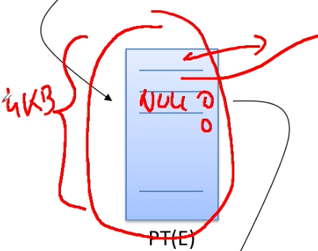

                 - All the other entries are free
                 - So we need to setup the additional 4 Kb pages for the second level page table and link from the swapper paging directory to there

                   

               - Note: the Logical Memory Block (LMB) allocator has superseded Bootmem
                 - The idea behind it is that available memory is larger and addressing is more scattered so free memory bitmask of bootmem is no more useful
                 - Memory is represented as two arrays of regions
                   - Physically contiguous memory
                   - Allocated regions
                 - `memblock_add[_node]` it registers a physical memory range in the list of regions you have for a specific node
                 - `memblock_reserve()`: mark a range of memory as busy (reserve area)
                 - `memblock_find_in_range()`: find an aligned free area in given range
         - Practical example: how Linux handles paging
           - Initially Linux had 2 page levels, then switched to 3 (4 and 5 levels are nowadays usable)

             

           - Problem: Linux wanted to don't worry about how different architectures handle paging (how many bits are used in the offset part for example)
           - Solution: define various architecture dependent lengths in kernel headers and macros to use them
             - SHIFT macros specify the length in bit mapped to each PT level
               ```
               arch/x86/include/asm/pgtable-3level_types.h
               arch/x86/include/asm/pgtable-2level_types.h
               arch/x86/include/asm/page_types.h
               arch/x86/include/asm/pgtable_64_types.h
               ```

               

               - How many bits you need to shift right to observe a single field
             - MASK macros are used to retrieve higher bits and SIZE macros reveal how many bytes are addressed by each entry 

               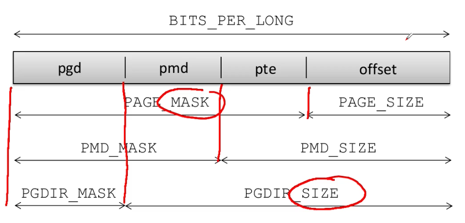

             - PTRS_PER_x macros which determine the number of entries in each level of the page table
               ```c
               // In this case the second level is just a single entry, so it doesn't count
               #define PTRS_PER_PGD 1024
               #define PTRS_PER_PMD 1
               #define PTRS_PER_PTE 1024
               // In this case the second level is used
               #define PTRS_PER_PGD 512
               #define PTRS_PER_PMD 512
               #define PTRS_PER_P 512
               ```
           - Page table data structures
             - C types for the definition of the content of the page table entries are defined
               ```c
               // NOT OK because in this case the assignements don't raise any error or warning, so bugs will appear while running!!
               typedef unsigned long pgd_t;
               typedef unsigned long pte_t;
               pgd_t x; pte_t y;
               x = y;
               y = x;
               // OK, the previous assignment in this case raises an error, USEFUL!
               typedef struct { unsigned long pte_low; } pte_t;
               typedef struct { unsigned long pmd; } pmd_t;
               typedef struct { unsigned long pgd; } pgd_t;
               ```
           - Bit fields: definitions of the fields proper of page table entries (defined also above)
             ```c
             #define _PAGE_BIT_PRESENT 0 /* is present */
             #define _PAGE_BIT_RW 1 /* writeable */
             #define _PAGE_BIT_USER 2 /* user space addressable */
             #define _PAGE_BIT_PWT 3 /* page write through */
             #define _PAGE_BIT_PCD 4 /* page cache disabled */
             #define _PAGE_BIT_ACCESSED 5 /* accessed (raised by CPU) */
             #define _PAGE_BIT_DIRTY 6 /* was written (raised by CPU) */
             ```
             - Example usage
               ```c
               pte_t x;
               x=...;
               if((x.pte_low) & _PAGE_PRESENT) {
                 /* the page is loaded in a frame because we are doing & with the present bit */
               } else {
                 /* the page is not loaded in any frame; is it swap?? */
               };
               ```
           - Other useful macros for checks
             ```c
             // Is this a page table?
             #define _PAGE_TABLE (_PAGE_PRESENT | _PAGE_RW | _PAGE_USER /* page user is the difference here */ | _PAGE_ACCESSED | _PAGE_DIRTY)
             // Is this a kernel page table?
             #define _KERNPG_TABLE (_PAGE_PRESENT | _PAGE_RW | _PAGE_ACCESSED | _PAGE_DIRTY)
             ```
           - Initialization steps in order to setup virtual to physical translation

             

             - `setup_arch`: what described above, use defined macros to allocate pages based on the architecture 
             - `pagetable_init()`: allocate pages using bootmem
               - Example (old version of the kernel)
                 ```c
                 // 3 loops because 3 levels of paging
                 for(; i < PTRS_PER_PGD; pgd++, i++) {
                   vaddr = i * PGDIR_SIZE; /* starting to map from 3GB */
                   if(end && (vaddr >= end)) break; // If reached the end of the kernel in memory you can stop
                   pmd = (pmd_t*)pgd; /* pgd initialized to (swapper_pg_dir + i) */
                   // .........
                   for(j = 0; j < PTRS_PER_PMD; pmd++, j++) { // j could also be 1
                     // .........
                     pte_base = pte = (pte_t*)alloc_bootmem_low_pages(PAGE_SIZE); // PAGE_SIZE = 4 KB
                     for(k = 0; k < PTRS_PER_PTE; pte++, k++) { // For each entry of the PTE
                       vaddr = i*PGDIR_SIZE + j*PMD_SIZE + k*PAGE_SIZE; // Compute virtual address that you are going to represent in that page table; this can be calculated matematically simply knowing the sizes of various entries and their number
                       if(end && (vaddr >= end)) break; // If reached the end of the kernel in memory you can stop
                       // .........
                       *pte = mk_pte_phys(__pa(vaddr), PAGE_KERNEL); // Set the page allocated as kernel page; you need physical address (because managed by the firmware) to do this so you use __pa(vaddr) which transforms a virtual into a physical address
                       // Here you have populated all the PTE
                     }
                     set_pmd(pmd, __pmd(_KERNPG_TABLE + __pa(pte_base))); // Write in the higher level PMD the address of the lower level PTE
                     // So you start populating lower levels, once you're done you start with higher levels 
                     // .........
                   }
                 }
                 ```
                 - Macros used
                   - `#define set_pmd(pmdptr, pmdval) (*(pmdptr) = pmdval)`
                     - `pmdptr`: pointing to an entry of the PMD of type `pmd_t`
                     - `pmdval`: value to assign of `pmd_t` type
                   - `#define __pa(x) ((unsigned long)(x) - PAGE_OFFSET)`: virtual to physical translation using the `PAGE_OFFSET` because we are doing a contiguous allocation
                     - Linux sets up a direct mapping from the physical address `0` to the virtual address `PAGE_OFFSET` at 3GB on i386
                     - The opposite can be done using the `__va(x)` macro
                   - `mk_pte_phys(physpage, pgprot)`: builds a complete PTE entry which includes the physical address of the target frame
                     - `physpage`: frame physical address of type unsigned long
                     - `pgprot`: bitmask
               - Visual explanation of the above code

                 
                 
                 - Initially page swapper table has 2 entries that point to 2 4 Mb physical spaces
                 - The, incrementally, 2 page tables are crafted (sequentially)
                 - So that the page swapper table entries will then point to the new page tables created and the granularity of the pages will increase (4 MB -> 4 KB)
                 - This is done not only for the first two swapper table entries but for all until the kernel memory is fully mapped 
               - Loading the page table
                 - When `pagetable_init()` returns the new page table is built but CPU is still relying on the old page table (because of TLB)
                 - Solution: `load_cr3(swapper_pg_dir); __flush_tlb_all()` load new page table and flushes old TLB
                   - `load_cr3()`
                     ```c
                     static inline void load_cr3(pgd_t* pgdir) {
                       native_write_cr3(__pa(pgdir));
                     }
                     ```
                     - `native_write_cr3()`
                       ```c
                       static inline void native_write_cr3(unsigned long val) {
                         asm volatile(
                           "mov %0, %%cr3"
                           :: "r" (val), "m" (__force_order) // __force_order = dummy global variable to force serialization
                         );
                       }
                       ```
                     - All this boils down to a single `mov` instruction
                   - `__flush_tlb_all()`
                     - The degree of automation in the management process of TLB entries depends on the hardware architecture
                     - Kernel hooks exist for explicit management of TLB
                     - In Intel flush is automatically done when overwriting `cr3`
                     - Changes inside the current page table are not automatically reflected into the TLB
                     - TLB management events
                       - Families
                         - Scale
                           - Global: dealing with virtual addresses accessible by every CPU core in real time concurrency
                           - Local: dealing with virtual addresses accessible in time sharing concurrency 
                         - Typology
                           - Virtual to physical address remapping (ex: context switch)
                           - Virtual address access rule modification (read only vs write access): `mprotect`
                       - Typical management: TLB implicit renewal via flush operations
                     - TLB flush costs
                       - Direct costs
                         - Latency of the firmware level protocol for TLB entries invalidation
                         - Latency for cross CPU coordination in case of global TLB flushes
                       - Indirect costs
                         - TLB renewal latency by the MMU firmware upon misses in the translation process of virtual to physical addresses
                     - Functions
                       - `void flush_tlb_all(void)`: flushes the entire TLB on all processors running in the system (most expensive TLB flush operation)
                         - After it completes all modifications to the page tables are globally visible
                         - This is required after the kernel page tables which are global in nature have been modified
                       - `void flush_tlb_mm(struct mm_struct *mm)`: flushes all TLB entries related to a portion of the userspace memory context
                         - `mm_struct`: struct that permits to deal with user space memory mappings
                         - On some architectures (MIPS) this is required for all cores (usually it is confined to the local processor)
                       - `void flush_tlb_page(struct vm_area_struct *vma, unsigned long addr)`: flushes a single page from the TLB
                         - `vm_area_struct`: permits to manage a portion of user space memory
                         - `addr`: address contained in the page you want to flush (maybe)
                         - Flush the TLB after a page has been faulted in or has been paged out
                       - `void flush_tlb_range(struct mm_struct *mm, unsigned long start, unsigned long end)`: flushes all entries within the requested userspace range for the `mm context`
                         - Used after a region has been moved (`mremap()`) or when changing permissions (`mprotect()`)
                       - `void flush_tlb_pgtables(struct mm_struct *mm, unsigned long start, unsigned long end)`: flushes a set of page tables, used when the page tables are being torn down and freed
                       - `void update_mmu_cache(struct vm_area_struct *vma, unsigned long addr, pte_t pte)`: preload TLB entries when a new translation exists at `pte` for the virtual address `addr`
             - `zone_sizes_init()`: discovery physical memory
         - We have just finished `rest_init()`

           

         - Setting up the Final GDT and IDT
           - We have seen that during initialization the kernel installs a dummy IDT
             ```c
             static void setup id_t(void) {
               static const struct gdt_ptr null_idt = {0, 0};
               asm volatile("lidtl %0" :: "m" (null_idt));
             }
             ```
           - After having initialized memory it's time to setup the final GDT and IDT; in `start_kernel()`, after `setup_arch()` we find a call to `trap_init()` which populates the IDT
           - Populating GDT: final GDT

             

         - Final jump

           

           ```c
           // cpu_idle()
           static void cpu_idle_loop(void) {
             while(1) { // Infinite loop executed by PID 0
               while(!need_resched()) { // If there is no need to reschedule sleep until new interrupt
                 cpuidle_idle_call();
               }
               // If there is need of rescheduling
               schedule_preempt_disabled(); // Deschedule me, there is something more important to be done
             }
           }
           
           static inline void native_halt(void) {
             asm volatile("hlt" ::: "memory"); // Halt the execution until the next hardware interrupt received
           }
           ```
           - So now the kernel just sleeps
         - First kernel thread that is now the init system

           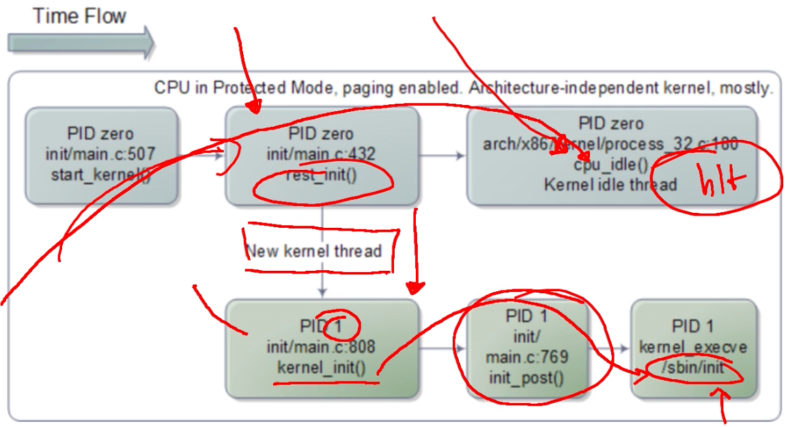

### Building the kernel

- Compile the kernel
  1. Configure the build system telling what are the elements that we want to compile in the linux kernel
     - Explanation
       - Config files
         - Kconfig files: define each config symbol and its attributes such as its type description and dependencies; programs that generate an option menu tree (`make menuconfig`) read the menu entries from these files
           ```bash
           # This config file should be presented to the user in the "Character devices" section of the build menu
           menu "Character devices"
           
           config DUMMY_CHAR # Symbol defined to say that we want to compile this module
            tristate "DummyChar device support" # Tristate: not/yes/module
            ---help---
              Say Y here if you want to add support for the DummyChar device.
              If unsure say N.
              To compile this driver as a module choose M here: the module will be called dummy.
              
           config DUMMY_STAT # Example module for dummy char statistics
            bool "dummy statistics" # bool: yes/no
            depends on DUMMY_CHAR # Self explanatory
            ---help---
            Say Y here if you want to enable statistics about the DummyChar device.
           ```
         - .config file: stores each config symbol's selected value; you can edit this file manually or use one of the many make configuration targets such as `menuconfig` and `xconfig` that call specialized programs to build a tree like menu and automatically update and create the config file for you
         - Upper-Level Makefiles: normal GNU make files that describe the relationship between source files and the commands needed to generate each make target such as kernel images and modules
         - Kbuild Files: special flavor of Makefiles used by the kernel to instruct how to build subsystems; define the files to be built, any special compilation options and any sub directories to be entered recursively
           - `obj-y += foo.o`
             - We want add to the live image of the Kernel the object `foo.o` which is automatically built from `foo.c` or `foo.S`
             - `obj-y`: `y` stands for "yes"
             - Kernel linking
               - These compiled files will be included in the `vmlinux` image; then these files will be merged in one (`built-in.o`) by the linker
               - The final linking is carried out via the `link-vmlinux.sh` script
                 - vmlinux is linked from the objects selected by `$(KBUILD_VMLINUX_INIT)` and `$(KBUILD_VMLINUX_MAIN)`
                 - `$(KBUILD_VMLINUX_INIT)` must come first (placed in the init portion of the kernel loaded in memory)
                 - `kallsyms` (kernel system map) is placed in the kernel image: `built-in.o` file and transforms in `kallsyms` file (just a text file which enumerates all the function and variable that we have)
                   - So in `kallsyms` there is the address of every function of `built-in.o` (more or less the whole executable kernel); to `kallsyms` offsets must be added `kaslr` and maybe other offsets 
                   - Contains a mapping between symbols and virtual memory locations (determined at compile/link time) for Steady state Kernel functions and Kernel data structures
                   - Symbols are associated with "storage class"
                     - `T`: global (non static but not necessarily exported) function
                     - `t`: function local to the compilation unit (static) (blocked to external modules)
                     - `D`: global data
                     - `d`: data local to the compilation unit (blocked to external modules)
                     - `R/r`: same as `D/d` but for read only data
                   - System map is also partially reported by the pseudo file `/proc/kallsyms`; if opened without privileges addresses aren't shown (prevent leaking of addesses bypassing kaslr), if opened as root addresses are shown
                     - `%pK` (executed in a print) is used to perform this
                       - In a non-root context, we willl receive NULL pointer
                       - In a root context, we will receive the actual address
           - `obj-m += foo.o`
             - We want something as a kernel module, replace `y` with `m`
             - `foo.o` will be later, by the "Make modules command", transformed in `.ko` file (loadble kernel module)
           - `obj-$(CONFIG_FOO) += foo.o`
             - `$(CONFIG_FOO)` could be `y/m/n`
     - Commands: `make menuconfig / nconfig / xconfig / gconfig`
  2. Compile the kernel (long)
     - `make -jX`: `X` is the number of cores used (usually set to `n + 1`)
     - The just created image is the one that will be executed
  3. Compile modules: in step 1 you can choose if some parts of the kernel should be compiled as modules (loaded at runtime)
     - `make modules`
  4. Install modules in the correct directory
     - `make modules_install`
  5. Install the kernel image
     - `make install`
  6. Install headers: modules that allow to develop additional kernel modules
     - `make headers_install`
  7. Optional: build an init ramdisk (`initrd`)
     - Explanation 
       - It's a filesystem that will be loaded in memory with the kernel at startup; is used to install kernel modules at startup time, after identifying what hardware is running on the machine
       - Typically it is an archive in the CPIO format: `lsinitcpio /boot/initramfs-linux.img`
       - This filesystem is then replaced by the actual root filesystem; for security reasons root can't be unmounted so you have to move the content of `/` to another folder and then unmount the initial ramdisk
     - How to create an `initrd`
       1. `mkdir -p init/initramfs/{bin,sbin,etc,proc,sys,newroot}`
          - `init/initramfs` is a temp folder
          - The root filesystem structure is replicated in this temp folder
          - `newroot` will contain the to-be-mounted root (the disk); then these two will be swapped
       2. `cd init && touch initramfs/etc/mdev.conf`
       3. Copy in the archive all tools which respect the Single UNIX Specification (ex: BusyBox)
       4. Provide an implementation of `/init`: if the Linux Kernel finds an initrd image (which will be loaded by the Bootloader), Linux will try to activate the process `/init`, so we have to provide an implementation of this process (PID 1 will be the init process)
          ```bash
          #!/bin/sh
          
          # Create proc and sysfs
          mount -t proc proc /proc
          mount -t sysfs sysfs /sys
          
          # Disable kernel prints, now kernel prints will be seen only using dmesg
          echo 0 > /proc/sys/kernel/printk
          clear
          
          # Install busybox
          busybox --install -s
          
          # Create devices, numbers tells what type of devices they are
          mknod /dev/null c 1 3
          mknod /dev/tty c 5 0
          mdev -s # Save settings in the mdev file created before
          
          # You can parse /proc/cmdline to get actual values (directives of kernel configuration)
          init="/sbin/init" # Actual init binary (not this script, the init system)
          root="/dev/hda1" # Actual root hd
          mount "${root}" /newroot # Mount root hd in /newroot
          
          # If the init system is present in the new mounted root then we switch from initrd to actual root
          if [[ -x "/newroot/${init}" ]];
          then
            umount /sys/proc
            # switch_root just sets /newroot to the new root partition; then it calls "${init}"
            # WARNING: switch_root removes recursively all files and directories on the current root filesystem (initrd, actual newroot, old /)
            exec switch_root /newroot "${init}"
          fi
          
          # If something goes wrong drop a shell
          echo "Failed to switch_root, dropping to a shell"
          exec sh
          ```
          - `switch_root` calls the syscall `mount(newroot, "/", NULL, MS_MOVE, NULL)`: using the `MS_MOVE` directory **the move is atomic**; if `MS_MOVE` is not used the os will crash
  8. Tell the bootloader where to find the image of the kernel and the eventual image of the ramdisk in the system
     - `grub-mkconfig -o /boot/grub/grub.cfg`

### Memory management

- During the boot the Kernel relies on a temporary, not efficient, memory manager that at a steady state is replaced by a more complex one; this must also discover how much physical memory is available and how it is organized
- NUMA Nodes Organization
  - A node is organized in a `struct pglist_data` (even in the case of UMA) typedefd to `pg_data_t`
    ```c
    typedef struct pglist_data {
      zone_t node_zones[MAX_NR_ZONES]; // ZONE (portions of numa nodes)
      zonelist_t node_zonelists[GFP_ZONEMASK+1];
      int nr_zones;
      struct page *node_mem_map; // Available frames in this numa node
      unsigned long *valid_addr_bitmap;
      struct bootmem_data *bdata;
      unsigned long node_start_paddr;
      unsigned long node_start_mapnr;
      unsigned long node_size;
      int node_id;
      struct pglist_data *node_next;
    } pg_data_t;
    ```
    - Nodes are divided into zones
      ```c
      #define ZONE_DMA      0 // Physical memory area < 16MB, used by the direct memory access controller
      #define ZONE_NORMAL   1 // Physical memory area 16 - 896MB, the actual area used by the kernel
      #define ZONE_HIGHMEM  2 // Physical memory area > 896MB, to use it you must use the page table (in NORMAL not because there is a direct virtual/physical memory mapping), user space 
      #define MAX_NR_ZONES  3
      ```

      

      - Userspace is typically taken from "High-memory region"
      - Userspace applications could and actually do map some parts of Physical memory of the Kernel in particular because those are the buffer which use to transfer the data for I/O (but this is an exception)
      - "Low Memory" has the benefit that "virtual to physical translation" is Direct Mapping; this is the area more used and more suitable for the implementation of OS services
    - Zones initialization
      - Zones are initialized after the kernel page tables (LowMem in the figure above) have been fully setup by `paging_init()`
      - The goal is to determine what parameters to send to
        - `free_area_init()`: for UMA machines
        - `free_area_init_node()` for NUMA machines
      - These two functions are based on PFN (Page frame numbers)
        - `PFN * size_of_a_frame = physical_address`
        - Max PFN is read from BIOS (e820 table)

          

          - The reserved portion between the two usable is the BIOS memory
          - The second usable portion is the actual memory
    - Zones data structure
      ```c
      typedef struct zone_struct {
        spinlock_t lock;
        unsigned long free_pages;
        zone_watermarks_t watermarks[MAX_NR_ZONES];
        unsigned long need_balance;
        unsigned long nr_active_pages, nr_inactive_pages;
        unsigned long nr_cache_pages;
        free_area_t free_area[MAX_ORDER]; // Max 11
        wait_queue_head_t *wait_table;
        unsigned long wait_table_size;
        unsigned long wait_table_shift;
        struct pglist_data *zone_pgdat;
        struct page *zone_mem_map; // Describes a physical frame
        unsigned long zone_start_paddr;
        unsigned long zone_start_mapnr;
        char *name;
        unsigned long size;
        unsigned long realsize;
      } zone_t;
      ``` 
  - Every node in the system is kept on a NULL terminated list called `pgdat_list`
  - Each node is linked to the next with the field `pg_data_t->node_next`
    - In UMA systems only one static `pg_data_t` structure called `contig_page_data` is used
  - Global `pgdat_list` has been removed, substituted by global `struct pglist_data *node_data[]`
  - Macros to iterate over node data
    - `for_each_online_pgdat()`
    - `first_online_pgdat()`
    - `next_online_pgdat(pgdat)`
  - Nodes, Zones and Pages Relations

    

    - `pg_data_t` contains nodes
    - In each node there are `node_zones` that describe a zone of the node
    - In each zone there is a `zone_mem_map` which contains various `pages` 
  - Core map (`zone_mem_map`)
    ```c
    typedef struct page { // These structs are organized in linked lists
      struct list_head list;          /* ->mapping has some page lists. */
      struct address_space *mapping;  /* The inode (or ...) we belong to. */
      unsigned long index;            /* Our offset within mapping. */
      struct page *next_hash;         /* Next page sharing our hash bucket in the page cache hash table. */
      atomic_t count;                 /* Usage count, see below. */
      unsigned long flags;            /* atomic flags, some possibly updated asynchronously */
      struct list_head lru;           /* Pageout list, eg. active_list; protected by pagemap_lru_lock!! */
      struct page **pprev_hash;       /* Complement to *next_hash. */
      struct buffer_head *buffers;    /* Buffer maps us to a disk block. */
      #if defined(CONFIG_HIGHMEM) || defined(WANT_PAGE_VIRTUAL)
      void *virtual;                  /* Kernel virtual address (NULL if not kmapped, ie. highmem) */
      #endif /* CONFIG_HIGMEM || WANT_PAGE_VIRTUAL */
    } mem_map_t;
    ```
    - `zone_mem_map` points to the first page and then each page contains prev and next pointers; this linked list is contained in `struct list_head list` (i think more or less like this: `page->list->next`)
    
      
    
    - `atomic_t count`
      - `atomic_t`: you want to provide atomic operations on this variable
      - This variable defines how many users (how many times is this frame allocated) you have for this specific page frame; so when you deallocate a frame you can reuse it
    - `unsigned long flags`: status bits for the frame
      - Flags list and management

        

    - Differences between UMA and NUMA
      - UMA
        - Initially we only have the core map pointer (`mem_map`)
        - Pointer initialization and corresponding memory allocation occur within `free_area_init()`
        - After initializing each entry will keep the value 0 within the count field and the value 1 into the `PG_reserved` flag within the `flags` field
          - So no one is using the entries but they are reserved (so no one can use them)
          - This because we don't want to create ambiguity between the core map and the boot memory allocator; just when the boot memory allocator will transfer completely the control to the core map and kill itself the core map will start working
        - Frame un-reserving will take place later via the function `mem_init()` by resetting the bit `PG_reserved`
      - NUMA
        - There is not a global `mem_map` array
        - Every node keeps its own map in its own memory
        - This map is referenced by `pg_data_t->node_mem_map`
        - The rest of the organization of the map does not change
- Frame allocator (memory allocator that deals with zones, lowest level): **Buddy System**

  

  - Coalescing: "merge" two buddies
  - One frame has just one buddy
  - When more memory is requested i go up the tree

  

  - If i want to use 8 Kb but the first (marked in red) is used then i can not use it and his buddy but i have to find another buddies couple (this is true also if are requested for example 16 kb etc..)
  - This system is very fast because you don't have to look at all levels, you already know at what level you should look to find the amount of memory you are searching for; but it generates fragmentation
    - External

      

    - Internal

      

  - Data structures used
    ```c
    typedef struct free_area_struct {
      struct list_head list; // List of free pages
      unsigned int *map; // Allocation state of the buddies
    } free_area_t
    
    struct list_head {
      struct list_head *next, *prev;
    }
    ```
    - `free_area_t`

      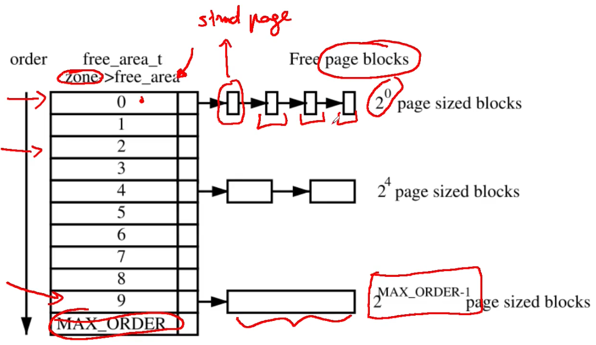

      

      

      - We start dividing memory in two buddies (this is done "recursively" until the correct granularity is found)

      

      - When we want to deallocate a memory frame we do the opposite of what we have done previously; we free the block and find its buddy, if its buddy is free then we coalesce them together (this is done recursively)
        - This isn't done with ALL the level 0 blocks because we want to keep an amount of them "ready"
      - Spinlock: used to protect from race conditions (two threads allocate the same block)
      - Bitmap `*map` semantic
        - Linux saves memory by using one bit for a pair of buddies (fragmentation bit)
        - Each time a buddy is allocated or freed the bit representing the pair is toggled
          - `0`: the pages are both free or allocated
          - `1`: only one buddy is in use
  - Reclaiming boot memory
    - Once we have setup the Buddy System and it is ready to serve memory requests we can disable the Bootmem Allocator and we give back that memory to the Buddy System and it starts to serve memory requests
      - Everything belonging to the `__init` section of the Kernel will be destroyed; at this time, we already have started up the OS and so we can also reclaim physical frames associated to data structures used for Bootstrap procedure, the code used to Boot the Kernel (i.e. the code to unzip binary image of the Kernel loaded in memory by th 2° stage Bootloader)
        - All this memory is no longer required because it is a "one-shot" execution code, so, this memory belonging to the `__init` section will be given back to the Buddy System that will reuse this memory to serve memory requests
    1. The finalization of memory management init is done via `mem_init()` which destroys the bootmem allocator
       - This function will release the frames by resetting the `PG_RESERVED` bit
    2. For each freed frame the function `__free_page()` is invoked
       - This gives all the pages in `ZONE_NORMAL` to the buddy allocator
    3. The reference `count` within the corresponding entry gets set to 1 since the kernel maps that frame anyway within its page table
  - Finalizing Memory Initialization
    ```c
    static unsigned long __init
    free_all_bootmem_core(pg_data_t *pgdat) { // Free all memory managed by the bootmem allocator
      // ...............
      // Loop through all pages in the current node
      for(i=0; i < idx; i++, page++) {
        // Scan the whole map and check if every bit is not set;
        // if so that page isn't used by the bootmem allocator
        // so we can allocate it; else we can't touch it
        if(!test_bit(i, bdata->node_bootmem_map)) {
          count++;
          ClearPageReserved(page); // We set the page as unused
          // Fake the buddy into thinking it's an
          // actual free, so set the page count to 1
          set_page_count(page, 1);
          __free_page(page); // Release memory
        }
      }
      total += count;
      // ...............
      return total;
    }

    // Now the buddy system has the control of the memory which is "configured", bootmem allocator no more exists
    ```
  - Allocation contexts: describe the criticality of the memory allocation you are performing
    - Process context: allocation due to a system call (running kernel code, this is allocating something for some user space process)
      - Priority based approach: how important is this memory allocation?
      - User space allocation is not so important so if it cannot be served wait along the current execution trace (simply wait until free memory is available)
    - Interrupt: allocation due to an interrupt handler (usually requested by devices)
      - Priority independent schemes: as you are no more listening to interrupts when an interrupt is triggered you must handle it fast
      - If it cannot be served no actual waiting time
  - Basic Kernel Internal Memory management API
    - Memory management subsystem exposes API to other kernel subsystems
    - Page allocation
      - `unsigned long get_zeroed_page(int flags)`: take a frame from the free list, zero the content and return its virtual address
      - `unsigned long __get_free_page(int flags)`: take a frame from the free list and return its virtual address
      - `unsigned long __get_free_pages(int flags, unsigned long order)`: take a block of contiguous frames of given `order` (remember buddy system order) from the free list
    - Page deallocation (passing a wrong `addr` or `order` might corrupt the Kernel)
      - `void free_page(unsigned long addr)`: put a frame back into the free list
      - `void free_pages(unsigned long addr, unsigned long order)`: put a block of frames of given `order` back into the free list
    - `flags` parameter: used to specify the allocation context
      - Interrupt context
        - `GFP_ATOMIC`: interrupt context, the call cannot lead to sleep
      - Process context
        - `GFP_USER` (low priority): used to allocate memory for userspace related activities, the call can lead to sleep
        - `GFP_BUFFER`: used to allocate a buffer, the call can lead to sleep
        - `GFP_KERNEL` ("high" priority): used to allocate Kernel memory, the call can lead to sleep
  - NUMA allocation
    - On NUMA systems we have multiple nodes
    - UMA systems eventually invoke NUMA API but the system is configured to have a single node
    - Core memory allocation API
      - `struct page *alloc_pages_node(int nid, unsigned int flags, unsigned int order)`: specifies a node ID (so we specify from which NUMA node we want the allocation to be executed)
      - `__get_free_pages()`: calls `alloc_pages_node()` specifying a NUMA policy (so we don't have to specify a node ID)
        - Numa policies: determine what NUMA node is involved in a memory operation
          - Since Kernel 2.6.18 userspace can tell the Kernel what policy to use
            ```c
            #include <numaif.h>
            int set_mempolicy(int mode, unsigned long *nodemask, unsigned long maxnode);
            ```
            - `mode` can be
              - `MPOL_DEFAULT`: if you're running on a core then you will get memory from the NUMA node in which the core is working
              - `MPOL_INTERLEAVE`: round robin between NUMA nodes
              - `MPOL_PREFERRED`: tell that you want a specific NUMA node but if it's busy it's not a problem
              - `MPOL_BIND`: same as `PREFERRED` but if the node is busy then the memory allocation fails
            - `nodemask`: set of NUMA nodes in which you want to perform that policy change
          - Set the NUMA memory policy which consists of a policy mode and zero or more nodes for the memory range starting with `addr` and continuing for `len` bytes
            ```c
            #include <numaif.h>
            int mbind(void *addr, unsigned long len, int mode, unsigned long *nodemask, unsigned long maxnode, unsigned flags);
            ```
          - Moving pages around: moves the specified `pages` of the process `pid` to the memory nodes specified by `nodes`, result of the move is reflected in `status`
            ```c
            #include <numaif.h>
            long move_pages(int pid, unsigned long count, void **pages, const int *nodes, int *status, int flags);
            ```
  - Normal memory: always mapped and visible to all cores ("static" page table) so there will never be a TLB flush

    

  - High memory: when allocating something you have to construct the page table (so possible TLB flushes)

    

    - When the size of physical memory approaches/exceeds the maximum size of virtual memory it is impossible for the kernel to keep all of the available physical memory mapped
    - High memory is the memory not covered by a permanent mapping
    - The Kernel has an API to allow temporary mappings
    - This is where userspace memory comes from
    - NOTE: in 64 bit systems the high memory has direct mappings if the size of physical memory DOESN'T approaches/exceeds the maximum size of virtual memory
    - API
      - Allocation
        - `vmap()`: used to make along duration mapping of multiple physical pages (in a virtually contiguous space)

          

        - `kmap()`: it permits a short duration mapping of a single page; it needs global synchronization but is amortized somewhat
        - `kmap_atomic()`: permits a very short duration mapping of a single page which is restricted to the CPU that issued it (update the page table only locally)
          - As this change is only local if someone else wants this piece of memory everythin will break so the issuing task is required to stay on the initial CPU until it has finished 
      - Deallocation

        

        - Problem: deallocation is harder because there could be two virtual mappings that refer to some same portions of physical memory; so when the first mapping wantas to be deallocated it can't because the last physical frame is used also by someone else
        - Solution: Kernel maintains an array of counters (`static int pkmap_count[LAST_PKMAP]`)
          - For each memory page who is using that memory (one counter for each high memory page)
            - `0`: page is not mapped
            - `1`: page not mapped now but used to be
            - `n > 1`: page was mapped `n - 1` times
        - `kunmap(page)`: decrements the associated reference counter (`pkmap_count`)
          - When the counter is 1 mapping is not needed anymore
          - CPU still has cached that mapping so the mapping must be invalidated (before setting the reference counter to 0)
          - With multiple CPUs all of them must do it: `__flush_tlb_all()` (before setting the reference counter to 0)
  - Frequent Allocations/Deallocations: buddy system here does not scale
    - Problems
      - Internal fragmentation rise too much
      - Spinlock delay
    - Example
      - Allocation/release of page tables at any level is very frequent so we want to perform these operations quickly
        - API
          - Allocation
            - `pgd_alloc()`
            - `pmd_alloc()`
            - `pte_alloc()`
          - Deallocation
            - `pgd_free()`
            - `pmd_free()`
            - `pte_free()`
    - Solution: rely on one of Kernel level fast allocators, some sort of middleman between high level and the buddy system
      - Types
        - Paging: `quicklists` (get single pages)
          - List of per-core page lists
          - There is no need for synchronization (every core access its cache and only one thread is running simultaneously per CPU core)
          - If allocation fails, they revert to `__get_free_page()` (buddy system)
          ```c
          // nr: Per core you have multiple quicklists
          // flags: if you need to fall back to buddy system what is the allocation context?
          static inline void *quicklist_alloc(int nr, gfp_t flags, ...) {
            struct quicklist *q;
            // Double pointer used to use the first field of a page as the next pointer
            void **p = NULL;
            // Depending on the CPU core you are running you will get a different address
            // How? See below
            q = &get_cpu_var(quicklist)[nr];
            // The head of a quicklist is a page
            p = q->page;
            // If p is not null (see below explanation)
            if(likely(p)) {
              // The head of the list is pointing to the next element
              q->page = p[0];
              // The previous head points to null now
              p[0] = NULL;
              // Decrease the number of available pages
              q->nr_pages--;
            }
            // Preemptable kernel, see below
            put_cpu_var(quicklist);
            // Recheck if the page returned is valid
            if(likely(p))
              return p;
            // If the head page is null then fall back to buddy system
            p = (void*)__get_free_page(flags | __GFP_ZERO);
            return p;
          }
          ```
          - Depending on the CPU core you are running you will get a different address
            - How it works
              - `get_cpu_var(quicklist)[nr]`: this means that we are retrieving the `id` of the current core, we are multiplying (i think) it for the `quicklist` address, and getting the `nr` quicklist (because `quicklist` contains a vector of quicklists)
            - Costly method: use `cpuid` (implements a memory barrier) and multiple deallocations (a lot of asm, costly)
            
              

            - Faster method: use the `%gs` (`%fs` in windows) segment selector (local to each CPU) which points to the same entry of the GDT but, since you have a GDT per core then the entry will be different; loading a variable boils down to a `mov` where the variable is referenced adding its offset to `%gs` 

              

          - `if(likely(p))`: what is done in here

            

            

          - Preemptable kernel: as a task (also at kernel level) can be scheduled and descheduled (and when this happens the rescheduling might happen on a different CPU core, so we could access wrong variables) so when `get_cpu_var(quicklist)` is called the preemption is disabled for the current CPU core; this is reenabled using the `put_cpu_var(quicklist)`
          - `likely/unlikely`: tell the compiler to reorder instructions so that you have the most likely/unlikely execution path directly into the pipeline
            - `#define likely(x) __builtin_expect(!!(x), 1)`
            - `#define unlikely(x) __builtin_expect(!!(x), 0)`
        - General buffers: `slab allocator` (use caches, when these are full ask the buddy system to allocate new memory)
          - Implementations
            - SLAB
              - Works using slabs which are groups of pages, on top of these pages we have an object (buffer) allocator which tries to reuse memory

                

                - Slabs full: no space for new allocations
                - Slabs partial: previously used buffers to be reused, some objects are allocated and some not
                - Slabs free: free slabs
                - Transformations
                  - Slab partial allocated -> Slab full
                  - Slab full deallocated -> Slab partial
                  - Slab partial deallocated -> Slab free
                  - Slab free allocated -> Slab partial
                - The cache contains slabs for a long time, it will give back memory to the buddy system if Slabs free are too much or if the buddy allocator triggers (oom) some memory recovery policies (buddy system asks all the caches to free memory)
                - If Slabs partial and Slabs free are not available then you ask the buddy system for a certain amount of "new" pages
                - Caches handle objects of different size
              - API
                - `void *kmalloc(size_t size, int flags)`: allocation of contiguous physical kernel memory (zone normal)
                  - Returns the virtual address
                  - `size` of the allocation given (that will map to the correct slab)
                  - `flags` are always used in case of a fall back to the buddy system
                - `void kfree(void *obj)`: frees kernel memory allocated via `kmalloc()` given the allocated object `obj`; it will simply put back the buffer into the slab allocator
                - `void *kmalloc_node(size_t size, int flags, int node)`: NUMA-aware allocation (specify the NUMA node)
              - Available Caches
                - Up to 3.9.11
                  ```c
                  struct cache_sizes {
                    size_t cs_size; // Size
                    struct kmem_cache *cs_cachep; // Slab allocator
                  #ifdef CONFIG_ZONE_DMA
                    struct kmem_cache *cs_dmacachep; // Slab allocator for DMA zone
                  #endif
                  }
                  
                  // Slab allocator pointers are null because of lazy initialization scheme (if you don't have a slab you allocate one)
                  static cache_sizes_t cache_sizes[] = {
                    {32,      NULL,   NULL},
                    {64,      NULL,   NULL},
                    {128,     NULL,   NULL}
                    // ...
                    {65536,   NULL,   NULL},
                    {131072,  NULL,   NULL},
                  }
                  ```
                - Since 3.10
                  ```c
                  struct kmem_cache_node {
                    // Spinlock used when you want to move caches around the different slabs
                    spinlock_t list_lock;
                  #ifdef CONFIG_SLAB
                    // In this new implementation we use partial, full and free lists
                    // Most used members in a data structure should be placed at its head to maximize cache hits
                    struct list_head slabs_partial; /* partial list first, better asm code */
                    struct list_head slabs_full;
                    struct list_head slabs_free;
                    unsigned long free_objects;
                    unsigned int free_limit;
                    // Solve false cache sharing (explained below)
                    unsigned int colour_next; /* Per-node cache coloring */
                    struct array_cache *shared; /* shared per node */
                    struct array_cache **alien; /* on other nodes */
                    unsigned long next_reap; /* updated without locking */
                    int free_touched; /* updated without locking */
                  #endif
                  };
                  ```
                  - Coloring: add "coloring", which is just padding to ensure cache alignment

                    

                  - Cache flush operations: avoid aliasing
                    - Cache flushes automation can be partial, need for explicit cache flush operations
                    - The flush operation uses the physical address of the cached data; so TLB flushes should always be placed after the corresponding data cache flush calls
                    - API
                      - `void flush_cache_all(void)`: flushes the entire CPU cache, used when changes to the kernel page tables which are global in nature are to be performed (performance bad)
                      - `void flush_cache_mm(struct mm_struct *mm)`: flushes all entries related to the address space, on completion no cache lines will be associated with `mm`
                      - `void flush_cache_range(struct mm_struct *mm, unsigned long start, unsigned long end)`: flushes lines related to a range of addresses
                      - `void flush_cache_page(struct vm_area_struct *vma, unsigned long vmaddr)`: flushes a single-page-sized region 
                        - `vma` is supplied because the `mm_struct` is easily accessible through `vma->vm_mm`
                        - By testing for the `VM_EXEC` flag, the architecture knows if the region is executable for caches that separate the instructions and data caches
            - SLUB: Unqueued Slab Allocator
            - SLOB: Simple List of Blocks; if the SLAB is disabled at compile time Linux reverts to this
          - Summary image

            

        - Large-size allocations: high memory allocator
          - Used when adding large size data structures to the kernel in a stable way (ex: mounting external modules)
          - Not taken from the zone normal, better to take it where there is a non persistent virtual to physical mapping (high memory)
          - API
            - `void *vmalloc(unsigned long size)`: allocates memory of a given size which can be non contiguous and returns the virtual address
            - `void vfree(void *addr)`: frees the above mentioned memory
          - Virtual -> Physical address translation
            - Kernel memory ("base")

              

            - Kernel memory ("advanced")

              

              - Kernel directly mapped memory (no `vmalloc`)
                - `virt_to_phys(unsigned int addr)`: will call `__pa()`
                - `phys_to_virt(unsigned int addr)`: will call `__va()`
      - Slab allocator (`kmalloc()`) vs High memory allocator (`vmalloc()`)
        - Allocation size
          - `kmalloc()`: bounded (cache aligned), boundary depends on the architecture and the Linux version (current implementations handle up to 8 KB)
          - `vmalloc()`: 64/128 MB
        - Physical contiguousness
          - `kmalloc()`: yes
          - `vmalloc()`: no 
        - Effects on TLB
          - `kmalloc()`: none (permanent mapping)
          - `vmalloc()`: global flush (transparent to users)
  - User/Kernel-Level Data Movement
    - The same page table contains virtual to physical translation of kernel and user space memory

      

      - As the kernel runs at ring 0 the OS can read/write every portion of kernel and user memory
      - The process runs at ring 3 so it can't read/write memory portions of kernel
      - When an user space process is scheduled the `cr3` register is updated: kernel memory is still mapped but user space process memory is "switched"
    - API: used to make SAFE access and movements from user/kernel space
      - `int access_ok(int type, unsigned long addr, unsigned long size)`: returns non zero if the user space block of memory is valid and zero otherwise, checks the `mm_struct` (prevent a user to pass the kernel an invalid memory address and make the kernel crash)
        - `unsigned long copy_from_user(void *to, const void *from, unsigned long n)`: copies `n` bytes from the user address (`from`) to the kernel address space (`to`)
        - `unsigned long copy_to_user(void *to, const void *from, unsigned long n):` copies `n` bytes from the kernel address (`from`) to the user address space (`to`)
        - `void get_user(void *to, void *from)`: copies an integer value from user space (`from`) to kernel space (`to`)
        - `void put_user(void *from, void *to)`: copies an integer value from kernel space (`from`) to user space (`to`)
        - `long strncpy_from_user(char *dst, const char *src, long count)`: copies a null terminated string of at most `count` bytes long from user space (`src`) to kernel space (`dst`)
  - Resolve meltdown: Kernel page table isolation
    - How meltdown works: allows you to access Kernel memory from Userspace although you don't have the privileges

      

      1. If a User Process tries to access the Kernel memory related to some kernel virtual address trying to look up the mapping into Page Tables (then it will be forbidden to access to that memory by the superuser bit)
      2. BUT, speculative execution could preload the data, related to that kernel virtual address, into the cache
      3. After that, the MMU checks the privilege of User Process and generates a SEGFAULT (because the User Process cannot access to Kernel memory) that is notified to the Kernel by means of a trap
      4. The Kernel system takes control and delivers to Userspace a signal, this signal can be intercepted by the User Application to prevent the crash
      5. The system for forbidding the access to non-privileged processes is managed good, BUT, leaves side-effects in the cache; tthese side-effects can be exploited to read Kernel memory
    - Solution (Kernel page table isolation, KPTI): change the way according to which we map Kernel Memory in CR3, so, we prevent the virtual-to-physical translation of kernel-level memory address by changing virtual-to-physical mapping of kernel-level data structure
      - Replace the traditional organization of the Page Table (in left part of the image) in which Kernel Space is permanently map, to a couple of different mapping (right part of the image)

        

        1. In Kernel mode, we have the same traditional mapping (we can acces ALL Kernel space and ALL Userspace)
        2. Anytime there is a transition to User mode, we hide away the LARGEST portion of Kernel Space and we keep visible in the Page Table just tiny amount of informations that are smaller amount of data and code that we must provide to an Intel CPU in order to live. We have in this small portion of Kernel Space: GDT, IDT and gate code
           - Gate code allows to transition from User mode to Kernel mode: so, everytime we invoke syscalls we pass through the gate and the gate will change the User-mode memory view to Kernel-mode memory view, so, it means that it will change the content of CR3 register in order to change the Page Table of User-mode to that of Kernel mode (yes, now we have 2 page tables, one for kernel and one for user)
           - In the case of a Meltdown attack os carried out, with this patch there isn't any side effects in the cache because in Usermode the MMU cannot no longer perform virtual-to-physical translation (because the User mode Page Table no longer contain the mapping related to that kernel virtual address)
           - The cost of this patch is updating CR3 register anytime that we change mode: this cost is related to the fact that when we change from Kernel-mode Page Table to User-mode Page Table, the mapping can still be saved in TLB; so, we must flush TLB everytime that we update CR3 (TLB flush is a very costly operation)
        - `cpu_entry_area`
          ```c
          struct cpu_entry_area {
            char gdt[PAGE_SIZE];
            // One page used as an entry stack anytime that you transition from Userspace to Kernel Space
            struct entry_stack_page entry_stack_page;
            // TSS is used to support Context switch; identify where the CPU should read/write stack pointers or code segment, register segment and so on when transitioning from Userspace to Kernel Space
            struct tss_struct tss;
            // We have exception_stacks: in TSS we have 7 different stacks that can be used to manage hardware interrupts
            // Since hardware interrupts can come while we are running in Userspace, it means that we can receive an interrupt while we are running in User mode so the minimal amount of memory required to activate an interrupt should be kept here
            char exception_stacks[...];
          };
          // There is a cpu_entry_area per CPU
          DECLARE_PER_CPU(struct cpu_entry_area *, cpu_entry_area);
          ```
        - How those page tables are structured
          - The first level of page table is composed of a buffer of 8 KBs, two actual pages: one page is used to map the kernel level memory view (PML4 for kernel), the other one is used to map the userspace memory view (PML4 for user)

            

            - The PML4 for Kernel mode has: pointers pointing to Lower level Page Tables for mapping Kernel Space, and also pointers pointing to Lower level Page Tables for mapping User Space (shared with PML4 for User mode)
            - PML4 for Usermode has: pointers pointing to Lower level Page Tables for mapping Userspace (shared with PL4 for Kernel mode), and also pointers pointing to to Lower level Page Tables for mapping a tiny part of the Kernel Space (shared with PML4 for Kernel mode)
            - CR3 is updated when transitioning to and from kernel mode (switch PML4)
            - This approach of having 2 different Mode, has a memory cost not very high, just 4KB for adding an additional PML4; but, it has a performance cost high for the multiple flushes of TLB

          

        - Switching CR3 for PML4 kernel/user: gate code contained in the tiny kernel space visible by user space context
          ```asm
          SYM_CODE_START(entry_SYSCALL_64)
            // (1) ...
            SWITCH_TO_KERNEL_CR3 scratch_reg = %rsp
            // ...
            SWITCH_TO_USER_CR3_STACK scratch_reg = %rdi

          // ---

          .macro SWITCH_TO_KERNEL_CR3 scratch_reg:req
            mov   %cr3, \scratch_reg
            andq  $(~PTI_USER_PGTABLE_AND_PCID_MASK), \scratch_reg
            mov   \scratch_reg, %cr3
            // Now TLB flush
          .endm
          ```
          - The parameter of the function `SYM_CODE_START` is an entry point from User Space to Kernel Space: in this case, `entry_SYSCALL_64` is the entry point of system call dispatcher
          - Everytime that we invoke a syscall, `SYSCALL_64` is the function (associated with corresponding gate) which will be activated by the trap mechanism
          - At (1) we are still running in User mode, so we enter that piece of code without a view on the ALL Kernel Space, so the actual implementation of syscall CANNOT be executed because it lives in a non-mapped version, so the first thing that we have to do is performing the update of CR3 in order to make it point to Kernel PML4 in order to access Kernel Data Structures, this is done by means of the assembly macro `SWITCH_TO_KERNEL_CR3`
          - `SWITCH_TO_KERNEL_CR3` uses `scratch register`, this is a register which we know that is free at that point in the execution (scratch registers are useful for holding temporary results of calculations)
          - `SWITCH_TO_USER_CR3_STACK` flips the bit 12 of CR3, this allows to access from User Page Table PML4 the Kernel Page Table PML4
            - The two PML4 are actually CONTIGUOUS so we don't keep the address of Kernel mode PML4 to switch to Kernel mode, but we just flip the bit 12 (its value is 4K) of the address of CR3 to point to Kernel mode PML4 from User mode PML4
        - Memory view consistency
          - An allocation from user space (for example to request the OS more memory) requires to create a new entry in PML4 and the Userspace Application CANNOT do that on its own so it is done by the Kernel
          - In Kernel mode we allocate the new chain of page tables for the mapping, but we have to also connect the new allocated chain BOTH to Kernel mode PML4 and to User mode PML4
          - Similarly steps are done for changing some metadata in a entry of Kernel mode PML4 shared with User mode PML4
            - Examples
              - With `mprotect()` (API of the kernel that changes the protection levels of a range of memory) we must change the metadata to BOTH Kernel mode PML4 and User mode PML4
              - Everytime that we fork a process, and so, we create a clone of the Page Table, we must ensure that the new clone of the Page Table is such that it is correctly aligned with memory protection so we have to alter the Page Table and we must be sure that we are altering both the Kernel mode Page Table and the User mode Page Table
          - Same steps must be done also everytime that we release memory, we cannot simply unchain page table just from Kernel mode PML4 but also from User mode PML4
          - Example: Lazy Memory Allocation
            1. We have the Virtual Address Space, and we want to perform `malloc()` that in turn invokes `mmap()` (this performs the Userspace memory Allocation)
            2. `mmap()` doens't touch Page Table because if it touches the Page Table, it is reserving physical memory for Virtual Memory Allocation asked by `malloc()` but We DON'T trust that the parameter of the `malloc()` is correct
            3. `mmap()` works with `mm_struct` and just validates a portion of virtual address space (now it is validated by the kernel)
            4. At a certain point, for example, the User writes a byte in one of the addresses in the valid address space
            5. The memory write/read is intercepted by MMU which looks to Page Table and it doesn't find any mapping referred to that address so the Firmware sends a trap (memory fault, minor fault, fault generated by the MMU due to the lazy allocation scheme of the Linux Kernel) to OS
            6. The trap invokes a fault handler, this looks at `mm_struct` (memory management structure for Userspace Application) and it sees that the fault has been generated because the User performed a write operation on an address in a region validated by `mmap()`
            7. Then, it will look at CR3, it will navigate the Page Table and it will create all the missing entries and levels to perform the virtual-to-physical translation; it will then allocate physical memory (these page tables created are linked to kernel and user PML4)
            8. The control is given back to the application that retries to access the memory region; the MMU will process the request and navigate the just created page tables and save the result of the virtual to physical translation into the TLB (now the userspace application can write to physical memory)

            

            - This procedure is coded in `vmalloc_fault`: management of minor fault
              ```c
              static noinline int vmalloc_fault(unsigned long address) {
                pgd_t *pgd, *pgd_k;
                p4d_t *p4d, *p4d_k;
                pud_t *pud;
                pmd_t *pmd;
                pte_t *pte;
                
                // Read physical address of cr3 which is written in zone normal so we can use __va() to read it
                // Result: virtual address of the first level of the page table
                // Then we look at an entry associated with the address given through the addition of its index
                // Result: pointer to the entry defined by address in input
                pgd = (pgd_t*)__va(read_cr3_pa()) + pgd_index(address);
                // Is the entry found NULL?
                if(pgd_none(*pgd)) {
                  // If yes allocate the lower level page table and write the address in the entry
                  set_pgd(pgd, *pgd_k); // I think that refers to native_set_pgd
                  // "pgd_k" special value associated with Kernel level Page Table for the "init process" (we don't care here)
                }
                // Continue navigating lower levels ...
              }

              // ---

              static inline void native_set_pgd(pgd_t *pgdp, pgd_t pgd) {
                // Also in concurrent execution you write atomically once on pgdp (allocate lower level page table only once)
                // In the kernel entry pgd passed we write what is returned by pti_set_user_pgtbl which takes the same parameters
                WRITE_ONCE(*pgdp, pti_set_user_pgtbl(pgdp, pgd));
              }

              // ---

              pgd_t __pti_set_user_pgtbl(pgd_t *pgdp, pgd_t pgd) {
                // pgdp_maps_userspace returns true for parts of the PGD that map userspace and false for the parts that map the kernel.
                if(!pgdp_maps_userspace(pgdp))
                  // If we are allocating kernel memory we just return the value received (so just nop)
                  return pgd;
                // 1. Switch from PML4 entry of Kernel mode to the entry of PML4 of User mode flipping the bit 12
                // 2. Write to the corresponding entry in PML4 User mode the content of the entry in PML4 Kernel mode
                kernel_to_user_pgdp(pgdp)->pgd = pgd.pgd;
                // Since we are mapping Userspace stuff, we want to protect us against the Spectre Attack (in which, we are able to trick the branch predictor into executing in Kernel mode some Userspace code)
                // In order to prevent execution of code in Userspace when running in Kernel mode, what we do is that:
                // 1. We take the entry which we have just written in PML4 Usermode
                // 2. We check again whether this is a page associated with USER (_PAGE_USER), if it is physically located in memory (_PAGE_PRESENT) and if we support the non-execution bit (XD bit), then we force the setting of the entry with the non-execution bit (which is returned and written)
                if((pgd.pgd & (_PAGE_USER | _PAGE_PRESENT)) == (_PAGE_USER | _PAGE_PRESENT) && (__supported_pte_mask & _PAGE_NX))
                  pgd.pgd |= _PAGE_NX;
                return pgd;
              }
              ```

### System Calls Management

- System calls are triggered using software traps which rely (firmware level) on interrupt vectors
  - Since interrupt vectors are limited (length of 256) we use a trick: just use 1 of the 256 interrupts (in x32 `0x80` in Linux and `0x2E` in Windows, called gates), this will trigger the dispatcher that based on other parameters will launch the correct syscall
- At the initialization of the system we have `trap_init()`: initialization function of the interrupt descriptor table
  ```c
  // NR_VECTORS = 256
  gate_desc idt_table[NR_VECTORS] __page_aligned_bss;
  void __inittrap_init(void) {
    set_intr_gate(X86_TRAP_DE, divide_error);
    set_intr_gate_ist(X86_TRAP_NMI, &nmi, NMI_STACK);
    set_system_intr_gate(X86_TRAP_OF, &overflow);
    set_intr_gate(X86_TRAP_BR, bounds);
    set_intr_gate(X86_TRAP_UD, invalid_op);
    set_intr_gate(X86_TRAP_NM, device_not_available);
    set_task_gate(X86_TRAP_DF, GDT_ENTRY_DOUBLEFAULT_TSS);
    set_intr_gate_ist(X86_TRAP_DF, &double_fault, DOUBLEFAULT_STACK); // If a double memory fault occurs
    set_intr_gate(X86_TRAP_OLD_MF, coprocessor_segment_overrun);
    set_intr_gate(X86_TRAP_TS, invalid_TSS);
    // ...
    set_system_trap_gate(SYSCALL_VECTOR, &system_call); // SYSCALL_VECTOR = 0x80, associated with system_call initialization
    // ...
  }
  ```
- Syscall dispatching
  - The OS maintains a table (syscall table)
  - Each entry of the table points to a kernel level function activated by the dispatcher
  - To access the correct entry the dispatcher needs as input the system call number, provided in a CPU register
  - The code is used to identify the target entry within the system call table
  - The system call is activated via an indirect call
  - The return value is returned in a register

  

  - In the image i think that "ring 0" shoudl be instead "ring 3"
  - The process of transforming a syscall like `read()` into the correct assembly instructions (including `int $0x80`) that perform this whole process is achieved through the compiler, that refers to the `libc`, that refers to the User space API (UAPI)
    - Old: based on macros defined in `unistd.h`
      - Here we find
        - System call numerical codes
          ```c
          /** This file contains the system call numbers. */
          // In newer versions this header is generated automatically at compile time (so there isn't this file)
          #define __NR_exit       1
          #define __NR_fork       2
          #define __NR_read       3
          #define __NR_write      4
          #define __NR_open       5
          #define __NR_close      6
          #define __NR_waitpid    7
          #define __NR_creat      8
          #define __NR_link       9
          #define __NR_unlink     10
          #define __NR_execve     11
          #define __NR_chdir      12
          // .........
          #define __NR_fallocate  324
          ```

          

          - The syscall number 0 is the `nisyscall`, this just returns; it is used to mark some syscalls as reserved or deprecated
        - Macro for each range of parameters from 0 to 6: each syscall number is mapped to one of the 7 macros that define the number of arguments
          - Macro for a 0-parameters syscall
            ```c
            #define _syscall0(type,name) \
            type name(void) \
            { \
              long __res; \
              __asm__ volatile("int $0x80" \
                : "=a" (__res) \
                : "0"  (__NR_##name)); \
              __syscall_return(type, __res); \
            }

            // Example: fork()
            #define fork() _syscall0(int, fork)

            // So
            int fork(void)
            {
              long __res; // Return value
              __asm__ volatile("int $0x80" // Trigger syscall gate
                : "=a" (__res) // Result to be saved in __res, mapped to eax (a), which in x32 is the return register
                : "0"  (__NR_##name)); // Argument is 0: first register (a, eax), here we put __NR_##name (concatenate __NR_ and the variable "name", "fork" in this case)
                // So eax is used as argument but also as return value
                // So asm is this:
                //  movl $2, %eax
                //  int $0x80
              __syscall_return(type, __res); // Just return the value
            }
            ```
          - Macro for a 1-parameters syscall
            ```c
            // type1 and arg1 are the type and the name of the argument
            #define _syscall1(type,name,type1,arg1) \
            type name(type1 arg1) \
            { \
              long __res; \
              __asm__ volatile("int $0x80" \
                : "=a" (__res) \
                : "0"  (__NR_##name), "b" ((long)(arg1))); \
              __syscall_return(type,__res); \
            }

            // Example: close() takes the file descriptor you want to close
            #define close() _syscall1(int, close, int, fd) // More or less
            
            // So
            int close(int fd)
            {
              long __res;
              __asm__ volatile("int $0x80"
                : "=a" (__res)
                : "0"  (__NR_##name), "b" ((long)(arg1))); // Put argument 1 into some register "b" (ebx)
                // We are violating x32 calling conventions here (we should pass arguments using the stack) because we know that the callee know what is happening
              __syscall_return(type,__res);
            }
            ```
          - Macro for a 6-parameters syscall
            ```c
            #define _syscall6(type,name,type1,arg1,type2,arg2,\
                  type3,arg3,type4,arg4,type5,arg5,type6,arg6)\
            typename(type1 arg1,type2 arg2,type3 arg3,\
                    type4 arg4,type5 arg5,type6 arg6) \
            { \
              long __res; \
              __asm__ volatile(
                  // Save ebp, save eax in ebp, save first arg in eax, syscall, restore ebp
                  // This is done because we are passing 6 args using registers and in x32 we have 8 general purpose registers
                  // So ebp is now a callee save register (we have to save it on our own)
                  "push %%ebp; movl %%eax,%%ebp;"\
                  "movl %1,%%eax; int$0x80; pop %%ebp" \ // movl %1,%%eax -> movl $__NR__syscall, %eax
                  : "=a" (__res) \
                  : "i"  (__NR_##name),"b" ((long)(arg1)),\
                    "c"  ((long)(arg2)),"d" ((long)(arg3)),\
                    "S"  ((long)(arg4)),"D" ((long)(arg5)), \
                    "0"  ((long)(arg6)) // Used to contain an argument in this case
              ); \
              __syscall_return(type,__res); \
            }
            ```
          - Return from a syscall
            ```c
            /* user-visible error numbers are in the range -1 - -124: see <asm-i386/errno.h> */
            #define __syscall_return(type, res) \
            do { \
              if((unsigned long)(res) >= (unsigned long)(-125)) { /* If res in [-1, -124] */ \
                errno = -(res); /* errno: standard variable that contains why something failed, handled by stdlib */ \
                res = -1; /* If the syscall succeed ret value will be non negative, else it will be negative and the absolute value of this is the errno */ \
              } \
              return (type)(res); \
            } while(0) // Why? Explanation: https://stackoverflow.com/questions/257418/do-while-0-what-is-it-good-for

            // Example errors:
            //  return -ENOMEM; (no more memory)
            //  return -EBADFD; (bad file descriptor)
            ```
  - Dispatcher activities
    - Takes a complete snapshot of CPU registers and saves them in the system level stack, so that once finished the registers will be restored, so the user space process will find everything unchanged
    - Then the syscall is invoked as a subroutine call via a `call`
    - The syscall retrieves parameters from stack via the base pointer (due to asmlinkage, parameters in x32 are passed using the stack)
    - How it works

      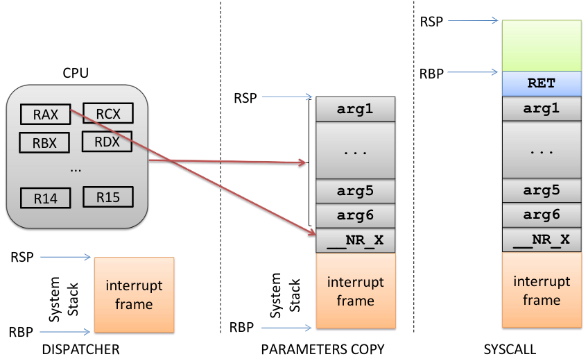

      - Interrupt frame: generated by the firmware by the instruction `int $0x80`, contains references to the user space process (for example code segment, stack segment, return address of user space) so that when the `iret` instruction is executed we know how to restore
      - CPU: registers contain arguments to the syscall; these are saved in the system stack 
      - RET: return address to the dispatcher
      - Green stack: syscall local variables
    - The syscall stack implementation is architecture dependent

      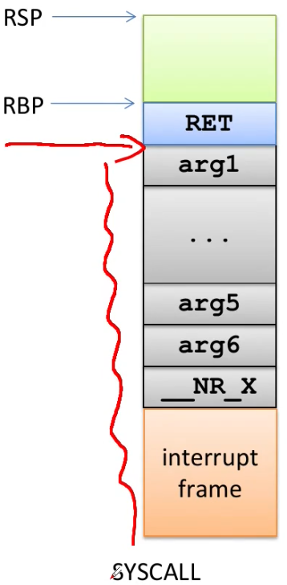

      

    - Dispatcher implementation (x32)
      ```asm
      ENTRY(system_call) // Start of dispatcher code, this is the first instruction of the dispatcher executed
        pushl %eax # syscall no. // Push the syscall number on the stack
        SAVE_ALL // Save all other registers on the stack
        GET_CURRENT(%ebx)
        testb $0x02, tsk_ptrace(%ebx) # PT_TRACESYS
        jne tracesys
        cmpl $(NR_syscalls), %eax // Check if we are calling an existing syscall number
        jae badsys // If not return an error
        // Call into the syscall table
        // 1. Dereference the pointer to the syscall table
        // 2. Multiply eax (syscall number) with 4 (a pointer is 4 bytes)
        // 3. Sum together and you have the correct syscall address
        call *SYMBOL_NAME(sys_call_table)(,%eax,4)
        movl %eax, EAX(%esp) # save return value // Into the syscall stack
      // Check if some other process (instead of the caller) needs to be scheduled because it has higher priority or check for signals pending
      ENTRY(ret_from_sys_call)
        cli # need_resched and signals atomic test
        cmpl $0, need_resched(%ebx)
        jne reschedule
        cmpl $0, sigpending(%ebx)
        jne signal_return
      restore_all:
        RESTORE_ALL // Restore registers from the stack
      ```
  - Full process of calling a syscall

    

    - Problem: it is a mess and very "slow", in the end the generated address will always be the one of the dispatcher and we have also to do a lot of hacks using macros to make everythin work 
    - Solution: `syscall()` library function
      - Implemented through glibc (`stdlib.h`)
      - It triggers a trap to execute a generic system call
      - You just have to change it to modify how syscalls are done
      - The first argument is the system call number, other parameters are the input for the system call 
      - Based on new x86 assembly instructions: `sysenter/sysexit` (x32) or `syscall/sysret` (x64)
        - i386 Fast syscall Path (x32 syscall invocation)
          - Types
            - `SYSENTER`
              - Based on model specific registers
                - `CS` register set to the value of `SYSENTER_CS_MSR` (containing the value of the code segment set by the kernel at startup)
                - `EIP` register set to the value of `SYSENTER_EIP_MSR` (containing the address of the dispatcher code set by the kernel at startup)
                - `SS` (stack segment for the syscall) register set to the sum of 8 plus the value in `SYSENTER_CS_MSR`
                - `ESP` (stack pointer for the syscall) register set to the value of `SYSENTER_ESP_MSR`
              - When executing this inctruction the context will be push to the system stack, they will be restored by `SYSEXIT`
            - `SYSEXIT`
              - Based on model specific registers
                - `CS` register set to the sum of 16 plus the value in `SYSENTER_CS_MSR` (restored value of the user space `CS`, saved previously)
                - `EIP` register set to the value contained in the `EDX` register (`EDX` will store the old, user space `EIP`; it was written by `SYSENTER`)
                - `SS` register set to the sum of 24 plus the value in `SYSENTER_CS_MSR` (restored value of the user space `SS`, saved previously)
                - `ESP` register set to the value contained in the `ECX` register (`ECX` will store the old, user space `ESP`; it was written by `SYSENTER`)
                - Note: so now (i think) that `ECX` and `EDX` can't be used as syscall arguments passing registers
                  - WRONG!!!!! See the vDSO asm part, here is explained a fundamental thing
          - Code
            ```c
            // Macros to identify model specific registers
            #define MSR_IA32_SYSENTER_CS  0x174
            #define MSR_IA32_SYSENTER_ESP 0x175
            #define MSR_IA32_SYSENTER_EIP 0x176
            // ---
            // Write model specific register instructions to edit them
            wrmsr(MSR_IA32_SYSENTER_CS,__KERNEL_CS,0); // SYSENTER_CS_MSR set to the kernel code segment
            wrmsr(MSR_IA32_SYSENTER_ESP,tss->esp0,0); // SYSENTER_ESP_MSR taken from the tss which stores stack pointers for the 4 rings, we take the 0 ring one
            wrmsr(MSR_IA32_SYSENTER_EIP,(unsigned long)sysenter_entry,0); // SYSENTER_EIP_MSR set to the dispatcher code entry point 
            // rdmsr also exist
            ```
        - x64 syscall invocation
          - Based on `LSTAR/STAR` model specific registers
            - They allow to write in different portions of the very same physical register on the CPU:
              - STAR allows to write Kernel Space CS and Userspace CS and to write 32 bit address on the Entry Point of system call dispatcher
              - LSTAR can write just 64 bit address on the Entry point of system call dispatcher

              

            - Initialization of these model specific registers
              ```c
              void syscall_init(void) {
                /** LSTAR and STAR live in a bit strange symbiosis.
                  * They both write to the same internal register.
                  * STAR allows to set CS/DS but only a 32 bit target.
                  * LSTAR sets the 64 bit rip.
                  */
                wrmsrl(MSR_STAR,  ((u64)__USER32_CS)<<48 |
                                  ((u64)__KERNEL_CS)<<32);
                wrmsrl(MSR_LSTAR,system_call);
                /*...*/
              }
              ```
          - How it works

            

            - Using MSR the dispatcher code is executed, this searches the syscall table for the syscall number and then executes it
          - x64 calling conventions: rely on registers to pass parameters
            ```c
            /*
             * Register setup:
             * rax  system call number
             * rdi  arg0
             * rcx  ret.address for syscall/sysret, userspace arg3
             * rsi  arg1
             * rdx  arg2
             * r10  arg3 (--> to rcx for userspace)
             * r8   arg4
             * r9   arg5
             * r11  eflags for syscall/sysret, temporary for C
             * r12-r15,rbp,rbx saved by C code, not touched.
             * 
             * 6 registers to pass parameters.
             * Interrupts are off on entry.
             * Only called from userspace.
             */
            ```
          - Problem: `syscall()` function is a standard library function but it has to be maintained by lib developers; we want to make it inside the kernel
            - Problem: doing so the `syscall()` function would run at ring 0, and it must be called from user space (bad)
          - Solution: Virtual Dynamic Shared Object (vDSO)
            - Shared library maintained by kernel devs
            - Syscall entry/exit points are set by the Kernel
            - Few memory pages (this shared library) are created and made visible to all processes address spaces when they are initialized

              

              - There processes find the actual code for the syscall entry/exit mechanism
              - Loaded for each process at different address (something like ASLR)
                - To still be able to locate functions in the vDSO the OS before giving control to the application populates a table of informations (auxiliary values table) into the ELF header with the address of the vDSO
            - In the vDSO we find the activation path for the syscall
              ```asm
              // 32 bit version
              __kernel_vsyscall:
                // Before calling sysenter push the two registers mangled by it
                push %ecx
                push %edx
                // Create stack frame for current execution context
                push %ebp
                movl %esp,%ebp
                // If the hardware is older than pentium 3 a general protection fault is triggered
                // This fault will generate a trap to the OS who will try to understand the reason
                // The OS knowing that the trap has been generated by the sysenter instruction will
                // understand that the hardware is old so the control will come back here to the
                // next instruction (int $0x80) which is the traditional system level trap
                sysenter
                nop
                /* 14: System call restart point is here! */
                int $0x80 // Not only for old hardware but also for legacy software
                /* 16: System call normal return point is here! */
                // In both cases at the end we clean up the stack (restore) and return to the caller
                // (in this case syscall() from the standard library)
                pop %ebp
                pop %edx
                pop %ecx
                ret
              ```
            - Benefits of vDSO
              - Bypass the "Full process of calling a syscall" so reduced CPU cost and memory accesses (reduction of clock cycles for system calls can be in the order of 75%)
              - Allows randomization (remember ASLR, security enhanced)
            - Notes
              - In x64 there are two vDSO, one for x32 and one for x64; these are mapped depending on the type of executable which is running
  - Syscall table
    - History
      - In the beginning it was just a vector defined directly in an assembly file
      - In recent versions, the syscall table is generated from a text file which describes how the syscall table should be generated
        - There is some shell script which preprocesses this table file and this table file will be used to generate the actual code which will be used by the dispatcher to perform the system call dispatching
        - Table files are useful because by relying on these we can generate the `unistd.h` in which we have the system call numbers
    - Entries keep a reference to the kernel level system call implementation
    - Typically the kernel level name resembles the one used at application level (traditionally `sys_...`)
      - Each entry points to some function which is called `sys_...` in the Kernel; this is the architecture-independent entry point of that specific system call
    - Syscall entry points
      - Example: `0 common read __x64_sys_read` (in `/arch/x86/entry/syscalls/syscall_64.tbl`)
        - `0`: syscall number
        - `common`: attribute which declare how this function should be exposed to the other modules
        - `read`: syscall name
        - `__x64_sys_read`: name of the function which implements the target of system call table; we have the `__x64_` prefix which specifies the 64 bit system implementation so bypasses the sign extension (for info see "Macros definition")
      - `/include/linux/syscalls.h` contains definition of syscalls
        - Example: `asmlinkage long sys_read(unsigned int fd, char __user *buf, size_t count);`
          - `asmlinkage`: we have the entry point of architecture-independent Kernel code, so, we have to clean-up calling conventions on different architectures
      - `/fs/read_write.c` contains the implementation (of `read`)
        - Example
          ```c
          SYSCALL_DEFINE3(read, unsigned int, fd, char __user *, buf, size_t, count) {
            return ksys_read(fd, buf, count); // Just call the kernel system implementation for read
          }
          ```
          - `SYSCALL_DEFINE3`: macro used to generate the `sys_read` symbol
            - `3`: number of arguments of the function
          - `read`: function name
          - `unsigned int`: type of first parameter
          - `fd`: name of the first parameter
          - ...
        - Macros definition (in `include/linux/syscalls.h`)
          ```c
          // DEFINE3 based on the general DEFINEx
          #define SYSCALL_DEFINE3(name, ...) \
          SYSCALL_DEFINEx(3, _##name, __VA_ARGS__)
          // _##name: name
          // __VA_ARGS__: Variadic MACRO.
          // We are passing all parameters to SYSCALL_DEFINEx
          
          #define SYSCALL_DEFINEx(x, sname, ...) \
          SYSCALL_METADATA(sname, x, __VA_ARGS__) \
          __SYSCALL_DEFINEx(x, sname, __VA_ARGS__)
          // SYSCALL_METADATA: describes some metadata related to the system call, which are useful for OS
          // __SYSCALL_DEFINEx: generate the actual entry point of the system call
          ```
          - Expansion of `__SYSCALL_DEFINEx` to `sys_read`
            ```c
            asmlinkage long sys_read(unsigned int fd, char __user *buf, size_t count) __attribute__((alias(__stringify(SyS_read))));
            
            asmlinkage long SyS_read(long int fd, long int buf, long int count) {
              long ret = SYSC_read((unsigned int) fd, (char __user *) buf, (size_t) count);
              asmlinkage_protect(3, ret, fd, buf, count);
              return ret;
            }
            
            static inline long SYSC_read(unsigned int fd, char __user *buf, size_t count) {
              return ksys_read(fd, buf, count);
            }
            ```
            - `sys_read()` is just an alias of `SyS_read()`
              - We are doing this because if we look at parameter definition they change: `(int fd, char __user * buf, size_t count)` vs `(long int fd, long int buf, long int count)`
              - Since we are running on 64 bit system Kernel but on top of this we can run 32 bit system program, we ensure that we are forcing 32 bit application to sign extend the arguments
                - Example: we have `unsigned int fd` (on 32 bit program), it will be `sign extended` to 64 bit program (`long int fd`)
                  - This ensures that no one is able to fake the Kernel into accepting into this system call a different extension of arguments
              - Moreover, the `SyS_read()` calls the final wrapper `SYSC_read()` with the RIGHT number of parameters; so, it is not possible from Userspace to pass additional parameters to the system call
              - `SYSC_read` must pass to `ksys_read()` the proper number of parameters, so we use the directive `asmlinkage_protect()` to control if the values passed to `SYSC_read()` are valid
              - Without the additional control parameter we can have the following attack:
                - Let's suppose i'm able to compromise the OS and change the pointer of the entry of syscall table to `my_read()`
                - `my_read()` could take and additional boolean parameter `bool activate` which activate the exploit
                - Typically, `my_read()` system call will just call the original `sys_read()` system call but, if I invoke from Userspace `my_read` system call with `activate = 1`, then all applications will observe an hijacked behavior (for example, send over network my data)
              - So, in order to have a scenario in which any additional parameters will not be passed to the final system call, the Kernel implement this scheme; in the end, only the proper number of arguments is passed to the final implementation of the system call (this whole thing happens because of variadic functions)
- Final picture

  

### Kernel Messaging

- Linux Kernel Messaging System
  - Kernel level software can produce output messages related to events occurring during the execution (debugging by printing)
  - The messages can be produced both during initialization and steady state operations so:
    - Software modules forming the messaging system cannot rely on I/O standard services (such as `sys_write()`)
    - No standard library function can be used for output production (no `printf()`)
  - Management of kernel level messages occurs via specific modules that take care of the following tasks:
    - Synchronous: message print on the "console" device
    - Asynchronous: message logging into a circular buffer kept within kernel level virtual addresses
- Kernel level function to produce output messages: `printk()`
  - Accepts a format string similar to that used for the `printf()`
    - Floating point values are not allowed (in kernel floating point operations are never done, costly)
  - Variadic function
  - A message priority can be specified by relying on macros (expanded to strings) which tell how critic is a message
    ```c
    // Priorities
    #define KERN_EMERG    "<0>" /* system is unusable */
    #define KERN_ALERT    "<1>" /* action must be taken immediately */
    #define KERN_CRIT     "<2>" /* critical conditions */
    #define KERN_ERR      "<3>" /* error conditions */
    #define KERN_WARNING  "<4>" /* warning conditions */
    #define KERN_NOTICE   "<5>" /* normal but significant condition */
    #define KERN_INFO     "<6>" /* informational */
    #define KERN_DEBUG    "<7>" /* debug-level messages */
    // Example usage
    // These are strings, in C when two strings are near: "hello" "bob"
    // they are collapsed in one by the compiler
    printk(KERN_WARNING "message to print")
    printk(KERN_INFO "%s: Module message\n", KBUILD_MODNAME);
    ```
    - Priority management
      - There are 4 configurable parameters which determine how output messages are managed (what the OS will do with these messages)
        - `console_loglevel`: level under which the messages are logged on the console device (if we set this to 0 we want just `KERN_EMERG` to be print)
        - `default_message_loglevel`: priority level that is associated by default with messages for which no priority value is specified (if we don't specify in the `printk()` the log level macro)
        - `minimum_console_loglevel`: minimum level to allow a message to be logged on the console device
        - `default_console_loglevel`: default level for messages destined to the console device
      - These values are stored in `/proc/sys/kernel/printk`, example: `7 4 1 7`
        - Write to this file to change the parameters
- Syscall to perform management operation on the kernel level circular buffer hosting output messages: `int syslog(int type, char *bufp, int len);`
  - `type`: command, could be read or other things
    - `0`: close the log, currently a NOP
    - `1`: open the log, currently a NOP
    - `2`: read from the log
    - `3`: read up to the last 4k of messages in the ring buffer
    - `4`: read and clear last 4k of messages in the ring buffer
    - `5`: clear ring buffer
    - `6`: disable `printk` to console
    - `7`: enable `printk` to console
    - `8`: set level of messages printed to console
  - `bufp`: points to the memory area where the bytes read from the circular buffer will be copied
  - `len`: specifies how many bytes we are interested in or a flag (depending on the value of `type`)
- Messaging management daemon: `klogd` (kernel log daemon)
  - Runs just in kernel mode (usually if process starting with `k` this means runs at kernel level)
  - When generating a message using `printk()` this will interact with `klogd`
  - Used to synchronize access to the ring buffer (because we have multiple cores!)
- Circular buffer (`kernel/printk/printk.c`)
  - Size: `LOG_BUF_LEN` (defined at compile time)
  - Stored in the array `__log_buf`
  - The buffer content can be accessed through `dmesg`
- Management of messages
  - Synchronous `printk()` messages must be delivered according to the exactly-once semantic (sent 1 time and received 1 time)
    - `printk()` does not return control until the message is delivered to any active console device driver
    - This may impact performance, example: the delivery of a message on a serial console device working at 9600 bit/sec slows down the system by 1 millisecond per char
  - In stdlib the `printf()` uses the at-most-once semantic (message could eventually be lost)
- If conditions are VERY critical call: `panic()`
  - Prints the specified message on the console device by relying on `printk()`
  - "Kernel panic:" is prepended to the message
  - Halts the machine leading to stopping the execution of the kernel (threads enter an infinite loop)

### Kernel Data Structures

- We need to use abstract data types for efficiency reasons, what are they?
  - Encapsulate the entire implementation of a data structure
  - Provide only a well defined interface to manipulate objects and collections
- Circular doubly-linked lists (DOUBLY LINKED LIST with "SENTINEL")

  

  

  ```c
  struct list_head {
    struct list_head *next, *prev;
  };

  struct my_struct {
    int priority;
    struct list_head list1;
    struct list_head list2;
    int other_member;
  };
  ```
    - Independent by the struct structure and size
    - Depending if we come from `list1` or `list2` how can we obtain a reference pointer to `my_struct`?
      - Everything is MACRO-based: `container_of()` (`list_entry()`)

        

        - This macro given these values is able to return the `returns` pointer simply because this can be calculated easily having these information
        - Uses `offsetof()` wants as parameters one data structure and one member and it tells the amount of bytes from the beginning of data structure to that member
        - For example if we tell that `my_data_structure` starts at 0 and we use `offsetof()` to locate the displacement in bytes starting from 0, we know exactly the displacement of bytes, in general, in that type data structure
    - Using lists

      

      - We don't need to have these 3 data structure allocated by means of `kmalloc()` because once we have a static data structure the space fot the `next` and `prev` pointers is already allocated, so we can also organized objects as an array
    - List head (sentinel)
      - Normal usage
        ```c
        // Example
        struct list_head todo_list;
        INIT_LIST_HEAD(&todo_list); // Initialize the pointers to point to each other
        ```
      - As global variable (init at compile time)
        - `LIST_HEAD(todo_list);`: allocates the data structure and initializes the list as empty
    - API
      - `list_add(struct list_head *new, struct list_head *head);`
      - `list_add_tail(struct list_head *new, struct list_head *head);`
      - `list_del(struct list_head *entry);`
      - `list_del_init(struct list_head *entry); // To later relink`
        - Anytime that you delete an element, we might ask the OS not to destroy the content of the buffer (of the element to delete) because possibly we are just unchaining one node from one list because we later want to relink that object to a different list
      - `list_move(struct list_head *entry, struct list_head *head);`
      - `list_move_tail(struct list_head *entry, struct list_head *head);`
      - `list_empty(struct list_head *head); // Non-zero if empty`
    - List traversal
      - Intuitive method
        ```c
        void my_add_entry(struct my_struct *new) {
          struct list_head *ptr;
          struct my_struct *entry;
          for(ptr = my_list.next; ptr != &my_list; ptr = ptr->next) {
            entry = list_entry(ptr, struct my_struct, list);
            if(entry->priority < new->priority) {
              list_add_tail(&new->list, ptr);
              return;
            }
          }
          list_add_tail(&new->list, &my_list);
        }
        ```
        - `my_list` variable is the sentinel node; with `my_list.next` we skip the sentinel node and we actually start from the first element
        - `ptr != &my_list` determines if the list is empty or we finish our traversal through the list; in that case we have that `my_list.next ---> my_list`
      - Enhancement (macro): substitute the for loop with `list_for_each(ptr, &todo_list)`
- Hash lists
  - Problem: in hash lists storing two pointers in the sentinel is a waste of memory
    - In hash tables there is no situation in which from the sentinel node (in the array of hash table) we typically want to start looking from the tail
    - We have that given some hash function we have a collision with an entry in the array of the hash table and so we have a waste of memory to keep the `prev` pointer for the head of the list

    

  - Solution:
    ```c
    struct hlist_head {
      struct hlist_node *first;
    };
    
    struct hlist_node {
      struct hlist_node *next, **pprev;
    }
    ```
    - We cannot have simply a `*prev` pointer because we have that the first element of the list should have a `struct hlist_node *prev` pointing to the `hlist_head` struct of the sentinel node; this is wrong and the compiler will complain
    - To solve this problem we substitute `*prev` with `**pprev` (pointer of a pointer) so we have that `**pprev` of the first element of the list points to `struct hlist_node *first` within `struct hlist_head` (sentinel node) and this is perfectly legal
    - We have that the member `hlist_node *first` is the first member of the struct `hlist_head` so the address of the pointer `*first` and the address of the `hlist_head` are the same (if i have a pointer to the first member i actually have a pointer to the data structure)
    - Once we have the address of `*first` by means of `hlist_node **prev` we can cast the `hlist_node **` value (the address of `*first`) to `hlist_head *`

    

- Concurrency: lock-less lists
  - Singly linked NULL terminated non blocking (some operations no need to take a lock) lists
  - Based on compare and swap to update pointers (atomic instruction)
  - Operations
    - Insertion of a new node
      
      
      
      - Local: next pointer of the new node to the next element
      - Global (publish operation): use a RMW instruction called compare and swap (atomic)
        - If the previous node next pointer is still pointing to the next element this mean that no one inserted a new node between
          - So we just insert the new node editing the previous node next pointer
        - Else i perform a retry operation where i rescan the list to find the new node that has been added and add the new node in between
    - Deletion of a node
      - Requires to ensure that no one actually has a reference to the node to delete
      - `next` pointer is composed by two final 0 bits; we can use one of these two 0 bits to mark the node as logically deleted (CAS only sets the last bit to 1)
      - A thread that sees the node "logically deleted" will not add next or before a new node
      - A "logically deleted" node can be traversed but it cannot be returned (if a traverse search operation tries to return a logically deleted node, it has to fail, because that node doesn't exist anymore logically)
      - At the end, we perform an additional CAS operation to physically remove the node
- Queues (called kfifo): producer/consumer model

  

  - Operations
    - Enqueue: `kfifo_in()`
    - Dequeue: `kfifo_out()`
    - Creation: `kfifo_alloc(struct kfifo *fifo, unsigned int size, gfp_t gfp_mask)`
    - Removal: `kfifo_free(struct kfifo *fifo)`
- Red-Balck trees: self-balancing binary search tree

  

  - Properties
    - Each node is either black or red
    - Each path to leaf traverses the same number of black nodes (if not the tree is unbalanced)
    - Each red node has two black children
    - All leaves are black and NIL
    - A black node might have a black child
  - Operations
    - Initialization: `struct rb_root root = RB_ROOT;`
    - Get the payload of a node: `rb_entry()`
    - Insert a node `rb_link_node()`
    - Set the color (trigger rebalancing): `rb_insert_color()`
    - Remove a node: `rb_erase()`
    - Traversal must be implemented by hand
- Radix tree

  

  - Kind of space optimized Prefix Tree (compact Prefix Tree)
  - We can implement dictionaries, we start from one node (first letter), and we go through other letters associated with childs nodes in order to search a word
  - This is the data structure of the page tables; we use some bits of the key to identify what will be the pointer to reach the next level
  - The key is an integer or long integer (`unsigned long`)
  - The item is an object (`void *`)
  - Radix Tree allows to create mapping from integers to objects (example, PID --> task_struct)
  - In the Radix Tree we have a sparse mapping because if we don't have an item, then you don't need all data structure representation in between
  - Implementation (idr)
    ```c
    // This code allows any two cores to compete at allocating an ID
    again: 
      if(idr_pre_get(&my_idr, GFP_KERNEL) == 0) {
        /* No memory, give up entirely */
      }
      spin_lock(&my_lock);
      result = idr_get_new(&my_idr, &target, &id);
      if(result == -EAGAIN) {
        sigh();
        spin_unlock(&my_lock);
        goto again;
      }
    ```
    - `idr_pre_get()` will find the next available ID and it will allocate all internal nodes which are required by the Radix Tree in the kernel memory (`GFP_KERNEL`)
    - `idr_get_new()` will associate the numerical ID `my_idr` with the actual data structure `target`, it will return the final ID which is associated, in the element `id`
      - Must be protected by a lock because we are competing and we are scanning trough the data structure
      - Instead in `idr_pre_get()` we are in the case in which we might be required to allocate memory, it could be that since we are using `GFP_KERNEL` we might go to sleep in case of memory pressure on the Buddy System; so we don't need to lock before using `idr_pre_get()`
    - Finding an object: `idr_find()`
    - Deallocate id: `idr_remove()`
- Per-CPU variables
  - They are variables referenced with the same name
  - Depending on the core on which the code runs this name is automatically mapped to different storage
  - They are based on a reserved zone in the linear addressing space (for each CPU)
  - Macros allows to retrieve the actual address for the running core
  - Note: if a thread retrieve one address (of a Per-CPU variable) associated with running Core and then if this thread is descheduled and then rescheduled on a different Core then we will still keep the reference to the variable associated with the older Core on which we have run the thread (so you don't want to be descheduled when you are using per-CPU vars)
  - How it works
    - `get_cpu_var(var)`
      ```c
      #define get_cpu_var(var) \
      (*({ \
      preempt_disable(); \
      this_cpu_ptr(&var); \
      }))
      ```
      - Current code must not be preempted and moved to the another CPU while accessing a per-cpu variable (`preempt_disable`)
      - `this_cpu_ptr` macro: `#define this_cpu_ptr(ptr) raw_cpu_ptr(ptr)`
      - `#define raw_cpu_ptr(ptr) per_cpu_ptr(ptr, 0)`
      - `per_cpu_ptr` returns a pointer to the per-cpu variable for the given cpu (second parameter)
    - `put_cpu_var(var)`: enables preemption with a call of preempt_enable function
  - Definition and usage
    ```c
    // In every CPU an int will be allocated (var named x)
    DEFINE_PER_CPU(int, x);
    int z;
    z = this_cpu_read(x);
    ```

    

    - `gs` segment will be stup by OS in a way which allows to target a different memory location depending on the Core on which we are running
    - `gs` segment will keep the base address of the Per-CPU storage keeping the variables on that Core
    - `x` is transformed by the compiler into an offset into one specific segment `gs`
    - In the `gs` segment the Kernel is mantaining an address which is associated with Kernel Space; we do not want to show Userspace Application, the content of that `gs` segment, otherwhise Userspace Apllication can carry out attack bypassing KASLR 
      - `swapgs` is based on two Model Specific Registers (GS userspace and GS kernelspace)
        - Everytime that OS transition to Kernel Space it will use `swapgs` in order to change the content of `gs` from Userspace value to the Kernelspace value
        - Once it goes back to Userspace, it uses again the `swapgs` to transition from Kernelspace value to Userspace value
  - How it works (in depth)
    - `gs` is a segment selector which allows us to pick one segment descriptor from GDT table
    - Each CPU has a different GDT table; this different GDT table was introduced in order to have one different TSS for each CPU Core in order to have Ring Model on x86 systems behaves correctly
    - We can exploit the fact that we have multiple GDT tables also to find out a different base address associated with `gs` segment

    

### Interrupt and Time Management

- Interrupts: manage interaction with IO devices
  - Asynchronous protocol
    - Synchronously program the execution of one command from that IO device
    - Start doing something else because IO device is slower than CPU, so we don't want to wait the device to complete its function
    - Once IO device has completed its operation, it will issue an interrupt request to the CPU to take care of managing its completed operation
    - From that point on, it is the CPU which has to handle the completion of that operation
    - Device drivers (modules running at ring 0) will then handle the request for the CPU
- Time Management: deals with capability of a modern OS to keep track the time which is passing
  - Time management subsystem is coupled with Interrupt Management subsystem because it is exploiting some specific hardware devices in order to keep track of the advancement of time

#### Interrupts

- IDT and GDT relationship

  

  - Real mode vs Protected mode
    - Real mode: instead of IDT, IVT (Interrupt Vector Table) associated with a vector number we immediately find a function pointer that handles the interrupt (device driver); located at address 0
    - Protected mode: IDT entries composed by an offset and a segment selector that together identify the interrupt handler; IDT is not located in a fixed memory address, we use IDTR to keep the random base address of each IDT on each CPU Core
      - IDT can be shared by multiple CPU Cores by simply having IDTR point to the same memory location
      - After the introduction of the KPTI patch (Kernel Page Table Isolation), the IDT is located into the `cpu_entry_area` which is the only memory segment area which is mapped also when running in User Mode
  - IDT working scheme
    - Receive an interrupt associated with an interrupt request number that identifies a vector, this gives a selector that points to a segment descriptor which identifies a base address from which the offset allows to identifiy Interrupt Handler management routine
    - We have only 256 entries in IDT table so Interrupt Handlers are not the actual handlers which are in charge of interacting with the device, instead they will be managing a family of Interrupts; so, starting fom an Interrupt Handler we later need some operation which tells "What is the device which is generating this kind of interrupt?"
  - IDT entries structure (x64)

    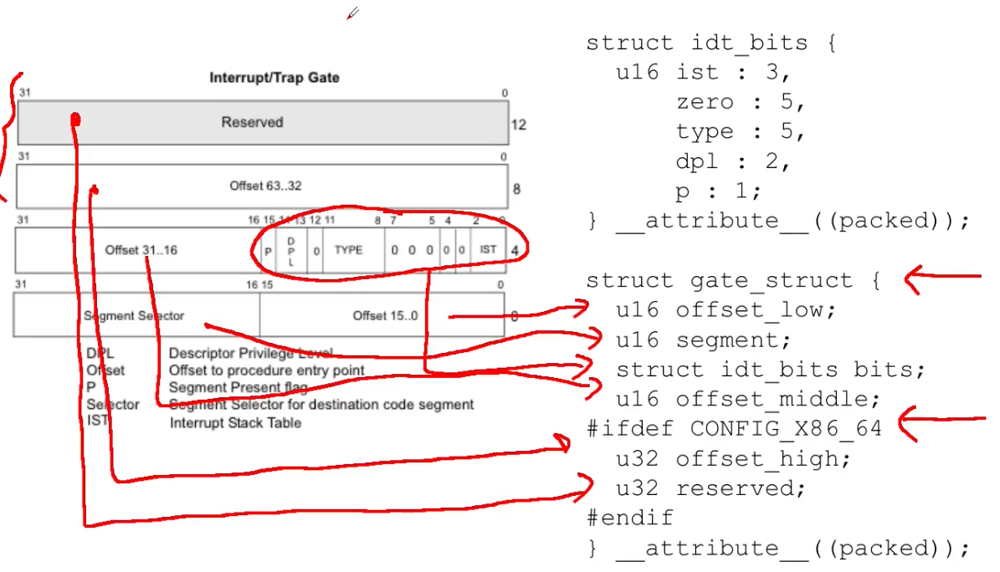

    

    - `__attribute__((packed))`: asking the compiler to associate data structure with smaller possible alignment (no padding) so it means there will be no additional byte among these members
  - IDT entry initialization (no more used, now MACRO are used but the significate is the same)
    - This function packs into some gate descriptor all the information which should be placed in order, for the firmware, to implement the interrupt initiated transition to Kernel Space; it publishes some function `func` into the IDT splitting among different entries (different parts of `offset`)

      

      - If x64 uses `__KERNEL_CS`
      - So at System Startup we will have to manually populate, in our OS code, the all IDT entries by telling that for a given gate (entry) we want to associated that gate with some specific function
  - IDT entries
    - `0-19`: nonmaskable interrupts and exceptions
    - `20-31`: Intel reserved
    - `32-127`: external interrupts (external I/O)
    - `128 (0x80)`: system calls
    - `129-238`: external interrupts (external I/O)
    - `239`: APIC timer interrupt
    - `240-250`: reserved by Linux for future
    - `251-255`: Inter processor interrupts
  - Gate descriptor: referenced by the IDT pointed by the IDTR
    - Segment descriptor of type system
      ```c
      // TYPE in IDT entry structure
      // Depending on the value which we are writing in type field, then the firmware will perform different operations
      enum{
        GATE_INTERRUPT=0xE, // Interrupt gate descriptor, implicitly called (from external)
        GATE_TRAP=0xF, // Trap gate descriptor, explicitly called by CPU
        GATE_CALL=0xC, // Call gate descriptor
        GATE_TASK=0x5, // Task gate descriptor
      };
      ``` 
- Interrupts vs Traps
  - Interrupts are asynchronous events not related to the current CPU execution flow
  - Interrupts are generated by external devices and can be masked or not (NMI)
    - We can ignore the fact that some Interrupt Request is standing (delay)
    - Other kind of interrupts Non-maskable interrupts which cannot be delayed
  - Traps or exceptions are synchronous events strictly related to the current CPU execution (e.g. division by zero)
  - Traps were historically used to demand access to kernel mode (`int 0x80`)
  - Differently from interrupts, trap management does not automatically reset the interruptible state of a CPU core (IF)
    - Everytime that we start executing an interrupt driver (some device driver), the interrupt flag is already cleared, meaning that CPU-state immediately transition to a **non-interruptible-state** otherwise we would overflow the Kernel stack associated with that specific instruction because we continuosly activate the very same instruction handler (because we continuously check if we have to process an interrupt request and we always find a standing interrupt request which is the one which we are managing when executing in that code)
    - For Trap management this is different: if we tell one entry is associated with a trap we are telling that there will be no asynchronous event calling into that vector so it means that there will be no interrupt request flags associated with that vector (they are useless in this case)
    - So, the firmware will consider, by default, the code of the trap handler as interruptible (for example, the system call dispatcher could be interrupted by an hard interrupt)
  - Critical sections in the trap handler must explicitly mask and then re-enable interrupts (`cli` and `sti` instructions, clear and set interrupt flag into `RFLAGS` register on Intel CPUs)
    - If we know that there is some kind of critical section in trap handler then we must explicitly identify that critical section and we disable and re-enable interrupts
  - For SMP/multi-core machines this might not be enough to guarantee correctness (atomicity) while handling the trap
    - Clearing and setting the Interrupt Flag could not be enough to guarantee correctness on multi-core machines because `cli` and `sti` act on `IF` on `RFLAGS` which is Per-CPU
    - So, if a different CPU could interfer with the execution of our handler in our critical section then the correctness of our algorithm could be hampered; some other cores might activate the same trap handler
  - The kernel uses spin locks based on atomic test-and-set primitives
    - `xchg` instruction or `lock incl` instruction (atomically increment counter) in order to set or change the value of a flag to implement different synchronization primitives that allow to protect critical sections also in trap handlers within execution of multi-cores
- Interrupts classification
  - I/O Interrupts
    - Received everytime that an I/O device requests attention to the kernel
    - The interrupt handler must query the device to setup proper actions
  - Timer Interrupts
    - The LA PIC timer has issued an interrupt
    - This notifies the kernel that sometime has passed
  - Interprocessor Interrupts (IPI)
    - On multicore systems we must ensure that different cores synchronize with each other in some circumstances
- What happens when an interrupt triggers
  - If you lock some synchronous execution, we have that everytime that we call into a function `f` we have to save the execution context associated with the caller; this boils down to the fact that on the stack we will save the return address
  - In the case of an interrupt you don't know when that interrupt request will be received so, if we have a set of assembly instructions `a, b, c, d, ...` it could be that we receive an interrupt request in between any two assembly instructions; so it means that we must keep track of additional pieces of information in order to correctly restore original execution context
    - Example

      

      - After the execution of `test` instruction the `RFLAGS` register will be updated and `jz` will read the content of some status bit into `RFLAGS` register
      - What happens if we receive some interrupt request in between `test...` and `jz` instructions? 
        - We jump in the interrupt service routine and while executing the code we will find some `cmp` instruction (for example) associated with an if statement into the driver; so, this `cmp` instruction will update the content of `RFLAGS`, possibly the condition flags which are later used by `jz` instruction
        - So, `jz` will use a wrong value of `RFLAGS` (breaking the Userspace application or the Kernel thread which was running before the interrupt was delivered)
    - **Solution**: everytime we activate a service routine, we will find on the stack at least return address AND the `FLAGS` value, this is done to preserve the execution context also in the case of possible activation of an interrupt device driver in between a `test` instruction and a conditional branch instruction

      

- x86 Interrupt frame (done by the firmware)
  - Upon an interrupt the firmware changes stack
    - If the IDT has an IST value different from 0 the corresponding stack from the TSS is taken
    - Otherwise the stack corresponding to the destination Privilege Level is used (0)

  - Structure

    

    - If we are coming from user space, so we are changing stack
      - `SS and SP`: previous stack segment and stack pointer
    - In general
      - `RIP`: return address
      - `CS`: old code segment (identify if we are coming from userspace or not)
      - `error_code/vector number` (optional): depending on the kind of interrupt which is generated, it could be that the firmware will also push on the stack an additonal piece of information which describes what is the error code associated, for example, in the case, of an exception
- Global activation scheme (the previous but done by the kernel)

  

  - For each vector number the Kernel mantains a very small stub, this places `[vector #]`; if an error code is available it is placed by the firmware
  - The remaining `pt_regs` data structure (all fields except `[error_code/vector#]`) is populated by the dispatcher
  - Before creating the final image of `pt_regs` the dispatcher will also change `GS` (with `swapgs` instruction) because since we are transtioning into Kernel mode we want to have the possibility to rely on Per-CPU variables and in that case we change the content of `GS` in order to point to the segment selector in Kernel Mode which identifies, thanks to Per-CPU GDT, the location of the area which keeps Per-CPU variables
  - Depending on the actual information which is located in the Interrupt Frame in `error code/vector #`, the dispatcher will call into the actual handler
  - The actual handler will perform the management of the interrupt, it will then return to the dispatcher with a regular `ret` instruction
  - The dispatcher (after the actual handler returns) will then have to destroy all information which was placed by the stub and by the firmware, so it will perform an `iret` instruction (return to the address in the `RIP` field in the Interrupt Frame, and it wipes out all the other informations in the Interrupt Frame before placed by the firmware)
- Interrupt entry points (stubs)
  - An additional push might take place
    - If an exception occurred and no error code is placed by the firmware a dummy `-1` value is placed on stack
    - If it is an IRQ the vector number is pushed on stack
  - The correct dispatcher is then uniformly reached
  - Exception example (simplified)
    ```asm
    // Extreme semplification

    ENTRY(overflow)
      pushl $-1 // No syscall to restart (if we are running a system call which gets interrupted it could be that the Linux Kernel will write into that entry the system call number that it was running)
      jmp dispatcher
      
    ENTRY(general_protection)
      pushl $-1 // No syscall to restart
      jmp dispatcher
    
    // Has error code, no need to push dummy values
    ENTRY(page_fault)
      jmp dispatcher
    ```
  - Interrupt example (macro-way)
    ```c
    // Build the entry stubs, pack 1 stub into every 8-byte block
          .align8
          // Starting from this symbol, we know what is the offset required to reach one specific stub for one specific vector
    ENTRY(irq_entries_start)
      // We start from a vector which starts from FIRST_EXTERNAL_VECTOR, so we skip the initial part of the IDT
      vector=FIRST_EXTERNAL_VECTOR
      // This is a loop, we iterate unitl we reach the FIRST_SYSTEM_VECTOR (which are entries which are located later on)
      .rept(FIRST_SYSTEM_VECTOR - FIRST_EXTERNAL_VECTOR)
        // This code is replicated for all the vectors associated with IO devices
        UNWIND_HINT_IRET_REGS
        // push: push the vector number depending on the current vector value 
        pushq $(~vector+0x80) /* Note: always in signed byte range */
        // Jump to the common_interrupt (the dispatcher)
        jmp common_interrupt
          .align8
        vector=vector+1
      .endr
    END(irq_entries_start)
    ```
    - We generate at compile-time all `push` and `jump` instructions which take care of the vector number (associated with one specific line) in IDT table, then we will have that the entry associated with hard IRQs will point to `irq_entries_start + offset`; this offset is the amount of instructions inside the loop
    - In this way we can prepopulate at compile-time all the stubs for all vectors associated with hard interrupts (IRQ interrupts)
  - Exception example (macro-way)
    ```c
    // We have a parametric macro which defines an entry point with a certain name (\sym)
    // The IDT entry for a certain function (sym), will call in the end the do_sym function
    // Example: in case of entry point overflow, it will call do_overflow Kernel code
    .macro idtentry sym do_sym has_error_code:req paranoid=0 shift_ist=-1
    ENTRY(\sym)
      .if \has_error_code == 0
      pushq $-1   /* ORIG_RAX: no syscall to restart */
      .endif
      
      // We know that we are populating the "pt_regs" pointer
      // From rdi register we can actually access the different members of the stack which the firmware has populated
      // rdi is used to pass the first parameter to \do_sym
      movq %rsp, %rdi /* pt_regs pointer */
      
      .if \has_error_code
      // We copy the error code into an additional register rsi to pass it as second parameter to \do_sym
      movq ORIG_RAX(%rsp), %rsi /* get error code */
      movq $-1, ORIG_RAX(%rsp) /* no syscall to restart */
      .else
      xorl %esi, %esi /* no error code */
      .endif
      
      call \do_sym
      jmp error_exit
    _ASM_NOKPROBE(\sym)
    END(\sym)
    .endm
    
    idtentry overflow   do_overflow   has_error_code=0
    // Example: do_page_fault will receive as parameters a pointer to pt_regs and the error code
    idtentry page_fault do_page_fault has_error_code=1
    ```
  - Side note: `swapgs`
    - Used by only the operating system to switch between two Model Specific Registers (MSRs)
      - `IA32_GS_BASE` points to the user mode per thread data structure (on Windows, Linux uses `FS`)
      - `IA32_KERNEL_GS_BASE` points to the kernel per CPU data structure
    - Allows the kernel to quickly gain access to internal per CPU data structures
  - Example: exception dispatcher skeleton
    ```asm
    // Semplification
    dispatcher:
        cld
        testq $3, 16(%rsp) // If coming from userspace, switch GS
        jz 1f
        swapgs
      1:
        pushq %rdi
        pushq %rsi
        pushq %rdx
        pushq %rcx
        pushq %rax
        pushq %r8
        pushq %r9
        ...
        pushq %r15
        <prepare parameters>
        call actual_handler
        cli
        popq %r15
        ...
        pop q%rdi
        testq $3, 16(%rsp)
        jz 2f
        swapgs
      2:
        iretq
    ```
    - `cld`: first thing that we do once we transition in Kernel mode due to some interrupt after having possibly pushed the dummy -1 value on the stack, is to clear the direction flag (we don't know if in Userspace, some Applications has set the direction flag)
      - Direction flag: determine the direction (forward or backward) in which several bytes of data will be copied from one place in the memory, to another
    - `testq $3, 16(%rsp)`: we perform a check on the last 2 bits of `16(%rsp)` (bitwise AND with 3 (=000...0011)); the last 2 bits of `16(%rsp)` (source CS segment) are CPL (we are looking at what was the Ring at which we were running before jumping into dispatcher)
      - The result of the bitwise AND is 0 if were coming from Kernel Space and it is non-0 if we were coming from Userspace
      - So, `swapgs` is executed only if we are coming from Userspace
    - All pushes: CPU Snapshot; this completes the preparation of `pt_regs`
    - `<prepare parameters>`: before calling the actual handler we have to prepare parameters (example argument: error code)
    - `call actual_handler`: if it is an interrupt we actually come here with interrupts disabled because an interrupt will basically clear the Interrupt Flag (`IF`) explictly
      - We said that the Kernel is preemptible, so it means that, at certain point the Kernel Code will want to re-enable interrupts; it could be that the actual handler will, possibly soon, set back the `IF` to 1 in order to receive interrupt requests again (with a `sti` assembly instruction), that's why...
    - ...`cli`: once we return from actual handler we want no longer to be interrupted because we are putting back in place the previous CPU snapshot which we created before (we don't want to mess up the content of the snapshot on the stack or to mess up with the check about the `swapgs` instruction)
    - All pops: restore CPU snapshot
    - `tets...`: check again if we were running in Kernel Space and in that case we continue with the `GS` value associated with Kernel Space, so we don't perform the `swapgs`; otherwhise, is we were running in Userspace we must perform `swapgs` before returning
  - The exception dispatcher skeleton creates the `struct pt_regs`

    

  - Side note: `swapgs` speculative execution
    - In out-of-order pipeline the speculative execution of swpags could lead to some out-of-order execution which could be detrimental for the security of the OS
    - Two attacks are possible
      - KASLR bypass
      - Leak actual kernel memory
    - They are based on a Spectre variant in which we train the branch prediction unit to basically mispredict the branch `jz 1f` (see above) and at that point we can run Kernel code in Ring 3 with some register which is not the correct one, in particular the `gs` register
    - To perform this kind of attack, we need a specific gadget in which `swapgs` is immediately followed by a `mov` instruction which relies on `gs`
      - Linux is immune because there is no such gadget
      - Windows is not
        ```asm
          jne skip_swapgs
          swapgs
        skip_swapgs:
          mov r10, qword ptr gs:[188h]
        ```
        - This is a conditional branch, so we can spectre to mis-speculate and if we are able to mis-speculate we can be in a scenario in which we come from Userspace, we have `gs` Userspace in place, we skip the `swapgs` and we start executing the code which uses `gs` in Kernel mode; so, we can write whatever we want in `gs` register in userspace (some base address which allow us to use the offset, like `[188h]` in order to inspect memory from the Kernel)
  - Exception example: page fault handler
    - `do_page_fault(struct pt_regs* regs, unsigned long error_code)`
      - The fault type is specified via the three least significant bits of `error_code` according to the following rules
        - bit 0 == 0 means no page found (ex: minor fault), 1 means protection fault
        - bit 1 == 0 means read, 1 means write
        - bit 2 == 0 means kernel mode, 1 means user mode
          - If we receive a fault in Kernel mode and that fault is not resolved, in the sense that, we reach a secon page fault while running the first page fault, the firmware will trigger one specific different exception handler called double fault telling the OS that something wrong is going on; if we have an additional fault while running the double fault handler, the firmware triggers the triple fault condition that boils down to a hardware reset of the machine, so the machine simply reboots immediately
    - How can we discriminate between an actual Error Condition (example 1) and an actual Minor Fault (example 2)?

      

      - The difference is in the address which we are dereferencing (`ptr` for ex1 and `foo` for ex2); by looking at the address the OS will consult its internal data structure telling that:
        - In the case of ex2 we have that `foo` is a valid address, so, the Page Fault Handler will allocate physical memory
        - In the case of ex1 `ptr` is an invalid address and the OS will send a `SEGFAULT` signal
      - The address of the instruction which generated the FAULT is in `RIP` in the stack (`pt_regs`) and the memory location which was tried to be accessed, is taken from `CR2` (populated by MMU upon an Page fault exception before activating the Page Fault Handler) so, at this point, the OS has the all informations that are required to discriminate among the different cases of the Page Fault Handler
    - And if the exception is in kernel mode? Kernel Exception Handling
- Kernel Exception Handling
  - Problem: when a process runs in kernel mode, it may have to access user memory passed by an untrusted process; so it has to verify it but this happens quite often and takes a lot of time
  - Solution: Linux exploits the MMU to take care of this (so it checks memory only if it generates an access fault)
    1. If the kernel accesses an address which is not accessible a page fault is generated
    2. The un accessible address is taken from `CR2`
    3. A jump to `bad_area` label tries to activate a fixup
    4. In `bad_area` the kernel uses the address in `regs->eip` to find a suitable place to recover execution, this is done by replacing the content of `regs->eip` with the fixup address (must be executable code in kernel mode)
    5. Then we return to the dispatcher which will execute an `iret` which will take from the stack which we have overwritten the fixup address (so, the Kernel modifies the CPU image on the stack generated by the firmware to fake the `iret` instruction into activating a different kernel routine which is a recovery routine, the fixup)
    - The fixup is defined by macros; in this macro we will try to activate a fixup depending on the amount of data which we are trying to transfer to Userspace
    - In the end the fixup operation boils down to
      ```asm
      1:      movb (%ebx), %dl /* this is the actual user access */
      2:
      .section .fixup, "ax"
      3:      movl $-14, %eax
              xorb %dl, %dl
              jmp 2b
      .section __ex_table, "a"
              .align 4
              .long 1b, 3b
      .text
      .L1423:
              movzbl %dl, %esi
      ```
      - `movb (%ebx), %dl`: in `ebx` register we have a pointer to Userspace, we are trying to read one byte from here and move that into `dl`; this could generate a page fault exception when running in Kernel mode
      - `.section .fixup, "ax"`: in this fixup section we will find out all the information associated with recovery code
        1. Copy an error code into `eax` (`movl $-14, %eax`) which is the return register
        2. Reset to 0 the register `dl` which tells the amount of data taken from the Userspace (number of bytes read), so, zero
        3. Jump to `2b` (it means "2 before"), which corresponds with the next instruction in the function, so, `movzbl %dl, %esi` (because the previous are Non-standard sections and so they are skipped)
      - How does the Kernel know that we have to activate this code if `movb (%ebx), %dl` is crashing?
        - Because `.long 1b, 3b`, so, it is associating the address of the instruction which is faulting (`1b`) with the address of the first fixup instruction (`3b`)
        - So, upon a Page Fault, the OS
          - Will look into `pt_regs` the address of `1b`
          - It will scan through exception table (`__ex_table`) for an entry which is associated with that instruction, and once it finds that it will fake the firmware into returning at instruction `movl $-14, %eax` which will clean up all the error code and data handled by this instruction and return to Userspace accordingly
  - Summaryzing: Fixup activation steps
    1. Access to invalid address: (ex: `c017e7a5`) `movb (%ebx), %dl`
    2. MMU generates exception
    3. CPU calls `do_page_fault`
    4. `do_page_fault` calls `search_exception_table(regs->eip==c017e7a5)`
    5. `search_exception_table` looks up the address `c017e7a5` in the exception table and returns the address of the associated fault handler code `c0199ff5`
    6. `do_page_fault` modifies its own return address to point to the fault handler code and returns
    7. Execution continues in the fault handling code (fixup code)
    8. `EAX` becomes `-EFAULT` (== -14)
    9. `DL` becomes zero (the value we "read" from userspace)
    10. Execution continues at local label 2 (address of the instruction immediately after the faulting user access)
- Interrupts in Multi-Core machines
  - On single core machines interrupt trap events are managed by running operating system code on the single core in the system, this is sufficient to ensure consistency also in multi threaded applications because the hardware is time shared across threads
  - In multi core systems an interrupt/trap event is delivered to only one core; other cores might be running other threads of the same application so this can lead to race conditions or inconsistent state
    - We need away to propagate an interrupt/trap event to other cores if needed
  - Example: memory unmapping
    - Single core

      

      - The TLB could be caching some virtual to physical translation data for the range of memory which we have just memory unmapped; Kernel is aware of that, and so, it partially tears down the Page Table but it also invalidate the TLB
        - Once we return to Userspace, since we are running in a single core, if a new thread of same Application is scheduled, it will be scheduled on the same core; this means that, the new thread of execution will observe the state of TLB and state of the Page Table which was setup in this execution scheme by the Kernel code so all the threads of the Application will observe a consistent state
    - Multi core

      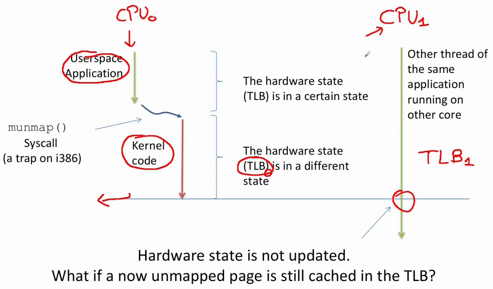

      - What happens if the CPU1 at that point will execute some memory operation will access some "virtual address" which belongs to memory regions which has just been unmapped but that information is still cached in the local TLB1?
        - In the worst case, it could be that that memory frame has been assigned to a different Application, so we could be leaking the data of a different Application (violate the process isolation)
      - So, everuytime that we have some trap/interrupt which updates the hardware state on one Core, it could be possible that we have to replicate that update also on different CPU Cores, otherwhise we end up in an inconsistent state and we could violate the process isolation; this problem is solved with IPIs (Inter processor interrupts)
  - Inter Processor Interrupts
    - Used to enforce cross core activities allowing a specific core to trigger a change in the state of another
    - Generated at firmware level but are processed at software level: they are interrupts, it means that we have some vector (somewhere in the IDT table) which associates that interrupt with some software routine in the OS; we can synchronously send a request (sender core) which is the generation of an IPI message (that is an interrupt in the very end) so, this IPI message will be asynchronously received at receiver core
    - Priority levels
      - Levels
        - High: leads to immediate processing of the IPI at the recipient
        - Low: queue requests and process them in a serialized way
      - So there are different vectors in IDT which are associated with different operations at level of software management of those interrupts
      - Both uses the same register to work
    - IPI hardware support (x86)
      - Uses APIC (modern x86 architectures this is the Quick Path Interconnect): part of the circuitry on each Core which allows us to initiate the sending of this IPI
      - There is one message class which is allocated to LAPIC messages and among the different Cores there will be one Virtual network which is dedicated to LAPIC messages (in particular IPIs)
      - So, we generate an IPI by setting one bit (the busy waiting bit) in the control register of IPIs, the firmware will generate a message which travels along the QuickPath Interconnect over a specified virtual network in order to reach the destination Core

        

    - IPI software management
      - Immediate handling is allowed when there is no need to share data across cores (stateless processing)
      - Examples
        - System halt (ex: upon panic): we transition our machine into some inconsistent state, the OS Kernel is no longer able to recover from that critical condition (called panic in Linux gergo); this condition is typically detected and/or triggered at a single core but in a multi-core machine, we want to prevent scenario in which one Core has detected that we are moving into a Kernel panic an the other Cores continue to execute
          - The idea is that, the Core which detects the panic will inform the other CPU cores of this panic in order to immediately transition the system into halt state
        - Execution of the same function across all the CPU cores (cross-core kernel synchronization): one core informs the other cores of its willingness to execute one specific function so, we synchronize the Kernel in a cross-core session by executing a specified function
        - Change of the hardware state across multiple cores in the system (e.g. the TLB): for example, we want perform some TLB flush on different cores, because we are invalidating some portions of virtual to physical translation of the memory
    - IPI vectors
      - `CALL_FUNCTION_VECTOR` (vector `0xfb`): sent to all CPUs but the sender, forcing those CPUs to run a function passed by the sender
        - Corresponding interrupt handler: `call_function_interrupt()`, corresponding interrupt is sent to all CPUs except the CPU executing the calling function by means of the `smp_call_function()` facility function
          - `call_function_interrupt()` will acknowledge the receipt of the interrupt and it will then look at data which have been passed by `smp_call_function()`, in order to execute that function
          - `smp_call_function()`: requests other cores to execute one specific function which is passed as parameter to this function
      - `RESCHEDULE_VECTOR` (vector `0xfc`): when a CPU receives this type of interrupt the corresponding handler named `reschedule_interrupt()` just acknowledges the interrupt
        - It is a vector used to request other Cores to perform a reschedule. Once this IPI is received, then the corresponding handler `reschedule_interrupt()` simply acknowledges the interrupt
      - `INVALIDATE_TLB_VECTOR` (vector `0xfd`): sent to all CPUs but the sender forcing them to invalidate their TLBs
        - Corresponding handler: `invalidate_interrupt()` flushes some TLB entries of the processor
        - It used to flush possibly selectively some entry of TLB; is one of high priority vectors which don't bring specific informations, but they just tell that some function should be executed immediately
    - IPI APIs
      - These functions are wrapped in the `struct apic` data structure: this wraps all the machine dependent aspects of the APIC controller; once we write Kernel code which interacts with those Low-level facilities rather than calling into the direct API to initiate an IPI, it is much better to rely on the function pointers stored in `struct apic` because this is future proof (this data structure should not change its interface, what we have behind could change in any version of the Kernel)
      - APIs
        - `default_send_IPI_all()`: sends an IPI to all CPUs (including the sender)
        - `default_send_IPI_allbutself()`: sends an IPI to all CPUs except the sender
        - `default_send_IPI_self()`: sends an IPI to the sender CPU
        - `default_send_IPI_mask()`: sends an IPI to a group of CPUs specified by a bitmask
    - Registering IPI functions (`CALL_FUNCTION_VECTOR`)
      - Older kernels

        

        - There was a one global variable which was a function pointer `f`; this was coupled with another pointer which was the arguments `args`, so, the execution of a call to `smp_function_call()` was taking as parameters a function pointer and a pointer to the parameters
        - This function `smp_function_call()` was registering the pointer `ptr` and the arguments `args` into this set of global pointers, then, it was triggering the IPI messages; all the other Cores were, in that turn, taking this pointer `ptr` and were basically calling `f(args)`
        - This data structure (so, the function pointer and the argument pointer) could be subject to race condition because two different Cores can decide to initiate an IPI message by calling `smp_function_call()` at same time (race conditions with respect to the content of these variables)
        - So these 2 global variables were lock protected: if the execution of this function takes a lot of time then all the other Cores which are trying to execute an `smp_function_call()` will wait on the lock for a very long time; this is a synchronization point which could significantly delay the registering of an action towards different cores
      - Newer kernels
        - There is a per CPU linked list of registered functions and associated data to process
        - Multiple Cores can register concurrently into this linked list the set of functions with associated data that should be process due to some IPI message; in order to enhance concurrency, accesses rely on lock-free list
        - How it works

          

          1. Core 0 wants to initiate the trigger of some IPI message
          2. Core 0 will get access to per-CPU variables of different Cores
          3. We have to ensure correct concurrent access also to per-CPU variables through the usage of a lock-free list
          4. Core 0 will get Per-CPU variable associated with this list for the first CPU invoked and it will basically register into that list, in a non-blocking fashion, a record which tells what is the function and what is the parameter to be executed upon the receipt of an IPI message
          5. This scheme is repeated for all CPU cores; once all CPU cores had registered this record into that private per-Core list the initiating Core will trigger the IPI message
          6. In the end, the different Cores with a certain delay, will receive the IPI message and they will handle that message by looking at their private Per-Core entry; they basically remove one node from this list in their Per-CPU linked list and they will activate the function with the corresponding parameter which was posted by Core 0
        - Data structure for one node of this list: `__call_single_data`
          ```c
          struct __call_single_data {
            struct llist_node llist;
            smp_call_func_t func;
            void *info;
            unsigned int flags;
          };
          ```
          - Once a node is unchained from the list by the receiving Core that Core will call the function `func` with parameters `info`
          - Lists on each CPU are processed by `flush_smp_call_function_queue()`
            - Invoked by the generic IPI handler: everytime that we receive an IPI message we go in our Per-CPU linked list and we see whether there are some functions which have been registered and we try to call them
            - Also invoked if a CPU is about to go offline: if we want to remove one CPU from the one which are currently active in our machine before doing that we have to execute all the functions associated with IPI messages which were registered at that CPU Core
        - `smp_call_function_many()`: function that initiates the sending of IPI message
          ```c
          /* Preemption must be disabled when calling this function. */
          // If Preemption is enabled, we find ourself in a scenario in which the code which is executing this thing will be descheduled; if this code is descheduled, then we could deliver the IPI message but we don't correctly wait for the corresponding acknowledge (this is why the Preemption disabled is required)
          // Arguments:
          //  mask: mask of CPU Cores which should receive that IPI message
          //  func: function that we want to invoke on top of the other Cores
          //  info: parameters of the function to be called
          //  wait: tell that we don't want to return from this function call until the other Cores have actually executed that specific function. For example, there could be a scenario in which we don't want to continue our execution until all the other Cores have executed that specific function, an example is, we do not want to return to Userspace before all CPU Cores have invalidate their local TLB.
          void smp_call_function_many(const struct cpumask *mask, smp_call_func_t func, void *info, bool wait) {
            struct call_function_data *cfd;
            
            // ......
            
            /* Can deadlock when called with interr. disabled */
            // Here we explicitely generate a warning if we detect that interrupts are disabled
            // If we have the interrupts disabled, the situation could be tricky: so, it could be that we are spinning in the second for_each_cpu() loop because we want the other Cores to perform that task that we have requested, but it could be that concurrently a different Core had registered on our Core some function to be executed. So, if we have interrupts disabled, we will never execute that function. So, it could be that we are waiting in the loop in order to wait for the other Core to execute that function. While the other Core is waiting for us to execute the function that it has posted on to our linked list. So, if we have those Cores that enter both with interrupts disabled then we might incur into a deadlock. So, if multiple Cores call smp_call_function_many() with interrupts disabled then the final IPI which is triggered by the function call arch_send_call_function_ipi_mask() will never be received because if we have interrupts disabled also we will not receive IPIs
            WARN_ON_ONCE(/*...*/ && irqs_disabled());
            
            // We have to publish our data structure (which is the call single data, csd data structure) on top of all CPU Cores.
            // So, we want to insert that node into all Per-CPU linked list, so, we have to iterate over all CPU Cores.
            for_each_cpu(cpu, cfd->cpumask) {
              call_single_data_t *csd = per_cpu_ptr(cfd->csd, cpu);
              // For each CPUs that we have, in the cpumask that we have specified, we use Per-CPU subsystem (per_cpu_ptr()) to take a pointer to a data structure (which is csd linked list) on top of that CPU (cpu). We have a pointer (*csd) which allows us to obtain a pointer to some data structure on that specific pointer.
              
              // We tell that we are populating the entry.
              csd_lock(csd);
              // If we want to wait, we put into the flags (flags is present in the data structure __call_single_data) that this guy here should be executed synchronously: it means that we are going to wait until the receiver of that specific function has not completed the execution.
              if (wait)
                csd->flags |= CSD_FLAG_SYNCHRONOUS;
              csd->func = func;
              csd->info = info;
              // Once we have set csd, we publish the function that we want to call along with parameters that we want to pass. Then, we use the lockless linked list abstract data type in order to publish (llist_add()) into that linked list this new node. And if this publish succeeds, then it means that we can deliver the IPI message to that specific CPU.
              if (llist_add(&csd->llist, &per_cpu(call_single_queue, cpu)))
                __cpumask_set_cpu(cpu, cfd->cpumask_ipi);
            }

            /* Send a message to all CPUs in the map */
            // We interact with "LAPIC controller" in order to deliver IPI message.
            arch_send_call_function_ipi_mask(cfd->cpumask_ipi);
            
            if (wait) {
              for_each_cpu(cpu, cfd->cpumask) {
                call_single_data_t *csd;
                
                csd = per_cpu_ptr(cfd->csd, cpu);
                // We want to check whether the CPU has notified as flagged the fact that that specific entry has been executed. So, we use a lock signal, along with these synchronous flag (CSD_FLAG_SYNCHRONOUS), as a sticky flag which tells: that node has been processed.
                csd_lock_wait(csd);
              }
            }
          }
          ```
          - Function call history
            ```c
            - smp_call_function_many() // (arch indep)
              - arch_send_call_function_ipi_mask() // (arch indep)
                - native_send_call_func_ipi() // (arch indep)
                  - apic->send_IPI_mask() // APIC world is x86 tailored, arch depend
                    - default_send_IPI_mask_logical() // arch depend
                      - __default_send_IPI_dest_field() // arch depend

            // This interacts with Lapic Interrupt Control Register which is split into 2 parts (ICR, ICR2).
            // Here (below) we will publish the mask, vector, and destination, and we will publish that information by writing that stuff natively into memory mapped register (by means of native_apic_mem_write())
            void __default_send_IPI_dest_field(unsigned int mask, int vector, unsigned int dest) {
               unsigned long cfg;
               // [...]
               cfg = __prepare_ICR2(mask);
               native_apic_mem_write(APIC_ICR2,cfg);
               cfg = __prepare_ICR(0,vector,dest);
               native_apic_mem_write(APIC_ICR,cfg);
              }
            ``` 
- I/O interrupts management
  - The amount of I/O interrupts that we receive in our machine is huge so we want to be as fast as possible to manage these hardware interrupts
  - Hard interrupts actions
    - Critical Actions: acknowledging the interrupt, reprogramming the device, exchanging data with the device (executed in the handlers with `IF=0`)
      - Terms explanation 
        - Acnowledging the interrupt: clear some interrupt request bit into the interface of the device
        - Reprogramming the device: we reprogram the device to perform some different actions like we re-activate the device to carry on some amount of work
      - Critical actions is the minimum set of actions implmented in device drivers to perform in order to correctly interact with device of which we are serving the interrupt request currently
      - Critical actions must be managed with `IF` cleared because otherwhise we would observe stack overflows because we are continuously serving the very same device or interrupt request from that device, or we are losing some amount of data
    - Non Critical Actions: any management of data structures in the kernel which are not shared with the device (quick, executed in the handler with `IF=1`)
      - Once we have a minimum amount of information which is, who has sent us the interrupt and what is the amount of data that we are dealing with, then we can switch to second set of actions: Non-Critical Actions
      - Once we have obtained this data from the Kernel then Non-Critical Actions places the information about the service interrupt request that we will have to perform into some Kernel-level data structures (they are not shared with devices)
      - If devices generates a new hardware interrupt, we will be able to obtain new pieces of information and eventually we will store all those information into Kernel-level data structures
      - We want to do this operation immediately after having received the hard interrupt
    - Non Critical Deferrable Actions: anything else (e.g copying data to userspace), this is done eventually
      - After that we finalize the inital part of management, so we have our information published somewhere into Kernel Data structures, then we have the third part: Non-Critical Deferrable Actions
      - After that we have interacted with the device, published information that are associated with that interaction into some Kernel-level data structure, eventually we will perform these operations that are deferrable work
      - So, anything else like copying data to Userspace performing any kind of routine at Kernel level, will be done later, because these actions have lowest priority
  - Performing critical actions

    

    1. Get interrupt by device through LAPIC
    2. Save IRQ value on stack (`n`)
    3. Acknowledge the IRQ to the device (the device is so allowed to send additional IRQs)
    4. Dereferenciate interrupt number in interrupt vector and call `do_IRQ(n)` which calls the ISR
    5. Execute the Interrupt Service Routines (ISRs, can be more than one!), here the `IF` might be set to 1
    6. `iret`: clean interrupt stack frame
  - Locating ISRs 
    - The same IRQ number can be shared with multiple devices, this is why we have multiple ISRs for an IRQ
    - Hardware Geometry allows ISRs to find out what is the correct routine to process the request
      - Into our hardware organization into our machine, we have several buses which give access to multiple devices, and those buses are associated with one single IRQ number
      - So, once we receive at Kernel-level one Interrupt Request, the number doesn't tell us exactly what is the device driver which should be activated in the very end
      - Example: we could attach to USB port mostly any kind of devices that we want (mouse, bluetooth dongle, etc.), so, the action associated with the management of hardware interrupts changes depending on the actual device; that USB port is the single USB port which will generate the interrupt request, so, we are multiplexing multiple devices into one single vector number
      - Example: `enp1s0` (name of a network adapter) tells what are the buses traversed to talk with this device starting from the CPU (so we know what is the actual device)
      - Example: USB device is organized with one major name which tells the vendor of the device and one other name which tells what is the actual specific device which we are using; these pieces of information tell us what is the physical device
    - ISRs are the way to bridge device drivers and IRQ management
    - Practically

      

      - For one vector number we have a set of actions and we have an handler
      - The handler (`do_IRQ()` function) will iterate across the different actions
      - These actions identify one function which should be called in order to service the interrupt; so, they are used to demultiplex actual functions that will be invoked once we have received that information
      - This selection is done by also reading information, which was read from the device when in the Critical part while we was exchanging data with the actual devices
  - Private thread stack and IRQ context: where we execute the IRQ code
    - If we were running into some Userspace Application and we receive an hardware interrupt, what happens is that we transition to Kernel Mode and we will take from `TSS` some stack which is associated to the Kernel
    - In particular, we have seen that we use some dedicated stack taken from `IST` in order to manage non-maskable interrupts otherwhise Linux transitions into the Kernel level stack of the Userspace Process which has received that interrupt
    - We want to remove the management of the interrupt simply for separation of concerns from that Kernel stack of that Userspace Process so, the dispatcher performs an additional operation...
      ```asm
      dispatcher:
          // In particular, after having transitioned to Kernel Space (also changing the gs segment), ...
          cld
          testb $0x3, 0x16(%rsp)
          jz 1f
          swapgs

          // ... it takes a copy of stack pointer
          push %rdi
          mov %rsp, %rdi // Switch stack but keep the current pointer
          // Since we have changed gs segment, we can access Per-CPU variable
          // We are taking a different top of the stack (Hard IRQ Stack) and we copy this stack pointer (cpu_current_top_of_stack) into rsp
          mov PER_CPU_VAR(cpu_current_top_of_stack), %rsp // Hard IRQ stack

          // Since the Interrupt Stack Frame was pushed by the Firmware on the previous Ring 0 Stack, we explicitely perform a copy, and we do that copy by abusing the push instruction
          // We basically push on the new stack, which is the new top of Hard IRQ stack, some value which is loaded from memory and will use the old stack pointer as the base address from which we dereference the original memory access
          // It means, the Linux Kernel is also performing in a single instruction a mem2mem copy because we have rdi (updated to old stack) and rsp previously updated to new Hard IRQ stack
          pushq 0x38(%rdi) // Copy interrupt frame
          pushq 0x30(%rdi)
          pushq 0x28(%rdi)
          pushq 0x20(%rdi)
          pushq 0x18(%rdi)
          pushq 0x10(%rdi)
          pushq 0x8(%rdi)
          mov (%rdi), %rdi // Restore RDI
          
        1:
          push %rsi // Get vector number as parameter (vector number has been previously stored into rsi)
          // We prepare the parameters
          mov 0x8(%rsp), %rsi
          mov %rdi, 0x8(%rsp)
          <save registers>
          
          call do_IRQ // Interrupts are off here (because this is not a trap handler, this is an interrupt handler and we have said that the Firmware automatically clears the IF when services an interrupt (not a trap))
      ```
    - In the end, this is called **Deferred work**: we are accumulating information provided by hw interrupts in a portion of memory and we will execute the computation in a later moment (i think)
  - Deferred work: longest part, non-critical, relative to resources management of the interrupt can be deferred to a later time
    - When precisely? Temporal reconciliation
      - We have already executed `iret` instruction (recall Performing critical actions), so, we are no longer (according to the point of view of the Firmware) into an interrupt context (the Interrupt Request has already been served)
      - From OS point of view that Interrupt Request should be finalized
        - Deferred work part will not be executed in an Interrupt Context, so we are in a safer part, so we typically can generate some delay and execute that stuff into a safer context
      - If we find ourself in a scenario in which we have nothing so important to do, then we can start to aggregate multiple units of deferred work at once
      - We take into account the possibility of starvation: we don't want that different units of deferred work are handled with so different priorities that some units of deferred work will never be executed
    - Graphic explanation

      

    - Basic idea: top/bottom halves
      - Top: executes a minimal amount of work which is mandatory to later finalize the whole interrupt management (critical, not interruptible)
      - Bottom: finalization of the work
      - The top half takes care of scheduling the bottom half task by queuing a record into a proper data structure
      - Graphically

        

        - Trigger of different nature: here we have the reconciliation point that process the deferable work
    - Main steps
      1. Initialization
         - Deferrable functions (that can be used to activate deferrable unit of works) are limited in number
         - They are initialized at kernel startup/module load
      2. Activation
         - A deferrable function is marked as pending
         - It will be run at the next reconciliation point
      3. Masking
         - Single deferrable functions can be selectively disabled
      4. Execution
         - Executed on the same CPU on which it was activated (for cache locality)
    - SoftIRQs: triggered at specific reconciliation point; related to different mechanism which is implemented in software in Linux to keep track of deferred work
      - We can receive any amount of Hardware Interrupts from any kind of device on any CPU Core
      - We want to run the deferred work associated with that Hard Interrupt on the same CPU core, so, we register some kind of SoftIRQ on the same CPU Core
      - We identify a suitable reconciliation point, this doesn't take into account the actual code which we are running; anything can be interrupted by a SoftIRQ once we reach a reconciliation point and we do not have control on the number of deferred work functions that will be executed
      - Fired at specific reconciliation points
        - Coming back from a hard IRQ
        - Coming back from a syscall
        - At specific points in code (e.g. `spin_unlock_bh()`, usually when you release a critical section)
      - Interruptible, so they must be reentrant
        - Macros
          - `local_irq_save(unsigned long flags)`
          - `local_irq_restore(unsigned long flags)`
        - This couple of MACROs in the kernel which allows us to disable and enable interrupts; in particular, they set or clear the local `IF` on that specific Core by taking into account the fact this call could be reentrant: this means that we have to save the previous state of IF

          
          
            - We have some function `f()` which has a Critical Section
            - We do not want this amount of code (`f`) to be interrupted by a different Hardware Interrupt so, it means that here, we want to set the `IF` to 0 and then we want to set `IF` to 1
            - What happens if this function is called by a different function `g()` who might have the very same need?
            - So, it means that at certain point, it marks Critical Section by setting `IF` to 0 (on the local Core), it starts executing its Critical Section and then calls into `f()` and then sets the `IF` to 1
            - This Critical Section here (on the right of the image from `IF <-- 0` to `IF <-- 1`) is safe
            - The problem is that `f` here explicitely sets `IF` (circled element `IF <--1` in the image) so, this means that, by calling into `f()` (right part of the image), `g()` has broken its own Critical Section
            - Now, here the problem is huge because also deals with mantainability
              - Everytime that we call a function if we want to be safe we should be able to check the all code base possibly, this doesn't scale
              - That's why we use these macros
            - `local_irq_save()` will save into `flags` the current content of `RFLAGS` (which keeps the `IF`)
            - After that, to mark the end of Critical Section we use `local_irq_restore()` which takes as parameter exactly `flags`
            - `local_irq_restore()` function will **not** explicitly set the `IF` rather it will simply take the content of this `flags` variable and put that back into `RFLAGS` register

              

      - Rarely used directly (we will use Tasklets instead)
      - Implementation

        

        - We have a kind of a bitmask (for each CPU) which can be regarded as a set of Software Interrupt Request number and we have a vector of handlers which are basically the handlers which are in charge of managing the different classes of SoftIRQ
        - Functions in the vector categorize different kind of actions that should be done
          - Basic tasklets
            - Units of deferred work with 2 different priorities: High priority (`tasklet_hi_action`) and Normal priority (`tasklet_action)
            - These are the functions will actually execute the work generated by Hard Interrupts
          - Tasklets that handle transmission and receipt of packets to and from network interfaces (`net_tx_action`, `net_rx_action`)
          - Tasklets which are associated with sending and receiving of data blocks to and from devices (`blk_done_softirq`, `blk_iopoll_softirq`)
          - Functions which are associated with timer interrupts (`run_timer_softirq`)
          - RCU which is one of the synchrinization mechanisms that we have in the Linux Kernel (`rcu_process_callbacks`)
        - If we have multiple SoftIRQs which are standing (multple flags which are set), then we will execute them in a priority session (the guys which come first in this vector have higher priority)
        - We can reach this vector `softirq_vec` from 3 different places
          - Interrupt Handler: after that we are returning from an Interrupt Handler
          - Soft IRQ Handler: there are some explicit synchronization points which basically invoke the activation of SoftIRQ
          - ksoftirqd/[cpu]: there is on each CPU one Kernel level thread which is in charge of executing this kind of SoftIRQs deferred work (if the Scheduler decides to activate this IRQ deamon then some deferred work will be executed if available)
        - `do_softIRQ()`: check whether there is some work to be done
          1. Checks if invoked in interrupt context: everytime that we are going to execute some deferred work unit, typically we don't want to be interrupted, so, if we are running in an interrupt context then `do_softIRQ()` function will simply return
          2. Calls `local_irq_save()`
          3. Switches to a private stack (similarly to HardIRQ management)
          4. Processes IRQs (`__do_softIRQ()`)
          5. Calls `local_irq_restore()`
        - `__do_softIRQ()`
          - It will look at whether there is some standing SoftIRQ to be executed; if this is the case it will activate the corresponding function in the SoftIRQ vector
          - Other deferrable functions are deactivated locally while processing actions (`local_bh_disable()`)
          - Local HardIRQs are reenabled: after that some standing interrupt is found Hard IRQs are again enabled (we want to be atomic with respect to setup of different stack and with respect to checking the standing bits)
          - During the execution of SoftIRQs other SoftIRQs can be activated (the bitmask is locally copied)
            - Once we reenable Hard Interrupts, after SoftIRQs can be actived (namely they can be named standing), then `__do_softIRQ()` has made a local copy of previous bitmask and other Hard Interrupts, which could be activated while this bitmask is being checked/modified to register additional SoftIRQs to be executed
            - Once the `__do_softIRQ()` function has finished to process these standing SoftIRQs by looking at bits in the bitmask, it re-checks again whether some new Hardware Interrupts have been published by somewhere else in the system
            - This iterative procedure is repeated a certain number of iterations, so, we repeatedly execute all the standing IRQs which have been posted, also possibly concurrently with the execution of the SoftIRQs because we have locally copied the bitmask
          - After a certain numbers of iterations, it activates the SoftIRQ Daemon (with low priority)
            - After a certain numbers of iterations, we leave this loop, this is done, because we are using CPU cycles from some CPU in a totally unknown context
            - Example
              - We have finished to execute some Critical Section and after the execution of that Critical Section we start executing SoftIRQs
              - We don't want to use that CPU for a too long time so, if we are not able to find an empty SoftIRQ bitmask after a certain number of iterations, it means that at this current moment there are a lot of activities in the OS which are basically activating a lot of standing IRQs
              - This means that we want to release the CPU to the original execution flow which triggered the activation of these SoftIRQ functions, but we want also to serve these SoftIRQs
              - In that case, we want to return but we also activate the SoftIRQ Deamon
              - The SoftIRQ Deamon is a Kernel level thread which is typically in a blocked state unless `__do_softIRQ()` notice that there is a lot of work to be done
              - This deamon is subject to scheduling, so, it will be the Scheduler, with some low priority, will decide whether to activate that Kernel level Deamon
        - SoftIRQ deamon: `ksoftirqd`
          ```c
          for(;;) {
            set_current_state(TASK_INTERRUPTIBLE);
            schedule();
            /* now in TASK_RUNNING state */
            while (local_softirq_pending()) {
              preempt_disable();
              do_softirq();
              preempt_enable();
              cond_resched();
            }
          }
          ```
          - This is an infinite loop because it is a Kernel level thread whose only goal is to serve SoftIRQs, so, it will indefinitely tries to execute SoftIRQs
          - `set_current_state(TASK_INTERRUPTIBLE)`: setting that task to `TASK_INTERRUPTIBLE` before going to sleep tells that that specific thread can be waken up by someone else by means of a traditional unique signal
          - `schedule()`
            - It will call explicitely `schedule()` which is the entry point of the Linux Scheduler (implementation independent)
            - Scheduler will be run and it will possibly decide that the thread which has invoked it, has to go to sleep and another process should be activated
            - Since `ksoftirqd` is a deamon with very low priority, this deamon basically asks the Scheduler to yield the CPU to any other process (if any) which has higher priority
            - So, in the very beginning, the `SoftIRQ deamon` will tell the Scheduler to process some other process with higher priority (if any)
          - `while`: (after being waken up) `local_softirq_pending()` continuously look at whether there is some SoftIRQ signal pending; if that the case we go into loop
          - In the `while`: 
            1. Don't want be preempted
            2. Call into `do_softirq()`
            3. Reenable preemption
          - `cond_resched()`
            - Function for seeing if our time quantum is expired and if that's the case then we will be descheduled because there is someone else which must take control of the CPU
            - If our time quantum didn't expire while we have been processing some SoftIRQ signal pending then we check again whether some SoftIRQ signal is pending (`local_softirq_pending()`)
            - This could happen because some other different Hard Interrupts might be activating some handler which executes the registering of some deferred work unit function and also because `do_softirq()` function, in the end, will just process a certain number of iterations checking of the SoftIRQ bitmask
            - So it could be that we return into the `ksoftirqd` deamon without having processed all the SoftIRQs which were standing
            - If we still have time to process SoftIRQ the we do so and we repeat
            - If we don't find any additional SoftIRQs which is standing the we iterate an we call `schedule()`, we yield the CPU to someone else
      - Tasklets: facilities that Linux Kernel offers us in order to register and manage deferred units of work
        - Data structures used to track a specific task related to the execution of a specific function in the kernel
        - Defines one unit of deferred work that we want to execute once a SoftIRQ associated with a specific Tasklet will be fired and typically all the device drivers, all the portion of the Kernel which deal with deferred work will actually rely on tasklets
        - The function accepts a parameter (an `unsigned long`) and is of type `void`
          - A function which we want register into a tasklet access one single parameter which is an `unsigned long`
          - This `unsigned long` is enough to also store some kind of pointer in memory (we can also pass some data structure as a parameter of that function)
          - We don't know when that tasklet will be activated so, we are not expected to return anything from a function which was registered as a tasklet
        - Tasklets are declared as
          - `DECLARE_TASKLET(tasklet, function, data)`
          - `DECLARE_TASKLET_DISABLED(tasklet, function, data)`
          - Parameters
            - `tasklet`: what is the tasklet data structure which we are declaring
            - `function`: the function we should invoke once the tasklet is run
            - `data`: data parameter that we will pass at that function
          - If declared as disabled tasks will not be executed until enabled
        - Enabling and running tasklets
          - API
            - `tasklet_enable(struct tasklet_struct *tasklet)`: register tasklet in `tasklet_action` (see `softirq_vect`)
            - `tasklet_hi_enable(struct tasklet_struct *tasklet)`: register tasklet in `tasklet_hi_action` (see `softirq_vect`)
            - `tasklet_disable(struct tasklet_struct *tasklet)`: removes the tasklet from the corresponding SoftIRQ data structure
            - `void tasklet_schedule(struct tasklet_struct *tasklet)`: explicitely schedule a tasklet, so, we can activate explicitely one tasklet which has been registered somewhere (we are not expected to rely on that)
          - Each tasklet represents a single task
          - Unless a tasklet reactivates itself, every tasklet activation triggers at most one execution of the tasklet function
          - A tasklet of the same kind cannot be run concurrently on two different cores
            - If a core is running a tasklet and another core attempts to run it it is again deferred to a later time
          - All non disabled Tasklets are executed before the corresponding SoftIRQ action completes
          - Disabled Tasklets are put back in the corresponding list 
      - Work queues: tasklets but newer
        - Tasklets problem: we don't know exactly in what context that tasklet will be executed, we don't know when it will be executed and we typically don't know if we have a long tasklet if we will delay the execution of specific action
        - Solution: work queues
          - Run by ad hoc kernel level worker threads: on each Core we have a pool of Kernel-level worker threads, which are activated by the scheduler, and they will execute any pending action in the work queues that they can find, but they are subject to the scheduling policy of the Linux Kernel
          - Run in process context (can perform blocking operations)
            - Tasklet: we cannot perform any action which puts the thread of execution to sleep, because we don't know who is executing our tasklet (we are basically forcing the deschedule of a kernel thread which we don't know, DANGER!)
            - Work Queues: rely on explicit worker threads, so we have a pool of worker threads, so if we go to sleep in a function which is registered in a work queue, we are putting to sleep a worker thread which is dedicated to that sort of action
          - **CAN'T** access userspace address space
            - Running in process context doesn't mean that we can access some Userspace address space because those are kernel-level worker threads
            - Kernel level worker thread is a thread, a process which has its own PID but it doesn't have a Userspace counter part, so there is no Address space mapped in Userspace
        - Data structure (HIGHER LEVEL)
          ```c
          // Defines one work queue
          struct work_struct {
            atomic_long_t data;
            // List of entries associated with some function that we want to activate
            struct list_head entry;
            // Function to be activated
            work_func_t func;
          };
          
          typedef void (*work_func_t) (struct work_struct* work);
          ```
        - APIs
          - `INIT_WORK(work, func);`: initialize work queue
          - `INIT_DELAYED_WORK(work, func);`: initialize some unit of delayed work
          - `INIT_DELAYED_WORK_DEFERRABLE(work, func);`: initialize some unit of delayed work
          - `struct workqueue_struct *create_workqueue(name);`: create dynamically some work queue
          - `void destroy_workqueue(struct workqueue_struct *);`
          - `int schedule_work(struct work_struct *work);`: schedule explicitely some work queue to be executed
          - `int schedule_work_on(int cpu, struct work_struct *work);`: ask some work queue to schedule on one specific cpu
          - `int scheduled_delayed_work(struct delayed_work* dwork, unsigned long delay);`
          - `int scheduled_delayed_work_on(int cpu, struct delayed_work *dwork, unsigned long delay);`: delayed work (different from deferred work) is associated with an explicit time delay
        - Delayed work data structure
          ```c
          struct delayed_work {
            struct work_struct work; // Work queue (HIGH LEVEL)
            struct timer_list timer;
            
            /* target workqueue and CPU->timer uses to queue->work */
            struct workqueue_struct *wq; // Work queue (LOW LEVEL, threads, mutexes...)
            int cpu;
          };
          ``` 
          - `timer_list`: data structure which tells what is the actual time instant at which that specific unit of work shall be executed
        - Data structure (LOW LEVEL): describes the pool of workers that will basically manage the deferred work
          ```c
          struct workqueue_struct {
            struct list_head pwqs; /* WR: all pwqs of this wq */
            struct list_head list; /* PR: list of all work queues */
            struct mutex mutex; /* protects this wq */
            int work_color; /* WQ: current work color */
            // ...
            struct list_head maydays; /* MD: pwqs requesting rescue */
            struct worker *rescuer; /* I: rescue worker */
            char name[WQ_NAME_LEN]; /* I: workqueue name */
            // ...
            struct pool_workqueue __percpu *cpu_pwqs;
            // ...
          };
          ```
          - `pwqs`: worker threads (or workers) of this `workqueue_struct`, which can be used in order to take control of deferred work units that we have published in some `work_struct` data structure
          - Rescue
            - Could still incur into some deadlock conditions because we have that explicitely we can ask some of the worker threads to go to sleep so, it could be that there are some scenarios in which the worker threads have acquired some resource from the OS and then they went to sleep but they are not going to release those resources and we could have some other worker thread which was waiting for that resource to be released
            - Deadlock detection mechanism: we have a set of so called maydays threads which are activated everytime that deadlock detection algorithm in the Linux Kernel detects that some of the workers have deadlocked
            - The only goal of those threads is to release the resources which have caused the deadlock and notify the workers that that deadlock occured; so, once they are reactivated they know, for example, that they have to restart some action because that resource was stolen while they were waiting for some condition to occur
        - Summary

          

          1. The handler after it has executed some top half part (non deferrable work), it will publish in the work queue some unit of work (`struct work_struct`) to be done
          2. The `work_struct` data structure is read by a pool of `worker threads` (`workqueue_struct`)
          3. As soon as the event is triggered (start doing deferred work) the worker from the `workqueue_struct` will invoke in a process context (which is the context of the worker) all the handler functions that have been registered (into the `work_struct`) in the bottom half part (deferrable work) for that specific work queue
        - Predefined work queue
          - Problem: everytime that we install our work queue also a pool of workers will be created but spawning a set of worker threads to run a function is an overkill
          - Solution: predefined work queue (Events work queue `keventd_wq`)
            - We don't have to specify explicitely the work queue on which we want to post our deferred work
          - APIs
            - `schedule_work(w) → queue_work(keventd_wq, w)`
            - `schedule_delayed_work(w, d) → queue_delayed_work(keventd_wq, w, d)` (on any CPU)
            - `schedule_delayed_work_on(cpu, w, d) → queue_delayed_work(keventd_wq, w, d)` (on a given CPU)
            - `flush_scheduled_work() → flush_workqueue(keventd_wq)`
          - Don't block for along time; functions gets serialized on each CPU
            - We do not block for long time because although, we can sacrifice one worker thread, in the very end we have that all the functions that are posted on that specific work queue might becomes serilized

#### Time management

- Timekeeping
  - There are multiple hardware and software facilities to keep track of time
  - They provide different granularity and precision
- Kernel-level timekeeping concepts
  - Timeouts: used to detect when an event does not occur as expected (in a certain amount of time)
    - Low resolution requirements (we don't need to be precise)
    - Almost always removed before they actually expire
  - Timers: used to sequence ongoing events
    - They can have high resolution requirements (be precise) and usually expire (we are telling to OS that we want to do something at later time and once that time comes, that timer will expire and we will trigger the associated action)
- Hardware clock sources: hardware clocks
  - OS at startup time queries all the available devices that it has on the motherborad, in order to do that it rely on some information which is given by the BIOS; it will understand what possibly available Hardware Clock Sources are found in that specific machine (it can classifies those Hardware Clock Sources depending on the precision that they have)
  - Types
    - Real Time Clock (RTC)
      - Available on all PCs
      - Can trigger an interrupt periodically or when the counter reaches a certain value
      - Not so used nowadays
    - Time Stamp Counter (TSC)
      - Available on x86 CPUs
      - Counts the number of CPU clocks
      - Counter register on each CPU Core
      - Can be explicitly read (`rdtsc`)
      - Problem: VDFS allows us to perform some voltage and frequency regulations so we can change the frequency of our CPU and we can do that on a Per-Core basis
        - If we are counting CPU Clocks then it could be that those values on 2 different Cores might diverge
        - Since we can change that frequency at Runtime, one unit of the TCS cannot be associated with one amount of time (time is passing, we don't know how much time)
        - This thing broken several software implementations
        - In newer generations of Intel Architectures, that TSC is no longer counting the number of CPU Clocks, it is counting the number of From Side Bus (FSB) Clocks (counting something that it is not subject to Dynamic voltage and frequency scaling, DVFS)
    - Programmable Interval Timer (PIT)
      - Can be programmed explicitly (able to change the time quantum assigned to the different processes)
      - Sends an interrupt periodically (the timer interrupt) to all CPUs
      - Can be processed explicitly by the OS: it is seen as an external device, we write some value into some register on that device, and that device will send us an interrupt once that timer has expired
      - Superseded by the LAPIC
    - CPU Local Timer (LAPIC)
      - Available on x86 CPUs
      - Programmable timer, so the OS can tell the LAPIC how much time has to pass before the next interrupt will be fired
      - Delivers a timer interrupt only to the local CPU
      - Preferred way to implement time keeping in the Linux Kernel
    - High Precision Event Timer (HPET)
      - Offers multiple timers which can be programmed independently
      - Allows us to insert more timers (which will eventually expire) and we can program them independently
- Clock events: interface to underlying hardware clocks
  - Linux Kernel tries to make homogeneus non-homogeneus stuff at level of the hardware, the OS will try to find a way to make uniform the accesses to those different Hardware Clock Sources
  - Clock Events are generated by Clock Event Devices
  - This interface allows to drive hardware which can be programmed to send interrupts at different grains
- Linux timekeeping architecture
  - Tracking elapsed time
    - In Linux time is measured by a global variable named jiffies which identifies the number of ticks that have occurred since the system was booted
    - The idea of jiffies is that we track some amount of time that has passed but we cannot really quantify that with some kind of common unit of measure (if we know how much microseconds a tick is, so if we know the frequency of those ticks, then we can remap those jiffies to some amount of seconds)
    - Example purpose: current absolute time to calculate the time out value for a timer
  - Timer interrupts management (old kernel or IOT devices)
    - Handled according to the top/bottom (defere) half paradigm (using Task Queues, similar to tasklets, which have now been removed from the Kernel)
    - How it works
      - The top half executes the following actions
        - Registers the bottom half
        - Increments jiffies
        - Checks whether the CPU scheduler needs to be activated and in the positive case flags `need_resched`
    - Exaplanation
      - If the scheduler needed to be activated, the top half didn't activate the scheduler because the top half is running with interrupt disabled
      - So, it was basically setting a flag (global variable, `need_resched`) which was telling "I need to run the Scheduler"
      - So, at some reconciliation point with interrupts enabled the Kernel was checking whether `need_resched` was set or not to run the scheduler
      - The idea is that after some jiffies increment, the Kernel decided that time quantum was expired and in particular it was setting `need_resched`
    - Global scheme
      
      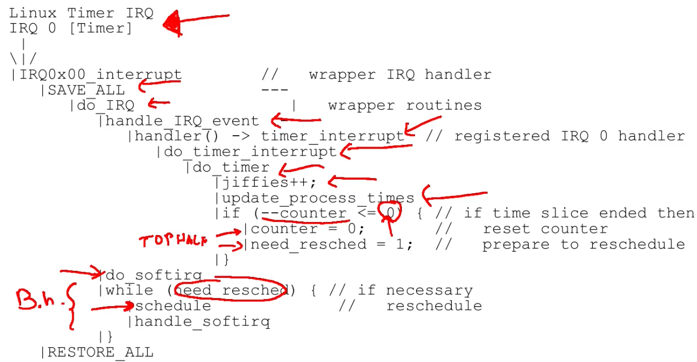

      1. Receiving some interrupt request and then activating Hard Interrupt Manager
      2. `SAVE_ALL`: Hard Interrupt Manager saves all registers (simple snapshot of the CPU on top of the stack)
      3. `do_IRQ` called; basically a wrapper which, in the end, was identifying the interrupt service routine (the `timer_interrupt` event)
      4. `do_timer_interrupt`: `timer_interrupt` event was calling into `do_timer_interrupt` function that calls the `do_timer` function
      5. `do_timer`: update jiffies; a new jiffy has passed.. How much is it a jiffy? Some time
         - That was the time keeping management at time; because it didn't have very precise hardware, so we were just counting the passage of time as a multiple of the number of timer interrupts that we received
      6. `update_process_time`: updating the process time for our application, so the information which tells how much time we have been running the machin
      7. `--counter`
         - The time quantum at the time was implemented by relying on a single global variable, this global variable was decremented after we have received a timer interrupt
         - So, also the time quantum was implemented as a multiple of the number of timer interrupts that we were receiving
         - Once our time quantum finished (`--counter <= 0`) we reset the counter (`counter = 0`) because that went below 0 and we simply set `need_resched` (need to reschedule)
         - Then we were coming back and we were typically, at a certain point, enabling again the interrupt flag (IF)
      8. `do_softirq`: once enabling the IF, the Kernel executed the `do_softirq` function that is the reconciliation point for the SoftIRQ mechanism discussed before 
      9. Then the Kernel, coming from an interrupt, was checking whether `need_resched' was set or not
         - If it was set, then it called schedule
         - Once coming back from schedule function, depending on the scheduler policy, it could be that we were entering this function in the context of one process and we were coming back in the context of a different process
  - High-resolution timers: facility based on hardware high-resolution timers
    - Based on an additonal type `ktime_t` (with a granularity of nanosecond): on one hand we have jiffies tell us that a certain amount of time has passed, here, since we have more precise Hardware Clock Sources, we can do down to the representation of nanosecond
    - Data structure
      ```c
      struct hrtimer {
        struct timerqueue_node node;
        ktime_t _softexpires;
        enum hrtimer_restart (*function)(struct hrtimer *);
        struct hrtimer_clock_base *base;
        u8 state;
        u8 is_rel;
      };
      ```
      - We can put this High-Resolution Timer into some queue (`struct timerqueue_node node`): we have some data structure which allows us to enqueue different timers that we want to use in our machine
      - Function `enum hrtimer_restart (*function) (struct hrtimer *)` which can be called (for example, in order to restart that timer) once that High-Resolution Timer has expired
      - `ktime_t _softexpires`: tells the nanosecond scalar representation after which that timer should expire
        - `_soft` prefix: the OS, especially if it is very loaded, might find out that this timer has expired after the amount of nanoseconds which we have set for deadline; so, the High resolution Timer has High Resolution because we can express the passage of time in terms of nanoseconds; we are not guaranteed that that timer will expire, in the sense that the corresponding function will be activated exactly in that moment (it is a lower bound of the time at which the corresponding function will be activated)
    - APIs
      - General info
        - Everytime that we initialize ans start a timer, after that that timer expires, the corresponding function will be invoked
        - By default, High Resolution Timers will expire (and launch the function) on the Core on which we have registered them
      - APIs
        - `void hrtimer_init(struct hrtimer *time, clockid_t which_clock, enum hrtimer_mode mode);`
        - `int hrtimer_start(struct hrtimer *timer, ktime_t time, const enum hrtimer_mode mode);`
        - `int hrtimer_cancel(struct hrtimer *timer);`
        - `int hrtimer_try_to_cancel(struct hrtimer *timer);`
        - `int hrtimer_callback_running(struct hrtimer *timer);`: check if a timer is running
  - Kernel timers: facility of timers which are not High Resolution (not as precise as high resolution timers)
    - A facility to allow a generic function to be activated at a later time (time out instant)
      - Fundamental for applications (e.g. `alarm()`, if we call it in Userspace, we are asking the Kernel to send us a `sigalarm`, after the specified amount of time has passed, not precise)
      - Widely used by device drivers (e.g. to detect anomalous conditions, I sent a packet and I didn't received the ack, I don't want to be precise at nanosecond)
    - Timers are associated with deferrable functions: Linux does not guarantee that activation takes place at exact time
  - Dynamic kernel timers: dynamically created and destroyed
    - Idea: we install some timeout in a device driver, if that expires we are notified of that but we will likely have that timeout retracted before it expires
    - Data structure
      ```c
      struct timer_list {
        /*
         * All fields that change during normal runtime
         * grouped to the same cache line
         */
        struct hlist_node entry; // Hash list node function, here we store the timer
        unsigned long expires; // Expire time
        void (*function)(struct timer_list *);  // Once the timer expired then call corresponding function
        u32 flags;
      };
      ```
    - APIs
      - `void init_timer(struct timer_list *timer);`
      - `void setup_timer(struct timer_list *timer, void(*function)(unsigned long), unsigned long data);`: set timer
      - `int mod_timer(struct timer_list *timer, unsigned long expires);`: edit expire time
      - `void del_timer(struct timer_list *timer);`
      - `int timer_pending(const struct timer_list *timer);`: check if timer pending or expired
      - There could be some concurrency: if we deallocate one timer data structure which has been setup and initialized and at that time the timer expires after we deleted that, then we could incur into race conditions; so before releasing a data structure associated with a timer we have to explicitely delete that timer
  - Kernel timer management
    - Who is going to detect that some timer has expired?
    - In the very early implementations of the Linux Kernel timers were put into a single list (slighlty ordered list, almost ordered accordingly to expiration time)
      - In the Interrupt Management the Kernel was checking whether some nodes have expired or not and it was calling the corresponding function
      - Costly, for multiple addition and removal of timer it was slow
    - Now a new data structure was introduced which is called Timer Wheel
      - It uses the calendar queue

        

        - In the Calendar Queue we have an array which represents the month of a calendar and if we reach the end of the month we start again from the first cell (just one month)
        - The cell is called bucket and in a bucket we implement a Linked list; this is associated with a time (T0, T1, T2, ...)
        - It could be that T2 belongs to the next month (in the sense that everything is connected)
        - Each one of these buckets are associated with a bucket width which tells what is the starting time and ending time for the list it contains
        - So, everytime that we want to insert a new timer into this list, we look at the time of the new timer which we are installing and we find the bucket with the corresponding proper width and we will chain that timer to the corresponding bucket and, in the end, we will basically order all the elements into one single bucket
        - If we have a lot of nodes into one list then we simply resize that data structure (so, we double/half the number of buckets)
      - Timer wheel: just a multi level calendar queue

        

    - Timer interrupt activation (old kernel, in newer version is more or less the same just a bit rearranged)
      ```c
      __visible void smp_apic_timer_interrupt(struct pt_regs *regs) {
        struct pt_regs *old_regs = set_irq_regs(regs);
        
        /*
         * NOTE! We'd better ACK the irq immediately,
         * because timer handling can be slow.
         * 
         * update_process_times() expects us to have
         * done irq_enter().
         * Besides, if we don't timer interrupts ignore the global
         * interrupt lock, which is the WrongThing (tm) to do.
         */
        entering_ack_irq();
        trace_local_timer_entry(LOCAL_TIMER_VECTOR);
        local_apic_timer_interrupt();
        trace_local_timer_exit(LOCAL_TIMER_VECTOR);
        exiting_irq();
        
        set_irq_regs(old_regs);
      }
      ```
      - APIC timer used to keep track of the advancement of time: everytime that APIC timer sends an interrupt, this function is triggered (`smp_apic_timer_interrupt()`)
      - `entering_ack_irq()`: acknowledge the receipt of Hardware Interrupt
      - `local_apic_timer_interrupt()`: bridge between the association of the receipt of timer interrupt and management of clock event which is used to keep track of Hardware Interrupt coming from that clock source (namely the apic timer)
        ```c
        static DEFINE_PER_CPU(struct clock_event_device, lapic_events);
        
        static void local_apic_timer_interrupt(void) {
          struct clock_event_device *evt = this_cpu_ptr(&lapic_events);
          // ...
          inc_irq_stat(apic_timer_irqs);
          evt->event_handler(evt);
        }
        ```
        - Here we bridge as said, the notion of the timer interrupt and clock event
        - We have a Per-CPU variable which is associated with events (`&lapic_events`) coming from LAPIC timer, this means that everytime that a programmed LAPIC timer interrupt comes on that specific CPU, the event associated with that timer interrupt will be retrieved from Per-CPU variables (`evt` = clock event device which represents in software the LAPIC timer)
        - This clock event device `evt` is associated with some handler; by starting from the event (`evt`), we invoke the `event_handler` and we pass all the information associated with the event (`evt`)
        - In the very end, we will call into updated process times as seen before; the only thing different is that we don't have a direct invocation from the interrupt handler of that function which updates the amount of time which has passed
          - The fact that we can reprogram the LAPIC controller makes significantly changes in the development of the OS
            - Before, once we were relying on simpler devices like PIT, we were necessarly requested to send periodic timing interrupt for scheduling activities
            - Now that we have the notion of reprogrammable timing devices, we can set a new clock event associated with the moment in which we want to re-run the scheduling activities; this is the idea of a Tickless Kernel
          - Tickless OS Kernel: Kernel which doesn't keep track of the scheduling activities by relying on periodic interrupts, it simply receives an interrupt once the scheduling quantum has expired
            - This means that we are removing from the critical path of the execution of the OS Kernel all those timer interrupts which are required to keep track the balacement of time (so we are serving reduced number of interrupts, we are faster)
      - After that we have executed APIC timer interrupt we simply leave the interrupt context (`exiting_irq()`) and everything can continue as before
    - POSIX clocks
      - POSIX standard states that there is a different set of clocks that a POSIX-compliant OS (which in part is the Linux Kernel) should offer
      - We can implement those clocks depending on the kind of hardware which we have in our machine
      - Types
        - `CLOCK_REALTIME`: provides a best effort estimate of UTC, most basic clock
        - `CLOCK_UTC`: like `CLOCK_REALTIME` but has an accuracy of 1 second
        - `CLOCK_TAI`: value of the International Atomic Time with at least an accuracy of 1 second; synchronized between all the atomic clocks which are present in all software implementation in the world
        - `CLOCK_MONOTONIC`: monotonic counter (continuously increments), precision granularity 500 ppm (changing the precision according to which we specifiy the precision of the advancement of this Monotonic Clock)
        - `CLOCK_THREAD` and `CLOCK_PROCESS`: start counting from the moment in which either the thread was spawned or the process was created; those clocks increment their value only when the thread or the process are actually being scheduled on the CPU (if we read those 2 clocks then we will know the elapsed time of a thread or a process)
  - Overall

    

    - Clock source: a hardware component is considered a Clock Source
    - Clock synchr: the Clock Source tries to be synchronized, in particular, with respect to, for example, the International Atomic Time
    - Timekeeping: a clock source triggers the timekeeping activities which boils down to the execution of High Resolution Timers (hrtimers)
    - Clock events: if we have programmable timer interrupts they will send us Clock Events; this is managed by a dispatcher (Event distribution), like the one seen for the LAPIC controller, the LAPIC timer interrupt
    - Event distribution: this dispatcher will call into some Event Handler which will trigger some activities
      - Activities could trigger the execution of a functionregistered in a High Resolution Timer (hrtimers), so we can advance to the Next Event
      - Activities could be associated with keeping track of time which a process or a thread is consuming on the CPU (`CLOCK_THREAD` or `CLOCK_PROCESS`)
      - Profiling: activities could track down the performance
      - Jiffies: activities could update the variable which keep track of time advancement
        - Used to trigger Non-High Resolution Timers attested on top of the Timer Wheel data structure
  - Linux watchdog
    - Software component that monitors whether system is behaving in a normal way; if it detects some abnormal behaviour, it will reset the system
    - Consider the situation in which we cannot have access to our machine: Linux Watchdog tries to automatize the procedure of reset
    - How it works
      - A kernel level module which is able to perform a hard reset (software implementation of pressing the restart button)
      - A user space background daemon that refreshes the timer: periodically tells the OS that everything is working (from the Userspace point of view, it means that this Process with some periodicity is scheduled so the machine is working good)
    - Implementation
      - At kernel level this is implemented using a non-maskable interrupt
        - We use NMI because it could be that the Kernel is stuck into some kind of Interrupt Handler running with `IF` cleared; so we have this NMI which is triggered periodically, the activity that is associated with this NMI is to simply increment some counter which tells the number of NMIs which have been received
      - The userspace daemon will notify the kernel watchdog module via `/dev/watchdog` device file that userspace is still alive
        - Infinite loop that performs a system call which is `ioctl()` which interacts with `/dev/watchdog`; `ioctl()` call will trigger the function associated with `WDIOC_KEEPALIVE` event
        - This event will simply increment the number of activities, the number of schedules which underlying Kernel is receiving
        - So, if the Kernel schedules the Userspace Deamon, every `N` seconds (below 10 seconds) will simply tell the underlying OS that it is running
        - The NMI handler will check whether this `ioctl()` call was executed; if it is not executed for a long amount of time, it means that Userspace Applications are no longer scheduled and it will trigger the reset of the machine
        ```c
        while(1) {
          ioctl(fd, WDIOC_KEEPALIVE, 0);
          sleep(10);
        }
        ```

### Dealing with Concurrency in the Kernel

- Concurrency properties
  - Properties
    - Safety (correctness): nothing wrong happens
      - What does it mean for a program to be correct?
        - It means that it follows a strict happened before relationship
        - But concurrent implies an ambiguous temporal ordering 
      - Intuitively if we rely on locks changes happen in a non interleaved fashion (resembling a sequential execution)
      - We can say a parallel execution is correct only because we can associate it with a sequential one
      - Conditions
        - Linearizability: tries to generalize the intuition of correctness (used to transform this concept to multicore systems)
          - A history is a sequence of invocations and replies generated on an object by a set of threads
          - A sequential history is a history where all the invocations have an immediate response
          - A history is called linearizable if
            - Invocations/responses can be reordered to create a sequential history
            - The so generated sequential history is correct according to the sequential definition of the object
            - If response precedes an invocation in the original history then it must precede it in the sequential one as well

            

            - Here process 3 can't be reordered
          - An object is linearizable if every valid history associated with its usage can be linearized
    - Liveness (Progress): eventually something good happens
      - Opposed to Starvation
      - Conditions
        - Deadlock free: some thread acquires a lock eventually
        - Starvation free: every thread acquires a lock eventually
        - Lock free: some function call completes

          

          - CAS: compare and swap
          - If we have another function like this they might starve together
        - Wait free: every function call completes
          - The example of lock free doesn't exist
        - Obstruction free: every function call completes if they execute in isolation

          

          - Transactional Memory: set of facilities algorithms which allow us to perform atomic updates on arbitray complex data structures in memory (implements what is drwan in the picture)
            - Software: at Runtime, ensures that keeps track of what we are writing, where we are writing and what we are reading and where we are reading from in order to detect whether there are some conflicts
            - Hardware: the Firmware which keeps track of what is called the read-set and write-set of the transaction, so what data have been read and what have been written in whether there is some correlation between the two
              - In Intel world, there are some processors which implement TSX (Transaction Extension)
                - Hardware implementation in which they have added a couple of opcodes which trigger the initiation of a transaction and the ending of a transaction; TSX has modified the cache coherence protocol, so it has basically added some states which tell whether some cache line has been accessed transactionally
                - So, we have a bit in the cache line to tell whether that data was accessed in read mode or write mode within a transaction, it is the cache coherence protocol, which determines whether we have a conflict
- Concurrent and preemptive kernels
  - Preemptive: a process running in kernel mode might be replaced by another process while in the middle of a kernel function
  - Concurrent: any core can run kernel functions at anytime
  - Kernel code must ensure consistency and avoid deadlock
  - Solutions
    - Explicit synchronization (mandatory in multicore)
    - Non blocking synchronization (mandatory in multicore)
    - Data separation (per CPU variables) (mandatory in multicore)
    - Interrupt disabling
    - Preemption disabling
- Kernel race conditions
  - Nesting of a Interrrupt Service Routine (ISR) within the execution of some system call

    

    - What happens if both `irq_handler` (ISR) and system call are managing `shared_q`?
      ```c
      my_irq_handler() {
        data = io(...);
        push(shared_q, data);
      }

      my_syscall() {
        n = length(shared_q);
        if (n > 0) {
          buf = kmalloc(1024);
          pop(shared_q, buf);
        }
      }
      ```
      - If we have that the execution flows happen in this way
        ```c
        n = length(shared_q);
        // (interrupt occurs)
        // (my_irq_handler() is called and it put some data in "shared_q")
        if (n > 0) { ...
        ```
        - Then we have that the if block is not executed because n is still 0: what happens is that we are missing that unit of information so we are delaying the management of that data structure
  - Nesting the execution of multiple Kernel level threads on top of the same CPU

    

    - Example: what happens if multiple Kernel level threads use the `shared_q`?
      ```c
      my_syscall() {
        n = length(shared_q);
        if (n > 0) {
          buf = kmalloc(1024);
          pop(shared_q, buf);
        }
      }
      ```
      - Let's say that there is one element in `shared_q`
        - Task 1: execute the syscall and we read `n = 1` so we `kmalloc()` which goes to sleep 
        - Preemptable Kernel: tells that the Task 1 should be preempted
        - Task 2: invokes the same syscall that will read `n = 1`, it enters the if block and it executes `kmalloc()` directly this time, then Task 2 advances the execution and it executes the `pop()`
        - Task 1: wakes up, actually it executes the `pop()` (because previously read `n = 1`) but no element is present in "`shared_q`
      - This is a Race Condition, because the line `n = length(shared_q)` and the line `if(n > 0)` are not synchronized; solution is Enable/Disable preemption
- Enabling/disabling preemption
  - Kernel preemption might take place when the scheduler is activated
  - There is a way to disable premption
    - Based on a per CPU counter
    - A non zero counter tells that preemption is disabled: if the Preemption Counter is non-zero then if the Scheduler is activated it will simply return
  - APIs
    - `preempt_count()`: return the current core counter
    - `preempt_disable()`: increases by one the preemption counter (needs a memory barrier)
    - `preempt_enable()`: decreases by one the preemption counter (needs a memory barrier)
  - They need a memory barrier due to the fact that we are running on a Concurrent System, so we want this value to be propagated to anyone interested in that value
  - Why counters?
    - Without counter (bad)

      

    - With counter (good)

      

- Enabling/disabling HardIRQs
  - Can be disabled only locally
  - Cannot use a counter here because in order to disable interrupts we have to explicitely interact with `IF`, so we cannot implement that at software by relying on software counter, we have to interact with hardware register so we must save the `IF` flag
  - APIs
    - General
      - `local_irq_disable()`: `IF = 0`
      - `local_irq_enable()`: `IF = 1`
      - `irqs_disabled()`: query the `IF`
    - Additionally for nested case (so always because we don't know if we are nested or not)
      - `local_irq_restore(flags)`: restore `IF`
      - `local_irq_save(flags)`: save `IF`
        - Implementation
          ```c
          #define raw_local_irq_save(flags)       \
            do {                                  \
                typecheck(unsigned long, flags);  \
                flags = arch_local_irq_save();    \
            } while(0)
            
          // This is arch_local_irq_save()
          // The save function boils down to a push and a pop
          extern inline unsigned long native_save_fl(void) {
            unsigned long flags;
            asm volatile("pushf; pop %0"
                    : "=rm" (flags)
                    : /* no input */
                    : "memory");
            return flags;
          }
          ```
- Per-CPU variables: data separation in the kernel
  - Problems
    - No protection against asynchronous functions
    - No protection against preemption and reschedule on another core
    - Example: we access one Per-CPU variable of one Core, we are descheduled, we go on top of a different Core and then we continue executing with the old reference to Per-CPU variables
- Atomic operations
  - Based on RMW instructions
  - `atomic_t` type
    - `atomic_fetch_{add,sub,and,andnot,or,xor}()`: fetch the data and then perform some kind of operations (like adding, subtracting..), modify and write back the content
  - `DECLARE_BITMAP()`: relies on `atomic_t`
    - `set_bit()`
    - `clear_bit()`
    - `test_and_set_bit()`
    - `test_and_clear_bit()`
  - These are interfaces, based on the architecture the implementation changes
- Memory barriers
  - Families
    - Optimization barriers (force compiler to not reorder instructions): `#define barrier() asm volatile(“”:::”memory”);`
      - We are not executing any assembly instruction but we tell that we are clobbering in memory; this is enough for the Compiler to stop reordering instructions
    - Memory barriers (memory consistency)
      - `{smp_}mb()`: full memory barrier
      - `{smp_}rmb()`: read memory barrier
      - `{smp_}wmb()`: write memory barrier
      - `smp_` prefix is no more used
      - Linux uses memory barriers to adapt to the weakest memory model possible, that's why it is so portable to all architectures
      - If we take an old version of Linux Kernel (working on Uni-Core machines) and we deploy on Multi-Core machines, then the Linux Kernel will likely crash at some point because there are some consystency problems that were not issued
        - The Linux 2.4 was the first version able to run on Multi-Core machines ith the introduction of Big Kernel Lock
  - Big kernel lock (giant lock)
    - One single lock wich locks completely the Kernel and it is basically a spinlock
    - We have multiple Cores, only one Core can execute Kernel Code at a time
    - This is a good way to make correct the implementation of our Kernel on top of multi-Core machine but from the point of view of concurrency is bad
    - After making the implementation correct the Linux Kernel developers started rewriting most of the code base until everything was moved to a finer grain progress condition
    - Completely removed in 2.6.39
  - Linux mutexes (evolution of giant lock)
    - Semaphore: token machine, we put back tokens, we try to take some tokens, if we have enough tokens we continue to execute, otherwise we go to sleep
    - Used when critical sections are long
    - APIs
      - `DECLARE_MUTEX(name);`: declares `struct semaphore <name>`
      - `void sema_init(struct semaphore *sem, int val);`: initialize the structure with a certain amount of tokens
      - `void down(struct semaphore *sem);`: wait, may sleep
      - `int down_interruptible(struct semaphore *sem);`: wait, may sleep, can be interruptible
      - `int down_trylock(struct semaphone *sem);`: try to enter the critical section, if i can't do something elese
      - `void up(struct semaphore *sem);`: signal
    - Problem

      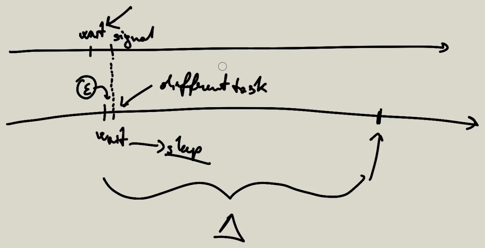

      - The core 1 enters the critical section, it lasts a very short amount of time and then it signals
      - Core 2 was ready when core 1 was in the critical section so it goes to sleep
      - Core 2 could have entered the critical section an epsilon time after (very small), but since we are going to sleep, the Scheduler now is deciding
      - This can take any amount of time, so if we have to wait for any tiny amount of time (epsilon), we could end up waiting for a huge amount of time (delta)
      - This means that relying on semaphores could be bad for the system; especially if we have short critical sections and those are typically invoked or tried to access very often
      - Solution: Spinlocks
  - Linux spinlocks: rely on spinlocks everytime that we assume the critical section will be short
    - Consumes CPU cycles, we are wasting power to do nothing except check whether we can enter the critical section, but if the critical section duration is very short then we are wasting a small amount of Clock Cycles and we are much more responsive (because in the previous case we are not going to sleep and we actually enter the critical section exactly once the spinlock is released)
    - Problem: if we are interrupted then other guys waiting for critical section, will have to spin for a longer amount of time; we were using spinlocks because we were assuming that our critical section was short but the asynchronicity of hardware interrupts will make the critical section longer
    - Solution: variants of spinlocks
      - Disable interrupts (also with save variant)
        - `spin_lock_irq(spinlock_t *lock);`
        - `spin_lock_irqsave(spinlock_t *lock, unsigned long flags);`
        - `spin_unlock_irq(spinlock_t *lock);`
        - `spin_unlock_irqrestore(spinlock_t *lock, unsigned long flags);`

        

      - Unlock defining some kind of reconciliation point: we tell that we are leaving the critical section so we can start to serve deferred work from that point on
        - `spin_lock_bh(spinlock_t *lock);`
        - `spin_unlock_bh(spinlock_t *lock);`
    - Some other APIs
      - `spinlock_tmy_lock = SPINLOCK_UNLOCKED;`
      - `spin_lock_init(spinlock_t *lock);`
      - `spin_lock(spinlock_t *lock);`
      - `spin_unlock(spinlock_t *lock);`
      - `spin_is_locked(spinlock_t *lock);`
      - `spin_trylock(spinlock_t *lock);`
      - `spin_unlock_wait(spinlock_t *lock);`
    - Using spinlocks some processes might starve; the solution is using read/write locks
  - Read/write locks

    

    - Logical implementation
      - Writer
        - Get Lock: lock w
        - Release Lock: unlock w
      - Reader
        - Get Lock
          - Lock r: read lock is used to protect the update of a counter c
          - Increment c: reference counter which tells how many readers are running within that critical section in read mode
          - If c == 1 
            - Lock w
          - Unlock r
        - Release Lock
          - Lock r
          - Decrement c
          - If c == 0
            - Unlock w
          - Unlock r
    - In practice: the first reader which enters will take the write lock (so that all other readers can read the value) and the last reader which enters will unlock the write lock (so that writers will be able to write)
    - Is not starvation-free, it is deadlock-free
      - Writers might starve because we could have a rate at which readers come such that the counter c is always incremented before beeing decremented
    - APIs
      - `rwlock_t xxx_lock = __RW_LOCK_UNLOCKED(xxx_lock);`
      - Just read (+ hard interrupt disable)
        - `read_lock_irqsave(&xxx_lock, flags);`
        - `read_unlock_irqrestore(&xxx_lock, flags);`
      - Read and write (+ hard interrupt disable)
        - `write_lock_irqsave(&xxx_lock, flags);`
        - `write_unlock_irqrestore(&xxx_lock, flags);`
  - Seqlocks (sequence locks): if we notice that we have read some stale value then we retry to acquire again the value
    - Small, frequently accessed and simple (no pointers, just array, simple word..) amount of data is to be protected
    - Writers must not starve
    - Access to the data does not create side effects
      - Example
        - Variable x and y are protected by seqlocks
        - In our code we have an invariant that tells x-y != 0; it could be that we read a correct value of x and an INCORRECT value of y
        - We access some data structure which is INCORRECT and it is violating some assumption but that violation will not create any side-effect (for example, we are never computing something like 1/(x-y))
        - So, if we can guarantee that there is no possible side-effect on the usage of the data which we read, we can rely on seqlocks
    - APIs
      - Static declaration: `seqlock_t lock1 = SEQLOCK_UNLOCKED;`
      - Dynamic declaration: `seqlock_t lock2; seqlock_init(&lock2);`
      - Writer
        - Exclusive access, increment sequence number: `write_seqlock(&the_lock);`
        - Release, increment sequence number: `write_sequnlock(&the_lock);`
        - Note: lock and unlock do the same thing because the counter is used to define a "logical advancement"
      - Readers: do not acquire a lock
        ```c
        unsigned int seq;
        do {
          seq = read_seqbegin(&the_lock);
          /* Make a copy of the data of interest */
        } while read_seqretry(&the_lock, seq);
        ```
        - The data read could be garbage data (for example, half part of the data has been updated, half part has been not)
        - If the copy of the data has been updated, the reader tries again to make a copy of the data; this is why this is a non-blocking implementation
          - The call to `read_seqretry` checks if `the_lock` is odd, in this case it means that a write was executing when we read the value, so it will be garbage (for logical advancement)
          - The call to `read_seqretry` compares (new) `the_lock` with `seq` and checks if `the_lock` is changed; if this is the case it means that at least one write operation has entered and left the CS (so we have to redo the read operation)
  - Read-copy-update (RCU)
    - Lock-free (no locks, no counters)
    - Deals with linked data structures
    - Reads are coherent by maintaining multiple versions of objects and ensuring that they are not freed up until all pre-existing read-side critical sections complete
    - Writer which updates an object (a linked object, a linked data structure) will know when all pre-existing read operations on that object, have completed (so, it will be safe to release memory)
    - How it works
      - Mechanisms
        - Publish-subscribe mechanism (for insertion)
          - We have the "thread" which is producing the data which publishes the data; readers are kind of subscribed to that data structure and they are notified on a new publish
        - Wait for pre-existing RCU readers to complete (for deletion)
          - Writer has the possibility to wait for a subset of readers to complete (all readers that are still keeping a pointer to the old version of a subset of the linked data structure)
        - Maintain multiple versions of RCU-updated objects (for readers)
          - Mantain multiple versions of portions of linked data structure because, at a certain time instant, it could be that new readers are reading the new value, old readers are reading the old value
      - Constraints
        - Only dynamically allocated data structures can be protected by RCU
        - No kernel control path can sleep inside a critical section protected by RCU
      - Opeartions
        - Insertion
          - Problem
            ```c
            struct foo {
              int a;
              int b;
              int c;
            };
            struct foo *gp = NULL; // Global pointer (seen by everybody)
            
            /*...*/
            
            p = kmalloc(sizeof(*p), GFP_KERNEL);
            p->a = 1;
            p->b = 2;
            p->c = 3;
            // BAD
            gp = p; // Publish, everyone has access to p now\
            // GOOD (solution)
            rcu_assign_pointer(gp, p);
            ```
            - BAD: `p->a = 1; p->b = 2; p->c = 3;` might bypass `gp = p;`
            - GOOD (solution): `rcu_assign_pointer()` boils bown to `gp = p` PLUS a set of fences so solves for us the memory order problem
        - Reading
          - Problem
            ```c
            p = gp;
            if (p != NULL) {
              do_something_with(p->a, p->b, p->c);
            }
            ```
            - `p->a` operation could be executed before `p = gp` operation
          - Solution
            ```c
            rcu_read_lock(); // Disable preemption
            p = rcu_dereference(gp); // Memory barrier
            if (p != NULL) {
              do_something_with(p->a, p->b, p->c);
            }
            rcu_read_unlock(); // Enable preemption
            ```
      - Grace period

        

        - Explanation
          - I am deleting some linked data structure; so, at some point, I have removed the pointer from our `gp` (NULL)
          - All readers which started before/during the removal operation, are basically keeping a pointer to the old data structure; now, we can't simply free the buffer because those readers will eventually access that pointer
          - The grace period is the amount of time (not defined beforehand), which tells the writer, which is removing (or trying to reclaim) some memory, to wait for all the readers which have read the old value before the removal
          - In between this grace period additional readers can jump in; but those additional readers will observe the newly published value
        - How to: `synchronize_rcu()`

          

          - It waits for the guy (writer) which is removing the data structure to be scheduled once on top of all CPUs
          - We do this because `rcu_read_lock()` disable preemption; this means that, since we are disabling preemption while reading,  all the readers (started before removal) will disable preemption on their CPUs until they have completed the CS
          - This means that the guy which removes the data structure can be scheduled on the CPU from the green cross on
          - Once we have been scheduled at least once on each online CPU then we know that this guys have finished (blue cross)
          - So we know that the grace period ended and we can reclaim memory, we can make a free operation
        - What happens with multiple versions
          - Deletion

            

            ```c
            struct foo {
              struct list_head list;
              int a;
              int b;
              int c;
            };
            LIST_HEAD(head);
            /*...*/
            p = search(head, key);
            if (p != NULL) {
              list_del_rcu(&p->list); // Barrier
              synchronize_rcu();
              kfree(p);
            }
            ```
            - Linked list provides several `_rcu` implementations: those perform the associated operation in an RCU way
            - We cannot immediately free the pointer, we have to wait for all possible concurrent readers to use possibly this node which has been removed
              - After that we have run on all CPUs the grace period is finished (so, `synchronize_rcu()` returns), we are safe, and then we can safely free the memory buffer
          - Update
            ```c
            struct foo {
              struct list_head list;
              int a;
              int b;
              int c;
            };
            LIST_HEAD(head);
            /*...*/
            p = search(head, key);
            if (p != NULL) {
              /* Take appropriate action, unlock, and return. */
            }
            q = kmalloc(sizeof(*p), GFP_KERNEL); // Make a copy
            // Update content
            *q = *p;
            q->b = 2;
            q->c = 3;
            list_replace_rcu(&p->list, &q->list);
            synchronize_rcu();
            kfree(p);
            ```
            - `list_replace_rcu(&p->list, &q->list);`: memory barrier, everyone coming from now on will navigate linked list in this way

              

            - Still someone might have acquired pointer to `p`; `synchronize_rcu()` will wait for the grace period to be completed, after that we can call `kfree()`

              

        - Garbage collection
          - We don't know the lenght of the grace period
          - Maybe we don't want to wait a long amount of time for the grace period to complete
          - Solution: garbage collection
            - `call_rcu()` registers a callback function to free the old data structure
            - Callbacks are activated by a dedicated SoftIRQ action
  - RCU vs RW locks

    

    - Rwlock readers can access concurretly, RCU readers can access concurrently
    - Rwlock writer (or updater) could starve, the RCU updater will start to execute in isolation
    - While the rwlock writer is writing, all rwlock readers have to spin (they can't do anything)
    - On RCU we have the publish part, once the RCU updater has published its new update, all RCU readers can continue to execute operations and also the NEW (green) readers can immediately observe the new data (no one is actually spinning)

### Virtual File System and Devices

- Virtual file system
  - Software layer which abstracts the actual implementation of the devices and/or the organization of files on a storage system
  - It exposes a uniform interface to userspace applications
  - Roles
    - Keep track of available filesystem types (like EXT, NTFS.. for each drive installed)
    - Associate and deassociate devices with instances of the appropriate filesystem: everytime that we plug some I/O device which is used as storage system the VFS will associate the device with an instance of the appropriate filesystem
    - Do any reasonable generic processing for operations involving files: write on a file, read from a file...
    - When filesystem specific operations become necessary, vector them to the filesystem in charge of the file directory or inode in question
- Representations
  - In RAM: partial/full representation of the current structure and content of the File System
    - Partial representation: typically the amount of RAM that we have in our machine is much smaller than the available space on our hard drives so, in the RAM part, we will have some kind of caching of the content of the device which eventually will be flushed on the final device
  - On device: (possibly outdated because we are caching informations in memory) representation of the structure and of the content of the File System
  - Data access and manipulation
    - FS independent part: interface towards other subsystems within the kernel
      - We do not want a module in our OS kernel to be aware of the final implementation of our File System; we just want that that module will be able to interact with some file which is the same purpose of the abstraction towards Userspace
    - FS dependent part: data access/manipulation modules targeted at a specific filesystem type
- Connecting independent and dependent parts
  - Any FS object (dir/file/dev) is represented in RAM via specific data structures, they keep a reference to the code which correctly talks to the actual device (if any)
  - The reference is accessed using FileSystem independent APIs by other kernel subsystems
    - Those data structures must be able to identify the proper filesystem-dependent routine; the OS Kernel must be able to talk to the final device or to the final File System implementation in order to perform the actual dependent-part of the operation
  - Function pointers are used to reference actual drivers' functions
    - Specific function pointers which are associated with specific semantic operations, those are then implemented in a filesystem-dependent way
- EXT2 filesystem (not so different from v3 or v4, physical representation of File System on the device)

  

  - Data block: the content of the file will be stored in one or more data blocks
  - Inode: a file or folder or some piece of information (some unit of information) that we want to mantain
    - We have an upper bound on the number of files which we can store on our filesystem; in the EXT2 this is represented by the number of inodes that we are actually being able to mantain
    - The organization of one inode is such that we have one table which behaves differently depending on the index which we are referencing
      - In an inode there is a list of pointers to data blocks which contain the content of the file (entries in this inode table describe where to locate the content of that file on the device)
      - Once a data block is filled then we move to the second entry and we continue
      - If the file is small, so if we have few data blocks, the entry in the inode information table keeps directly a pointer to the data blocks
      - If our file grows very much, then it means that we have to rely on multiple data blocks; so, at a certain point, there will be one entry which is not pointing again to one data block but it is pointing to a block into File System which is used to mantain additional pointers to additional data blocks
      - There would be some routine in the OS which knows about this organization
        - That's why to mount NTFS filesystems in linux we have to load a different module
- Global organization (abstract in memory): mapping between the data located on the hard drive and the information and the operations that the Application wants to perform on those resources

  

  - Cached informations associated with Linux VFS is composed of different dentries
    - `Dentry` (directory entry): represents one unit of information in a tree of the File System
    - In Linux we can have dentries which are also mount points (we can associate a different filesystem (Physical file system) to any point in the File System Tree
    - It means that the information associated with one Physical File System is associated with a mount point, so this information is associated with a data structure called `vfsmount` (describes what is the mount point of some Physical Device with respect to the File System Tree)
  - How can we identify the content of that File System?
    - All File Systems have, at the very beginning, some information which describe the structure files (like metadata, tables and whatever), this is called `superblock`
    - This `superblock` data structure keeps function pointers (flash, unmount..) towards operations which are associated with all Physical Representation of the File System on the device
    - So, this `superblock` is associated with one specific `file_system_type`
      - Linux Kernel keeps track of different `file_system_type` which identify the module (driver) which is able to talk to that"Physical File System implementation
  - Given the superblock we have a single association with one `dentry`
    - This is the root of the tree organization of the File System in that specific device, which is associated with one specific `vfsmount`
    - Each `dentry`, which is the cached information about the fact that some Userspace Application has opened that file, is always joint to an `inode`
  - `Inode`: NOTHING TO DO WITH THE PHYSICAL REPRESENTATION
    - Is a data structure in the memory representation of VFS which describes what could be the physical operations on the device to be executed on top of that specific file
    - `dentry` maps logical operations that we can perform on some file in the Tree hierarchy, the `inode` describes operations that we can perform on the Physical representation on the device which we have
  - Given one `dentry` we could have any number of children, so we could have any number of files and directories which fall behind that specific `dentry`
    - Represented by relying on `children list` (linked list) which chain together all `dentries` which have been cached in memory which fall behind that `dentry` (the parent) here in the Tree organization
    - Each `dentry` also keeps a back pointer to the parent `dentry`
    - Since we have different mount point any one of the children dentries could belong to a different filesystem; so a `dentry` could be a logical element in the File System Tree which behaves as a mount point towards a different `vfsmount`
- Data structures and filesystems
  - Data structure Filesystem types (`file_system_type`): describes a filesystem, identifies the capability of the Linux Kernel to understand how that File System on the device is organized
    ```c
    struct file_system_type {
      const char *name; // Filesystem name
      int fs_flags;
      // Pointer to a function executed once we mount the File System, read superblock
      struct super_block *(*read_super)(struct super_block *, void *, int);
      struct module *owner;
      struct file_system_type *next;
      struct list_head fs_supers;
    };
    ```
    - We mount the File System, the Kernel looks at the table of File System types that it is aware of; if it finds a match with that File System name then it invokes the associated `read_super()` function
    - That function which will be implemented in some subsystems of the OS (in particular, we have the `module *owner` which can point to some Kernel module) which will be in charge of interacting with the device to read the minimum amount of information to start to identify and understand the File organization of the device
  - Filesystem `ramfs`
    - Fully resident in Memory (In-Memory File System): it allows us to read and write to files which are never flushed to the final Physical disk because there is no such physical disk; it allows to explicitely interact with disk caching mechanism
    - Resizable File System: we could enlarge and shrink the amount of memory which we are using for that File System upon request
    - Can eat up all the available memory: if we start writing large files on that it will enlarge itself (we could end up finishing our memory, then the OS might PANIC), so it could be a point of attack from external Applications
      - `tmpfs` is a derivative with size limits: used to implement, for example, backing for directories like `/tmp`
        - Everytime that we reboot our machine `/tmp` will be completely emptied because it is in In-Memory File System; turning off our machine `ramfs` filesystem will be wiped out
      - Only root should be given access to `ramfs` (for peeviously explained reasons)
  - Filesystem `rootfs`
    - Special instance of `ramfs` (or `tmpfs`) which is always present in linux systems: provides an empty root directory during kernel boot (actually the only filesystem which is booted by the OS at Startup)
    - Cannot be unmounted: is there because it allows the Linux Kernel to remove any sanity check in the code asking whether no filesystem is available (we are basically making our code simpler and Kernel faster)
      - This has the same idea behind the fact that `init` process cannot be killed
      - In the same way, in the Scheduler as well we will never see any sanity check asking "Do i have at least one process to run?" because there is always at least one element in the list of processes which are running
    - The `rootfs` (which is associated with root folder at Startup) is then replaced (with the mechanism discussed in "Booting") by the actual Root File System which is located on hard drive
  - Data structure `vfsmount`: describes the mount point which we are using in the Tree hierarchy
    - Gives us all the information which is associated with what operations can be performed on that VFS mount and how they relate to devices (`mnt_devname`), file content (`mnt_root`) and other VFS mount point in our directory hierarchy (`mnt_parent`, `mnt_child`)
    ```c
    struct vfsmount {
      struct list_head mnt_hash;
      struct vfsmount *mnt_parent; /* fs we are mounted on*/
      struct dentry *mnt_mountpoint; /* dentry of mountpoint */
      struct dentry *mnt_root; /* root of the mounted tree */
      struct super_block *mnt_sb; /* pointer to super block */
      struct list_head mnt_mounts; /* list of children, anchored here */
      struct list_head mnt_child; /* and going through their mnt_child */
      atomic_t mnt_count;
      int mnt_flags;
      char *mnt_devname; /* Name of device (e.g. /dev/dsk/hda1) */
      struct list_head mnt_list;
    };
    ```
    - `mnt_root`: root directory of that filesystem which we have mounted
      - Example: `/mnt/hd0`
        - `mnt` will be one folder into `/` VFS mount (the root filesystem)
        - `hd0` will be a `dentry` which, in the `/` filesystem, is associated with one special `dentry` which tells that it is a mount point
          - The `dentry` will be pointed by a `vfsmount` which basically tells that from now on we have to interact with different device
          - The content of the `hd0` `dentry` will be the one which is located in the `mnt_root` `dentry`, so, that's the root of the mounted tree
    - `mnt_sb`: since `vfsmount` identifies an additional filesystem the `vfsmount` identifies a `superblock`
    - `mnt_mounts`: list of all mounted children (we create a hierarchy of `vfsmounts`; from one `vfsmount` we can reach all the children which it starts scanning from `mnt_child`)
    - `mnt_count`: we want to know if the same physical filesystem has been mounted multiple times (number of mounted times)
    - `mnt_flags`: tell us what are the operations which are supported on that specific mount point (e.g. we could have a filesystem which is mounted in read-only) 
    - `mnt_devname`: path name to the physical device which backs that filesystem (that could be some EXT2 filesystem associated, for example, with the physical partition `/dev/dsk/hda1`)
  - Data structure `super_block`: describes information about that mount point
    ```c
    struct super_block {
      // Filesystem independent part
      struct list_head s_list; /* Keep this first */
      // ......
      unsigned long s_blocksize;
      // ......
      unsigned long long s_maxbytes; /* Max file size */
      struct file_system_type *s_type; // File system type
      struct super_operations *s_op;
      // ......
      struct dentry *s_root; // Root entry point of that block
      // ......
      struct list_head s_dirty; /* dirty inodes */
      // ......
      // Filesystem dependent part
      union {
        struct minix_sb_info minix_sb;
        struct ext2_sb_info ext2_sb;
        struct ext3_sb_info ext3_sb;
        struct ntfs_sb_info ntfs_sb;
        struct msdos_sb_info msdos_sb;
        // ......
        void *generic_sbp;
      } u;
      // ......
    };
    ```
    - `s_op`: operations that we can perform on that specific superblock (set of function pointers which describes what are generic operations which we can carry on that filesystem mount point)
    - `s_dirty`: everytime that we update the content of some file in the In-Memory representation that information is also stored in the `superblock` because in this way once we want to unmount the filesystem or we want to flush the content of the filesystem, we already know what are the inodes that we have to flush back on the disk
    - `union`: carries out some information which are filesystem-specific (for each specific filesystem we can extend the amount of information which is located in the `superblock` in a "ilesystem-dependent way)
  - Data structure `dentry`: cache information about the operations that we can perform and it also gives information about the usage of filesystem resources
    ```c
    struct dentry {
      unsigned int dflags;
      // ......
      struct inode *d_inode; /* Where the name belongs to */
      struct dentry *d_parent; /* parent directory */
      struct list_head d_hash; /* lookup hash list */
      // ......
      struct list_head d_child; /* child of parent list */
      struct list_head d_subdirs; /* our children */
      // ......
      struct qstr d_name;
      // ......
      struct lockref d_lockref; /* per-dentry lock and ref count */
      struct dentry_operations *d_op;
      struct super_block *d_sb; /* The root of the dentry tree */
      // ......
      unsigned char d_iname[DNAME_INLINE_LEN]; /* small names */
    };
    ```
    - `d_inode`
      - Example
        - If we have `/home/foo/file`, then `/`, `home`, `foo` and `file` are different dentries which are organized in the hierarchy (VFS global organization)
        - For each one of these pieces of the name of the path, we will have a `dentry`, so, in particular for each one of these parts we will have a companion `inode` which tells `home` to what physical file on the device they are associated
    - `d_name`: describes the name of that `dentry`, so, in particular, the name of the part of the path to a file (which is represented by that `dentry`)
      - Can be of any length
    - `d_iname`: if we have a short name, we have a vector of chars directly into `dentry`
    - `d_lockref`: lock and reference counter, it allows us to lock the `dentry` and it allows us to count the number of processes which are currently using that `dentry`
    - `d_op`: pointer to a set of function pointers which are the dentry operations; used everytime that the VFS wants to perform some kind of operation on that `dentry` (like removing that cached element from the cache or understand whether that dentry is used by someone or tell that a new process is using that dentry)
    - `d_sb`: pointer to the `superblock` which will allow, from this `dentry`, to understand what are the superblock operations or what filesystem type that part of the pathname lookup is associated to
  - Data structure `inode`
    ```c
    struct inode {
      // ......
      struct list_head i_dentry;
      // ......
      uid_t i_uid;
      gid_t i_gid;
      // ......
      unsigned long i_blksize;
      unsigned long i_blocks;
      // ......
      struct inode_operations *i_op;
      struct file_operations *i_fop;
      struct super_block *i_sb;
      wait_queue_head_t i_wait;
      // ......
      union {
        // ......
        struct ext2_inode_info ext2_i;
        struct ext3_inode_info ext3_i;
        // ......
        struct socket socket_i;
        // ......
        void *generic_ip;
      } u;
    };
    ```
    - `i_dentry`: reference to one or multiple dentries which refer that specific file on the device
    - `i_op`: set of function pointers which are associated with the operations that we want to perform on that specific `inode` on the device
    - `i_sb`: pointer to the `superblock` (because we might want from that `inode` to get back to superblock operations)
    - `i_fop`: point in which we make the bridge between Userspace operation and the actual implementation of those operations on the file
      - Example
        - Everytime that we execute a `write()` system call, or a `read()` system call, or an `open()` system call or whatever, what happens in the VFS is
          1. We pass to the system call either a file descriptor or a path to a file or a folder
          2. (Path case) We have a string (`/ ... / ... / ...`) which shall be decomposed into several pieces; the Kernel will tokenize that string and it will setup one `dentry` for each part of that string
          3. Those dentries will be organized in the hierarchy seen before
          4. Each one of those dentries will be associated with one `inode`
          5. If we want to write on that file (final piece of `/ ... / ... / ...`) or open that file, what happens is that the actual implementation of the `write()` system call, the `open()` system call, "whatever VFS-related system call", will be reached from this struct (`struct file_operations`)
          - So in the `file_operations`, we have function pointers which tell, given one `dentry` and the associated `inode`, what is the actual implementation of a system call that we want to carry out on that specific file in the filesystem
    - `i_wait`: queue of processes which are waiting in a blocked state because they are requesting some operation on one specific resource but that request cannot be served immediately; int that case the process goes to sleep, once the resource becomes available or the operation completes, then the processes which we are waiting on that wait queue will be waken up and possibly rescheduled
- VFS and PCBs (process control blocks)
  - PCBs will keep track of the open files: everytime that we open a file, there is some information in the PCB which gives information about the context in which are processes living
  - In PCBs we have `fs_struct`: gives information about, for example, the path in which one process was launched or if the process has changed this current working directory it tells what is the new current working directory
  - It has a relation between operations of the process (in the context of the VFS) and the actual filesystem
  ```c
  struct path {
    struct vfsmount *mnt;
    struct dentry *dentry;
  } __randomize_layout;

  struct fs_struct {
    int users;
    spinlock_t lock;
    seqcount_t seq;
    int umask;
    int in_exec;
    struct path root, pwd;
  } __randomize_layout;
  ```
  - `fs_struct path`: used to represent the process working directory (`pwd`), which is the current directory) and the folder in which the process was launched (`root`); so the OS knows how to resolve this relative path
    - Without this the Kernel isn't able, for example, to implement an `open()` of a relative path
  - `path mnt`: `vfsmount` in which that processes is currently running
  - `path dentry`: `dentry` which represents the part of the path (relative path) from which to start the pathname lookup
- Operations
  - Superblock operations
    - Operations
      - Manage statistic of the filesystem
      - Create and manage inodes
      - Flush to the device updated information on the state of the filesystem
    - Some FileSystems might not use some operations (`ramfs` doesn't have to flush to the device updated information, some operations will be set to `NULL`)
    - Functions to access statistics are invoked by system calls `statfs` and `fstatfs`: will invoke the statistics-related function pointers in the `superblock`
    - Data structure containing operations: `super_operations`
      ```c
      struct super_operations {
        struct inode *(*alloc_inode)(struct super_block *sb);
        void (*destroy_inode)(struct inode *);
        void (*read_inode)(struct inode *);
        void (*read_inode2)(struct inode *, void *);
        void (*dirty_inode)(struct inode *);
        void (*write_inode)(struct inode *, int);
        void (*put_inode)(struct inode *);
        void (*delete_inode)(struct inode *);
        void (*put_super)(struct super_block *);
        void (*write_super)(struct super_block *);
        int (*sync_fs)(struct super_block *);
        void (*write_super_lockfs)(struct super_block *);
        void (*unlockfs)(struct super_block *);
        int (*statfs)(struct super_block *, struct statfs *);
        // ...
      };
      ```
      - `alloc_inode`: allocate `inode`
      - `read_inode`: read `inode` from disk (we read the file or the directory representation from the disk)
      - `write_inode`: write/update `inode`
      - `put_inode`
        - `put_` operations: we don't want to use anymore that resource
        - Everything, in the VFS layer, is implemented relying on reference counters (counters which tell how many processes are currently using that resource) because it will be the OS which will reclaim the memory associated with this cached information as soon as no one will be using anymore that information
        - We never explicitly deallocate an `inode`, so we `put` some `inode` information because we don't need that anymore
        - If we remove one folder but we have a different process which is living in that folder the OS Kernel cannot delete that folder so the File System will have to delay the moment in which that specific information on the File System will be removed1
    - Example implementation of superblock functions (device dependent): `ramfs`
      ```c
      // Implementation of superblock's statfs
      int simple_statfs(struct dentry *dentry, struct kstatfs *buf) {
        buf->f_type = dentry->d_sb->s_magic;
        buf->f_bsize = PAGE_SIZE;
        buf->f_namelen = NAME_MAX;
        return 0;
      }
      
      static const struct super_operations ramfs_ops = {
        .statfs = simple_statfs,
        .drop_inode = generic_delete_inode,
        .show_options = ramfs_show_options,
      };
      ```
      - `simple_statfs()` will populate the content of some buffer (`buf`), the content that will be provided is associated with the file system type `f_type` (which is located starting from `dentry`, passing through the `superblock` `d_sb` and getting `s_magic` number which identifies the filesystem type), `PAGESIZE` and the length of the name of that file (`NAME_MAX`)
  - `dentry` operations: specify non default operations for manipulating dentries
    - In-Memory File Systems or Special purpose File Systems (like `Procfs`) have operations of `dentry` that could be different
      - Example: `/proc` we will be prevented from deleting files in there by specifying specific non-default operations in the corresponding dentry data structure
    ```c
    struct dentry_operations {
      int (*d_revalidate)(struct dentry *, int);
      int (*d_hash)(struct dentry *, struct qstr *);
      int (*d_compare)(struct dentry *, struct qstr *, struct qstr *);
      // Remove the dentry from cache everytime that the reference counter is 0
      void (*d_delete)(struct dentry *);
      void (*d_release)(struct dentry *);
      // No longer require the companion inode, we are releasing the dentry
      void(*d_iput)(struct dentry *, struct inode *);
      // ...
    };
    ```
  - `inode` operations: `inode` (data structure associated with the physical representation of the file) related operations
    ```c
    struct inode_operations {
      // ...
      // Create inode
      int (*create)(struct inode *, struct dentry *, int);
      // How to navigate the tree representation of the File System
      struct dentry * (*lookup)(struct inode *, struct dentry *);
      // Create a link to inode
      int (*link)(struct dentry *, struct inode *, struct dentry *);
      // Delete a link to inode
      int (*unlink)(struct inode *, struct dentry *);
      int (*symlink)(struct inode *, struct dentry *, const char *);
      // Create some directory within that inode
      int (*mkdir)(struct inode *, struct dentry *, int);
      int (*rmdir)(struct inode *, struct dentry *);
      int (*mknod)(struct inode *, struct dentry *, int, int);
      // ...
    };
    ```
    - `mknod`: create a node into that inode, so we are willing to create some new entity in the File System Tree, but that entity is not associated with a regular file (OS will have to identify how to deal with that node)
      - Typically employed to create special files in `/dev`
      - `mknod` is also a system call
- Pathname lookup (associated with `lookup` function above)
  - Complicated
  - Derives an `inode` from the corresponding file pathname
  - Tokenizes the passed string (using `/`)
    - Is broken into a sequence of filenames
    - Everything must be a directory except for the last component (which could still be a directory)
  - Problems
    - Filesystem mount points
    - Access rights
    - Symbolic links and circular references

      

    - Automount: we can specify in our File System Table (`/etc/fstab`) that we have some File System which should be mounted to some mount points but it should not be mounted at System Startup, it should be mounted only once we access that Pathname (useful with network shares)
    - Namespaces: abstraction which allows different groups of processes to observe resources under different views (basic concept for containers)
    - Concurrency (while a process is navigating other processes might make changes)
  - Main functions (starting with `vfs` prefix are likely to be more stable across different Kernel versions)
    - `vfs_path_lookup()`
    - `filename_lookup()`
    - `path_lookupat()`
  - Basic data structure: `namei` (semplification)
    ```c
    struct nameidata {
      struct path path;
      struct qstr last;
      struct path root;
      struct inode *inode; /* path.dentry.d_inode */
      unsigned int flags;
      unsigned depth;
    } __randomize_layout;
    ```
    - Used to keep track of the state of the path walking that we are performing
    - `path`: keeps a reference to the `dentry` which we are navigating currently
      - Everytime that we access one `dentry` during the Pathname Lookup we increment the reference counter; it means that someone is using that part of the tree so that `dentry` cannot be removed while we are navigating
    - `last`: last token that we have navigated
    - `inode`: pointer to the `inode` which is associated with `dentry` which corresponds to the `inode` which is located from the `dentry` which is in `path`
    - `flags`: how the lookup operation should be carried out
      - `LOOKUP_FOLLOW`: if the last component is a symlink follow it
      - `LOOKUP_DIRECTORY`: the last component must be a directory
      - `LOOKUP_AUTOMOUNT`: if the final component is an automount point then the mount is triggered
      - `LOOKUP_PARENT`
        - Example: `create("/foo/bar")`
          - `bar` element will not be found during the lookup because it doesn't exist, we are trying to create that; `LOOKUP_PARENT` tells to stop to the next last which will be a folder in which we will be able to create the new file
      - Used by File System dependent part
        - `LOOKUP_OPEN`: intent is to open a file
        - `LOOKUP_CREATE`: is to create a file
        - `LOOKUP_EXCL`: intent is to access exclusively
    - `depth`: counter which tells the current level of symlink navigation
      - If we reach maximum depth then basically we will have our Pathname Lookup to fail
    - `_randomize_layout`: modifier which acts the Compiler at Compile time to reshuffle the members of this data structure in the final data structure which will be located in memory (more complicated for attackers to carry out security attacks)
- Mounting
  - `mount()` syscall: allows us to instatiate a mount point in the File System tree
    - Everytime that we mount some new device (new filesystem) we have to specify the File System that we want to mount (the source which typically is located in `/dev`) and the target folder in which to perform the mount operation (which typically must be an empty folder)
    - Definition: `int mount(const char *source, const char *target, const char *filesystemtype, unsigned long mountflags, const void *data);`
      - `flags`
        - `MS_NOEXEC`: do not allow programs to be executed from this filesystem
        - `MS_NOSUID`: do not honour `setUID` and `setGID` bits when executing programs from this filesystem
        - `MS_RDONLY`: mount filesystem read only
        - `MS_REMOUNT`: remount an existing mount; allows to change the mount flags and data of an existing mount
        - `MS_SYNCHRONOUS`: make writes on this filesystem synchronous (as soon as we write to the Buffer Cache the content is immediately signed to the Physical device)
  - Mount points
    - Directories selected as the target for the mount operation become a mount point
    - This is reflected in `struct dentry` by setting in `d_flags` the flag `DCACHE_MOUNTED`
      - Everytime that we perform a Pathname Lookup operation, like `/mnt/disk/foo`, the element `foo` is on a different File System, but the `disk` `dentry` here belongs to the other File System (because `disk` is an actual folder in the Source File System)
      - If we have the `DCACHE_MOUNTED` flag set, the Pathname lookup operation or also any listing operation, will ignore the content of that point in the File System, it will load the `vfsmount` which is associated with `disk` `dentry` and it will read the content of the `root` dentry for the `vfsmount root` (which is associated with that mount point)
      - So, we have the `disk` `dentry` and `root` `dentry` which boil down to the same token in the pathname string
      - This is the way according to which we can mount and unmount File Systems into folder and read the content of the root directory of the new mounted VFS starting from any place in the source File System
      - So any path lookup function ignores the content of mount points (the name of the `dentry`) while performing pattern matching
- File descriptor table
  - Everytime that we open some file, the opening of a file is associated with some Descriptor Table which is local to that process, but that Descriptor Table also references some Intermediate Table which describes the files which are currently opened by all the processes in the application
  - The File Descriptor Table is a Per-PCB (per process control block) data structure which points to the descriptor table which describes what files are currently opened; in order to do that the Process references this `files_struct`
  - Data structure
    ```c
    struct files_struct {
      atomic_t count;
      bool resize_in_progress;
      wait_queue_head_t resize_wait;
      struct fdtable __rcu *fdt;
      struct fdtable fdtab;
      spinlock_t file_lock ____cacheline_aligned_in_smp;
      unsigned int next_fd;
      unsigned long close_on_exec_init[1];
      unsigned long open_fds_init[1];
      unsigned long full_fds_bits_init[1];
      struct file __rcu *fd_array[NR_OPEN_DEFAULT];
    };
    ```
    - How it works: everytime that we open a new file, the Application will receive an integer which is the smallest unused file descriptor identifier
    - `count`: reference counter (how many processes are currently using this data structure?); used for Garbage Collection of `files_struct`
    - File Descriptor Table (`fdtab`) which can be accessed concurrently
      - Here we basically keep track of, for example, what are the integer File Descriptors that we are currently using in that process
      - Since can be accesses concurrently, file operations on top of these data structures are implemented by relying on RCU
        - We cannot access a data structure by relying on RCU if it isn't using a pointer, so we use a fake pointer (`fdt`) to manage the content of `fdtab`
    - `file_lock`: spinlock which tells that some operation requires a locking
      - `____cacheline_aligned_in_smp` is a modifier for the member `file_lock` which tells that the Compiler must ensure that indipendently of what we have before (previous members), the `file_lock` will fall into a single cache line (avoid split locks)
      - This is possible because typically `files_struct` data structure is dinamically allocated by means of Buddy System which ensures that we are also cache aligned
    - `next_fd`: next file descriptor available
    - Data structure `struct fdtable` explanation
      ```c
      struct fdtable {
        unsigned int max_fds;
        struct file __rcu **fd;
        unsigned long *close_on_exec;
        unsigned long *open_fds;
        unsigned long *full_fds_bits;
        struct rcu_head rcu;
      };
      ```
      - `open_fds`: tells what are the currently open File Descriptor

        

        - `0, 1, 2` will be always open for all processes
      - `close_on_exec`: everytime that we perform an `exec()` system call, we can ask the Linux Kernel to close some of the currently open File Descriptors, this information is kept in this bitmap 
      - Data structure `struct file` explanation
        ```c
        struct file {
          struct path f_path;
          struct inode *f_inode;
          const struct file_operations *f_op;
          spinlock_t f_lock;
          atomic_long_t f_count;
          unsigned int f_flags;
          fmode_t f_mode;
          struct mutex f_pos_lock;
          loff_t f_pos;
          struct fown_struct f_owner;
          const struct cred *f_cred;
          // ...
          struct address_space *f_mapping;
          errseq_t f_wb_err;
        }
        ```
        - `f_path`: tells what is the location of the file
        - `f_inode`: pointer to `inode` which is associated with that file, from this we can reach the `dentry`
        - `f_op`: copy of `file_operations` pointer because in this way if we execute some system call from one specific process then we know what is the filesystem-dependent implementation of that system call without having to navigate too much from the `inode`
        - `f_pos`: additional piece of information which is associated with position counter
          - Everytime that we read from a file, that we write to a file from a set of threads (or processes), the next read and write operation should restart from the last position which was reached; this is basically a long which describes some offset reached due to a sequence of read and write operations (has been explicitly set by means of an `lseek()` system call)
        - `f_pos_lock`: since we have concurrency, `f_pos` is managed in a synchronized way by relying on this mutex
        - `f_mode`: describes what are the access grants which were requested for that specific file
        - `f_cred`: credentials which are associated with the set of users which can perform some operation on one specific file
          - We have some Access Control Capabilities in the Linux Kernel which tells for one specific file, for example, what is the group of user that can access that file or that can execute that process
- Opening a file: `open()` system call from Userspace will boil down to the execution of the `do_sys_open()` function in the OS Kernel
  1. A file descriptor is allocated (and a suitable `struct file` is allocated)
  2. Invocation of the intermediate function `struct file *do_filp_open(int dfd, struct filename *pathname, const struct open_flags *op)` (do file pointer open) that will do the pathname lookup and will return the address of the struct file associated with the opened file
  - `do_sys_open()`
    ```c
    long do_sys_open(int dfd, const char __user *filename, int flags, umode_t mode) {
      struct filename *tmp;
      
      tmp = getname(filename);
      if(IS_ERR(tmp)) return PTR_ERR(tmp);
      
      fd = get_unused_fd_flags(flags);
      if(fd >= 0) {
        struct file *f = do_filp_open(dfd, tmp, &op);
        if(IS_ERR(f)) {
          put_unused_fd(fd);
          fd = PTR_ERR(f);
        } else {
          fsnotify_open(f);
          fd_install(fd, f);
        }
      }
      putname(tmp);
      return fd;
    }
    ```
    - General
      - Allocate one File Descriptor; if one File Descriptor is available then it will perform a call to `do_filp_open()` which will return a pointer to some struct file
      - `f` is the returned pointer, if there is some error then the error is written directly into the pointer and there is a MACRO (`IS_ERR(f)`) which determines whether some pointer is keeping an error code or not
      - To Userspace we are returning something which in the case of the `open()` system call is greater than zero for success (and in that case, it is the File Descriptor) and less than zero in case of an error
    - Specific clarifications
      - `put_unused_fd`: if we have an error we put back the allocated File Descriptor into the pool
      - `PTR_ERR`: un case of an error code we have to convert the pointer to an error code; that value is set into the File Descriptor (`fd`) and we return that value
      - `fsnotify_open`: informs Userspace Applications whether some operation has been performed on that file or not
      - `fs_install`: install the File Descriptor (`fd`) telling that is now associated with this file `f` (which was returned by the `do_filp_open()`)
    - Kernel pointers and errors
      - The range of errors which can be returned from the Kernel are associated with `errno values` and we know that there is a value (`-MAX_ERRNO`) which is the maximum value for `errno`
      - This range of values are few with respect to the all possible Address Space range so, Kernel pointers and Errors, are typically simply making some type punning, in the sense that, if we convert a pointer to an error (`PTR_ERR`) or an error to a pointer (`ERR_PTR`), we are simply casting the content of a pointer to some integer or back to some pointer
      - `IS_ERR_VALUE()` simply checks whether that error condition, for the pointer, falls into a very tiny amount of errors which are associated with legit `errno numbers`
- Closing a file
  - `close()` syscall
    - Definition: `SYSCALL_DEFINE1(close, unsigned int, fd)`
    - How it works
      1. `close()` receives one File Descriptor which is used in PCB of Application to locate the corresponding `struct file` which keeps some important metadata like the `file operations`; those are used to invoke the File System dependent implementation of the various system call
      2. `close()` calls `int __close_fd(struct files_struct *files, unsigned fd)` passing the corresponding parameters
      3. `__close_fd()` closes the file descriptor using `__put_unused_fd()` which checks if the file descriptor passed is valid, if so it puts it into the pool of free file descriptors; then it will call `filp_close(struct file *filp, fl_owner_t id)`
      4. `filp_close()` will flush back data which are only stored in memory into the In-Device representation (`file, dentry and inode` data structures)associated with that File Descriptor if no other thread or no other process is currently using that specific File Descriptor
  - `__close_fd()`
    ```c
    int __close_fd(struct files_struct *files, unsigned fd) {
      struct file *file;
      struct fdtable *fdt;
      
      spin_lock(&files->file_lock);
      fdt = files_fdtable(files);
      // Check if fdt is valid
      if(fd >= fdt->max_fds) goto out_unlock;
      file = fdt->fd[fd];
      if(!file) goto out_unlock;
      rcu_assign_pointer(fdt->fd[fd], NULL);
      __put_unused_fd(files, fd);
      spin_unlock(&files->file_lock);
      return filp_close(file, files);
      
    out_unlock:
      spin_unlock(&files->file_lock);
      return -EBADF;
    }
    ```
    - `files_fdtable()`: associate the `files` to `fdt`; it is done by simply quering that data structure in order to retrieve the `fdt`
    - `fdt->fd[fd]`: obtain the `file` by simply looking at `fdt` and using that table as a hashmap through the `fd` as an entry
    - `rcu_assign_pointer()`: rely on RCU in order to write `NULL` into that entry (`file` pointer will no longer point to any struct)
    - `__put_unused_fd()`: put back the unused File Descriptor
  - `__put_unused_fd()`
    ```c
    static void__put_unused_fd(struct files_struct *files, unsigned int fd) {
      struct fdtable *fdt = files_fdtable(files);
      __clear_open_fd(fd, fdt);
      if(fd < files->next_fd) files->next_fd = fd;
    }

    static inline void __clear_open_fd(unsigned int fd, struct fdtable *fdt) {
      __clear_bit(fd, fdt->open_fds);
      __clear_bit(fd / BITS_PER_LONG, fdt->full_fds_bits);
    }
    ```
    - `__clear_open_fd()`: look in the `fdt` and clear the bit associated with `fd` (we will set that flag to 0 meaning that that File Descriptor is not currently used)
    - `__put_unused_fd()` (the if): if we find out that the File Descriptor which we are currently using in the `close()` system call is smaller that the `next_fd` then we rollback the `next_fd` by telling that this will be the next File Descriptor to be reused
- Writing a file: `write()` syscall
  - Scenario
    - We called `open()` system call, we passed the string which identifies a valid `path` to some file
    - Pathname Lookup Module of VFS has already tokenized that string, it has associated a integer File Descriptor which allows to identify all the different data structures which are required to find out how to perform a read or write operation
    - Once we write to a File Descriptor, the VFS offers this uniform interface (abstract interface), so we can write to everything (a device, a regular file, an In-Memory buffer which is exposed as a file)
    - The Kernel has, at a certain point, to associate to that write operation the correct implementation
      - Examples
        - If we are writing in Memory it will entail (comportare) some `memcpy`
        - If we are writing at a regular file, it entails writing in the data in the Buffer Cache and possibly to flush back the content of the disk
        - If we write to an ethernet interface then it entails interacting with TCP/IP stack
  - Implementation
    ```c
    SYSCALL_DEFINE3(write, unsigned int fd, const char __user *, buf, size_t, count) {
      struct fd f = fdget_pos(fd);
      ssize_t ret = -EBADF;
      if(f.file) {
        loff_t pos = file_pos_read(f.file);
        ret = vfs_write(f.file, buf, count, &pos);
        if(ret >= 0) file_pos_write(f.file,pos);
        fdput_pos(f);
      }
      return ret;
    }
    
    // file->f_op->write(file, p, count, pos)
    ```
    - `count`: number of bytes to write
    - `fdget_pos()`: maps the input integer `fd` to a `struct fd` which within it, brings a pointer to the `struct file` which is used to mantain the information about the current file open
    - `if(f.file)`: if the `struct fd` (`f`) has a valid pointer (`file`)
      - `file_pos_read()`: we want to understand what is the current position within the file from which to perform the write
        - If we have a file, if we simply open it, we have the `pos` offset locator which starts at the beginning of that file
        - So if we issue a `write(fd, ...)` operation, the Kernel will start writing from the beginning
        - The next `write(fd, ...)` operation (on the same File Descriptor) will start from the last position (where the last write finished to write)
        - This is true also if the resource is shared among multiple processes, among multiple threads
        - Is lock protected (concurrency is solved by allowing only one thread or process at a time to update the value of that offset locator)
      - `vfs_write()`: it's just the write but at a lower level (adding to the normal write `pos` and `f.file` parameters); it returns the amount of bytes written
      - `file_pos_write()`: update the value of the position offset `pos`
      - `fdput_pos()`: put the fact that we are using the position offset `pos` (now other guys in concurrency can start to read and write from that location in the file)
    - `file->f_op->write`: `vfs_write()` will use `file` in order to access filesystem-dependent file operations (`f_op`) and within that it will call the filesystem-dependent write operation
- Reading a file: `read()` syscall (same behavior of `write()` syscall)
  - Implementation
    ```c
    SYSCALL_DEFINE3(read, unsigned int, fd, char __user *, buf, size_t, count) {
      struct fd f = fdget_pos(fd);
      ssize_t ret = -EBADF;
      if(f.file) {
        loff_t pos = file_pos_read(f.file);
        ret = vfs_read(f.file, buf, count, &pos);
        if(ret >= 0) file_pos_write(f.file,pos);
        fdput_pos(f);
      }
      return ret;
    }
    ```
- `proc` filesystem
  - Provide information about the machine on which the Kernel is running and information about the processes which are currently running on that machine
  - We can, through it, inspect the whole memory content
  - We can also write bytes into Main memory because there is a file which allows us to exactly reference each single byte of the Memory
  - Is a single instance File System (it can be mounted only once)
  - It is an In-memory File System
  - Common files/folders in `proc`
    - `cpuinfo`: contains the information established by the kernel about the processor at boot time (e.g. the type of processor, number of cores...)
    - `kcore`: contains the entire RAM contents as seen by the kernel
    - `meminfo`: contains information about the memory usage; how much of the available RAM and swap space are in use and how the kernel is using them
    - `version`: contains the kernel version information that lists the version number, when it was compiled and who compiled it
    - `net/`: directory containing network information
    - `net/dev`: contains a list of the network devices that are compiled into the kernel; for each device there are statistics on the number of packets that have been transmitted and received
    - `net/route`: contains the routing table that is used for routing packets on the network
    - `net/snmp`: contains statistics on the higher levels of the network protocol
    - `self/`: contains information about the current running process (contents are the same as those in the per process information)
      - The content of this folder is a part of the `proc` PID Subsystem
    - `proc` PID Subsystem: parallel implementation of the `proc` File System which basically boils down to the fact that in `/proc` we can have a set of folders which describe the PID of all currently running Applications on our machine (so, if we try to get information, `ls`, about the `self` folder, that `self` folder is simply implemented as a symbolic link to the folder which is associated with the PID of the currently running Application)
      - List of folders/files
        - `$pid/` contains information about process number `pid` (for each process)
        - `$pid/cmdline`: contains the command that was used to start the process using null characters to separate arguments
        - `$pid/cwd`: contains a link to the current working directory of the process
        - `$pid/environ`: contains a list of the environment variables that the process has available
        - `$pid/exe`: contains a link to the program that is running in the process
        - `$pid/fd/`: is a directory containing a link to each of the files that the process has open
        - `$pid/mem`: contains the memory contents of the process
        - `$pid/stat`: contains process status information
        - `$pid/statm`: contains process memory usage information
      - All based on the global array `tgid_base_stuff`
        - All the previous stuff is implemented by relying on a special set of dentries which are hard-coded in the Kernel image
        - `tgid_base_stuff` is used to represent a dentry associated with each one of files and folders which are located into any `/proc/$pid` folder
        - The Kernel that mantains the `proc` PID Subsystem dinamically, would require a lot of time everytime that we spawn a new process; relying on hard-coded information which is the `tgid_base_stuff` allows to reduce the time require to perform this operation
  - Core data structure: defines `proc/pid`
    - Note: `tgid_base_stuff` is an array of `proc_dir_entry
    ```c
    struct proc_dir_entry {
      unsigned short low_ino;
      unsigned short namelen;
      const char *name;
      mode_t mode;
      nlink_t nlink; uid_t uid; gid_t gid;
      unsigned long size;
      struct inode_operations *proc_iops;
      struct file_operations *proc_fops;
      // ...
      read_proc_t *read_proc;
      write_proc_t *write_proc;
      // ...
    };
    ```
    - `name`: name of the file in the `/proc/$pid` folder
    - `proc_iops` and `proc_fops`: `inode_operations` and `file_operations` so, we immediately map operations on that
    - `read_proc` and `write_proc`: since we are typically expected to be likely reading and writing to content of the `proc` File System there are 2 pointers which allow to directly access a read function and a write function for the `proc` File System
- Sysfs filesystem
  - Mounted to `/sys`
  - Similar to `proc`, implementation is different
    - `proc` is typically oriented to static information that the Kernel has to mantain very quickly, `sysfs` on the other hand is a File System which is implemented with dynamicity in mind
  - `sysfs` is similar in spirit to the concept of handle (associated with Win Api)
    - In Windows everything is a handle (pointer to some memory data structure)
    - In the Linux Kernel we have the concept of kernel objects (pointer to some memory data structure)
  - `sysfs` implementation simply translates this linked data structure into a File System representation; so, we have internally an abstraction layer (based on Kernel Objects) which allows us to describe what it is going on into the OS at that time, and expose that information to Userspace
    - Transposition table

      

      - Kernel object: data structure that describes some kernel information
      - Object attributes: Kernel Object can be a collection of different Object Attributes
      - Object Relationships: we can create a relationship between different Kernel Objects or Kernel Object Attributes
  - API: we use them as we were writing to files (so we specify a "directory" and the "file" inside)

    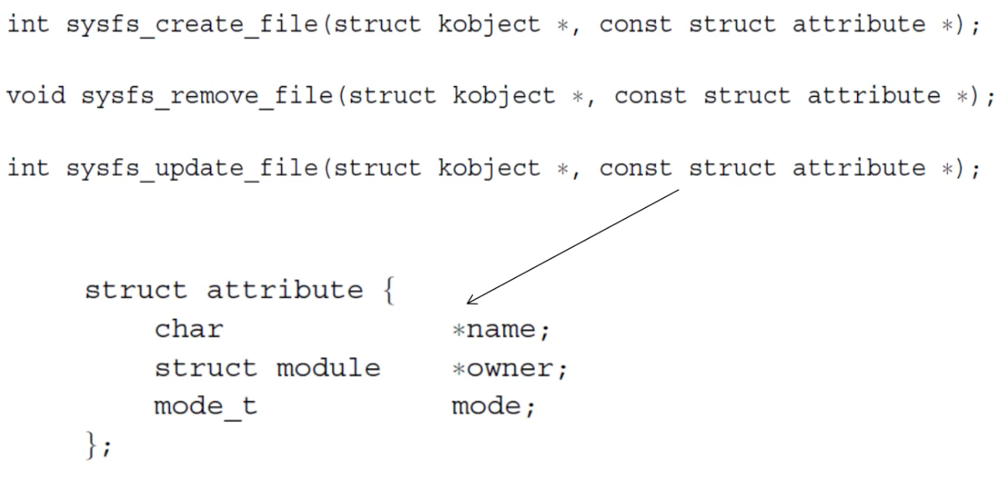

    - `struct attribute`
      - `name`: name of the file which will be shown if we list into `sysfs`
      - `owner`: kernel module which has created that specific file (inside there is the code to manipulate the attribute)
      - `mode`: access mode which we have for that specific file
  - Kernel objects
    - Is not a container of informations, it is included in the data structure which that Kernel Object is going to represent
    - It mantains a reference counter `kref`
    - Purpose
      - Connecting to each other data structures in the Kernel (Kernel developer point of view)
      - showing information to the User in the `sysfs` (User point of view)
    - API
      - `void kobject_init(struct kobject *kobj);`: setup kernel object
      - `int kobject_set_name(struct kobject *kobj, const char *format, ...);`: set name
      - `struct kobject *kobject_get(structk object *kobj);`: get a reference to kernel object
      - `void kobject_put(struct kobject *kobj);`: kernel object no more needed, enable garbage collection
    - Data structures
      - `struct kobject`: we represent some Kernel Object in terms of
        - How different data structures are connected to each other
        - How that representation is shown to the User by means of `sysfs` File System
        - How the `sysfs` File System should mantain VFS-related information
        ```c
        struct kobject {
          const char *name;
          struct list_head entry;
          struct kobject *parent;
          struct kset *kset;
          struct kobj_type *ktype;
          struct kernfs_node *sd; /* sysfs directory entry */
          struct kref kref;
        };
        ```
        - `entry`: we have a list, so, different Kernel Objects can be connected togheter
        - `parent`: Kernel Object will be mapped to some dentries in `sysfs`, so, we have to implement some kind of tree-like data structure
        - `kset`: we can organize Kernel Objects into sets, so, we can group togheter different Kernel Objects which belong to some piece of information
        - `ktype`: describe how to perform `sysfs` operations
        - `sd`: pointer to the `sysfs` dentry, so, the Kernel Object is also used directly by `sysfs` to mantain the Tree representation which is shown to the VFS
        - `kref`: reference counter
      - `struct kobj_type`: here we store specific operations
        ```c
        struct kobj_type {
          void (*release)(struct kobject *);
          struct sysfs_ops *sysfs_ops;
          struct attribute **default_attrs;
        };
        ```
        - `release`: callback which we can register; the Kernel will notify us that that Kernel Object is about to be reclaimed
        - `sysfs_ops`: describes how to implement operations on attributes; we can also override information about those functions on specific attributes, but those are the default functions to be invoked
        - `default_attrs`: A Kernel Object is mapped to a folder in the `sysfs` File System and attributes are mapped to regular files; so, here we have the set of files that should be shown below that specific folder in the `sysfs` Tree
  - Read/write operations
    - Defined in `struct kobject->ktype->sysfs_ops`
      ```c
      struct sysfs_ops {
        /* method invoked on read of a sysfs file */
        ssize_t (*show)(struct kobject *kobj, struct attribute *attr, char *buffer);
        
        /* method invoked on write of a sysfs file */
        ssize_t (*store)(struct kobject *kobj, struct attribute *attr, const char *buffer, size_t size);
      };
      ```
      - In `sysfs` File System, we have an additional level of function pointers and an additional level of indirection with respect to `read()` and `write()` system call (`read` and `write` call in the end `show` and `store`)
      - `show`
        - Params
          - Kernel Object `kboj`: folder in which we are reading the file
          - Attribute `attr`: file which we want to read
          - `buffer`: in which we want to populate the content
      - `store`: we want to write in a file which is located in one folder
        - Params
          - `buffer`: content
          - `size`: amount of bytes that the Userspace Application is writing
  - `kset`

    

    - Organization of Kernel Objects
      - A `kset` is identified by a Kernel Object; this typically allows us to identify the `kset` in terms of a parent Kernel Object
      - The `kset` has a list of children; in this way we can connect multiple Kernel Objects into an agglomerate of information (reflected into groups of folders and groups of files), so, a `kset` groups togheter different Kernel Objects which are similar in spirit
      - Example
        - We can have each Kernel Object for each Kernel Module and the `kset` will represent the folder associated with `sysfs` Modules (in this way the Kernel is grouping togheter different Kernel Objects which belong to a homogeneus set of information)
    - API
      - `void kset_init(struct kset *kset);`
      - `int kset_add(struct kset *kset);`
      - `int kset_register(struct kset *kset);`
      - `void kset_unregister(struct kset *kset);`
      - `struct kset *kset_get(struct kset *kset);`
      - `void kset_put(struct kset *kset);`
      - `kobject_set_name(my_set->kobj, "The name");`
  - Hooking into `sysfs`
    - Concurrency solution
      - The most elegant and simplest solution is to deny the possibility to have Race Conditions, so, we leave the burden of managing this thing to the User which is setting up Kernel Objects
      - So once we allocate a Kernel Object, that Kernel Object is NOT directly managed by `sysfs`; `sysfs` knows that that object has been allocated, but it will not use it until the Kernel level Module which is initialized tells "Ok, I've done" (done by using `kobject_add()`)
      - From that point on, `sysfs` will tell "Ok, the creator of that kobject has setup all the information, so I can assume that it is safe to use that Kernel Object"
      - If the implementation of the setup of `kobject` is buggy, then in the very end, that object will cause a panic
      - To remove a kernel object: `kobject_del()`
- Device management
  - General overview
    - Companion Subsystem (with respect to the VFS) which significantly interacts with VFS but it is meant to describe what are the devices into our machine
    - Makes interconnection with the Interrupt Management
    - Bridges the gap between the low-level information of the devices and the high level of the interaction which the devices which leverages the VFS (everything is a file)
    - Point of the Device Management Subsystem
      - We cannot known the total number of devices
      - The type of devices can very significantly
      - Implementation of the device is vendor-dependent
      - Low quality of the devices
    - So, the Kernel has to manage this heterogeneity on those problems by means of different device drivers but, in the very end, we want an abstract interface in which everything is a file
  - Device numbers
    - Devices are identified by numbers
    - Globally there are some Standardization agencies which give to specific vendors some codes; so each device, typically have either string or name or a numerical code which describes who has produced that device
    - One of the problems that we have we have nowadays is that there are several devices which are actually faking those numbers pretending that they are produce by someone else
    - The Kernel solves that thing because uses numbers which are different from the numbers which identify the vendors
    - So, vendor numbers and device numbers assigned from Standardization companies are fixed, Device numbers in the Kernel are partially fixed, partially not, depending on how we have connected those devices to our machine
    - One device is identified by one couple of numbers
      - `MAJOR`: describes what family of device it is; key to access some data structure within a driver database
      - `MINOR`: identifies the actual instance of the device
        - The idea is that, if we connect N hard drives to our machine the driver will be the same, because they are the same hard drives, but the Kernel must keep track of the fact that multiple instances of that device are currently available
        - So we have 10 devices with one single `MAJOR` and multiple `MINORs`
    - All devices are grouped into 2 main classes
      - `char_dev.c` (character devices): identifies a device which manages strings of information which can be of any type
        - Example: network card; we could have packets of different size which come and go, we don't know the size of informations
      - `block_dev.c` (block devices): devices which require a fixed amount of information to be managed (hard drives)
        - Example: once we interact with a hard drive the minimum amount of information which we can read or write is a disk block (520 bytes)
          - If we have a smaller amount of information then we CANNOT interact with that device
    - Bigger picture
      - The first information that the Kernel must mantain, in order to find out what will be the driver which has to interact with the device, is whether it is a character device or a block device
      - After that it will use the `MAJOR` number of that device in order to identify what is the routine (the module) which implements the interaction with the device
      - The `MINOR` number tells what is the physical instance of the device which we are interested in
    - Identifying char and block devices: information in `/dev`
      - Example
        ```
        $ ls -l /dev/sda /dev/ttyS0
        brw-rw---- 1 root disk 8,  0 9 apr 09.31 /dev/sda
        crw-rw---- 1 root uucp 4, 64 9 apr 09.31 /dev/ttyS0
        ```
        - First letter: type
        - First number: `MAJOR` number
          - Example
            - `disk` `/dev/sda` (which is a block device)
            - Teletype Interface `/dev/ttyS0` (Console)
        - Second number: `MINOR` number
          - Example: we have an hard drive
            - Same `MAJOR` number but we have different `MINOR` numbers for each partition of that specific disk because a partition brings a File System, the File System should be handled as a separate information
      - Numbers are assigned by the Linux Assigned Names and Numbers Authority (`lanana`) and kept in `Documentation/devices.txt`
        - Not needed in windows because the market asks windows to add their driver to the main repo
    - Device database: Hash Table
      - Two different sets of Device Databases: one for character devices (`cdev_map`) and one for block devices (`bdev_map`)
      - Data structure
        ```c
        struct kobj_map {
          struct probe {
            struct probe *next;
            dev_t dev;
            unsigned long range;
            struct module *owner;
            kobj_probe_t *get;
            int (*lock)(dev_t, void *);
            void *data;
          } *probes[255];
          struct mutex *lock;
        };
        ```
        - `probe`: instance of `MAJOR` number
        - `next`: list of probes (`MAJOR` numbers)
        - `dev`: tells what is the actual Device Number (`MAJOR` and `MINOR` number composed togheter)
        - `owner`: reference to the Kernel Module which implements the driver
        - `data`: reference some generic device specific data structure
        - `probes[255]`: hash table composed by means of 255 diffferent elements
          - Hashing is done by taking the `MAJOR` number of the device `% 255`
      - Visual explanation (better)

        

        - `MAJOR % 255`: find the entry in the devmap
        - This entry will contain all the `MINOR` numbers relative to the `MAJOR` with the corresponding driver specific structure and operations
    - Device number representation
      - 32-bit integer which is mapped to the `dev_t` data type
      - `dev_t` is simply a bitmask which keeps both the `MAJOR` and `MINOR` numbers
      - Manipulating dev numbers
        ```c
        #define MINORBITS 20
        #define MINORMASK     ((1U << MINORBITS) - 1)
        #define MAJOR(dev)    ((unsigned int)((dev) >> MINORBITS))
        #define MINOR(dev)    ((unsigned int)((dev) & MINORMASK))
        #define MKDEV(ma,mi)  (((ma) << MINORBITS) | (mi))
        ```
        - In the 20 less significant bits there is the `MINOR` number
        - In the remaining the `MAJOR` number
        - We have MACROs which allow from a `dev_t` to extract `MAJOR` and `MINOR` number
        - We can compose `dev_t` by putting the `MAJOR` number in the upper part of that integer and putting in place the `MINOR` number in the lower part
  - Char devices
    - `struct cdev`: "glue" data structure which allows to make togheter the VFS and `sysfs` with respect to the Device Database
      ```c
      struct cdev {
        struct kobject kobj;
        struct module *owner;
        const struct file_operations *ops;
        struct list_head list;
        dev_t dev;
        unsigned int count;
      } __randomize_layout;
      ```
    - Char Devices Range Database
      - For the character devices there is an additional Database (hash table)
      - Once we setup our Kernel Module, that will bring the capability to interact with some device associated with a `MAJOR` number; the Module can pre-reserve a Range of `MINOR` numbers for devices which will come and go for the life time of the system
      ```c
      #define CHRDEV_MAJOR_HASH_SIZE 255
      static struct char_device_struct {
        struct char_device_struct *next;
        unsigned int major;
        unsigned int baseminor;
        int minorct;
        char name[64];
        struct cdev *cdev;
      } *chrdevs[CHRDEV_MAJOR_HASH_SIZE];
      ```
      - For some `major` number, starting from some `baseminor` `MINOR` number that device has reserved `minorct` amount of `MINOR` numbers
      - `cdev`: device and the device driver which has made this reservation
    - Registering char devices
      - `int register_chrdev(unsigned int major, const char *name, struct file_operations *fops)`: registration takes place onto the entry at displacement `MAJOR` (0 means the choice is up to the kernel); the actual `MAJOR` number is returned
        - We associate a `name` with this device: that will eventually show up also in `/dev`
        - Since this will be shown in the `sysfs` the user can open, read and write and whatever
          - So we also have to specify the data structure which implements the `file_operations`
        - Maps to: `int __register_chrdev(unsigned int major, unsigned int baseminor, unsigned int count, const char *name, const struct file_operations *fops)`
          - Beyond the registration in the Database, a certain set of `MINOR` numbers (`baseminor`, `count`) will be registered
          - So, even though we simply tell that we want register some character device, the Kernel will pre-reserve a set of `MINOR` numbers
      - `int unregister_chrdev(unsigned int major, const char *name)`: releases the entry at displacement `MAJOR`
        - Maps to: `void __unregister_chrdev(unsigned int major, unsigned int baseminor, unsigned int count, const char *name)`
          - If we implictly tell that we want just unregister one character device, that guy here will remove, if possible, the `MINOR` which we have pre-reserved
    - `struct file_operations`: describe how we can map different system calls to a device-dependent implementation
      ```c
      struct file_operations {
        struct module *owner;
        loff_t (*llseek) (struct file *, loff_t, int);
        ssize_t (*read)(struct file *, char *, size_t, loff_t *);
        ssize_t (*write)(struct file *, const char *, size_t, loff_t *);
        int (*readdir)(struct file *, void *, filldir_t);
        unsigned int (*poll)(struct file *, struct poll_table_struct *);
        int (*ioctl)(struct inode *, struct file *, unsigned int, unsigned long);
        int (*mmap)(struct file *, struct vm_area_struct *);
        int (*open)(struct inode *, struct file *);
        int (*flush)(struct file *);
        int (*release)(struct inode *, struct file *);
        // ...
      };
      ```
      - It doesn't mean that we have to implement all the functions once we setup `file_operations` data structure, just the ones that will be used
        - If some of these members is set to `NULL`, then if we invoke a system call on that device the system call will fail
      - How do we deal with devices which show a significant amount of custom configuration parameters, custom operations, custom actions and so on?
        - This is the goal of `ioctl()` system call: controls an I/O device
        - Once we have a device which allows us to perform some custom operation, then typically we want to implement the code, which interacts with the device, within an `ioctl handler`
        - This is such that we will send that `ioctl` command in terms of a numerical code (`unsigned int`): that will be the opcode for the driver and possibly passing some parameter (`unsigned long`)
        - This parameter is a pointer in which also the Kernel could send back to us some data
        - Typically we interact with the device file in `/dev/[...]`, we open that file and we perform an `ioctl(fd)` call on the File Descriptor (`fd`) associated with that file; that thing will be mapped thanks to `file_operations` to the actual function which is implemented in the driver of that device
      - `ioctl()` is also used for Loadable Kernel Modules

        

        - We invoke the `ioctl()` system call, which by means of `f_ops` will call into our handler of `ioctl()` commands (located into our Kernel Module)
        - In here, we implement some kind of switch case on the command which was passed; depending on this, we activate the function in our Loadable Kernel Module which is associated with the implementation of that command
    - Register device numbers: range of device numbers (`MINOR` numbers)
      - `int register_chrdev_region(dev_t from, unsigned count, const char *name)`: `MAJOR` is specified in `from` (`baseminor` number is also taken from `from`)
        - Interacts with Character Device Range Database in order to setup a set of `MINOR` which are prereserved for that specific `MAJOR` to one specific driver
      - `int alloc_chrdev_region(dev_t *dev, unsigned baseminor, unsigned count, const char *name)`: `MAJOR` and first `MINOR` are returned in `dev`
  - Block devices
    - `struct gendisk`: `cdev` for a block device 
      ```c
      struct gendisk {
        int major; /* major number of driver */
        int first_minor;
        int minors; /* maximum number of minors, =1 for
                     * disks that can't be partitioned. */
        char disk_name[DISK_NAME_LEN]; /* name of major driver */
        // ...
        // Similar to the file_operations for char devices
        const struct block_device_operations *fops;
        // Implement the Hard disk Scheduler
        struct request_queue *queue;
      };

      // Register/deregister the driver
      int register_blkdev(unsigned int major, const char *name, struct block_device_operations *bdops)
      int unregister_blkdev(unsigned int major, const char *name)
      ```
      - Hard disk Scheduler: subsystem which determines what are the order of operations that the Kernel has to perform with respect to blocks, which are written to disk by Userspace Application, in order to minimize the latency
    - `struct block_device_operations`
      ```c
      struct block_device_operations {
        int (*open)(struct inode *, struct file *);
        int (*release)(struct inode *, struct file *);
        int (*ioctl)(struct inode *, struct file *, unsigned, unsigned long);
        int (*check_media_change)(kdev_t);
        int (*revalidate)(kdev_t);
        struct module *owner;
      };
      ```
      - There is nothing here to read and write from the device because all read and write from/to Block Devices are managed by one specific subsystem of the Kernel (see next)
    - Read/write on block devices
      - Handled via a single API related to buffer cache operations
        - There is the In-memory representation of the File System which also buffers the content of the files, so, everytime that we read and write from/to file which is located in a Hard Drive, we are actually reading from the Buffer Cache memory
        - The actual implementation of the buffer cache policy will determine the real execution activities for block device read write operations
      - Request queues
        - An algorithm determines the Scheduling Policy associated with reading and writing from the block and we manage the Buffer Cache depending on that Policy
        - The Request Interface is associated with a queue of pending requests towards the block device
        - Scheduling algorithm is based on the fact that the drive spins, so it is better to privilege operations that are on the same direction in which we are spinning (more or less, it's something like this)

          

  - Linking Devices and the VFS
    - The member `umode_t i_mode` in `struct inode` tells the type of the `inode`
      - Directory
      - File
      - Char device
      - Block device
      - Named pipe
    - The kernel functions `sys_mknod()` creates a generic `inode`: specify `MAJOR` and `MINOR` numbers
      - The `inode` makes the differentiation between character device and block device once we access to a file
      - The Kernel knows what is the Database which should be consumptive in order to locate that device information starting from the `MAJOR` number
    - If the `inode` represents a device the operations to manage the device are retrieved via the device driver database
    - `inode` has the `dev_t i_rdev` member (`MAJOR + MINOR` numbers)
    - `mknod()` syscall: create one node at a specific path with one specific mode and that possibly is associated with some device `dev`
      - `int mknod(const char *pathname, mode_t mode, dev_t dev)`
        - `mode`: permissions and type of node to be created
          - Permissions filtered via the ones of the calling process
          - Different macros can be used to define the node type
            - `S_IFREG`: regular file
            - `S_IFCHR`: char dev
            - `S_IFBLK`: block dev
            - `S_IFIFO`: pipe
          - When using `S_IFCHR` or `S_IFBLK` the parameter `dev` specifies `MAJOR` and `MINOR` numbers of the device file to create, otherwise `dev` is not used
  - Opening device files
    - `chrdev_open()`: needs to find the dev specific file operations
    - Given the device number `kobject_lookup()` is called to find a corresponding `kobject`
    - From the `kobject` we can navigate to the corresponding `cdev`
    - The device dependent file operations are then in `cdev->ops`
    - This information is then cached in the inode
  - inode to File Operations Mapping

    

    - `i_devices`: we have a list of connected `cdev` because `i_devices` and this `list` member in the `cdev` are both of type `list_head` so here we are connecting 2 different members (2 different objetcs) by means of the `list_head` data structure
    - Once we open a character device:
      1. We query a `kobject` Subsystem to locate the `kobj` which is located into `cdev`
      2. From that we access `cdev`
      3. We create the `inode`
      4. We link the `cdev` to the `inode`
      5. In the `cdev` we have the `ops` which allows to identify `struct file_operations`
      6. We create the `file` in the File Descriptor Table
      7. In the File Descriptor Table we will end up in a `struct file`
      8. Once we have allocated that `struct file`, we copy the content of `ops` into `f_op`; from now on, everytime that we want to read/write from a character device we can forget about `struct inode` and `struct cdev` and we immediately have pointers to write and read (in `file_operations`)
  - Device classes
    - Devices are organized into classes
    - A device can belong to multiple classes
    - Class membership is shown in `/sys/class`
    - Block devices are automatically placed under the block class
    - Most devices don't require the creation of new classes
    - Managing classes
      ```c
      static struct classs bd_class = {
        .name = "class_name",
        .class_release = release_fn
      };
      
      int class_register(struct class *cls);
      void class_destroy(struct class *cls);
      struct class *class_create(struct module *owner, const char *name, struct lock_class_key *key)
      ```
    - Managing devices in classes
      - `struct device *device_create(struct class* class, struct device *parent, dev_t devt, void *drvdata, const char *fmt, ...)`
      - `void device_destroy(struct class *class, dev_t devt)`
    - Attributes
      - Specify attributes for the classes, and functions to read and write the specific class attributes
      - `CLASS_DEVICE_ATTR(name, mode, show, store);`: expanded to a structure called `dev_attr_name`
      - `ssize_t (*show)(struct class_device *cd, char *buf);`
      - `ssize_t (*store)(struct class_device *, const char *buf, size_t count);`
    - Creating attributes
      - `int device_create_file(struct device *dev, const struct device_attribute *attr)`
      - `void device_remove_file(struct device *dev, const struct device_attribute *attr)`
  - `udev`: userspace Linux device manager
    - Everything in `/dev` currently is managed by `udev`
    - Handles userspace events raised when devices are added/removed to/from the system
    - Rules
      - Used to match events that `udev` observes in `/sys`
        - Everytime that some new device is setup, the Kernel notifies that by means of events and basically `dbus`
        - `udev` will look at `/sys` to detect whether devices or virtual devices have been plugged; then, it will look at text files in `/etc/udev/rules.d` and will create files (nodes actually) in `/dev` accordingly
      - Syntax tokens in syntax files
        - `KERNEL`: match against the kernel name for the device (class)
        - `SUBSYSTEM`: match against the subsystem of the device (subsystem in the Kernel which is managing that)
        - `DRIVER`: match against the name of the driver backing the device
        - `NAME`: name that shall be used for the device node
        - `SYMLINK`: list of symbolic links which act as alternative names for the device node 
      - Example rule: `KERNEL=="hdb", DRIVER=="ide-disk", NAME="my_spare_disk", SYMLINK+="sparedisk", MODE="0644"`
        - Everytime that the Kernel sets up a device which is called `hdb`, which is managed by some `ide-disk` (which is the name of the module in the Kernel), then `udev` will create a file called `my_spare_disk` (`/dev/my_spare_disk`) plus it will create a symbolic link called `sparedisk` with permission `0644`

### Userspace initialization

- Init

  

  - Process

    

    - `rest_init()`
      - We have to leave the infinite loop in pid 0 (need to start other processes than idle)
      - A new kernel thread is created referencing `kernel_init()` as its entry point
      - A call to `schedule()` is issued to start scheduling the newly created process
      - This is done right before PID 0 calls into `cpu_idle()`
    - `/sbin/init`: first userspace process ever started
      - Stored into the ramdisk to speedup the booting process
      - Will have to load configuration files from the hard drive (so VFS, Device Management and Interrupt subsystems must be initialized before loading `init`)
- Runlevels/Targets

  

  - Startup services: the system has to initialize and setup various things
    - Hostname
    - Timezone
    - Check the hard drives (restoring block X... something like this)
    - Mount the hard drives
    - Remove files from `/tmp` (`ramfs` or `tmpfs`)
    - Configure network interfaces
    - Start daemons and network services
  - SysV
    - Startup Run Levels: states in which you switch (you notify the init system which will notify the kernel which will do things) 

      

      - 1: rescue shell (single user)
      - 2 and 3: used in servers (multiuser without gui)
      - 5: most used (has gui) 
      - 6: ask OS to reboot
      - 0: ask OS to halt
      - Note: in SysV you do `init <NUMER>` to switch (ex: if you switch to 1 then the machine will be halted)
    - Run Level scripts: used to map run levels to the actual configuration of the system
      - Placed in: `/etc/rc.d/init.d`
      - `/etc/rc.d/rc#.d/`: contain symbolic links to `/etc/init.d` (for each different run level defined by `#`)
        - `S##`: start scripts (executed when entering the run level in order of number, `##`)
        - `K##`: stop scripts (executed when leaving the run level in order of number, `##`)
    - `/etc/inittab`: like a list of processes to startup for each run level number
      - Format: `id:rl:action:process`
        - `id`: uniquely identifies entry
        - `rl`: what run levels the entry applies to
        - `action`: type of action to execute
        - `process`: process command line
      - Example: `2:23:respawn:/sbin/getty38400tty2`
  - Systemd
    - Mostly compatible with the init system (SysV)
    - Targets (extend concept of run levels)
      - Run level is defined through a symbolic link to one of the run level targets
        - Example
          - Run level 3 links to `/lib/systemd/system/multi-user.target`
          - Run level 5 links to `/lib/systemd/system/graphical.target`
        - Change Run level (in SysV `init <NUM>`): remove current link `/etc/systemd/system/default.target` and add a new link to the desired run level
    - Units: like processes (or resources) to run at a certain time or when something happens
      - Unit types
        - service: handles daemons
        - socket: handles network sockets
        - target: logical grouping of units (example: run level)
        - device: expose kernel devices
        - mount: controls mount points of the files system
        - auto mount: mounts the filesystem
        - snapshot: references other units similar to targets
      - Unit structure
        - `[Unit]` section
          - Description
          - Requires: dependencies on other units
          - Wants: weaker dependencies
          - Conflicts: negative dependencies
          - Before: must be started before these others units
          - After: must be started after these others units
        - `[Service]` section
          - Type: `simple|oneshot|forking|dbus|notify|idle`
          - Exec Start: command line on start
          - Exec Reload: command line on reload
          - Exec Stop: command line on stop
          - Restart (when to restart the service): `no|on-success|on-failure|on-abort|always`
        - `[Install]` section
          - Wantedby: used to determine when to start (wait for a target)
      - Example unit
        ```
        [Unit]
        Description=Postfix Mail Transport Agent
        After=syslog.target network.target
        Conflicts=sendmail.service exim.service
        
        [Service]
        Type=forking
        PIDFile=/var/spool/postfix/pid/master.pid
        EnvironmentFile=-/etc/sysconfig/network
        # Executed before postfix
        ExecStartPre=-/usr/libexec/postfix/aliasesdb
        ExecStartPre=-/usr/libexec/postfix/chroot-update
        
        ExecStart=/usr/sbin/postfix start
        ExecReload=/usr/sbin/postfix reload
        ExecStop=/usr/sbin/postfix stop
        
        [Install]
        WantedBy=multi-user.target
        ```

### Process Management and Startup

- Process control block: defines a process (execution state), used also for context switching

  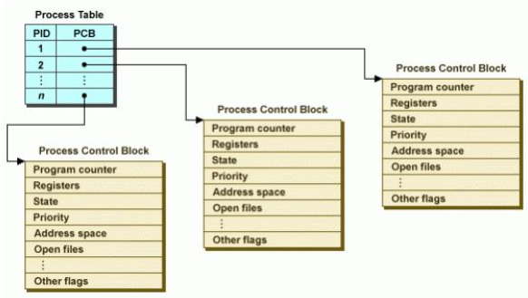

  - Data structure: `struct task_struct` (for each thread of each process)
    - `volatile long state`: running, paused..
    - Memory
      - `struct mm_struct *mm`: describe memory mapping of the thread (used in forking)
      - `struct mm_struct *active_mm`: describe memory mapping of the thread (used in forking), usually points to the same above
    - Pid
      - `pid_t pid`: thread id
      - `pid_t tgid`: thread group id (actual pid of the entire process)
      - Single thread process: they are the same
      - If a single thread process creates a new thread then this will have same `tgid` and different `pid`
      - So the `pid` seen in the process is the `pid` of the first thread that has been executed
    - Files: used to interact with the file system
      - `struct fs_struct *fs`
      - `struct files_struct *files`
    - `struct signal_struct *sig`: signal which are currently masked
    - `struct thread_struct thread`: hardware dependent, mantains CPU-specific state
    - Scheduling
      - `int prio;`: priority used by the scheduler
      - `unsigned long policy`: scheduling policy
    - Multiple cpus
      - `int nr_cpus_allowed;`: number of allowed cpus the thread can run on
      - `cpumask_t cpus_allowed;`: allowed cpus on which the thread can run
  - `mm` member (`mm_struct`): anage the memory map of the process (thread)
    - Contains
      - Virtual address of the page table (`pgd` member)
        - Every time a thread is created a page table is created
      - Pointer to a list of `vm_area_struct` records (`mmap` field)
        - Everytime we allocate some memory the kernel will setup some `vm_area_struct` which tells that a range of virtual address space for this process is valid
        - The first time we access this memory there wlll be a minor fault and the kernel will allocate phisical memory (and will update the `pgd` member)
      - `active_mm`: used to "steal" a `mm` when running in an anonymous process
        - Anonymous process: kernel only thread (doesn't have virtual address space in user space)
        - Used to map a user space application memory layout to perform operations (anonymous process will see the user space process memory)
        - Non anonymous processes have `active_mm = mm`
    - `vm_area_struct`: describes a Virtual Memory Area (VMA)
      - `struct mm_struct *vm_mm:`: address space the structure belongs to
      - `unsigned long vm_start`: start address in `vm_mm`
      - `unsigned long vm_end`: end address
      - `pgprot_t vm_page_prot`: access permissions
      - `const struct vm_operations_struct *vm_ops`: operations to deal with this structure
        ```c
        struct vm_operations_struct {
          void (*open)(struct vm_area_struct *area);
          void (*close)(struct vm_area_struct *area);
          // What to do when a fault arises
          int (*fault)(struct vm_area_struct *vma, struct vm_fault *vmf);
          void (*map_pages)(struct vm_area_struct *vma, struct vm_fault *vmf);
          // Change permissions of a memory area (make writable)
          int (*page_mkwrite)(struct vm_area_struct *vma, struct vm_fault *vmf);
          // Set NUMA policy
          int (*set_policy)(struct vm_area_struct *vma, struct mempolicy *new);
          // Retrieve NUMA policy
          struct mempolicy *(*get_policy)(struct vm_area_struct *vma, unsigned long addr);
        };
        ```
      - `struct mempolicy *vm_policy`: NUMA policy
      - `struct file *vm_file`: pointer to a memory-mapped file
        - In Linux we can say that a file should be mapped to a memory area
      - `struct vm_area_struct *vm_next, *vm_prev`: linked list of VM areas per task, sorted by address
- Userspace Memory Management

  

  - Memory allocation when a process is executed

    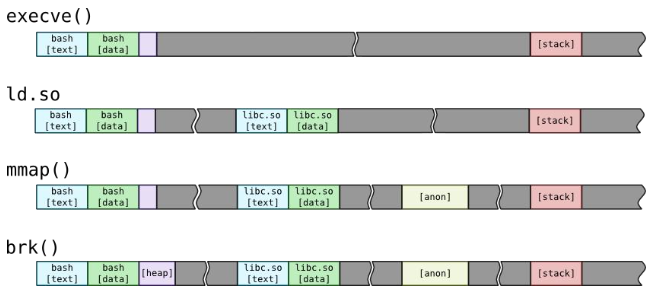

    - Initially we just execute the `execve()` of the process and the mapping will be minimal (this is the minimum memory allocation necessary to make a process run)
    - If we want to call a function in a shared library the dynamic linker (at runtime) will map in the memory space of the process the desired library
      - Linking is often referred to as a process that is performed when the executable is compiled, while a dynamic linker is a special part of an operating system that loads external shared libraries into a running process and then binds those shared libraries dynamically to the running process
    - `malloc() -> mmap()`: used to allocate dynamic data structures
    - `malloc() -> brk()`: used to use and enlarge size of the heap
  - Memory structure of an executing process
    - High level
    
      

    - Low level

      

- PCB allocation
  - Up to kernel 2.6: stored at the bottom of the kernel-level stack of the process which the PCB refers to

    
    
    - Security issue: stack overflow
  - Since kernel 2.6: PCB is moved outside of the kernel level stack, the `thread_info` data structure took its place

    

    - Security issue: stack overflow (could overwrite also next data structures, next to `thread_info`)
  - Kernel level stack and `thread_info`
    - `union thread_union`: used to easily allocate `thread_info` at the base of the stack independently of its size
      ```c
      union thread_union {
        struct thread_info thread_info;
        unsigned long stack[THREAD_SIZE/sizeof(long)];
      };
      ```
    - `struct thread_info` (4.2)
      ```c
      struct thread_info {
        struct task_struct *task;         /* main task structure */
        struct exec_domain *exec_domain;  /* execution domain (for containers) */
        __u32  flags;                     /* low level flags */
        __u32  status;                    /* thread synchronous flags */
        __u32  cpu;                       /* current CPU */
        int    saved_preempt_count;
        mm_segment_t addr_limit;
        void   __user      *sysenter_return;
        unsigned int sig_on_uaccess_error:1;
        unsigned int uaccess_err:1;       /* uaccess failed */
      };
      ```
  - Solution to kernel level stack overflows: Virtually Mapped Kernel Stack

    

    - We no longer use contiguous memory to allocate the kernel stack, we use contiguous virtual memory instead; so stack created relying on `vmalloc()`
      - A cache of kernel level stacks getting memory from `vmalloc()` has been introduced
    - Two pages (not readable/writable) are put at the start and the end of the stack so that overflows will be detected (segfault)
    - `thread_info` moved off the stack (its content is moved to `task_struct`)
      - Why?
        - `struct thread_info` (3.19.8, before this above)
          ```c
          struct thread_info {
            struct task_struct *task;
            struct exec_domain *exec_domain;
            __u32 flags;
            __u32 status;
            __u32 cpu;
            int preempt_count;
            mm_segment_t addr_limit;
            struct restart_block restart_block;
            // ...
          };
          ```
          - Flaws
            - `restart_block`: has a function pointer which is triggered when restarting a syscall; can be overridden with userspace pointers
            - `addr_limit`: user/kernel boundary, overwriting it we can access kernel memory from userspace (affects for example `access_ok()` which checks if the memory we are trying to access is legal)
              - Possible fix: SMEP/SMAP
                - SMEP: triggers page fault if CPU executes memory that has the user bit set while in ring 0
                - SMAP: same but for data
                  - So for example in a `copy_*_user()` we have to explicitly disable SMAP (`stap/clap` asm operations)
                    - But to execute this we rely also on `access_ok()`, so if we are able to change `addr_limit` then we can bypass everything (we call `copy_*_user()` with `access_ok()` bypassed and we leak kernel memory)
- Accessing PCBs
  - Accessing current PCB
    - `current`: refers to the currently scheduled process (architecture specific)
      - Returns the memory address of its PCB (`task_struct`)
      - Mapped to `static __always_inline struct task_struct *get_current(void)`
        - Returns the per-CPU variable `current_task`
        - Scheduler updates `current_task` when executing a context switch
  - Accessing other PCBs (up to 2.6.26): example usage = `kill()`
    ```c
    // Retrieve memory address of the PCB passing the process/thread pid as input
    static inline struct task_struct *find_task_by_pid(int pid) {
      struct task_struct *p,
        **htable = &pidhash[pid_hashfn(pid)];
        
      for(p = *htable; p && p->pid != pid; p = p->pidhash_next);
      return p;
    }
    ```
  - Accessing other PCBs (after 2.6.26)
    - `find_task_by_pid` replaced by `struct task_struct *find_task_by_vpid(pid_t vpid)`
    - Virtual pid: has to do with userspace namespaces (containers), to allow processes in different namespaces to share the same pid
  - Accessing other PCBs (up to 4.14): use hash tables to manage virtual pids (cumbersome)
  - Accessing other PCBs (now)
    - Hash data structure has been replaced by a radix tree
    - PIDs are replaced with Integer IDs (idr)
    - An idr is a sparse array mapping integer IDs on to arbitrary pointers
- Creating new processes: `fork()/exec()` model
  - In Linux you have to clone the current process and then replace the image of the process with a new program
    - `fork()` followed by `exec*()` allows for fast creation of new processes, both for sharing memory view or not
  - `fork()`: creates a new process (return value is zero in the child and the process id number of the child in the parent or 1 upon error), both processes start executing from the next instruction to the fork call

    

  - Process and thread creation: two ways (`flags` passed to `do_fork()` will discriminate the behavior)

    

    - Calling `sys_clone()` from Userspace
      - `long clone(unsigned long flags, void *child_stack, int *ptid, int *ctid, unsigned long newtls);`
        - When using `sys_clone()` we must allocate a new stack first (`child_stack`)
          - Userspace memory is always allocated from userspace
          - Also TLS must be allocated in userspace (architecture dependent)
          - `glibc` offers a uniform function (`pthread_create()`); the implementation of the syscall is slightly different one very architecture
    - `sys_fork()` and `sys_clone()`
      - `sys_fork()`: calls `do_fork()` with standard parameters
        ```c
        SYSCALL_DEFINE0(fork) {
          return _do_fork(SIGCHLD, 0, 0, NULL, NULL, 0);
        }
        ```
      - `sys_clone()`: calls `do_fork()` with custom parameters
        ```c
        SYSCALL_DEFINE5(clone, unsigned long, clone_flags, unsigned long, newsp, int __user *, parent_t idptr, int __user *, child_t idptr, unsigned long, tls) {
          return _do_fork(clone_flags, newsp, 0, parent_t idptr, child_t idptr, tls);
        }
        ```
      - `SIGCHLD` and `clone_flags` are the flags passed to `do_fork()`; through them `sys_clone()` can modify the behavior of `do_fork()`
    - `do_fork()` 
      - What it does
        - Fresh PCB/kernel stack allocation
        - Copy/setup of PCB information/data structures (depending on flags)
        - Legit values for the flags
          - `CLONE_VM`: set if virtual memory is shared between processes
          - `CLONE_FS`: set if filesystem info shared between processes
          - `CLONE_FILES`: set if open files shared between processes
          - `CLONE_PID`: set if pid shared (thread of the same process)
          - `CLONE_PARENT`: set if we want to have the same parent as the cloner
      - Implementation (5.0)
        ```c
        long do_fork(unsigned long clone_flags, unsigned long stack_start, unsigned long stack_size, int __user *parent_tidptr, int __user* child_tidptr, unsigned long tls) {
          struct pid *pid;
          struct task_struct *p;
          // ...
          // This does the job, it creates the process
          p = copy_process(clone_flags, stack_start, stack_size, child_tidptr, NULL, trace, tls, NUMA_NO_NODE);
          // ...
          // The pid of the process is "created" (took from the list)
          pid = get_task_pid(p, PIDTYPE_PID);
          // ...
          // Ask the scheduler to schedule the task
          wake_up_new_task(p);
        }
        ```
        - `copy_process()`: implements checks on namespaces; pending signals are processed immediately in the parent process
          - `p = dup_task_struct(current, node);`: duplicate task struct
            - `setup_thread_stack(tsk, orig);`: setup thread stack
          - `copy_creds(p, clone_flags);`: copy information about the user running that thread
          - `copy_files(clone_flags, p);`: copy opened files
          - `copy_fs(clone_flags, p);`: copy filesystem open (in terms of mapped mountpoints known)
          - `copy_mm(clone_flags, p);`: copy memory map
            - `dup_mm()`
              ```c
              static struct mm_struct *dup_mm(struct task_struct *tsk) {
                struct mm_struct *mm, *oldmm = current->mm;
                // Allocate new memory map
                mm = allocate_mm();
                // ...
                // Copy content of current memory map to new memory map
                memcpy(mm, oldmm, sizeof(*mm));
                // Allocate new PGD for the new memory map
                if (!mm_init(mm, tsk, mm->user_ns))
                  goto fail_nomem;
                err = dup_mmap(mm, oldmm);
                if (err)
                  goto free_pt;
                // ...
                return mm;
                // ...
              }
              ```
- Kernel Thread Creation API
  - `struct task_struct *kthread_create(int (*function)(void* data), void *data, const char namefmt[], ...)`
    - `task_struct`: same in kernel and userspace, seen as a task by the skeduler (can be preempted)
    - `*function`: thread entrypoint
    - `*data`: entrypoint parameters
    - `namefmt`: name of thread
    - Kthreads are stopped upon creation, they must be activated with a call to `wake_up_process()`
  - `__kthread_create_on_node()`: NUMA aware implementation of the function above
    ```c
    struct task_struct *__kthread_create_on_node(int (*threadfn)(void*data), void *data, int node, const char namefmt[], va_list args) {
      struct task_struct *task;
      struct kthread_create_info *create = kmalloc(sizeof(*create), GFP_KERNEL);
      if(!create) return ERR_PTR(-ENOMEM);
      create->threadfn = threadfn;
      create->data = data;
      create->node = node;
      create->done = &done;
      spin_lock(&kthread_create_lock);
      list_add_tail(&create->list, &kthread_create_list);
      spin_unlock(&kthread_create_lock);
      wake_up_process(kthreadd_task); // Kernel thread daemon
      // ...
    }
    ```
    - Creation of this thread is demanded to a separate unit of execution because the thread you are creating this new kthread can be different from the one passed in input to the creation function
    - To do this we create a data structure containing all the info of the new kthread that will be used by the **Kernel Thread Daemon** to execute the kthread later
    - Kernel thread daemon finds the data in the `kthread_create_list` and will execute the new kthread only when the scheduler is scheduled on the wanted NUMA node
- Signal handlers management

  

  - The signal handler in the end is a function, so it ends in a `ret`; it must return to kernel space (as it is called in kernel space)
  - But then in kernel space we must have some sort of data structure keeping track of the original process (the pushed image of the process in the stack)

    

    - Firtst group: saved image of the process
    - Saved RIP: original process address? NO, it is a pointer to a stub (in VDSO) associated with the syscall `SIGRETURN`
      - `SIGRETURN`: syscall that says that the execution of a regular function is completed but that regular function is a signal handler
        - When it's triggered then the kernel knows that we are returning from a signal handler, so the kernel has to look at the process image to restore it and to JUMP to the initial process RIP
        - `sigrop`: vulnerability that allows to, crafting the stack of an application and inserting rop gadgets in here, execute code at ring 0 (because the image of the process is manipulated by the kernel in this situatiion)
- Out of Memory (OOM) Killer: module activated (if enabled) when the system runs out of memory
  - Possible actions
    - Kill a random task (bad)
    - Let the system crash (worse)
    - Try to be smart at picking the process to kill
      - If a process has a pending `SIGKILL` or is exiting this is automatically picked (check done by `task_will_free_mem()`)
      - Otherwise it issues a call to `select_bad_process()` which will return a process to be killed 
        - Iterates over all available processes calling `oom_evaluate_task()` on them until a killable process is found
        - Unkillable tasks (kernel threads) are skipped
        - `oom_badness()` implements the heuristic to pick the process to be killed (computes the score associated with each process, the higher the score the higher the probability of getting killed)
          - A score of zero is given if
            - The task is unkillable
            - The `mm` field is `NULL` (kthread)
            - If the process is in the middle of a fork
          - The score is computed proportionally to the RAM, swap and pagetable (respectively first, second, and last in the formula) usage: `points = get_mm_rss(p->mm) + get_mm_counter(p->mm, MM_SWAPENTS) + mm_pgtables_bytes(p->mm) / PAGE_SIZE;`
      - If no process is found a `panic()` is raised
- How a program is started
  - From `init`

    

  - Starting a program from `bash`
    - The `./program` will call `execute_disk_command`
      ```c
      static int execute_disk_command(char *command, int pipe_in, int pipe_out, int async, struct fd_bitmap *fds_to_close) {
        pid_t pid;
        pid = make_child(command,async);
        if(pid == 0) {
          shell_execve(command, args, export_env);
        }
      }
      ```
      - `execute_disk_command` will call `make_child(command,async);` that just calls the `fork()` syscall
        ```c
        pid_t make_child(char *command, int async_p) {
          pid_t pid;
          int forksleep;
          
          start_pipeline();
          
          forksleep = 1;
          while((pid = fork()) < 0 && errno == EAGAIN && forksleep < FORKSLEEP_MAX) {
            sys_error("fork: retry");
            
            reap_zombie_children();
            if (forksleep > 1 && sleep(forksleep) != 0) break;
            forksleep <<= 1;
          }
          // ...
          return(pid);
        }
        ```
        - `while`: until the fork returns 0 (error) we check the `errno` and if is `EAGAIN` we try again until a certain amount of max retries (`FORKSLEEP_MAX`)
      - Then again `execute_disk_command` will call `shell_execve` which will call into `execve`
        ```c
        int shell_execve(char* command, char **args, char **env) {
          execve(command, args, env);
          
          READ_SAMPLE_BUF(command, sample, sample_len);
          
          if(sample_len == 0) return (EXECUTION_SUCCESS);
          if(sample_len > 0) {
            if(sample_len > 2 && sample[0] == '#' && sample[1] == '!')
              return (execute_shell_script(sample, sample_len, command, args, env));
            else if(check_binary_file(sample, sample_len)) {
              internal_error(_("%s: cannot execute binary file"), command);
              return (EX_BINARY_FILE);
            }
          }
          longjmp(subshell_top_level, 1);
        }
        ```
        - `execve`: here the fork of `bash` that we created will be replaced with a new process
          - This call doesn't return, there is code below just in case it fails
        - If `execve` fails we check a few bytes of the file passed in input (to be executed): `if(sample_len > 2 && sample[0] == '#' && sample[1] == '!')`, this is the shebang (ex: `#!/bin/env python3`) and it is used to find the correct interpreter
        - If also this temptative fails `longjmp` is called

          

          - The shell when starts create a CPU ctx (CPU context)
          - This context is restored by `longjmp` when a sequence of threads is spawned by the shell and the last causes an error
          - So `longjmp` invalidates any amount of function calls started from the main infinite loop of the shell 
  - More generally in the end when a program is executed this is done in the end by an `exec*()` syscall
    - What it does: changes the program file that an existing process is running
      1. Wipes out the memory state of the calling process
      2. Goes to the filesystem to find the program file requested
      3. Copies this file into the program's memory and initializes register state including the PC
      - Doesn't alter most of the other fields in the PCB
    - Implementation
      - Structure: `linux_binprm` (linux binary program), struct that describes a binary program (also a script) that is about being transformed into a running process
        ```c
        struct linux_binprm {
          char buf[BINPRM_BUF_SIZE];
          struct page *page[MAX_ARG_PAGES];
          unsigned long p; /* current top of mem */
          int sh_bang;
          struct file *file;
          int e_uid, e_gid;
          kernel_cap_t cap_inheritable, cap_permitted, cap_effective;
          int argc, envc;
          char *filename; /* Name of binary */
          unsigned long loader, exec;
        };
        ```
        - `page`: set of pages that can be used to create the image of the process
        - `buf`: used to pass parameters to the process
        - `p`: top of memory of the process
      - Any `exec*()` syscall will call `do_execve()`
        ```c
        int do_execve(char *filename, char **argv, char **envp, struct pt_regs *regs) {
          struct linux_binprm bprm;
          struct file *file;
          int retval;
          int i;
          
          file = open_exec(filename); // Open the file
          
          retval = PTR_ERR(file);
          if(IS_ERR(file)) return retval;
          
          // Zero all pages allocated
          bprm.p = PAGE_SIZE * MAX_ARG_PAGES - sizeof(void*);
          memset(bprm.page, 0, MAX_ARG_PAGES * sizeof(bprm.page[0]));

          bprm.file = file;
          bprm.filename = filename;
          bprm.sh_bang = 0;
          bprm.loader = 0;
          bprm.exec = 0;

          // Check if there are parameters and if they are available, else return 0
          if((bprm.argc = count(argv, bprm.p / sizeof(void*))) < 0) {
            allow_write_access(file);
            fput(file);
            return bprm.argc;
          }

          if((bprm.envc = count(envp, bprm.p / sizeof(void*))) < 0) {
            allow_write_access(file);
            fput(file);
            return bprm.envc;
          }
          
          // Check if the passed program (file) is understood by the os
          // I think like well formed, correct magic bytes etc..
          // Not explained in depth
          retval = prepare_binprm(&bprm);
          if(retval < 0) goto out;
          
          // Copy on the stack of the program the filename (argv[0])
          retval = copy_strings_kernel(1, &bprm.filename, &bprm);
          if(retval < 0) goto out;
          
          // Copy on the stack of the program all env vars
          bprm.exec = bprm.p;
          retval = copy_strings(bprm.envc, envp, &bprm);
          if(retval < 0) goto out;
          
          // Copy on the stack of the program all the arguments (argv)
          retval = copy_strings(bprm.argc, argv, &bprm);
          if(retval < 0) goto out;
          
          // Search for the interpreter of the program
          retval = search_binary_handler(&bprm, regs);
          if(retval >= 0) /* execve success */ return retval;

        out:
          /* Something went wrong, return the inode and free the argument pages */
          allow_write_access(bprm.file);
          if(bprm.file) fput(bprm.file);

          // Just cleanup everything
          for(i = 0; i < MAX_ARG_PAGES; i++) {
            struct page *page = bprm.page[i];
            if(page) __free_page(page);
          }
          return retval;
        }
        ```
        - `search_binary_handler()`: scans a list of binary file handlers registered in the kernel, if no handler is able to recognize the image format syscall returns the `ENOEXEC` error (Exec Format Error)
          - If the program is an elf `load_elf_binary()` will be called
            1. Load image file to memory using `mmap`
            2. Reads the program header (`elf_ex = *((struct elfhdr *)bprm->buf);`) and sets permissions accordingly  
- Compiling process

  

  - Preprocessor: replaces pieces of text with other frames (of code)
    - Directives to the preprocessor starts with `#` (they are replaced)
      - Example: `#include<file>` opens `file` and replace `#include<file>` with the `file` content
      - `-E`: show preprocessor output and stop compilation after preprocessing
  - Compiler: generate assembly file given source code (parsed by preprocessor)
    - `-S`: show compiler output and stop compilation after compiling process
  - Assembler: generate binary from assembly
    - `-c`: show assembler output and stop compilation after assembling process
  - Object file: `.o` (Relocatable file)
    - Here there is everything that represents the program but we still haven't resolved relationship between finctions, instructions, data..
    - Eventyally someone will have to link together everything..
  - Linker: take multiple relocatable files (object files) and transform them into executable files
  - Makefile: file that is run by `make` and vehiculates all this process
  - Library file: if we want to create a lib (static) we rely on an archive file which is the collection of multiple object files (these will be linked by the linker in the final program that uses the library)
  - Shared object: intermediate representation between relocatable and executable file (see next)
  - Linker script file: how the linker should glue together object files
- ELF: defines format of binary executables
  - Categories
    - Relocatable (or shared object): created by compilers and assemblers, must be processed by the linker before being run
    - Executable: all symbols are resolved except for shared libraries' symbols which are resolved at runtime
    - Shared object: library which is shared by different programs, contains all the symbols' information used by the linker and the code to be executed at runtime
    - Core file: core dump
  - Twofold nature
    - Compilers assemblers and linkers handle them as a set of logical sections (data, code, metadata...)
    - The system loader handles them as a set of segments (contains how should be mapped, permissions...)
  - Structure (IMAGE VERY IMPORTANT, EXPLICATIVE)

    

    - Relocatable file (or shared object): collection of sections
      - Info
        - Each section contains a single kind of information such as executable code, read only data, read write data, relocation entries or symbols
        - Each symbol's address is defined in relation to the section which contains it (example: a function's entry point is defined in relation to the section of the program which contains it)
      - Section header
        ```c
        // For each section
        typedef struct {
          Elf32_Word sh_name;   /* Section name (string table index) */ // EX: index to the string .text
          Elf32_Word sh_type;   /* Section type */
          Elf32_Word sh_flags;  /* Section flags */
          Elf32_Addr sh_addr;   /* Section virtual addr at execution */
          Elf32_Off  sh_offset; /* Section file offset */
          Elf32_Word sh_size;   /* Section size in bytes */
          Elf32_Word sh_link;   /* Link to another section */
          Elf32_Word sh_info;   /* Additional section information */
          Elf32_Word sh_addralign; /* Section alignment */
          Elf32_Word sh_entsize;   /* Entry size if section holds table */
        } Elf32_Shdr;
        ```
        - Types (`sh_type`)
          - `PROGBITS`: section contains the program content (code, data, debug information)
          - `NOBITS`: same as `PROGBITS` yet with a null size (see next)
          - `SYMTAB` and `DYNSYM`: contains a symbol table (static or dynamic)
            - Symbol table is a metadata table which allows the dynamic linker to locate whithin everythin which is program content (variables, functions and symbols)
            - For example it is used to keep track of where a variable is in the data section
          - `STRTAB`: section contains a string table (contains all the names of all specific objects associated with that program)
          - `REL` and `RELA`: section contains relocation information
            - "Merges" `PROGBITS` and `SYMTAB` (also `DYN`): finds in the symbol table the symbol that must replace `flag` in the `PROGBITS` section

              

            - If the symbol is not found it will be later found by the linker and the two symbols will be bind together using the string table
          - `DYNAMIC` and `HASH`: section contains dynamic linking information
        - Flags (`sh_flags`)
          - `WRITE`: section contains runtime writeable data (should be mapped to a segment which is writable)
          - `ALLOC`: section occupies memory at runtime (must be mapped when the program is started up)
          - `EXECINSTR`: section contains executable machine instructions
      - Sections
        - `.text`: contains program’s instructions
          - Type: `PROGBITS`
          - Flags: `ALLOC+EXECINSTR` (will be allocated in memory)
        - `.data`: contains preinitialized read/write data
          - Type: `PROGBITS`
          - Flags: `ALLOC+WRITE`
        - `.rodata`: contains preinitialized read-only data
          - Type: `PROGBITS`
          - Flags: `ALLOC`
        - `.bss`: contains uninitialized data, set to zero at startup
          - Type: `NOBITS` (doesn't occupy memory in disk but occupies memory in RAM)
          - Flags: `ALLOC+WRITE`
    - Executable file
      - Info
        - Segments
          - A read only segment for code
          - A read only segment for read only data
          - A read/write segment for other data
        - Any section marked with flag `ALLOCATE` is packed in the proper segment so that the operating system is able to map the file to memory with few operations 
          - If `.data` and `.bss` sections are present they are placed within the same read/write segment
      - Program header
        ```c
        // For each segment
        typedef struct {
          Elf32_Word p_type;    /* Segment type */
          Elf32_Off  p_offset;  /* Segment file offset */
          Elf32_Addr p_vaddr;   /* Segment virtual address */
          // For embedded, addres in ROM of some resources for the executable
          Elf32_Addr p_paddr;   /* Segment physical address */
          Elf32_Word p_filesz;  /* Segment size in file */ // 0 in .bss
          Elf32_Word p_memsz;   /* Segment size in memory */ // Recall .bss
          Elf32_Word p_flags;   /* Segment flags */ // Permissions
          Elf32_Word p_align;   /* Segment alignment */
        } Elf32_Phdr;
        ```
- Linker's role

  

  - If a relocatable file refers an instruction or something to another relocatable file we have to perform **static relocation**

    

    - Addend is (in this case) the 4 bytes that must be considered to express the offset correctly (call starts counting after 4 bytes of offset i think)
- Symbol's visibility (similar to private/protected in java)
  - Coarse grained control: `gcc` gives the command line option `-fvisibility`
    - `default`: normal behaviour, the symbol is seen by other modules
    - `hidden`: two declarations of an object refer the same object only if they are in the same shared object
    - `internal`: an entity declared in a module cannot be referenced even by pointer
    - `protected`: the symbol is weak (more modules can have a symbol with the same name of a weak one)
  - Fine grained control
    - Single: `int variable __attribute__((visibility(“hidden”)));`
    - Multiple
      ```c
      // Push in the visibility stack "hidden" and then pop it
      #pragma GCC visibility push(hidden)
      int variable;
      int increment(void) {
        return ++variable;
      }
      #pragma GCC visibility pop
      ```
- Entry Point for the Program
  - `main()` is not the entry point for the program
  - `glibc` inserts auxiliary functions (actual entry point is called `_start`)
  - But the "real" entry point is the dynamic linker: the Kernel starts the dynamic linker which is stored in the `.interp` section of the program (if no dynamic linker is specified control is given at address specified in `e_entry`)
- Dynamic linker
  - Initialization steps
    1. Self initialization
    2. Loading Shared Libraries (memory map them, if already loaded by another process use it, can be shared)
    3. Resolving remaining relocations
       - It won't resolve function calls, it will do it in a lazy way: when a function is called the first time in the program the dynamic linker will resolve it and cache it for next calls; this is implemented using PLT and GOT
       - PLT and GOT
         - Procedure Linkage Table (PLT): used to call functions whose address isn't known at link time
         - Global Offsets Table (GOT): similarly used to resolve addresses of data/functions
       - Dynamic relocation
         - Data structures
           - `.dynsym`: minimal symbol table used by the dynamic linker when performing relocations (same as how the linker does)
           - `.hash`: hash table that is used to quickly locate a given symbol in the `.dynsym`, usually in one or two tries
           - `.dynstr`: string table related to the symbols stored in `.dynsym`
           - These tables are used to populate the GOT table upon need (lazy binding)
         - Populating tables
           - GOT and PLT after library loading

             

             - All the calls (to libs) in the program refer to the PLT (`func@PLT`)
             - Entry in the PLT corresponds to entry in the GOT
             - Process
               - When you call for the first time a lib function you jump to the PLT, then you jump to the corresponding entry in the GOT
               - Here the address of (ex) `printf` hasn't been resolved yet so the `addr` in GOT points to `prepare resolver`
               - `prepare resolver` pushes in the stack some information for the dynamic linker to make it know that a function must be resolved, then you jump to the first entry of the PLT
               - Here the dynamic linker (`resolver`) is called, it will resolve the function and place it in GOT (address of `resolver` is written by the linker during its self-initialization phase)  
           - GOT and PLT after first call to `func` (`printf`)

             

    4. Transfer control to the application (`_start`)
       ```asm
       <_start>:
        xor   %ebp, %ebp
        pop   %esi              // argc go into %esi
        mov   %esp, %ecx        // %esp points to argv, put it in %ecx
        and   $0xfffffff0, %esp // Align the stack pointer to a multiple of 16 bytes
        // Prepare parameters to __libc_start_main
        // %eax is garbage to keep the alignment
        push  %eax
        push  %esp
        push  %edx
        push  $0x8048600
        push  $0x8048670
        push  %ecx
        push  %esi
        push  $0x804841c

        call  8048338 <__libc_start_main>

        // We will never return here
        hlt // Should never be executed
        nop
        nop
       ```
- Userspace Life of a Program

  

  - `preinitarray`: set of initialization functions to run previous tha  `_start`
  - `__libc_start_main`: takes from `_start` `argc, argv, argp` and starts main passing them
  - Before starting `main`, `__libc_start_main` calls `constructors` (before `constructors` `__gmon_start_`, which is a monitoring function to profile the application)
    - Constructors are used if we want to run something before `main` gets executed
  - After constructors we call a number of initializing functions (`initarray`)
  - Once `main` returns to `__libc_start_main`, before calling the `exit()` syscall, the standard library `exit` wrapper is called
    - This will call
      - Every function registered with the standard library `atexit()` function 
      - A number of finalizing functions (`finiarray`)
      - `destructor` (counterpart of the `preinitarray`)

### Process Scheduling

- Scheduling strategies
  - Priority
  - Responsiveness
  - Fairness
- Process Priority
  - Unix demands for priority based scheduling
    - Relates to the nice of a process in `[-20, 19]`, the higher the nice the lower the priority
  - Notion of realtime processes
    - Class
      - Hard realtime: bound to strict time limits in which a task must be completed (not supported in mainstream Linux)
      - Soft realtime: there are boundaries but don't make your life depend on it (ex: burning data to a CD ROM)
    - Priorities
      - In `[0, 99]`, higher value means lower priority
      - Commands
        - `ps -eo pid,rtprio,cmd`: check if some process has realtime priority
        - `chrt -p pid`: change realtime priority of a pid
        - `chrt -p prio pid`: same as before but define explicitly
  - In the kernel
    - Both nice and realtime priorities are mapped to a single value in `[0, 139]` in the kernel
      - 0 to 99 are reserved to realtime priorities
      - 100 to 139 for nice priorities (mapping exactly to `[-20, 19]`
    - Implementation
      ```c
      #define MAX_NICE 19
      #define MIN_NICE -20
      #define NICE_WIDTH (MAX_NICE - MIN_NICE + 1)
      #define MAX_USER_RT_PRIO 100
      #define MAX_RT_PRIO MAX_USER_RT_PRIO
      #define MAX_PRIO (MAX_RT_PRIO + NICE_WIDTH)
      #define DEFAULT_PRIO (MAX_RT_PRIO + NICE_WIDTH / 2) // Zero

      // ---

      /*
      * Convert user-nice values [-20...0...19]
      * to static priority [MAX_RT_PRIO..MAX_PRIO-1],
      * and back.
      */
      #define NICE_TO_PRIO(nice) ((nice) + DEFAULT_PRIO)
      #define PRIO_TO_NICE(prio) ((prio) - DEFAULT_PRIO)
      
      /*
      * 'User priority' is the nice value converted to something we
      * can work with better when scaling various scheduler parameters,
      * it's a [0...39] range.
      */
      #define USER_PRIO(p) ((p) - MAX_RT_PRIO)
      #define TASK_USER_PRIO(p) USER_PRIO((p)->static_prio)
      #define MAX_USER_PRIO(USER_PRIO(MAX_PRIO))
      ```
  - Kernel maintains this information in `task_struct`
    - Fields
      - `static_prio`: priority given statically by a user (and mapped into kernel's representation)
      - `normal_ priority`: based on `static_prio` and scheduling policy of a process; tasks with the same static priority that belong to different policies will get different normal priorities (child processes inherit the normal priorities from their parent processes when forked)
      - `prio`: dynamic priority (effective); it can change in certain situations (e.g. to preempt a process with higher priority)
        - Computation
          ```c
          p->prio = effective_prio(p);
          
          static int effective_prio(struct task_struct *p) {
            // static_priority or maps rt_priority to kernel representation
            p->normal_prio = normal_prio(p);
            if(!rt_prio(p->prio)) return p->normal_prio;
            return p->prio;
          }
          ```
      - `rt_priority`: realtime priority for realtime tasks in `[0, 99]`
    - Load weights: used to scale the time slice assigned to a scheduled process
      - `task_struct->se` is a `struct sched_entity` which keeps a `struct load_weight load`
        ```c
        struct load_weight {
          unsigned long weight;
          u32 inv_weight;
        };
        ```
      - When a CPU-bound task goes from nice 0 to nice 1 it will get 10% less CPU time (also valid the opposite)
      - For each possible nice level there exists a weight
        ```c
        const int sched_prio_to_weight[40] = {
          /* -20 */   88761,  71755,  56483,  46273,  36291,
          /* -15 */   29154,  23254,  18705,  14949,  11916,
          /* -10 */   9548,   7620,   6100,   4904,   3906,
          /* -5 */    3121,   2501,   1991,   1586,   1277,
          /* 0 */     1024,   820,    655,    526,    423,
          /* 5 */     335,    272,    215,    172,    137,
          /* 10 */    110,    87,     70,     56,     45,
          /* 15 */    36,     29,     23,     18,     15,
        };
        ```
      - Example of weights calculation
        - Two tasks running at nice 0 (weight 1024) both get 50% of time (`1024 / (1024 + 1024) = 0.5`)
        - Task 1 is moved to nice -1 (priority boost)
          - T1: `1277 / (1024 + 1277) = 0.55`
          - T2: `1024 / (1024 + 1277) = 0.45`
        - Task 2 is then moved to nice 1 (priority drop)
          - T1: `1277 / (820 + 1277) = 0.61`
          - T2: `820 / (820 + 1277) = 0.39`
- Scheduling classes
  - Types
    - `SCHED_FIFO`: realtime FIFO scheduler, in which a process has to explicitly yield the CPU (the scheduler will not take control of the CPU until the process scheduled won't leave it)
    - `SCHED_RR`: realtime Round Robin Scheduler (might fallback to FIFO), classic round robin + realtime
    - `SCHED_OTHER/SCHED_NORMAL`: common round robin time sharing scheduling policy
    - `SCHED_DEADLINE`: hard realtime
  - Implementation
    ```c
    // Function pointers used to implement general aspects of scheduling algorithms 
    struct sched_class {
      const struct sched_class *next;
      void (*enqueue_task)(struct rq *rq, struct task_struct *p, int flags);
      void (*dequeue_task)(struct rq *rq, struct task_struct *p, int flags);
      // What happens if a task yields the CPU
      void (*yield_task)(struct rq *rq);
      
      // How to implement whether we have to preempt the running task
      void (*check_preempt_curr)(struct rq *rq, struct task_struct *p, int flags);
      // How to implement the next task selection strategy
      struct task_struct *(*pick_next_task)(struct rq *rq, struct task_struct *prev, struct rq_flags *rf);
      // How to put back task that have been descheduled
      void (*put_prev_task)(struct rq *rq, struct task_struct *p);
      // ...
      // How to tell that we want to run some current task
      void (*set_curr_task)(struct rq *rq);
      int (*select_task_rq)(struct task_struct *p, int task_cpu, int sd_flag, int flags);
      // ...
    };
    ```
    - Run queues: set of processes that can be run on some specific CPU (so in each CPU we have a run queue)
      ```c
      struct rq {
        unsigned int nr_running;
        #define CPU_LOAD_IDX_MAX 5
        unsigned long cpu_load[CPU_LOAD_IDX_MAX];
        /* capture load from all tasks on this cpu */
        struct load_weight load;
        struct cfs_rq cfs; // Scheduler specific rq
        struct rt_rq rt; // Scheduler specific rq
        // Pointer to the currently running task and the idle process
        struct task_struct *curr, *idle, ...; 
        u64 clock;
        /* cpu of this run queue */
        int cpu;}
      ```
      - From kernel 2.6 it has been moved to a per-CPU variable (accessible also from other CPUs)
        ```c
        DECLARE_PER_CPU_SHARED_ALIGNED(struct rq, runqueues);
        
        // Get rq of a core
        #define cpu_rq(cpu)   (&per_cpu(runqueues, (cpu)))
        // What is the rq of my core
        #define this_rq()     this_cpu_ptr(&runqueues)
        // At what rq belongs a specific process
        #define task_rq(p)    cpu_rq(task_cpu(p))
        // Currently running process on a specific core
        #define cpu_curr(cpu) (cpu_rq(cpu)->curr)
        ```
      - Note: in a run queue there are processes that can be scheduled (so that are "active" and not sleeping)
    - Wait queues: counterpart of the run queue, data structures to manage threads that are waiting for some condition to become true (threads that are sleeping)
      - Problem (Thundering Herd Effect): all threads wake up when resource available but just one locks the resource, waste!
      - Solution
        ```c
        // This flag tells that a process doesn't want to 
        // be waken up with other processes
        #define WQ_FLAG_EXCLUSIVE 0x01
        
        struct wait_queue_entry {
          unsigned int flags; // Here you can define WQ_FLAG_EXCLUSIVE
          void *private;
          wait_queue_func_t func; // Function to be called when you want to perform wake up
          struct list_head entry;
        };
        
        struct wait_queue_head {
          spinlock_t lock; // Lock protected
          struct list_head head; // Contains wait_queue_entry
        };
        typedef struct wait_queue_head wait_queue_head_t;

        ```
      - API
        - `static inline void init_waitqueue_entry(struct wait_queue_entry *wq_entry, struct task_struct *p)`: setup some wait queue entry
        - `wait_event_interruptible(wq_head, condition)`: wait on the wq (`wq_head`) until we meet a `condition` (we are interruptible, so we can receive signals also if we sleep)
        - `wait_event_interruptible_timeout(wq_head, condition, timeout)`: same as before but with timeout
        - `wait_event_interruptible_hrtimeout(wq, condition, timeout)`: same as before but with an high resolution timer
        - `wait_event_hrtimeout(wq_head, condition, timeout)`: same as before but not interruptible
        - Add a process to the wq
          - Ways
            - Not exclusive
              ```c
              void add_wait_queue(struct wait_queue_head *wq_head, struct wait_queue_entry *wq_entry) {
                unsigned long flags;
                wq_entry->flags &= ~WQ_FLAG_EXCLUSIVE; // We are not waiting in an exclusive way
                spin_lock_irqsave(&wq_head->lock, flags);
                list_add(&wq_entry->entry, &wq_head->head); // Just add the process to the wq
                spin_unlock_irqrestore(&wq_head->lock, flags);
              }
              ```
            - Exclusive
              ```c
              void add_wait_queue_exclusive(struct wait_queue_head *wq_head, struct wait_queue_entry *wq_entry) {
                unsigned long flags;
                wq_entry->flags |= WQ_FLAG_EXCLUSIVE; // We are waiting in an exclusive way
                spin_lock_irqsave(&wq_head->lock, flags);
                list_add_tail(&wq_entry->entry, &wq_head->head); // Just add the process to the wq
                spin_unlock_irqrestore(&wq_head->lock, flags);
              }
              ```
          - How the wq behaves so?

            

            - Not exclusive: waken up together immediately
            - Exclusive: wake up one of the exclusive guys
        - There are also wake up APIs that are used to wake up one or a subset of processes
- Scheduler entry point: `schedule(void)`, after calling it, it will do its job
  - Invocation methods
    - Direct Invocation: an explicit call to `schedule()` is issued
    - Lazy Invocation: some hint is given to the kernel indicating that `schedule()` should be called soon (remember `need_resched`)
  - `schedule()` phases (depend on the scheduler implementation)
    1. Perform some checks on the current process (e.g. with respect to signal processing, we usually try to consume signals when scheduling)
    2. Selection of the process to be activated (scheduling algorithm)
    3. Context switch (if the choosen process is different from the current one)
- Periodic scheduling
  - How it works
    - `update_process_times()` will be call periodically; it will determine if the current time quantum is expired or not
    - Then it will call into `schedule_tick()` that tells the scheduler that possibly a different task should be activated
      - Since we have multiple scheduling classes, `schedule_tick()` must understand what class should be activated (the one of the process which is currently running) 
      - Implementation: `schedule_tick()`
        ```c
        /*
        * This function gets called by the timer code, with HZ frequency.
        * We call it with interrupts disabled.
        */
        void scheduler_tick(void) {
          int cpu = smp_processor_id(); // Define in whic CPU we are running
          struct rq *rq = cpu_rq(cpu); // Pick the rq of this CPU
          struct task_struct *curr = rq->curr; // Determine currently running task on the rq
          // ...
          update_rq_clock(rq); // Update clock of the rq
          curr->sched_class->task_tick(rq, curr, 0); // Tick the usage of resources of this specific process in the rq
          update_cpu_load_active(rq); // Update the weight load of the rq
          // ...
        }
        ```
- Task states: `state` field in the PCB, tracks the current state of the process thread
  - Values
    - `TASK_RUNNING`: process available in a rq (doesn't mean it is running, mean it is runnable; if it is running is pointed by the `curr` member of the rq)
    - `TASK_ZOMBIE`: all the processes that have exited but haven't been "reclaimed" (`wait()`) by their parents are described by a reduced PCB in which there is the return value
    - `TASK_STOPPED`: you send a stop signal to a process, then it will wait for a start signal to restart
    - `TASK_INTERRUPTIBLE`: remember the question of signals
    - `TASK_UNINTERRUPTIBLE`: as above but the opposite
    - `TASK_KILLABLE`: as `TASK_UNINTERRUPTIBLE` but critical signals can be received (ex: `SIGKILL`)

    

    - Task going to sleep
      - In case an operation cannot be completed immediately (think of a `read()`) the task goes to sleep in a wait queue
      - While doing this the task enters either the `TASK_INTERRUPTIBLE` or `TASK_UNINTERRUPTIBLE` state
      - At this point the kernel thread calls `schedule()` to effectively put to sleep the currently running one and pick the new one to be activated
    - Sleeping Task Wakes Up
      - The event a task is waiting for calls one of the `wake_up*()` functions on the corresponding wait queue
      - A task is set to runnable and put back on a run queue
      - If the woken up task has a higher priority than the other tasks on the run queue `TIF_NEED_RESCHED` is flagged
- Schedulers and scheduler policies
  - O(n) Scheduler (2.4)
    - Info
      - It has a linear complexity as it iterates overall tasks in the run queue
      - Time is divided into epochs; at the end of an epoch every process has run at least once using up its whole quantum
      - If processes did not use the whole quantum they have half of the remaining time slice added to the new time slice
    - Implementation
      ```c
      asmlinkage void schedule(void) {
        int this_cpu, c; /* weight */
        // ...
        repeat_schedule:
          /* Default process to select.. */
          // By default the next process is the idle task (there is one for each CPU core)
          // One for each CPU because it is a while true with an halt (power saving)
          next = idle_task(this_cpu);
          c = -1000; /* weight */
          // Scan the run queue, here it's a linked list
          list_for_each(tmp, &runqueue_head) {
            p = list_entry(tmp, struct task_struct, run_list);
            // If the process can be scheduled save its weight and pointer
            // The process scheduled will be the one with higher weight
            if (can_schedule(p, this_cpu)) {
              int weight = goodness(p, this_cpu, prev->active_mm);
              if (weight > c) c=weight, next=p;
            }
          }
      }
      ```
      - Computing the goodness
        - `goodness(p) = `
          - `20 - p->nice`: base time quantum
            - 20: max value
          - `+ p->counter`: ticks left in time quantum (if it hasn't finshed its previous time quantum)
          - `+ 1`: if page table is shared with the previous process (because like this we don't have to perform a TLB flush, so better performance)
          - `+ 15`: in multicore, if p was last running on the same CPU (still better performance)
        - Goodness values explained and special cases
          - `-1000`: never select this process to run
          - `0`: out of time slice (`p->counter = 0`)
          - `> 0`: the goodness value, the larger the better
          - `+1000`: a realtime process, select this
      - Epoch management
        ```c
        // ...
        /* Do we need to re-calculate counters? */
        // It can be that all processes are out of time slice (0)
        // This means that every process ran at least 1 time
        // So we recalculate priorities (counter)
        if (unlikely(!c)) {
          struct task_struct *p;

          spin_unlock_irq(&runqueue_lock);
          read_lock(&tasklist_lock);
          for_each_task(p)
            // Consider previous time left in the time quantum
            // Compute the additional importance of the process using the nice value (6 - p->nice/4)
            p->counter = (p->counter >> 1) + NICE_TO_TICKS(p->nice);
          read_unlock(&tasklist_lock);
          spin_lock_irq(&runqueue_lock);
          goto repeat_schedule; // See before implementation
        }
        // ...
        ```
    - Analysis
      - Cons
        - A non runnable task is also searched to determine its goodness
        - Mixture of runnable/non runnable tasks into a single run queue in any epoch
        - Performance problems on multicore as the length of critical sections depends on system load
          - Example: two cores call the scheduler at the same time, the scheduler access the run queue with a lock so in the end the execution is serial

          

      - Pros
        - Perfect Load Sharing (we are using a single run queue, so the choice is always the best)
        - No CPU under utilization for any workload type
        - No temporary binding of threads to CPUs (there is only one run queue, so the probability to be scheduled on a CPU or on another is the same; if a run queue for each CPU core then probably some tasks will be always scheduled in a CPU)
  - O(1) Scheduler (2.6.8)
    - Info
      - Schedules tasks in constant time independently of the number of active processes
      - Introduced the global priority scale (duration of time quantum based on the workload)
      - If a task enters the `TASK_RUNNING` state its priority is checked to see whether to call `schedule()` (if priority greater than the one of the running process)
      - Static priority for real time tasks
      - Dynamic priority for other tasks, recalculated at the end of their time slice (increases interactivity)
    - Implementation
      - Run queue revisited (no more a linked list)
        ```c
        struct runqueue {
          /* number of runnable tasks */
          unsigned long nr_running;
          // ...
          // Schedulable tasks
          struct prio_array *active;
          // Not schedulable tasks
          struct prio_array *expired;
          struct prio_arrayarrays[2];
        }
        ```
        ```c
        struct prio_array {
          // Number of tasks present here
          int nr_active;
          unsigned long bitmap[BITMAP_SIZE];
          struct list_head queue[MAX_PRIO];
        };
        ```
        - Explanation

          

          - Each entry has a list of tasks with a defined priority (ex: `Priority 1` is a list of tasks with priority 1)
          - There is an entry for each realtime priority and one for each user task priority (traditional)
          - The scheduler searches for the list which has at least one task inside (i think starting from the ones with higher priority, so lower index)
          - When a task has finished its time quantum is placed in the expired run queue (in the corrisponding priority array)
          - Epoch concludes when the active part of the run queue is empty
          - In the new epoch we swap the expired and the active run queues (simply swapping their pointers)
          - The bitmap member is used to find priority arrays which have at least one task inside

            

            - You check one row at a time, if it is non-zero you scan the row to find the first occurrence of a 1
    - Cross-CPU scheduling: we no more have a single run queue, there is one per core (so not perfectly fair scheduler)
      - Main concept
        - Problem: if all the tasks on one CPU exit the processor stand idle while another round robins three, ten or several dozen other tasks
        - Solution: every 200ms a CPU checks to see if any other CPU is out of balance and needs to be balanced with that processor; if the processor is idle it checks every 1ms so faster rebalancing
      - Further problem: stack variables refresh
        - Problem: the migration of a task from one CPU to another violates the fact that there are some variables that are on the stack and are "per CPU"
          ```c
          asmlinkage void __sched schedule(void) {
            struct task_struct *prev, *next;
            unsigned long *switch_count;
            struct rq *rq;
            int cpu;
            
            need_resched:
              preempt_disable();
              // Save CPU in which i'm running
              cpu = smp_processor_id();
              // Access the run queue of my CPU
              rq = cpu_rq(cpu);
              rcu_qsctr_inc(cpu);
              // prev = the task running before us (so the previous because we are going to be scheduled) 
              prev = rq->curr;
              switch_count = &prev->nivcsw;
              // ...
              // If there isn't another task to be executed, before going in idle, check if we can balance
              // calling into idle_balance
              if (unlikely(!rq->nr_running)) idle_balance(cpu, rq);
              
              prev->sched_class->put_prev_task(rq, prev);
              next = pick_next_task(rq, prev);
              
              if (likely(prev!=next)) {
                sched_info_switch(prev, next);
                
                rq->nr_switches++;
                rq->curr = next;
                ++*switch_count;
                
                // Here the magic happens
                // We substitute the context of prev with the context of next
                // next is took from the run queue of a different CPU
                // The stack of prev is saved somewhere and next uses a different stack,
                // but to make it consistent we have to.. (see original comment)
                // This because the code above gets executed also by next which saves
                // the old CPU and run queue on its stack, but this stack is no more accessible
                // MORE OR LESS
                context_switch(rq, prev, next); /* unlocks the rq */
                /* the context switch might have flipped the stack from under
                us, hence refresh the local variables. */
                cpu = smp_processor_id();
                rq = cpu_rq(cpu);
              } else spin_unlock_irq(&rq->lock);
              // ...
          ```
  - Staircase scheduler
    - Info
      - Increase responsiveness and reduce the complexity
      - Based on dropping the priority recalculation, replacing it with a simpler rank based scheme
      - Work better up to 10 CPUs (tailored for desktop environments)
    - How it works
      - The expired array is removed and the staircase data structure is used instead

        

        - In the beginning a process will live in the high priority rank
        - The more the process is kept running the more the priority will decrease (a process expiring its time slice is moved to a lower priority)
        - At the end of the staircase it gets to `PRIO - 1` level with one more time slice (will run longer but with lower priority)
        - If a process sleeps it gets back up in the staircase
        - This approach favors interactive processes rather than CPU bound ones
  - Completely Fair Scheduler (2.6.23, until now)
    - Tries to keep track how much time every process ran on the CPU so that it can balance the execution time of each process
    - It is based on a red black tree where nodes are processes times ordered by process execution time in nanoseconds

      

- Context switch (5.0)
  - Implemented in a machine dependent macro
    ```c
    // Arguments: previous and next processes
    #define switch_to(prev, next, last) \
    do { \
        prepare_switch_to(next); \
        ((last) = __switch_to_asm((prev), (next))); \
    } while(0)
    ```
  - Executes 
    - TSS update: because it is used to define which is the kernel level stack of the current running process
    - CPU control registers update: restore the previous state of the process and other things
  - Calls into `__switch_to_asm`
    ```c
    // x86
    ENTRY(__switch_to_asm)
      /* Save callee-saved registers */
      pushq   %rbp
      pushq   %rbx
      pushq   %r12
      pushq   %r13
      pushq   %r14
      pushq   %r15
      
      /* switch stack */
      // TASK_threadsp is an offset
      movq    %rsp, TASK_threadsp(%rdi)
      movq    TASK_threadsp(%rsi), %rsp
      
    #ifdef CONFIG_STACKPROTECTOR
      movq    TASK_stack_canary(%rsi), %rbx
      movq    %rbx, PER_CPU_VAR(irq_stack_union) + stack_canary_offset
    #endif
    
      /* restore callee-saved registers */
      popq    %r15
      popq    %r14
      popq    %r13
      popq    %r12
      popq    %rbx
      popq    %rbp
      
      jmp     __switch_to
    END(__switch_to_asm)
    ```
  - Calls into `__switch_to`

    

    - `save_fsgs()`: save fs and gs registers of the prev process
    - `load_TLS()`: load thread local storage of the next process
    - Then update es and ds
    - Save floating point unit context
    - At the end reload the new stack pointer for the new process

### Virtualization support

- System Virtualization
  - Intro
    - Virtualization allows to show resources different from the physical ones
    - Kernel virtualizes hardware to the userspace applications, but to emulate an os we have to add another layer of virtualization
    - A Virtual Machine is a mixture of software and hardware based facilities
      - The software component is the Hypervisor or VMM (Virtual Machine Monitor); it fakes the emulated os into thinking that it is the only os running on the machine
    - Advantages
      - Isolation of different execution environments on the same hardware
      - Reduction of hardware and administration costs
  - Hypervisor: core component of virtualization environment
    - Manages hardware resources provided by the host system
    - It makes virtualized resources available to the guest system in a correct and secure way
    - Types
      - Native Hypervisor (like VMM): runs with full capabilities on bare metal; it resembles a lightweight virtualization kernel operating on top of the hardware
      - Hosted Hypervisor: runs as an application which accesses host services via system calls
  - Software based Virtualization
    - Instructions are executed by the native physical CPU in the host platform
    - A subset of the instruction set must be emulated
    - Problem: what if ring 0 is required for guest activities? Risk to bypass the VMM resource management policy in case of actual ring 0 access
    - Solution: ring deprivileging
      - Technique to let the guest kernel run at a privilege level (higher) that simulates 0
      - When something at ring 0 must be executed the host machine takes the control
      - Two strategies
        - 0/3/3 Model
          - VMM runs at ring 0
          - Kernel guest and applications run at ring 3
          - Too close to emulation, too high costs (too many faults to be handled)
        - 0/1/3 Model
          - VMM runs at ring 0
          - Kernel guest runs at ring 1 (usually unused)
          - Applications run at ring 3
          - This is the most used approach
          - Applications (running at ring 3) cannot alter the state of the guest operating system (running at ring 1)
          - The guest operating system cannot access privileged instructions and data structures of the host operating system
          - Any exception must be trapped by the VMM (at ring 0) and must be properly handled (by reflecting it into ring 1 tasks)
          - Issues
            - Ring aliasing
              - An OS kernel is designed to run at ring 0 while it is actually being run at ring 1 for guest systems
              - Privileged instructions generate an exception if not run at CPL0 (`hlt, lidt, lgdt...`)
              - I/0 sensitive instructions: they generate a trap if executed when CPL > IOPL (I/O Privilege Level), examples are `cli, sti` (slear interrupt, set interrupt)
              - The generated trap by these instructions (general protection fault) must be handled by the VMM, and in the guest we have to determine how to handle them (emulation vs interpretation)
            - Virtualization of interrupts: here happens that if we specifically attach a device to a guest OS it will be bounded to it, the host os won't be able to use it because interrupts are now bounded to the guest os
            - Frequent access to privileged resources will lead a too high performance cost
  - VirtualBox (very old version, just to understand)

    

    - Based on hosted hypervisor with ad-hoc kernel facilities via classical special devices (0/1/3 model)
    - Pure software virtualization is supported for x86
      - Fast Binary Translation (code patching): the kernel code is analysed and modified before being executed
      - Privileged instructions replaced with semantically equivalent blocks of code
    - Execution contexts (like points of view)
      - Guest context (GC): execution context for the guest system, based on two modes
        - Raw mode: native guest code runs at ring 3 or 1; when there is a fault we switch to Hypervisor mode
        - Hypervisor: VirtualBox runs at ring 0 and handles faults
      - Host context (HC, non virtualized applications): execution context for userspace portions of VirtualBox (ring 3)
        - The running thread implementing the VM lives in this context upon a mode change
        - Critical privileged instructions are emulated upon a General Protection Fault
    - VirtualBox GDT

      

      - VirtualBox TSSD
        - Original TSS: keeps at ring 0 kernel TSS and at ring 1 nothing
        - Vbox TSS: keeps at ring 0 VirtualBox stuff and at ring 1 the virtualized os kernel
      - Hypervisor code and data segment: original ones are replaced with the Hypervisor's ones
      - Kernel code and data segment: point to virtualized kernel code and data segments, they run at DPL 1
    - Virtual box IDT
      - Interrupt gate

        

        - Interrupt must be managed by the VMM, to this end a wrapper for the IDT is generated
        - Proper handlers are instantiated which get executed by the Hypervisor upon traps
        - In case of a genuine trap the control goes to the native kernel otherwise the virtual handler is executed
      - Gate `0x80`

        

        - The syscall gate is modified so as to provide a segment selector with RPL=1
        - The trampoline handler is then used to launch the actual syscall handler
- Paravirtualization
  - How it works
    - The VMM offers a virtual interface (hypercall API) used by guest OS to access resources
      - To run privileged instructions hypercalls are executed
      - There is need to modify the code of the guest OS
      - VMM is simplified: no need to account for traps generated by virtualized OS

    

  - Hardware Assisted Virtualization: VT-x
    - Intel Vanderpool Technology (VT-x) represents Intel's virtualization technology on the x86 platform
    - Goal: simplify VMM software by closing virtualization holes and eliminate need for software virtualization
  - Virtual Machine Extension (VMX): define CPU support for VMs on x86 by a new form of operation called VMX operation

    

    - Types of VMX operation (operation is meant as "operational mode")
      - `root`: VMM runs in VMX root operation
      - `non root`: Guest runs in VMX non root operation
    - VMX Transitions between VMX root operation and VMX non root operation
      - `VM Entry`: transitions into VMX non root operation
      - `VM Exit`: transitions from VMX non root operation to VMX root operation
      - Registers and address space swapped in one atomic operation
    - VMCS: VM Control Data Structure
      - Data structure to manage VMX non root operation and VMX transitions
        - Specifies guest OS state
        - Configured by VMM
        - Controls when VM exits occur
      - Consists of six logical groups
        - Guest state area: processor state saved into the guest state area on VM exits and loaded on VM entries
        - Host state area: processor state loaded from the host state area on VM exits
        - VM execution control fields: fields controlling processor operation in VMX non root operation (like for how long we are running in non root)
        - VM exit control fields: fields that control VM exits
        - VM entry control fields: fields that control VM entries
        - VM exit information fields: read only fields to receive information on VM exits describing the cause and the nature of the VM exit
  - MMU Virtualization with VT-x: VPIDs
    - First generation VT-x forces TLB flush on each VMX transition beacause else there could be VMs that read caches of other VMs (but performance bad)
    - Second generation: VPID
      - 16 bit virtual processor ID field in the VMCS
      - Cached linear translations tagged with VPID value
      - No flush of TLBs on VM entry or VM exit if VPID active
      - TLB entries of different virtual machines can all coexist in the TLB
    - Virtualizing memory

      

      - Physical address space is visible to VMs but it's not the actual physical address space, machine address space is the physical address space
      - It's the VMM that maps virtualized physical address space to actual machine address space; this is done using shadow page tables
      - Shadow page tables
        - VMM maintains shadow page tables that map guest virtual pages directly to machine pages
        - Guest modifications to V->P tables synced to VMM V->M shadow page tables
          - Guest OS page tables marked as read only: so that when the guest os modifies memory it generates a trap which is handled by the VMM which synchronizes shadow page tables to the guest OS tables
        - Drawbacks
          - Maintaining consistency between guest page tables and shadow page tables leads to an overhead (VMM traps)
          - Loss of performance due to TLB flush one very VM switch
          - Memory overhead due to shadow copying of guest page tables
        - Solution: support this using hardware
      - Nested/Extended Page Tables (EPT): translates the guest physical addresses used in VMX non root operation
        - Guest physical addresses are translated by traversing a set of EPT paging structures to produce physical addresses that are used to access memory
        - How it works
          - EPT

            

          - TLB

            

        - Considerations
          - Pros
            - Simplified VMM design
            - Guest page table modifications need not to be trapped
            - Reduced memory footprint compared to shadow page table algorithms
          - Cons
            - TLB miss is very costly since guest physical address to machine address needs an extra EPT walk for each stage of guest virtual address translation
- Linux containers
  - Containers vs Virtualization

    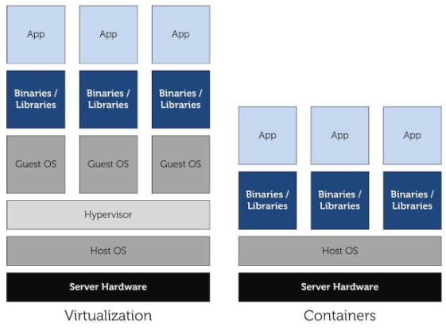

  - Kernel mechanisms to make a container work
    - `cgroups`: manage resources for groups of processes (the os is lying to this group of processes making them think that the machine has a subset of the actual resources)
      - Seen from userspace
        - Low level filesystem interface similar to sysfs and procfs 
        - New filesystem type `cgroup` (default location `/sys/fs/cgroup`)

        

        - You have info about the CPU, the memory amount, devices and in general resources that you can use
      - As managed by the kernel

        
        
        - `css_set`: contains head of the list of `task_struct` defining tasks; in `css_set` we have `cgroup_subsys_state` which defines to which cgroup these tasks appartain (actually the list of capabilities that these tasks have, because the cgroup as "filesystem" is viewed only in user space)
        - Every time we `fork` or `exit` we are also calling functions to mantain this data structure
        - `cgroup_subsys_state` contains also pointer to function implementations that are compliant with the cgroup structure management

          

          - Here we have also pointers (as said previously) to subset of resources that are visuble to this cgroup (`cpuset_subsys`...)
    - `namespaces`: per process resource isolation
      - Seen from userspace: limit the scope of kernel level names and data structures at process granularity
        - Examples
          - `mnt` (`CLONE_NEWNS`): allows different processes to see different incarnations of the filesystem
          - `pid` (`CLONE_NEWPID`): allows different processes to see the same task with a different pid depending on the namespace they are in, or allows a subset of processes to be hidden from the eyes of another subset
          - ...
        - Syscalls for management of namespaces
          - `clone()`: create new process; can specify an existing namespace or create a new one (by default inherit the one of the parent)
          - `unshare()`: create new namespace and attach current process to it
          - `setns(int fd, int nstype)`: join an existing namespace
        - Because in Linux everything is a file also namespaces are identified by a unique inode
          - For each process you can see in which namespace it is living watching at `/proc/<pid>/ns`
            ```
            ╭─myasnik@kitsune in ~
            ╰─❯ 🦊 pidof fish
            815571 815474 766988 766872
            ╭─myasnik@kitsune in ~
            ╰─❯ 🦊 ls /proc/815571/ns/
            lrwxrwxrwx 0 myasnik 29 Nov 15:27 cgroup -> cgroup:[4026531835]
            lrwxrwxrwx 0 myasnik 29 Nov 15:27 ipc -> ipc:[4026531839]
            lrwxrwxrwx 0 myasnik 29 Nov 15:27 mnt -> mnt:[4026531840]
            lrwxrwxrwx 0 myasnik 29 Nov 15:27 net -> net:[4026532008]
            lrwxrwxrwx 0 myasnik 29 Nov 15:27 pid -> pid:[4026531836]
            lrwxrwxrwx 0 myasnik 29 Nov 15:27 pid_for_children -> pid:[4026531836]
            lrwxrwxrwx 0 myasnik 29 Nov 15:27 time -> time:[4026531834]
            lrwxrwxrwx 0 myasnik 29 Nov 15:27 time_for_children -> time:[4026531834]
            lrwxrwxrwx 0 myasnik 29 Nov 15:27 user -> user:[4026531837]
            lrwxrwxrwx 0 myasnik 29 Nov 15:27 uts -> uts:[4026531838]
            ```
      - As managed by kernel
        - For each namespace type a default namespace exists (global namespace); it is inherited by newly created processes
        - `struct nsproxy`: is a data structure that is a collection of namespaces; is shared by all tasks with the same set of namespaces

          

          - For what it concernes user namespace it is kept in another data structure, `cred`
          - If a process clones or forks with a different namespace then a new `struct nsproxy` will be created with the different namespace specified
            - Unchanged namespaces still points to the same data structure, the new to a new one
        - Example: UTS (unix time sharing) namespace, also used to get the hostname of the machine

          

          - Namespace-aware access to hostname: `&current->nsproxy->uts_ns->name->nodename`
        - Example: `net` namespace

          

          - A network device belongs to exactly one namespace
          - A socket belongs to exactly one namespace
          - A new namespace only includes the loop back device
          - Communications between namespaces are handled via veth or unix sockets
        - PIDs and namespaces

          

          - A process has a different pid for each namespace it is in
          - A process refers to other processes with the pid they use in the shared namespace
          - Implemented using `struct pid`: links together pids in the namespace world

            

            - TGID is the actual pid in the local namespace
    - `seccomp`: limit the possible syscalls to be executed to `exit, sigreturn, read and write` (the last two only to already opened file descriptors)
    - `capabilities`: privileges available to processes (like privilege of controlling the network traffic, network ports...)
  - So what are containers?
    - Light form of resource virtualization based on kernel mechanisms
    - A container is a user space construct
    - Multiple containers run on top of the same kernel: illusion that they are the only one using resources
    - Some implementations offer support for filesystem sharing (`bootfs`) and other things
    - Solutions
      - LXC (basic linux containers): userspace process created with the `clone` syscall with their own pid namespace, mnt namespace, net namespace (configurable)
        - There exists templates (can be found in `/usr/share/lxc/templates`
        - Shell scripts to use them: `lxc create -t ubuntu -n containerName`
      - Docker: syntactic sugar on top of linux containers

        

  - Problem with virtualization and containers: you end up executing the same application in more containers/VMs
    - Solution: Kernel Same page Merging
      - COW is used by the kernel to share physical frames with different virtual mappings (like used for deduplication)
      - If the kernel has no knowledge on the usage of memory a similar behaviour is difficult to put in place (for example in containers)
      - KSM exposes the `/dev/ksm` pseudo file
        - By means of `ioctl()` calls, programs can register portions of their address spaces
        - An additional `ioctl()` call enables the page sharing mechanism and the kernel starts looking for pages to share
        - The KSM driver in a kernel thread picks one registered region and starts scanning it
          - A SHA1 hash is used to compare frames
          - If a similarity is found, all processes sharing the page will point to the same frame (in COW mode)

### Security aspects

- User Authentication
  - Performed throug: `init -> getty -> login`, this checks a DB
  - Passwords database is stored within two distinct files
    - `/etc/passwd`: world readable
      - Format: `username:passwd:UID:GID:full_name:directory:shell`
        - First two bytes of the encrypted `passwd` are the salt
        - When using `/etc/shadow` the format is: `username:x:UID:GID:full_name:directory:shell`
          - `x` is a placeholder hence `/etc/passwd` no longer contains passwords
    - `/etc/shadow`: accessible only by root
      - Format: `username:passwd:ult:can:must:note:exp:disab:reserved`
        - `ult`: days from 1/1/1970 since the last password change
        - `can`: day interval after which it is possible to change the password
        - `must`: day interval after which the password must be changed
        - `Note`: day interval after which the user is prompted for password update
        - `exp`: days after which the account is disabled if password expires
        - `disab`: days from 1/1/1970 after which the account will be disabled
        - `reserved`: no usage, reserved field
- User IDs in Unix
  - UID: user id
  - GID: group id
  - Any process is at any time instant associated with three different UIDs/GIDs
    - Real: this tells who you are
    - Effective: this tells what you can actually do (you could become a different user)
    - Saved: this tells who you can become again (come back like)
  - UID/GID management system calls
    - `setuid()/seteuid()`: available only to UID/EUID equal to `0` (root), used basically to deprivilege some process
      - `setuid()` is non reversible in the value of the saved UID: it overwrites all the three userd ID 
        - Example usage
        
          

      - `seteuid()` is reversible and does not prevent restoring a saved UID
      - An EUID root user can temporarily become a different EUID user and then resume EUID root identity
      - UID and EUID values are not forced to correspond to those registered in `/etc/passwd`
    - `getuid()/geteuid()`: queries available to all users
    - Similar services exist for managing GID
- `su` and `sudo`
  - Both these commands are `setuid-root` (they enable starting with the EUID root identity)
  - If a correct input password is given by the user they move the real UID to root or the target user (in case of `su`)
  - After moving the UID to root `sudo` executes the target command
- Address based Service Enabling
  - Based on the concept of Access Control List ACL
  - Addresses (IPs) of enabled users are explicitly specified
  - Users whitelisted are able to use specific capabilities on the system
    - Capabilities can be set with granularity of a single user
  - It is useful for services exposed on a network
  - An approach used in architectures such as
    - Super servers (`inetd`, the internet daemon, `xinetd`, the extended internet demon)
      - `inted`: controls services running on specific port numbers
        - Upon connection or request arrival it starts the actual target service and redirects sockets to `stdout, stdin, stderr`
        - Association between port number and actual service has been based on the file `/etc/services` with format:
          ```
          ftp-data 20/tcp
          ftp      21/tcp
          telnet   23/tcp
          ```
        - Configurations (`/etc/inetd.conf`)
          - Each managed service is associated with one line structure which contains
            - Service name, as expressed in `/etc/services`
            - Socket type
            - Socket protocol
            - Service flag (wait/nowait) which determines the execution mode (concurrent or not)
            - The userid to be associated with the running service instance
            - The executable file path and its arguments (if any)
      - `xinetd`: extended `inetd`
        - Adds
          - Address based access control
          - Time frame based access control (a user can access resources in a certain window of time)
          - Full log of run time events
          - DOS prevention by putting limitation on
            - Maximum number of per service instances
            - Maximum number of total server instances
            - Log file size
            - Per machine source connections
        - Configuration file: `/etc/xinetd.conf`
    - TCP containers/daemons (`tcpd`): wraps the services managed via `inetd` so as to support access control rules
      - Is the actual server that is activated upon a request accepted by `inetd`
      - Receives as input the service specification
      - Service management takes place by relying on rules coded in `/etc/hosts.deny` and `/etchosts.allow`: here we can find the specification of allowed or denied sources for a given service
        - Each line is structured as: `daemon_list : client_list`
        - `ALL` is used to identify the whole set of managed services and all the hosts
        - Example: access to all `inetd` services allowed from the local host
          ```
          # /etc/hosts.allow
          ALL: 127.0.0.1
          ```
      - Implements mitigations for Reverse DNS tampering
        - Reverse DNS tampering
          - Host/domain specification occurs via symbolic names rather than IP addresses
          - Upon receiving a request/connection, `tcpd` checks the source IP and executes a reverse DNS (rDNS) query to get the symbolic name of the source host
          - An attacker can tamper with the reverse DNS query so as to reply with an allowed host/domain name
          - To cope with this attack `tcpd` typically performs both forwards DNS and reverse DNS queries so as to determine whether there is matching

          

          - Why the attacker can't fake also the forward DNS query?
            - DNS is defined in zones
            - The owner of a zone maps different addresses to different domain names in their zone
            - Writing www.example.com accesses the example.com zone, and associates via an A (alias) record the hostname www to a certain IP
            - rDNS is based on the PTR record
            - A PTR record is stored in a special zone called .in-addr.arpa; this is adminstrated by whoever owns the block of IP addresses (ISP)
  - Used since ext3 FileSystem (define write/read capabilities with user granularity)
- Secure operating systems
  - In normal OSs if you are root you can do everything
  - A secure operating system is different from a conventional one because of the different granularity according to which we can specify resource access rules
    - In these systems the administrator could not have full access to the machine and users have single capabilities based on what they have to do
  - Examples
    - SELinux (by NSA)
    - SecurLinux (by HP)
  - Policies
    - Types
      - Discretionary if ordinary users including the administrator are involved in the definition of security attributed (can choose if enforcing the policy or not)
      - Mandatory if its logics and the actual definition of security attributes is demanded to a security policies administrator (who is not an actual user/root of the system) and you have to enforce it mandatory
- Boot time attacks
  - Startup rootkits
  - Replacing systemd services with malicious ones
  - Horse pills: takes place in the init ram disk phase
    - Based on init scripts (you can introduce a backdoor) loaded into a ram disk and the usage of namespaces (you could hide an entire portion of the machine)
    - An infected ram disk can easily take control of the machine
      - What it does
        1. Load modules
        2. Init crypto subsystem
        3. Find and mount rootfs
        4. Enumerate kernel threads
        5. `clone(CLONE_NEWPID, CLONE_NEWNS)` (clone the init thread)
          - In the newly spawned fake init in a different namespace it
            - Remounts `/proc`
            - Make fake kernel threads
            - Cleanup `initrd`
            - exec original `init`
          - So the os will go along with its execution and won't see the evil process because the actual OS is in a newly created namespace who can't see the global namespace in which the evil process is working
        6. (We are in the global namespace) Remount root
        7. Mount scratch space
        8. Fork -> backdoor shell
        9. `waitpid()` for the real OS
        10. Shutdown/reboot
      - Why it is possible
        - ram disk is created in our os when we update the system using init scripts
        - If these init scripts are compromised then the ram disk will be compromised
- Userspace System Internal Attacks: exploits an application that is installed and or active in the system
  - Attacker: can be an external user or one registered as a legitimate system user
  - Attacks
    - Trojan horses: installed by user, let an external user use the resources of the OS 
    - Login spoofing: example is replacing the login program with a malicious one that steals credentials
    - Logical bombs: normal app that after some time starts behaving maliciously (conquer the trust of the user)
    - Backdoors: expose to the network a service (ex: shell)
    - Buffer overflows
      - Countermeasures
        - Stack randomization (upon `exec()` calls), ASLR
        - Canary random tags as crosschecks in the stack before returning

          

        - Non Executable Address Space Regions (against shellcode injection)
          - x86_64 architectures provide page/region protection (`XD` flag in the entries of the page tables)
          - This is one reason why the `PROT_READ/PROT_EXEC` flags of `mmap()` are sometimes collapsed into the same protection semantic
          - To enable instruction fetch from the stack you can use the `-z execstack` option of gcc
    - Ping of Death (causes kernel panic): based on an inconsistency within the IP protocol in common kernels
      - IPv4 forbids a packet to be larger than 64 Kb
      - IP allows for packet fragmentation with reconstruction at the destination
      - So fragmented packets reconstructed could be larger than 64 Kb
      - In this case the operating system kernel writes the fragment out of the boundaries of the actual buffer selected for the receipt
- Intrusion detection systems (IDS)
  - Systems able to detect that something wrong is going on
  - Allows for Designing countermeasures for new attacks and to protect resources in case of an ongoing attack
  - Paradigms
    - Anomaly Detection: attacks are anomalous (infrequent) hence any anomalous event is assumed to represent an attack
    - Misuse Detection: a priori identification of attack events which are registered into the IDS; a true attack cannot be identified as such in case it is not coded in the a priori knowledge base
  - Types
    - Honeypots
    - File integrity checkers
    - Log checkers (SIEM, no realtime)
    - Network intrusion detection systems
- Intrusion Prevention System: the Reference Monitor

  

### Hot patching

- Allows the change of the kernel code while the kernel is running
- Why: huge costs of downtime -> reduce the downtime not rebooting thesystem but hot-patching it
- Why reboot is a problem
  - Disruption to users applications
  - Sys admins don't always have control of users or applications (cloud environments)
  - Re-architecting can be expensive or impractical
- Windows hot patching (Windows server 2003 SP1)
  - Stops Kernel execution for activeness check (check if functions used are the ones that have to be patched)
    - When hot patching doesn't affect currently used function, use short jumps patched into functions for redirection to the new installed function
    - Removed in Windows 8 and later (not used, very hard to create hot patches)
- Linux kpatch (2014)
  - Steps
    1. Build the patch module (`kpatch-build foo.patch`)
       - Harder than patching the kernel
       - How to
         1. Compile kernel with and without patch
         2. Compare binaries, detect which functions have changed
         3. Extract object code of changed functions into patch module
    2. Apply the patch (`kpatch load kpatch-foo.ko`)
       1. Load new functions into memory
       2. Link new functions into kernel
       3. Activeness safety check (prevent old and new functions from running at same time)
          - `stop_machine()` + stack backtrace checks
            - Stops execution threads and check using their backtrace if they are executing functions that have to be patched
            - If they are, kernel patch fails and you have to retry, else it goes well
       4. Patch it (uses `ftrace`)
          - `ftrace`: provides a generic framework for tracing, you can trace the execution of a function at its entry and exit points (usually used to check how long a function takes to finish)

            

            - The enrypoint of each kernel level function contains a jump to the next instruction of the kernel level function
            - So every kernel level function has some "space" in its beginning that let us redirect it to a different execution flow
            - `ftrace` patches this jump instruction (this "space") making it point to `mcount` module which tells how many times the target function has been called
            - `mcount` will also deal with a entry tracer function (you can register tracer function) every time you call the target function
            - This mechanism let us edit the stack of the target kernel function adding a ret addr; this is used to call at the end of the target function the exit tracer
            - The exit tracer (when it finishes its execution) will restore the correct return address and return to the caller
          - Patching with `ftrace`

            

## Notes

- Pellegrini's lessons
  - Interesting practical explanation in lesson `AOSV-2020-04-15_Messaging_Code_ok.mkv` min `30m:42s`
  - Interesting explanation connected to scheduling, synchronization and rootkits in lesson `AOSV-2020-04-17_ok.mkv` min `23m:00s`
  - Interesting explanation connected to scheduling, synchronization and rootkits in lesson `AOSV-2020-04-22_ok.mkv` until min `39m`
  - Device creation explanation in `AOSV-2020-05-15.mkv` min `1h:30m`

## Lab

- Material
  - Pellegrini's drive: https://drive.google.com/drive/folders/1pgg-WN6v2tEagt9V6o81N4Unmbwg3vv_
  - Gabriele Proietti Mattia's examples: https://github.com/myasn1k/aosv-code-examples

### Build kernel

- Useful videos
  - https://www.youtube.com/watch?v=E4yRcmQqvWM
  - https://www.youtube.com/watch?v=APQY0wUbBow
- Machine: Ubuntu 20
- Packages needed
  - `build-essential`
  - `libncurses-dev`
  - `flex`
  - `bison`
  - `libelf-dev`
  - `libssl-dev`
  - `dwarves`
- For building the kernel you need
  1. To generate or use an already available `.config` file: `make menuconfig`
  2. To build the kernel itself and the modules (comprehends also drivers): `make -j <number of cores>`
  3. Copy compiled modules in `/lib/modules/<version>`: `make modules_install`
  4. To generate an `initramfs`
  5. To put the generated binaries and images in the `/boot` folder: `sudo make install`
  6. To update the GRUB boot options: `grub-mkconfig -o /boot/grub/grub.cfg`
- `initramfs`
  - The image may be a CPIO archive (optionally compressed)
  - The archive is unpacked by the kernel into a special instance of a `tmpfs` that becomes the initial root file system
  - The kernel executes `/init` as its first process (this is not expected to exit)
- `init`
  - The init file in the root of the `initramfs` is a script for the `/bin/sh` interpreter that contains all the necessary instructions for initializing the true root filesystem by also parsing the kernel cmdline, namely the arguments passed by `GRUB` when launching the kernel
  - In the end the script calls `exec` command by passing the program `run-init`: `exec run-init ${drop_caps} "${rootmnt}" "${init}" "$@" <"${rootmnt}/dev/console" >"${rootmnt}/dev/console" 2>&1`
    1. Delete all files in the `initramfs`
    2. Remounts `/real-root` onto the root filesystem
    3. Drops comma-separated list of capabilities
    4. Chroots
    5. Opens `/dev/console`
    6. Spawns the specified init program (with arguments)
- Build files
  - The kernel Makefile is split in 5 parts
    - `Makefile`: the top Makefile
    - `.config`: the kernel configuration file, stores each config symbol's selected value
      - You can edit this file manually or use one of the many make configuration targets, such as `menuconfig` and `xconfig`, that call specialized programs to build a tree-like menu and automatically update (and create) the `.config` file for you by reading `KConfig` files
      - `KConfig` file example

        

    - `arch/$(SRCARCH)/Makefile`: the arch Makefile
    - `scripts/Makefile.*`: common rules etc. for all kbuild Makefiles
    - `kbuild Makefiles`: exist in every subdirectory and instruct how to build subsystems
      - A `KBuild` file can be named `KBuild` or just `Makefile`
      - Define the files to be built, any special compilation options, and any subdirectories to be entered recursivel 
      - `KBuild` file example

        

- Kernel linking
  - Kbuild compiles all the `$(obj-y)` files
  - It then calls `$(AR) rcSTP` to merge these files into one `built-in.a` file; this is a thin archive without a symbol table, it will be later linked into `vmlinux` by `scripts/link-vmlinux.sh`
  - The order of files in `$(obj-y)` is significant
    - Duplicates in the lists are allowed: the first instance will be linked into `built-in.a` and succeeding instances will be ignored
  - Link order is significant, because certain functions (`module_init() / __initcall`) will be called during boot in the order they appear
- Kernel symbols table
  - There are two ways for the kernel of maintaining the symbols table (mapping between symbols and virtual memory locations)
    - `System.map` is a file generated during linking time and contains only static symbols that regards steady-state Kernel functions and kernel data structures
      - Symbols are associated with storage class
        - `T`: global (non-static but not necessarily exported) function
        - `t`: a function local to the compilation unit (i.e. static)
        - `D`: global data
        - `d`: data local to the compilation unit
        - `R/r`: same as `D/d`, but for read-only data
        - `B/b`: uninitialized data section (`.bss`)
      - Example

        

    - `kallsyms` (`/proc/kallsyms`) is a specific subsystem that maintains a list of the kernel symbols table that are both deriving from static code, namely the ones that are extracted during the kernel linking phase, as well as run-time ones, for example given by loaded modules

### ASM in C

- Structure

  

  - Output Operands: comma separated list of inputs (e.g. `=r` (old), `+rm` (*Base))
  - Input Operands: comma separated list of output (e.g. `r` (Offset)
  - Clobbers: comma separated list of registers or other elements that have been changed by the execution of the instructions
- Legend
  - Operands
    - `m`: a memory operand
    - `o`: a memory operand which is "offsettable" (to deal with instructions' size)
    - `r`: a general-purpose register
    - `g`: Register, memory or immediate, except for non-general purpose registers
    - `i`: an immediate operand
  - Registers
    - `0, 1, … 9`: a previously referenced register
    - `q`: any "byte-addressable" register
    - `Q` any “high” 8-bit addressable sub-register
    - `+`: the register is both read and written
    - `=`: the register is written
    - `a, b, c, d, S, D`: registers `A, B, C, D, SI, and DI`
    - `A`: registers `A and D` (for instructions using `AX:DX` as output)
- Examples: https://github.com/myasn1k/aosv-code-examples/tree/main/00-asm-in-c

### Kernel modules

- Loadable Kernel Module (LKM): software component which can be added to the memory image of the Kernel while it is already running
  - Sample basic kernel module

    ```c
    // module.c
    MODULE_LICENSE("GPL");
    MODULE_AUTHOR("Author <me@example.com>");
    MODULE_DESCRIPTION("My Fancy Module");
    module_init(my_module_init);
    module_exit(my_module_cleanup);
    ```
- Reference Counters
  - The Kernel keeps a reference counter for each loaded LKM
  - If the reference counter is greater than zero, then the module is locked (this means that there are other services in the system which rely on facilities exposed by the module so, if not forced, unloading of the module fails)
  - `lsmod`: gives also information on who is using the module
  - APIs
    - `try_module_get()`: try to increment the reference counter
    - `module_put()`: decrement the reference counter
    - `CONFIG_MODULE_UNLOAD` symbol: global macro which allows the kernel to unload modules (can be used to check unloadability)
- Module Parameters
  - Parameters can be passed to modules but they are not like function parameters, they are initialized as global variables declared in source code of the module
  - For declaring a parameter you can use the following macros
    - `module_param(variable, type, perm)`
    - `module_param_array(name, type, num, perm)`
  - These macros specify the name of the global variable which "receives" the input, its type, and its permission (when mapped to a pseudofile, pseudo-files for parameters are located in `/sys`)
    - Permissions
      - Refers to the permission bits of the GNU C library
      - List
        - `S_IRUSR, S_IREAD`: read permission bit for the owner of the file
        - `S_IWUSR, S_IWRITE`: write permission bit for the owner of the file
        - `S_IXUSR, S_IEXEC`: execute (for ordinary files) or search (for directories) permission bit for the owner of the file
        - `S_IRWXU`: equivalent to `(S_IRUSR | S_IWUSR | S_IXUSR)`
        - `S_IRGRP`: read permission bit for the group owner of the file
        - `S_IWGRP`: write permission bit for the group owner of the file
        - `S_IXGRP`: execute or search permission bit for the group owner of the file
        - `S_IRWXG`: equivalent to `(S_IRGRP | S_IWGRP | S_IXGRP)`
        - `S_IROTH`: read permission bit for other users
        - `S_IWOTH`: write permission bit for other users
        - `S_IXOTH`: execute or search permission bit for other users
        - `S_IRWXO`: equivalent to `(S_IROTH | S_IWOTH | S_IXOTH)`
        - `S_ISUID`: set-user-ID on execute bit
        - `S_ISGID`: set-group-ID on execute bit
- Building a module
  - For building a module you need the source of the kernel to be present in the folder pointed by `/lib/modules/$(uname -r)/build`
  - Typical makefile
    ```make
    KDIR = /lib/modules/$(shell uname -r)/build
    obj-m += hello.o
    
    all:
      make -C $(KDIR) M=$(PWD) modules
    clean:
      make -C $(KDIR) M=$(PWD) clean
    ```
- Loading and unloading a module
  - Loading: `insmod` takes as a parameter the path to the object file generated when compiling the module
  - Unloadeing `rmmod`
  - We can also use `modprobe`, which by default looks for the actual module in the directory `/lib/modules/$(uname –r)`
  - APIs
    - `int init_module(void* module_image, unsigned long len, const char *param_values);`: loads an ELF image into kernel space, performs any necessary symbol relocations, initializes module parameters to values provided by the caller, and then runs the module's init function (privileged)
      - `module_image`: points to a buffer containing the binary image to be loaded
      - `len`: size of that buffer
    - `int finit_module(int fd, const char *param_values, int flags);`
    - `int delete_module(const char *name, int flags);`
- `/sys/module`
  - `/sys/module/MODULENAME`: name of the module that is in the kernel
  - `/sys/module/MODULENAME/parameters`: directory contains individual files that are each individual parameters of the module that are able to be changed at runtime
  - `/sys/module/MODULENAME/refcnt`: if the module is able to be unloaded from the kernel, this file will contain the current reference count of the module (if `CONFIG_MODULE_UNLOAD` kernel configuration value is not enabled, this file will not be present)
- `printk`: kernel `printf`, output can be seen using `dmesg`
  - Log levels

    

### Kernel debugging

- The Magic SysRq
  - Mechanism according to which you can communicate with the kernel, even if it is frozen by mean of particular keystrokes (must be manually enabled in your kernel)
    - Can enable it permanently, by marking Magic System Request (SysRq) keys under “Kernel Hacking” (`CONFIG_MAGIC_SYSRQ`) menu of Kernel Configuration, when compiling the kernel with `make menuconfig`
    - Can enable it temporarily, by using `echo 1 > /proc/sys/kernel/sysrq`
    - Can enable it at boot by modifying `/etc/sysctl.conf` and adding a line like `kernel.sysrq=1` (then `sysctl -p`)
  - The number that you specify represents the features that you want to enable, 1 stands for all the features
  - Called by using the key sequence, in order `Alt + SysRq + <character>`; by default, the SysRq button is `Print Screen` (you can remap it to the Windows key for example, you can see the key sequence with command sudo showkey -s`
  - Windows key is `0xe0 0x5b` so you can associate it to SysRq by using the command `sudo setkeycodes e05b 99` (must run every time you reboot the machine)
  - Features
    - `b`: immediately reboot the system without syncing or unmounting your disks
    - `c`: perform a system crash by a NULL pointer dereference (crashdump will be taken if configured)
    - `d`: shows all locks that are held
    - `e`: send a `SIGTERM` to all processes, except for `init`
    - `f`: call the oom killer to kill a memory hog process, but do not panic if nothing can be killed
    - `g`: used by kernel debugger
    - `h`: display help (actually any other key than those listed here will display help
    - `i`: send a `SIGKILL` to all processes, except for `init`
    - `j`: filesystems frozen by the `FIFREEZE` ioctl
    - `k`: secure Access Key (SAK) Kills all programs on the current virtual console
    - `l`: shows a stack backtrace for all active CPUs
    - `m`: dump current memory info to your console
    - `n`: make real time tasks nice-able
    - `o`: shut your system off (if configured and supported)
    - `p`: dump the current registers and flags to your console
    - `q`: dump per CPU lists of all armed hrtimers (but NOT regular `timer_list` timers) and detailed information about all clockevent devices
    - `r`: turns off keyboard raw mode and sets it to XLATE
    - `s`: attempt to sync all mounted filesystems
    - `t`: dump a list of current tasks and their information to your console
    - `u`: attempt to remount all mounted filesystems read-only
    - `v`: forcefully restores framebuffer console
    - `v`: causes ETM buffer dump [ARM-specific]
    - `w`: dumps tasks that are in uninterruptable (blocked) state
    - `z`: dump the `ftrace` buffer
    - `0-9`: sets the console log level, controlling which kernel messages will be printed to your console
- Dumping memory
  - `sudo apt install linux-crashdump` and reboot
  - `c` with SysRq: dump the memory and reboot (reports are in `/var/crash`, you can analyze them with the utility `crash`)
    - For using `crash` you need the decompressed kernel image, aka `vmlinux` (for debugging, the kernel must be compiled with `CONFIG_DEBUG_INFO=y`)

### Kprobes

- Kernel Exported Symbols
  - Symbols from the Kernel or from modules can be exported; an exported symbol can be referenced by other modules
  - If a module references a symbol which is not exported, then loading the module will fail
  - API: `EXPORT_SYMBOL(symbol)`
    - This must be configured
      - `CONFIG_KALLSYMS = y`
      - `CONFIG_KALLSYMS_ALL = y` (include all symbols)
  - Exported symbols are placed in the `__ksymtab` section
- Kprobes: support for dynamic tracing in the Kernel
  - Suppose that you want to track the execution of a function (=symbol)
  - You can register a pre and post function handlers by registering a kprobe with: `int register_kprobe(struct kprobe *p)`
    - `struct kprobe`: specifies where the probe is to be inserted and what `pre_` and `post_` handlers are to be called when the probe is hit
      - `typedef int(*kprobe_pre_handler_t)(struct kprobe *, struct pt_regs *)`
  - Unregister: `unregister_kprobe(struct kprobe *p)`
  - Kprobes must be enabled (usually they are) with: `CONFIG_KPROBES=y` and `CONFIG_KALLSYMS=y` or `CONFIG_KALLSYMS_ALL=y`
  - How it works
    1. When a kprobe is registered, Kprobes makes a copy of the probed instruction and replaces the first byte(s) of the probed instruction with a breakpoint instruction (`int3` on i386 and x86_64)
    2. When a CPU hits the breakpoint instruction, a trap occurs, the CPU’s registers are saved, and control passes to Kprobes via the `notifier_call_chain` mechanism
    3. Kprobes executes the “pre_handler” associated with the kprobe, passing the handler the addresses of the kprobe struct and the saved registers
    4. Kprobes single-steps its copy of the probed instruction, then executes the “post_handler,” if any, that is associated with the kprobe; execution then continues with the instruction following the probepoint
    - When the debugger sets the trap flag, this causes the processor to automatically execute an `int 1` interrupt after every instruction; this allows the debugger to single-step by instructions, without having to insert an `int 3` instruction
- Return kprobes: differently from a standard Kprobe only replaces the return address of a symbol in order to execute a custom function
  - How it works
    1. When you call `register_kretprobe()`, Kprobes establishes a kprobe at the entry to the function
    2. When the probed function is called and this probe is hit, Kprobes saves a copy of the return address, and replaces the return address with the address of a “trampoline” (arbitrary piece of code, typically just a nop instruction); at boot time, Kprobes registers a kprobe at the trampoline
    3. When the probed function executes its return instruction, control passes to the trampoline and that probe is hit
    4. Kprobes’ trampoline handler calls the user-specified return handler associated with the kretprobe, then sets the saved instruction pointer to the saved return address, and that’s where execution resumes upon return from the trap
- Limitations
  - Registered kprobes are visible under the `/sys/kernel/debug/kprobes/` directory
  - When registered, probes are saved in a hash table hashed by the address of the probe (protected by `kprobe_lock`)
  - Kprobes cannot probe itself, it uses a blacklist to prevent recursive traps
  - Probe handlers are run with preemption disabled
  - Depending on the architecture and optimization state, handlers may also run with interrupts disabled (not on x86/x86-64)
- Example
  ```c
  // Get a kernel probe to access flush_tlb_all
  memset(&kp, 0, sizeof(kp));
  kp.symbol_name = "flush_tlb_all";
  if (!register_kprobe(&kp)) {
    flush_tlb_all_lookup = (void*)kp.addr;
    unregister_kprobe(&kp);
  }
  ```
