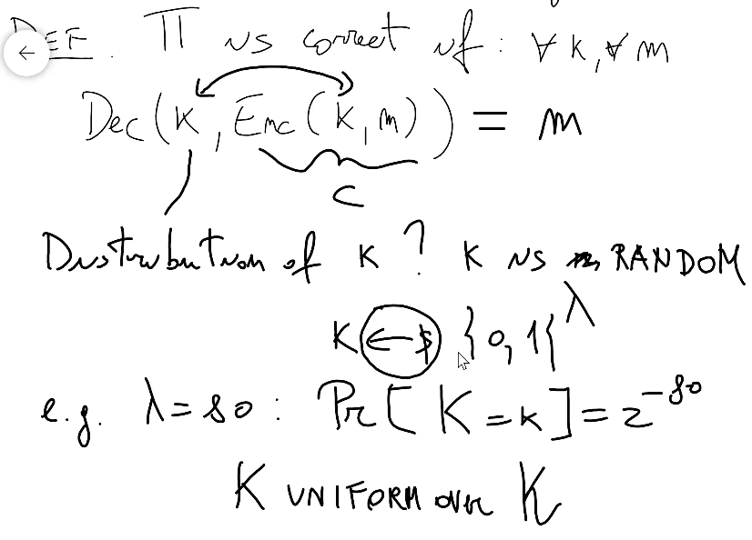
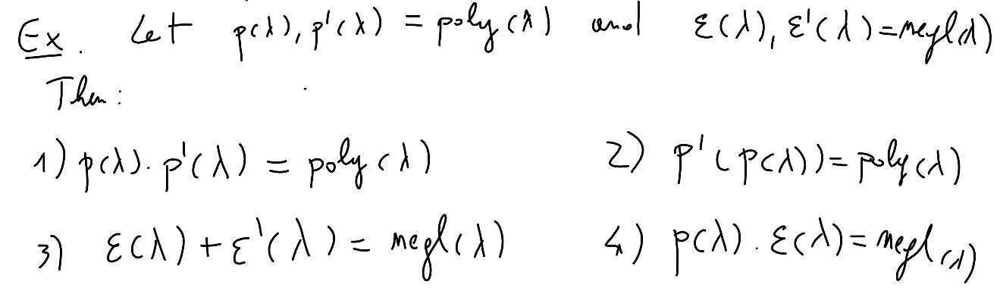

# Crypto

[[_TOC_]]

## Theory

### Information-Theoretic Cryptography

#### Perfect secrecy, one-time pad, Shannon's theorem

- Properties of a message to be secure

  

- Approaches to solve these two points
  - Symmetric crypto
    - Algorithms should be public!
    
      

    - Secret key crypto

      

      

      - Why the `$` means random? Because sometimes in algorithms the randomness is called "coins"
      - Every key is chosen with the same probability (uniform distribution)
      - **Perfect secrecy by Shannon**
        - Definition 

          

          - Notes
            - `M` is the distribution of the message, for example if i speak english the message will be in english so its distribution will be different from a message in italian
            - `calligraphic M` is all possible messages (the messages space)
          - Even knowing the ciphertext the probability of choice of the message is still the same, in other words ciphertext reveals nothing about plaintext
          - This is impractical 
        - Theorem: following definitions of perfect secrecy are equivalent

          

        - Proofs
          
          

          - So `m` and `c` are independent (product)

          

          

          

          

          

          

        - Application: One-time pad (uses xor)

          

          - Theorem: one-time pad is perfectly secret
          - Proof (using definition 3)

            

          - Limitations

            

            - These holds for all perfectly secret algorithms!
          - Theorem

            

          - Proof

            

            

            - This because `m` is outside `M'` and this contains all possible decryptions of `C`

#### Message authentication in perfect secrecy (perfect authentication)

- The strange symbol is the authenticator of the message

- Definition (information-theoretic MAC)

  

  

- Definition: construction for pairwise independent hashing

  

- Theorem

  

- Proof

  

  

- Construction

  

  

  

#### Randomness extraction

- Randomness crucial in crypto
  - Generate uniform keys
  - Most crypto algorithms are randomized (non deterministic)
- How do we generate good randomness?
  - From physical processes (not truly random)
- How to turn a "somewhat random" source intro truly random sources?
  - Definition: von Neumann extractor

    

    

    

    

    - `2p(1-p)` because is either `b1=1 and b2=0 or b1=0 and b2=1`
    - In practice physical processes produce X which is unpredictable
  - Definition: minimum entropy

    

    - Intuition rephrased: measures the amount of unpredictability in X (how much X is random)
    - Examples

      

      - Constant means that outputs always the same thing (for example in this case always 0)

      

  - Real life: this request is IMPOSSIBLE :(

    

    

    - Maximizes this shit in the sense that "find the group with more entries"

    

    

  - Definition: seeded extractor (seed can be public)

    

    - SD (statistical distance): distance between two distributions
    - More or less uniform: an attacker can't distinghuish the seeded extractor distribution and an uniform distribution (statistical distance is small)

#### Leftover hash lemma

- Theorem

  

- Lemma

  

  - Col: collision probability
- Proof (theorem)

  

  

  

  

- Proof (lemma)

  

  

  

  - Product between vectors = inner product

  

  

  

- From now on we will consider that randomness will come for free!

### Computational Security

- Statistical security comes with some inherent limitations
  - "Tiny" probability of security breach
  - Adversary must be "efficient"
- Approaches
  - Concrete security: build cryptosystems such that no adversaries running in time t (t steps) can break security with probability better than epsilon (ex: `2^-80`)
  - Asymptotic security

    

    - In other words polynomial is used to say that there exist a polynomial that is the upper bound of a defined function

    

    - Negligible if always upperbounded by `1/p(lambda)` (every inverse polynomial)

    

    - What if instead A is wrong with probability `1/k = 1/lambda` (where `k` is input size) but you don't know if the output is correct? Only way is to talk large `k = lambda`, `lambda = k = 2^80`
    - By above observation, our approach:
      - Efficient = polynomial
      - Error only with negligible probability

      

      - PPT: a turing machine A is a PPT if its worst case running time is polynomial (in input length) 

      

      - Note

      

- From now on our definitions and problems will be based on known "hard problems"; so that if we base our assumptions to build a crypto system on hard problems then until these hard problems are unresolved our crypto system is secure

#### One-way function

- Definition

  

  

  - Game based on the length

  

  

## Exercises

- Lesson 1
  - Text
    - Define two time secure encryption
    - Prove one-time pad is not two time secure
  - Solution
- Lesson 3
  - Text

    

    

  - Solution
- Lesson 4
  - Exercise 1
    - Text

      
    - Solution
  - Exercise 2
    - Text

      

    - Solution