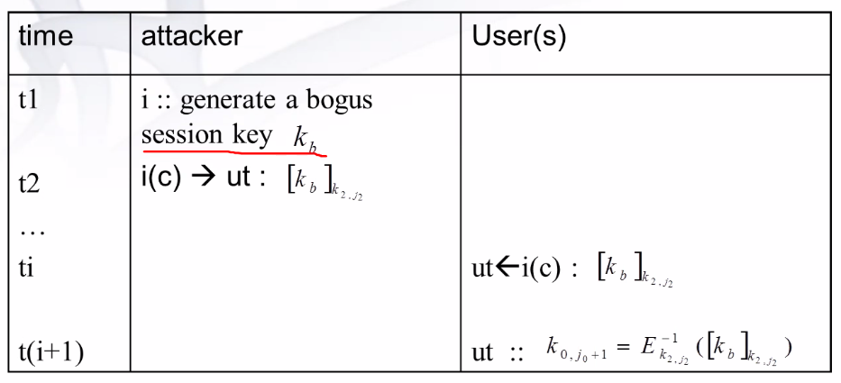
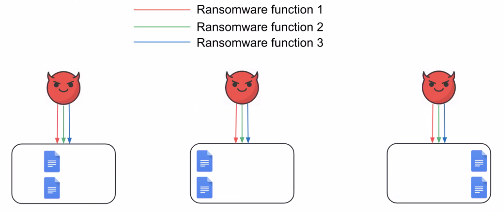
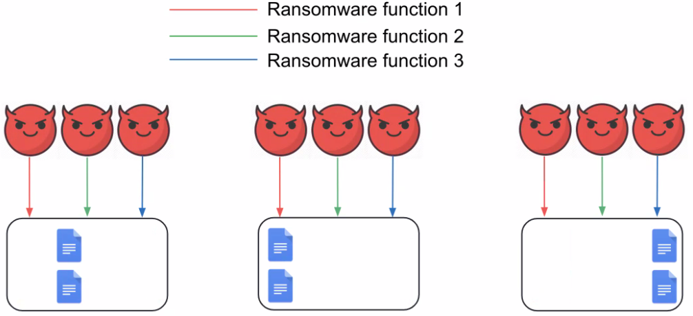

# Data and Network Security

[[_TOC_]]

## Theory

### Introduction to operating system security and malware

- Security:
  - Confidentiality: data can be _accessed_ only by authorized users
  - Integrity: data can be _modified_ only by authorized users
  - Availability: data is _available_ to authorized users
- Malware: program that is inserted into a system, usually covertly, with the intent of compromising the confidentiality, integrity or availability of the victim's data, applications, or OS, or of otherwise annoying or disrupting the victim
  - Uses
    - Steal personal information
    - Delete/encrypt files (ransomware)
    - Click fraud (auto trigger clicks on defined ads)
    - Bank fraud (phishing, 2fa bypass malware)
    - Make your computer available to the attacker (botnet)
    - ...
  - Categories
    - Virus: a program that can infect other programs by modifying them to include a, possibly evolved, version of itself; _it's like a parasite so it can't exist alone_
      - Behavior: usually viruses try to embed themselves into other (multiple) executables; they get a random file and check if they already infected this file (using like a string), if not they embed themselves in the file
        - To avoid being catch by antivirus polymorphic and metamorphic behavior is adopted
      - Types
        - Polymorphic: infect files with an encrypted copy of itself, decoded by a decryption module
        - Metamorphic: change the virus body after each infection using obfuscation techniques
    - Worm: program that can run _independently_ and can propagate a fully working version of itself _to other machines_
    - Trojan horse: program that perform a desirable function but in fact performs also undisclosed malicious functions that allow unauthorized access to the victim computer
    - Rootkit
      - How it works

          

          - A system call (function called in user space that works in kernel space) when is called looks at the system call jump table to know where to jump to execute the system call
          - When a (kernel) rootkit is working the system does this but with an additional evil step (figure)
      - Types
        - Persistent: stored on disk, runs at boot
        - Memory-based: reboot kills the rootkit
        - User-mode: intercept OS syscalls and modify the behavior
          - Usually is done redefining/patching system libraries or creating a "MITM" library that is the rootkit (U_R in this case)

              

          - Pro and cons
            - Pro: no need for root
            - Cons: detectable
          - To detect this the admin writes down a special process that compares replies of direct call of a system call and "indirect" call of a system call through libraries; if they mismatch then a rootkit is working

              

        - Kernel-mode: most powerful, intercept OS syscalls and has maximum privileges
          - Hard to install because the attacker must be root
    - Backdoor: program embedded in another (or standalone) that bypass normal authentication and opens a "backdoor" where an unprivileged user could send command/exchange information
      - Basic: open a port on the machine with a shell spawned
      - Reverse: open a connection to the attacker with a shell (bypass firewall)
      - Covert: like basic ones but use some strange protocol to send commands (like ICMP)
      - Rendez vous

          

    - Adware: automatically renders advertisements in order to generate revenue for its author
      - Related to clickjacking: malware clicks on ads links
    - Spyware
    - Zombie/Botnet: a zombie is a compromised computer connected to the internet and remotely controlled, a botnet is a set of zombies controlled by the same entity

        

        - Zombies are controlled through IRC; now also through P2P (send a command to a zombie that relays it to the others)
        - Used for spam email, DDOS, click frauds, phishing website host, information stealing
        - [Exploit kit](https://en.wikipedia.org/wiki/Exploit_kit): kits to create botnets
        - Botnets could be rent
  - Characteristics
    - Attack vectors
      - Mail
      - Websites
      - Social engineering: lure a user into deliberately execute malicious code
      - Vulnerable services: exposed out of date services or with weak passwords
        - An attacker could dump password hashes files and attempt to crack them through dictionary attack
          - Hashes file in windows: `SAM`
          - Hashes file in linux: `/etc/shadow`
      - Drive-by-download: comes with another legitimate software, usually also social engineering is used
    - Persistence mechanisms
      - Registry keys
      - Filesystem
      - Task scheduler
      - Inside the firmware
    - Hiding mechanisms
      - Hidden files
      - Alternate data stream (more or less like steganography, only for windows)
        - For a file in windows there could be multiple data streams (for a file there could be more files)
      - Plausible registry keys or filenames
      - Inside drivers and DLLs
      - Encryption
    - Communication
      - Command and control (C&C)
      - Encryption
      - Steganography
      - Covert channels (like through ICMP, DNS...)
  - Lifecycle
    - Initial reconnaissance: profile the victim organization and gain information from the outside
    - Penetration: attack using information found
    - Gaining a foothold: persistence
    - Appropriating privileges: get privileges and escalate
    - Internal reconnaissance: profile the victim organization and gain information from the inside
    - Maintain presence: more or less like lateral movement
    - Exfiltration: exfiltrate information
    - Mission accomplished
  - Countermeasures
    - Signature-based antivirus scanners: match a pre-generated set of signatures (sequences of bytes that univocally identify a malware) against files 
      - Drawbacks
        - Does not detect unknown threats for which no signatures exist
        - Signatures created by analysts, so not immediately public
        - Does not detect malware created for a specific scope
    - Misuse detection: detect abnormal behavior (behavior that vary from usual)
      - Potentially high false-positives
      - Also through artificial intelligence
  - Malware analysis
    - Phases
      - Triage: the analyst looks at the malware to quickly understand what the malware does (more or less)
      - Race: analysts vs attackers, attackers want not to make their malware be understood, analysts try to understand malwares
    - Analysis
      - Static: analyze software without executing it
        - Call graphs: software for malware graph analysis
      - Dynamic: actions performed by a program while it is being executed
        - Methods
          - Function call monitoring: intercept what syscalls (or Windows/Native API functions) are being executed by the malware, this is called hooking
            - Hooking API functions allow to monitor the behavior of a program
            - Malware working in kernel mode may bypass those checks
          - Function parameter analysis
          - Information flow tracking 

### Buffer overflow

- Subverting process: processes can be forced to execute instructions beyond its legal scope
  - Made possible by the lack of run-time bounds checking
  - Could lead to administrator control
- Buffer overflow: stuffing more data into a buffer than it can handle
  ```c
  void function(char *str) {
    char buffer[16];
    strcpy(buffer, str); // Program doesn't break here, it breaks when the function returns
    // ...
  }

  void main() {
    char large_string[256];
    int i;
    for(i=0; i , 255; i++) large_string[i] = "A";
    function(large_string);
  }
  ```
  - `buffer` is `16` bytes long and we are trying to stuff `256` bytes of data in it; memory will be overwritten with a lot of `A` and this will lead to segmentation fault
  - Memory organization

    

    - `A` = `0x41` in hexadecimal
    - `256 - 16 = 240` bytes after buffer in the stack are being overwritten (including return address), this includes `SFP, RET and *str`
  - This is possible because `strcpy` doesn't check for "bounds", instead use `strncpy`
- Shell code: code to inject in memory to execute instructions arbitrarily

    

    - If the process in which we inject the shellcode is run as root then the shell spawned has root privileges
- [Bible of buffer overflows and shellcoding](http://phrack.org/issues/49/14.html)
- Countermeasures
  - Not executable stack (`nx`)
  - Edit compiler behavior
    - StackGuard (canaries)
      - Concept: canary like the one used in the mines for checking the purity of air
      - How it works
        - On the stack at every run (when a function is invoked) some random bytes (canary) are inserted before the return address, so if the return value is overwritten also the canary is overwritten so the jump to the return address is denied
    - StackShield: more or less the same than StackGuard but with function pointers (not deepened) 
  - Find possible buffer overflows and add boundary checking
  - Use languages that enforce boundary checks: at compile time they automatically check boundaries 
  - Randomization of system call numbers
  - Choose ascending direction of the stack
    - So if i try to overflow the memory i will overwrite from the stack pointer to "next"; so i will overwrite nothing (or not used memory)
    - I could just break the program writing in protected memory but not alter the program execution
  - [REMUS (REference Monitor for Unix Systems)](https://www.cs.purdue.edu/homes/ninghui/readings/AccessControl/bernaschi_etal_tissec02.pdf): a security oriented operating system
    - Reference monitor: module enforcing access control
      - Receive request, check authorization (using auth database) and decide
      - Everything is recorded
      - In linux: weak
        - Every syscall code has like two lines working as reference monitor, is not centralized so hard to debug
        - `rwx` bits
          - `11` bits (+ `1` i think)
            - Owner: `3` bits
            - Group: `3` bits
            - Everybody: `3` bits
            - SUID: `1` bit
            - SGID: `1` bit
            - Sticky bit

        
        
        - **The above image refers to REMUS**, in linux the "Auth database" is just `rwx` permissions so if an attacker cause a buffer overflow into a running privileged application asking the system to run a shell then the reference monitor will execute it
      - In REMUS
        - Centralized, small and easy to debug
        - Stronger, adds a mechanism to control the execution of critical syscalls
          - There is no good reason for a process to invoke `execve()` with SETUID privileges (and other combination of syscalls and privileges)
          - If is needed: build a list of such combinations and keep it in the kernel memory so it can lookup it quickly if invoked
            - Constraints
              - Performance penalty must be negligible
              - No change to kernel data structures
              - No changes and recompilation of existing programs and libs
              - The admin should take the required action once (like just install a module)
            - Kernel module that does this

              

            - Problem: syscalls interception has a high overhead
              - You don't need to monitor all syscalls and processes
              - Analysis
                - Done on processes running with root privileges: EUID is `0`
                  - Interactive processes: executed by root so UID is `0`
                    - Not on those because they need password to be inserted
                  - Background processes: daemon processes, no control terminal, UID is `0`
                    - If a linux process has no control terminal there is no way to attach one to it
                    ```
                    #define IS_A_ROOT_DAEMON(proc)
                    !((proc))->euid)&&((proc)->tty==NULL)
                    ```
                  - SETUID processes: corresponding to SETUID files, UID is `> 0`
                    ```
                    #define IS_A_SUID_PROCESS(proc)
                    !((proc))->euid)&&((proc)->uid)
                    ```
                    - Based on setting effective UID (EUID)

                      
                
                - Threat levels
                  1. Allow full control of the system (the ones analyzed)
                     - "Standalone" syscalls 
                       - `chmod("/etc/passwd", 0666)`
                       - `chown("/etc/passwd", intruder, intruder_group)`
                       - `execve("/bin/sh", NULL, NULL)`
                       - `mount("/dev/hdb", "/bin", "/ext2", MS_MSG_VAL, NULL)`
                         - Mount another directory into `/bin` (useful when physical access) 
                     - "Chain" syscalls: dangerous if in combination with others
                       - `open + write`
                       - `unlink("/etc/passwd") + link("/tmp/mypasswd", "/etc/passwd")`
                     - `setuid(0)` calling processes: allows a privileged process to change its real uid to root's
                       - `setuid()` modified to accept `0` as argument only in case the process belongs to root
                       - `setuid()` will also ask for password
                  2. Could lead to denial of service (ex: `reboot`)
                  3. Could be used to subvert the invoking process (ex: `pause`)
                  4. Harmless (ex: `getuid`)
            - Monitored syscalls (all, not just the one circled)

              

            - Access Control Database (ACD)
              - Here are registered legal patterns of usage of threat level 1
              - If a pattern is not here then this pattern is denied
              - Here are kept specific data structures for each syscall
                - Example: `execve_acd`

                  

                  - `comm`: name of the calling program
                  - `inode_number + device_number`: identifies any file univocally
                  - `inode->i_size + inode->i_mtime`: defines if a file is a trojan horse

### Multicast security

- Unicast

  

  - Security possibilities
    - Pre-shared keys (ex: wi-fi network)
    - Public key cryptography (ex: TLS, SSL)
      - Digital signature (authentication)
- Multicast

  

  - Requirements
    - Authenticity
      - Message
      - Key
      - Data
    - Confidentiality
      - Backward secrecy: if a receiver joins the multicast channel everything sent before is not accessible to him
      - Forward secrecy: if a receiver leaves the multicast channel everything sent after is not accessible to him
    - Integrity
  - Group characteristics
    - Size
    - Dynamic membership
    - Number and types of senders: we could consider more than one sender, we will focus on the case of just one sender of just one type
    - Expected lifetime: how long is the group going to live
    - Member characteristics
  - Scalability problem (dynamic group problem)
    - Join problem (1 affects n type failure): if a receiver joins the multicast group then the sender must renew the session key and send it to every receiver
      - This achieves backward secrecy but creates another problem, how to send the new session key?
    - Leave problem (1 affects n type failure): if a receiver leaves the multicast group then the sender must renew the session key and send it to every receiver
      - This achieves forward secrecy but creates another problem, how to send the new session key?
  - Security issues
    - Authentication, integrity and confidentiality
    - Group key distribution
      - Group key management
        - Pairwise
        - Broadcast
        - Subgroup
        - Hierarchical 
        - Distributed
    - Joining members
    - Revoking membership
    - Refreshing group keys (to avoid cracking)
    - Allowing external auditing (solution can not be obscure, should be publicly auditable)
  - Key management
    - Logical key hierarchy model

      
      
      - Elements
        - Green: root, sender
        - Purple: users
      - How it works
        - All keys are stored in the root node
        - In user node we store just one path (so also the root key), logarithmic respect the entire network

          

        - So every multicast message is encrypted with `k0` and sent to everybody who decrypts with `k0`
          - KEYS AREN'T CONNECTED, I MEAN KEYS AREN'T GENERATED HIERARCHICALLY
          - Symmetric keys are used
        - Let's consider `uX` leaves the group (`u8`)
          1. `k0,j0 -> k0,j0+1`
          2. root encrypts new key with private key of user `Y` and send this to him
            - Very slow.. let's use auxiliary keys!
              - Just the same as before but using auxiliary keys, so less encryption processes

                

                - Complexity: `2log(users_number)`
      - Threat model
        - Attacker type (can be exchanged)
          - External (e): does not belong to the multicast group
          - Internal (i): belongs to the multicast group
          - "Between" (z)
        - Attacker power: `e < z < i`
        - Attacks
          - Session disruption: a legitimate user is cut off the multicast group

            

            - External attacker
            - The attacker pretend to be the one who updates the key
            - Attack happens during key update
            - The user uses the attacker RANDOMLY GENERATED key, so he can no more decrypt multicast group packets
          - Replay attack: a legitimate user is cut off the multicast group

            

            - External attacker
            - The user uses the attacker REPLIED key (an old one), so he can no more decrypt multicast group packets
          - Session hijack: like MITM more or less

            

            - Internal attacker
            - So the attacker can now send arbitrarily crafted packets to a user or multiple ones (if he attack auxiliary keys)
        - Solutions
          - Lamport hash chains

            

            - How to authenticate `k(i+1)`: verify that `H(k(i+1)) = k(i)`
            - How it works: clients generate a private hash chain and send the last generated to the server (safe negotiation in some way); then all keys can be send in plaintext because you change the "password" at every message
              - What happens when the chain finish: simply send the new anchor using public key encryption; expensive but it should be done rarely
            - How can be applied to multicast: the same but the chain is generated by the server for every node of the graph
          - Merkle authentication schema

            

            - `m(n)` = messages
            - `d(n)` = `H(m(n))`, for composition see the image
            - The server signs the root digest `d(1,4)` in this case
            - Verification
              1. Server sends `m(4), d(3), d(1,2)`
              2. User computes
                 - `d(4) = H(m(4))`
                 - `d(3,4) = H(d(3),d(4))`
                 - `d(1,4) = H(d(1,2),d(3,4))`
              3. Check 

### Cloud computing 

- Categories
  - Public: based on data centers that contains data and services shared among many clients, owned by just one entity
  - Private: something like customized and tailored solutions for companies, more like self-hosting
    - Used for small companies, not the best for big companies
    - This type of cloud is dying
      - Motivations
        - Unused resources

          

          - Bad thing: you must size the investment and the hardware infrastructure based on the peak; waste
          - Using public cloud you would half the price
        - Maintenance
        - More personnel
    - Security is used to drive companies to a private infrastructure: a bank should not host its data on services that aren't owned by it
- A little time ago CIA switched to Amazon AWS, this changed everything
- Public cloud pros and cons
  - Pros
    - AWS is a source of innovation
    - Save money
    - Access to data from everywhere
    - Focus more on business and not on managing data center
    - Cloud computing is scalable
    - Pay as you go, pay as you grow
  - Cons
    - Cloud providers could gain access to personal information to perform market research and user profiling or even industrial espionage
    - Availability: redundancy, fault tolerance... aren't under your control
- Project SUNFISH: in europe we shouldn't use american cloud (espionage)
  - Objectives
    - Integrate different clouds assuring information security
    - Greater infrastructure usage efficiency
    - Store of EU data in a safe environment
  - How to
    - Federated heterogeneous private clouds
    - Wide federation of private clouds: large scalable secure resources, reduce cost
- Federation: a lot of different entities work together and share resources
- Cloud services are also used to keep track of evidence
  - Problem: cloud provider could edit/delete data
  - Solution: third party auditor that checks for data integrity

    

    - Data is not read by the auditor
    - How does the auditor checks data without reading them?
      - Scalable and efficient provable data possession
- Scalable and efficient provable data possession
  - Storage as a service: client pays server to store files
    - Without retrieving the file how to prove that the server has the file?
  - Adversarial model: the adversary is the cloud
    - Adversary type
      - Erasing: delete the file
      - Corrupting: modify the file
        - Hide/change evidence
    - Assume the attacker modified/deleted a fraction of the file
  - Provable data possession (PDP): provides (probabilistic) assurance that a party possesses a file, without actually retrieving it  
    - Basic: Message authentication code (MAC)

      

      - Key `K` is shared between sender and receiver
      - Provides integrity
    - Challenge response MACs
      1. Generate locally multiple MACs with different keys
      2. Send everything to cloud
      3. Auditor retains keys and MACs

      

      - PRF = pseudo random function
      - Problems
        - Limited number of runs based on the client storage
        - Server must MAC the entire file
        - How to handle modifications ecc?
    - Per-block MACs
      - Same as before but with single portions of file
      - `q` is fixed, blocks checked will be always the same number but they will be different blocks for each file
        - It isn't 100% safe, it depends on `q` (how many blocks)
      - This solution just solve the problem of MACing the entire file

      

      - Problems
        - Limited number of runs
        - How to handle modifications ecc?
    - Final
      - Phases
        - Setup
          - Generate `t` tokens

            

            - Tokens computed over the hash of `r` blocks
              - `r` computed through `w` key
              - Tokens computed using key `z` and nonce `c_i`
              - Then encrypted using key `k`
            - Tokens stored in local or auditor or out
            - Each token is used just once
        - Verification

          

          - Periodically the auditor will ask to check token number `x`
          - Simply the cloud doesn't know `k` and the `token` (or maybe the token yes but `k` no)
          - Decrypting the encrypted token `v_i` (by the auditor) and asking the cloud to compute the decrypted token `z`, then comparing them will tell if the file has been modified or not 
      - Block update (update of setup phase)

        

        - Update content of the file and also the token to check the file
        - `c_i` is a challenge nonce
        - Here we use xor properties
          - `A xor B xor A = B`
          - `A xor B xor A xor A' = B xor A'`
            - `A'`: update of a
            - To change `A` to `A'`
        - Support modification, deletion, append: 
        - Here is used also a sequence number `ctr`: when a block (wether a block checked or not) is updated all the keys must be re encrypted using also sequence numbers
        - Problems
          - Verifications number
            - That's not a problem: for checking every 15 minutes 70 terabytes of data for 16 years this require few megabytes of storage
          - CPU overhead
            - Not a problem

### IoT

- IoT challenges
  - Latency constraints
  - Network bandwidth constraints 
  - Resource-constrained devices constrain: a device can't speak to the cloud, too complex protocols
  - Cyber-physical system: work on yourself, no updates
  - Connectivity to the cloud oscillates, not stable
- Fog computing
  - Consortium: OpenFog
  - A "middleman" between the cloud and the devices
  - Take some computation power from the cloud and put it in the fog

  

  - Characteristics
    - Low latency
    - High geographical distribution
    - Personalized location-based services: services based on geographical position
    - Mobility
    - Large number of nodes
    - Real time analytics
    - Heterogeneity
  - Use cases
    - Find a missing child: a lot of cameras all over the world; data captured is saved IN THE EDGES where it has been captured so when the mother denounces the child is missing and the police queries the system will search on edges and return a result fast
    - Home security: all sensor of a house collaborate to distinguish a real intrusion from a false-positive
    - ...
  - Security challenges
    - Authentication
    - Trust and privacy
    - Enabling real-time analysis (data privacy)
    - Access control
    - Wireless: no need of physical access
    - Scalability
    - Resource-constrained devices
- IoT security
  - Wireless sensor networks (WSN): network composed by a large number of sensor nodes deployed near the phenomena to be monitored
    - Random deployment
    - No knowledge of the topology
    - No network infrastructure: discover who is near to you and start forming the network
    - Only talk to and through neighbors (multi hop communication)
    - Solutions must be scalable
    - Node
      - Limited power
        - Has sleep mode, radio consumes are the most
        - Reduce as much as possible the power consumption
      - Limited computation
        - Example: CPU `4MHz`
      - Limited memory
        - Example: RAM `128k` 
      - Cheap
      - Prone to failures
        - Provide fault tolerance
    - Applications
      - Environmental control of buildings
      - Forest fire detection
      - ...
    - Scenarios
      - Nodes could be placed in hard to reach areas
      - Recharging sensors could be not possible
      - Adding nodes could be not possible
  - Topology maintenance protocol (TMP)
    - How it works: simply more sensors than the need are positioned; use TMP to choose who works and who sleeps
    - Goal: increase network lifetime
      - Connectivity lifetime: continuous operational time before the delivery ratio drops below its specified threshold
        - Expand it simply putting more sensors: redundancy
      - Coverage lifetime: continuous operational time before the percentage of covered area drops below below its specified threshold
        - A point is covered (sensed) if it is within the sensing range of a node

          

          - Ranges
            - Transmission range: `RT`
            - Sensing range (listen for environment impulses): `RS`

            
      
    - Design

      

      - Routing works using the information provided by TMP
      - TMP works with every routing system

      

      - Test: search for someone around and check if it is working
      - If there is nobody working then work
    - Implementations
      - Robust energy conserving protocol (PEAS: probing environment adaptive sleeping)
        - Probing environment: allows a newly wake up node to probe its local neighborhood to discover whether a working node exists in the probing range
          - A node should start working if there aren't nodes working in its probing range  

          

          - A node works until it dies
          - Probing range: the lower, the more density increases; the higher, the more density decreases
        - Adaptive sleeping: adjust the probing rate according to the density of the local nodes
          - Working node measure the probing rate of its neighbors in a certain time
          - Working node include this measurement in probe replies
          - Sleeping nodes before going back to sleep adjust their probing rate: `new_rate = old_rate (perfect_rate/measured_rate)`
            - If an area is sparse nodes will probe more frequently
            - If an area is dense nodes will probe less frequently
          - `perfect_rate` is hardcoded
            - If the rate is higher more energy consumption, else the contrary
        - Problem: if two nodes start working contemporarily
          - Node `x` sends a probe and the two awake nodes respond to the probe so they realise they are both alive
          - Then they define who is working from longer time; this one will be the one who remains awake, the other sleeps

          

        

      - CCP (coverage and connectivity)
        - We can choose the coverage degree which is always granted
        - Definitions
          - K-coverage: entry point in a region is covered by at least k nodes
          - K-connectivity: number of nodes connected
        - Design: `transmission_range >= 2 * sensing_range`

          

          - K-coverage eligibility rule
            - A node is not eligible to become active if any point within the sensing circle that is an intersection point between the sensing circle of the active nodes is K-covered
            - There is no intersection point inside the sensing circle of the node and there are at least K sensors that are located at the same position of the node

            

          - How to calculate intersection points and how it works
            - Consider all the nodes in the sensing range of a node
            - All active nodes periodically broadcasts HELLO
            - HELLO contains gps position
            - **Each** nodes stores these positions
            - Periodically the K-coverage eligibility rule is ran

          

          

      - ASCENT
        - Goal: connectivity
          - Maintain the data loss under a certain threshold
        - Vey complex
  - Threat model
    - What an adversary can do
      - Wireless communications
        - Adversary can eavesdrop packets
        - Adversary can inject packets
      - Nodes are not tamper-proof
        - Adversary can retrieve all the information stored into a captured node
        - Adversary can clone a node into a malicious one
      - Adversary can deploy malicious nodes
    - Attacker types
      - Hardware capabilities
        - Laptop class attacker
          - Powerful
          - Lot of battery
          - Big storage
          - Strong antenna
        - Node class attacker: same capabilities of a node
      - Knowledge of cryptographic keys
        - Outsider: knows protocols and can eavesdrop but doesn't know cryptographic keys
        - Insider: same as outsider + knows cryptographic keys
  - Attacks on TMPs
    - Basic types
      - Eavesdropping: intercept communication between nodes
      - Traffic injection: introduce forged messages into the system
      - Sybil attack: a single node presents multiple identities to other nodes in the network
      - Jamming: interfere with nodes message exchange 
    - Classification
      - Sleep deprivation attack: induce nodes to remain active
        - Effects
          - Reduces network lifetime
          - If the area is densely populated it can increase the energy consumption due to congestion of the data link layer
      - Snooze attack: induce nodes to sleep
        - Example effect: disable motion sensor and avoid being caught
      - Network substitution attack: take control of a portion of the network or all of it using maliciously deployed nodes
        - Example effect: trigger/not trigger sensors arbitrarily  
  - Attacks on PEAS
    - Snooze attack
      - Laptop-class: send a forged reply all over the network with `Tw` set with the max value it can assume
        - Effect: each working node goes to sleep because it believes there is another working node within its `Rp` and with a greater `Tw`
          - An attacker could set the sleep frequency to an arbitrary value
            - High: sleep for a long time
            - Small: sleep for a little period, consume battery
      - Node-class: same as before but highest `Tw` is sent by malicious nodes that are strategically positioned
        - Problem: malicious node has the same battery power of the other, it probably will fail sooner or later
        - Solution: synchronize all nodes probing frequency
    - Substitution attack: get full control of the network
    - Sleep deprivation attack
      - Laptop-class
        - How to
          - The attacker launches a snooze attack and synchronizes the probing phase of the nodes
          - During the probe the attacker jams the network to prevent an node from receiving a reply
        - Effect: all nodes go in working state
      - Node-class: same as before but using malicious nodes
  - Countermeasures
    - Assumption: pairwise key establishment between neighbors (local authentication)
    - LEAP protocol
      - Key types
        - Individual key: shared with the base station (a controller that controls nodes, the gateway to the internet)
        - Pairwise shared key: shared with immediate neighbors
        - Cluster key: shared by a node and it neighbors (used for securing locally broadcast messages)
        - Group key: used by the base station fro broadcast encryption
      - Notes
        - LEAP allows a node to share a symmetric pairwise key with any neighbor
        - Keys of a node are established just after the deployment (at this time attacker is assumed to not be present)
        - Attacker can not use a captured key to generate others
      - How it works
        - Establish individual key
          - Preloaded into a node prior to its deployment
          - Calculated using a pseudo random function, a master key and the id of the node
        - Establish pairwise shared key
          1. Key pre-distribution
             - The controller generates a key `k` and gives it to all nodes
             - Each sensor calculates a master key `km` using a pseudo random function, `k` and its `id`
          2. Neighbor discovery
             - When the node is deployed it initializes a timer
             - It discover neighbors using HELLO messages
             - The reply will contain the `id` of the node who is responding and a `MAC` calculated using source `id` and its `id` plus `km`
             - This MAC is just used to authenticate!
          3. Pairwise key establishment
             - The source node computes the final key using a pseudo random function, its id and the key sent from destination node 
          4. Key erasure
             - When the timer expires all the partial keys are deleted from memory leaving just pairwise keys 
      - Further countermeasures
        - Probe message: include node id and a nonce
          - Nonce changed for each probe
          - Without the nonce the protocol is vulnerable to reply attack

            

          - Impossible to infer a nonce using the previous nonces
        - Reply message: include id, nonce of probe and a MAC

          

        - A node goes to sleep if it receives at least `t+1` valid replies (so it is resilient to `t` compromised nodes within its transmission range)
        - Extra probe phase

          

          - The last point consider a request broadcast by node 1
      - Overhead
        - Crypto computation for MAC
          - Less than `3%` to the energy expenditure of sending a packet
        - Communication
          - Less than `1.6%` to the latency of packet transmission
        - Storage: negligible
        - But the concept of `t` will make the lifetime of the network fall

          

        - To solve this we just increase the probing range

          

- Achieving sensor-to-sensor confidentiality
  - Random key assignment
    - How

      

      - Wa have a large pool of `p` random keys (`p` very large)
      - Key pre-deployment: for each sensor `s`, randomly select `m` keys from the pool and assign them to the sensor `s`
      - Key discovery: two sensor discover common keys and agree on a subset of them to secure the channel
        - Methods
          1. Each sensor broadcasts indexes of its keys

             

             - Problems
               - Information leak: the attacker knows the index of keys of each sensor
               - Energy: broadcasting has a cost
               - Authentication: sensor `a` is not sure of the identity of `b` and vice versa
          2. Each sensor broadcasts a challenge encrypted with each of its keys

             

             - Problems
               - Energy
          3. Keys to be assigned are selected using a pseudo-random number generator, starting from a publicly known seed dependent on the sensor's id (pseudo random function is stored in each sensor) 

             

             - Problems
               - Information leak: attacker knows key ids of each sensor
             - Pros
               - Energy: 0 messages have to be exchanged
               - Authentication: sensor `a` is probabilistically sure of the identity of `b` and vice versa
          4. Final method: all together

             

             - Pros
               - Information leak: attacker can not knwo the id of the keys (if he does not know the secret keys) because the function is one way
               - Energy: 0 messages have to be exchanged
               - Authentication: sensor `a` is probabilistically sure of the identity of `b` and vice versa
             - Constraints: if a sensor doesn't meet those it must be discarded
               - Security: at least `m - delta(m)` keys in each valid sensor
               - Hardware: atm most `m` keys in each valid sensor
    - Attacker types
      - Oblivious: next sensor to attack is chosen randomly
      - Smart: next sensor to attack is chosen with a method
        - Suppose that we want to gain the maximum possible `p` keys percentage, the smart attacker will choose devices to attack "smartly"

### RFID: Radio Frequency Identification

- Components
  - Tag

    

    - Inside there is
      - Microprocessor
      - Memory
      - Antenna (gets energy/sends data)
  - Reader: induces electromagnetic field

    

  - Database
- How it works: the tag is activated by the reader using an electromagnetic field (that's why the antenna has this circular shape); the tag will answer to the reader as it has been powered and the tiny processor inside will send out the code stored
- Example: RFID in passports

  

  - Information in the RFID chip is encrypted with a key which is in the first page of the passport
    - Problem: key is composed of easy bruteforcable data (low entropy)
      - Date of expiry of the document
      - Sex
      - Date of birth
      - State
      - Document number
- Standards
  - EPCglobal: 96 bit
  - ISO
  - 18000 (ISO + EPCglobal)
- RIPP-FS: RFID identification, privacy preserving protocol with forward secrecy
  - Introduction 
    - RFID privacy problem: a tag can be traced by eavesdropping its ID -> The person who holds the tag can be traced
    - Human identification protocol (HB): doesn't solve privacy issue
      - Each tag stores a different symmetric key known by the reader

        
      
    - YA-TRAP: solves privacy issue but not forward secrecy

        

    - Forward secrecy: if the attacker eavesdrop messages and some time later gains encryption keys he won't be able to decrypt old messages 
  - Threat model, attacker can:
    - Eavesdrop
    - Query the tag
    - Tamper the tag
  - Goal
    - Privacy
    - Key secrecy
    - Forward secrecy
    - DoS resilience
  - General idea
    - Tag: change the reply string every time the tag is queried
    - Reader: use Lamport hash chain to prove the identity of the reader
  - Pseudocode

    

  - Comparisons

    

### Machine learning privacy

- Deep learning: branch of machine learning that makes use fo neural networks, to find solutions for a variety of complex tasks either in supervised or unsupervised way

  

  - Hidden layers are many
  - Weight: coefficients associated with each node of the network, multiplied by the input
    - Training the network (giving them a lot of data) is just adjusting the weights 
  - There are various types of "structures" of neural networks: the structure above isn't the one, there could also be jumps between layers
  - Hardware used: GPUs
  - Issues of centralized learning

    

    - Privacy issue: our data is no more our, world's most valuable resource is no longer oil but data
    - If an adversary is in the server there is a problem
  - Is it possible to do machine learning without spying users? Yes
    - Privacy preserving deep learning (collaborative/federated learning)

      

      - Run a neural network in the smartphone so that it is trained locally with user data
      - Periodically send some weights to the server and share them with others so that the server doesn't know data regarding the user
      - Participants indirectly influence each other's learning
      - The server at each cycle deletes its machine learning model
  - Could neural network attack neural networks? Yes

    

    - Attacker goal: reconstruct private dataset of the victim indirectly influencing the learning of other participants\
    - Generative adversarial network (GAN): general approach

      

      - Feedback is given to the generator; with some time the generator will generate fake data sample that is considered real this could lead to data reconstruction 
      - So in this case:

        

        

    - So collaborative learning for citizens privacy is less desirable than centralized learning
  - GAN could be used also for password guessing: PassGAN

    

    - Generate passwords that are similar to real world leaked passwords

## Seminars

### Benefits and risks of machine learning

- Introduction to machine learning
  - From data the machine learns
  - Types

    


- Vulnerabilities of machine learning
  - Adversarial attack
    - Example

      

    - Unrecognizable images: human doesn't recognize it, the machine sees something in those images

      

      - How to: evolution

        

    - Adversarial patch

      

    - How to

      

  - Data poisoning attacks (backdoors)
    - Attacker has access to the ML model when it is learning and leaves "backdoors" used next

    

    - Uses
      - As a watermark placed in the ML model: very hard to remove or bypass!
      - Strengthen the image-selection captcha: used also with adversarial patch

        

- Evading ML-based ransomware detectors
  - Behavior detection: a ransomware 
    - Encrypts files overwriting the whole content
    - Access as many files as possible
  - Solutions
    - ShieldFS detector

      

      - If all models react then the process is a ransomware
      - If all models don't react then the process is not a ransomware
      - If there is ambiguity then further checks must be done
    - RWGuard

      

  - How to evade this? -> Naked sun: malicious cooperation between benign looking processes
    - Methods
      - Process splitting: divide the whole work in more processes

        

        - Effectiveness

          

      - Functional splitting: divide ransomware functions in more than one process

        

        - Effectiveness

          

      - Mimicry: create a model that creates ransomware that mimic the functions done by benign processes
        - Example
          - Mimic the ration between read and writes of benign processes
          - Mimic the ratio between function X and Y of benign processes
        - Effectiveness

          

- ML to distinguish compressed and encrypted data: EnCoD
  - Entropy is not enough

    

  - Known methods
    - X^2
    - NIST SP800-22 is used: it defines 15 tests to define if a file is encrypted or encoded
    - HEDGE: X^2 + NIST
  - EnCoD datasets: 200 million fragments
    - AES
    - zip/gzip/rar
    - png/jpeg
    - mp3
    - pdf
  - Evaluation

    

    

## Paper study

### Interesting papers

List: https://sites.google.com/a/di.uniroma1.it/data-and-network-security/literature-analysis-topics

- T36: Advanced Persistent Threats (APT) Detection (Score: `45/100`)
- T28: Password Security (Score: `50/100`)
- T25: Location Privacy (Score: `70/100`)
- T23: Ransomware Detection and Mitigation (Score: `60/100`)
- T15: Code reuse attacks (Score: `90/100`) - **CHOOSED**
- T3: Anonymous Communications (Score: `65/100`)

### Paper summaries

#### Hacking in Darkness: Return-oriented Programming against Secure Enclaves

- Intel SGX: Intel Software Guard Extensions (SGX) is an extension of the x86 instruction set architecture (ISA), which enables the creation of trusted execution environments (TEE), called **enclaves**
  - An enclave has an isolated memory space and execution runtime
  - Features
    - Memory encryption/isolation
      - The SGX processor enforces an access control policy that restricts all access to an enclave's memory to code running inside that enclave. That is, no other software, including the operating system, can read or write enclave memory. This access restriction is enforced by the Memory Management Unit (MMU) integrated in the processor package, which cannot be manipulated by the system software
      - A memory encryption engine (MEE) that is a extension of the memory controller encrypts enclave code and data before they are being written to main memory -> No cold boot attack
    - Ensuring program integrity through attestation
      - Attestation is a secure assertion mechanism that confirms the correct application has been properly instantiated on a specific platform
      - Ensures that an enclave is running an expected program on a certified SGX platform with a correct configuration securely sharing a secret to build a secure communication channel between an enclave and a remote entity
    - Data sealing: SGX provides the means for securely exporting sensitive data from an enclave by encryption
      - The processor provides each enclave with crypto keys that are unique to the enclave's cryptographic identity (digest)
      - Enclave code, through these keys can cryptographically protect (e.g. encrypt, MAC) data before asking un-trusted code to store them persistently
      - At a later time, a different instance of the same enclave (with the same enclave digest) can obtain the same key from the processor and decrypt the data
    - Deploying an encrypted binary in SGX
      1. The enclave owner builds the enclave with a simple plaintext loader binary
      2. The loader will copy a second, encrypted binary into enclave memory and decrypt it inside the enclave with a key that it can obtain from the enclave owner
      3. The loader invokes the second binary
      4. Optionally, the loader code can be erased from enclave memory to deprive attackers of known gadget building material
  - Instruction specifications
    - Main: gates that help dispatch a variety of functions, which are called leaf functions
      - `ENCLU`: handles the user-level operations such as deriving encryption keys and generating measurement reports
      - `ENCLS`: handles privileged level operations 
    - Leaf functions
      - To call a leaf function, a developer can load the index of a leaf function into the `rax` register and call `ENCLU`
        - Examples
          - `rax` to `0x0` will call `EREPORT`
          - `rax` to `0x1` will call `EGETKEY`
          - ...
      - Each leaf function requires different parameters, which are passed through the `rbx`, `rcx`, and `rdx` registers
        - Example
          - `EEXIT` (`0x4`), one of the leaf functions of `ENCLU`, requires two parameters
            1. Target address outside the enclave (`rbx`)
            2. Address of the current Asynchronous Exit Pointer (AEP) (`rcx`)
          - Then call as before 
- Dark-ROP
  - Simple example code: to call the function in the enclave, the un-trusted program can set the `rbx` register as the address of the `import_data_to_enclave()` function and its argument (`out_of_enclave_memory`) as a pointer of the un-trusted memory. Then, running `EENTER` will invoke the function in the enclave
    ```c
    // EENTER can run this function
    Data* import_data_to_enclave(char *out_of_enclave_memory)
    {
      // data to be returned
      Data *data = new Data();
      // a stack buffer in the enclave
      char in_enclave_buffer[0x100];
      // possible buffer overflow
      strcpy(in_enclave_buffer, out_of_enclave_memory);
      // ...
      // do some processing
      // ...
      return data;
    }
    ```
    - Challenge: encrypted binary makes the ROP attack difficult
      1. In this case we know the source code but in real world no
      2. Chaining the ROP gadgets to execute an arbitrary function is exceptionally difficult in enclaves because the program binary is encrypted
    - Solution
      1. Finding a buffer overflow vulnerability: exploit the exception handling mechanism of SGX
         - An enclave program has a fixed number of (exported) entry points (functions of enclave program) specified in the enclave configuration
         - Enumerate those functions and apply fuzzing to its argument to find any memory corruption vulnerability
         - Enclave program runs as a user-level program, which cannot handle processor exceptions, when it encounters memory corruption (page fault) on its execution, the enclave gives back the execution to the un-trusted operating system to handle the fault
         - This fall-back routine for handling the exception is called Asynchronous Enclave Exit (AEX); if we detect any AEX caused by a page fault on fuzzing, this means that there was a memory corruption
         - To detect vulnerability triggering conditions such as the size of the buffer and the location of the return address, we exploit the value of the `cr2` register at the AEX handler, the register that stores the source address of a page fault
         - By constructing the fuzzing buffer to contain an invalid memory address (e.g. `0x41414000`) in the buffer, we can determine the potential target of the return address if the exception arose from the supplied value (i.e. if the value of `CR2` is `0x41414000`)
      2. Finding gadgets
         - Assumptions
           1. The code must have the `ENCLU` instruction: always true for the binaries in enclaves because the enclave program can call the leaf functions only with `ENCLU` instruction
           2. The code should have the ROP gadgets that consist of one or multiple `pop <register>` instructions before the return instruction (especially for `rax, rbx, rcx, rdx, rdi, rsi`): very common because the callee (function called) must have a routine that restores the registers, and this is typically done by running those gadgets
              - Because these registers are used
                - `rax`: for the index of the leaf function
                - `rbx, rcx, rdx`: for arguments passing for the leaf function
                - `rdi, rsi`: for arguments passing for the library function
           3. The program in the enclave has a function that operates as a `memcpy` function: always true, isolated architecture of SGX memory requires frequent copying of memory between the trusted in-enclave area and the un-trusted area
  - Threat model
    - The target system is equipped with the processor that supports SGX
    - Attacker hasn't physical access to the machine
    - SGX and the enclave application are configured correctly
    - The application that runs in the enclave is distributed in an encrypted format and removing the loader program after launching the payload, which makes it completely hidden to the attacker, and the application uses data sealing for protecting application data as well as remote attestation to verify the running status of the enclave
    - The application that runs inside the enclave has an exploitable memory-corruption vulnerability
    - The attacker has full control of all software of the system, including the operating system and the un-trusted application that interacts with the enclave except the software that runs inside the enclave
    - The target application is built with a standard compiler 
  - Attack design
    - Finding gadgets in a hidden enclave program
      1. Reading the `cr2` register at the page fault handler to find the gadget with multiple register pops to control the value of registers
         
         

         1. The attacker sets an arbitrary address in the code section on the stack to probe if the address is for a pop gadget (e.g. `0xF7501200` in the figure) and then set several non-executable addresses in `PF_region`
            - This is done for all memory location of the binary (fuzzing)
         2. Because the probed address in the figure contains a single pop and a return instruction, the processor attempts to pop the first address in `PF_region` (i.e. `PF_region_0`) then return to the second address on the stack, `PF_region_1` (i.e. `0xF7742000`)
            - This would work also with more than a single pop gadget
            - `PF_region` is known because the un-trusted operating system manages all the memory allocations (coarse-grained level)
         3. Returning to the `PF_region_1` address emits the page fault exception because the address is non-executable
         4. At the exception handler, the attacker can locate this address from the `cr2` register in the exception context so that the attacker can identify that only one pop is in the gadget
            - This would work also with more than a single pop gadget 
         - Using this method, the attacker can identify the number of pops  before the return on the gadgets, however the oracle does not allow the attacker to figure out which registers are being popped; moreover, the gadget found by this method could not be a pop gadget because the page fault can be triggered in other cases such as `pop rax; mov rbx,QWORD PTR [rax+0x4]` (fault by mov instruction)
      2. Leaking the register values at the page fault handler by calling the `EEXIT` leaf function to identify which registers are changed
         - Exploit: values in registers are not automatically cleared by the hardware on the execution of the `EEXIT` leaf function, the attacker can identify the values of the registers that were changed by the pop gadget that is executed prior to `EEXIT`
          
            

            1. The attacker chains multiple pop gadgets found previously, as many as possible, and put the value `0x4` as the number of pops in the gadget
            2. If the probing address (the last return address) contains the `ENCLU` instruction, then it will invoke `EEXIT` and jump to the address specified in `rbx` (i.e. `0x4` because of the pop gadgets)
            3. The execution of `EEXIT` generates the page fault because the exit address in `rbx` (`0x4`) does not belong to the valid address region
            4. At the page fault handler, the attacker can be notified that `EEXIT` is invoked accordingly by examining the error code and the value of the `rax` register; the error code of `EEXIT` handler contains the value that indicates the cause of page fault. In this case, the page fault is generated by pointing an invalid address `0x4` as jump address (i.e. the value of `rbx` register). So if the error code contains the flags for `PF_PROT` (un-allocated), `PF_USER` (userspace memory),and `PF_INSTR` (fault on execution), and the value of `rax` is `0x4` (the value for `EEXIT` leaf function), then the attacker can assume the probed address is where the `ENCLU` instruction is located 
            - After we find the method to invoke `EEXIT`, we exploit the `EEXIT` gadget to identify which registers are popped by the pop gadget. This is possible because the processor will not automatically clear the register values on running the `EEXIT` leaf function. Thus, if we put a pop gadget, and put some distinguishable values as its items to be popped, for instance, `0x1, 0x2, 0x3`, and then run the `EEXIT` at the end, we can identify the popped registers by the values
              - Example: if the pop gadget is `pop rdi; pop rsi; pop rdx; ret`, then at the handler, we can see the value of `0x1` at `rdi`, value of `0x2` at `rsi`, value of `0x3` at `rdx`
      3. Examining the memory of the enclave to find a function in the `memcpy()` family to perform arbitrary read/write on the enclave

         

         1. The attacker exploits a memory corruption bug inside the enclave and overwrites the stack with a gadget chain
         2. The gadgets in the chain sets the arguments (`rdi, rsi, rdx`) as the destination address (`0x80000000`) in `rdi`, the source address (`0x75000000`) in `rsi`, and the size (`0x8`) in `rdx` to discover the `memcpy()` gadget
         3. On the probing, if the final return address points to the `memcpy()` gadget, then it will copy the 8 bytes of enclave code (`0xf7500000`) to the pre-allocated address in application memory (`0x80000000`), which was initialized with all zero
         4. To check if the `memcpy()` gadget is found, the attacker (application code) compares the contents of the memory region (`0x80000000`) with zero after each probing; any non-zero values in the compared area results the discovery of the `memcpy()`
  - PoC
    - After finding all gadgets, including the register pop gadget, `ENCLU`, and `memcpy()`, an attacker can control the enclave in two ways (to extract secret data from the enclave)
      1. The attacker can run any leaf function through `ENCLU` by setting arbitrary values in the registers that are used for setting parameters
      2. The attacker can copy-in and copy-out the data from the un-trusted memory to the trusted in-enclave memory by using the `memcpy()` gadget
    - How to
      - The `EGETKEY` leaf function handles the generation of the encryption key  used for data sealing and verifying the `REPORT` in attestation
      - Requirement for calling the `EGETKEY` function 
        1. The value of `rax` register, which is the selector of `ENCLU`, should be set as `0x1`
        2. The `rbx` register should point to the address of `KEYREQUEST`, which is a metadata that contains configurations for key generation, and the address must be aligned in 128 bytes
        3. The `rcx` register should point to a writable address in the enclave because the processor will store the generated key into that address
      - Execution
        1. Construct a `KEYREQUEST` metadata object in the un-trusted space and place a `memcpy()` gadget to the attack stack to copy this object to an 128-byte aligned in-enclave address that is both writable and readable (easy, the attacker already knows the region of the memory that is used by the enclave because all the memory allocation is handled by the un-trusted operating system)
        2. Place multiple pop gadgets to change the value of the registers
           - Set `rbx` to be the in-enclave destination address
           - Set `rcx` to be both a readable and writable region in the enclave
           - Set the `rax` register to `0x1`, the index of the `EGETKEY` leaf function
        3. Place the `ENCLU` gadget to execute the `EGETKEY` leaf function
        4. Put the `memcpy()` gadget again by chaining the pop gadgets to set `rdi` to a writable un-trusted memory address and `rsi` to the address of the generated key in the enclave, which is the value of `rcx` on the second step
      - Loot: the chain of gadgets will first call `memcpy()` to copy the `KEYREQUEST` data from the un-trusted space to the in-enclave memory, execute `EGETKEY` with the prepared `KEYREQUEST` as a parameter, and then call `memcpy()` again to copy the generated key from the enclave to the un-trusted space. At the end of the chain, the attacker can extract the key at the un-trusted memory address that is set on `rdi` at the final step of `memcpy()` chaining. Using the extracted key, the attacker can freely encrypt/decrypt the data as well as generate the MAC to seal the data at the un-trusted space because SGX uses the standard encryption algorithm (e.g. `AES-256-GCM`), which can be replicated anywhere if the same encryption key is supplied
- SGX malware: application that runs outside an enclave but fully emulates the environment of an SGX enclave
  - When a remote server requests a measurement report to check the integrity of the victim enclave, the shadow application first receives the request (as a man-in-the-middle), and then invokes a ROP call that generates the correct measurement report in the victim enclave and sends a reply to the remote party to complete the attestation protocol
  - SGX malware building
     1. Extracting the hidden binary/data from the enclave: using `memcpy()` with parameters source address = start address of the binary section of the enclave, destination address = un-trusted memory region, size = entire mapped space for the enclave
        - The attacker can now
          - Analyze the binary
          - Run it to mimic the real enclave program
          - Inject code to alter the program (outside the enclave)
     2. Man-in-the-Middle ROP for launching the leaf functions
        - Leaf functions of SGX must be run inside the enclave so the SGX malware invokes these by launching the Dark-ROP attack against the real enclave
        1. The SGX malware injects required data for the target leaf function into the enclave using the `memcpy()` gadget
        2. The SGX malware loads the required parameters of the leaf function at the general purpose registers by using pop gadgets, and then jumps into `ENCLU` to call the leaf function
        3. The malware copies the generated data by the leaf function from the enclave to the un-trusted memory
        4. The SGX malware supplies the (extracted) return values of the leaf function to the current (un-trusted) execution
     3. Bypassing remote attestation
        - Remote attestation: ensure the correct settings and running of the enclave before conducting secret operations such as provisioning secrets and establishing a secure communication channel with the enclave in the remote machine

          

          1. The un-trusted part of the application (un-trusted program `isv_app`), launches the enclave program (`isv_enclave`). On launching `isv_enclave`, `isv_app` requests the generation of Elliptic-Curve Diffie-Hellman (ECDH) public/private key pair to the enclave. The ECDH key pair will be used for sharing secret with the remote server. Then, the `isv_enclave` generates the key pair, securely stores the private key in the enclave memory and returns the public key to `isv_app`. This public key will be sent to the remote server
          2. On receiving the "hello" message from `isv_enclave`, the remote server generates its own ECDH key pair
          3. The server sends a quote request to the `isv_app`, to verify if the public key that the server received is from `isv_enclave`. Also, the server sends back the public key (of the remote server) to `isv_enclave`. To process the request, `isv_app` will invoke the function named `Compute_DH_Key` in `isv_enclave` to generate the shared secret and the measurement report (`REPORT`). It contains the ECDH public key that `isv_enclave` uses as one of the parameters to bind the public key with the `REPORT`. Inside the enclave, `isv_enclave` uses the `EREPORT` leaf function to generate `REPORT`. On calling the leaf function, `isv_enclave` sets the `REPORTDATA`, an object that passed as an argument to the `EREPORT` leaf function, to bind the generated ECDH public key to the `REPORT`. After `isv_enclave` generates the `REPORT`, the un-trusted `isv_app` delivers this to a Quoting Enclave (QE), a new enclave (trusted) for verifying the `REPORT` and then signs it securely. As a result, the `REPORT` generated by `isv_enclave` contains the information for the ECDH public key that the enclave uses, and this information is signed by the QE
          4. The signed `REPORT` will be delivered to the remote server. The remote server can ensure that the `isv_enclave` runs correctly at the client side and then use the ECDH public key received at step 1 if the signed `REPORT` is verified correctly. Finally, the server run `Compute_DH_Key` to generate the shared secret
          5. The remote server and `isv_enclave` can communicate securely because they securely shared the secret through the ECDH key exchange
        - Attack: controlling `REPORT` generating it from `isv_enclave` with an arbitrary ECDH public key
          - Let's focus on stage 3 of generation of secret; the Dark-ROP attack allows the SGX malware to have the power of invoking the `EREPORT` leaf function with any parameters. Thus, we can alter the parameter to generate the `REPORT` that contains the ECDH public key that we chose. On generating the `REPORT`, we prepare a `REPORTDATA` at the un-trusted space using the chosen ECDH public key, and then chain the ROP gadgets to copy the `REPORTDATA` to the enclave space. Note that the `EREPORT` requires its parameters to be located in the enclave space. After copying the `REPORTDATA`, we call the `EREPORT` leaf function with copied data to generate the `REPORT` inside the `isv_enclave`. After this, we copy the generated `REPORT` from the `isv_enclave` to `isv_app` and delivers the `REPORT` to the QE to sign it
        - Full hijack

          

          1. Instead of `isv_enclave`, the SGX malware generates an ECDH public/private key pair and own the private key
          2. The SGX malware sends the generated public key to the remote server
          3. On receiving the quote request from the server, the SGX malware calculates the shared secret corresponding to the parameters received by the remote server. Also, the SGX malware prepares `TARGETINFO` and `REPORTDATA` at `isv_app`. The `TARGETINFO` contains the information of the QE that enables the QE to cryptographically verify and sign the generated `REPORT`. The `REPORTDATA` is generated with the chosen public key as a key parameter to run `EREPORT` in the `isv_enclave`
             - (1,2,3) SGX malware launches the Dark-ROP attack to copy prepared parameters (`TARGETINFO` and `REPORTDATA`) from the un-trusted app to the enclave and generate `REPORT` with the ECDH public key that the SGX malware generated at the first step
             - (3,4) The generated report will be copied out to the SGX malware from the `isv_enclave`, and the SGX malware sends the generated `REPORT` to the Quoting Enclave to sign this with the correct key. Because the `REPORT` is generated by the enclave correctly, the QE will sign this and return it to the attacker
          4. The SGX malware sends this signed `REPORT` to the remote server. Now, the remote server shares the secret; however, it is not shared with the `isv_enclave`, but with the SGX malware so that the secure communication channel is hijacked by the SGX malware
- Mitigations
  - Gadget elimination
    - Transform the enclave code in a way to ensure that it does not contain any non-intended ret instructions
    - Implanting the register validation logic right after the `ENCLU` instruction could be a possible solution: we can ensure that the `ENCLU` instruction in a certain location is tightly coupled with one of the pre-defined leaf functions
  - Control flow integrity
    - We shouldn't be able to leak important information from the AEX, maybe is better to lower the information about page faults provided
  - Fine-grained ASLR
    - SGX allows multiple synchronous entrances (`EENTER`) depending on the value configured in the `NSSA` field, even after the AEX happens (if `ERESUME` is executed instead of `EENTER`, the enclave crashes and thus the attacker needs to reconstruct the enclave). Therefore, if the value of the `NSSA` field is large enough, the attacker might be able to continuously reenter the enclave without reconstructing it, which enables the preservation of the previous memory layout. According to SGX specifications, the value of `NSSA` can be up to a 4-byte integer, and we expect this to be enough to reliably locate all necessary gadgets

#### Code-Reuse Attacks for the Web: Breaking Cross-Site Scripting Mitigations via Script Gadgets

- Introduction
  - Nowadays there are a lot of XSS vulnerabilities; many mitigation techniques only focus on the traditional and well-understood reflected XSS variant. In this paper, we present a novel Web attack which demonstrates that many mitigation techniques are inefficient when confronted with modern JavaScript libraries
  - At the core of the presented attack are so-called script gadgets, small fragments of JavaScript contained in the vulnerable site's legitimate code. Generally speaking, a script gadget is piece of JavaScript code which reacts to the presence of specifically formed DOM content in the Web document. In a gadget-based attack, the adversary injects apparently harmless HTML markup into the vulnerable Web page. Since the injected content does not carry directly executable script code, it is ignored by the current generation of XSS mitigations. However, during the web application lifetime, the site's script gadgets pick up the injected content and involuntarily transform its payload into executable code
- Background
  - JavaScript, HTML and the DOM
    - JavaScript uses many different ways to read data from the DOM (`document.getElementById`, `document.getElementsByClassName`), mostly based on DOM selectors
      - DOM selectors are a powerful pattern language that can be used to query the DOM for certain elements
      - Example selectors

        
  
  - Cross-site Scripting (XSS): class of string-based code injection vulnerabilities that let adversaries inject HTML and/or JavaScript into Web content that is not legitimately undertheir control
    - Categorized based on
      - Location of the vulnerable source code
        - Server side
        - Client side
      - Persistence of the injected attack code
        - Reflected XSS
        - Stored XSS
    - XSS can be avoided through secure coding practices (careful handling of attacker controlled input and context-aware sanitization/encoding of untrusted data before processing it)
    - Mitigation techniques: prevent the exploitation of the vulnerability by stopping the execution of the injected script code
      - Categories
        - HTML Sanitizers: libraries used by developers to clean untrusted HTML into HTML that is safe to use
        - Browser XSS Filters: implemented as part of the browser, they attempt to detect an XSS attack and neuter it
        - Web Application Firewalls: runs on the server, attempts to allow benign requests from web traffic, while detecting and blocking malicious requests
        - Content Security Policy: browser feature that a web developer can configure to define a policy that allows the browser to whitelist the JavaScript code that belongs to the application
      - Based on strategies
        - Request filtering: blocks HTTP requests before they reach the application
        - Response sanitization: detecting malicious code and sanitizing it out of the response
        - Code filtering: detects malicious JavaScript just before it is executed and tries to detect whether it is benign or not
- Script gadgets
  - Base components
    - Benign HTML markup
      - XSS mitigations ignore injected HTML markup that would not result in JavaScript execution; we'll call such markup benign HTML
      - Benign HTML does not contain `<script>` tags, inline event handlers, `src` or `href` attributes with `javascript:` or `data:` URLs, or other tags capable of JavaScript execution (`<link rel=import>, <meta>, <style>`)
      - Example
        ```html
        <div class="greeting">
          <b>Hello</b> world!
        </div>
        ```
    - DOM selectors
      - By injecting benign HTML markup matching DOM selectors used in the application we are able to trigger the execution of specific pieces of legitimate application code
      - Example
        ```javascript
        // Userland code
        var button = document.getElementById("button");
        button.getAttribute("data-text");
        
        var links = $("a[href]").children();
        
        // Reading 'ref' attributes in Aurelia framework
        if (attrName === 'ref') {
          info.attrName = attrName;
          info.attrValue = attrValue;
          info.expression = new NameExpression(this.parser.parse(attrValue), 'element', resources.lookupFunctions);
        }
        
        // Vue.js reading from v-html attribute
        if ((binding = el.attrsMap['v-html'])) {
          return [{ type: EXPRESSION, value: binding }]
        }
        ```
  - Introduction
    - Script gadgets are fragments of legitimate JavaScript code belonging to the web application that execute as a result of benign HTML markup present in the web page
    - Script gadgets are not injected by the attacker, they are already present either in the user-land web application code, or one of the libraries/frameworks used by the web application
    - Gadgets must both result in arbitrary script execution, and be triggered from benign HTML injection
      - Example: a web application might assign a value read from the DOM to the `innerHTML` property of an element
        ```javascript
        var button = getElementById("my-button");
        button.innerHTML = button.getAttribute("data-text");
        ```
  - Attack outline
    - Attacker model: able to inject arbitrary HTML code into the content of the attacked web document (in this context the injection technique, reflected or stored, is irrelevant)
    - The HTML code injected by the attacker exposes two characteristics
      1. The attack payload is contained in the benign HTML in a non-executable form
      2. The HTML is specifically crafted so that its presence in the web document triggers a script gadget already contained in the web page's legitimate JavaScript code
    - In the course of an attack, a script gadget accesses the injected DOM content and uses the contained information in an insecure manner, ultimately leading to the execution of the adversary's code, which was hidden in the benign HTML code
    - Attack pattern
      1. Injection into the raw HTML: the attacker controls the DOM of the webpage and injects a payload that triggers script gadgets in the application code; this payload contains only benign HTML markup and matches the DOM selectors used by the web application
      2. Mitigation attempt: an XSS mitigation inspects the injected content, trying to detect script insertion; the benign HTML markup is left as-is\
      3. Gadgets transforms the markup: gadgets present in the legitimate JavaScript code take the injected payload from the DOM using the DOM selectors and transform it into JavaScript statements
      4. Script executes: the transformed JavaScript statements are executed, resulting in XSS
    - Gadget types
      - String manipulation gadgets: transform their string input by using regular expressions, character replacement and other types of string manipulation
        - Example: bypass some mitigations by using the `inner-h-t-m-l` attribute name
          - Polymer: `dash.replace(/-[a-z]/g, (m) => m[1].toUpperCase())}`
          - AngularJS
            ```javascript
            var PREFIX_REGEXP = /^((?:x|data)[:\-_])/i;
            var SPECIAL_CHARS_REGEXP = /[:\-_]+(.)/g;
            function directiveNormalize(name) {
              return name.replace(PREFIX_REGEXP,'').replace(SPECIAL_CHARS_REGEXP, fnCamelCaseReplace);
            }
            ```
      - Element construction gadgets: create new DOM elements
        - Examples
          ```javascript
          // This is a list of different possibilities
          document.createElement(input) // (1)
          document.createElement("script")  // (2)
          jQuery("<" + tag + ">")  // (3)
          jQuery.html(input) // if input contains <script> (4)
          ```
        - Example: the jQuerys `$.globalEval` function creates a new `script` element, sets its `text` property and appends the element to the DOM, executing the code
          - `$.globalEval` combines an element creation gadget with a JavaScript execution gadget (see next)
          - `$.globalEval` is called in various common jQuery methods
      - Function creation gadgets: create new `Function` objects
        - Function body is usually composed of a mix of the input and constant strings
        - The created function object needs to be executed by a different gadget
        - Example
          ```javascript
          // Knockout Function creation gadget
          var body = "with($context){with($data||{}){return{" + rewrittenBindings + "}}}";
          return new Function("$context", "$element", body);
          
          // Underscore.js Function creation gadget
          source = "var __t,__p='',__j=Array.prototype.join,print=function(){__p+=__j.call(arguments,'');};\n" + source + 'return __p;\n';
          var render = new Function(settings.variable || 'obj', '_', source);
          ```
      - JavaScript execution sink gadgets: standalone, or are the last in the constructed gadget chain, taking the input from the previous gadgets and putting it into a DOM XSS JavaScript execution sink 
        - Examples
          ```javascript
          // This is a list of different possibilities
          eval(input); // (1)
          inputFunction.apply(); // (2)
          node.innerHTML = "prefix" + input + "suffix"; // (3)
          jQuery.html(input); // (4)
          scriptElement.src = input; // (5)
          node.appendChild(input); // (6)
          ```
      - Gadgets in expression parsers: some modern JavaScript frameworks interpret parts of the DOM tree as templates for the application UI components; those templates contain expressions written in framework-specific expression languages to bind a result of expression evaluation to a given position in the rendered UI
        - Example (capitalized customer name): `<td>${customer.name.capitalize()}</td>`
        - The framework extracts the template definition from the DOM, identifies embedded expressions by searching for appropriate code delimiters (here:`${` and `}`), parses the expressions, and evaluates them when the UI is rendered; if the expression language syntax is expressive enough, attackers can create expressions resulting in arbitrary JavaScript code execution
    - Finding gadgets
      - Manual code inspection
      - Taint tracking: rendering the web application in a browser enriched with a taint-tracking engine
        - By marking the entirety of DOM tree as tainted, and checking whether tainted values reach specific JavaScript execution sinks, we are able to identify flows linking certain DOM selectors with JavaScript execution
        - Only discovers gadgets that are already used in a given web application
- Concrete xss mitigation bypasses using gadgets
  - Bypassing request filtering mitigations
    - Techniques adopted by mitigation software
      - Enumerate known strings used in attacks: `<script>, onerror`...
      - Detect characters used to escape from the contexts where XSS vulnerabilities usually occur: `<`, `>`...
      - Detect patterns and sequences frequently used in exploits: access to `document.cookie`, access to `XMLHTTPRequest`; mechanisms to obfuscate code execution like `eval`, `innerHTML`...
    - Request filtering mitigations detect only specific, XSS-related HTML tags and attributes; gadgets use HTML tags and attributes that are considered benign escaping those filters
    - Detection of context-breaking characters becomes ineffective because some gadgets change the meaning of otherwise-safe text sequences, and make them dangerous
    - Example: bypassing NoScript with Knockout gadget
      - Split an exploit such as `location.href=name` into `a=location` followed by `a.href=name`
        ```html
        <iframe 
          src="//knockout.example.com/?xss=<div data-bind=value:a=location></div><div data-bind=value:a.href=name></div>"
          name="javascript:alert(1)">
        </iframe>
        ```
    - Effectiveness: NoScript and some Web application frameworks
  - Bypassing response sanitization mitigations
    - Techniques adopted by mitigation software
      - Remove or neuter the malicious attack: the rest of the response is left as-is, but the suspicious code is removed or made inert
      - Block the response completely and display an error to the user
    - Aiming to lower the false positive rate by using response sanitization has the downside of not being able to detect attacks that exploit features that are normally safe when the JavaScript library is not used
    - Example:  bypassing DOMPurify with jQueryMobile gadget
      - The HTML it sanitized; however, jQuery Mobile, upon encountering an element with the attribute `data-role=popup`, will automatically try to inject an HTML comment with its id
        ```html
        <div 
          data-role=popup
          id='-->&lt;script&gt;alert(1)&lt;/script&gt;'>
        </div>
        ```
    - Effectiveness: HTML sanitizers and Internet Explorer/Edge XSS filter
  - Bypassing code filtering mitigations
    - Techniques adopted by mitigation software
      - Detect malicious code: if the code to be executed is also present in the request, it is blocked as not trustworthy and potentially attacker-controlled
      - Detect benign code: policy checks; code violating the policy requirements is considered malicious and its execution is blocked
    - Code filtering mitigations hook on code execution and aim to assure only legitimate code gets executed; since script gadgets are already part of a legitimate code base they are extremely useful in bypassing this mitigation group
    - Effectiveness: Chrome and Safari's XSS Auditor and CSP
    - Mitigation-variant specific bypass methods
      - Bypassing XSS Auditor
        - Example: bypassing XSS Auditor with Dojo gadget
          - A gadget in the Dojo framework calls an `eval` function, with the value extracted from the `data-dojo-props` attribute
            ```html
            <div
              data-dojo-type="dijit/Declaration"
              data-dojo-props="}-alert(1)-{">
            </div>
            ``` 
        - Effectiveness: 13/16 frameworks affected
      - Bypassing unsafe-eval CSP
        - Effectiveness: 10/16 frameworks affected
      - Bypassing strict-dynamic CSP
        - `strict-dynamic` enables already trusted code to programmatically create new script elements automatically trusted
        - Example: bypassing strict-dynamic with RequireJS gadget
          - Since the `<script>` tag has a `data-main` attribute, a gadget in RequireJS will generate a new script element, with its source pointing to `data:,alert(1)`; as RequireJS is already trusted, `strict-dynamic` propagates this trust to the new element, and the code will execute, bypassing the page's Content Security Policy
            - `<script data-main='data:1,alert(1)'></script>`
        - Effectiveness: 13/16 frameworks affected
      - Bypassing other CSP variants
        - Example: bypass exfiltrating CSP nonce in Ractive
          ```html
          <script id='template' type='text/ractive'>
            <iframe srcdoc='<script nonce={{@global.document.currentScript.nonce}}> alert(document.domain) </{{}}script>'>
            </iframe>
          </script>
          ```
- Results
  - Tests have been conducted over Alexa top 5000 web sites
  - Limitations
    - List
      - Only first level links are analyzed
      - No user interaction
      - No authentication
      - No artificially add, modify or remove any specific XSS mitigation to crawled websites; only verify that a data flow from a non-executing source is capable of executing arbitrary code in a page via a gadget
      - Simulation approach is false-negative-prone
    - Summary: presented results are lower bounds
  - Results
    - Content Security Policy - `unsafe-eval`: if DOM content gets evaluated by default, the attacker can inject the code as a DOM node in order to abuse the eval-gadget to execute arbitrary code; in the dataset `47.76%` of all second-level domains contained a data flow that ended within a JavaScript execution function (automatically bypassed Tumblr's CSP policy with a gadget bypassing its `unsafe-eval` source expression)
    - Content Security Policy - `strict-dynamic`: if DOM content gets injected into a script element, or into a library function that creates and appends new `script` elements, `strict-dynamic` CSP can be bypassed; in total, `73.03%` of all second-level domains contained at least one exploitable data flow (detected a gadget capable of bypassing `strict-dynamic` in Facebook's `fbevents.js` library)
    - HTML Sanitizers: `78.30%` of all second-level domains had at least one data flow from an HTML attribute into a security-sensitive sink, whereas `59.51%` of the sites exhibited such flows from `data-` attributes; furthermore, `15.67%` executed data from `id` attributes and `10%` from `class` attributes
    - Gadget Results: generated 1,762,823 gadget-based exploit candidates, then validated 285,894 gadgets on 906 (`19.88%`) of all second-level domains
  - General results: `81.85%` of all second-level domains exhibited at least one relevant data flow
- Mitigations
  - Fix the mitigation techniques: hard but maybe HTML sanitizers could add to their filter some new attributes (`data-`, `id`, `class`)
  - Fix the applications: hard, frameworks could remove some gadgets
  - Shift from mitigation to isolation and prevention techniques
    - Isolation: sandboxes
    - Prevention: create high level secure-by-default APIs so that developers don't make mistakes

#### Layered Object-Oriented Programming: Advanced VTable Reuse Attacks on Binary-Level Defense

- Background
  - Callsite: location (line of code) where the function is called
  - Dispatching: action of finding the right function to call
  - Static dispatch (early binding)
    ```cpp
    #include <iostream>

    class A
    {
      public:
        void foo();
    };

    void A::foo()
    {
      std::cout << "Hello this is foo" << std::endl;
    }
    ```
    - The compiler create a routine for `foo()` and remember its address; this routine will be executed every time the compiler finds a call to `foo()` on an instance of A
    - Only one routine exists per class method, and is shared by all instances of the class
  - Dynamic dispatch (late binding)
    ```cpp
    // Class B file
    #include <iostream>

    class B
    {
      public:
        virtual void bar();
        virtual void qux();
    };

    void B::bar()
    {
      std::cout << "This is B's implementation of bar" << std::endl;
    }

    void B::qux()
    {
      std::cout << "This is B's implementation of qux" << std::endl;
    }

    // Class C file
    class C : public B
    {
      public:
        void bar() override;
    };

    void C::bar()
    {
      std::cout << "This is C's implementation of bar" << std::endl;
    }

    // Main file
    B* b = new C();
    b->bar();
    ```
    - The compiler has to find the right function definition (the most specific one) at runtime
    - Implementation: through vtables

      

      - For every class that contains virtual functions, the compiler constructs a vtable
      - The vtable contains an entry for each virtual function accessible by the class and stores a pointer to its definition
      - Only the most specific function definition callable by the class is stored in the vtable
      - Entries in the vtable can point to either functions declared in the class itself (`C::bar()`), or virtual functions inherited from a base class (`C::qux()`)
      - Vtables exist at the class level, meaning there exists a single vtable per class, and is shared by all instances
      - Every time the compiler creates a vtable for a class, it adds an extra argument to it: a pointer to the corresponding virtual table, called the vpointer

        

        - Vpointer is just another class member added by the compiler and increases the size of every object that has a vtable by `sizeof(vpointer)`
        - When a call to a virtual function on an object is performed, the vpointer of the object is used to find the corresponding vtable of the class; next the function name is used as index to the vtable to find the correct (most specific) routine to be executed
  - Control Flow Integrity (CFI): generic defens against control flow hijacking and code reuse attacks
    - CFI aims at enforcing the integrity of the targets of indirect control-flow transfers, including indirect jumps, indirect calls and returns
    - By assigning signatures to indirect call/jump targets and instrumenting signature checks before indirect jump/call instructions, CFI is expected to stop the unexpected control-flow transfers
    - Fine-grained CFI assigns a unique signature for every indirect transfer target, but introduces significant overhead in practice; this motivates the development of coarse-grained CFI that assigns a limited number of signatures for protected targets (many of these defenses have been already bypassed)
  - Vtable reuse attacks
    - Virtual function call
      - C++ introduces polymorphism in its design; when a class declares a virtual function, each object of this class will contain a virtual table (vtable) pointer in memory, which points to a virtual table
      - A call to a virtual function is usually divided into four steps (image referring to a Windows machine)

        

        1. Argument preparation: first two `mov` instructions
        2. Vtable pointer fetch: vtable pointer stored at the top of the object
        3. Virtual function dispatch: fetch the function pointer from the virtual table
        4. Virtual function invocation: call the target function `Afun`
        - Important notes 
          - `rcx` stores the implicit `this` pointer
          - Sometimes step 3 and 4 are combined together as `call [rax+offset]`
          - Dispatch and vtable offsets
            - Dispatch offset: offset used in assembly code for virtual function dispatch
              - Defined from the perspective of assembly code
            - Vtable offset: offset of a function pointer to the top of a virtual table
              - Defined from the perspective of memory layout
            - Example: in the figure above `0x20` is the dispatch offset (step 3) and the vtable offset used to fetch function pointer from virtual table
    - COOP (Counterfeit Object-Oriented Programming)
      - Different from vtable injection attacks, vtable reuse attacks, exemplified by COOP, do not overwrite the vtable pointer to point to an injected virtual table; instead, the attacker attempts to overwrite the vtable pointer to point to an existing vtable, and diverts the control flow to an existing virtual function
      - To launch COOP attacks the attacker needs a dispatcher gadget to chain multiple virtual function gadgets together; usually the dispatcher gadget is a loop gadget, which iterates over the objects in an array and calls virtual functions one by one. The attacker uses different types of virtual function gadgets in the victim binary to achieve specific operations
      - As COOP relies on existing vtables it can bypass most CFI enforcement and vtable integrity enforcement
  - TypeArmor: incorporates a CFI strategy to enforce that each callsite strictly targets matching functions only
    - Indirect callsites that set at most `max` arguments cannot target functions that use more than `max` arguments
    - Indirect callsites that expect a return value (non-void callsites) cannot jump to a callee that does not prepare such value (void functions)
    - Control Flow Containment (CFC) strategy to disrupt type-unsafe function argument reuse attempts
      - Scrambles the unused arguments at every indirect callsite before transferring control to the callee such that illegal function targets are not inadvertently exposed to stale arguments
      - Scrambles unused return arguments before transferring control back to the caller
    - Forward analysis (callee analysis)
      - The status of a register can be
        - Read-before-write (R): register is always read before a new value is written into
        - Write-before-read (W): a value is always written into the register before the register is read
        - Clear (C): the register is never read or written into
      - To determine the number of used argument registers at the callee side, TypeArmor conducts a recursive forward analysis from the beginning of the function
        - For direct calls and returns TypeArmor maintains a stack to emulate the execution
        - For indirect calls, TypeArmor conservatively assumes that the target writes all argument registers, and stops the recursion
        - Once the recursive analysis converges, the argument count is set using the highest argument register that is marked as R
        - Note: on 64-bit platform, Application Binary Interface (ABI) defines an argument passing sequence
          - On Linux: passing sequence is `rdi,rsi,rdx,rcx,r8,r9`
          - On Windows: passing sequence is `rcx,rdx,r8,r9`
        - Example (image referring to a Linux program)

          

          - Before the first indirect call at Line 11, there is a read operation on `rdi` and `rsi` at Line 4 and 5 respectively; so the argument register number of the function `moveSamples` will be set to at least 2
    - Backward analysis (Callsite analysis)
      - The status of a register can be
        - Set (S)
        - Trashed (T)
      - To determine the number of prepared argument registers at the indirect callsite, TypeArmor performs a backward analysis, starting from the basic block that contains the callsite
        - If there exists an incoming edge to the current basic block, TypeArmor continues the backward analysis along the incoming edge
        - As there is no incoming edge for indirect call targets, the analysis terminates if the callsite is in a virtual function or a function call that is only used as a function pointer
        - Once the recursive analysis is finished, the number of prepared arguments is set based on the status of the last write operations
        - Example (image referring to a Linux program)

          

          - Before the indirect call at Line 21, values are written into `rdi, rsi, edx` (lower 32 bit of `rdx`); so the callsite at Line 21 prepares at most 3 argument registers
          - For those unused registers `rcx, r8, r9`, TypeArmor assigns a random number to them (scambling)
  - vfGuard
    - Assumptions of virtual function dispatch
      - The assembler is assumed to generate the correct dispatch offset in the assembly code for fetching function pointer in vtable
      - The corresponding function pointer is assumed to be placed at the correct offset in vtable
      - In a benign execution of a virtual function call, these two offsets are actually two identical constant values
    - vfGuard is based on those assumptions: the valid targets of a virtual function call is restricted to the set of virtual functions whose vtable offset is equal to the dispatch offset at the callsite; so vtable pointer of an object always points to the top of a vtable
    - To get the dispatch offset at the binary level, vfGuard conducts a backward analysis, starting from the callsite
      - After locating the dereference operation that fetches the function entry from vtable, vfGuard extracts the dispatch offset from assembly code
      - To discover the vtable offset of the function pointer, vfGuard applies a few heuristics to locate the top of the vtable in memory
      - Once the top of the vtable is determined, the vtable offset of the function pointer is determined accordingly
  - TypeArmor + vfGuard against COOP

    

    - In the image the dispatch offset of virtual callsite is `0x18` but the vtable offset of the target function pointer is `0x28`, attackers have to overwrite the vtable pointer of the victim object with `v_ptrT+0x10`
    - In the virtual function dispatch (step 3), such function pointer fetch will be blocked by vfGuard as the vtable pointer of the victim object does not point to the top of the vtable
    - In step 4, the argument count at the callsite is identified as 2 (`rdx` is marked as S), while the argument count for the target function is identified as 3 (`r8` is marked as R), such control flow transfer will be blocked by TypeArmor as the target function requires more arguments than the callsite
- Layered object-oriented programming (LOOP)
  - Threat model
    - The target is under the protection of DEP (like NX) and ASLR
    - TypeArmor and vfGuard are used
    - The attacker can read arbitrary value in memory and identify all the vtables and the corresponding virtual functions
    - The attacker can craft or modify the member variable of an object in writeable area
  - Attacking goal
    - LOOP attacks start from a virtual function callsite with no argument prepared, which is actually the most tough case to exploit under the protection of TypeArmor
    - Goal: call `mprotect` (on Linux) or `VirtualProtect` (on Windows) to make an area of memory under attackers' control executable for further exploits
    - If attackers are able to successfully change the protection flag of desired memory, attackers are able to execute shellcode afterwards
    - For critical system  calls (`WinExec` and `execv`) that require less arguments than `mprotect` and `VirtualProtect`, if we can call `mprotect` and `VirtualProtect` with arguments under our control, we can call those functions in the same way
  - LOOP
    - Some objects contain a pointer that refers to another object, which makes it possible to arrange crafted objects in the memory to divert control flows for invoking critical system calls
    - Example

      

      - For the victim object of class `A` in `.data` section, the attacker corrupts the member variable `o1` (`corrupted ptr_o1`), and attempts to invoke the virtual function `Afun`
      - The corrupted member variable is then used as counterfeit object and argument for the virtual callsite in `Afun`, and the control flow is diverted to `BTRfun`
      - Similarly, by carefully crafting the member variable `o2, o3, o4, o5, buf` of the object of class `B, C, D, E, F`, the attacker finally diverts the control flow to `FINfun`, where the attacker crafts the function pointer to invoke a critical system call
      - Since TypeArmor and vfGuard only check the validity of the target function at callsite but set no data integrity checking before callsite, corruptions on member variables will not be detected by both mitigations; however, such a chaining may still be blocked by TypeArmor and vfGuard
      - Solution: argument expansion gadget to expand argument count and load desired value into argument registers via explicit data flow without violating the CFI policy of TypeArmor, and transfer gadget to modify the dispatch offset used at virtual callsite to match the offset of target virtual function for evading vfGuard
  - Argument expansion gadget

    

    - The control flow in figure can be diverted from the vulnerable call `Afun` (`.text` section) to `FINfun` by crafting the member variable `o1` and the vtable pointer `v_ptrA` of the victim object of class A; as the number of used argument registers (3, including the register for the implicit `this` pointer) of `FINfun` is larger than the number of prepared argument registers (1) at the virtual callsite of `Obj1fun`, the control flow is blocked by TypeArmor
      - Problem: TypeArmor misses the possibility that some wrapper functions can explicitly expand the argument count via execution flow; we call such functions argument expansion gadgets
    - Definition: an argument expansion gadget is a virtual function which contains a virtual callsite that prepares more argument registers than the virtual function itself; the argument expansion gadget expands the argument register count from `n1` to `n2`, where `n1` is the number of argument registers used by the function itself and `n2` is the number of argument registers prepared at the virtual callsite within the function
      - This can be done in chain with other argument expansion gadgets to expand more arguments
    - Example
      - In figure the virtual function `DAEfun` has no arguments but contains a virtual callsite of `Obj4fun3` that prepares three argument registers
      - Further, `o4, c1, c2` are all member variables under attacker's control; through crafting these member variables, the attacker can invoke the virtual function `DAEfun` to divert the control flow to virtual functions that requires two arguments, and keep the values in the three argument registers under control
      - `DAEfun` is an argument expansion gadget that expands the argument count from 0 to 2 (or expand the argument register count from 1 to 3)
      - To bypass TypeArmor: `Afun, DAEfun, FINfun` can be chained together by crafting member variables `o1` and `o4` and overwriting `v_ptrD` and `v_ptrF` with `v_ptrD+0x10` and `v_ptrF-0x10` respectively to match the vtable offset
  - Transfer gadget

    

    - Doing as defined above, as these crafted vtable pointers do not point to the top of vtables, the function pointer fetch will be blocked by vfGuard
    - Possibly, the `this` pointer used to invoke a virtual function `f1` (whose vtable offset is `o1`) could be different from the `this` pointer used to call a virtual function `f2` (whose vtable offset is `o2`) in `f1`, and `o1` and `o2` could be different; this makes it possible to adjust the dispatch offset at virtual callsite through chaining virtual functions like `f1`, we call such functions transfer gadgets
    - Definition: a transfer gadget is a virtual function whose vtable offset is different from the dispatch offset used at the virtual callsite within the function; the transfer gadget adjusts the dispatch offset from `o1` to `o2`, where `o1` is the vtable offset of the function itself and `o2` is the dispatch offset used at the virtual callsite within the function
    - Example
      - In figure the vtable offset of the virtual function `BTRfun` is `0x8`, while the dispatch offset at the callsite of `Obj2fun3` is `0x10`; `BTRfun` is a transfer gadget that adjusts the dispatch offset from `0x8` to `0x10`
      - Similarly, `CTRfun` and `ETRfun` are transfer gadgets that respectively adjust the dispatch offset from `0x10` to `0x18` and from `0x10` to `0x0`
      - To bypass vfGuard: insert multiple transfer gadgets between the vulnerable call and argument expansion gadget, between two argument expansion gadgets or between argument expansion gadget and the target function to chain them together
        - In figure at the vulnerable callsite, the dispatch offset is `0x8`, while for the argument expansion gadget `DAEfun`, its vtable offset is `0x18`
        - In LOOP, we first divert the control flow from the vulnerable callsite to the transfer gadget `BTRfun`, whose vtable offset is `0x8` and matches the dispatch offset at the vulnerable callsite
        - Then we divert the control flow from the virtual callsite of `Obj2fun3` to the transfer gadget `CTRfun`, whose vtable offset matches the dispatch offset at the callsite of `Obj2fun3`
        - Finally, the control flow is diverted to the argument expansion gadget `DAEfun`, whose vtable offset matches the dispatch offset at the callsite of `Obj3fun4`
        - Similarly, the transfer gadget `ETRfun` is used to link the argument expansion gadget `DAEfun` and the target function `FINfun`
- Gadget discovery
  - Identification of virtual functions: identifying the vtables where the virtual function pointers are located and computing the vtable offsets of virtual function pointers
    - Heuristics
      1. The function address in the vtable must be the entry point of a function: filter out the jump tables of code pointers that jump into the middle of a function
      2. The vtable lies in a read-only region
         - Linux: `.rodata.data.rel.ro, data.rel.ro.local` 
         - Windows: `.rdata, .text`
      3. Only the beginning of the vtable is referenced in a text region so we rely on this heuristic to determine whether the address is the top of a vtable or not
    - Algorithm
      ```
      Input: P: the binary code of a target program
      Output: VF: candidate virtual functions and their vtable offsets
      VF = 
      F = the set of functions in the target program P
      for each function f in F do
        ADDR = getRef(f)  // virtual function may exist in multiple vtables
        for each address addr in ADDR do
          if not in ReadOnlyRegion(addr) then
            continue
          end if
          offset = 0
          while offset < threshold do
            refToAddr = getRef(addr - offset)
            for each ref in refToAddr do
              if inTextRegion(ref) then
                VF = VF  {<f, offset>}
              end if
            end for
            offset = offset + 8
          end
        end for
      end for
      return VF
      ```
  - Discovery of Argument Expansion Gadgets
    - Conditions
      1. The function is a virtual function
      2. The function contains a virtual callsite that prepares more argument registers than the function itself
      3. The argument register values at the virtual callsite in the function are under  attacker's control
    - Simplifying: for each candidate virtual function identified by Algorithm 1 (satisfying (1)), we apply the same forward and backward analysis as in TypeArmor to detect gadgets satisfying (2), and perform forward data flow analysis to determine whether the candidate virtual function satisfies (3)
    - Algorithm
      ```
      Input: f: a candidate virtual function
      Output: determine whether f is an argument expansion gadget
      args = getFunctionArgument(f)  // Using forward analysis of TypeArmor
      paths = BFS(f)  // Construct control flow graph (CFG) of the candidate function and collect all paths in CFG 
      // For each collected path perform forward data flow analysis from the beginning of the function
      for each path p in paths do
        ctrl_set =   // Hold argument registers whose values are under attacker's control
        ctrl_set = ctrl_set  {rdi} // Initially contains the this pointer which is passed through the first argument register; in Linux rdi, in Windows rcx
        for each instruction inst in p do
          if isVirtualCall(inst) then
            regs = getArgumentRegs(inst)  // Backward analysis of TypeArmor to get the argument registers at the callsite
            // If all these argument registers belong to ctrl_set and the number of these argument registers is larger than the number of arguments of the candidate virtual function (satisfying (3) and (2)), the candidate virtual function is regarded as an argument expansion gadget
            if regs  ctrl_set and |regs| > |args| then
              return true
            end if
          end if
          updateCtrlSet(inst,ctrl_set)  // On each path, it updates ctrl_set according to the instructions in each path
        end for
      end for
      return false
      ```
    - NEXT TODO??
    - Three cases that can load a desired value to an argument register via explicit data flow
      - Member Variable: the virtual callsite in the candidate virtual function uses the member variable of `this` object as the function argument. We add the register that holds the `this` pointer to `ctrl_set`. If a member variable of a victim object is loaded into a register via `[this+offset]`, we also add the register to `ctrl_set`
      - Return Value: the virtual callsite uses the return value of a previous virtual call as the function argument. To track the return value of the previous virtual call, we add the `rax` register that holds return values to `ctrl_set` after a virtual function call, and continue our forward analysis. At the next virtual callsite, we check whether its argument registers are in `ctrl_set` or not. Here, we assume that every virtual callsite is a non-void callsite, which calls a non-void function and expects a return value. In our analysis, we check between every two consecutive virtual calls and judge whether the last one uses the return value from the previous one as its argument. If this is true, there must exist a read-before-write operation on `rax` to load the value into the argument register, which proves that `rax` saves the return value of the previous virtual call. If not, the value in `rax` will not be passed to argument register to influence our result. Hence, such an assumption is reasonable in our analysis
        - Previous function call can be seen as a memory-read function
      - Local Variable: the virtual callsite uses the value of a local variable in stack, whose value is loaded by a previous virtual call, as the function argument. In our analysis, we add a local variable into `ctrl_set` if there exists an instruction that loads the address of a local variable into argument register before a virtual callsite.At the next virtual callsite, we check whether its argument registers are in `ctrl_set` or not
        - Previous function can be seen as a memory-write function
    - To track the data flow  TODO??
      - For a register passing instruction (`mov rcx,rdx`), if the source register (`rdx`) belongs to `ctrl_set`, the target register (`rcx`) will be added to `ctrl_set`;otherwise, the target register will be removed from `ctrl_set`
      - For a memory dereference instruction (`mov rcx,[rdx+0x28]`), we will add the target register (`rcx`) to `ctrl_set` if the source register (`rdx`) belongs to `ctrl_set`, and remove the target register from `ctrl_set` otherwise. Further, if there exists a direct  function call in the candidate virtual function, we take a different analysis strategy  on  the  direct  function  based  on  its  size.  If  its  numberof  basic  blocks  is  less  than  10  (empirically  established  asa  good  value),  we  continue  our   forward  analysis;  other-wise,  we  assume  that  values  in  therax,rbx,rcx,rdxregisters  are  all  corrupted,  and  stop  our  analysis  in   thisfunction.  Although  continuing  our  forward  analysis  regard-less  of  the  size  of  a  function  is  possible,  it  will  introduceunacceptable performance overhead in our searching and addmore complexity in  exploit generation. For the  same  reason,our forward analysis will skip the  virtual functions that havemore than 40 basic blocks
  - Discovery of Transfer Gadgets
    - Conditions
      1. The function is a virtual function
      2. The function has less than 10 instructions and its CFG contains only one basic block
      3. The function ends with an indirect jump and there is no other virtual callsite in the function
      4. The `this` pointer used to invoke the function is different from the `this` pointer used at the virtual callsite in the function 
  - Discovery of Invoking Gadgets
    - Conditions
      1. The function pointer in a candidate gadget is fetched via memory dereferencing only once
         - A successful virtual function call requires at least two memory dereferencing operations (vtable pointer fetch and virtual function pointer fetch) 
      2. The function pointer in a candidate gadget is independent from the `this` pointer at virtual callsite
         - The function pointer is not fetched via `this` pointer at callsite 
      - A virtual function gadget will be taken as an invoking gadget, if one of the two conditions is satisfied
    - To search gadgets satisfying (1), we apply backward analysis from the indirect callsite; the analysis will not stop until it reaches the entry point of the function or another function call
    - To search gadgets satisfying (2), we pick the gadget if the function pointer is fetched  via a global variable or another argument register (except for `this` pointer)
- The paper here continues but i don't have enough time to analyze it plus the next is strictly connected with implementation
- Additional sources
  - https://pabloariasal.github.io/2017/06/10/understanding-virtual-tables/

### Final presentation

- Overleaf: https://www.overleaf.com/read/ntxykqbrgfwy

### Research project

#### Proposal: ELF binary mangling - State of the art and more

- Study and formalize the state of the art regarding ELF mangling
  - Pointers and ideas
    - [TMP.OUT - Dead Bytes](https://tmpout.sh/1/1.html)
    - [TMP.OUT - PT_NOTE Infection Method In x64 Assembly](https://tmpout.sh/1/2.html)
    - [TMP.OUT - Lin64.Eng3ls: Some anti-RE techniques in a Linux virus](https://tmpout.sh/1/7.html)
    - [n0.lol - Elf Binary Mangling](https://n0.lol/ebm/1.html), see all parts
    - Patching ELF shared library path to inject malicious code
    - `curl -sL https://n0.lol/i2ao/intro`
- Research new mangling techniques
  - Inspect and define differences between different architectures ELF formats
  - Fuzz different ELFs headers and look what can be done in each architecture
  - Pointers
    - [ARM ELF and more](https://developer.arm.com/documentation/ihi0044/h/?lang=en#elf-header)
    - [Emulating MIPS](https://www.aurel32.net/info/debian_mips_qemu.php)
    - [Linux MIPS ELF reverse engineering tips](https://www.cr0.org/paper/mips.elf.external.resolution.txt)
    - [ELF Wikipedia](https://en.wikipedia.org/wiki/Executable_and_Linkable_Format)
    - [ELF header fuzzer](https://github.com/IOActive/Melkor_ELF_Fuzzer)
- Research ways to prevent/detect this approach
  - Maybe using ML take previous step results and define a model to recognize if a binary has been mangled

#### Proposal report

- [Overleaf](https://www.overleaf.com/read/vcbwdnktspdc)

