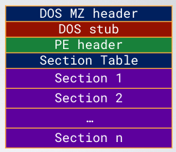
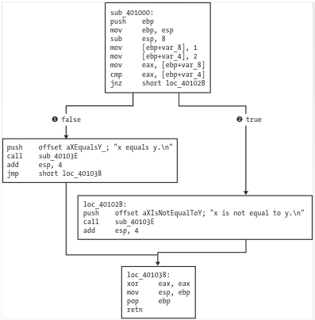
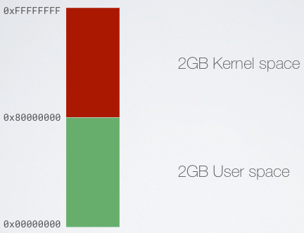
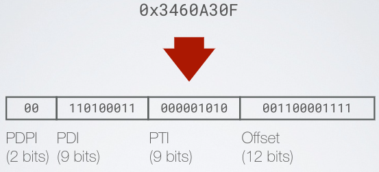
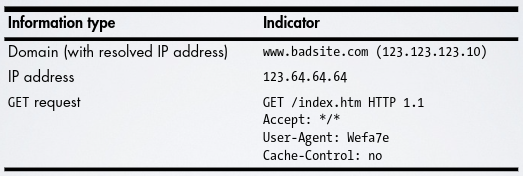
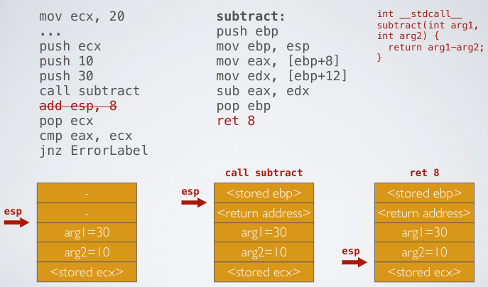

# Malware Analysis

[[_TOC_]]

## Theory

### Attack Structure

- Anatomy of an attack
  - Precise targeting
    - Mass campaigns vs. precise targeting
  - Full control of target (RAT)
    - The attacker aims to fully control targets
  - Long-term persistence (APT)
    - Multiple backdoors
    - Activity obfuscation
    - Security measure sidesteps + evasion
- Attack killchain (could be different)

  

  1. Reconnaissance: definition of the target surface
     - The attacker looks for the best strategy to apply
     - Target profiling through
       - Social media
       - Public data sources
       - Doxing attacks
  2. Weaponization: theoretical attack (or proof-of-concept) is transformed in running code
     - Requires technical skills
     - Often “outsourced”
     - Unknown vulnerabilities are extremely valuable

       

  3. Delivery: exploit is delivered through a vector
     - Delivery method 
       - Phishing
       - Spear phishing
       - Watering hole
     - Delivery vector
       - EXE
       - ZIP
       - XLS
       - ...
  4. Exploitation
     - 0-day exploit
     - Known software vulnerability
     - Misconfiguration
     - Bad user behavior
  5. Persistence/Installation: payload download
     - Payload must be obfuscated while it trespasses boundary security
       - Encryption
       - Steganography
       - ...
  6. Callback: payload cleans up what remains of the infiltration procedure
     - The payload contact a C&C server to
       - Receive further instructions
       - Download modules
     - The communication is obfuscated as well
  7. Data exfiltration
     - Passwords
     - Private encryption keys
     - Documents
     - Information about the surrounding network
     - ...
  8. Lateral spread: attacker will explore his surrounding to infiltrate further resources

### Models for threat intelligence

- Today attacks
  - Precise targeting
  - Use of advanced intrusion/obfuscation techniques
  - Full control of target (RAT)
  - Long-term persistence (APT)
- Threat intelligence
  - Purpose: characterizing threats in order to identify valuable preventative controls
  - Data extraction and transformation

    

  - Process

    

    - Identify key tactics to rebuild attacker's playbook and replay it to check if our defence measures are adequate 
  - Goals at several levels

    

  - Make intelligence actionable
    - Assume the attack is resource constrained and behaves like a rational human being
      - Value for the attacker comes from the possibility of re-using attack methodologies/techniques/tools as much as possible
        - Repeatability: the capability to change the target and have the attack still work with the same success rate
        - Scalability: the capability to launch the attack against multiple targets with minimal cost per additional target
      - Attackers determine the least costly and most valuable attacks
        - Inexpensive, valuable, scalable, or repeatable
          - Phishing
          - Credential reuse
          - Known vulnerabilities with public exploits
          - Office macros
          - Spyware
          - Vendor compromise
        - Costly, valueless, unscalable, or unrepeatable
          - Web vulnerabilities
          - 0-day exploits
          - Known vulnerabilities without public exploits
          - Embedded devices
          - Crypto weaknesses
          - Insider threat
  - Intrusion killchain to extract actionable information, know the attacker
  - Indicators: any piece of information that objectively describes an intrusion
    - Types
      - Atomic: cannot be broken down into smaller parts and retain their meaning in the context of an intrusion (e.g. IP addresses, email addresses, vulnerability identifiers, etc.)
      - Computed: derived from data involved in an incident (e.g. hash values)
      - Behavioral: collections of computed and atomic indicators, often subject to qualification by quantity and possibly combinatorial logic (e.g. "the intruder initially used a backdoor which generated network traffic matching [regular expression] at the rate of [some frequency] to [some IP address]")
    - Life cycle

      

      - Revealed: discover IOC
      - Mature: for example create a rule in a firewall logging for an IP (IOC)
      - Utilized: the firewall effectively logged some requests from the IP (IOC)
    - Indicators can be used to describe/identify various stages of the intrusion using the kill chain as a reference model

      

    - Types: the pyramid of pain
      - Hash Values (computed): hashes that correspond to specific suspicious or malicious files; often used to provide unique references to specific samples of malware or to files involved in an intrusion
      - IP Addresses: IP address or netblocks referring to the attacker
      - Domain Names: a domain name or even a sub- or sub-sub-domain
      - Network Artifacts: observables caused by adversary activities on your network; those pieces of the activity that might tend to distinguish malicious activity from that of legitimate users (URI patterns, C2 information embedded in network protocols, distinctive HTTP User-Agent or SMTP Mailer values...)
      - Host Artifacts: observables caused by adversary activities on one or more of your hosts. They could be registry keys or values known to be created by specific pieces of malware...
      - Tools: software used by the adversary to accomplish their mission
      - Tactics, Techniques and Procedures (TTPs): how the adversary goes about accomplishing their mission, from reconnaissance all the way through data exfiltration and at every step in between (e.g. Dumping cached authentication credentials and reusing them in Pass-the-Hash attacks)

      

  - Analyzing the attack (exploit the killchain)
    - The intrusion kill chain becomes a model for actionable intelligence when defenders align enterprise defensive capabilities to the specific processes an adversary undertakes to target that enterprise

      

    - Strategies to counteract intrusions
      - Detect: set up detection rules of an indicator for future events (e.g. firewall detection rules)
      - Deny: prevent the event from taking place (e.g. firewall block rules)
      - Disrupt: make the event fail as it is occurring (e.g. memory protection measures)
      - Degrade: slow down the further actions of the attacker (e.g. bandwidth throttling)
      - Deceive: learn more about the intentions of the attacker by making them think the action was successful (e.g. use an honeypot)
      - Destroy: offensive action against the attacker (think twice about it...)
    - Measure effectiveness to drive defense strategies over time
    - Reconstruct the killchain

      

      - We can "make continue" the early phase detection attack on an honeypot so that then we can see how the attack evolves
    - Investigate campaigns: recurring attacks from persistent threats require deeper understandings, they are the most dangerous

      

      - Are N intrusion from the same threat?
        - Compare intrusion indicators to find commonalities
        - Inflection points among diverse intrusions may represent common patterns in a long-term campaign
    - Usage scenarios
      - Post-mortem analysis

        

      - Lesson learned

        

  - The diamond model: analysis process through several predefined steps that starting from indicators, strive to identify high-level facts about the security incidents that are analyzed
    - Describes security events (incidents) through few basic aspects
    - Connects events that took place in a single intrusion through activity threads
    - Identifies commonalities among activity threads forming activity groups that can then be used for strategic planning
    - Parts

      

      - Event: set of core features pertaining to few fundamental aspects
        - Definition: for every intrusion event there exists an **adversary** taking a step towards an intended goal by using a **capability** over **infrastructure** against a **victim** to produce a result
        - An event defines discrete time-bound activity restricted to a specific phase
        - The adversary may require access to further external resources to fulfill its goal (meta features)
      - Adversary: actor/organization responsible for utilizing a capability against the victim to achieve their intent
        - Operator: actual hacker or person(s) conducting the intrusion activity
        - Customer: entity that stands to benefit from the activity conducted in the intrusion
      - Capability: tools and/or techniques of the adversary used in the event
        - Capability Capacity: all of the vulnerabilities and exposures that can be utilized by the individual capability regardless of victim are considered its capacity
        - Adversary Arsenal: adversary's complete set of capabilities, and therefore the combined capacities of their individual capabilities
      - Infrastructure: describes the physical and/or logical communication structures the adversary uses to deliver the attack
        - Type
          - Directly controlled infrastructure
          - Infrastructure controlled by an intermediary
          - Public infrastructure providers
      - Victim: target of the adversary and against whom vulnerabilities and exposures are exploited and capabilities used
        - Persona: individual or organization being targeted
        - Asset: attack surface and consist of the set of networks, systems, hosts, email addresses.. against which the adversary directs their capabilities
        - Victim susceptibilities (sub-features of the victim): set of vulnerabilities and exposures of a victim
      - Meta features
        - Timestamp: date and/or time when the event occurred
        - Phase: logical role played by the event in an activity thread (cyber kill chain jargon for phases)
        - Results: post-conditions of an adversary’s operations
          - Qualitative <Success,Failure,Unknown>
          - Informative: Confidentiality|Integrity|Availability-compromised
          - Details: refer to the specific compromised assets
        - Direction: describes qualitatively the main direction for actions in the event
          - Victim-to-Infrastructure, Infrastructure-to-Victim, Infrastructure-to-Infrastructure, Adversary-to-Infrastructure, Infrastructure-to-Adversary, Bidirectional, or Unknown
        - Methodology: description of the general class of activity (spear-phish email, content-delivery attack...), better use an existing taxonomy
        - Resources: all supporting elements on which the event, and therefore each core- and meta-feature, depends (software, knowledge, information, hardware, funds, facilities, access)
    - Extensions

      

      - Social-political: relationship existing between the Adversary and its Victims
      - Technology: technology connecting and enabling the infrastructure and the capability to operate and communicate
    - Analytical pivoting

      

      - Approaches
        - Victim-centered: analyzing data related to a potential victim reveals the other related elements (malicious capabilities and infrastructure)
        - Capability-centered: exploits features of a capability to discover those other related elements like (i) victims whom that capability is used against, (ii) infrastructure supporting the capability, (iii) technology enabling the capability, (iv) clues to other related capabilities, (v) and (possible) clues to the adversary
        - Infrastructure-centered: focuses on the malicious infrastructure of the adversary (difficult access)
        - Adversary-centered: mostly reserved to law-enforcement agencies
    - Activity thread

      

      1. We start with a table that contains all events but no correlations
      2. Vertical correlation
         - Identify knowledge gaps: what happened in the middle?
         - Fill those gaps with new knowledge: research to understand what happened, **let the gap drive your analysis**
         - Establish causal relationships among events
      3. Horizontal correlation: analytic process of causally linking events between vertical threads across adversary-victim pairs
         - Identify common knowledge gaps between threads
         - Use knowledge from one thread to fill knowledge gap in another
         - Identify common features across victims which can lead to the creation of an activity group
      4. Identify adversary processes
         - Remove the details
         - Focus on common recurring elements
         - Check among known activity threads
    - Attack graphs

      

    - Activity groups (iterative process)

      


### Static analysis

- Goal
  - Information required to contain/mitigate a network intrusion
    - Understand what exactly happened
    - Make sure you’ve located all infected machines and files
    - Understand how to measure and contain the damage
    - Find indicators of compromise (IoCs)
    - Build rules for intrusion detection systems
  - Dissecting malware to understand
    - How it works: know your enemy’s strategies
    - How to identify it
      - Extract signatures/IoCs (Indicators of compromise)
      - Prevent further similar infections
    - How to defeat or eliminate it
      - Rollback (if possible) its effects
      - Clean the infected system
- Signatures
  - Host-based
    - Identify files/processes/registry keys on a victim computer that indicate an infection
    - Focus on what the malware does to the system, not the malware itself (behavioural analysis)
  - Network signatures
    - Detect malware by analysing network traffic (C&C? Lateral movement?)
- Static vs Dynamic analysis
  - Static: examines malware without running it
  - Dynamic: run the malware and monitor its effects (use a virtual machine)
- Types of malware
  - Backdoor: allows attacker to control the system
  - Botnet: all infected computers receive instructions from the same Command-and-Control (C&C) server
  - Downloader: malicious code that exists only to download other malicious code
  - Information-stealing malware: sniffers, keyloggers, password hash grabbers
  - Launcher: malicious program used to launch other malicious programs
  - Rootkit: designed to deeply hide in the infected machine to evade detection (user-level, kernel-level..)
  - Scareware: frightens user into buying something
  - Spam-sending malware: attacker rents machine to spammers
  - Worms or viruses: malicious code that can copy itself and infect additional computers
- Malware behaviors
  - Uniqueness
    - Malware is often incompatible with itself
    - Multiple concurrent executions are dangerous for the malware itself se often there will be a check at startup to guarantee the execution of a single copy
  - Environment checks
    - Malware is designed to work in appropriate environment
    - Checks at startup if specific execution conditions are met
  - Persistence: the malware installs itself in the system (survive to reboots, changes are hidden)
  - Obfuscation and evasion: malware will try to hide its presence and its effects to stay undetected as long as possible
    - Inject code in other processes to conceal its real identity
    - Mangle its internal code to hide easily discoverable hints of its malicious nature
    - Techniques to hamper the possibility to correctly analyse its behaviour
  - Fingerprinting: malware will inspect the infected system and collect information about it
  - Communication: malware often interacts with external command & control services to receive instructions and commands, update its internal components, exfiltrate data; data on channels is often obfuscated
- Malware analysis general rules
  - Don’t Get Caught in Details: you don’t need to understand 100% of the code, focus on key features
  - Try Several Tools: if one tool fails, try another one
  - Don’t get stuck on a hard issue, move along
- **Static analysis: how to?**
  1. Antivirus scanning: VirusTotal is convenient, but using it may alert attackers that they’ve been caught
  2. Hashes: MD5 or SHA-1
     - Uniquely identifies a file
     - There are MD5 collisions but they are not common
     - Still using VirusTotal
     - Sample vs Malware: the sample is the implementation of the malware
  3. A file’s strings, functions, and headers
     - Strings: any sequence of printable characters is a string; strings are terminated by a null value (`0x00`)
- Obfuscation
  - Using packing
    - The code is compressed, like a Zip file
    - This makes most strings and instructions unreadable
    - All you'll see is the wrapper; small code that unpacks the file when it is run
    - Detect packing: use `PEiD`
      - Beware: some PEiD plugins may silently run the malware to identify the packer!
- File execution in Windows
  - The OS (actually the loader) looks in the file to understand what to do
  - What’s in the file?
    - Code
    - Data
    - Other resources
    - Metadata
  - All these information need to be organised to be correctly interpreted by the loader
    - `PE` file format
      - Used by Windows executable files, object code, and DLLs (you treat EXEs and DLLs in a very similar way)
      - A data structure that contains the information necessary for Windows to load the file
      - Structure

        

        - Starts with MS-DOS header+stub (for compatibility)

          

          

          - The DOS header occupies the first 64 bytes of the file
          - It's there in case the program is run from DOS, so DOS can recognize it as a valid executable and run the DOS stub
          - The DOS stub usually just prints a string like "This program must be run under Microsoft Windows"
        - The PE header contains metadata used to correctly load and execute the file

          

          - Signature + File header

            

            - SizeOfOptionalHeader: total size of optional header
            - TimeDateStamp: when this executable was compiled
          - Optional headers

            

            

            - AddressOfEntryPoint: not absolute, relativo offset from the ImageBase
          - Section table

            

            

            - VirtualAddress: relative virtual address (RVA) of the beginning of the section (respect to the ImageBase)
        - File content is structured in sections
          - Each section contains a specific kind of data
          - Section table describes the sections
        - Usually at least two sections are present
        - Sections
          - Types
            - Executable Code Section: `.text` (Microsoft) or `CODE` (Borland)
            - Data Sections: `.data`, `.rdata`, or `.bss` (Microsoft) or `DATA` (Borland)
            - Resources Section: `.rsrc`
            - Export Data Section: `.edata`
            - Import Data Section: `.idata`
            - Debug Information Section: `.debug`
          - The names are actually irrelevant as they are ignored by the OS and are present only for the convenience of the programmer, so these sections can be renamed by the attacker to obfuscate the code
          - After the section headers we find the sections themselves
          - Between each section's data there will be 00 byte padding
          - When loaded into RAM, the sections always start on a page boundary so that the first byte of each section corresponds to a memory page
            - On x86 CPUs pages are 4kB aligned, whilst on IA-64, they are 8kB aligned
            - This alignment value is stored in SectionAlignment also in OptionalHeader
  - Loading in memory

    

  - Imports: functions used by a program that are stored in a different program, such as library
    - Connected to the main EXE by linking
    - Can be linked three ways
      - Statically: all code from the library is copied into the executable; makes executable large in size
      - Dynamically: host OSs search for necessary libraries when the program is loaded
      - At Runtime: load while the software is running (`LoadLibrary` and `GetProcAddress`); used by malware (because using this you can hide more the code) but also by software that use plugins
  - Exports: functions of an executable visible by other programs
- Tools
  - Dependency walker: show dynamically linked functions (malware often has few DLLs)
    - Common DLLs

      

      

  - Resource Hacker: let you browse content of the resource section `.rsrc`

### Dynamic Analysis

- Definition
  - Running malware deliberately, while monitoring the results
  - Requires a sealed safe environment
  - Problem: probably you won't see the whole malware behaviour
- Approaches
  - Diffing: take a snapshot of a clean system state and a snapshot of a compromised system state; compare
    - Problem: if malware creates and then deletes for example a file we won't detect it
    - Tools: regshot, autoruns
  - System monitoring: record every individual change on system and network traffic that appear after execution of the suspicious file
    - Problem: too much information (filter)
    - Tools: procmon, wireshark
  - API tracing: hook and record important API calls made by the suspicious process
    - Problem: too much information (filter)
    - Tools: WinApiOverride, Rohitab API Monitor
  - Debugging: set breakpoints inside the suspicious file to stop its execution at a given location and inspect its state
    - Problem: must be be done in conjunction with some basic static analysis; malware will often change its behavior or refuse to run when being debugged, which requires a work-around
    - Tools: IDA Pro, OllyDbg, ImmunityDebugger, WinDbg
- How to
  - Program instrumentation (debugging, API monitoring): binary under analysis is modified (breakpoints are inserted, functions are rewritten, debug registers are used); uses Detours (windows API hooking mechanism)
    - Problem: not invisible, malware can detect analysis
  - OS instrumentation: inject code in the OS in order to allow you to see operations usually not visible (API monitoring); should be invisible to the malware (user-level)
    - Problem: can cause problems when malware runs in OS kernel and the visibility inside the program is limited (no breakpoints)
  - Hardware instrumentation: provide virtual hardware (processor) where sample can execute (sometimes including OS); you can see everything and is completely transparent to programs and OS
    - Problem: analysis observes activity "from the outside", you just see what's happening in the processor
- What to observe
  - Process interacts with operating system via system calls
  - On Windows, system calls are largely undocumented and can change without notice
    - Developers are supposed to use Windows API, which denotes a collection of stable, user-mode, shared libraries
    - Windows API can be bypassed, useful for malware writers 
- Analysis report
  - File activity
  - Registry activity
  - Service activity
  - Process activity
  - Network activity 
- Sandboxes: virtualized environment that simulates network services; the malware is run and they produce a nice PDF report of results
  - Examples
    - Norman Sandbox
    - GFI Sandbox
    - Anubis
    - Joe Sandbox
    - ThreatExpert
    - BitBlaze
    - Comodo Instant Malware Analysis
- Malware classification (hardly coherent)

  

- Environments
  - Real machines: not so used, re-imaging machine takes time
  - Virtual machine: most common method, snapshot can be used, VM-escape attacks are theoretically possible
- Launching DLLs
  - EXE files can be run directly, but DLLs can't
  - Use Rundll32.exe (included in Windows) `rundll32.exe DLLname, Export arguments`
  - Example
    - `rundll32.exe rip.dll, Install`
    - `rundll32.exe xyzzy.dll, #5`
  - It's also possible to modify the PE header and convert a DLL into an EXE, or install it as a service: `rundll32.exe ipr32x.dll, InstallService ServiceName` and `net start ServiceName`
- Tools
  - Process monitor: monitors registry, file system, network, process, and thread activity
    - Don't run it too long or it will fill up all RAM and crash the machine
  - Process explorer: like task manager but more in depth (process structure)
    - Info on loaded DLLs
  - ApateDNS: redirect dns resolution
  - Ncat (included in nmap): for localhost requests and services exposed
  - Wireshark: packet sniffing
- The registry: place where Windows store its configuration
  - Organization
    - Scope
      - Systemwide
      - Per-user settings
    - Registry value stores data whose type can be `REG_SZ`, `REG_DWORD`, `REG_BINARY`...
    - Root keys

      

  - Used by malware writers to hide things and change the configuration of the environment
  - RegShot: check how a process modified the registry
- Persistence: survive after reboot
  - Registry key (like autorun)

    

  - File system: startup folders, trojanizing files..
    - Startup locations
      - For the logged-in user: `%USERPROFILE%\Start Menu\Programs\Startup`
      - For all users: `%ALLUSERSPROFILE%\Start Menu\Programs\Startup`
    - Windows services (also `svchost.exe`)
      - Automatically started when the computer boots
      - Registered services can be found under the registry key `HKLM\System\CurrentControlSet\Services`
  - Master boot record: edit the startup of the OS
  - BIOS
  - ...

### Advanced static analysis

- C code to assembly "structures"
  - Global vs local variables
    - Global

      

    - Local

      

  - Arithmetic operations

    

  - If

    

    

    

  - Loops
    - For

      

      

    - While

      

  - Calling conventions

    

  - Push vs mov in stack

    

  - Switch

    

    

    - If larger number of switches

      

      

  - Arrays
    
    

  - Structs

    

    

  - Linked lists
    
    

- Windows APIs and general functions
  - Types and Hungarian Notation

    

  - Handles: items opened or created in the OS (Window, process, menu, file, ...)
    - Handles are like pointers to those objects, however you cannot operate on them with arithmetic operations
    - The only thing you can do with a handle is store it and use it in a later function call to refer to the same object
  - File System Functions (`CreateFile`, `ReadFile`, `WriteFile`)
    - `CreateFileMapping`, `MapViewOfFile`: frequently used by malware, loads file into RAM
      - `CreateFileMapping` loads a file in memory
      - `MapViewOfFile` returns a pointer to the base address of file in memory for access
    - Can be used to execute a file without using the Windows loader
  - Special Files
    - Shared files: \\server\share
    - Namespaces: spacial folders
      - `\` Lowest namespace, contains everything
      - `\\.\` Device namespace used for direct disk input/output
    - Alternate data streams (second stream of data attached to a filename: `File.txt:otherfile.txt`)
  - Windows registry: stores configurations
    - Used by malware for persistence
    - Basic root keys

      

      - Example: `HKLM\SOFTWARE\Microsoft\Windows\CurrentVersion\Run` (executables that start when a user logs on)
    - Common registry functions
      - `RegOpenKeyEx`: opens a registry key for editing and querying
      - `RegSetValueEx`: adds a new value to the registry & sets its data
      - `RegGetValue`: returns the data for a value entry in the Registry
    - Suffixes to functions

      

    - Example of assemby using registry code

      

    - Example of registry function call

      

  - Network APIs
    - Winsock libraries (`ws2_32.dll`)
      - Example simplified server program (just look at it from a high level)

        
    
    - Wininet (`Wininet.dll`, higher level than Winsock)
    - There are other ways to access the internet without using WinAPIs: you could use a network library that is not under the control of the OS but is in the folder of another installed software
- Basic DLL structure
  - DLLs are very similar to EXEs (uses PE)
  - DLLs have more exports & fewer imports
  - `DllMain` is the main function, not exported, but specified as the entry point in the PE Header; this is called when a function loads or unloads the library
- Process
  - Creating a process: `CreateProcess` (look at windows api page)
- Threads: contained by a process
  - Info
    - Independent sequences of instructions
    - Executed by CPU without waiting for other threads
    - Threads within a process share the same memory space
    - Each thread has its own registers and stack
  - Context
    - When a thread is running, it has complete control of the CPU
    - When a thread changes a register, it does not affect any other threads
    - When the OS switches to another thread, it saves all CPU values in a structure called the thread context
  - Creating a thread: `CreateThread` (look at windows api page)
- Mutexes: global objects that coordinate multiple processes and threads
  - Mutexes often use hard-coded names which can be used to identify malware
  - Functions
    - `WaitForSingleObject`: gives a thread access to the mutex (any subsequent threads attempting to gain access to it must wait)
    - `ReleaseMutex`: called when a thread is done using the mutex
    - `CreateMutex`
    - `OpenMutex`: gets a handle to another process's mutex
- Services: run in the background without user input
  - Functions
    - `OpenSCManager`: returns a handle to the Service Control Manager
    - `CreateService`: adds a new service to the Service Control Manager, can specify whether the service will start automatically at boot time
    - `StartService`: only used if the service is set to start manually
- System account: SYSTEM > administrator
- Rings
  - Ring 0: Kernel Mode
    - Processes
      - All kernel processes share resources and memory addresses
      - If kernel code executes an invalid instruction, the OS crashes with the Blue Screen of Death
      - Antivirus software and firewalls run in Kernel mode
    - Malware in kernel mode: rootkit
  - Ring 3: User mode
    - Nearly all code runs in user mode
    - User mode cannot access hardware directly (can only manipulate hardware through the Windows API)
    - Restricted to a subset of CPU instructions
    - Calling the kernel
      - It's not possible to jump directly from user mode to the kernel
      - `SYSENTER, SYSCALL, or INT 0x2E` instructions use lookup tables to locate predefined functions (like gates i Linux I think)
  - Rings 1 and 2 are not used by Windows
- Native API (`Ntdll.dll`)

  

  - Rarely used by non-malicious programs
  - Popular among malware writers
  - Not documented, not used by programmers
  - It's the last layer between higher level APIs and the syscalls that call the kernel

### Threat intelligence example

- Scenario
  - Our company recently was targeted by several phishing emails
    - They refer to assets and organizations linked to our company
    - They target a few specific internal mail addresses
  - The security team decided to dedicate some effort to investigate this phenomenon with the aim of possibly identifying interesting IoCs for preventing future attacks
- Day 1
  - Story
    - Bob, the PA to your director Mr. Angleton, calls you to say that he’s having problems opening a document from the new head of finance
    - You watch him double click the attachment to the email, see the long pause and then a blank PDF document open; the pause strikes you as odd
    - You ask Bob to open the email up again and as you read down the email it strikes you that the domain for the email address is wrong, it should be .com, and the email is rather brief – little more than "see attached"
    - Pulling up task manager you see that Internet Explorer is listed as running, yet no window is open
    - Reaching around the back of the PC you pull the network cable..
  - What i have
    - Source email address: `<frank.smith@example.net>`
    - Attachment: `document.pdf`
    - Further analysis

      

    - You quickly check the web proxy log for connections originating from Bob’s PC
      - Target domain: `acme.example.net`
      - IP: `190.0.2.101`
      - Content
        ```
        GET  /aotj/581/link.php?a=5&z=SGVybGQ&f=62796500 HTTP/1.1
        Host: mail-example.net
        User-agent: Mozilla 4.4
        Accept-Encoding: gzip
        ```
  - We start building diamonds

    

- Day 2
  - You look back at older logs to see if you match known IoCs

    

- Day 5
  - You tough Bob’sPC was clean, but last night at 9:00pm traffic outbound from that PC raised a huge number of alarms on the IDS
  - The IDS traced outbound connections from that PC to an external FTP server
  - Connections closed before 5:20am
  - You disconnect again the PC from the network for further investigation
  - In the meanwhile, you got from the IDS in depth info on the commands exchanged between the infected PC and the C2
  - We continue improving the diamond

    

  - We want to organize the diamond: subdivide diamond in several diamonds for each part of the attack

    

    - We could add pdfs to the weaponization phase and split them in two different diamonds
    - We could also split delivery using the same procedure

    

    - Here we could split "different" malwares into two diamonds 

    

  - Gap analysis and solve: we lack information about the technical part

    

- Day 8
  - Found things

    

  - Plan for improvements

    

### YARA rules

- What is YARA
  - `grep` on steroids (in the end is just an executable)
  - Useful to quickly check if a new observable matches some known suspicious characteristics
  - Useful to search for a new bit of information in a large dataset
  - Help you keep an organized library of matching rules for different threats based on observed IoCs
  - ...
- What is not
  - An antivirus
  - An IDS
- Basic rules
  - Simplest rule
    - `rule dummy { condition: false }`: does nothing
    - `rule dummy { condition: true }`: matches everything
    - `rule over_500kb {condition: filesize > 500KB}`: match any file more than 500kb
  - Standard structure
    ```yara
    // Example 1: 

    rule silent_banker : banker {
      meta:
        description = "This is just an example"
        threat_level = 3
        in_the_wild = true
      strings:
        $a = {6A 40 68 00 30 00 00 6A 14 8D 91}
        $b = {8D 4D B0 2B C1 83 C0 27 99 6A 4E 59 F7 F9}
        $c = "UVODFRYSIHLNWPEJXQZAKCBGMT"
      condition:
        all of them
    }

    // Example 2:
    rule pdf_1.7_contains_few_links {
      meta:
        author = "Sean Whalen"
        last_updated = "2017-06-08"
        tlp = "white"
        category = "malicious"
        confidence = "medium"
        killchain_phase = "exploit"
        description = "A PDFv1.7 that contains one or two links - a common phishing tactic"
      strings:
        $pdf_magic = {25 50 44 46}
        $s_anchor_tag = "<a " ascii wide nocase
        $s_uri = /\(http.+\)/ ascii wide nocase
      condition:
        $pdf_magic at 0 and (#s_anchor_tag == 1 or (#s_uri > 0 and #s_uri < 3))
    }
    ```
    - `name : tags`
    - Meta section: set of arbitrary key-value pairs
      - Can be used to describe the rule, and/or the type of content that it matches
      - Can be strings, integers, decimals, or booleans
      - The meta values can be viewed by the application that is using YARA when a match occurs
    - Strings section: defines variables as content to be matched
      - Hexadecimal byte patterns (in `{}`, with support for wildcards and jumps)
      - Often used to identify unique code
      - Text strings
      - Regular expressions (between `//`)
    - Conditions section: define matching conditions (check the docs for full syntax)

      

  - Imports and modules
    - Example: PE interpreter
      ```yara
      import “PE”
      rule suspicious_pe {
        Strings:
          $str = “procmon”
        Condition:
          pe.imports( “kernel32.dll”, “CreateProcess” ) and
          pe.imports( “wininet.dll”, “HttpSendRequest” ) and
          $str
      }
      ```
  - References: other rules can be referenced
    ```yara
    rule RULE_EVILMD5 {
      meta:
        description = “Suspicious MD5 Hash”
      condition:
        md5 matches /^3bb34a700e8d21acfdfe0f09208a7c01$/
    }
    rule RULE_EVILPATH {
      meta:
        description = “Suspicious File Path”
      condition:
        path contains “/appdata/roaming/”
    }
    rule RULE_SUSP_BHV {
      meta:
        description = “Suspicious Behavior”
      condition:
        RULE_EVILMD5 and RULE_EVILPATH
    }
    ```
- Advanced cases
  - Identifying patter at specific locations using displacements

    

    ```yara
    rule is_PE_file {
      strings:
        $mz = "MZ"
        $pe = "PE"
      condition:
        ($mz at 0) and
        ($pe at (uint32(0x3c)))
    }
    ```
  - Spot inside obfuscated strings

    

    - Structure
      - First two: opcodes (`mov`)

        

      - Third: displacement in where to put char (with respect to `ebp`)

        

      - Fourth: actual char
    - Final

      

    - Rule
      ```yara
      rule single_byte_mov {
        strings:
          $a = { C6 45 [2] C6 45 [2] C6 45 } // matches few chars
          // If you want to match the full string: $a = /(\xc6\x45..){3,}/
        condition:
          $a
      }
      ```
      - `[2]`: means that yara should match any subsequence of any two bytes
- How to construct rule
  - Look for constants that are important for an algorithm
  - Be aware of endianess issues
    - `0x1234` can be stored as `0x12` `0x34` or `0x34` `0x12`


### Advanced dynamic analysis

- Debugging
  - A debugger enables the analysis of execution in different ways
    - Instruction-level
    - Registers and memory contents
    - Function calls
    - Threads and exceptions
    - Can also alter the execution
      - Inspect and alter registers (including `EIP`)
      - Inspect and alter memory and its layout
      - Capture control flow transfers and specific instructions
      - Control threads (e.g. pause and resume them)
      - Modify code being executed
  - Ways of debugging
    - Load a program from the debugger
    - Attach to a running process
  - Following instructions
    - A debugger can follow one thread at a time
    - Stepping lets you execute instructions in a controlled way
      - Single stepping: steps through the instructions one at a time, exactly as how the CPU sees them arriving
      - Stepping into: a call instruction means that the debugger will perform single-stepping over the instructions of the called function
      - Stepping over: a call instruction means that single-stepping mode will be resumed only when the called function returns
      - Stepping out: of a function, the debugger suspends single-step execution and will resume it only once execution leaves the function
  - Breakpoints: let the program run until a point of interest is reached
    - Instruction breakpoints: pause execution once `EIP` reaches the address of interest
    - Memory breakpoints: trap accesses to arbitrary memory addresses
      - On read/write access
      - On write access only
      - On execute (like an instruction breakpoint)
    - Conditional breakpoints: suspend execution only when an additional condition is matched (e.g., stop at address `0x401130` only when `ECX=8`)
  - Implementing breakpoints
    - Software breakpoint: replaces the first byte of the instruction at the given address with `INT 3` (opcode `0xCC`)
      - CPU generates a software interrupt and the debugger captures the event
      - Malware may look for them performing a checksum of its `.text` section or just looking for `0xCC` in its code
    - Hardware breakpoint: does not alter code, but leverages the CPU debug registers to trap execution automatically (in these registers there is the instruction address in which we want to break)
      - Hard to detect
      - Limited number (4 in x8)
  - Exceptions: mechanism for implementing alternative control flow, e.g., to handle virtual memory or recover from errors
    - From the CPU’s perspective they are an interrupt
    - Debuggers use them to regain control of the execution
      - Instruction/memory breakpoints
      - Single-stepping when trap flag `TF` in `EFLAGS` is set
    - To handle an exception, a corresponding handler must have been registered
      - Benign programs use them to handle error situations (like division by zero)
      - Malware analysts use them to hinder analysis (for instance if the debugger catches an exception meant for the malware, it can give away its presence)
    - A debugger can catch an exception up to two times
      - Exceptions are passed to the debugger as they occur
      - However, first-chance exceptions can be passed to the program when they are unrelated to debugging (e.g., floating point or division-by-zero error)
      - When the program cannot recover from the exception (e.g., there is no corresponding registered handler), the debugger receives it again
      - Second-chance exceptions requires intervention or the program will crash
      - Malware often uses exceptions as an anti-debug technique
  - ASLR: addresses change, can be a pain to debug
    - Windows randomizes the base address for `.text` at every execution
    - IDA offers manual loading for a PE and a rebase option for the current session(Edit->Segments->Rebase Program)
  - IDA
    - Shortcuts
      - `Escape`: go back to previous position in current view
      - `Ctrl+Enter`: go forward to next position in current view
      - `Space`: switch between text and graph mode
      - `G`: jump to address in current view
      - `F2`
        - During static code analysis: set a breakpoint at the current instruction
        - During debugging: enable edit mode to change selected value, then `F2` again to apply changes
      - `X`: show cross referencing info for selected function entrypoint
      - `N`: rename selected reference
      - [Full guide](https://www.hex-rays.com/products/ida/support/freefiles/IDA_Pro_Shortcuts.pdf)
    - Views
      - Main
        - Disassembler window: we modify instructions, provided that there is enough space
          - Changes do not survive restarts however, they can be imported/exported (File->Patches)
          - Be aware of possible integrity checks
          - Ensure stack pointer alignment when deleting a function call
        - Registers window: edit general-purpose registers (e.g., `ECX`) or change the instruction pointer
        - Stack window
        - Memory dumps window: we can alter memory easily; we can follow an address on stack first (e.g., to dereference a pointer) or directly on dump (e.g., ASCII data), then modify the corresponding data
      - Memory map
        - Writable and executable regions may hint at packers or self-modifying code
        - Changed protection for a region may suggest that as well
        - Load address for DLLs
        - Clicking on a base address will update the disassembler (code) or the memory dump (data) view
      - Panes
        - Graph: `SPACE` on an instruction address in the Disassembler window, we can get the classic IDA view
        - Breakpoints: see all breakpoints and control them
        - Call stack: sequence of routine calls currently active on the stack
        - SEH (Exception handling)
        - Symbols
        - Threads: lets the analyst control the state of each thread
    - Stepping is managed from the Debugger menu (top)

### Cyber threat intelligence sharing

- Goal: enhance the cyber security of an individual organization as well as that of the entire sharing community sharing threats information
- How it works

  

  - CSIRT also cleans information from sensible data, then share with other companies
- NIS directive: nowadays the sharing of information is a legislative requirement for companies that are very important for a nation (water company, electricity company..)
- Sharing models
  - Centralized/Hub & Spoke/Subscriber: requires trust
    - Duties
      - Data enhancement, added analysis
      - Macro trend analysis
      - Rule/agreement enforcement, organization
      - Anonymization/data cleansing
      - Low technical costs for new consumers
  - Peer to peer
    - Less trust needed 
    - Lower efficiency
    - Hard to scale
    - More relevant and pertinent
    - Requires participants to have more sophisticated and matured cyber threat sharing operations
- Sharing technologies

  

  - Languages
    - STIX: let the natural language elements used in threat intelligence be discrete and machine readable
      - Graph-based model: STIX domain objects and relationship objects between them, uses JSON

        

      - Tool-agnostic
      - Can be used also for other things

        

      - Defines 12 Domain Objects (SDOs)
        - Attack Pattern: type of Tactics, Techniques, and Procedures (TTP) that describes ways threat actors attempt to compromise targets
        - Campaign: grouping of adversarial behaviors that describes a set of malicious activities or attacks that occur over a period of time against a specific set of targets
        - Course of Action: action taken to either prevent an attack or respond to an attack
        - Identity: individuals, organizations, or groups, as well as classes of individuals, organizations, or groups
        - Indicator: contains a pattern that can be used to detect suspicious or malicious cyber activity
        - Intrusion Set: grouped set of adversarial behaviors and resources with common properties believed to be orchestrated by a single threat actor
        - Malware: type of TTP, also known as malicious code and malicious software, used to compromise the confidentiality, integrity, or availability of a victim’s data or system
        - Observed Data: conveys information observed on a system or network (e.g., an IP address)
        - Report: collections of threat intelligence focused on one or more topics, such as a description of a threat actor, malware, or attack technique, including contextual details
        - Threat Actor: individuals, groups, or organizations believed to be operating with malicious intent
        - Tool: software that can be used by threat actors to perform attacks
        - Vulnerability: mistake in software that can be directly used by a hacker to gain access to a system or network
      - Defines 2 Relationship Objects (SROs)
        - Relationship: used to link two SDOs and to describe how they are related to each other
        - Sighting: denotes the belief that an element of CTI was seen (e.g., indicator, malware)
      - Overall model

        

      - Allow to focus analysis on specific elements
        - Examples

          

          

      - Representation: JSON

        

        - `ID`: universally and uniquely identify
        - Object properties that end in `_ref` represent references to other STIX Objects

          

        - Creating a valid object

          

        - Each domain object has its own set of possible relationship types
        - STIX defines several relationships that are common to all Objects
          - `derived-from`: the information in the target object is based on information from the source object
          - `duplicate-of`: the referenced source and target objects are semantically duplicates of each other
          - `related-to`: the referenced source and target objects are arbitrarily related to each other
      - Versioning
        - Objects may have new versions defined only by their Object Creator
          - Object Creator: the entity that generates the id property for a given object; Object creators are represented as Identity objects
          - Producers other than the Object Creator are not allowed to create new versions of an Object
        - Objects may also be revoked by setting the revoked property to true (permanent)
        - The version of an Object is based on the tuple of its id and modified properties
        - For the first version of an Object, the created and modified timestamps MUST have the same value
        - Anytime an update constitutes a material change (a change in the fundamental meaning of an object), a new object with a different id should be used
        - How is used

          

      - Data markings
        - Represent handling or sharing requirements for data, and are applied in the `object_marking_refs` and `granular_markings` properties on STIX Objects, which reference a list of IDs for marking-definition objects
        - Can't be versioned
        - Object markings vs. Granular markings
          - Object markings apply to the STIX Object as a whole 
          - Granular markings can be applied to individual properties of STIX objects (e.g., The name property can be marked differently than the Description property)
        - Statement markings vs. Traffic Light Protocol (TLP)
          - Statement markings are text based markings
          - TLP markings are predefined as objects in the STIX spec (e.g., TLP: RED, TLP: AMBER, TLP: GREEN, TLP: WHITE)
        - Example

          

      - Patterns
        - Standard language to describe what to look for in a cyber environment
        - Permits patterns to be written against both host-based and network data (contemporarily)
        - Structure

          

          - Example
            - Finding an IP: `[ip-addr.value = '8.8.8.8']`
            - Finding a URL: `[url:value MATCHES ‘^(?:https?:\/\/)?(?:www\.)?example\.com\/.*’]`
            - Finding one of two registry keys:` [windows-registry-key:key = 'HKEY_CURRENT_USER \\Software\\CryptoLocker\\Files' OR windows-registry-key:key = ‘HKEY_CURRENT_USER\\Software\\Microsoft\\CurrentVersion\\Run\\\CryptoLocker_0388']`
        - Pattern may need to be converted to native query syntax if the security tool does not support STIX Patterning natively; sometimes the pattern should also be split in multiple rules to divide them between the various tools
          - Using a SIEM this is solved, usually it can understand STIX patterns
      - General example

        

  - Protocols
    - TAXII (Trusted Automated Exchange of Intelligence Information): designed to facilitate sharing of CTI data
      - Structure is general purpose but is intended to be used with STIX
      - Uses HTTPS and JSON
      - Open source
      - Uses a RESTful API and a set of requirements for TAXII Clients and Servers
      - Defines two primary services to support a variety of common sharing models
        - Collection: interface to a logical repository of CTI objects provided by a Server that allows a producer to host a set of CTI data that can be requested by consumers
          - Clients and Servers exchange information in a request-response model
        - Channel: maintained by a Server, allows producers to push data to many consumers and consumers to receive data from many producers
          - Clients exchange information with other Clients in a publish-subscribe model
          - Clients can subscribe to various channel and publish information to them

          

      - CTI sharing architectures

        

        

        - Channels
          - Red: IOC channel
          - Blue: signing channel
          - Green: enrichment channel
        1. Receive the IOC from the IDS and push it
        2. Propagate the IOC
        3. Check for the IOC and if it match send: "Yes, it matched!"
        4. Propagate the Sign
        5. Enrichment of the IOC
        6. Push the enriched IOC
      - API

        

        - Examples
          - Get server information and a list of API Roots
            - Request: `GET https://ts01.example.com/taxii2/`
            - Response
              ```json
              {
                "title": "Some TAXII Server",
                "description": "This TAXII Server contains a listing of...",
                "contact": "string containing contact information",  
                "default": "https://example.com/api2/", 
                "api_roots": [
                  "https://example.com/api1/",
                  "https://example.com/api2/",
                  "https://example.net/trustgroup1/"
                ]
              }
              ```
          - Get information about an API Root
            - Request: `GET https://ts01.example.com/api1/`
            - Response
              ```json
              {
                "title": "Malware Research Group",
                "description": "A trust group setup for malware researchers",
                "versions": ["application/taxii+json;version=2.1"],
                "max_content_length": 104857600
              }
              ```
          - Get a list of available collections
            - Request: `GET https://ts01.example.com/api1/collections`
            - Response
              ```json
              {
                "collections": [<list of collection resources>]
              } 
              ```
          - Get details about a specific collection
            - Request: `GET https://ts01.example.com/api1/collections/91a7b528-80eb-42ed-a74d-c6fbd5a26116/`
            - Response
              ```json
              {
                "id": "91a7b528-80eb-42ed-a74d-c6fbd5a26116",
                "title": "High Value Indicator Collection",
                "description": "This data collection contains high value IOCs",
                "can_read": true,
                "can_write": false,
                "media_types": ["application/stix+json;version=2.1"]
              }
              ```
          - Posting Data to a Collection
            - Request: `POST https://ts01.example.com/api1/collections/91a7b528-80eb-42ed-a74d-c6fbd5a26116/objects/`
            - Content
              ```json
              {
                "objects": [
                  {
                    "type": "indicator",
                    "id": "indicator--12fd1bad-8306-4ed4-8c9b-7dfdd8ad5eb8",
                    "name": "Bad IP1",
                    "description": "STIX/TAXII 2.0 Interoperability Part 1, §2.2.3.1, Indicator IPv4 Address",
                    "created": "2018-01-17T11:11:13.000Z",
                    "modified": "2018-01-17T11:11:13.000Z",
                    "valid_from": "2018-01-01T00:00:00.000Z",
                    "labels": ["malicious-activity"],
                    "pattern": "[ipv4-addr:value = '198.51.100.1']"
                  }]
              }
              ```
            - Response
              ```json
              {
                "id": "2d086da7-4bdc-4f91-900e-d77486753710",
                "status": "complete",
                "request_timestamp": "2016-11-02T12:34:34.12345Z",
                "total_count": 1,
                "success_count": 1,
                "successes": ["List of objects defined in the Part1 bundle test cases"],
                "failure_count": 0,
                "pending_count": 0
              }
              ```
          - ...
- Taxonomies
  - Difficult to talk if we are using different terms to identify the same (for example) attack pattern
    - Attack patterns: blueprint for creating a specific type of attack (high level)
      - Capture the attacker’s perspective to aid software developers, acquirers and operators in improving the assurance profile of their systems
      - Usage
        - Guide definition of appropriate policies
        - Guide creation of appropriate security requirements (positive and negative)
        - Provide context for architectural risk analysis
        - Guide risk-driven secure code review
        - Provide context for appropriate security testing
        - Identify and characterize threat TTPs for red teaming
        - Provide a bridge between secure development and secure operations
          - Secops knowledge offers unique value to secdev
            - Understand the real-world frequency and success of various types of attacks
            - Identify and prioritize relevant attack patterns
            - Identify and prioritize the most critical weaknesses to avoid
            - Identify new patterns and variations of attack
          - SecDev Knowledge Offers Unique Value to SecOps
            - Attack patterns enable those in the secure operations domain to provide appropriate context to the massive amounts of data analyzed to help answer the foundational secure operations questions
  - Solutions
    - Common Attack Pattern Enumeration and Classification (CAPEC) for structured characterization of attack patterns
      - Focus: application security and describes the common attributes and techniques employed by adversaries to exploit known weaknesses in cyber-enabled capabilities
      - Standardizing the capture and description of attack patterns
      - Collecting known attack patterns into an integrated enumeration
      - Provides the attacker’s perspective
    - MITRE ATT&CK: globally-accessible knowledge base of adversary tactics and techniques based on real-world observations
      - Focus: network defense, describes the operational phases in an adversary’s lifecycle, pre and post-exploit (e.g., Persistence, Lateral Movement, Exfiltration), and details the specific tactics, techniques, and procedures (TTPs) that advanced persistent threats (APT) use to execute their objectives while targeting, compromising, and operating inside a network
      - Tactic phases derived from Cyber Attack Lifecycle
      - List of techniques available to adversaries for each phase
      - Possible methods of detection and mitigation
      - Documented adversary use of techniques
    - Malware Attribute Enumeration and Characterization (MAEC) language for structured characterization of malware
      - Enable correlation, integration, and automation
      - Use cases
        - Malware Analysis
          - Static and Dynamic Malware Analysis
          - Malware Visualization
          - Analysis-Oriented Malware Repositories
          - Standardized Tool Output
        - Cyber Threat Intelligence
          - Malware Threat Scoring System
          - Attribution
          - Malware Provenance
        - Incident Management
          - Uniform Malware Reporting Format
          - Malware Repositories
          - Remediation
      - Contents
        - Top-level Objects (TLOs): entities captured at the top level of a Package (examples include the Malware Instance and the Behavior Objects)
          - Behavior: purpose behind a particular snippet of code, as executed by a malware instance
            - Examples include keylogging, detecting a virtual machine, and installing a backdoor
            - Behaviors may be composed of one or more Malware Actions, thereby providing context to these Actions
          - Collection: captures a set of MAEC entities (e.g., Malware Instances, Behaviors, etc.) or STIX Cyber Observables that are related or associated in some way
          - Malware Action: abstraction on a system-level API call (or similar entity) called by the malware instance during its execution
            - Actions do not contain any associated context as to why they were performed, as this level of detail and abstraction is documented by Behaviors
            - Examples of Actions include the creation of a particular file on disk and the opening of a port
          - Malware Family: set of malware instances that are related by common authorship and/or lineage
            - Often named and may have components such as strings that are common across all members of the family
          - Malware Instance: single member of a Malware Family that is typically packaged as a binary
            - Allows for the characterization of the binaries associated with a Malware Instance along with any corresponding analyses, associated Capabilities, Behaviors, and Actions, and relationships to other Malware Instances
        - MAEC Types: used by MAEC’s TLOs
        - Relationships: defined between pairs of MAEC TLOs
        - Package: MAEC's standard output format
        - Common Data Types: used by MAEC TLOs and data types
        - Cyber Observable Object Extensions: MAEC-specific extensions are defined for STIX Cyber Observable Objects used in the context of MAEC
        - Vocabularies: many of MAEC's TLOs and data types contain properties that may be defined by MAEC open vocabularies

        

      - Embedding MAEC in STIX and comparison

        

        - STIX can embed a MAEC package natively
    - Cyber Observable eXpression (CybOX) underpinning CAPEC & MAEC and included in STIX
    - ...

### Forensic analysis

- Digital forensics include the acquisition, preservation and analysis of electronically stored information (ESI) in such a way that ensures its admissibility for use as either evidence, exhibits, or demonstratives in a court of law
  - Testimony is presented to establish the process used to identify, collect, preserve, transport, store, analyze, interpret, attribute, and/or reconstruct the information contained in the exhibits and to establish that the evidence reflects a sequence of events that is asserted to have produced it
  - Digital forensic evidence is challenged by identifying that, by intent or accident, content, context, meaning, process, relationships, ordering, timing, location, corroboration, and/or consistency are made or missed by the other side, and that this produced false positives or false negatives in the results presented by the other side
- More broadly speaking: today the concept of forensic analysis is also used to refer to post-mortem analysis of compromised assets
- Digital forensic process
  1. Identification: understanding if a piece of data is actually part of an evidence
  2. Acquisition and collection: acquired and collected in such a manner as to preserve its integrity throughout the process
     - Whenever this is possible a copy of the original evidence must be collected an later used for analysis
     - Devices from which data is collected must not be altered during the acquisition process
     - Acquire the minimum and useful amount of data (also for privacy concerns other than technical boundaries)
  3. Transportation: evidences must be moved from the collection location to the location where it can be correctly stored
     - Physical transportation: protect evidence from accident
     - Electronic transportation: put in place mechanisms to prove the absence of errors/tampering during transport
  4. Storage: collected evidences must be stored and maintained for the period of time required for the purposes of the trial
     - Check for decay over time, environmental change (absence of necessary condition for preservation), unexpected accidents (fire, floods, etc.)
     - If you store personal data, be aware of limits imposed by current regulations (e.g. GDPR)
  5. Analysis, interpretation and attribution: it is infeasible to reconstruct every possible sequence that may have produced the actual evidence in any particular case
     - Focus on large sets of homogeneous sequences of events and tend to characterize things in those terms
     - Try to take into account alternative explanations for evidence while trying to understand what actually happened and how certain you are of the assertions you make
     - Try to link what happened in the digital domain with evidences from the physical world
  6. Reconstruction: reconstruct with as much confidence as possible what is the sequence of events that produced the evidence in its current form
  7. Presentation: evidence, analysis, interpretation, and attribution, must ultimately be presented in the form of expert reports, depositions, and testimony
  8. Destruction: courts often order evidence and other information associated with a legal matter to be destroyed or returned after its use in the matter ends
- Chain of custody: validating how any kind of evidence has been gathered, tracked and protected on its way to a court of law (if you don't have a chain of custody, the evidence is worthless)
  - Elements
    - Case number
    - Company in charge of the investigation
    - Investigator assigned to the case
    - Short description of the case
    - Who was in charge of duplicating data containing evidence
    - Custody start date/time
    - Where the evidence physical support was found
    - Support producer, model and SN
  - Every time a support is handled to a new investigator add the following to the chain
    - Name of the investigator
    - Date/time when the support was taken in in custody by him
    - Date/time when he released the custody
    - Actions performed on the evidence
- Data collection
  - Performed in e functioning states

    

  - Volatility: some evidences may degrade
    - Examples
      - Evidences in RAM do not survive a power-off
      - Network status changes when connections are closed and new ones opened
      - ...
    - Degrees
      1. Memory
      2. Running processes (some piece could be on disk)
      3. Network state (we could have other evidences to extract network traffic)
      4. Permanent Storage Devices
    - Need to collect first data that degrades faster
    - Document everything you do and minimize impact on the target system, plan everything
  - Methods
    - Unplug the power-plug
      - Destroys volatile evidence
      - Preserves completely stored evidence at the point of seizure
    - Graceful shutdown
      - Destroys volatile evidence
      - Alters system files
      - Allows for clean-up software to run
      - Makes no practical sense (USELESS)
    - Unplug network cable
      - Removes access of an intruder to a system
      - Alerts the intruder
      - “Dead Man Switch” programs can destroy evidence
    - Live examination
      - Intruder with root privileges can watch
      - System tools can be trojanized
      - Use forensics tools on CD
      - May not work if system is root-kitted 
  - Data collection should performed by obtaining a “forensic copy” of the original data (best evidence)
    - Copy process must be performed with a guarantee that original data will not be modified (not always feasible)
    - Good documentation of the performed process, minimize footprint
  - Triage acquisition
    - Acquire information as initial assessment, collect just basic data that will provide us information about what we have to further collect in the machine
  - Forensic copy of a HD
    - Bit-to-bit copy of the HD can be performed
    - Just starting up the PC containing it can easily change its content
      - Sometimes the HD is removed to allow mirroring on a different machine
      - Otherwise live distributions are used that avoid the drive content is altered
      - Hardware “write blockers” are useful tools for these tasks
    - Process
      - Before starting the copy process obtain a fingerprint of the original HD content (read-only operation) and sign it with a crypto timestamp
      - At the end of the copy do the same with the mirror image
      - The equivalence between the two fingerprints is a “strong enough” evidence that the original data has not been altered during the copy process
    - Do not perform this if
      - RAID (redundant array of inexpensive disks)
      - Laptop systems
      - Encrypted disk
  - Acquisition of volatile data
    - System RAM: raw memory image with memdump (but requires admin privileges, can alter the machine)
    - Network Information: open ports and connections (lsof and netstats)
    - Process information: running processes with ps
    - System uptime: uptime
    - OS type and build: uname –a
    - Current date/time: date
    - Partition map: fdisk -l
    - Mount points: mount
  - Acquisition from SSD
    - Fundamental issues
      - Garbage Collection

        
      
      - Flash Translation Layer: “physical-level” copy is different from what can be seen at the OS level
      - Wear leveling
        - NAND transistors wear with their usage (10k-50k cycles)
        - System maintains a count of erasures for an erase block
        - Tries to allocate new pages in erase blocks with low count of erasures
        - The OS is completely unaware of this procedure
    - Consequences for duplication
      - There is no “good” way to access physical pages
      - The data in empty logical pages can change through garbage collection whenever the SSD is powered on
      - One can no longer prevent changes to the device
      - One cannot calculate a hash of the contents, then duplicate, then compare the hash
    - Solution: we could use hardware duplication to don't alter the content of the SSD
- Why memory forensics?
  - Usefulness
    - Secret keys used to encrypt a disk or a network link
    - Processes that hide their presence
    - Disk-less malware
    - Rootkits
    - Injected code
    - A view in the past
- Persistence of memory
  - Most current systems take no steps to overwrite sensitive data in memory
  - Most applications that handle sensitive data weren’t specifically designed to deal with sensitive data
  - If software crashes, core dump may leak information and live forensic analysis can reveal sensitive data months after last use
  - Data persist through reboots: many systems retain at least some data after a warm reboot, reset, or even cold reboot
- Live response vs Memory analysis
  - Live response
    - Focus on “time”, acquisition and analysis in one step
      - Untrusted environment
      - Not repeatable
    - Tools tend to be obtrusive
  - Memory analysis 
    - Focus on “best evidence”
    - Acquisition and analysis in separate steps
      - Acquisition in an untrusted environment
      - Analysis in a trusted environment
    - Analysis is repeatable (acquisition is not)
- How memory is handled in OSs
  - Different architectures means different memory addressing
    - 32-bits -> 4GB of memory
    - 32-bits + Physical Address Extension (PAE) -> 64GB of memory (max 4GB per process)
    - 64-bits -> 8TB
  - Virtual memory
    - Usefulness
      - Provide all processes with a uniform (virtual) address space
      - Isolate memory areas
      - Improve performance by optimizing memory allocation
    - Virtual to Physical translation (performed by the MMU) transforms each single virtual address in physical memory location
  - Process memory space (x86)

    

  - Address structure and translation (x86)

    

    

    - PDEs/PTEs include flags for assessing the validity of a virtual memory page

      

  - Address structure and translation (x86, PAE)
    - PAE reserves some bits for a Page Directory Index

      

      

  - Translation Lookaside Buffers (TLBs) hold caches of address conversion for processes with current context
- Memory acquisition
  - Danger: most live forensics tools rely on the OS to provide some basic services (because we can't reboot)
    - In this case if the machine is infected then the malware could mess up this process
  - Methodology
    - Before investigation
      - Use preinstalled agents
      - Requires prior access
      - Agents must not have become compromised
    - During investigation
      - Need credentials for log-in
      - Must use known good binaries
  - Tools
    - Hardware
      - Architecture-dependent
      - Requires software support
    - Software
      - Virtual machine images (when the machine is virtual)
      - Hibernation files
      - Pagefiles (swap files)
  - Counter-attacks
    - DoS: malware freezes or crash the acquisition tool or the OS when the acquisition process access memory used by the malware
    - Covering: malware feeds the acquisition tool with fake data when it tries to access its memory locations (typically NULL bytes)
    - Full replacement: malware feeds the acquisition tool with arbitrary data when it tries to access its memory locations (e.g. a different process structure)
- Memory analysis
  - What to search for
    - Running processes
      - Open files
      - Open network connections
      - Registry activity
      - Open DLLs
      - Command line parameters (if any)
    - Process memory: can yield passwords, document fragments, unencrypted documents
    - Kernel memory: search for “hidden” processes and evaluate health of kernel
  - Approaches
    - String analysis (remember to look for ASCII/ANSI and UNICODE strings)
    - Process enumeration
      - List walking
        - Volatility command: `python vol.py -f ~/Desktop/win7_trial_64bit.raw --profile=Win7SP0x64 pslist`
        - OS keeps a list of running processes; locate and walk that list to grab process information
      - Scanning
        - Advanced malware may hide its presence by removing its process from the list; in this case scanning the memory for process artifact may return better results (search for process manually in memory)
        - Volatility command: `python vol.py --profile=Win7SP0x86 -f win7.dmp psscan`
  - Unstructured memory analysis: utilities to perform bruteforce on memory snapshots (take out everything that you can recognize)
    - Tools
      - Bulk Extractor
      - Page_Brute (analysis of pagefile)
      - Yarascan: volatility plugin that scan a memory image for Yara signatures
        - `vol.py -f memory.img yarascan —yara-file=stuxnet.yar`
        - `vol.py -f memory.img yarascan -Y “https:"`
        - `vol.py -f memory.img yarascan -p 796 -Y “http:"`
  - Explore process structures (kernel level)
    - Tool: KDBG (kernel debugging data block)
      - Used by Windows for debugging purposes
      - Holds several variables and pointers to data structures that are updated while the systems is running

        

      - Fingerprinting: use specific characteristics of the KDBG to identify Windows version
        - How to search for the KDBG in memory: `“KDBG” => 4b 44 42 47`
        - It is followed by a couple of bytes that are OS-specific
          ```
          00 00 00 00 4B 44 42 47 40 03 => Windows 7x86
          00 00 00 00 4B 44 42 47 18 03 => W2K3 x86
          ```
        - In x64 versions the KDBG string is prepended by some code
          ```
          00 F8 FF FF 4B 44 42 47 30 03 => W2K8 x64
          00 F8 FF FF 4B 44 42 47 40 03 => Windows 7x64
          ```
        - `kdbgscan` plugin of volatility help in finding and identifying the KDBG
          - Volatility command: `python vol.py -f Win2K3SP2x64-6f1bedec.vmem --profile=Win2003SP2x64 kdbgscan`
  - Interactive inspection: `volshell`
    - Spawn a python shell with a volatility overlay
    - You can programmatically access data structures identified by any volatility plugin
    - Volatility command: `python vol.py --profile=Win7SP0x86 -f win7.dmp volshell`
  - `EPROCESS` data structure
    - KDBG contains a reference to a doubly linked list of processes data structures (`EPROCESS`)

      

    - Contains

      

      

      - Handle Table
      - Security Identifiers
      - Loaded Modules
      - Threads (status of threads running, list of `ETHREAD`)
      - Virtual Address Descriptors
    - Volatility aimed analysis

      


### Code packing

- Definition: technique to hide the original code of a program through one or more layers of compression and/or encryption
  - Make static analysis harder
  - Hide from certain anti-virus products via polimorphism
- In-depth analysis of packed malware starts in a debugger
- Windows loader loads programs to memory as follows
  1. Reads the PE header on disk
  2. Allocates memory for each section declared in PE header
  3. Transfers contents of sections from file on disk to memory
  4. Applies relocations when needed
  5. Solves imports
  6. Jumps to program’s entry point
  - For packed programs: Windows loader loads their unpacking stub, which eventually loads the program in a custom fashion
    - The entry point of the original application is known as the original entry point (OEP); the unpacking stub is the entry point of the packed program (eventually, it jumps to OEP)

      

- Packer features
  - Can be nested
  - Sophisticated packers have evolved into executable protectors
    - Anti-debugging
    - Anti-sandbox/VM
    - Anti-tampering: can't patch the sample
    - Anti-disassembly
  - Compressing packers vs encrypting packers
    - Compressed programs may retain statistical properties
    - Encrypted programs have larger entropy (which is an indicator of packing, but not necessarily of malicious behavior)
      - There exist also low-entropy packers!
- Role of unpacking stub
  - Unpacking stub is the only code exposed to the analyst
  - Unpacking stub performs three steps
    1. Unpack original executable into memory
    2. Resolve all the imports (and PE header) of the original executable
    3. Transfer execution to OEP

    

- Imports resolution
  - PE header includes
    - Section to tell the loader which functions it should import from DLLs
    - Section to store the addresses of imported (by name/ordinal) functions
  - Windows loader is unaware of the imports from the packed program, the unpacking stub has to fill the Import Address Table
  - IAT operates as lookup table; four strategies when unpacking
    - `LoadLibrary` + `GetProcAddress` to manually solve each import: simplest and most common
      1. After unpacking, read the original INT (Import Name Table)
      2. Load each required DLL using `LoadLibrary`
      3. Within each DLL, solve imported functions using `GetProcAddress`
      4. Patch the original IAT with the address of each resolved function

      

      - Pseudocode
        ```c
        // simplified sketch (solves by name)
        PIMAGE_NT_HEADERS ntheaders = <get PE ntheaders from unpacked base>
        PIMAGE_DATA_DIRECTORY impDir = &(ntHeaders->OptionalHeader.DataDirectory[IMAGE_DIRECTORY_ENTRY_IMPORT]);
        PIMAGE_IMPORT_DESCRIPTOR impDesc = base + impDir->VirtualAddress;
        DWORD idx = -1;
        while (pImpDesc[++idx].Characteristics) {
          LPCSTR dll = base + impDesc[idx].Name;
          PIMAGE_THUNK_DATA pINT = base + impDesc[idx].OriginalFirstThunk;
          PIMAGE_THUNK_DATA pIAT = base + impDesc[idx].FirstThunk;
          PIMAGE_IMPORT_BY_NAME pName = base + pInt->u1.AddressOfData;
          pIAT->u1.Function = GetProcAddress(LoadLibraryA(dll), pName);
          // You could use your own GetProcAddress
          // If the library is already loaded i could scan the memory and use the already loaded lib (so i don't have to call LoadLibrary)
        }
        ```
    - Keep the original INT intact
      - Unpacking stub no longer solves imports: the Windows loader did!
      - Lacks stealth: static analysis reveals all original imports
        - Amenable to fingerprinting by import hashing (with known limitations)
    - Keep one imported function per DLL used in the original IAT
      - Static analysis sees only one function per library
      - Will still reveal what DLLs are imported
      - Unpacking stub slightly simpler than in strategy 1 (no `LoadLibrary` activity)
        - Functions will be solved manually with `GetProcAddress`
    - Remove all imports, find `LoadLibrary` and `GetProcAddress` elsewhere
      - Stealth: the packer includes no imports
      - Manually locate `LoadLibrary` and `GetProcAddress` in memory
        - Look for `kernel32.dll` in memory and parse its export table
      - Or manually look for them among imports of other modules
        - Parse the export table of each module and locate the offsets of the wanted functions
      - (Slightly) increased level of complexity in unpacking stub
      - Loading many libraries at run-time can trigger an alert from AV products
- Tail jump
  - Once the stub ends its work, it must transfer execution to OEP
  - Simple packers jump into unpacked code only once
  - More complex packers may transfer pieces of the unpacking stub to a new region and continue unpacking from there
  - A `jmp` instruction is the most common (but also obvious) way
    - Packers can use `call` or push the address to stack and then use `ret`
    - OS control transfer functions like `NtContinue` or `ZwContinue` can be used too
- Indicators of packed code
  - Few imports, with `LoadLibrary` and `GetProcAddress` typically present
  - Small amount of code recognized by dissembler
  - Program shows characteristic memory section names (e.g., `UPX0`)
  - Abnormal section sizes (e.g., raw data size is 0 while virtual size is > 0)
  - Entropy calculation for compressed/encrypted data
  - Section permissions (maybe two sections are executable)
- Approaches to unpacking
  - Automatic static unpackers: work for specific packers such as UPX
    - PE Explorer (commercial), Universal Extractor (free), Quick Unpack
  - Automatic dynamic unpackers: run the executable and try to intercept when the unpacking stub ends (and where original code is located), not very reliable
    - PinDemonium (BlackHat USA 2016)
      - Monitor write ranges
      - Look for a behavioral pattern: for instance, violation of W⊕X policy (DEP = Write xor eXecute)
      - Heuristic: dump previously written-to region every time EIP jumps into it
      - Expensive
    - BinUnpack (CCS 2018)
      - Intercepts API invoked through a rebuilt IAT
      - Intuition: unpacking is likely over by then
  - Manual unpacking: only way in many cases, or the most reliable one
    - Two approaches
      - Figure out the unpacking algorithm and implement it yourself (writing an automatic static unpacker)
      - Let the unpacking stub do the work, then dump the memory (then you will have to fix some things)
    - Debugger plugins (helpful)
      - Scylla, OllyDumpEx
      - Section Hop (trace-over) approach: trace intructions and memory accesses to determine when EIP moves across different mapped memory sections (so detect OEP)
        - Expensive
        - Packers can use calls that do not return to foil this approach, so that OEP is not found: looking for a tail jump is a better strategy
    - Manual OEP identification
      - Locate tail jump
        - Last instruction valid before a bunch of garbage bytes
        - Target of jump contains garbage bytes
        - Look for jump targets that are many bytes away from current address (usually these jumps are done using calls, so using a jump is sus!)
        - Look for jumps using registers
        - Using breakpoints
          - Memory breakpoint on the stack entry touched by the first push operation in the unpacking stub (if you use it then you are at the end of the unpacking)
          - Identify loops and follow them
          - Track accesses to `GetProcAddress` (if the packer is fixing the IAT, execution is far into the unpacking stub but there is some work left before the tail jump)
          - Track accesses to common functions used at the start of unpacked programs (e.g., `GetVersion`, `GetCommandLine`, `GetModuleHandle`), then go backwards
          - Track `pusha` and `popa` (create a snapshot of registers on the stack)
            - Can be also a series of push
    - Rebuilding IAT and PE header (if we dump the memory to reconstruct the unpacked malware)
      - Entry point in PE header should point to newly found OEP
      - PE file needs to contain the right metadata (e.g., Import Name Table) so that the Windows Loader can build the IAT like the unpacking stub did
      - Tools can help in the PE dump fixing process (ImpREC)
        - Takes RVA of OEP: meaning, relative virtual address of the original entry point (the offset!) from the base address used for unpacking process
          - Example: if OEP is at `0x452323` in dump and image base for the program is the default `0x400000`, then the RVA of OEP is `0x52323`
        - IAT Autosearch will locate the IAT reconstructed at run time
        - `GetImports` extracts data from the table (check for `valid:YES`)
        - `FixDump` applies changes to a copy the dumped binary
- Packing and obfuscation are orthogonal
  - Packers eventually reveal the original code, obfuscators don’t: they alter the original code
  - Packing and obfuscation techniques are often used together
  - Shifting-decode-frame packers reveals only one code page at a time

### Code injection

- Covert launching: hide code from dynamic analysis
  - Usually involves a third component: one victim process
  - A sample that loads its code somewhere else is a launcher
  - Often means injecting code
    - Techniques
      - Process hollowing: disguises malware as a legitimate process and is robust against crashes
        - Start a process in a suspended state, then replace its code
          - When you load a process as suspended, only an external action can start it
            - When you suspend the machine creates a CONTEXT (snapshot of CPU)
          - Before that action, the launcher will
            1. Deallocate currently mapped sections of the process
            2. Allocate memory to accommodate for the malicious payload
            3. Write the payload contents to the address space of the victim
            4. Update the CONTEXT of the suspended main thread (EIP entry point for payload)
          - Finally, resume suspended main thread
        - How it works
          1. `CREATE_SUSPENDED` (`0x00000004`) for `CreateProcess`

             

          2. `VirtualAllocEx` allocates memory within a foreign process
             - We need to use a suitable address for the base image of the payload (if default addresses don’t match, the launcher must apply relocations)
             - `WritePorcessMemory`: write sections of the executable

               

        - Graphical explanation

          

          - Process hollowing works best with position-independent code
      - DLL injection: creates a remote thread in a victim process to make it load an attacker-chosen DLL
        - Remote thread that invokes `LoadLibrary`
          1. Obtain a handle to suitable victim process (e.g., `CreateToolhelp32Snapshot -> Process32First -> Process32Next`)
          2. Allocate memory for the string containing the DLL path and write to it
          3. Get the address of `LoadLibrary` and use it as entry point of remote thread (its functions will appear in both processes at the same addresses)
        - How it works

          

      - PE injection: writes new code alongside the one of the victim process (stealthier than DLL injection because no file on disk)
        - Requires careful code crafting to avoid breaking the host
          - Unpredictable availability of a base address
          - Unless you are injecting simple shellcode (shellcode injection), special care is required for storage (e.g., strings), imported functions, and relocation
        - If more complex injection (entire PE)
          - Multiple write operations (e.g., one for code, one for data, etc.)
          - Loops to fix relocation right before calling `CreateRemoteThread` (reflect the new base address i defined)

            

            - `and 0x0FFF` is used to take 12 bits representing the offset for relocation (the relocation block is made of 2 bytes: first 4 bits used for the relocation type while the latter 12 bits are the offset from the start of the page currently being relocated)
            - This sample used this scheme to recompute all the necessary addresses before passing its start address to `CreateRemoteThread`
          - Before the thread starts, you can dump the contents of write operations (or write down their addresses for a full dump) to analyze them separately
      - Thread execution hijacking (suspend, inject & resume): instead of creating a remote thread, hijack a running one
        - How to
          1. Look for a suitable thread in a process with `CreateToolhelp32Snapshot -> Thread32First -> Thread32Next -> OpenThread`
          2. Suspend its execution with `SuspendThread`
             - Can crash a running application
             - Hint: check whether `EIP` is within the range of `ntdll.dll` (for a system call not returned yet)
          3. Use `VirtualAllocEx` and `WriteProcessMemory` to allocate memory for injection (could be a DLL path for `LoadLibrary`, a shellcode, or even a whole PE)
          4. Modify `EIP` of target thread using `SetThreadContext` and also stack pointer
          5. Start it using ResumeThread
        - Example

          

          - `GetThreadContext` takes a `lpContext` to store the current thread CONTEXT
          - The sample alters `EIP` in the CONTEXT to point to `LoadLibrary`’s entrypoint, just retrieved from the image of `kernel32.dll`
          - It also updates CONTEXT for reading from stack the DLL path to load
          - `SetThreadContext + ResumeThread`
      - Reflective DLL injection: DLL injection without leaving something in disk
        - This function doesn't exist in windows; solution:
          - Compile your payload as a DLL (with a `DllMain` function)
          - DLL must contain an exported function that acts as `ReflectiveLoader`
        - How it works
          - Launcher
            1. Allocate enough memory in victim and copy the DLL into the buffer
            2. Get RVA of `ReflectiveLoader` within DLL and combine with buffer’s base
            3. Create a remote thread in the victim to run `ReflectiveLoader`
          - `ReflectiveLoader`
            1. Locate PEB (e.g., `mov eax, fs:[0x30]`)
            2. Parse it to locate `kernel32.dll` and other libraries
            3. Parse exports of `kernel32.dll` to locate `LoadLibrary`, `GetProcAddress`, `VirtualAlloc`, and other relevant functions needed to fix IAT; apply relocations
            4. Execute `DllMain` as entry point (`DLL_PROCESS_ATTACH` parameter)
        - Phantom DLL hollowing
          - Transactional NTFS (TxF) is a Windows feature to use the filesystem in a DBMS-like mode with transient changes as part of a transaction
          - Phantom DLL hollowing opens a TxF handle on a legit Windows DLL, changes its code, and forces a process to load the modified DLL
          - Put in other words, it achieves hollowing of a DLL without altering any memory permissions and the updated file contents stay invisible
          - Recently revamped (by Sapienza folks) to beat Code Integrity Guard
      - Hook injection
        - Windows offers the possibility to register hooks to intercept messages destined for the current process or for a remote one
        - Two types of remote hooks
          - High-level: use a DLL export as hook procedure
          - Low-level: use a function that runs in the process that installed the hook
          - API: `SetWindowsHookEx`
            - Arguments
              - `idHook`: type of hook procedure to install
              - `lpfn`: address of the hooking function
              - `hMod`: handle to module containing the function (DLL for high-level hooks)
              - `dwThreadId`: thread ID to associate the hook procedure with; zero implies that all threads get monitored (the only option for low-level hooks)
        - Explanation: just say that when a hook is fired load the lib and execute the malicious function (more or less)
        - Example

          

          - `CreateToolhelp32Snapshot` and `Thread32Next` to locate a specific thread
          - `SetWindowsHookExA` returns a handle: a sample can wait for it to be triggered (`WaitForSingleObject`) and then remove the hook (`UnhookWindowsHookEx`)
          - The victim executes the malicious code when the DLL gets injected in it
      - APC (Asynchronous Procedure Call) injection
        - APC: mechanism to temporarily divert the execution of a thread
        - Each thread has an APC queue that the system polls periodically
        - When the thread is in an alertable state (or even when it hasn’t started yet)
        - A thread enters an alertable state when executing
          - `WaitForSingleObjectEx`
          - `WaitForMultipleObjectsEx`
          - `MsgWaitForMultipleObjectsEx`
          - `SleepEx`
          - `SignalObjectAndWait`
        - How it works

          

          - `QueueUserAPC`
            - `pfnAPC` is the user-supplied function to be called by the thread
            - `hThread` is the handle to the thread of interest
            - `dwData` is a single (pointer) value that is passed to the `pfnAPC` function
        - Atombombing
          - Uses Atom Tables (meant to share strings between applications) to perform stealthy memory writes into a victim process
          - It forces the victim process to activate the code written in Atom Tables using the `NtQueueApcThread` syscall
          - `QueueUserApc` is not suitable as it takes only 1 pointer value, while to invoke function `GlobalGetAtomName` we need 3
          - However, `QueueUserApc` internally relies on `NtQueueApcThread`, which takes exactly 3 parameters (written code is not executable: use a ROP chain to get around DEP)
          - AtomBombing is an elegant injection vector, as it exploits design vulnerabilities to appear legitimate
      - ...
- Injecting in a 64-bit host from a 32-bit loader: can it be done?
  - Even if you get the addresses right, you cannot create a remote thread
  - However, if you force your CPU to enter 64-bit mode, you can
  - CPU will interpret instructions as 32 or 64-bit depending on the code segment selector (`0x23` vs. `0x33` value)
  - `IsWow64Process()` (check if is a 64 bit process) uses this mechanism to make system calls
  - Can you do the same? Yes!
  - Heaven’s Gate let us abuse 64-bit processes from a 32-bit loader by entering 64-bit mode for carrying injection-related API calls
  - If you know what you’re doing, you can even achieve cross-architecture reflective DLL injection by putting all the pieces together

### Malware evasion

- What is about: remaining undetected
  - Detect an execution/environment artifact (like a debugger) and deceive the analysis system
- What makes an analysis system different to a victim machine?
  - Virtualization artifacts
    - Red pill: instruction sequence that detects when the code is running on a virtual machine instead of bare-metal hardware
      - Instructions that take longer to execute on a hypervisor (e.g., `cpuid`)
        - In a hypervisor, `cpuid` typically causes a VM exit event: the VMM (virtual machine monitor) component of the hypervisor kicks in; we can measure this latency
          ```c
          // Code to detect this
          int elapsed;
          __asm__ volatile (
            "mov %%eax, 1;”
            "rdtsc ;"
            "mov %0, %%eax ;"
            "cpuid ;"
            "rdtsc ; "
            "sub %0, %%eax ;"
            "neg %0 ;"
            : "=r"(elapsed) :
            : "rax", "rbx", "rcx", "rdx");
          ```
      - Instruction errata (e.g., with emulation-based systems like QEMU)
      - I/O ports
      - Hypervisors can alter
        - CPU identification information from `cpuid`
          - `cpuid` populates registers `EAX, EBC, ECX, and EDX` depending on the value supplied in `EAX` upon invocation; can produce basic or extended information
            - `EAX=0x1`: feature information in `ECX` will reveal the presence of a hypervisor when its 31st bit is set to 1
              ```c
              // Code to detect this
              size_t eax, ebx, ecx, edx;
              __asm__ volatile (
                "cpuid"
                : "=a"(eax), "=b"(ebx), "=c"(ecx), “=d"(edx)
                : "a"(1)
                : "memory" );
              printf("%d\n", (int)(ecx >> 31));
              ```
            - `EAX=0x40000000`: it will write hypervisor brand into registers `EBX, ECX and EDX` as raw ASCII bytes forming together 12-byte strings
              - Strings examples
                - `KVMKVMKVM\0\0\0`
                - `Microsoft Hv`
                - `VMwareVMware`
                - `XenVMMXenVMM`
                - `prl hyperv`
                - `VboxVboxVbox`
        - System firmware tables (e.g., SMBIOS strings, ACPI tables)
        - Contents and position in memory of specific structures (e.g. Interrupt Descriptor Table)
        - Microarchitectural state of the machine
        - ...
  - Hardware characteristics
    - CPU model and core count (also, are they consistent?)
    - Number of network adapters and MAC address family
      - `\x08\x00\x27` (VirtualBox)
      - `\x00\x05\x69` (VMware)
      - `\x00\x0C\x29` (VMware)
      - `\x00\x1C\x14` (VMware)
      - `\x00\x50\x56` (VMware)
      - `\x00\x1C\x42` (Parallels)
      - `\x00\x16\x3E` (Xen)
    - Disk size and serial number
    - Presence of peripherals (e.g., audio)
    - Sensor measurements (e.g., fan speed, temperature)
      - They can be static or fake
  - Windows installation
    - Timezone
    - Language
    - Uptime
    - Install date
    - Product keys
    - Registry entries, processes and drivers identifying an hypervisor guest addition 
      - Key values (`HKEY_LOCAL_MACHINE`)
        - `HARDWARE\DEVICEMAP\Scsi\Scsi Port 0\Scsi Bus 0\Target Id 0\Logical Unit Id 0 => Identifier = "VBOX"`
        - `HARDWARE\Description\System => SystemBiosVersion = "VBOX"`
        - `HARDWARE\Description\System => VideoBiosVersion = "VIRTUALBOX"`
        - `HARDWARE\Description\System => SystemBiosDate = "06/23/99"`
      - Keys (`HKEY_LOCAL_MACHINE`)
        - `HARDWARE\ACPI\DSDT\VBOX__`
        - `HARDWARE\ACPI\FADT\VBOX__`
        - `HARDWARE\ACPI\RSDT\VBOX__`
        - `SOFTWARE\Oracle\VirtualBox Guest Additions`
        - `SYSTEM\ControlSet001\Services\VBoxGuest`
        - `SYSTEM\ControlSet001\Services\VBoxMouse`
        - `SYSTEM\ControlSet001\Services\VBoxService`
        - `SYSTEM\ControlSet001\Services\VBoxSF`
        - `SYSTEM\ControlSet001\Services\VBoxVideo`
  - Applications
    - The presence of a software program may be
      - A necessary condition to trigger a payload
      - An adversary to disarm (e.g. an anti-virus product)
      - A sufficient condition for evasion (think of analysis tools: why IDA would be on a victim machine?)
  - User artifacts
    - Fresh Windows installations are suspicious
    - Recently opened files
    - Navigation history
    - Applications and their install date
    - Recently connected USB devices
    - Type and number of files in Documents or Desktop
    - Sandbox images shall exhibit realistic wear and tear state
  - Time overheads & memory footprint
- How to solve this
  - There is no such thing as a transparent sandbox
  - How do you spot an evasive sequence?
    - Special instructions: e.g., `cpuid`, `int`, `rdtsc`
    - Library calls: files, registry, GUI events, hardware features, drivers, processes, pipes, DLL handling, network, IPC objects, time sources
    - System calls
    - WMI: queries to OS (like SQL, to get info about the system)
    - Accesses to sensitive areas like the Process Entry Block can reveal processor and system information
- Anti-debugging 101
  - The presence of a debugger alters the normal working of a process
  - The OS exposes it both directly and indirectly
    - Library functions: `IsDebuggerPresent(), CheckRemoteDebuggerPresent()`
    - Altered flags in Process Entry Block
      - `BeingDebugged` (checked by `IsDebuggerPresent`)
      - `NtGlobalFlag`
    - Syscalls: e.g., `NtQueryInformationProcess`
    - Attempting `CloseHandle()` on an invalid handle will cause an exception only when executing with a debugger attached
    - Playing with `int 2d` instruction and other low-level tricks (e.g., `sti`)
- Timing attacks 101
  - Time an instruction sequence and compare to some baseline
  - Make the analysis run out of budget with sleeps: check if time has been accelerated and if time sources are consistent
    - Run heavy/long computations in the initial stage to achieve similar effects
- So how to proceed
  - In-guest agents: running a malware in a virtual machine si a "weakness"; hard to not let the malware understand that you are in a virtualized environment
  - Virtual machine introspection (VMI): perform the analysis from outside the VM (like a virtualenv that you observe i think)
    - Properties that should be met
      - Isolation: code under analysis cannot access code/state of monitoring system
      - Inspection: monitoring system has full access to state of analyzed system
      - Interposition: monitoring system can interpose on some operations, such as uses of privileged instructions (e.g., when attempting a system call) 
    - Further requirements
      - Higher privilege: analyzer runs at privilege level that analyzed code can’t reach
      - Privileged access to side effects: if side effects are introduced, they should be visible only with a privilege level that analyzed code can't reach
      - Same basic instruction semantics: side effects are allowed only in exceptions
      - Transparent exception handling: when an exception occurs, the analyzer can reconstruct the exception context
      - Identical timing information: veiculated (?) access to time sources (to forge values)
    - Semantic gap problem: you can just see raw memory but not its "structure"; you don't know if what you are referring to is a byte or a dword or tuamamma

      

  - Out-of-VM debugging of a process running inside a VM: https://github.com/Wenzel/pyvmidbg

### Shellcode and ROP

- Shellcode: slab of self-contained, executable code
  - Self-contained
    - No assumption on where will be placed in memory (no relocation facility)
    - External dependencies like API addresses are to be solved manually
    - Shellcode determines its run-time location and uses relative offsets for making jumps and accessing its own data
  - Shellcode can subvert a vulnerable application by supplying a poisoned input 
- Stack overflow-based attacks: attacker makes the program fill a stack buffer with untrusted input crafted to contain executable code (some shellcode)
  - Malicious payload is an input for the program: it overwrites all the space allocated for a buffer and more, all the way to the return address location
  - The input alters the return address to point back to itself, specifically to where attack code begins (or to somewhere near it); attack code is a shellcode
  - Data Execution Prevention can defuse it
  - How it works

    

    

    

    

    

    

    

    

    

    

  - Injection vector

    

    - Shellcode: address of the memory region that contains the shellcode
    - Shellcode: sequence of machine instructions to be executed
    - NOP sled: optional sequence of do-nothing instructions (NOP) to ease the exploitation when jump target not easy to control: jump anywhere inside it, eventually you will reach the shellcode
  - Vector creation

    

  - Mitigations
    - DEP/NX
    - ASLR
    - Stack canaries
      - Goal: detect a buffer overflow that affects the return address
      - How it works
        - The prologue of each function pushes a canary on the stack
        - A canary is a 32-bit value inserted between the return address (or frame pointer when present) and the local variables on the stack frame
        - The epilogue checks whether the canary has been tampered with
      - Types
        - Terminator: (e.g., NULL to prevent an attacker from using strcpy)
        - Random: to prevent attacks that rely on knowledge of canary values
        - Random XOR: function epilogue inspects also control addresses on stack such as the frame pointer and performs a XOR-based validation
- Techniques for shellcode building
  - Relative offsets and shellcode

    

    - How to read relative instruction offsets in code?
      - The `call` instruction is located at `0x40103A`, so in order to reach `0x401000` we have to go back by `-3A` bytes, which in 32-bit two’s complement is `0xFFFFFFC6`; we subtract the 5 bytes used to represent the call and we get the `0xFFFFFFC1` relative offset used above
      - Te `jnz` instruction is located at `0x401034`, so in order to reach `0x401044` we have to go forward by `0x10` bytes; this near jump needs only 2 bytes (1 opcode + 1 offset) for its representation, so we subtract them from `0x10` and we obtain the `0x0E` value used above
    - Avoid control transfers with absolute destinations (it is not position independent!)
    - What about data instructions?
      - The first `mov` instruction relies on a fixed address: unsuitable for shellcode
      - The second `mov` operates via a displacement on the value stored in `EBP`: if we manage to load the run-time position of a shellcode piece in a register, we can use it as base pointer for relative offsets within the shellcode (remember: we are the ones crafting the layout!) 
  - Leaking a run-time location
    - Call-pop method: `call $+5; pop eax`
    - `fstenv/fnstenv` method

      

      - Floating-point instructions use a separate execution environment with dedicated registers; to get FPU status information, a data structure can be materialized on stack on demand (e.g., when an exception occurs) by calling `fstenv` or `fnstenv`
      - A common pattern is to allocate space on the stack, execute a non-control FPU instruction (e.g., set an FPU register) and retrieve the FPU state; a `pop` instruction then fetches the value of the `fpu_instruction_pointer` field from the structure
  - Function address resolution: shellcode can solve addresses just like a sophisticated packer (locate the address of `LoadLibrary`, maybe of `GetProcAddress` too)
    - To determine the position of `kernel32.dll` we can inspect the PEB
      - Windows maintains in the FS segment register the address of the TIB (Thread Information Block), a data structure that includes a pointer to the PEB to read PEB address
      - A PEB field points to a doubly linked list of structures for loaded code modules (libs); modules may appear in a random order, so shellcode has to check explicitly the name of each entry
      - Once we know base address of `kernel32.dll` we can parse its PE header and look for its exports
        - RVA of export table is stored in a header field
          - To dereference a Relative Virtual Address you have to add the image base address to it
        - Export names are associated to numeric values to be used as an array index for address resolution; the shellcode will look for LoadLibrary
          - Instead of using full names, you can compute hashes to keep the shellcode shorter
      - Once we have LoadLibrary, to solve function addresses we can either use the same lookup scheme or locate GetProcAddress and use it
- Shellcode types
  - Local: attacker with limited access targets vulnerability in a privileged process
  - Remote: attacker targets a vulnerable process on a machine on the network and sets up a remote communication, e.g., with a reverse shell or a bindshell
  - Staged: attacker has limited space for injection; this shellcode (stage 1) will download and inject a larger piece of shellcode (stage 2) in the process
  - Egg-hunt: attacker can inject a large shellcode but has no clue on where in the process it will end up; a small egg-hunt shellcode is loaded to a predictable location and once activated finds the larger shellcode’s location in memory
    - Omelette is a variant used when only small blocks can be injected at a time: this type of shellcode will merge them into a single large one that is eventually executed
- Code reuse attacks: writing payloads by using fragments of the original application code
  - ROP (Return Oriented Programming)
    - How it works
      - Uses sequences called gadgets that end with a `ret`
      - Each `ret` reads from the stack the address of the next gadget and updates `EIP`
      - Gadgets are combined in a ROP chain
    - ROP effectively bypasses DEP as all executed instructions are legit (they belong to read-only executable regions of the program)
    - How to: ROP sequence for Linux system call `execve("/bin/sh", NULL, NULL)`, 64 bit

      

### Network communications

- Network countermeasures to malwares
  - Filtering with firewalls and routers
  - Filtering with DNS Servers (resolve malicious domain names to an internal host, a sinkhole)
  - Proxy servers (detect or prevent access to specific domains) 
  - IDS/IPS
- Observe behavior
  - What to do: mine logs, alerts, and packet captures generated by malware in its original location
    - Maybe create also a dumb C&C server and try to emulate its behavior
  - Pros
    - Live-captured data is the most accurate
    - Real traffic contains information about both ends, infected hosts and C&C server
    - Passively monitoring traffic cannot be detected by the attacker
- Network IOCs
  - Example: we observe a sample doing three things in the net
    - Query DNS
    - Do an HTTP GET
    - Send packet to IP address (beacon, announce its presence to the C&C)
      - Beaconing: malware announces it successfully compromised the target machine, the announcement takes the form of a periodic packet sent to some external target (can be also more elaborated)

    

- Safely investigate - OPSEC: preventing adversaries from obtaining sensitive information (discovering us, analysts)
  - How can the attacker identify you?
    - Send spear-phishing email with a link to a specific individual and watch for access attempts outside the expected geographic area
    - Design an exploit that logs infections (in a blog comment, Twitter, Pastebin, etc.)
    - Embed an unused domain in malware and watch for attempts to resolve the domain
  - Solution
    - Use a dedicated VM for research that hide its location with a cellular or VPN connection
    - Use an ephemeral cloud machine such as an Amazon E2C virtual machine
  - Identify an attacker
    - `whois` and `dig` can be used, but they will expose your IP address
    - Websites that do the query for you provide anonymity
- Inspect traffic: SNORT
  - Rule-based detection, can use
    - TCP or IP headers
    - Size of payload
    - Connection state (such as ESTABLISHED)
    - Layer 7 payload data
  - Example: block traffic by user agent
    - `alert tcp $HOME_NET any -> $EXTERNAL_NET $HTTP_PORTS (msg:"TROJAN Malicious User-Agent"; content:"|0d 0a|User-Agent\: Wefa7e"; classtype:trojan-activity; sid:2000001; rev:1;)`
      - `msg`: message to print with an alert or log entry
      - `content`: searches for specific content in the packet payload
      - `classtype`: general category to which rule belongs
      - `sid`: unique identifier for rules
      - `rev`: with sid, uniquely identifies rule revisions
  - Writing rules is not easy; it's hard to distinguish false positives and real positives
- Important note: as for everythin in this field AVOID OVERANALYSES
- Protocol mimicking: malware writers use "fake" protocols that resembles a known one
- Information hiding example

  

- To check if the malware is using the net check calls to network APIs
- Analyze parsing routine
  - Example

    

  - Example: `<!-- adsrv?bG9uZ3NsZWVw -->`
    - Checks if the string in the comment starts with `adsrv?`
    - Extracts the string between the `?` and the comment closure
    - Decode the command with Base64
    - Five commands are accepted
  - This is done to create a dumb C&C and inspect further the malware behavior

## Lab

### x86 Assembly

- Instruction Set Architecture (ISA) = abstract model that describes what a programmer should know to program a machine
- A `word` is the natural data unit for a specific CPU design
- For x86 processors, the `word` size is 32 bits, however, for backward compatibility, x86 instructions assume a `word` operand to be 16-bit long, while a `dword` operand is 32-bit long
- Endianness specifies how multi-byte sequences are read from/written to memory

  

- Registers
  - General-purpose registers (GPRs, 32-bit) can store data or memory addresses
  - Status register holds truth values on the state of the processor from past computations (used e.g. for conditional computations)
  - Program counter holds the address of the instruction being executed
  - Many other registers

  

- Instruction cycle
  1. Fetch: CPU reads instruction from address stored in EIP
  2. Decode: control unit determines meaning of the instruction
  3. Execute: carry out computation using ALU or move data
  4. EIP advances to the next adjacent instruction, unless current instruction explicitly altered the control flow
  - Instructions have variable size (1-15 bytes) and are stored in memory consecutively, along with any immediate operands (data or addresses) they might use; register operands are captured instead by the opcode binary representation
- Addressing modes

  

- Memory map of a process (windows)

  

  - Lower 2GB for user space, upper 2GB (not shown) for kernel code
  - **Stack grows to low addresses**
  - `Program image = PE header + .text + .rdata +.data + .rsrc`
  - This is for dynamic compilation, static not so used
- Memory protection
  - Paging mechanisms
    - Determine whether an address is valid
    - Enforce read/write/execute permissions on regions 
    - Pages in kernel space are accessible from kernel code only
  - Operating systems may enforce high-level security mechanisms to hinder memory vulnerability exploitation attacks
    - DEP (Data Execution Prevention, like NX)
    - ASLR (Address Space Layout Randomization)
    - Heap allocation randomization & other protections in Windows 10
- x86 instructions
  - Data movement
    - `mov dest, src`: copy {register, memory content, immediate} to {register, memory location}
    - Stack manipulation
      - `push src`
      - `pop dest`
  - Arithmetic instructions

    

  - Logic instructions (bitwise)

    

  - Rotate/shift instructions

    

- Program flow control
  - Implemented in three ways
    - Unconditional branch: `EIP` is overwritten with some desired address
      - Can take as destination
        - An offset, specified as a relative offset from the current `EIP` value or as an absolute offset (from the base of the current code segment)
        - An absolute address, provided as a register or memory operand
    - Conditional branch: `EIP` is overwritten with some desired address depending on the value of one or more bits from `EFLAGS`
      - Common cases
        - `CF` (carry flag), meant for errors in unsigned arithmetics
        - `OF` (overflow flag), meant for errors in signed arithmetics 
        - `SF` (sign flag), set when the result of an operation is negative 
        - `ZF` (zero flag), set when the result of an operation is zero
      - To compare two values we can use the `cmp` instruction
        - `cmp dest, src` computes the difference `dest-src` without modifying dest, and sets the flags above in a way that allows for many useful comparisons
      - A `Jcc` instruction checks the condition specified by `cc` suffix and jumps to the given offset (no absolute addresses) accordingly
        - Example: `cmp D, S`

          

      - Another instruction commonly used in comparisons is `test`; it computes the bitwise AND of its operands without altering them
        - Example: we want to check whether register `D` holds zero as value
          - `test D, D` will set the zero flag if `D==0`, then `jz` can be used
        - Beware that malware won't use only `cmp` and `test` 
          - Example: you can decrement a value with `dec` or `sub` and then check if the instruction set the zero flag with `jz`
    - Function calls and returns: special kind of unconditional branches
  - Two ingredients needed
    - A means to specify the target of a branch (static or dynamic)
    - A means to evaluate a condition on the program state 
  - Code locations in assembly can be annotated with labels
- Syntaxes

  

- Functions and stack frames
  - Function: unit of code that controls register values and its portion of stack independently of other units
    - If a code unit calls another, the latter should not clobber registers in use
    - A CPU comes with few general-purpose registers: one may want to spill (i.e., save) some values on the stack and fetch them later in the execution
  - The stack is conceptually divided into frames, one per currently active function
    - A frame usually includes:
      - The arguments for the function invocation
      - Local function variables and other storage
      - Return address for the call (where to resume execution upon function exit)
- Local storage: use stack through pops and pushes if you don't have registers left!
  - `push src`: moves the top of the stack up by 4 bytes, then copies the content of the operand (immediate or register) to the address pointed by the updated ESP
  - `pop dest` copies the 4 bytes currently pointed by ESP to the dest register, then moves the top of the stack down by 4 bytes
  - `push/pop` operations can also be realized via `sub/add + mov`
  - When entering a function that makes use of local variables, register `EBP` can be used to reference their locations via fixed offsets

    

- Call and ret
  - A code piece may invoke a function using the `call` instruction
    - Before the control transfer takes place it stores on the stack the address of the instruction that follows it (return address)
    - The callee can fetch it using `ret` and resume execution in the caller: this instruction will populate `EIP` with the address read from the top of the stack
  - Functions exists only at a logical level
  - Function call example

    

  - Calling conventions
    - Regulate:
      - How parameters are passed (via registers/stack) and in which order 
      - Which registers the callee must preserve for the caller
      - Who performs `ESP` realignment upon return
    - Windows
      - `cdecl` (C programs, mostly used in Linux)
        - Info
          - Arguments pushed on the stack, right-to-left order
          - Caller saves `EAX`, `ECX`, and `EDX` when in use (free for callee, which then has to preserve `EBP`, `EBX`, `EDI`, and `ESI` whenever it needs to use them)
          - Caller adjusts `ESP` after return
          - 32-bit return value stored in `EAX`
        - Example

          

      - `stdcall` (Win32 API)
        - Info
          - Arguments, caller/callee-save registers and return value as in `cdecl`
          - Callee adjusts stack pointer on return 
            - `ret N`: `N` indicates to add `N+4` bytes to `ESP` after `EIP` is updated
        - Example

          

      - `fastcall`
        - First two arguments (left-to-right) in `ECX` and `EDX`, others on stack (right-to-left)
        - Caller saves `EAX`, `ECX`, and `EDX` when necessary
        - Callee adjusts stack pointer on return (as in `stdcall`)
      - `thiscall` (Visual C++ for non-static class member functions)
        - Object pointer `this` is passed in `ECX`, arguments on stack (right-to-left)
        - If the number of arguments is fixed, callee adjusts stack pointer on return (as in `stdcall`); when is variable, caller adjusts stack pointer (as in `cdecl`)
    - Caller-save vs Callee-save
      - Caller-save registers: pushed to the stack before a call, if the caller is going to use their values after the call (`EAX`, `ECX`, `EDX`)
      - Callee-save registers: pushed to the stack in the prologue of the callee when it needs to use them (`EDI`, `ESI`, `EBX`)
      - Compilers often prefer callee-save registers for performance: when register pressure gets high also caller-save registers are used
  - Enter and leave
    - `enter` is equal to:
      ```asm
      push ebp
      mov ebp, esp
      ```
    - `leave` is equal to:
      ```asm
      mov esp, ebp
      pop ebp
      ```
- Other instructions
  - `lea` (Load Effective Address): evaluates an expression that defines a memory address and writes it to a destination register, `lea` computes an address
    - Two uses
      - Address calculation (pointer arithmetic)
      - Arithmetic expressions
    - Example
      - Suppose `EBX=0x1000`, and `0xABADCAFE` is stored at `0x1004`
        - `mov eax, [ebx+4]`: copy `0xABADCAFE` to register `EAX`
        - `lea eax, [ebx+4]`: copy `0x1004` to register `EAX`
      - Suppose `EAX=10`, `EBX=4` and we have to compute `C=A+2*B-1`
        - `lea ecx, [eax+2*ebx-1]` will do the trick with a single instruction
        - Constraint: width for multiplication has to be 1, 2 or 4
  - Rep instructions: manipulating bytes in buffers
    - Instructions
      - `cmpsb` to compare bytes from two buffers
      - `stosb` to initialize all bytes in a buffer with same value
      - `movsb` to copy one buffer into another 
      - `scasb` to search a byte in a buffer
    - They are preceded by a `REP` prefix: it repeats the operation until `ECX == 0` or an additional condition on `ZF` is verified
    - `EDI` contains the address of the first buffer (destination), `ESI` contains the address of the second buffer (source), and `AL` contains the byte to set/search
    - We can implement the `memcmp`, `memset`, `memcpy` and `memchr` C functions using just the instructions above
  - Loop
    - `ECX` is used as accumulator: loop first decrements it, then if the value is not zero it jumps to the specified label
      ```asm
      mov ecx, 10
      L: add eax, 1
      loop L
      ```
    - For complex conditions it can be combined with a `ZF` check
      - `loope` jumps when `ECX != 0 && ZF = 1`
      - `loopne` jumps when `ECX != 0 && ZF = 0`

### IDA basic how to and reversing notes

- Keyboard commands
  - `:`: comment
  - `N`: rename var
  - `h` on a number to switch numeral representation
  - `space`: get addresses of where instructions are located or switch visualization
  - `u`: undefine code/data
  - `g`: jump to an address
- `Options -> general -> number of opcodes`: set the number of opcodes to show, see opcodes
- `.bss`: contains zeroes vars
- Red jump: not taken, Green jump: taken
- `0D` here is the offset of the jump

  

- Sometimes when you subtract from stack pointer you subtract more to be aligned to a power of 2
- We are putting `30` in `var_x`

  

- `ds:VAR`: accessing global variable VAR
- `if - else` solitamente ha due salti, uno condizionale e uno no
  - Unconditional: straight arrow
  - Conditional: dotted arrow
- `mov eax, ds:_B; and eax, 3; test eax, eax; jnz;`: B % 4 != 0
  - `mod 4 != 0` = `and 3` (`3 = 11b`)
  - `and eax, 3; test eax, eax; jnz`
    - `TEST` sets the zero flag when the result of the `AND` operation is zero
    - If two operands are equal, their bitwise `AND` is zero when both are zero
- `mov eax, ds:_A; lea edx, [eax+eax]`: edx = A*24
- Arrays: Edit -> Function -> Stack variable: Right click -> Array: create an array where the memory seems to be an array
- `mov eax, [ebp+eax*4+var_18]`: put in `eax` the value of the array `var_18` at position `eax` (`eax * 4` is displacement)
- `call $+5`: call 5 bytes after the call
  - Remember that call pushes the `RIP`
- You can create a function by Right Click -> Function -> Set start and end of function
- Patch program -> Apply patches to file: patch file
- Example of reversing: fibonacci sequence

  

- How to find the main? 
  - Looking at the `start` function you check all calls and inspect the content of called functions (compare it with the behavior of the start of the software executing it)
  - `View -> Open subviews -> Proximity browser`: `start` function will have some children, the children with more sub-children is probably the `main` 
  - Looking at `start` we find a function call that before pushes 3 values on the stack; probably these are `main` standard args
- `LEA` loads a pointer to the item you're addressing whereas `MOV` loads the actual value at that address
  - `lea eax, [esp+20]`: put the address pointed by `esp+20` in `eax`, not the value which is in `esp+20`
- In IDA `offset` is used to refere to an address
- `loop` instruction is just a loop that uses as counter `ecx`, it decrements (`--ecx`) it at every cycle
- `add byte..`: just a sequence of zeros
- In windows the entry point section will be always executable, even if it isn't windows loader will make it executable
- Rebase: Edit -> Segments -> Rebase program

### Unpacking

- Tools
  - Static inspection: pestudio, DIE
  - Dump & IAT patching: Scylla
  - Disassembling & debugging: IDA, x32dbg
- Methods
  - Method 1
    - Start from pestudio
      - Sections
        - Names: if not standard maybe packed
        - If raw and virtual size are a lot different then probably packed
        - Virtual approximated to the nearest page size wrt raw size
        - If entry point is in a different section than the first is sus (could be packed)
        - If the first section is writable then probably packed
        - Look also at the entropy
      - Libraries
        - If not so much libs then you probably will look them up manually (see packing lesson)
      - Impors: if they are here this (and not much more) probably means that the file is packed
        - LoadLibrary
        - GetProcAddr
      - Strings: if we find some reference to packers names maybe they have been used
    - Detect it easy (DIE)
      - If in entropy the program says not packed probably is because the file is too small to detect it
      - Entropy: focus on sections, if entropy is high probably this is the section that is packed
      - In the main panel the packing tool, compiler and linker are found (if they can be found)
    - IDA
      - It detects if a file has been packed or modified in some strange way
      - Dashed arrow: conditional jump
      - Thick arrow: long jump
      - Light arrow: near jump
      - Check for tail jump
        - Open subviews -> segments (so we know where segments are placed, so we know where jumps jump)
          - `get_segm_start(ADDR)`: tells what is the section in which `ADDR` appartains
        - Remember
          - Points to garbage
          - After it there is garbage
          - Jump target is many bytes away
        - Arrows and hex codes of asm, so we find the jump locations 
        - USE HARDWARE BREAKPOINTS in the tail jump to decode the packed executable, not software because the code could auto-change
        - At this point we use Scylla
    - Scylla: attach to a program running
      - Set the OEP found and search
      - Get imports
        - If we find the same libs previously found this technique is probably working!
      - Dump!
        - The Fix the dump with the button selecting the dumped file
      - If you want to check if it is ok then you could run it or import it in IDA to see the imports (we will still see an error from IDA when opening the file)
      - Note: sometimes is better to use the "base analysis" (say "no" in some window prompt)
        - So if Scylla breaks the PE use x32dbg and call Scylla from there 
  - Method 2 (just finds the tail jump)
    - IDA
      - We see that initially the packer `pusha`
      - Sooner or later it will restore the registers
      - So breakpoint in the `pusha`
      - And we find where values have been pushed in the stack
      - So we want to see when they will be popped
      - Right click on address -> follow in hex dump -> Right click -> breakpoint -> add breakpoint -> hardware breakpoint -> on rw access
      - The instruction that rws the address in question will be the one before where we are stopping 
    - Method 3
      - x32dbg
        - You can use a graph representation: `g`
        - If oyu encounter `add byte..` refresh
        - Right click on addr -> follow mem map -> find base addr of section
        - Trace -> trace over
          - Break condition: `mem.base(cip) != base addr of section we are leaving`
          - Max trace count: `5000000` or something like this
          - Like this we find the origina entrypoint, we give like a number of instructions in which we should leave the section, if we leave the section in this amount of instructions then the debugger will stop where we left the section
      - x32dbg  
        - We place hard breakpoint into the memory in which we `pushad`
        - We go on and we will locate the main fuction (enter the main)
        - The you can call scylla directly from x32dbg
        - Then do the same we did before with Scylla
- We could have a packer that loads all libfunctions and then jumps to the entrypoint (using a `jz`)
- `GetModuleHandle` and no `LoadLibrary`? OK, libs are all loaded, we will just take the handle to them with the first function and that's ok

### Code injection

- Tools
  - Process hacker: inspect memory and threads of an app running
  - Resource hacker: load the `rsrces` segment and analyze it
- Right click -> Xrefs graphs to (find references)
  - Key `x`: get references (as above i think)
- Look at imports to find APIs to check what is the injection technique
- If offsets defining variables are positive then probably are arguments from caller function
- DLL entrypoint will always go to DLLMain
  - DLLmain: https://docs.microsoft.com/it-it/windows/win32/dlls/dllmain
- With IDA if i load the injected DLL and attach to the victim process where the DLL is injected then i can gain control of the process and automatically locating the dll
- DLLRunner
  - You can execute a DLL or a function of the DLL inserting the relative displacement
  - Then you attach the debugger and the job is done

## Resources

- Windows X86 System Call Table (NT/2000/XP/2003/Vista/2008/7/8/10): https://j00ru.vexillium.org/syscalls/nt/32/

## Practical exam structure and how to

1. What does a basic inspection of the PE file (e.g. header, sections, strings, resources) reveal about this sample?
   - Tool: PEStudio
     1. Sections
        1. If they have the name of a packer then the PE is probably packed
        2. If the entry point is out of the first section and the sections are all writable and the first 2 executable then packed
        3. Compare raw and virtual size
        4. Entropy for section is big (indicator of a possible packer!)
     2. Imports: inspect them (can use also internet); make hypothesis
     3. Strings: watch for blacklisted strings, filenames, IP addresses, DNS names
   - Tool: Resource hacker
     1. Open and inspect; if necessary dump the content of resource  
2. Which packer? Provide the OEP address. How you locate the tail jump?
   - Tool: Detect it easy
     1. Find packer
     2. Find entropy
   - Tool: unpacker (UPX usually), PEStudio and Resource Hacker
     1. `.\upx.exe -d .\PACKED -o .\UNPACKED.exe`
     2. Perform checks/further analysis using PEStudio
     3. If any, extract resources using Resource Hacker
   - Tool: IDA
     1. Tail jump (and so OEP)
        - Unconditional jump
        - Jump to uninitialized address
        - Jump after a cycle (decompression)
        - Can be also after a `pusha`     
3. IAT reconstruction and unpacking
   - Tool: IDA & Scylla 
     1. Run IDA and hard break on the OEP
     2. Run Scylla and select IDA process
     3. Insert OEP 
     4. IAT Autosearch
     5. Get imports
     6. Delete broken imports
     7. Dump
     8. Fix dump
   - Tool: PEStudio
     1. Check if provided unpacked imports and our unpacked imports
4. Brief high level description of the malware (10 lines), refer to other answers
   - Tool: IDA
     1. Perform static and dynamic analysis to understand the malware
     2. Eventually run the malware
   - Tool: eventually FakeNet and Process Hacker
5. List processes, regkeys, files, network connections created/manipulated by the malware (come back here if you acquire more knowledge)
   - Tool: IDA
     1. Perform static and dynamic analysis to understand the malware
   - Tool: Fakenet
     1. Run fakenet and the malware
   - Tool: Process hacker
     1. Check what happens to processes when the malware is ran
6. List subroutines and how they are called (and what they do) that implement main funcs of the malware (sketch of execution, tree/graph)
   - Tool: IDA
     1. Perform static and dynamic analysis to understand the malware
7. Does the malware perform checks on the env? (Like if it can run twice at the same time, files present, change desktop image, registry entries...). Pinpoint functions.
   - Tool: IDA
     1. Perform static and dynamic analysis to understand the malware
   - Tool: eventually Process Hacker
8. Persistence, find functions and explain them
   - Tool: IDA
     1. Perform static and dynamic analysis to understand the malware
     2. Check for registry entries (or functions that manipulate the registry)
9. Code injection, what function, how and what type
   - Extraction
     1. Locate
     2. ALT+L select and keep selection
     3. G to jump to the end addr
     4. Right click -> Save   
   - Tool: IDA + Blobrunner (and xor/base64 eventually)
     1. Run the shellcode in blobrunner
     2. Open blobrunner with IDA and attach to blobrunner
     3. Navigate to the entrypoint (see in cmd)
     4. Put a breakpoint and run in IDA and in blobrunner
   - Tool: Process Explorer/Process Hacker
     1. See what happens when the shellcode gets executed
   - Tool: IDA + dllrunner
     1. Run the dll using dllrunner
     2. Open the dll in IDA and put breakpoint
     3. Input the function address (RVA) in which we are interested (located before using IDA)
     4. Debug
10. Fingerprinting (routines and what it does)/Beaconing/Network/C2
   - Tool: IDA
     1. Perform static and dynamic analysis to understand the malware  
   - Tool: Fakenet
     1. Run malware and see network
11. Obfuscation (routines if any and how)
   - Tool: IDA
     1. Perform static and dynamic analysis to understand the malware
