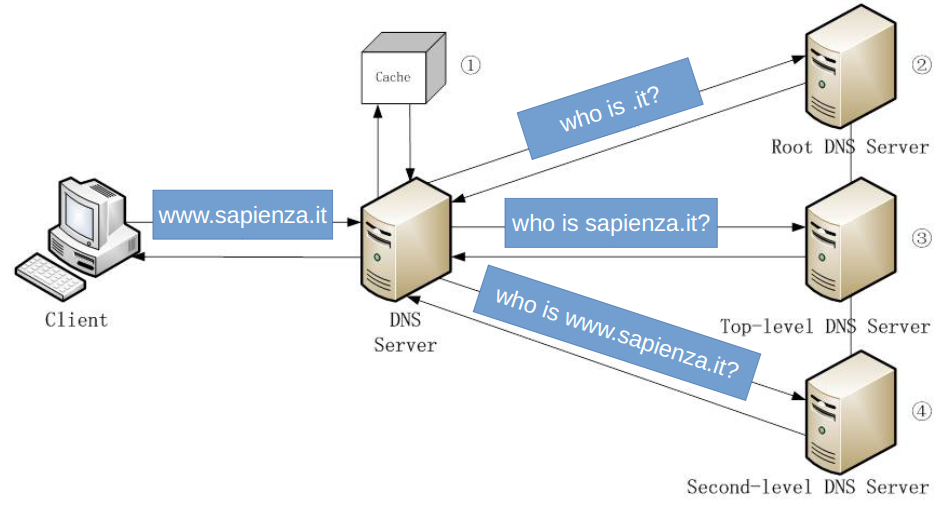
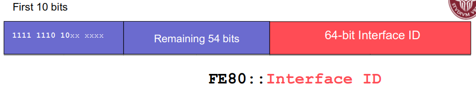
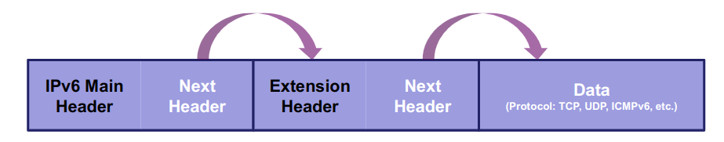
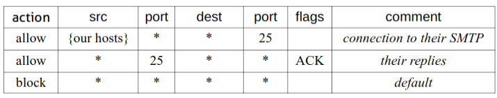
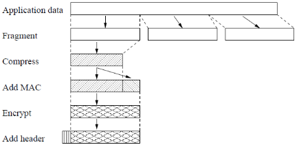
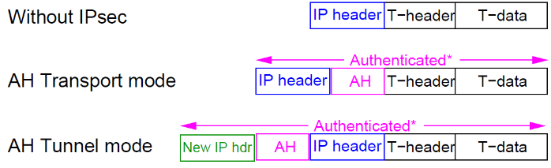
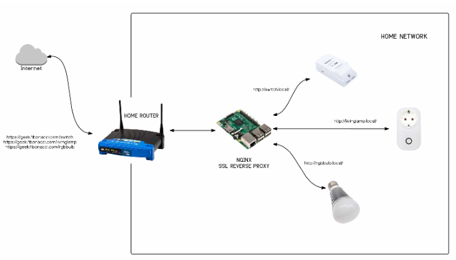

# Practical Network Defense

[[_TOC_]]

## Theory

### Networking refresh

- Internet architecture

  

  - Internet backbone: connecting the ISPs' backbones
  - ISP backbone: connecting organizations' backbones
  - Organization backbone connects local area networks (LANs)
  - LAN connects end systems
  - Edge router connects LANs to Internet
  - Network edge: hosts and servers
  - Network core: routers that connect everybody
- Internet's hierarchical approach

  

  

  - Routers work together to figure out the most efficient path for routing a packet from source to destination host
  - A distributed algorithm can adapt to changing Internet conditions 
  - Routing tables are generated and maintained in real time
  - The core is provided by ISPs that interconnect multiple continents
    - Global or Tier-1
    - Regional or Tier-2
  - Internet Backbone connects tier-1 ISPs
  - The backbones of tier-1 ISPs are interconnected at various access points called Internet eXchange Points (IXP)
- Protocols
  - Specify rules about the desired service
    - Procedure Rules
      - Types and sequences of messages exchanged
        - Syntax and semantics
      - Actions to take with respect to messages and events
    - Message Format: format, size and coding of messages
    - Timing: the time to wait between any event
  - Network congestion and flow control
  - Packet switching: every packet can take a different road than the others
  - Modularization: many protocols for each layer (hides implementation details, a layer can be modified without breaking the others)
- Access layer
  - Ethernet (IEEE 802.3) networks
    - General info
      - Each host in a Ethernet network has a NIC (Network Internet Card) with a (generally) fixed and physical address
        - MAC addresses are 48 bits (6 bytes) long and UNIQUELY identify hosts in the network
        - An Ethernet address tells WHO you are, but does not tell anything on WHERE you are
        - You can not (more or less) change the MAC address of your NIC
      - An Ethernet network constitutes a broadcast domain; frames sent in a broadcast domain are potentially received by all the hosts in the network
    - Packet structure

        

        - Dest and source are MAC addresses
        - Packets are sent to everybody, only the machine with the MAC address matching the dest reads the message
          - Using switches limit the explosion of packets in the network

              

              - Tables of MAC are
                - ARP tables for hosts
                - CAM tables for switches
    - How to build
      - Two computer with a single Ethernet cable
      - Many computer connected with several Ethernet cables to a single device (generally a switch, but also repeater, hubs or bridges)
      - Many computer connected with several Ethernet cables to several devices (generally switches)
- Distribution and core layers
  - Interconnect local networks among them
  - Distribution layer is at level of Autonomous Systems (like big enterprises and ISPs)
  - Core layer is at the level of continents
  - Use IP
    - Logical address
    - You can change IP address of your NIC
      - It is like your home address: it changes if you go somewhere
    - IP addresses are used to identify and reach networks and hosts
    - Versions
      - IPv4 defines IP address with 32 bits organized in four octets (8 bits in each): `69.58.201.25`
      - IPv6 (version 6) has 128 bits: `fe80::250:56ff:fec0:1`
    - Certain bits from the left correspond to the network address (`69.58.201`) and the remaining correspond to define the computer (host) on the network (`25`)
    - Subnet mask defines boundary between network portion and the host portion of the IP address
      - This is used to detect if an IP address is local (so the machine can be called with MAC address) or remote
    - IP addressing
      - Types
        - Unicast (one to one): single destination host
        - Broadcast (one to all): every host on a network or subnet
        - Multicast (one to many): group of IP addresses in a network, not necessarily all of them
      - Classes (classful addressing), old
        - Class A (24 bits for host addresses, or `/8`): `0.0.0.0` to `127.255.255.255`
          - First octet: `0-------` 
          - `127` reserved to `localhost`
        - Class B (16 bits for host addresses, or `/16`): `128.0.0.0` to `191.255.255.255`
          - First octet: `10------` 
        - Class C (8 bits for host addresses, or `/24`): `192.0.0.0` to `223.255.255.255`
          - First octet: `110-----` 
        - Class D (Multicast): `224.0.0.0` to `239.255.255.255`
          - First octet: `1110----` 
        - Class E (Reserved): `240.0.0.0` to `255.255.255.255`
          - First octet: `1111----` 
      - Routable and non-routable address ranges
        - Routable addresses need to be unique on the Internet
        - Non-routable address ranges are defined in `RFC1918` (private)
          - `10.0.0.0 - 10.255.255.255` (`10/8` prefix)
          - `172.16.0.0 - 172.31.255.255` (`172.16/12` prefix)
          - `192.168.0.0 - 192.168.255.255` (`192.168/16` prefix)
            - `192.168.8.0`: network address
            - `192.168.8.255`: broadcast address
            - `.1 to .254`: host addresses
      - Classless addressing
        - Variable Length Subnet Mask (VLSM): specify how many bits of the 32-bit total will specify the network address, the remaining bits specify the host addresses
          - `10.10.10.0/26`: `10.10.10.0/255.255.255.192`
          - `192.168.1.248/30`
            - `2^(32-30) - 2 = 2^2 - 2 = 4 - 2 = 2` hosts (2 usable addresses)
              - `192.168.1.248` is the network address
              - `192.168.1.251` is the broadcast address
          - Large networks can be subnetted: we say things like "There are 64 `/30` subnets in a `/24` network"
          - Many smaller networks can be "supernetted" for routing reasons ("summarization")

#### Exercises

- Determine the network part, the host part, the network size (number of hosts), the network address, the broadcast address and the type of the following IP addresses
  - How to
    1. Convert to binary
    2. Network address: `addr & netmask` concatenated with "/n"
    3. "/n": `32 - zeros_in_netmask`
    4. Broadcast address: `network_addr` with all `1` on the right of the least significant `1` of the `netmask_addr`
    5. First host address; `network_addr + 1`
    6. Last host address: `broadcast_addr - 1` 
    7. Number of hosts: `2^(32 - n) - 2`
    8. Network part: `1` in `netmask_addr` 
    9. Host part: `0` in `netmask_addr`
  - `10.11.12.1` netmask `255.255.255.128`
    - Number of hosts: `128 - 2 = 126`
    - Network address: `10.11.12.0/25`
    - Broadcast address: `10.11.12.127`
    - Type: private, class A
  - `192.168.4.32` netmask `255.255.255.224`
    - Number of hosts: `32 - 2 = 30`
    - Network address: `192.168.4.32/27`
    - Broadcast address: `192.168.4.63`
    - Type: private, class C
  - `172.17.17.17` netmask `255.255.240.0`
    - Number of hosts: `4096 - 2 = 4094`
    - Network address: `172.17.16.0/20`
    - Broadcast address: `172.17.31.255`
    - Type: private, class B
  - `10.11.12.0/21`
    - Number of hosts: `2048 - 2 = 2046`
    - Network address: `10.11.8.0/21`
    - Broadcast address: `10.11.15.255`
    - Type: private, class A
  - `192.168.4.32/27`
    - Number of hosts: `32 - 2 = 30`
    - Network address: `192.168.4.32/27`
    - Broadcast address: `192.168.4.63`
    - Type: private, class C
  - `172.17.17.17/29`
    - Number of hosts: `8 - 2 = 6`
    - Network address: `172.17.17.16/29`
    - Broadcast address: `172.17.17.23`
    - Type: private, class B
- Determine whether the destination IP address is local or remote
  - How to
    - Just check if the network address match
  - Host `210.145.149.123`, netmask `255.255.255.0`, destination `210.145.253.199`
    - Remote
  - Host `192.168.4.189`, netmask `255.255.255.224`, destination `192.168.1.107`
    - Remote
  - Host `10.154.187.89`, netmask `255.192.0.0`, destination `10.152.179.88`
    - Local
  - Host `132.100.45.5`, netmask `255.255.252.0`, destination `132.100.45.45`
    - Local
  - Host `151.251.100.101`, netmask `255.255.0.0`, destination `166.200.110.10`
    - Remote
  - Host `172.32.9.82`, netmask `255.255.255.240`, destination `172.32.9.79`
    - Remote

### Networking lab 101

- Lab solutions: https://gitlab.com/myasnik/sapienza-cybersecurity-practical-network-defense-lab-solutions
- Kathara main commands
  - Start/restart environment: `kathara lstart/lrestart`
  - Stop environment: `kathara lclean`
  - Clean environment: `katara wipe`
  - List virtual networks and virtual interfaces of VMs: `docker network list`
- Configuring a host as a router
  - `ip addr replace $NETADDR/$NETBITS dev $INTERFACE`
  - `iptables -t nat -A POSTROUTING -o $OUTINTERFACE -j MASQUERADE`
- Configuring a host
  - A host has to receive 4 main pieces of information
    - IP address
    - Netmask
    - IP address of its default gateway
    - The IP address of a DNS
  - How to
    - Using `ifconfig`
      - `ifconfig` to assign the IP address
        - `ifconfig $INTERFACE $ADDRTOASSIGN netmask $NETMASK broadcast $BROADCASTADDR`
      - `route` to define the default gateway
        - `route add default gw $GATEWAYADDR $INTERFACE`
      - `/etc/resolv.conf` to specify the DNS server(s)
        ```
        nameserver x.y.z.n
        nameserver q.w.e.r
        ....
        ```
    - Using `ip`
      - `ip addr` to assign the IP address
        - `ip addr add $ADDRTOASSIGN/$NETBITS dev $INTERFACE`
      - `ip route` to define the default gateway
        - `ip route add default via $GATEWAYADDR`
      - `/etc/resolv.conf` to specify the DNS server(s)
        ```
        nameserver x.y.z.n
        nameserver q.w.e.r
        ....
        ```
      - Other useful commands
        - Show interfaces: `ip link show`
        - Set interface up/down: `ip link set $INTERFACE (up|down)`
        - Set MAC address: `ip link set eth0 address $MACADDR`
        - Show IP address: `ip address show [dev $INTERFACE]`
        - Add/remove IP address: `ip address (add|del) $ADDRTODEL/$NETBITS dev $INTERFACE`
        - Flush any IP address (remove the assigned address/es): `ip address flush [dev $INTERFACE]`
        - List/flush routing table: `ip route (list|flush)`
        - Add/del routes
          - Next hop (node to pass through to contact): `ip route (add|del) $NETADDR/$NETBITS via $GATEWAYADDR`
            - In this case all the packets must go through `$GATEWAYADDR` before reaching their destination, even if is local
          - Direct forwarding (all packets of `$INTERFACE` must go to the local network): `ip route (add|del) $NETADDR/$NETBITS dev $INTERFACE`
        - Show ARP cache: `ip neigh show [dev $INTERFACE]`
        - Flush ARP cache: `ip neigh flush dev $INTERFACE`
        - Add/del/change/replace ARP cache entry: `ip neigh (add|del|change|replace) to $IPADDR lladdr $MACADDR dev $INTERFACE nud $STATENAME`
          - `$STATENAME`: permanent, stale, noarp, reachable...
        - IP tunneling (IPinIP, IPinGRE, IPv6 tunneling): `ip tunnel`
          - It is used to transport another network protocol by encapsulation of its packets
    - Using `interfaces` file
      - [Reference](https://www.debian.org/doc/manuals/debian-reference/ch05.en.html#_the_basic_network_configuration_with_ifupdown_legacy)
      - In `/etc/network/interfaces.d/$ARBITRARYNAME`
        ```
        # Example configuration:

        iface eth0 inet static
          address 192.168.100.25
          netmask 255.255.255.248
          gateway 192.168.100.30
          dns-domain dns.com
          dns-nameservers 1.1.1.1
        ```
    - Through DHCP
      - What is it?
        - Server has a pool of IP addresses to distribute, together with the network configuration
        - Client requesting a new IP address receive a proposal and accept it
        - Once accepted, the IP is reserved for a "leasing time"

        
      
      - How to
        - On the router host `udhcpd` (or similar) must be installed
          - In `/etc/dhcpd.conf`
            ```
            # Example configuration:

            start 192.168.100.25 # Start dhcp address
            end 192.168.100.29 # End dhcp address

            interface eth0 # Interface to work with

            opt	dns	1.1.1.1 8.8.8.8 # DNS to set
            option	subnet	255.255.255.248 # Netmask
            opt	router	192.168.100.30 # Gateway address
            ```
          - Run `dhcpd`
        - On clients `dhclient` must be installed
          - `dhclient -v $INTERFACE`

### Network traffic monitoring

- Layering: communication between hosts in the network is organized in tasks, each assigned to a layer
  - Each layer offers a service to the layer above and exploits services offered by layer below
  - It works with encapsulation and decapsulation
    - Each layer adds some protocol information and provides data to the layer below
    - The physical layer (bottom) sends data over the physical medium to the destination
    - The physical layer in the destination sends the data up the "stack"
    - Each protocol in the destination reads the appropriate protocol information and forwards the data to the layer above

    

  - Architectures
    - ISO/OSI: 7 layers
    - TCP/IP: 4 layers
    - Common idea: packet switched network
      - Every packet takes a road that doesn't depend on other packets

    

  - Client-server communication

    

    - Network layer works to calculate the next hop of the packet; when a packet is reassembled in a router then the router works at network layer and learns where to forward the packet
    - Sometimes network layer is not even "used", just link layer is used (we don't have to do packet routing)
  - Addresses
    - Application layer: internet name (ex: www.sapienza.it)
    - Transport layer: port number, there is a mapping between application and port
    - Internet layer: IP address that temporarily identify a network card
    - Data link layer: MAC (medium access control) address that "statically" identify a network card
  - IP packets

    

  - Ports
    - Range: `[0..65535]`
    - Source port: randomly chosen by the OS
    - Destination port determines the required service (application)
      - Assigned Ports `[0..1023]` are said "well-known ports" and used by servers for standard Internet applications
    - Ports `[1024..49151]` can be registered with Internet Application Naming Authority (IANA)
    - Ports `[49152..65535]` ephemeral ports
  - TCP and UDP

    

    

    

    - TCP handshake

      

  - DNS: service to get the IP address from an human-friendly domain name, like www.sapienza.it
    - Hierarchy of entities responsible for domain names

    

    

- Packet capturing
  - Tools
    - `dumpcap`
    - `wireshark/tshark`
    - `tcpdump`
  - Format: `pcap`
  - Functions
    - Live analysis
    - Save captured data
    - Try to "decode" data, reassemble frames and interpret
      - Packets are made of stacked layers
        - Each layer has its own role in the communication
        - Protocol encapsulates other protocols as their data
      - If non-standard ports are used wireshark sometimes fucks up
  - Requirements
    - Promiscuous mode (monitor mode): required to capture packets not intended for the capturing host (remember MAC address and ethernet networks)
      - Old network cards can't handle promiscuous mode
  - Alternative way to capture traffic info (statistics and monitoring)
    - Netflow: if two hosts are communicating you will find two netflows (one from A to B, one from B to A); more high-level point of view
      - `nfcapd`: capture and save
      - `nfdump`: analyze network files
      - `nfsen`: GUI of `nfdump`
        - A lot of graphs are visualized
    - Zeek (Bro): traffic inspection and monitoring (used as an IDS)
  - How to capture the traffic
    - Promiscuous mode
    - Physical trap (not so used)
    - Port mirroring on managed switch: Switched Port Analyzer (SPAN) or Roving Analysis Port (RAP)

        

    - Aggressive approaches
      - ARP cache poisoning (or spoofing): unsolicited ARP replies to steal IP addresses
      - MAC flooding: fill the CAM of the switch to make it acting as a hub
      - DHCP redirection: rogue DHCP server exhausts the IP addresses of the pool, then pretends to be the default gateway of the network with the new DHCP requests
      - Redirection and interception with ICMP: ICMP type 5 (redirect) used to indicate a better route 
  - Prevent packet capture
    - Dynamic address inspection
      - Implemented in switches: Dynamic Address Resolution Inspection (DAI) validates ARP packets
      - IP-to-MAC address binding inspection, drop invalid packets
    - DHCP snooping
      - Implemented in switches: distinguishes between trusted and untrusted ports and uses a database of IP-to-MAC
      - Ports that show rogue activity can also be automatically placed in a disabled state
  - Wireshark how to
    - Filters
      - Types
        - Display: inspect only the packets you want to analyze once the data has been processed (all packets captured)
          - Filter syntax
            - Comparison operators
            - Filters use types (strings where numbers are required return errors)
            - Common logical operators
            - Filters can be built interacting with the packets (click)
        - Capture: limit the amount of network data that goes into processing and is getting saved (packets not captured are lost)
          - Filter syntax: Berkeley Packet Filter (BPF), `man pcap-filter` (question at exam)
            - General syntax: `protocol direction type`
              - Protocol: `ether, tcp, udp, ip, ip6, arp`
              - Direction: `src, dst`
              - Type: `host, port, net, portrange`
              - Other primitives: `less, greater, gateway, broadcast`
              - Combinations with operators: `and (&&), or (||), not (!)`
      - [GeoIP resolver](https://wiki.wireshark.org/HowToUseGeoIP): enables filters like `ip.geoip.country eq "China"`

### IPv6 addressing

- Introduction
  - 128-bit address space, written in hexadecimal: `2001:DB8:CAFE:0001::100`
  - 340 undecillion addresses (a huge lot)
  - Why? We are running out of IPv4 address space
  - Packet header
  
    

  - Features: in general
    - Stateless auto configuration: take a random address and hope that this isn't took by someone else
    - No need of NAT, end to end reachability
      - IETF continues to state that NAT is not a security feature
    - Better support for mobility (mobile networks?)
    - Peer-to-peer networking easier to create and maintain (no need of NAT), and services such as VoIP and Quality of Service (QoS) become more robust
- Hex and IPv6 address representation
  - In hex `4 bits = 1 hex digit`

    

  - IPv6 notation

    

    - Eight 16-bit segments or "hextets" between `0000` and `FFFF` separated by colons
  - Compressing addresses
    1. Omitting leading `0`s

       

    2. Double Colon `::`

       

    - Example

      

    - Note: if there are multiple possible reductions the longest string of zeroes must be replaced with the `::` and if they are equal then only the first string of `0`s should use the `::` representation
- Address types

  

  - NO BROADCAST ADDRESSES
  - Source and destination addresses
    - Source: always a unicast (Link-local or Global Unicast Address)
    - Destination: unicast, multicast, or anycast
- Global Unicast Address (GUA): equivalent of public IPv4 address
  - `2000::/3` (first hextet: `2000::/3` to `3FFF::/3`)
    - Range: `2000::/64` thru `3fff:ffff:ffff:ffff::/64`
    - First three bits (`001`) must remain the same, the next can change

    

  - Globally unique and routable
  - Similar to public IPv4 addresses
  - `2001:DB8::/32`: reserved range for documentation
  - All end users will have a global unicast address
    - Note: a host (an interface) can potentially have multiple IPv6 addresses on the same or different networks
  - Terminology
    - Prefix: equivalent to the network address of an IPv4 address
    - Prefix length: equivalent to subnet mask in IPv4
    - Interface ID: equivalent to host portion of an IPv4 address
  - Parts of address

    

    - `3-1-4` rule

      

- Link-local unicast
  - `FE80::/10`
    - Range: `FE80::/64` thru `FEBF:ffff:ffff:ffff::/64` (should)

    

    

  - Used to communicate with other devices **on the same link** (if a router is in the middle this doesn't work, just a switch; works only point to point)
    - Used as a source IPv6 address before a device gets one dynamically
    - Router’s link-local address is used by devices as the default gateway
  - Are NOT routable off the link (network)
  - Only have to be unique on the link
  - Not included in the IPv6 routing table
  - An IPv6 device must have at least a link-local address
  - Created
    - Automatically
      - `FE80` (usually): first `10` bits
      - Interface ID
        - EUI-64 (Cisco routers): created using MAC address

          

        - Random 64 bits (many host operating systems)
    - Static (manual) configuration
- SLAAC (Stateless Address Autoconfiguration): pick an address and use it
  - Address resolution: ICMPv6 Neighbor Discover Protocol

    

  - Dynamic address allocation: Router Solicitation Message and Router Advertisement Message

    
    
    

    1. Option 1 (stateless): SLAAC, No DHCPv6 (Default on Cisco routers)

       

       - Instead of using EUI-64 you could also choose a random address
       - Ensuring unique unicast addresses: Duplicate Address Detection (DAD)

         

    2. Option 2 (stateless): SLAAC + Stateless DHCPv6 for DNS address

       

       

       - Duplicate Address Detection (DAD) should be used also here
    3. Option 3 (stateful): All addressing except default gateway use DHCPv6

       

       

- DHCPv6 Prefix delegation: in IPv4 this practice could be seen as getting IP from ISP then using NAT; here (NAT doesn't exist) is getting a PREFIX which is globally routable, a big bounch of addresses reserved to me that "my router assign" (methods above) to my subnet machines
  - So you get an address for the router and a prefix for the machines attached to the router
  - If you want to not expose internal machines of your network you can do this using a firewall

  

- Unique local: like private address in IPv4
- Multicast: send a single packet to multiple destinations simultaneously (one-to-many)
  - Equivalent to `224.0.0.0/4` in IPv4
  - Types
    - Solicited-Node
      - `FF02::1:FF00:0000/104`
      - Used in neighbour solicitation
    - Assigned
      - `FF00::/8`

        

        

        - Scope: define the range of the multicast packet

          

          - `0`: reserved
          - `1`: interface-local
          - `2`: link-local
          - `5`: site-local
          - `8`: organization-local
          - `E`: global
        - Flag
          - `0`: permanent, well-known multicast address assigned by IANA, includes both assigned and solicited-node multicast addresses
          - `1`: non-permanently-assigned, "dynamically" assigned multicast address; an example might be `FF18::CAFE:1234`, used for a multicast application with organizational scope
      - Assigned with link-local scope

        

      - Assigned with site-local scope

        

        - DHCP could be not in your subnet, using those addresses (scoped for DHCP) we can reach another site outside out local net
        - Router should enable `ipv6 multicast-routing`
      - "All IPv6 Devices" assigned: `FF02::1`

        

        

        - Router should enable `ipv6 unicast-routing`
      - "All IPv6 Routers" assigned: `FF02::2`

        

        

        - Router shoudl enable `ipv6 unicast-routing`

- IPv6 vs IPv4
  - Header

    

    

    - Differences
      - Version
        - IPv4: `4`
        - IPv6: `6`
      - IHL (IPv4)
        - IPv4 Internet Header Length (IHL): length of IPv4 header in 32-bit words including any Options or Padding
        - IPv6: IHL for IPv6 is not needed, IPv6 header is fixed at `40` octects
      - Traffic class (IPv6) ~= Type of service (IPv4): like priority level and something like this to better handle the packet, not so used
      - Flow label (IPv6): used to identify the packets in a common stream or flow; traffic from source to destination share a common flow label, not so used
      - Payload length (IPv6) ~= Total length (IPv4)
        - IPv4: number of bytes of the header of options + data
        - IPv6: payload length (IPv6 header is fixed)
      - Fragmentation (IPv4): fields used for fragmentation and reassembly
        - IPv4

          

        - IPv6: routers do not perform fragmentation, handled by the source and the destination using an extension header

          

      - Next header (IPv6) ~= Protocol (IPv4): type of header following the IP header
      - TTL (Time to Live) (IPv4) = Hop Limit (IPv6): set by source, every router in path decrements hop limit by `1`, when `0` drop packet
      - Source and destination address: the same, change the size
      - Header Checksum (IPv4)
        - Not used in IPv6, upper-layer protocols generally have a checksum (UDP and TCP)
        - Because it’s not in IPv6, the UDP checksum is now mandatory
      - Options and Padding (IPv4)
        - Not used in IPv6
        - Padding makes sure IPv4 options fall on a 32-bit boundary
        - IPv6 header is fixed at 40 octects
      - Extension header (IPv6)
        - Next Header identifies the protocol carried in the data portion of the packet and the presence of an extension header
        - I could have more than one extension header
        - IPv4 options vs IPv6 extensions
          - IPv4 options: processed in each routerslow down packets
          - IPv6 extensions (except Hop-by-Hop): are processed only by the destination

        

        

          - Extensions order

            

### Firewall

- Traffic regulation
  - Devices
    - Router: connect two networks, can apply some packet filters (limited)
    - Firewall: router that implements rules to determine whether packets are allowed to travel form one network to another
      - Restrict access from the outside
      - Restricts people from leaving (sending out specific packets)
  - Policy: rules of our network
    - Regulate which traffic is allowed (sources, destinations, services, ...)\
    - Protect the traffic by encryption
    - Monitor the traffic for "bad behaviour"
    - Monitor the hosts for "bad behaviour"
    - ...
  - Firewall basic concepts
    - Least privilege: as few as possible privileges
    - Defense in depth: several layers of security
    - Choke point: single point where you can check what happens in the net
    - Weakest links: consider the security of the system as the security of the weakest point 
    - Fail-safe stance: if something goes wrong prefer a denial of service rather than something "open"
    - Universal participation: all the systems work together to protect the net (from the point of view of humans)
    - Diversity of defense: use different types of defenses
    - Simplicity: use simple methods to protect the net, keep it simple stupid (not always possible)
  - Host based packet filters: kind of firewall that disciplines the traffic in/out a single host (personal firewall)
    - It specifies the packets that can be received and sent
    - Ex: `iptables`, `windows firewall`...
    - Vendor products generally work per-app: each installed application has a known policy that has to obey
  - Network Access Control Lists
    - List the rights for accessing/using networks (in switches, routers and firewalls)
    - Usually distinguish between incoming and outgoing traffic, per interface/port
      - Ex: lists of IP addresses that can send packets to an interface/port
    - Stateless: every packet is treated independently, without any knowledge of what has come before
    - Examples
      - Screening router (ACL-based)

        

      - Dual-homed host
        - Check also the packet content and filter for bad things
        - Bastion host
          - Hardened computer used to deal with all traffic coming to a protected network from outside
            - Hardening is the task of reducing or removing vulnerabilities in a computer system
              - Shutting down unused or dangerous services
              - Strengthening access controls on vital files
              - Removing unnecessary accounts and permissions
              - Using "stricter" configurations for vulnerable components, such as DNS, sendmail, FTP, Apache, Tomcat, ...
          - Specially suitable for use as Application Proxy Gateways
        
        
  
  - DMZ (demilitarized zone): computer host or small network inserted as a "neutral zone" between a company's private network and the outside public network (provides secure segregation of networks)
    - DMZ use has become a necessary method of providing a multilayered, defense-in-depth approach to security
      - Defense in depth: security approach in which IT systems are protected using multiple overlapping systems
        - Add redundancy to the defensive measures
        - Aim to remove the single point of failure
        - Find the right balance between complexity and multiplicity of defense measures
        - In order to compromise the system, an attacker has to find multiple vulnerabilities, in different components
    - Reduce and regulate the access to internal (private) components of the IT system
    - Examples
      - DMZ as a screened host

        

        - Not the best, if bastion is violated then the attacker is inside the network
        - This configuration is used for VPNs
      - Screened subnet using two Routers/Firewalls

        

      - DMZ to segment the network

        

      - Split DMZ

        

  - Packet filters (stateless firewall)
    - Drop packets based on their source or destination addresses or port numbers or flags
    - No context, only contents
    - Can operate on:
      - incoming interface
      - outgoing interface
      - both
    - Check packets with fake IP addresses:
      - from outside ("ingress filtering")
      - from inside ("egress filtering")
    - Operating layers

      

    - Process of packet filtering
      1. Know your policy
      2. Translate the policy in a formal language
         - E.g.: logical expression on packet fields
      3. Rewrite the policy in terms of the firewall syntax
         - General mechanism
           - Rules are checked from top to bottom
           - The first matching rule is applied
           - One implicit rule is assumed if no rule matches
           - Block/Allow everything
         - Rules table

           
      
      - Examples
        - Good
          - Allow inbound email (SMTP, port 25) only to our-gateway machine Mailgw
          - Refuse all traffic from a known spamming site: demon

          

        - Bad
          - Any inside host can send mail to the outside

            

            - Very bad: we can not control the type of traffic originated from port 25 and coming from the outside
            - Then: rules have to specify the direction of the traffic (using flags)

              

              

      - More complex network topology

        

        - Policy
          - Internal Net 1 is a DMZ and only hosts Mail GW
          - Very limited connections between Mail GW and Internet (only partner servers)
          - Limited connections allowed between Mail GW and net 2 and net 3
          - Anything can pass between net 2 and net 3
          - Outgoing requests only between net 2 or net 3 and the link to the Internet
        - Requirements
          - We cannot only consider where packets have to go
            - Open access to net 2 only allowed for traffic with source address in net 3
            - No way to avoid fake source addresses (address spoofing) from outside
          - We need to define rules based on from where packets are arriving
        - Configuration
          - Router/FW

            

          - Interface on net 1

            

          - Interface on net 2

            
        
      - Problems of packet filtering
        - Only a small number of parameters, not flexible
          - Example problem

            

            

            

        - Payload of TCP packet is not inspected
          - Abnormal fragmentation: bypass the firewall and deliver a message that has the SYN bit set simply overwriting TCP header using bad fragmentation

            

        - Limited logging ability
        - No authentication facilities
        - Susceptible to attacks based on vulnerabilities in various implementations of TCP and/or IP
- Stateful firewalls (Dynamic Packet Filters)
  - Stateless + can keep track of established connections
  - Layers

    

  - Connection tracking 

    

    - Setting up connection
      - Client calls from (high-numbered) port to port for application on server
      - Server replies to (high-numbered) port on client
      - Connection is considered established when the server gives correct SYN/ACK response
    - Closing connection
      - Both parties have to close the connection by sending a TCP packet with FIN flag set before connection is considered closed
  - Extending this to other protocols (UDP)
    - Here state is based on time

    

- Other types of firewalls
  - Host based firewalls: individual host to protect that one machine
    - Selectively enable specific services and ports that will be used to send and receive traffic
  - Application-Level filtering (proxy-like)

    

    - Need a separate special-purpose mechanism for each application
      - Example: mail filters, FTP, HTTP proxy
      - Big overhead, but can log and audit all activity
    - The proxy could require authentication
    - Pros and cons
      - Pros
        - Logging capacity
        - Caching
        - Intelligent filtering
        - User-level authentication
        - Protect for wrong implementations
      - Cons
        - Introduce lag
        - Application-specific
        - Not always transparent
  - Circuit-level gateways (or generic proxy, aka TCP relay): the client connect to a proxy that relays its connections in a protocol-independent manner

    

    - Provide user-authentication
    - Usually no content filtering
    - Standard: SOCKS5
    - Example: Tor
    - TCP relay: `ssh -D 12345 <remote_host>`
      - Simply a proxy that is application-agnostic, it forwards all the TCP traffic
      - Similar to VPN but the VPN can also forward IP traffic

      

- Routed vs Transparent firewall modes
  - In routed mode, a firewall is a hop in the routing process
    - It IS a router responsible of its own (internal) networks
  - In transparent mode, a firewall works with data at Layer 2 and is not seen as a router hop to connected devices

  

- IPtables
  - IPtables fundamentals
    - The rules are grouped in tables
    - Each table has different CHAINS of rules
    - Each packet is subject to each rule of a table
    - Packet fates depend on the first matching rule, next are ignored
  - To see chains and rules of the filter table: `iptables -L`, better `iptables -L -n -v --line-numbers`
  - Filter table
    - Three built-in rule chains
      - INPUT: packets for us
      - OUTPUT: packets generated by us
      - FORWARD: packets not for us
    - If a packet reaches the end of a chain, then is the chain policy to determine the fate of the packet (DROP/ACCEPT)

    

  - Create and save rule set
    - You can save in a shell script the sequence of the iptables commands
    - You can use the built in commands
      - `iptables-save > iptables_rules.bk`
      - `iptables-restore < iptables_rules.bk`
  - Useful parameters

    

    

  - "Targets"
    - `ACCEPT`
    - `DROP`: packet is blocked
    - `REJECT`: packet is blocked, but it  also sends an error message to the source host
      - Example "explanation": `--reject-with <qualifier> <qualifier> is an ICMP message`
    - `LOG`: the packet is sent to the syslog daemon for logging
      - You can't log and drop at the same time -> use two rules
  - Extension modules examples
    - Allow both port 80 and 443 for the webserver on inside: `iptables -A FORWARD -s 0/0 -i eth0 -d 192.168.1.58 -o eth1 -p TCP --sport 1024:65535 -m multiport --dport 80,443 -j ACCEPT`
    - The return traffic from web server is allowed, but only of sessions are established: `iptables -A FORWARD -d 0/0 -o eth0 -s 192.168.1.58 -i eth1 -p TCP -m state --state ESTABLISHED -j ACCEPT`
    - If sessions are used, you can reduce an attack called half open (consume server all free sockets, denial of service attack)

### Network traffic regulation and NAT

- NAT - Network Address Translation
  - Routable vs Non-routable IP address
    - Routable addresses need to be unique on the Internet to be PUBLICLY reachable -> public IP addresses
    - Non-routable addresses -> Special-Purpose Address IP addresses
      - Private addresses (https://www.iana.org/go/rfc1918), used in NAT:
        - `10.0.0.0 - 10.255.255.255` (`10/8` prefix)
        - `172.16.0.0 - 172.31.255.255` (`172.16/12` prefix)
        - `192.168.0.0 - 192.168.255.255` (`192.168/16` prefix)
      - Loopback addresses (https://www.iana.org/go/rfc1122):
        - `127.0.0.0–127.255.255.255` (`127/8` prefix)
      - Shared address space (https://www.iana.org/go/rfc6598), used by ISPs:
        - `100.64.0.0–100.127.255.255` (`100.64/10` prefix)
      - Full list on [iana website](https://www.iana.org/assignments/iana-ipv4-special-registry/iana-ipv4-special-registry.xhtml)
  - Basic features 
    - Created not for security but just for connection (we had not so much addresses)
    - Connecting to the Internet a LAN using un-routable in-house LAN addresses
    - Can filter requests from hosts on WAN side to hosts on LAN side
    - Allows host requests from the LAN side to reach the WAN side
    - Does not expose LAN hosts to external port scans
  - Goals
    - A private network uses just one IP address provided by ISP to connect to the Internet
    - Can change address of devices in private network without notifying outside world
    - Can change ISP without changing the address of devices in private network
    - Devices inside private network are not explicitly addressable by external network, or visible by outside world (a security plus)
  - Types
    - Source NAT (SNAT)

      

      - NAT table: where associations between requests and internal IP addresses are kept
      - Types
        - Basic NAT: a block of external/public IP addresses are set aside for translating the addresses of hosts within a private domain as they originate sessions to the external domain
        - Network Address Port Translation (NAPT/PAT): also translates transport identifiers, e.g., TCP and UDP port numbers as well as ICMP query identifiers
          - Multiplex a number of private hosts into a single external/public IP address
          - The terms NAT and NAPT are used interchangeably in the literature
          - How it works

            

          - Incoming requests (see DNAT, ex: p2p..)
            - Application Level Gateways (ALGs)
            - Static port forwarding
            - Universal Plug and Play (UPnP) Internet Gateway Device (IGD) protocol
            - Traversal Using Relays around NAT (TURN)
    - Destination NAT (DNAT)

      

      - Enables servers located inside the firewall/router LAN to be accessed by clients located outside
      - It is also called port forwarding or Virtual Server
      - According to the port accessed from the external interface, the packets can be forwarded towards different internal hosts

        

  - Pros and cons
    - Pros
      - The need to establish state before anything gets through from outside to inside solves one set of problems (firewall for free)
      - The expiration of state to stop receiving any packets when finished with a flow solves a set of problems (reuse ports)
      - The ability for nodes to appear to be attached at the edge of the network solves a set of problems (it appears that you have a public IP, no one knows you are using NAT)
      - The ability to have addresses that are not publicly routed solves yet another set (firewall for free)
      - Simple Gateway between Internet and Private Network
      - Simple Security Due to Stateful Filter Implementation
      - User/Application Tracking (collect information about users and the app you are using)
      - Privacy and Topology Hiding (you can not know number of hosts behind NAT)
      - Independent Control of Addressing in a Private Network (organize addressing in any independent way without influencing the outside)
      - Global Address Pool Conservation (save pubblic IP addresses)
      - Multihoming and Renumbering with NAT (your network can have multiple ISPs, you can have backup links and the private network doesn't change)
    - Mapping IPv4 and IPv6: there's no need of NAT!

      

    - Cons
      - Applications not working with NAT
        - Types
          - Applications that have realm-specific (public or private) IP address information in payload
          - Bundled session applications
          - Peer-to-peer applications
          - IP fragmentation with NAPT enroute
          - Applications requiring retention of address mapping
          - Applications requiring more public addresses than available
          - Encrypted protocols like IPsec, IKE, Kerberos
        - Possible mitigation
          - Write applications that do not have IP info in the payload
          - Use NAT in conjunction with Application Layer Gateways: inspect payload and translate the IP address inside the payload
            - Gateways specific for making NAT working with a given application
            - Look for specific application traffic and perform IP/port translation also in the payload
          - Use Interactive Connectivity Establishment (ICE)
            - Using STUN servers and TURN servers, like a third party mirror
          - Unlikely to find a solution for encrypted application traffic
          - Hole punching: establishing bidirectional connections between Internet hosts, both in private networks using NAT
            - Uses STUN/TURN

            

            1. Host A submits the request for communication with Host B to Host S
            2. Host S submits the public endpoint (port 4000) of Host A to Host B
            3. Host B sends a packet via its public-private endpoint (port 5000) to the public endpoint of Host A (4000).
               1. The NAT system of Host A rejects the packet, but a NAT session on B's side is now established ("a hole is punched"), ready to translate any packets from A's public endpoint (port 4000) to B's public endpoint (port 5000) into B's corresponding private endpoint
            4. Host B notifies Host S and awaits an incoming connection from Host A
            5. Host S submits the public endpoint of Host B (port 5000) to Host A
            6. Host A uses its public-private endpoint (port 4000) to establish a connection with Host B's public endpoint (port 5000)

- IPtables
  - Basics
    - The rules are grouped in "tables"
    - Each table has different "chains" of rules and different possible "targets" (packet fates)
    - Each packet is subject to each rule of a chain
    - Packet fates depend on the first matching rule
    - To see chains and rules of the filter table: `iptables -L` or for extended output `iptables -L -n -v --line-numbers`
  - Tables
    - Mangle: manipulate bits in TCP header
      - Chains
        - PREROUTING: incoming packets before a routing decision
        - INPUT: packets coming into the machine itself
        - OUTPUT: locally generated outgoing packets
        - FORWARD: packets being routed through the machine
        - POSTROUTING: packets immediately after the routing decision
    - Filter: packet filtering
      - Chains
        - INPUT: incoming packets intended for the filtering machine
        - OUTPUT: outgoing packets
        - FORWARD: for the packets that are not intended for this machine
          - Only used when the machine is configured as a router (`net.ipv4.ip_forward` to `1` in the `/etc/sysctl.conf` file)
    - NAT: translate the packet's source field or destination field
      - Interacts with filter table
      - Only the first packet in a stream will hit this table (the rest of the packets will automatically have the same action)
      - Special targets (packet fates/actions)
        - DNAT: destination nat
          - Transform the destination IP of incoming packets
          - Used in PREROUTING chain
        - SNAT: source nat
          - Transform the source IP of outgoing packets
            - Can be done one-to-one or many-to-one
          - Used in POSTROUTING chain
        - MASQUERADE: dynamic nat (when fw interface address is dynamically assigned)
          - Like SNAT but the source IP is taken form the dynamically assigned address of the interface
        - REDIRECT: redirects the packet to the machine itself
    - RAW: exceptions to connection tracking
      - Used only for specific reasons
      - Default: not loaded
  - Chain and table priorities

    

    - Chain priority: MANGLE>NAT>FILTER
      - RAW>MANGLE
        - Not shown in the picture
        - Only used during PREROUTING and OUTPUT
  - User defined chains
    - It is possible to specify a jump rule to a different chain within the same table
    - The new chain must be user specified
    - If the end of the user specified chain is reached, the packet is sent back to the invoking chain

    

  - Logging
    - LOG as possible target
      - "non-terminating target", i.e. rule traversal continues at the next rule
      - To log dropped packets, use the same DROP rule, but with LOG target
    - Kernel log directives
      - `--log-level level`: specifies the type of log (emerg, alert, crit, err, warning, notice, info, debug)
      - `--log-prefix prefix`: add further information to the front of all messages produced by the logging action
    - Examples
      - Log fowarded packets: `iptables -A FORWARD -p tcp -j LOG --log-level info --log-prefix "Forward INFO"`
      - Log and drop invalid packets
        - `iptables -A INPUT -m conntrack --ctstate INVALID -j LOG --log-prefix "Invalid packet"`
        - `iptables -A INPUT -m conntrack --ctstate INVALID -j DROP`

### Link local attacks

- Network eavesdropping/sniffing
  - Basis
    - Capturing packets from the network transmitted by others' nodes and reading the data content in search of sensitive information
    - Done by using tools called network sniffers (or protocol analyzers)
    - Work in passive mode
  - How to
    - Networking interface in promiscuous mode (receive all traffic even if not intended for your NIC)
    - Sniffer must be along the path or, at least, in the same network
      - Non-switched LAN (LAN with HUBs): the ideal case because the hub duplicates every frame to all ports
      - LAN with switches
        - Breaking switch segmentation: convince switch to duplicate the packet not only in the correct output port but also in the one in which we are listening
          - CAM Table (Content Addressable Memory): stores information such as MAC addresses available on physical ports with their associated VLAN parameters
            - Has a fixed size
            - Must be extremely efficient
            - As frames move in the switches, the CAM is filled with the MAC addresses (source MAC address are associated with the related port)
            - **If a MAC is unknown, it is replicated on ALL the ports -> flood**
          - CAM overflow: just fill the CAM table with a bunch of fake MACs so that the switch sends to everyone packets switched
            - Behaviors
              - Switch starts flooding (attack success)
              - Switch freezes (denial of service)
              - Switch crash (denial of service)
            - Today not really effective
              - Allows you to specify MAC addresses for each port, or to learn a certain number of MAC addresses per port
              - Upon detection of an invalid MAC the switch can be configured to block only the offending MAC or just shut down the port
        - Performing ARP spoof attack to redirect the traffic from one port to another (possible Man-In-The-Middle attack)
      - Wireless LAN: possible if no encryption is used or weak encryption is used (scenario becomes equivalent to LAN with HUBs)
- ARP poisoning
  - ARP
    - General explanation
      - An ARP request message should be placed in a frame and broadcast to all computers on the network
      - The computer mentioned in the request sends a response; all other computers process and discard the request without sending a response
    - Example
      - Host A has the IP address of host B, it knows it is in the same network so it has to use Ethernet; it needs to know the MAC address of host B: it broadcasts an ARP request for IP of host B (MAC Dest = `ff:ff:ff:ff:ff:ff`)

        

      - Host B sends back an ARP-reply: the ARP reply has the MAC address of B as source and MAC address of A as destination (was in the original ARP-request)

        

      - Host a can finally send the IP packet

        

    - ARP table: dynamic table that holds the IP-MAC pairings
      - Accessed before sending any Ethernet frame
      - It starts empty and is filled as the MAC addresses are collected
      - Unused MAC addresses are removed after a timeout (address ageing) in the order of minutes
      - According to RFC 826 (ARP), when receiving an ARP reply, the IP-MAC pairing is updated
    - Gratuitous ARP: used by hosts to "announce" their IP address to the local network and avoid duplicate IP addresses on the network (usually disabled because unsafe)

      

      - Misuse: ARP has no security or ownership of IP or MAC addresses so an host X could impersonate every other host, for example Y, simply sending a gratuitous ARP with IP of Y
  - With an ARP spoofing you can pretend to be anybody
  - Attacks
    - Denial of service: drop packets
    - MITM: intercept the traffic and reroute it to get the reply, then forward the reply back... in the meanwhile, sniff/forge/alter

      

      

- IPv6 Neighbor Discovery threats
  - Address Resolution: IPv4 and IPv6

    

  - IPv6 Neighbor Solicitation and Neighbor Advertisement

    

    

    

  - ICMPv6 Duplicate Address Detection (DAD)

    

  - ICMPv6 Redirect
    - Like IPv4: a router informs an originating host of the IP address of a router that is on the local link and is closer to the destination

      

    - Unlike IPv4: a router informs an originating host that the destination host (on a different prefix/network) is on the same link as itself

      

    - Solution: reject redirects
      - `/proc/sys/net/ipv4/conf/all/accept_redirects -> FALSE`
      - `/proc/sys/net/ipv4/conf/all/secure_redirects -> FALSE`
      - `/proc/sys/net/ipv4/conf/all/shared_media -> FALSE`
      - `/proc/sys/net/ipv6/conf/all/accept_redirects -> FALSE`
  - Threats:
    - Non router/routing related threats
      - Neighbor Solicitation/Advertisement Spoofing
      - Neighbor Unreachability Detection (NUD) failure
      - Duplicate Address Detection DoS Attack
    - Router/routing involving threats
      - Malicious Last Hop Router
      - Default router compromise
      - Spoofed Redirect Message
      - Bogus On-Link Prefix
      - Bogus Address Configuration Prefix
      - Parameter Spoofing
    - Replay attacks
    - Neighbor Discovery DoS Attack
- IPv6 Rogue RA (or RA spoofing): IPv6 enabled system receives a router advertisement, if SLAAC enabled it will be part of another network and will receive a new route, optionally a default gateway...
  - Common problem: VPN bypass (tunnel split)
  - In the end, with control of DNS and IPv6, the attacker can do anything
- IPv6 RA flooding: flooding IPv6 hosts with Router Advertises, old OSes (Windows Vista/7/8) boxes frozen
- Rogue DHCP (DHCP starvation): DoS a network by requesting all of the available DHCP addresses
  - Once the addresses are gone, an attacker could use a rogue DHCP server to provide addresses to clients
  - Since DHCP responses include DNS servers and default gateway entries, the attacker can PRETEND to be anyone...\
  - Mitigations
    - RFC7610 F. Gont, W. Liu, G. Van de Velde, "DHCPv6-Shield: Protecting against Rogue DHCPv6 Servers", August 2015, Best Current Practice
    - DHCP snooping
    - Dynamic ARP inspection
    - IEEE 802.1x
- IPv6 attack tools
  - https://github.com/vanhauser-thc/thc-ipv6
  - https://github.com/fgont/ipv6toolkit

### VPN, SSL/TLS and IPSec

- VPN principles
  - Definition: a virtual network, built on top of an existing network infrastructure, which can provide a secure communications mechanism for data and other information transferred between two endpoints
    - Based on the use of encryption
  - Goals
    - Traditional
      - Confidentiality of data
      - Integrity of data
      - Peer Authentication
    - Extended
      - Replay Protection: avoid reusing old packets
      - Access Control: control who can use a VPN
      - Traffic Analysis Protection: if the attacker is at network endpoints he can extract information about the traffic (based for example on packet timing)
    - Usability
      - Transparency: VPN should be invisible to users, software, hardware
      - Flexibility: VPN can be used between users, applications, hosts, sites
      - Simplicity: VPN can be actually used
  - Types
    - Site to site

      

    - Host to site

      

    - Host to host

      

  - Possible VPN layers
    - Application
    - Transport (MOST USED) 
    - Network (MOST USED)
    - Data link
    - Physical
- SSL Tunneling
  - Tunneling: operation of a network connection on top of another network connection that allows two hosts or sites to communicate through another network that they do not want to use directly
    
    

    - Site to site: enables a PDU to be transported from one site to another without its contents being processed by hosts on the route
      - Encapsulate the whole PDU in another PDU sent out on the network connecting the two sites (and encrypt the content)
        - Encapsulation and encryption takes place in edge router on src. site
        - Decapsulation and decryption takes place in edge router on dst. site
      - Host-to-host communication does not need to use IP
      - Dst. address in IP header is for dst. edge router
      - Based on where the tunnel starts and stops we have different types of VPNs (see above)

      

  - Secure Socket Layer (SSL)
    - SSL 3.0 has become TLS standard with small changes
    - Applies security in the Transport layer
    - If implemented on boundary routers (or proxies), can provide a tunnel between two sites, typically LANs
    - Placed on top of TCP, so no need to change TCP/IP stack or OS
    - Optional server authentication with public key certificates
      - HTTPS example (HTTP on top of TLS)

        

    - Architecture
      - Handshake: used to authenticate server (and optionally client) and to agree on encryption keys and algorithms
      - Change cipher spec: selects agreed keys and encryption algorithm until further notice
      - Alert: transfers information about failures

      

    - How it works
      - Packet
        1. Fragmentation into blocks of ≤ 214 bytes
        2. (optional) Lossless compression
        3. Addition of a keyed MAC, using a shared secret MAC key
        4. Encryption, using a shared secret encryption key
        5. Addition of header indicating Application protocol in use

        
      
      - Handshake

        

        1. Hello - Establishment of security capabilities
           1. Client sends list of possibilities, in order of preference
           2. Server selects one, and informs Client of its choice; parties also exchange random noise for use in key generation
        2. Server authentication and key exchange
           1. Server executes selected key exchange protocol (if needed)
           2. Server sends authentication info (e.g. X.509 cert.) to Client
        3. Client authentication and key exchange
           1. Client executes selected key exchange protocol (mandatory)
           2. Client sends authentication info to Server (optional)
        4. Finish
           1. Shared secret key is derived from pre-secrets exchanges in 2, 3
           2. Change Cipher Specification protocol is activated
           3. Summaries of progress of Handshake Protocol are exchanged and checked by both parties
      - Security capabilities: string that summarizes the type of encryption we are using
        - Specifies
          - Version of SSL/TLS
          - Key exchange algorithm
          - Grade of encryption (previous to TLSv1.1)
          - Encryption algorithm
          - Mode of block encryption (if block cipher used)
          - Cryptographic checksum algorithm
        - Example: `TLS_RSA_WITH_AES_128_CBC_SHA`
    - SSL VPN
      - Architecture
        - Models
          - SSL Portal VPN
            - Allow remote users to:
              - Connect to VPN gateway from a Web browser
              - Access services from Web site provided on gateway
          - SSL Tunnel VPN
            - Allow remote users to:
              - Access network protected by VPN gateway from Web browser allowing active content
            - More capabilities than portal VPNs, as easier to provide more services
      - Functionalities
        - Proxying: intermediate device appears as true server to client (ex: NordVPN)
        - Application Translation: conversion of information from one protocol to another (e.g. Portal VPN offers translation for applications which are not Web-enabled, so users can use Web browser to access applications with no Web interface)
        - Network Extension: provision of partial or complete network access to remote users, typically via Tunnel VPN
          - Two variants
            - Full tunneling: all network traffic goes through tunnel
            - Split tunneling: organisation's traffic goes through tunnel, other traffic uses remote user's default gateway
      - Services
        - Authentication
        - Encryption and integrity protection
        - Access control
        - Endpoint security controls: validate the security compliance of clients attempting to use the VPN (e.g. presence of antivirus system, updated patches etc.)
        - Intrusion prevention: evaluates decrypted data for malicious attacks, malware etc.
- VPN device placement
  - Affects
    - Security
    - Functionality
    - Performance
  - Main options
    - VPN functionality in firewall

      

      - Advantages
        - No holes in FW between external VPN device and internal network
        - Traffic between device and internal network must go through FW
        - Simple network administration since only one "box" to administer
      - Disadvantages
        - Limited to VPN functionality offered by FW vendor
        - FW directly accessible to external users via port 443
        - Adding VPN functionality to FW can introduce vulnerabilities
    - VPN device in internal network

      

      - Advantages
        - Only single rule for single address to be added to FW
        - No "holes" needed in FW between VPN device and internal network
        - VPN traffic is behind FW, so protected from attacks by machines in DMZ
      - Disadvantages
        - VPN traffic passes through FW on tunnel, so it is not analyzed
        - Unsolicited traffic can be sent into internal network from outside to internal VPN device
        - Internal network is compromised if VPN device is compromised
    - Single-interface VPN device in DMZ

      

      - Advantages
        - Internal network protected against compromised VPN device
        - Traffic between device and internal network must go through FW
        - IDS in DMZ can analyze traffic destined for internal network
      - Disadvantages
        - Numerous ports open in FW between device and internal hosts
        - Decrypted traffic from device to internal network must be sent through DMZ
        - FW bypassed when user traffic is destined for hosts in DMZ
    - Dual-interface VPN device in DMZ: clients connect to external device interface, internal traffic uses internal interface

      

      - Advantages
        - All advantages of placing VPN device DMZ
        - Unencrypted traffic to internal hosts is protected from other hosts in DMZ
        - Only FW interface connected to device's internal interface needs to permit traffic from VPN device
      - Disadvantages
        - Numerous ports open in FW between device and internal hosts
        - May introduce additional routing complexity
        - FW bypassed if split tunneling is not used and user traffic is destined for hosts in DMZ
- IPsec
  - Security over IP
  - "Modes"

    

  - Functions (provided by separate sub-protocols)
    - Authentication Header (AH): support for data integrity and authentication of IP packets
    - Encapsulated Security Payload (ESP): support for encryption and (optionally) authentication
    - Internet Key Exchange (IKE): support for key management etc.

    

  - Security associations
    - Think of it as an IPsec connection (like a contract): all of the parameters needed, like crypto algorithms (AES, SHA1, etc.), modes of operation (CBC, HMAC, etc.), key lengths, traffic to be protected, etc.
    - Both sides must agree on the SA for secure communications to work
    - SA parameters must be negotiated (using IKE) between sender and receiver before secure communication can start
    - Each SA is identified by
      - Security Parameters Index (SPI): 32-bit integer chosen by sender; enables receiving system to select the required SA
      - Destination Address: only unicast IP addresses allowed
      - Security Protocol Identifier: AH or ESP
  - Modes
    - Transport: provides protection for a transport layer packet embedded as payload in an IP packet
    - Tunnel: provides protection for an IP packet embedded as payload in an IP packet

    

  - Authentication header (AH)
    - AH header inserted after the outermost IP header, depending on whether Transport or Tunnel mode is used
    - Explanatory images
      - IPv4

        

      - IPv6

        

    - Inside authentication header
      - Next Header: type of following header field
      - Payload Length: (Length - 2), in 32-bit words, of AH
      - SPI: identifies SA in use
      - Sequence Number: monotonically increasing packet counter value
      - Authentication Data (AD): (variable length) HMAC based on MD5 or SHA-1 criptorgraphic hashing algorithm, or AES-CBC, evaluated over:
        - Immutable or predictable IP header fields (other fields assumed zero when MAC is calculated)
        - Rest of AH header apart from AD field
        - All embedded payload (from transport layer or embedded IP packet), assumed immutable
      - Notes
        - Immutable fields do not change as the packet traverses the network
        - Mutable but predictable fields may change, but can be predicted
        - Mutable, unpredictable fields include Time-to-live, Header checksum
  - ESP
    - ESP header inserted after the outermost IP header, depending on whether Transport or Tunnel mode is used
    - Padding is added to end of transport layer payload to give (a certain amount) of traffic analysis protection
    - ESP trailer and (optional) ESP authentication field added after the end of the padded trasport layer payload
    - As usual, integrity check (and thus authentication) does not cover any mutable, unpredictable header fields
    - Explanatory images
      - IPv4

        

      - IPv6

        

  - Encryption + authentication
    - ESP with Authentication: first apply ESP to data, then add AH field
      1. Transport mode: E+A apply to IP payload, but IP header not protected
      2. Tunnel mode: E+A apply to entire inner packet
- IPSec vs SSL/TLS
  - SSL/TLS
    - TLS much more flexible because is in the upper levels
    - TLS also provides application end-to-end security, best for web applications (HTTPS)
    - In TLS if we aren't using certificates it provides a secure pipe; "someone" is at the other end, you don't know who
    - Usually there is no user authentication in SSL, but in the application layer
    - Who has done the certification? Is it the right name? It's all a matter of trust
  - IPSec
    - IPsec hast to run in kernel space
    - IPsec much more complex and complicated to manage with
- Creating a simple tunnel (unencrypted)
  - Universal tun/tap drive: creates a virtual interface that encapsulates network traffic
    - TUN: IP encapsulation
    - TAP: ethernet encapsulation
  - How it works

    

  - Tunnel between two routers
    1. Create interface: `ip tunnel add tun0 mode ipip remote <ip-remote> local <ip-local>`
    2. Activate interface (and add virtual address): `ip addr add 10.0.0.1/30 dev tun0 && ip link set tun0 up`
       - `10.0.0.1` is an example address
       - The IP address of the remote machine MUST be different
- Creating an OpenVPN tunnel
  - OpenVPN
    - Usually uses UDP with one single port (can also use TCP)
    - Can be used also through firewalls or NAT
    - OpenSSL based
    - Modes
      - Static: symmetric shared key
        - The endpoints share a key generated with openvpn command
        - Very easy to configure
        - No CA or certificates
        - Requires a secure channel to exchange the keys
        - The key never changes: no forward secrecy
        - Uses 4 independent keys (to reduce the risks of Replay and DoS attacks)
          - `K_AB` (to encrypt A -> B)
          - `HMAC_AB` (to authenticate A -> B)
          - `K_BA` (to encrypt B -> A)
          - `HMAC_BA` (to authenticate B -> A)
        - Traffic exchange

          

        - Sample configuration
          - Key generation and exchange
            1. Generate the shared key on one side of the tunnel (say `r1`): `openvpn --genkey --secret secret.key`
            2. Exchange the secret.key file with scp
            3. If you don't send it with scp
               1. Encrypt the key (because we'll use an insecure channel): `openssl enc -aes-128-cbc -e -a -in secret.key -out secret.key.enc`
               2. Exchange the shared key
                  1. Prepare to receive the shared key on the other side of the tunnel (say `r2`): `nc -l -p 9000 > secret.key.enc`
                  2. Send the shared key from `r1`: `nc <r2IPaddress> -p 9000 < secret.key.enc`
               3. Decrypt the key on the other side of the channel: `openssl enc -aes-128-cbc -d -a -in secret.key.enc -out secret.key`
          - Configuration files
            - Examples in `/usr/share/doc/openvpn/examples/`
            - `r1` plays the role of the passive actor so it waits for connections
              - `r1.conf`
                ```
                port 1194
                proto udp
                dev tun
                secret secret.key
                cipher AES-256-CBC
                ifconfig 10.10.10.1 10.10.10.2
                ```
              - `r2.conf`
                ```
                remote <r1address>
                port 1194
                proto udp
                dev tun
                secret secret.key
                cipher AES-256-CBC
                ifconfig 10.10.10.2 10.10.10.1
                ```
          - Starting OpenVPN
            - `openvpn --config <rx.conf>`: in each machine
            - To give visibility to `r2` of the `r1` subnet add to `r2.conf`: `route 192.168.10.16 255.255.255.248` (example)
      - Dynamic: Public Key Infrastructure
        - Certificates for both endpoints
        - If the certificates are valid
          - HMAC and encryption keys are dynamically generated with OpenSSL; this assures Forward Secrecy
        - Both parties contribute to key generation
        - For further information/how to search on Google
- IPSec in practice
  - Fundamentals
    - Data origin authentication
      - It is not possible to spoof source/destination addresses without the receiver being able to detect this
      - It is not possible to replay a recorded IP packet without the receiver being able to detect this
    - Connectionless Data Integrity: the receiver is able to detect any modification of IP datagrams in transit
    - Confidentiality: it is not possible to eavesdrop on the content of IP datagrams
    - Security Policies: all involved nodes can determine the required protection for a packet; intermediate nodes and the receiver will drop packets not meeting these requirements
  - Overview
    1. Authentication, key exchange and negotiation of crypto algorithms
       - Manual
       - Automated: ISAKMP, Internet Key Exchange (IKE), IKEv2
    2. Set up of key and crypto-algorithms
    3. Use of the secure channel with
       - Data Integrity via Authentication Header (AH) or Encapsulating Security Payload (ESP)
       - Confidentiality using ESP
         - ESP can provide both data integrity and encryption while AH only provides data integrity

    

  - Architecture
    - Concepts
      - Security Association (SA): simplex channel that describes the way how packets need to be processed
        - Defines employed encryption/authentication algorithms and keys
        - Associated with either AH or ESP but not both
        - Bidirectional communication requires two security associations
        - Can be setup as
          - Host ↔ Host
          - Host ↔ Gateway
          - Gateway ↔ Gateway
        - Security Associations are stored in the Security Association Database (SAD)
          - An entry (SA) is uniquely identified by a Security Parameter Index (SPI)
            - SPI value for construction of AH/ESP headers is looked up for outbound SAs
            - SPI value is used to map the traffic to the appropriate SA for inbound traffic
          - An SA entry in the SAD includes
            - Security Parameter Index (SPI)
            - IP source/destination address
            - A security protocol identified (AH/ESP)
            - Current sequence number counter (replay protection)
            - Protocol algorithms, modes, IVs and keys for authentication and encryption
            - Security Association Lifetime
            - IPSec protocol mode (tunnel/transport)
            - Additional information
      - Security Policy (SP): specifies which and how security services should be provided to IP packets
        - Selectors that identify specific IP flows
        - Required security attributes for each flow
          - Security protocol (AH/ESP)
          - Protocol Mode (Transport/Tunnel)
          - Other parameters (e.g. policy lifetime, port number for specific applications)
        - Actions
          - Discard: reject to send/receive the packet
          - Bypass (none): do not handle with IPSec
          - Secure (ipsec): handle with IPSec
            - Packet is in the form: `protocol/mode/src-dst/level`
              - `protocol`: ah, esp or ipcomp (for payload compression)
              - `mode`: tunnel or transport
              - `src-dst`: endpoints of the tunnel (if needed)
              - `level`: default, use, require, or unique (this specifies the level of the SA, when a keying daemon is used)
        - Security Policies are stored in the Security Policy Database (SPD)
    - Fundamental Protocols
      - Authentication Header (AH)

        

        - Fields changing in transit are not protected (zero for MAC computation)

          

      - Encapsulation Security Payload (ESP)

        

      - Usually e applied at the same time with different ordering; if ESP is applied first, AH is outer header (ESP is also protected by AH)
    - Protocol Modes
      - Transport Mode
      - Tunnel Mode
    - Key Management Protocols: ISAKMP, IKE, IKEv2
      - IKEv2
        - Properties
          - Runs on UDP ports { 500, 4500 }
          - Mutual authentication of the Initiator and Responder (each one authenticathes the other)
          - Negotiation of cryptographic suites (a complete set of algorithms used for SAs)
          - Support for DoS mitigation through use of cookies
          - Integrated support for requesting an IP address
          - Latency is 2 round trips (4 messages) in the common case
        - Phases
          - One pair (request, response) is called an exchange (phase)
          - Start with 2 exchanges
            - `IKE_SA_INIT`
              - Negotiates security parameters for a security association (`IKE_SA`)
              - Sends nonces and Diffie-Hellman values
              - `IKE_SA` is a set of security associations for protection of remaining IKE exchanges
            - `IKE_AUTH`
              - Authenticates the previous messages
              - Transmits identities
              - Proves knowledge of corresponding identity secrets
              - Creates first `CHILD_SA`
                - A `CHILD_SA` is a set of SAs, used to protect data with AH/ESP
                - The term `CHILD_SA` is synonymous to the common definition of an SA for IPSec AH and ESP

            

          - Other
            - `CREATE_CHILD_SA`: used to create another `CHILD_SA`, can also be used for re-keying
            - `INFORMATIONAL`: Keep-Alive, Deleting an SA, Reporting error conditions...
  - Processing of IPSec Traffic
    - Outgoing

      

      - Alice wants to send data to Bob, then IP layer of Alice has to
        1. Determine if and how the outgoing packet needs to be secured
           - Perform a lookup in the SPD based on traffic selectors
           - If the policy specifies discard then drop the packet
           - If the policy does not need to be secured, send it
        2. Determine which SA should be applied to the packet
           - If no SA is established perform IKE
           - There may be more than one SA matching the packet (e.g. one for AH, one for ESP)
        3. Look up the determined or freshly created SA in the SAD
        4. Perform the security transforms, specified in the SA
           - This results in the construction of an AH or ESP header
           - Possibly a new (outer) IP header will be created (tunnel mode)
        5. Send the resulting packet
    - Incoming

      

      - Alice receives data from Bob, then the IP layer of Alice has to
        1. If packet contains an IPSec header
           - Perform a lookup in the SPD, if Alice is supposed to process the packet
           - Retrieve the respective policy
        2. If Alice is supposed to process the packet
           - Extract the SPI from the IPSec header, look up the SA in the SAD and perform the appropriate processing
           - If there's no SA referenced by the SPI drop the packet
        3. Determine if and how the packet should have been protected
           - Perform a lookup in the SPD, evaluating the inner IP header in case of tunneled packets
           - If the respective policy specifies discard drop the packet
           - If the protection of the packet did not match the policy drop the packet
        4. Deliver to the appropriate protocol entity (e.g. network / transport layer)
  - Full flow

    

    1. The administrator sets a policy in SPD
    2. The IPSec processing module refers to the SPD to decide on applying IPSec on packet
    3. If IPSec is required, then the IPSec module looks for the IPSec SA in the SAD
    4. If there is no SA yet, the IPSec module sends a request to the IKE process to create an SA
    5. The IKE process negotiates keys and crypto algorithms with the peer host using the IKE/IKEv2 protocol
    6. The IKE process writes the key and all required parameters into the SAD
    7. The IPSec module can now send a packet with applied IPSec
  - Setup of IPSec security policies
    - General syntax: `spdadd <src-ip> <dst-ip> <upper-layer-protocol> -P <out = outgoing, in = incoming> ipsec <ipsec-processing-rule (protocol/mode/src-dst/level)>;`
    - Example: IPv6 connection with ESP and Transport Mode
      - Configuration at Host A
        - `spdadd fec0::1 fec0::2 any -P out ipsec esp/transport//require;`
        - `spdadd fec0::2 fec0::1 any -P in ipsec esp/transport//require;`
      - Configuration at Host B
        - `spdadd fec0::2 fec0::1 any -P out ipsec esp/transport//require;`
        - `spdadd fec0::1 fec0::2 any -P in ipsec esp/transport//require;`
    - Example: IPv6 connection with ESP/Transport applied first and AH/Transport applied next
      - Configuration at Host A
        - `spdadd fec0::1 fec0::2 any -P out ipsec esp/transport//require ah/transport//require;`
        - `spdadd fec0::2 fec0::1 any -P in ipsec esp/transport//require ah/transport//require;`
      - Configuration at Host B
        - `spdadd fec0::2 fec0::1 any -P out ipsec esp/transport//require ah/transport//require;`
        - `spdadd fec0::1 fec0::2 any -P in ipsec esp/transport//require ah/transport//require;`
    - Example: ESP Tunnel for VPN
      - Configuration at Gateway A
        - `spdadd 10.0.1.0/24 10.0.2.0/24 any -P out ipsec esp/tunnel/172.16.0.1-172.16.0.2/require;`
        - `spdadd 10.0.2.0/24 10.0.1.0/24 any -P in ipsec esp/tunnel/172.16.0.2-172.16.0.1/require;`
      - Configuration at Gateway B
        - `spdadd 10.0.2.0/24 10.0.1.0/24 any -P out ipsec esp/tunnel/172.16.0.2-172.16.0.1/require;`
        - `spdadd 10.0.1.0/24 10.0.2.0/24 any -P in ipsec esp/tunnel/172.16.0.1-172.16.0.2/require;`
  - Setup of security associations
    - Manually setting up an AH SA
      - General syntax: `add <src> <dst> <proto> <spi> -A <auth-algo> <key>;`
      - Configuration at host A: `add fec0::1 fec0::2 ah 700 -A hmac-md5 0xbf9a081e7ebdd4fa824c822ed94f5226;`
      - Configuration at host B: `add fec0::2 fec0::1 ah 800 -A hmac-md5 0xbf9a081e7ebdd4fa824c822ed94f5226;`
    - Manually setting up an ESP SA
      - General syntax: `add <src> <dst> <proto> <spi> -E <enc-algo> <key>;`
      - Configuration at host A: `add fec0::1 fec0::2 esp 701 -E 3des-cbc 0xdafb418410b2ca6a2ba144561fab354640080e5b7a;`
      - Configuration at host B: `add fec0::2 fec0::1 esp 801 -E 3des-cbc 0xdafb418410b2ca6a2ba144561fab354640080e5b7a;`
    - WARNING: setting up an SA manually is error prone, better to rely on an IKE daemon for setting up SAs 
  - Practice
    - Tools
      - Deprecated: `ipsec-tools` (`setkey`) and `racoon` (IKEv1 daemon)
        - `setkey`: https://linux.die.net/man/8/setkey
          - You can run with `/etc/init.d/setkey start`
          - Can be run using the `-c` flag, that accepts the directives from stdin
          - Can be run using the `-f` flag, that accepts the directives from a file
            - The default configuration file is located at `/etc/ipsec-tools.conf`
        - `racoon`: https://linux.die.net/man/8/racoon
        - Generate pre-sahred key: `dd if=/dev/random count=16 bs=1 | xxd -ps`
      - Complete packages: `Strongswan` and `Libreswan`
    - 

### Proxies

- Forward proxy
  - Examples
    - HTTP
      - Normal (here the host isn't specified in the URI but in a different HTTP header)

        

      - Proxied

        

    - FTP

      

      - HTTP tunneling (like above)
        - HTTP CONNECT: proxy establishes the TCP connection and becomes the middle-point
          - Proxy receives the destination host the client wants to connect to and establishes the connection on its behalf (three way handshake)
          - When the connection is established, the proxy server continues to proxy the TCP stream unmodified to and from the client
          - Anything that uses a two-way TCP connection can be passed through a CONNECT tunnel

          

  - Benefits
    - Authentication
    - Authorization
    - Auditing (logging)
    - Filtering
      - Whitelisting
      - Blacklisting/semantic searches
      - Malware scans
      - ...
    - Caching: store the retrieved document into a local file for further use so it won't be necessary to connect to the remote server the next time that document is requested
      - `If-Modified-Since` request header
  - Subtypes
    - Content-filtering proxy
    - Anonymizer proxy: the server sees requests coming from the proxy address rather than the actual client IP address; typical use for accessing restricted content
    - SSL Forward proxy: decrypt and inspect SSL/TLS traffic from internal users to the web, generally implemented in firewalls
      - How it works
        - The proxy uses certificates to establish itself as a trusted third party to the session between the client and the server
        - As the proxy continues to receive SSL traffic from the server that is destined for the client, it decrypts the SSL traffic into clear text traffic and applies decryption and security profiles to the traffic
        - The proxy, then, re-encrypts and forwards the traffic to the client
  - HTTPS: like burp proxy; uses SSL bump (uses the requested host name to dynamically generate a server certificate and then impersonate the named server)
    - If hostname is not known
      - Virtual host: the same webserver can host multiple websites
      - According to the hostname field in the HTTP header, the server understands the requested website
      - If HTTPS is used, the SSL/TLS connection requires a certificate to be sent by the server, but which certificate has to be sent?
      - Solution: Server Name Indication (SNI)
        - Extension to TLS by which a client indicates which hostname it is attempting to connect to at the start of the handshaking process (clear text)
        - This allows a server to present multiple certificates on the same IP address and TCP port number and hence allows multiple secure (HTTPS) websites (or any other service over TLS) to be served by the same IP address without requiring all those sites to use the same certificate
        - An eavesdropper can see which site is being requested
        - This helps security companies provide a filtering feature and governments implement censorship

        

  - SOCKS proxy
    - Similar to the HTTP CONNECT proxy
      - A bit more versatile
        - Many authentication mechanisms
        - Can tunnel TCP, but also UDP and IPv6 (SOCKS5)
        - Can also work as a reverse proxy
- Reverse proxy
  - Receives the requests from the outside as if it were the server and then forwards the request to the actual destination (origin) server

    

  - Functions
    - Load balancing
    - Cache static content in proxy
    - Compression in proxy
    - Accessing several servers into the same URL space (different subdomains)
    - Securing of the internal servers
      - The reverse proxy receives the requests from the clients and then issues new, prim and proper requests to the real server
      - No direct connection with the outside also means defense against DoS
      - Can provide support for HTTPS to servers that only have HTTP
      - Can add authorization, authentication etc to services that do not have them

        

    - Application level controls
      - Application layer firewall
        - Operates at the application layer of a protocol stack
        - It can block application input/output from detected intrusions or malformed communication, or block contents that violate policies
        - Example: WAF (Web Application Firewall) inspects the HTTP traffic and prevents attacks, such as SQL injection, cross-site scripting (XSS), file inclusion, and other types of security issues
    - TLS acceleration
      - The SSL/TLS "handshake" process uses digital certificates based on asymmetric or public key encryption technology
      - Public key encryption is very secure, but also very processor-intensive and thus has a significant negative impact on performance
        - Solutions
          - SSL acceleration: use hardware support to perform modular operations with large operands
          - SSL offloading: use a dedicated server only for SSL handshake
            - SSL Termination: the proxy decrypts the TLS/SSL-encrypted data and then sends it on to the server in an unencrypted state (also allows IDS or application firewall inspection)
            - SSL Forwarding (or Bridging or Initiation): the proxy intercepts and decrypts TLS/SSL-encrypted traffic, examines the contents to ensure that it doesn't contain malicious code, then re-encrypts it before sending it on to the server
              - This only allows inspection of TLS/SSL-encrypted data before it reaches the server to prevent application layer attacks hidden inside
- Application proxy
- Transparent proxy (both forward and reverse)
  - A transparent proxy is made for normal user procedures and normal client applications
  - Appears like a packet filter to clients, and like a classical proxy to servers
  - Alternative names
    - Intercepting proxy
    - Inline proxy
    - Forced proxy
  - Used by ISPs to save bandwidth (they compress everything)
  - How it works
    - The proxy's TCP/IP software stack sees this incoming packets for a destination address that is NOT one of its own addresses
    - It PRETENDS to be the Server and then operates like a standard proxy, as a middle-point between Client and Server

    

      - Very similar to NAT (in addition the proxy has to read the packet)
  - Problem
    - HTTPS in normal vs. transparent proxy

      

    - Solution: Policy-based routing (PBR)
      - Policy based routing goes beyond simple destination-driven routing
      - We use a policy to decide the route
      - In transparent proxy:
        - Any TPC connection with destination port `80` MUST be forwarded to the proxy, other not (SO HTTPS NO, that's the "fix")

      

  - ICAP: Internet Content Adaptation Protocol
    - Explanation
      - It allows ICAP clients to pass HTTP messages to ICAP servers for some sort of transformation or other processing ("adaptation")
      - The ICAP server executes its transformation service on messages and sends back responses to the client, usually with modified messages
    - Examples (used in transparent proxies)
      - Simple transformations of content can be performed near the edge of the network instead of requiring an updated copy of an object from an origin server
        - Ex: translations to other languages, formatting for different devices, inclusions of different advertisements...
      - Expensive operations on the content can be performed by "surrogates" instead of the origin server
        - Ex: file scan for viruses, check file upload/download...
      - Checking if requested URIs are allowed or not
        - Ex: parental control, content filtering...

### Intrusion detection/prevention systems

- IDS vs IPS
  - An Intrusion Detection System (IDS) aims at detecting the presence of intruders before serious damage is done
    - Report intrusions by out of band detection
    - Passive: detects and raises alarms

    

  - Second generation IDS are IPS, Intrusion Prevention Systems, also produce responses to suspicious activity, for example, by modifying firewall rules or blocking switches ports
    - Block intrusions by in band filtering
    - Active: detects and reacts

    

  

- IDS/IPS: in general they are usually put together
  - Functionalities
    - Recording information related to observed events
    - Notifying (alert) security administrators of important observed events
    - Producing reports
    - In case of IPS also changing the network activity
      - Drop connections, block accesses, change configurations of other devices, change of the content of packets (normalization of the requests)...
  - How it works

    

  - What is monitored
    - Reconnaissance (scanning...)
    - Patterns of specific commands in application sessions (rev-shell commands...)
    - Content types with different fields of application protocols (buffer overflow detection, SQLi detection...)
    - Network packet patterns between protected servers and the outside world (detect ddos)
    - Privilege escalation
    - Attacks by legitimate users/insiders (illegitimate use of root privileges, unauthorized access to resources...)
    - Malware
    - Denial of service attacks
  - Types
    - Host-based (HIDS): monitors events in a single host to detect suspicious activity
      - File integrity monitoring
    - Network-based (NIDS): analyses network, transport and application protocol activity
      - Operates in promiscuous mode (sniffers)
      - Connected to switches with ports mirrored (or in SPAN mode, Switch Port ANalizer): all the traffic generated within ALL the ports of the switches are replicated on the mirrored port where the NIDS is placed
      - Sensors placed in different networks (distributed detection system)
      - Flow-based IDS
    - Wireless (WIDS): analyses wireless networking protocol activity 
  - Approaches
    - Behavior-based (anomaly detection): try to understand if something strange happens in our environemnt (using a base model of our normal system behavior)

      

      - New activities often give false positives
      - Anomaly classification
        - The feature set should describe all relevant aspects of the behavior to be recognized
        - Anomaly detection requires some form of learning, usually based on data mining in actual observations
        - A too large feature set means that both training and classification will take unnecessarily long time
      - How behavior is detected as anomaly
        - Take sequence of observed behavioral elements
        - Derive feature values from the behavioral elements
        - Derive the "normal" behavior, generated using statistics or with a set of rules (like parameters or procedures) or with a Machine Learning approach
        - Compare the traffic against the normal behavior
          1. Distance measures (statistics and thresholds): Hamming distance, Mahalanobis distance, Kolmogorov complexity...
          2. Probability measures ("how likely is this sequence?"): Markov model, neural networks
          3. Rule sets ("does the sequence follow a set of predefined rules?")
    - Signature-based (misuse detection): uses a database of known malicious signatures

      

      - Difficult to produce a complete catalog of abnormal activities: false negatives
      - How it works
        - The idea is to screen the PAYLOADS of the packets looking for specific patterns (signatures)
        - Suppliers of IDSs maintain huge databases of signatures
        - Rapid recognition involves searching for matches for one or more of the known signatures from a collection of many thousands of signatures
        - Rules express actions on given conditions, possibly with complex predicates, including timing, payload content...

          

      - Problems
        - Can not inspect encrypted traffic
        - Not all attacks arrive from the network
        - Record and process huge amount of traffic
      - Signatures creation
        - Use invariant characteristics of known attacks (bodies of known viruses and worms, port numbers of applications with known buffer overflows...)
          - Hard to handle malware mutations
        - Challenge: fast, automatic extraction of signatures of new attacks
        - Honeypots (security resource whose value lies in it being attacked, probed or compromised) are useful for signature extraction
      - Signatures evasion
        - Attacker can split attack string into several packets; this will defeat stateless NIDS
        - Attacker can send packets out of order
        - Attacker can use TCP tricks so that certain packets are seen by NIDS but dropped by the receiving application

        

  - Best approach: **Signature + Behavior**

  

### Practical Intrusion Detection Systems: Snort/Suricata, fail2ban

- Types
  - Host IDS/IPS
    - Many host security products have integrated HIPS, anti-malware and firewall
      - Protects mobile hosts from attack when attached outside the protected network
      - Protects against local attacks from a user, and codes/scripts from removable devices
      - Protects against attacks from the same subnet/VLAN
      - Protects against encrypted attacks where the encrypted data stream terminates at the host being protected
      - Inspect packet content after decrypting received VPN or SSL packets
      - Inspect packet together with anti-malware software by decrypting or emulating malware
  - Network IDS/IPS
    - Deploying sensors at strategic locations with a central monitor
      - Inspecting network traffic
      - Protect network equipment, such as printers that do not have HIDS
      - Protect against network-oriented attacks (DDoS, bandwidth consumption..)
      - Monitoring user activities

    

      - State information for a session (flow)
        - Maintaining state information enables sensors to gain context for attack detection
        - Inspecting the entire content of the data packet
        - Utilize multiple token matches to capture attack signatures/behaviors
      - Normalization
        - TCP
          - Inspect invalid or suspect conditions
          - Block certain types of network attacks
          - Discards segments containing bad segment checksum, bad TCP header or payload length...
        - IP
          - Inspect IP packets using configured parameter map
          - ...
      - Actions
        - Packet dropping
        - Session termination
        - Firewall rules modification for blocking suspicious hosts
        - Traffic shaping for slowing down less critical traffic such as P2P, video
        - Alerts generation
        - Log generation
  - Combine Host + Network IDS/IPS (SIEM): integrating the strengths of both architectures provides a solution whose sum is greater than its parts
  - Distributed IDS: monitoring and correlating public, internal VLANs, and DMZ segments of the IDS/IPS sensors and firewalls
    - Intrusion Detection Exchange Protocol (IDXP): application-level protocol for exchanging data between IDS's

    
  
- Snort and Suricata (and Zeek)
  - Snort: NIDS/NIPS
    - Using a rule-driven language
    - Combining the benefits of signature, protocol and anomaly based inspection methods
    - Offline pcap processing
    - Scheme

      

    - Components
      - Packet Decoder
      - Preprocessors
        - Detect anomalies in packet headers
        - Packet defragmentation
        - Decode HTTP URI
        - Reassemble TCP streams
      - Detection Engine: applies rules to packets
      - Logging and Alerting System
      - Output Modules: alerts, log, other output
    - Rule structure

      

      

      - TCP/IP header rule options

        

      - Payload checking rule options

        

  - Suricata: NIDS/NIPS
    - Evolution of Snort
    - Uses the same rule syntax of Snort
    - Suricata vs Snort

      

      - Difference: Suricata is multi-threaded
    - Features
      - Multi-threading and GPU acceleration
      - Packet anbd app layer decoding
      - IP reputation: uses blacklist for IPs
      - Integrates with SIEMs
      - Scriptable
  - Zeek (Bro): network traffic monitor (and IDS)
    - Represents network flow
    - Rules example
      - Report all Web requests for files called "passwd"

        

- Fail2ban: intrusion prevention software framework that protects computer servers from brute-force attacks
  - Scans log files and bans IP addresses of hosts that have too many failures within a specified time window (like a dynamic firewall)
  - Features
    - Multi-threaded
    - Autodetection of datetime format
    - Lots of predefined support
  - Limitations
    - Reaction time: log parser, so it cannot do anything before something is written to the log file
    - A local user could initiate a DoS attack by forging syslog entries with the `logger` command
  - Terminology
    - (un)ban: (remove)/add a firewall rule to (un)block an IP address
    - jail: thread that watches one or more log file(s), using one filter and can perform one or more actions
    - filter: regular expression(s) applied to entries in the jail's log file(s) trying to find pattern matches identifying brute-force break-in attempts
    - action: one or more commands executed when the outcome of the filter process is true AND the criteria in the fail2ban and jail configuration files are satisfied to perform a ban
  - Components (in `/etc/fail2ban/`)
    - `fail2ban-server`: core of the IPS
    - `fail2ban-client`: cli interface to server
    - `fail2ban-regex`: cli to test regular expressions and filters

### Penetration testing and vulnerability assessment

- Principles of penetration testing
  - Vulnerability assessment vs. Penetration testing
    - Vulnerability assessment: identifying and quantifying vulnerabilities within a system
      - Usually conducted from outside the network
      - It could also be performed within the network: Inside NVA
      - It could also be performed within single hosts: Local NVA
    - Penetration testing: evaluating the security of a computer system or network by simulating an attack from malicious outsiders and malicious insiders
      - Active analysis
      - Active exploitation
      - Intent: identify and demonstrate consequences of security weaknesses
      - Should not disrupt the network
  - Penetration testing
    - Penetration testing steps: general, you should adapt to the system
      1. Planning
         1. Scoping and terms: which sections of the system can we test?
            - IP addresses and domains
            - Times, targets...
         2. Rules of engagement (DOS? Social engineering?)
         3. Identify goals
      2. Non-intrusive target search (intelligence gathering): gather as much information about your target from publicly available information as possible
      3. Intrusive target search (scans...): probe and explore the target network
         - Explicit written permission otherwise it is ILLEGAL
         - Use network scanners
      4. Data analysis: organize data
      5. Threat modeling and Exploitation: understand weaknesses and exploit them
      6. Reporting ([example report](https://www.offensive-security.com/reports/sample-penetration-testing-report.pdf))
         - Description of the exploited/exposed vulnerabilities
         - Analysis of the finding extracted from the reports
         - Recommendations of patches, best practices and solutions to mitigate or remove the risks
         - References to further readings
      7. Repeat (after mitigations have been adopted)
    - [Methodologies](https://wiki.owasp.org/index.php/Penetration_testing_methodologies)
      - [Open Source Security Testing Methodology Manual](https://www.isecom.org/OSSTMM.3.pdf)
      - Types (based on the depth)
        
        

      - Types (based on the information the attacker has)
        
        

  - Vulnerability assessment
    - Vulnerability: weakness which can be exploited by a threat actor, such as an attacker, to perform unauthorized actions within a computer system
    - Vulnerability scanner: discovers and enumerates vulnerabilities on systems or applications
      - General
        - Automated: can be programmed
        - Provide a generic risk level
        - Provide detailed information on how to apply remediation
        - False positive rate may be high and require human judgment
        - Vulnerability DB must be updated frequently
      - Types
        - Agent vs. agent-less: agents are monitoring software running on each end node and communicate with a central scanner
        - Passive vs. active: passive scanners rely on monitoring network traffic and are completely unobtrusive (real-time monitor of new entities in the network or configuration changes)
      - How it works
        1. Discovery: check to see if the target is responding to network traffic
        2. Port Scans: find what ports are listening on the system
        3. Service Detection: based on the ports listening, talk to them to "guess" what they are based on patterns and other information
        4. Operating System Detection: based on the available information, "guess" the operating system
        5. Vulnerability Assessment: based on the available information,  determine the vulnerabilities that may exist on the system
      - Vulnerability Data is just a big spreadsheet style list or a report: turn the data into actionable information -> Prioritize the Findings
  - Common Vulnerabilities and Exposures (CVE): industry standard for vulnerability and exposure identifiers (a database exists)
    - When a new cyber-vulnerability is discovered, a CVE number is publicly assigned to it by a vulnerability number assigning authority like the MITRE Corporation
    - The vulnerability is then analyzed by the US National Institute of Standards and Technology (NIST) whose Common Vulnerability Scoring System (CVSS) provides both a severity score and 8 commonly adopted security attributes of the vulnerability

### SIEM - Security Information and Event Management 

- Security information management (SIM): collects log data for analysis, alerting responsible individuals of security threats and events
- Security event management (SEM): conducts real-time system monitoring, notifies network admins of important issues, and establishes event correlations
- Generally made of multiple monitoring and analysis components meant to help organizations detect and mitigate threats
- There is no standard SIEM
- Usual features
  - Automatically collect and process information from distributed sources
  - Store it in one centralized location
  - **Correlate** between different events
  - Produce alerts and reports based on this information
  - Help for compliance and security incident management (digital forensics)
- Usual services
  - Log management: logs are fundamental
    - Nodes in an IT system send relevant system and application events (logs) to a centralized database that is managed by the SIEM application
    - This SIEM database application parses and normalizes the data
    - The more nodes that feed into your SIEM system, the more complete and accurate your vision is of the IT system as a whole (because analysis is done on those logs)
    - Hard: very etherogeneous
    - Questions
      - How long will you keep the logs?
      - What kind of information system logs are you required to retain (and eventually analyze)?
      - Which devices will you collect events from?
      - Where will you store the logs?
      - Log integrity and authentication?
      - Encrypted transport of logs?
    - Event data vs state data
      - Event data (logs) provide you with an exact list of all events that occurred on your server, network, or website
      - State data gives you the view of the overall state of the system (configurations, running apps...)
  - IT regulatory compliance (hard)
    - Once logs are stored, you can build filters or rules and timers to audit (monitor against a standard) and validate compliance (ex: GDPR), or to identify violations of compliance requirements imposed upon the organization
    - Ex: password changes frequency, security patches update frequency...
    - Can be done in an automatic way outputting reports
  - Event correlation
    - Consider various conditions before triggering an alarm
    - The correlation engine on a SIEM can investigate and consider (correlate) other events that are not necessarily homogeneous (analyze and identify events invisible to individual systems)
    - Supporting data: data collected by other sources that can be imported into the SIEM to make comparative determinations (correlation)
      - Names, IP addresses, software versions...
  - Active response
    - Activate procedures after the identification of given (security) events
      - Automatic response: faster
      - Manual response
    - Ex: add an ACL policy, shut down a machine...
  - Endpoint security
    - Some SIEM systems can even manage endpoint security, actually making adjustments and improvements to the node's security on the remote system
    - Examples
      - Patching the operating system and major applications
      - Antivirus and antispyware updates
      - Firewalls configuration
      - Configuration management
      - ...
- Can be agent-based or agentless
- Stack

  

  - Normalization: normalize logs
    - Message logs are in standard formats, but are not homogeneous; define a common syntax to represent events in the SIEM and apply it to the logs
  - Correlation: correlate logs (events)
    - Correlation rules
    - Correlation engine (machine learning)
  - Reporting
    - Dashboards: pull of information
      - A way to present information in a way that administrators can understand at glance
    - Alerts: push of information
      - Do not require human diligence to notice something important is happening
- Additional features
  - Support for open-source threat intelligence feeds (like MISP)
    - Analysis of data using tools and techniques to generate meaningful information about existing or emerging threats targeting the organization that helps mitigate risks
    - Threat Intelligence helps organizations make faster, more informed security decisions and change their behavior from reactive to proactive to combat the attacks
  - Real-time analysis and alert (IDS-like)
  - Automated response (IPS-like)
  - Advanced search capabilities (Elasticsearch)
  - Historical and forensic analysis
    - Recovery and investigation of material found in digital devices and cybercrimes
    - Digital forensics is concerned with the identification, preservation, examination and analysis of digital evidence, using scientifically accepted and validated processes, to be used in and outside of a court of law
- Very complex

## Manpages, tutorials and pointers

- Debian network setup manual: https://www.debian.org/doc/manuals/debian-reference/ch05.en.html
- IPv6 sysctl: https://www.kernel.org/doc/Documentation/networking/ip-sysctl.txt
  - How to: https://tldp.org/HOWTO/html_single/Linux+IPv6-HOWTO/#idm1223
- Routing Advertisement daemon (`radvd`)
  - Manpage: https://manpages.debian.org/testing/radvd/radvd.conf.5.en.html
  - How to: https://www.linuxtopia.org/online_books/network_administration_guides/Linux+IPv6-HOWTO/hints-daemons-radvd.html
- DHCPv6 server/client (`dibbler`): https://klub.com.pl/dhcpv6/doc/dibbler-user.pdf
- Network Swiss-knife (`dnsmasq`): https://thekelleys.org.uk/dnsmasq/docs/dnsmasq-man.html#index
- Network configuration using `interfaces` file: https://www.debian.org/doc/manuals/debian-reference/ch05.en.html#_the_basic_network_configuration_with_ifupdown_legacy
- Setting up IPv6 using a DHCP client (`dibbler` + `radvd`): https://k3a.me/setting-up-ipv6-using-a-dhcp-client/
- Using dnsmasq on a Linux router for DHCPv6 (`wide-dhcp` + `dnsmasq`): https://github.com/torhve/blag/blob/master/using-dnsmasq-for-dhcpv6.md
  - `wide-dhcp` client daemon: https://manpages.debian.org/stretch/wide-dhcpv6-client/dhcp6c.8.en.html
  - `wide-dhcp` config file: https://manpages.debian.org/stretch/wide-dhcpv6-client/dhcp6c.conf.5
- TCP/IP guide: http://www.tcpipguide.com/free/t_InternetProtocolVersion6IPv6IPNextGenerationIPng.htm
- An introduction to Linux virtual interfaces; Tunnels: https://developers.redhat.com/blog/2019/05/17/an-introduction-to-linux-virtual-interfaces-tunnels/
- Get and IPv6 connection: https://www.tunnelbroker.net/
  - How to: https://ipv6.he.net/presentations.php
- IPtables tutorial: https://www.frozentux.net/iptables-tutorial/iptables-tutorial.html
- IPv6 attack tools
  - https://github.com/vanhauser-thc/thc-ipv6
  - https://github.com/fgont/ipv6toolkit
- Bettercap
  - https://www.cyberpunk.rs/bettercap-usage-examples-overview-custom-setup-caplets
  - https://www.bettercap.org/usage/interactive/
- THC: The hacker choice
  - https://github.com/hackerschoice
  - redir6: https://github.com/vanhauser-thc/thc-ipv6
    - https://manned.org/atk6-redir6/f543eaff
- Simple tunneling: http://man7.org/linux/man-pages/man8/ip-tunnel.8.html
- Proxies
  - Squid basic: https://www.howtoforge.com/squid-proxy-on-rhel5-centos-everything-that-you-should-know-about
  - HTTPS: https://wiki.squid-cache.org/Features/HTTPS
  - man: http://www.squid-cache.org/Doc/man/
- Greenbone (OpenVAS) documentation: https://docs.greenbone.net/GSM-Manual/gos-6/en/index.html

## Assignments

- [GitLab repo](https://gitlab.com/msc-cybersecurity/practical-network-defense/assignments)
