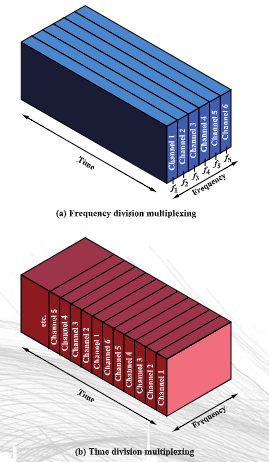
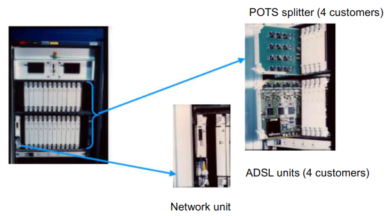
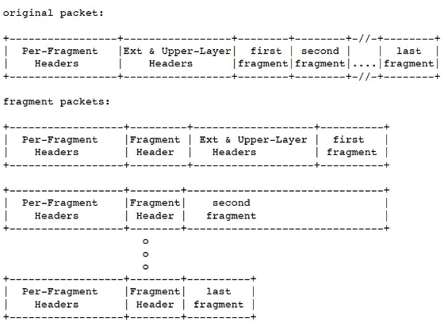
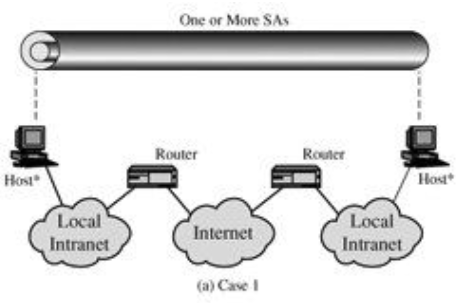
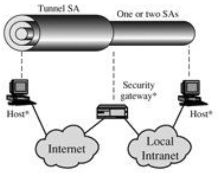
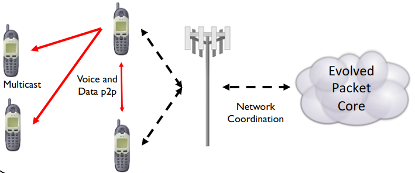
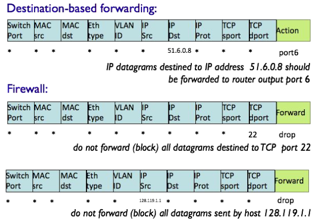
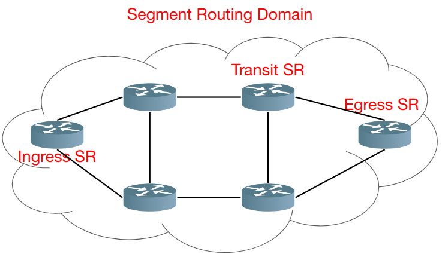

# Network Infrastructures

[[_TOC_]]

## Theory

### Contributions

- Thanks to [Irene](https://t.me/Avelyne5) for her network infrastructure [summary](./res/pdf/summary_netinf_irene.pdf)

### Introduction

- Telecommunications network model
    - Five basic components
        1. Terminals: any input/output device that uses telecommunication networks to transmit or receive data
            - Roles
                - Client: end user PC
                - Server: helps with application processing and also manages the network
        2. Telecommunication processors: support data transmission and reception between terminals and computers
            - Multiplexers: allows a single communication channel to carry simultaneous data transmissions from many terminal
            - Internetwork processors
                - Switches: makes connections between telecommunication circuits so a message can reach its intended destination
                    - Send information from input port to specifically identified output port
                - Router: interconnects networks based on different rules or protocols
                    - Like a switch but also routes packets in the network
                - Hub: port switching communications processor
                    - Send information from input port to multiple output ports
                - Gateway: processor that interconnects networks that use different communications architecture
                    - Example
                        - Firewall
                        - Modem (modulation/demodulation)
                            - Changes signals from analog to digital and back to analog
                            - NAT
                            - Auth with ISP 
        3. Telecommunications channels: the medium over which data are transmitted and received
            - Wired
                - Copper based
                    - Twisted-pair wire
                    - Coaxial cable: minimizes interference and distortion and allows high-speed data transmission
                - Fiber based
                    - Fiber optics: glass fiber that conducts pulses of light generated by lasers, size and weight reduction, increased speed and carrying capacity
            - Wireless
                - Types (range)
                    - Long range
                        - Terrestrial Microwave: line-of-sight path between relay stations spaced approximately 40 km apart
                            - Antennas
                            - Line-of-sight: same direction positioning
                        - Communications Satellites: geosynchronous orbits, serve as relay stations for communications signals transmitted from earth stations, a lot of kilometers (nation)
                    - Medium range
                        - Cellular Systems
                            - Each cell is typically from one to several square miles in area
                            - Each cell has its own low-power transmitter or radio relay antenna
                            - Computers & other communications processors coordinate & control the transmissions to/from mobile users as they move from one cell to another
                            - Several standards

                                

                                - At the beginning those nets weren't based on the internet protocol but on circuit switching; with latest releases we are switching to interne protocol
                    - Short range
                        - WiFi
                            - Access points connected to a router gives connection to peers

                    

                - Standards (IEEE 802.*)

                    

                - Types (power)
                    - Low power area network: used in IOT
                        
                        

                    - High power area network
        4. Computers/Phones: interconnected by telecommunications networks
        5. Telecommunications control software: control telecommunications activities & manage the functions of telecommunications networks
            - Nowadays we are transforming hardware components into software ones
                - Pro
                    - Scalability
                    - Cheaper
                    - Modular
                    - Software can be "moved" easily
            - Could be centralized or decentralized
            - Example functionalities (network management)
                - Traffic management
                - Security
                - Network monitoring
                - Capacity planning
    - Types
        - Wide Area Networks (WAN): cover a large geographic area
        - Metropolitan Area Networks (MAN): cover a metropolitan area, typically connect multiple geographically nearby LANs to one another (over an area of up to a few dozen kilometres) at high speeds
        - Local Area Networks (LAN): connect computers & other information processing devices within a limited physical area; connected via ordinary telephone wiring, coaxial cable, or wireless radio & infrared systems
        - Virtual Private Networks: secure network that uses the Internet as its main backbone network, but relies on firewalls and other security features
            - A VPN Enabling Technology is IPSec (SVPN): open architecture for IP-packet encryption and authentication, thus it is located in the network layer; adds additional headers/trailers to an IP packet and can encapsulate (tunnel) IP packets in new ones
    - Topologies
        - Star: ties end user computers to a central computer
            - Used in lateral part of the network
            - Considered the least reliable
            - Example: WiFi network
            - Con: single point of failure
            - Pro: easy deployment for new users, just connect

            

        - Ring (sometimes called Token Ring): ties local computer processors together in a ring on a more equal basis
            - Considered more reliable & less costly
            - Con: no easy deployment for new users
            - Pro: reliable (if a node fails just create a new connection)

            

        - Bus: local processors share the same bus, or communications channel
            - Tree is a variation which ties several bus networks together
            - Con: ?
            - Pro: reliable, easy deployment for new users

            

        - Mesh (fully connected): ties everyone to everyone 
            - Used in core part of the network
            - Con: expensive
            - Pro: reliable and robust

            

    - Protocol and network architecture: standard set of rules & procedures for the control of communications in a network

        

### Fundamentals of digital communcation (probably not requested at the exam)

**Disclaimer**: explained in general, for more info see the [pdf](./res/pdf/01_Transmission%20Fundamentals.pdf)

- Digital communcation system

  

- Electromagnetic signal
  - Function of time
  - Can also be expressed as a function of frequency
- Time-domain concepts
  - Singal types
    - Analog signal: signal intensity varies in a smooth fashion over time, no breaks or discontinuities in the signal

      

    - Digital signal: signal intensity maintains a constant level for some period of time and then changes to another constant level

      

    - Periodic signal: analog or digital signal pattern that repeats over time

      

    - Aperiodic signal: analog or digital signal pattern that doesn't repeat over time
  - Terminology about waves
    - Peak amplitude (`A`): maximum value or strength of the signal over time; typically measured in volts
    - Frequency (`f`): rate, in cycles per second, or Hertz (`Hz`) at which the signal repeats
    - Period (`T`): amount of time it takes for one repetition of the signal (`T=1/f`)
    - Phase (`φ`): measure of the relative position in time within a single period of a signal
    - Wavelength (`λ`): distance occupied by a single cycle of the signal or the distance between two points of corresponding phase of two consecutive cycles
  - Sine wave parameters
    - General sine wave: `s(t) = Asin(2πft+φ)`
    - How it varies varying the parameters

      

      - (a) `T=1s`
      - (c) `T=½`
      - (d) `φ=π/4 radians = 45°`
        - `2π radians = 360° = 1 period`
  - Time and distance
    - When the horizontal axis is time, figure above, graphs display the value of a signal at a given point in space as a function of time
    - With the horizontal axis in space, graphs display the value of a signal at a given point in time as a function of distance–
      - At a particular instant of time, the intensity of the signal varies as a function of distance from the source
  - Frequency concepts
    - Fundamental frequency: when all frequency components of a signal are integer multiples of one frequency
    - Spectrum: range of frequencies that a signal contains
    - Absolute bandwidth: width of the spectrum of a signal
    - Effective bandwidth (or just bandwidth): narrow band of frequencies that most of the signal's energy is contained in
    - VERY IMPORTANT: any electromagnetic signal can be shown to consist of a collection of periodic analog signals (sine waves) at different amplitudes, frequencies, and phases
      - The period of the total signal is equal to the period of the fundamental frequency
  - Relationship between data rate and bandwidth
    - The greater the bandwidth, the higher the information-carrying capacity
    - Any digital waveform will have infinite bandwidth but the transmission system will limit the bandwidth that can be transmitted and, for any given medium, the greater the bandwidth transmitted, the greater the cost 
      - However limiting the bandwidth creates distortions

        

  - Terminology about communcation term
    - Data: information
      - Types
        - Analog
          - Video
          - Audio
        - Digital
          - Text
          - Integers
          - Digital Video
          - Digital Audio
    - Signals: electric or electromagnetic representations of data
      - Type
        - Analog: continuously varying electromagnetic wave that may be propagated over a variety of media, depending on frequency
          - Can propagate analog and digital data
        - Digital: sequence of voltage pulses that may be transmitted over a copper wire medium
          - Can propagate analog and digital data
      - Data and signal combinations

        

    - Transmission: communication of data by the propagation and processing of signals
      - Types
        - Analog
          - Transmit analog signals without regard to content
          - Attenuation limits length of transmission link
          - Cascaded amplifiers boost signal's energy for longer distances but cause distortion
            - Analog data can tolerate distortion
            - Introduces errors in digital data
        - Digital
          - Concerned with the content of the signal
          - Attenuation endangers integrity of data
          - Digital Signal
            - Repeaters achieve greater distance
            - Repeaters recover the signal and retransmit
          - Analog signal carrying digital data
            - Retransmission device recovers the digital data from analog signal
            - Generates new, clean analog signal
      - Channel Capacity: maximum rate at which data can be transmitted over a given communication path, or channel, under given conditions
        - Data rate: rate at which data can be communicated (`bps`)
        - Bandwidth: the bandwidth of the transmitted signal as constrained by the transmitter and the nature of the transmission medium (`Hertz`)
        - Noise: average level of noise over the communications path
          - Error: transmit 1 and receive 0; transmit 0 and receive 1
          - Error rate: rate at which errors occur
          - Signal to noise ratio: ratio of the power in a signal to the power contained in the noise that's present at a particular point in the transmission

            

            - A high SNR means a high-quality signal, low number of required intermediate repeaters
      - Transmission medium: physical path between transmitter and receiver
        - Types
          - Guided Media: waves are guided along a solid medium (copper twisted pair, copper coaxial cable, optical fiber)
          - Unguided Media: provides means of transmission but does not guide electromagnetic signals (wireless transmission: atmosphere, outer space)
            - Transmission and reception are achieved by means of an antennas
            - Configurations for wireless transmission
              - Directional
              - Omnidirectional
            - Frequency ranges
              - Microwave frequency: `1 GHz to 40 GHz`
                - Directional
                - Suitable for point-to-point transmission
                - Used for satellite communications
                - Antennas
                  - Terrestrial: parabolic, 3m in diameter, fixed, located at substantial heights above ground level
                  - Satellite: used to link two or more ground-based microwave transmitter/receivers, receives transmissions on one frequency band (uplink), amplifies or repeats the signal, and transmits it on another frequency (downlink); (television distribution)
              - Radio frequency: `30 MHz to 1 GHz`
                - Omnidirectional
                - Antennas: rigidly mounted to a precise alignment (FM radio)
              - Infrared frequency: `3x10^(11) to 2x10^(14)Hz`
                - Local point-to-point multipoint applications within confined areas
      - Multiplexing: carrying multiple signals on a single medium

        

        - Techniques
          - Frequency-division multiplexing (FDM): takes advantage of the fact that the useful bandwidth of the medium exceeds the required bandwidth of a given signal
          - Time-division multiplexing (TDM): takes advantage of the fact that the achievable bit rate of the medium exceeds the required data rate of a digital signal

          

### Network functional areas

- Functional areas

  

  - Access network
    - Connects subscribers to their immediate service provider 
    - Uses copper lines, backbone (core) uses optical fiber
      - We are trying to reach a fully fiber newtwork
    - Example of access networks (yellow)

      

      - Fixed wireless access: Linkem, satellites...
      - Differences: length of connection, speed, cost, coverage, stableness...
    - Real example: Telecom Italia

      

      - Backbone network router can use more "colors" (wave length) contemporarily, so faster
      - In backbone sometimes rings are used instead of mesh, cheaper
  - Core network (backbone)
    - Usually with a mesh topology
    - Provides any-to-any connections among devices on the network
    - Consists of multiple switches or consists of IP routers
    - Uses optical fiber
    - The Internet could be considered a giant core network; it really consists of many service providers that run their own core networks, and those core networks are interconnected
    - In Italy
      - 32 PoP (point of presence)
        - Inner core: 4, Milan and Rome, replicated
          - Speed: `10Gbit/s`
        - Outer core: 28, more or less for every region
          - Speed
            - `10Gbit/s`
            - `2.5Gbit/s`
            - `155Mbit/s`
      - Link used at 50%, for redundancy
      - Logical topology

        

      - Physical topology
        - Use optical routers (routers that handle different wave length at the same time)
        - Interconnected with rings of optical fiber

        

    - Technologies and protocols

      

  - Edge of the network
    - Performs intelligent functions that are not performed inside the core network (edge computing)
      - An edge switch may examine packets and select a path through the network based on various properties of the packet
      - The core network then switches the packets; the core network is considered relatively "dumb" while the edge is considered "smart" because the path selection through the core is determined by the edge
- Network terms (old telephone network)

  

  - Exchange Area
    - Local
    - Long distance
  - LEC = Local Exchange Carrier
    - Carrier = Operator
    - LEC = Carrier that operates in a local region
  - ILEC = Incumbent LEC
    - Starting owner of the network, who set it up (Telecom)
  - CLEC = Competitive LEC
    - Through "unbundle" (to make the ILEC not have the monopoly) so that CLEC could use ILEC infrastructure
    - LEC that can compete with eachother (Fastweb, Vodafone, Infostrada...)
  - Trunks = fiber optical
  - CO = Central Office
    - Hierarchical, see the image
    - Owned by the incumbent
    - Also comprehends Cub/Curb (armadi)
      - Scattered in the city
      - Distribute cables
  - LATA = Local access and transport area
  - IXC = Inter-exchange Carrier
    - Carry inter-LATA traffic
  - Distribution network (star based)

    

    - Local loop: wireline in nature from customer to CO, specifically in the form of an electrical circuit provisioned as a single twisted pair in support of voice communications
      - Modern implementation: digital loop or fiber (fiber-in-the-loop)
        - So see why in Italy we use copper, because was the base of the telephone network
      - It may terminate at a circuit switch owned by a CLEC and housed in a POP, which typically is either an ILEC CO or a "carrier hotel"
      - Types
        - Electric local loop: PLC (power line communications)
        - Optical local loop: Fiber Optics services
        - Satellite local loop: communications satellite and cosmos Internet connections of satellite television
        - Cable local loop: Cable modem
        - Wireless local loop (WLL): Linkem...
      - In the past local loop used analog communication, then with the advent of xDSL is instead used digital communcation (as in the core of the network)
      - Nowadays we are switching to full-fiber
- Fiber
  - Types (FTTx - Fiber-To-The-x)
    - FTTH - Home
    - FTTC - Curb
    - FTTB - Building or Business
    - ...

    

    - The less copper wire you have, the faster you are

  - Elements that translate optical signals to electric ones
    - OLT = Optical Line Terminal: near the curb or the CO
    - ONU = Optical Network Unit: in correspondence of the user site
    - ONT = Optical Network Termination (NT: Network termination)
    - ODN = Optical Distribution Network

    

- Type of access
  - Wireless
    - How it works

      

    - Evolutions and types

      

      - Frequencies: `2.4Ghz and 5Ghz`
        - Free of license
  - 2G and 3G (cellular)

    

    - Organized in cells
      - Every macro-cell is divided in more small cells
      - In every small cell there is a device called base station
      - Hierarchy
        - MSC (mobile switching center)
          - RNC (radio network controller)
            - BSC (base station controller) 
      - MSC is connected with HLR (home location register) and VLR (visitor location register)
        - Those are used to keep track of the position of users (know if user has changed area, cell) and to address information to right users
          - HLR: database of users
          - VLR: database that says "this user temporary belongs to this particular area"
      - GGSN and SGSN: used to provide IP address to users (maybe)
    - Frequencies
      - 2G (GSM): `900Mhz and 1800Mhz`
      - 3G: `2100Mhz`
    - Evolutions and history

      

### xDSL

- DSL (or xDSL), is a family of technologies that provide digital data transmission over the wires of a local telephone network
- DSL originally stood for digital subscriber loop, now digital subscriber line
- DSL family
  - IDN Digital Subscriber Line (IDSL)
  - High Data Rate Digital Subscriber Line (HDSL)
  - Symmetric Digital Subscriber Line (SDSL): standardized version of HDSL
  - Asymmetric Digital Subscriber Line (ADSL): DSL with a slower upload speed
  - ADSL "lite"
  - Rate-Adaptive Digital Subscriber Line (RADSL)
  - Very High Speed Digital Subscriber Line (VDSL)
  - Very High Speed Digital Subscriber Line 2 (VDSL2): improved version of VDSL
- Wiring pre-DSL (only telephone)

  

- First tentative of data over telephone infrastructure
  - Used a modem (voice band modem)
  - Data rate: `56 kbit/s`
  - Frequency used: `0 - 4 kHz`

  

  - `SNR`: signal to noise ratio
- In xDSL the bandwidth decreases fast

  

- Asymmetric DSL (ADSL)
  - Original market driver: distribution of video on demand
  - The distinguishing characteristic of ADSL over other forms of DSL is that the volume of data flow is greater in one direction (download) than the other (upload)
  - Speed
    - Older ADSL standards can deliver `8 Mbit/s` to the customer over about 2 km of unshielded twisted pair copper wire
    - The latest standard, `ADSL2+`, can deliver up to `24 Mbit/s`, depending on the distance from the central office
  - How it works
    - Maintains `0 - 4 kHz` reserved to telephone
    - Uses two separate frequency bands, referred to as the upstream and downstream bands
      - Upstream (`25.875 kHz to 138 kHz`): from the end user to the telephone central office
      - Downstream (`138 kHz –1104 kHz`): from the central office to the end user

      

      

      - Frequency division multiplexing is used to transmit and receive contemporarily
      - Eco cancellation: remove from what is received what i am transmitting (also done on the telephone line)
        - This is done because up and down stream could overlap
  - Interference (cross-talks): wires sharing the same cable interfere one each other
    - Cables are grouped in larger cables called binder groups, doing this frequencies of different cables interfere with eachother

      

    - Depends on
      - The power spectral density of the transmitted signal
      - The number of twisted pairs in the same cable
      - The overlapping of bandwidths of the useful signal and the interfering ones
    - Cross-talk typically increases with frequency (significant for high speed DSL)
    - Two noise types
      - Far-end cross-talk (FEXT)
        - Weaker (negligible): wrong transmitter signal come from far away

        

      - Near-end cross-talk (NEXT)
        - Stronger: receiver's signals are softer than transmitter's one, since come from far away
        - NEXT is one of the reason of the frequency division for upstream and downstream in ADSL

        

  - Modulation
    - CAP (Carrier-less Amplitude/Phase modulation): incoming data modulates a single carrier that is then transmitted down a telephone line
      - The carrier itself is suppressed before transmission (it contains no information, and can be reconstructed at the receiver), hence the word "carrier-less" (single carrier but suppressed)
    - DMT (Discrete Multi-Tone) (multicarrier)
      - Divide the operational ADSL bandwidth into very small sub channels: 256 sub-bands of `4,3125 kHz` each, so occupying `1.024MHz`
      - Why: to make the attenuation constant (in each sub channel)

        

        - Attenuation in general is not constant, it is in each sub band!
      - So the modulation is done for each sub band, keeping in mind different attenuations to provide a better service
        - Independent subchannels can be manipulated individually with consideration of the line conditions
        - If a subchannel is experiencing external interference it may not be used in favor of other subchannels
        - DMT can dynamically adapt the data rate to the line conditions
        - Water filling concept: dedicate more bits where the "pool" is "deeper"

          

      - Speed
        - Theoretical maximum upstream bandwidth: `25 channels X 15 bit/s/Hz/channel X 4 KHz = 1.5 Mbit/s`
        - Theoretical maximum downstream bandwidth: `249 channels X 15 bit/s/Hz/channel X 4 KHz = 14.9 Mbit/`
  - Architecture

    

    - Caption
      - POTS Splitter: separates POTS (telephone) from DSL signals

        

      - ATU-R: ADSL Termination Unit - Remote side (modem)
      - ATU-C: ADSL Termination Unit - Central office side
      - DSLAM: DSL Access Multiplexer
        - House a set of ATU-C interfaces
        - Multiplex traffic
        - Demultiplex traffic

      

    - For each twisted pair there is a couple POTS Splitter and ATU-C in the central office

      

  - Protocol architecture
    - Protocols
      - General

        

      - Client side

        

      - Network side

        

        - ATM (broadband protocol): asynchronous transfer mode
        - AAL5: adaptation layer protocol
        - PPP: point to point protocol
          - Designed for simple links to transport packets between two peers (ATU-R and ATU-C)
          - Functions
            - Authentication
            - Authorization
            - Automatic configuration of network interfaces and DHCP support
          - ADSL is based on the ATM protocol so PPP is encapsulated inside ATM cells (PPPoA); it can stand on top of Ethernet and be encapsulated in Ethernet Frames (PPPoE)

            

          - Frame
            - Similar to ethernet, simplified
            - Address is a dummy MAC address (broadcast) because it's point to point, there is no routing
            - The default MRU (maximum receive unit, same as MTU) value is 1500 octets
            - The Protocol field identifies the datagram encapsulated in the information field (content field)
            - Flags are used as START and END of the packet
            - Check: checking bits

            

          - Link operation

            

          - Authentication
            - Password Authentication Protocol (PAP)

              

            - Challenge Handshake Authentication Protocol (CHAP)

              

              - More secure than PAP
              - Uses a one-way hashing algorithm which is known only to the user, to respond to a challenge sent by the authenticator
- VDSL: let's go FASTER!
  - Architecture

    

    - Insert into the cabinets optical network units, it cost
  1. Make shorter copper connections, provide fiber closer to the client
  2. Use higher frequencies
  3. Vectoring: solve cross-talk by injecting an "anti-signal" on each crosstalk-impaired line

     

     1. Send test signal that arrives modified at the other side (for cross-talk)
     2. The receiver sends back the modified test signal arrived
     3. The sender "learns" how te signal varies and then knows how to send the signal in a way that is no more disturbed (more or less)

### Passive Optical Networks (optical fiber)

- Fiber attenuation 

  

  - Windows are chosen where there is low attenuation and the curve is flat
  - In general, fiber attenuation is lower than copper
- Fiber sending mechanism
  - Transmitters: laser diodes
  - Wavelengths
    - Downstream: `1,5xx nm`
    - Upstream: `1,3xx nm`
- Fiber architecture types
  - "Well-known"
    - Best current architecture

      

    - Fiber to the cabinet

      

    - Fiber to the curb (explained next)

      

    - Fiber to the building

      

    - Fiber to the home

      

  - "Macro"
    - Same as copper

      

      - A lot of micro digging: one digging for each connection
    - Less digging

      

      - Curb switch: active element, expensive, used to divide traffic
    - Less digging and no active element

      

      - Passive splitters are used

        

        - There is a loss of the signal (about `3 dB` for each splitter)
        - They do not perform traffic division; solution: EPON
- EPON (`802.3ah`): ethernet over passive optical network
  - Transmission
    - Downstream 

      

      - ONUs are located where the DSLAM is
      - OLT is at the central office
      - Problem: everyone receives also the traffic sent to its neighbors so addresses are used
    - Upstream

      

      - Time Division Multiplexing Access (TDMA) is performed
      - The OLT receives frames with different powers, problem
        - Solution: the OLT performs Automatic Gain Control, it tells ONUs how to adjust their signal strength so that they have the same gain

          
  
  - Configurations

    
  
  - Evolution of EPON: GPON
    - EPON is symmetric
    - GPON is asymmetric and faster
  - Headers

    

  - Transmission evolution: Wave division multiplexing, colors carry the data

    

### IPv6

- Capabilities 
  - Expanded addressing capabilities
    - No NAT, all addresses are public
  - Header format simplification

    
    
    - No header length field, length fixed
    - Fields explanation
      - Version: version of IPv6 used
      - Traffic class: defines service priority
      - Flow label: see below
      - Next header: pointer that defines the type of the next extension header
      - Hop limit: like the TTL in IPv4
  - Flow labeling capability

    

    - Routers can route packets based on the flow they appertain; in the image all packets appertaining to the blue flow will use the path defined
  - Improved support for extensions and options
    - Optional internet-layer information is encoded in separate headers

      

    - Extension headers are not processed until the packet reaches the Destination Address
    - At the destination node, normal demultiplexing on the Next Header field of the IPv6 header invokes the module to process:
      - the first extension header
      - the upper-layer header if no extension header is present
    - The contents and semantics of each extension header determine whether or not to proceed to the next header
    - Extension headers must be processed strictly in the order they appear in the packet
    - Extension headers examples (in order)
      - Hop-by-Hop Options: padding, processed by every hop
      - Destination Options: padding, processed by the destination 
      - Routing: list one or more intermediate nodes to be "visited"

        

        - Fields explanation
          - Hdr ext len: header extension length
          - Segments left: number of explicitly listed intermediate nodes still to be visited before reaching the final destination
          - Routing type: identifier of a particular Routing header variant
            - Type 0
            
              

              - Problem: it may contain multiple intermediate node addresses, and the same address may be included more than once; this allows a packet to be constructed such that it will oscillate between two processing hosts or routers many times. This allows a stream of packets from an attacker to cause congestion and hence act as a denial-of-service
      - Fragment: used for packet fragmentation
        - Performed only by source nodes
          - Pros: overhead reduction
          - Cons: security threats, need of path MTU discovery procedure
        - Minimize the use of fragmentation by minimizing the supported MTU size
        - Every link in the Internet have an MTU of 1280 octets or greater

        

          - Fields explanation
            - Fragment **offset**: offset, in 8-octet units, of the data following this header relative to the start of the fragmentable part of the original packet
            - M flag: bit set to 1 when more fragments will follow or 0 if this is the last fragment
            - Identification: defines the fragments which belong to the same packet
        - Example

          

        - Reassembly
          - An original packet is reassembled only from fragment packets that have the same Source Address, Destination Address, and Fragment Identification
          - The Per-Fragment headers of the reassembled packet consists of all headers up to, but not including, the Fragment header of the first fragment packet with the following two changes:
            - the Next Header field of the last header of the Per-Fragment headers is obtained from the Next Header field of the first fragment's Fragment header
            - the Payload Length of the reassembled packet is computed from the length of the Per-Fragment headers and the length and offset of the last fragment
              - `PL.orig = PL.first - FL.first - 8 + (8 * FO.last) + FL.last`
                - Initial situation

                  

                - `PL.first - FL.first`

                  

                - `EH = PL.first - FL.first - 8`

                  

                - `(8 * FO.last)`: bytes of all fragments sum so far (`8 *` because fragments are in octets) except the last

                  

                - `+ FL.last`: add the last
          - Possible errors
            - If insufficient fragments are received to complete reassembly of a packet within 60 seconds of the reception of the first arriving fragment of that packet all received fragments are discarded
            - If the length of a fragment is not a multiple of 8 octets and the M flag is 1 discard the frame and send an ICMP Parameter Problem to the source
            - If fragments of a packet are overlapped all the received fragments must be discarded (before it wasn't like this, the receiver could decide how to reassemble packets, unsafe)
              - Security threats related to fragmentation

                

                

        - Packet size issues
          - IPv6 requires that every link in the Internet have an MTU of 1280 octets or greater
          - It is strongly recommended that IPv6 nodes implement Path MTU Discovery, in order to discover and take advantage of path MTUs greater than 1280 octets
            - Path MTU discovery

              

              - If this mechanism fail (ICMP packet is not sent back by the router) we are talking about a black hole

                

          - Path MTU (PMTU) is equal to the minimum link MTU of all the links in a path; if a router can't handle a certain MTU it drops the packet
      - Authentication
      - Encapsulating Security Payload
      - Upper layer header
  - Authentication and privacy capabilities
- Address
  - Length: 128-bit
  - Text representation: `x:x:x:x:x:x:x:x`
    - `x` are one to four hexadecimal digits of the eight 16-bit pieces of the address
    - It is not necessary to write the leading zeros in an individual field
    - There must be at least one numeral in every field
    - Address compression: the use of `::` indicates one or more groups of 16 bits of zeros, `::` can only appear once in an address
    - Example: `FF01:0:0:0:0:0:0:101 -> FF01::101`
    - Address prefix: same as IPv4
      - Example: `2001:0DB8:0:CD30::/60`
  - Type

    

    - Unicast: an identifier for a single interface
      - A packet sent to a unicast address is delivered to the interface identified by that address
    - Anycast: an identifier for a set of interfaces (typically belonging to different nodes)
      - A packet sent to an anycast address is delivered to one of the interfaces identified by that address (the "nearest" one)
    - Multicast: an identifier for a set of interfaces
      - A packet sent to a multicast address is delivered to all interfaces identified by that address
    - There are no broadcast addresses
  - Type identification

    

  - Scope

    

  - Interface identifier
    - Required to be unique within a subnet prefix
    - Can be derived directly from that interface's MAC address
      1. Split the MAC address in two strings 24 bit long
      2. Insert the hexadecimal string `FFFE` in between the two obtained parts
      3. Flip the 7th most significant bit
      - Example

        

  - Global unicast address: like IPv4 public but every machine has a global address (because in IPv6 we have A HUGE AMOUNT of addresses)

    

    

    - Global routing prefix: value assigned to a site
      - Used to simplify routing tables
      - Assigned like to a provider
    - Subnet ID: identifier of a link within the site
    - Interface ID: determined starting from the link layer address
  - Link local unicast address: identifies machines that share the same link (cable)

    

    - Routers must not forward any packets with Link-Local source or destination addresses to other links
  - Multicast address: identifier for a group of interfaces

    

    - `flgs`: set of 4 flags (`0 | R | P | T`)
      - `T = 0`: permanent address (well-known)
      - `T = 1`: non-permanent address
      - `R, P`: used for special purposes
    - `scop`: used to limit the scope of the multicast group
      - `1` - Interface-Local scope: spans only a single interface on a node (loopback)
      - `2` - Link-Local scope: spans the same topological region (same link)
      - `4` - Admin-Local scope
      - `5` - Site-Local scope: span a single site
      - `8` - Organization-Local scope: span multiple sites belonging to a single organization
      - `E` - Global scope
    - An interface may belong to any number of multicast groups
    - Example
      - The "NTP servers group" is assigned a permanent multicast address with a group ID of `101` (hex)
        - `FF02:0:0:0:0:0:0:101`: means all NTP servers on the same link as the sender
        - `FF05:0:0:0:0:0:0:101`: means all NTP servers in the same site as the sender
        - `FF0E:0:0:0:0:0:0:101`: means all NTP servers in the Internet
    - Well-known multicast addresses
      - Nodes
        - `FF01:0:0:0:0:0:0:1`: interface-local group
        - `FF02:0:0:0:0:0:0:1`: link-local group (that's why we don't need a broadcast address)
      - Routers
        - `FF01:0:0:0:0:0:0:2`: interface-local group
        - `FF02:0:0:0:0:0:0:2`: link-local group (that's why we don't need a broadcast address)
        - `FF05:0:0:0:0:0:0:2`: site-local group
  - If needed on the slide (pack `1 - IPv6`) there is a case study of addresses assignment (page `52`)
- Neighbor discovery
  - What it is useful for
    - Determine the link-layer addresses for neighbors known to reside on attached links
    - Purge cached values that become invalid
    - Find neighboring routers that are willing to forward packets on their behalf
    - Actively keep track of which neighbors are reachable and which are not
    - Detect changed link-layer addresses
  - Messages
    - Router Solicitation
      - Hosts send Router Solicitations in order to prompt routers to generate Router Advertisements quickly (to detect routers)
      
      

    - Router Advertisement
      - Routers send out Router Advertisement messages periodically, or in response to Router Solicitations (to detect hosts)

      

    - Neighbor Solicitation
      - Nodes send Neighbor Solicitations to request the link-layer address of a target node while also providing their own link-layer address to the target

      

    - Neighbor Advertisement
      - A node sends Neighbor Advertisements in response to Neighbor Solicitations and sends unsolicited Neighbor Advertisements in order to (unreliably) propagate new information quickly

      

    - Redirect
      - Routers send Redirect packets to inform a host of a better first-hop node on the path to a destination

      

  - Host data structures

    

    - Neighbor cache: like ARP table, contains tuples of IP:MAC addresses
    - Prefix list: list of prefixes recently contacted
    - Destination cache: association between destination address and next-hop address (more or less a routing table)
  - Sending algorithm

    

    - Next hop determination phase
      - The sender performs a longest prefix match against the Prefix List to determine whether the packet’s destination is on or off-link
        - If the destination is on-link, the next-hop address is the same as the packet's destination address
        - Otherwise, the sender selects a router from the Default Router List
      - The results of NHD computations are saved in the Destination Cache
  - Router discovery

    

  - Neighbor discovery mechanism: get MAC of a host knowing its IP (using solicited-node multicast)
    - Also used to find duplicate addresses (i generate an address, before using it i need to know if it is used by someone else)

    
  
  - Neighbor discovery security threats
    - Duplicate address detection DoS Attack: an attacker could send continuously neighbor advertisement (trying to "steal" the IP address of a machine in its subnet)
    - Neighbor solicitation spoofing: the attacker pretends to be the host `2` (in this case)

      

    - Neighbor advertisement spoofing: same as before but with advertisement message

      

- Host auto configuration
  - Types
    - Manual configuration
    - Stateless auto configuration: used when a site is not particularly concerned with the exact addresses hosts use (SLAAC)
      - A host generates its own addresses using a combination of locally available information and information advertised by routers
        - Routers advertise prefixes that identify the subnet(s) associated with a link
        - Hosts generate an "interface identifier" that uniquely identifies an interface on a subnet
      - ICMPv6 messages used
        - Router Advertisement
        - Router Solicitation
      - How
        1. Host `H` connects to the subnet and immediately generates an IPv6 Link Local address; it uses Duplicate Address Detection to verify the uniqueness of the generated address
        2. Host `H` sends one (or more) router solicitation to discover routers in the subnet
        3. Router `R` sends a router advertisement containing (as an option) the subnet prefix; with this information, the host `H` generates a global unicast IPv6 address using the subnet prefix information
    - Stateful auto configuration (with DHCPv6): used when a site requires tighter control over exact address assignments
      - How: points 1 and 2 are the same as normal SLAAC, then router `R` sends a router advertisement containing the `M` flag set to 1; with this information, the host `H` send a DHCP solicitation, the DHCP server respond with a DHCP advertise and then the normal address negotiation is then executed

        

  - How to know what type to use
    - Looking at the router advertisement messages flags

      

### IKE/IPSec

- Background on Communication Security
  - Network Security Services
    - Confidentiality: only sender, intended receiver should "understand" message contents
      - Sender encrypts message
      - Receiver decrypts message
    - Authentication: sender, receiver want to confirm identity of each other
    - Message integrity: sender, receiver want to ensure message not altered (in transit, or afterwards) without detection
    - Access and availability: services must be accessible and available to users
  - What an attacker could do
    - Passive
      - Eavesdrop: intercept messages
    - Active
      - Actively insert messages into connection
      - Impersonation: can fake (spoof) source address in packet (or any field in packet)
      - Hijacking: "take over" ongoing connection by removing sender or receiver, inserting himself in place
      - Denial of service: prevent service from being used by others
  - Crypto
    - Basics

      

      - `m`: plaintext message
      - `KA(m)`: ciphertext, encrypted with key `KA`
      - `m = KB(KA(m))`: decryption phase
    - Symmetric key cryptography: Bob and Alice share same (symmetric) key: `KS`

      

      - How do Bob and Alice agree on key value: pre-communication (pre-shared key)
    - (Asymmetric) Public key cryptography

      
      
    - Message digests (hash)
      - Apply hash function `H` to `m`, get fixed size message digest, `H(m)`
      - Properties
        - Many-to-1
        - Produces fixed-size msg digest (fingerprint)
        - Given message digest `x`, computationally infeasible to find `m` such that `x = H(m)`
    - Digital signature
      - Properties
        - Sender digitally signs document, establishing he is document owner/creator
        - Verifiable, nonforgeable: receiver can prove to someone that sender, and no one else (including receiver), must have signed document
        - Non-repudiation: receiver can take `m`, and signature of `m` to court and prove that sender signed `m`
      - How it works
        - Sign

          

        - Verify

          

      - Problem: how to verify that is really Bob that signed the message? 
        - Certification authorities
    - Certification authorities (CA): binds public key to particular entity, E
      - Sign

        

      - Verify

        

- IP Security Overview
  - Security provided
    - Authentication and integrity
    - Confidentiality
    - Key management: concerned with the secure exchange of keys
  - Scenarios

    

  - Routing applications

    

    - In IPSec this can't happen, those properties are mantained:
      - A router advertisement comes from an authorized router
      - A neighbor advertisement comes from an authorized router
      - A redirect message comes from the router to which the initial packet was sent
      - A routing update is not forged
  - Protocols used
    - Authentication protocol designated by the header of the protocol (AH)
    - Combined encryption/authentication protocol designated by the format of the packet for that protocol (ESP)
  - Services granted
    - Access control
    - Connectionless integrity
    - Data origin authentication
    - Rejection of replayed packets (a form of partial sequence integrity)
    - Confidentiality (encryption)
    - Limited traffic flow confidentiality

    

- IP Security Architecture
  - Security associations: one-way relationship between a sender and a receiver that affords security services to the traffic carried on it

    

    - If a peer relationship is needed, for two-way secure exchange, then two security associations are required
    - Security services are afforded to an SA for the use of AH or ESP, but not both
    - Uniquely identified by three parameters
      - Security Parameters Index (SPI): enable the receiving system to select the SA for processing the current packet
        - Used like an identifier
      - IP Destination Address: address of the destination endpoint of the SA
        - Only unicast addresses are allowed
      - Security Protocol Identifier
        - AH or ESP
    - In each IPSec implementation there is a Security Association Database that defines the parameters associated with each SA
    - Full list of parameters
      - Sequence Number Counter
      - Anti-Replay Window
      - AH Information (Authentication algorithm, keys, key lifetimes, etc)
      - ESP Information (Encryption and authentication algorithm, keys, initialization values, key lifetimes, etc)
      - Lifetime of this Security Association
      - IPSec Protocol Mode (tunnel, transport)
      - Path MTU
    - Selectors: how IP packets are associated to a specific security association
      - Using a Security Policy Database (SPD), like a sort of "routing table"
        - Contains entries, each of which defines a subset of IP traffic and points to an SA for that traffic
        - Each SPD entry is defined by a set of IP and upper-layer protocol field values, called selectors, used to filter outgoing traffic in order to map it into a particular SA
        - Entries here define whether to drop packets, send packets in clear text, send packets through IPSec (in this case the SAD is queried)...
        - Selector parameters
          - Destination IP Address
          - Source IP Address
          - Transport Layer Protocol
          - Source and Destination Ports
      - How it works

        

        - Outbound processing obeys the following general sequence for each IP packet
          1. Compare the values of the appropriate fields in the packet (the selector fields) against the SPD to find a matching SPD entry
          2. Determine the SA if any for this packet and its associated SPI
          3. Do the required IPSec processing (i.e., AH or ESP processing)

          

        - Inbound

          

    - Modes (both supported by AH and ESP)
      - Transport: provides protection primarily for upper-layer protocols

        

      - Tunnel: provides protection to the entire IP packet

        

        - The entire packet plus security fields is treated as the payload of new "outer" IP packet with a new outer IP header

      

- Authentication Header (AH): provides support for data integrity and authentication of IP packets
  - Structure

    

    - Next Header (8 bits): identifies the type of header immediately following this header
    - Payload Length (8 bits): length of Authentication Header in 32-bit words, minus 2
    - Reserved (16 bits)
    - Security Parameters Index (SPI, 32 bits): identifies a security association
    - Sequence Number (32 bits): a monotonically increasing counter value, used for anti replay
      - Anti-replay
        - Replay attack: an attacker obtains a copy of an authenticated packet and later transmits it to the intended destination
        - How it works
          - Sender
            - When a new SA is established, the sender initializes a sequence number counter to 0
            - Each time that a packet is sent on this SA, the sender increments the counter and places the value in the Sequence Number field
            - If anti-replay is enabled (the default), the sender must not allow the sequence number to cycle past `2^(32)-1` back to zero
            - If the limit is reached, the sender should terminate this SA and negotiate a new SA with a new key
          - Receiver
            - The receiver should implement a window of size `W`, with a default of `W = 64`
            - If the received packet falls within the window and is new, the MAC is checked, if the packet is authenticated, the corresponding slot in the window is marked
            - If the received packet is to the right of the window (is not in the window), the MAC is checked
              - If the packet is authenticated the window is advanced so that this sequence number is the right edge of the window, the corresponding slot in the window is marked
            - If the received packet is to the left of the window, or if authentication fails, the packet is discarded
    - Authentication Data (variable): a variable-length field (must be an integral number of 32-bit words) that contains the Integrity Check Value (ICV), or MAC, for this packet
      - Integrity Check Value (ICV)
        - Uses a MAC algorithm
        - The full MAC value is calculated but then truncated by using the first 96 bits, which is the default length for the Authentication Data field
        - The MAC is calculated over
          - IP header fields that either do not change in transit (immutable) or that are predictable in value upon arrival at the endpoint for the AH SA
          - The AH header other than the Authentication Data field
          - The entire upper-level protocol data, which is assumed to be immutable in transit

  

- Encapsulating Security Payload (ESP): provides confidentiality services and can also provide an authentication service
  - Structure

    

    - Fields more or less equal as AH

  

- Combining Security Associations
  - An individual SA can implement either the AH or ESP protocol but not both
  - Security association bundle: sequence of SAs through which traffic must be processed to provide a desired set of IPSec services (so through this method we could use AH and ESP together)
    - The SAs in a bundle may terminate at different endpoints or at the same endpoint

      

    - Types (most common)
      - Authentication + Confidentiality
        - ESP with Authentication Option (not a bundle, using just ESP)
          - Transport mode: authentication and encryption apply to the IP payload delivered to the host, but the IP header is not protected
          - Tunnel mode: authentication applies to the entire IP packet delivered to the outer IP destination address and authentication is performed at that destination; the entire inner IP packet is protected by the privacy mechanism, for delivery to the inner IP destination but the outer header has no protections
        - Transport Adjacency: inner being an ESP SA and the outerbeing an AH SA
          - ESP is used without its authentication option
          - Pro: the authentication covers more fields, including the source and destination IP addresses
          - Con: overhead of two SAs versus one SA

          

        - Transport-Tunnel Bundle: inner AH transport SA and an outer ESP tunnel SA (authentication prior to encryption)
          - Authentication data are protected by encryption, it is impossible for anyone to intercept the message and alter the authentication data without detection
          - Store the authentication information with the message at the destination for later reference

          

      - Various examples
        - Security is provided between end systems

          

          - Possible combinations (not all)
            - AH in transport mode
            - ESP in transport mode
            - ESP followed by AH in transport mode (an ESP SA inside an AH SA)
            - Any among the previous ones inside an AH or ESP in tunnel mode
            - ...
        - Security is provided only between gateways (VPN)
            
          

          - Possible combinations (not all)
            - The tunnel could support AH, ESP, or ESP with the authentication option
        - Gateways + end systems

          

        - Host to gateway + end systems

          

- Key Management: determination and distribution of secret keys
  - Types
    - Manual: a system administrator manually configures each system with its own keys and with the keys of other communicating systems
    - Automated: `ISAKMP/Oakley`
      - Elements
        - Oakley Key Determination Protocol: key exchange protocol based on the Diffie-Hellman algorithm but providing added security
          - Diffie-Hellman

            

            - Caption
              - `p`: large prime number
              - `g`: primitive root of `p`
              - `S` will be the same on the two hosts
            - Pros
              - Secret keys are created only when needed
                - No need to store secret keys for a long period of time, exposing them to increased vulnerability
                - No pre existing infrastructure is required other than an agreement on the global parameters
            - Cons
              - It does not provide any information about the identities of the parties
              - Subject to man-in-the-middle attacks
              - It is computationally intensive (vulnerable to a clogging attack, in which an opponent requests a high number of keys spoofing sender IP)
          - Oakley improvements
            - Employs a mechanism known as cookies to thwart clogging attacks
              - Cookies
                - How 
                  - Each side send a pseudorandom number (cookie) in the initial message
                  - The other side acknowledges the cookie
                  - This acknowledgment must be repeated in the first message of the DH key exchange
                  - If the source address was forged, the opponent gets no answer so it can only force a user to generate acknowledgments (not to perform the DH calculation)
                - Requirements
                  - The cookie must depend on the specific parties
                  - It must not be possible for anyone other than the issuing entity to generate cookies that will be accepted by that entity
                  - The cookie generation and verification methods must be fast to thwart attacks intended to sabotage processor resources
                - Reccomended method for cookie generation: perform a fast hash over the IP Source and Destination addresses, the UDP Source and Destination ports, and a locally generated secret value
            - Enables the two parties to negotiate a group (DH parameters)
              - An attacker (in plain Diffie-Hellman) could force endpoints to choose a low prime number, here he can't
            - Uses nonces to ensure against replay attacks
            - Enables the exchange of Diffie-Hellman public key values: defines message formats to exchanging Diffie-Hellman values
            - Authenticates the Diffie-Hellman exchange to thwart man-in-the-middle attacks
              - Digital signatures: the exchange is authenticated by signing a mutually obtainable hash generated over important parameters, such as user IDs and nonces
              - Public-key encryption: the exchange is authenticated by encrypting parameters such as IDs and nonces with the sender's private key
              - Symmetric-key encryption: a key derived by some out-of-band mechanism can be used to authenticate the exchange by symmetric encryption of exchange parameters
          - Example (lowest number of messages)
            - Caption
              - `CKY-I`: originator cookie
              - `CKY-R`: responder cookie
              - `MSGTYPE`: message type
              - `GRP`: the name of the Diffie-Hellman group used for the exchange
              - `g^x (or g^y)`: variable length integer representing a power of group generator
              - `EHAO or EHAS`: encryption, hash, authentication functions, offered and selected, respectively
              - `IDP`: an indicator as to whether or not encryption with `g^xy` follows (perfect forward secrecy for ID's)
              - `ID(I)`: the identity for the Initiator (encrypted with Diffie-Hellman)
              - `ID(R)`: the identity for the Responder (encrypted with Diffie-Hellman)
              - `Ni`: nonce supplied by the Initiator
              - `Nr`: nonce supplied by the Responder 
            - Message exchange (aggressive)

              

              - The initiator is using its private key to sign the content of the message (and also the responder)
              - Third message: ACK
              - The responder in this case does the calculation (Diffie-Hellman) when responds (vulnerable to clogging) but it's just a choice
              - This is used in IKE
        - Internet Security Association and Key Management Protocol: provides a framework for Internet key management and provides the specific protocol support, including formats, to establish, negotiate, modify, and delete security associations
          - Defines payloads for exchanging key generation and authentication data; these payload formats provide a consistent framework independent of the specific key exchange protocol, encryption algorithm, and authentication mechanism
          - Header

            

            - Followed by one or more payloads, like IPv6
            - Encapsulated in UDP, port `500`
            - Payload types
              - Security Association payload: used to negotiate security attributes and indicate the DOI (why am i requesting this association) and Situation under which negotiation is taking place
              - Proposal payload: proposal of encryption type and other things (proposed a list of Transforms)
              - Transform payload: contains encryption type, algorithms...
              - Key Exchange payload: Key Exchange Data (Diffie-Hellman parameters)
              - Identification payload: carries peers IDs
              - Certificate payload and Certificate Request payload: carries certificate
              - Hash payload: authentication and message integrity
              - Signature payload: authentication
              - Nonce payload
              - Notification payload
              - Delete payload
          - Exchange types
            - Base: key exchange and authentication material transmitted together

              

              - KE: Diffie-Hellman public parameters
              - Doesn't provide authentication because IDs are sent in plaintext
            - Identity Protection: base + protect the users' identities 

              

              - 5 and 6 provide authentication because IDs are encrypted
            - Authentication Only: only authentication, it suppose that peers already share a secret (or they don't need one)

              

            - Aggressive: same as the "aggressive" cited before
  - Internet Key Exchange (IKE) protocol: hybrid implementation of the Oakley key exchanges, which is designed according to the ISAKMP framework
    - Phases
      1. Create a secure connection between peers using ISAKMP: authentication + encrypted channel
         - Three shared keys are established
           - Two keys are used to authenticate and encrypt last two messages of the phase 1 (and messages of phase 2)
           - Third shared key is used for deriving keys for IPSEC security associations 
         - How

           

           1. The IPsec module examines the SPD to determine if IPsec processing is enabled on the outgoing traffic
           2. For IPsec processing enabled traffic that does not have a corresponding entry in the SAD...
           3. The IPsec module requests the IKE module to establish the necessary SA
           4. The IKE module negotiates and performs the necessary exchange with the peer IKE module to establish the SA
           5. The IKE module inserts this new SA into the SAD 
      2. Establishes IPsec SAs (aggressive)

      

    - Practical example
      - Full stream

        

      - Cookies

        

      - Negotiate request: transform detail

        

      - Negotiate response: selected transform

        

      - Diffie-Hellman exchange

        

      - Authentication (encrypted); next frame is more or less the same

        

      - Proposing for IPSec

        

      - Response to IPSec proposal

        

        

### Introduction to LTE/LTE-A Cellular Systems

- TV vs Cellular system
  - TV: 1 to N, single direction broadcast

    

  - Cellular: N to N, double direction transmission
    - Backhall: space between backbone and antennas

    

- Wireless access: Range of Operation of Different Techniques

  

  - The faster the vehicle, the hardest is keeping the connection
  - 5G is even faster; in 5G latency is important (more or less ping)
- Wireless
  - Elements of a wireless/cellular network
    - Wireless hosts
    - Base station (eNB, enhanced node B), access point: responsible for sending packets between wired network and wireless host(s) in its area
    - Wireless link: used to connect mobile(s) to base station
      - Multiple access protocol coordinates link access
      - Various data rates, transmission distance
      - The spectrum must be divided between hosts
  - Modes
    - Infrastructure: base station connects mobiles into wired network (there could also be multiple wireless hops)
      - Handoff: base station change keeping connectivity

      

    - Ad hoc: no base stations
      - Nodes can only transmit to other nodes within link coverage
      - Nodes organize themselves into a network (route among themselves)
      - Flexibility
      - Ad hoc could be also integrated with a cellular one

      
    
  - Link characteristics
    - Differences from wired link
      - Decreased signal strength: radio signal attenuates as it propagates through matter (path loss)
      - Interference from other sources: standardized wireless network frequencies (e.g., 2.4 GHz) shared by other devices (e.g., phone); devices (motors) interfere as well 
      - Multipath propagation: radio signal reflects off objects ground, arriving ad destination at slightly different times (self-interference)
        - The higher the frequency of the signal is, the higher reflection there will be (also tree leafs and drop of water reflecting signal)
        - Some studies used this reflections in a good way: redundancy/error correction
          - In this case i have to keep in consideration the fact that signals arrive at different times; so if i want to combine them to create a stronger final signal i have to understand their delay and their attenuation: multipath channel modeling
    - SNR: signal-to-noise ratio
      - Larger SNR -> easier to extract signal from noise
      - Given physical layer: increase power -> increase SNR -> decrease BER (error bits/good bits)
      - Given SNR: choose physical layer that meets BER requirement, giving highest throughput
      - SNR may change with mobility: dynamically adapt physical layer (modulation technique, rate)
        - The higher the SNR is, the better (faster) modulation i can use

        

    - Hidden terminal problem

      

      - Problem
        - B, A hear each other
        - B, C hear each other
        - A, C can not hear each other
        - A, C unaware of their interference at B
    - Signal attenuation

      

      - Problem
        - B, A hear each other
        - B, C hear each other
        - A, C can not hear each other interfering at B
  - Handling collisions
    - Code Division Multiple Access (CDMA)
      - All users share same frequency, but each user has own chipping sequence (code) to encode data
      - Allows multiple users to coexist and transmit simultaneously with minimal interference (if codes are orthogonal)
      - `Encoded signal = (original data) X (chipping sequence)`
      - Decoding: inner-product of encoded signal and chipping sequence

      

    - CSMA/C(ollision)A(voidance) - Usually this is the one used
      - Sender
        1. If channel is free  for time `DIFS` then transmit entire frame
        2. If sense channel busy
           1. Start random backoff time
           2. Timer counts down while channel idle
           3. Transmit when timer expires
           4. If no ACK, increase random backoff interval, repeat
      - Receiver: if frame received OK return ACK after time `SIFS`

      

    - RTS-CTS exchange

      

  - IEEE 802.11 wireless LANs (Wi-Fi)
    - Multiple versions (b/a/g/n): change speed and used frequencies
    - Architecture: wireless host communicates with base station (access point, AP)
    - Hosts must associate with an AP
      - How to
        1. Scans channels, listening for beacon frames containing APs name (SSID) and MAC address
        2. Selects AP to associate with
        3. May perform authentication
        4. Will typically run DHCP to get IP address in APs subnet
      - Scanning methods
        - Passive

          

          1. Beacon frames sent from APs
          2. Association Request frame sent: H1 to selected AP
          3. Association Response frame sent from  selected AP to H1
        - Active 

          

          1. Probe Request frame broadcast from H1
          2. Probe Response frames sent from APs
          3. Association Request frame sent: H1 to selected AP
          4. Association Response frame sent from selected AP to H1
          - Problems
            - During probe request all networks known by the host are broadcast; not good for privacy 
            - This also fingerprints me!
              - You could fingerprint my movements (hotels SSIDs..)...
    - 802.11 frame and addressing
      - Frame

        

      - Addressing

        

    - Mobility within same subnet
      - Authentication is not re-do when switching AP
      - Rate adaptation: base station dynamically change transmission rate (physical layer modulation technique) as mobile moves, SNR varies
        1. SNR decreases, BER increase as node moves away from base station
        2. When BER becomes too high, switch to lower transmission rate but with lower BER
  - Cellular Internet Access
    - Components
      - Cell: covers geographical region
        - Base station (BS) analogous to 802.11 AP
        - Mobile users attach to network through BS
        - Air-interface: physical and link layer protocol between mobile and BS
      - Mobile switching center
        - Connects cells to wired network
        - Manages call setup
        - Handles mobility

      

    - Access to cells
      - FDMA/TDMA: divide spectrum in frequency channels, divide each channel into time slots

        

      - CDMA: code division multiple access (same as the one explained in plain wifi)
    - Architecture
      - Voice

        

      - Voice + data

        

- Mobility
  - Terms
    - Home network: network of cellular provider you subscribe to
    - Home location register (HLR): database in home network containing permanent cell phone numbers, profile information (services, preferences, billing), information about current location
    - Visited network: network in which mobile currently resides
    - Visitor location register (VLR): database with entry for each user currently in network
  - Voice calls (explicative example, same for data packets)

    

    - Handoff with common MSC

      

      1. Old BSS informs MSC of impending handoff, provides list of 1+ new BSSs
      2. MSC sets up path (allocates resources) to new BSS 
      3. New BSS allocates radio channel for use by mobile 
      4. New BSS signals MSC, old BSS: ready
      5. Old BSS tells mobile: perform handoff to new BSS
      6. Mobile, new BSS signal to activate new channel
      7. Mobile signals via new BSS to MSC: handoff complete; MSC reroutes call
      8. MSC-old-BSS resources released
    - Handoff between MSC
      - Before handoff

        

      - After handoff

        

  - Cellular network organization
    - Area divided into cells
      - Around 10 square miles
      - Each with own antenna
      - Each with own range of frequencies (adjacent cells on different frequencies to avoid cochannel interference)
      - Served by base station (transmitter, receiver, control unit)
    - Shape of cells: hexagonal

      

    - Frequency reuse: as the cell size decreases (also the power decreases), the capacity (bit/s) increases

      

- LTE and LTE Advanced (Long Term Evolution)
  - Higher data rates
  - Architecture

    

  - Key technologies

    

    - Adaptive modulation and coding (AMC)
      - By using Channel Quality Indication (CQI), the transmitter can adaptively determine the modulation and coding schemes

        

        1. The antenna sends a reference signal (test signal)
        2. The host sends a Channel Quality Indicator (indicating one of the possible 16 quality levels calculated based on the test signal) to the antenna
        3. The antenna sends back the modulation chosed
        - Important: each host does this continuously, so each one has its own modulation done CONTINUOUSLY (good for mobility)
      - Users with high SNR (high CQI): use complex modulation, so high code rates
      - Users with low SNR (low CQI): use simple modulation, so low code rates (heavy error protection)
    - Hybrid ARQ (HARQ)
      - FEC + ARQ
        - FEC (forward error correction): more or less like a checksum, provide extra bits for error correction (if channel is good) so the receiver will correct autonomously the message
        - ARQ (automatic repeat request): ask for retrasmission
      - How it works

        

        - Erroneously received packet stored in a buffer memory
        - Later combined with the retransmission
        - Soft-combining -> improved performance
        - This is done in both the directions
    - Higher bandwidths, but flexible and scalable: spectrum flexibility
      - Divided into resource blocks (RB): each of these are 180KHz, 12 sub-carriers and 1 time slot (0.5ms)

        

      - Downlink: OFDMA (Orthogonal Frequency Division Multiple Access)
        - OFDMA allocates user in time and frequency domain

          

        - Important: dynamic
          - For each user a particular time/frequency slot is allocated based on if it is downloading a large file, if it is a premium member, if it is just browsing a light page... 
      - Uplink: SC-FDMA (Single Carrier Frequency Division Multiple Access)
        - Uses DFT (Discrete Fourier transform)
        - OFDM allocates user just in time domain

          

      - There is this distinction between donwlink and uplink because in the downlink the base station controls the organization of the comunication but in the uplink no, so is much difficult to apply OFDMA in uplink
    - MIMO (multiple input, multiple output), multiple antennas in input and output
      - Modes
        - Transmit diversity (TxD)

          

          - Combat fading
          - Replicas of the same signal sent on several Tx antennas and received by several Rx antennas
          - Get a higher SNR at the Rx
          - So the channel is now modulated as a matrix, each cell is a different antenna
        - Spatial multiplexing (SM)

          

          - Different data streams sent simultaneously on different antennas
          - Higher data rate
          - No diversity gain (the before cited thing)
          - Limitation due to path correlation
        - Beamforming

          

          - Beam: shape of the signal of an antenna
          - When two antennas interfere in the communication with a host, using beamforming the host receives no more interference and can choose the best signal of the two antennas
            - More or less frequency reusing thanks to beamforming

            

  - LTEA

    

    - Key technologies in LTEA
      - Carrier aggregation: grouping several COMPONENT CARRIERS (CC) to achieve wider bandwidhts
        - LTE-A uses bandwidhts of up to 100 MHz in several frequency bands thanks to this mechanism; this because LTE-A device can aggregate up to 5 CCs, each up to 20 MHz
        - Benefits
          - Higher Throughput: wider bandwidhts lead to very high bit rates (up to 1Gbps)
          - Inter-Cell Interference and Mobility Improvements: continuous and non-interfering coverage is provided by power adjustments for each carrier
          - Load Balancing: load is distributed across multiple carriers to reduce network congestion
          - Energy Savings: current specification allows dynamically turning on and off the carriers -> energy consumption can be adjusted according to network load
        - Schemes
          - Single Spectrum Band: aggregation of N CCs of different bandwidhts
            - Easy to implement but not practical as operators do not have contigious spectrums

            

          - Intraband Non-Contiguous Carrier Aggregation

            

          - Interband Non-Contiguous Carrier Aggregation

            

      - Massive MIMO: assign N antennas to each host

        

        - Benefits
          - Simplified multiuser processing
          - Reduced transmit power
          - Thermal noise and fast fading vanish
      - Relays: introduce intermediate relay node (RN) to forward traffic from a Donor eNB (DeNB) to areas of no coverage (notspots) or high traffic demand (hotspots)

        

        - Benefits
          - Improved performance: coverage and data rate
          - Lower H/W requirements than eNB's
          - Easier to install
          - Do not require dedicated locations
          - Reach new areas: can be deployed in locations where eNBs cannot
          - Temporary network deployment: their ease of installation allows faster deployment and removal
      - D2D (Device-to-Device Communications)

        

        - Same spectrum/standard than the device to antenna: there could be an interference with the main antenna
          - Solution: ask the antenna what spectrum to use to do the p2p communication

- 5G
  - Introduced for IOT devices

    

  - Very hign frequencies (mm-waves)

    

    - So very little wavelength -> Very probable interference (also drop of waters)
  - Major requirements
    - 1-10 Gbps
    - 1ms round trip latency
    - High bandwidth in unit area: capillar connection
    - Support enormous number of devices
    - Availability of 99.999%
    - Anytime, anywhere
    - Should not impact too much in energy usage

### Software Defined Networking

- Control Plane and Data Plane
  - Network layer
    - General information
      - Transport segment from sending to receiving host
      - On sending side encapsulates segments into datagrams
      - On receiving side, delivers segments to transport layer
    - Functions
      - Forwarding: move packets from router's input to appropriate router output
        - Has to be done for each packet and since packets carry user data this function belongs to the data plane
        - Must be fast, implemented in hardware
      - Routing: determine route taken by packets from source to destination through routing algorithms
        - Has to be done once in a while, once a router calculated a route to a new router this calculation is valid for each packet and shouldn't be redone so this function belongs to the control plane
        - Complex, implemented in software
    - Control plane types
      - Distributed: individual routing algorithm components in each and every router interact in the control plane

        

      - Centralized: distinct (typically remote) controller interacts with local control agents (CAs), no more router but switches

        
        
        - Using this we could take more complex routing decisions
          - Example: packets with the same destination address could take different paths based on the network charge

            

    - Data plane types
      - Destination based: the one used in normal routers (not using SDN), uses longest prefix match and based just on the destination address
      - Generalized packet forwarding: the one used in SDN
- Generalized Packet Forwarding
  - Each router contains a flow table that is computed and distributed by a logically centralized routing controller
    - Forward packets according to a set of fields also not limited to layer 3 (network layer) using a flow table

      

- Flow Table Entry
  - Defined by
    - Pattern: match values in packet header fields
    - Actions: actions (also more than one) for matched packet
      - drop
      - forward
      - modify
      - send matched packet to controller
    - Priority: disambiguate overlapping patterns (the lowest, the highest will be the priority)
    - Counters: get statistics on the traffic (number of bytes and packets that belong to the same flow)
      - Used for example for traffic analysis and security

    

  - Examples of SDN switches configurations

    

    

    

  - Flow table pipelining

    

  - Forwarding modes: used BOTH!
    - Proactive: the controller, offline computes routing policies and then proactively pushes those policies to switches (so switches when a packet arrives already know what to do)
    - Reactive: the switch when a packet arrives doesn't know what to do with it so it sends it to the controller which decides the rule and communicate it to the switch (when a switch receives a packet it installs a new rule)
- Software Defined Networking
  - Not used to boost the performance of the network but to make the behaviour of "routers" (now SDN switches) programmable with an high level programming language
  - Changing the core part of the network is hard (hardware specific devices) and core network devices are closed source: SDN aims to make the core more flexible and open
    - Why a logically centralized control plane?
      - Easier network management: avoid router misconfigurations, greater flexibility of traffic flows
      - Table-based forwarding (recall OpenFlow API) allows "programming" routers
        - Centralized "programming" -> easier: compute tables centrally and distribute
        - Distributed "programming" -> more difficult: compute tables as result of distributed algorithm (protocol) implemented in each and every router
      - Open (non-proprietary) implementation of control plane
    - More or less is the process that computers faced: at the beginning they were very hardware specific devices, then hardware is more general and functions are implemented via software
  - Very useful in 5G: based on the type of service that i want to get i use different paths
  - Examples of problems solved

      

    - With traditional routing u-to-z traffic to flow along uvwz, x-to-z traffic to flow xwyz isn't possible
    - With traditional routing splitting u-to-z traffic along uvwz and uxyz (load balancing) isn't possible
  - How it works

    

    - Data plane switches
      - Fast, simple, commodity, programmable switches implementing generalized data-plane forwarding in hardware
      - Switch flow table computed, installed by controller
      - API for table-based switch control (e.g., OpenFlow)
      - Protocol for communicating with controller (e.g., OpenFlow)
    - SDN controller (examples: OpenDaylight, ONOS...)
      - Maintain network state information
      - Interacts with network control applications "above" via northbound API
      - Interacts with network switches "below" via southbound API
      - Implemented as distributed system for performance, scalability, fault-tolerance, robustness
        - Set of multiple machines that handle subparts of the entire network and collaborate with eachother

          

      - Components

        

        - From below to above
          - Communication layer
          - Network-wide state management layer: like a database that contains data collected by switches (to be analyzed), flow tables that are in the switches...
          - Interface layer to network control apps: abstractions API and high level view of the underlying network
    - Network-control apps
    - "Brains" of control: implement control functions using lower-level services, API provided by SND controller
    - Can be provided by 3rd party: distinct from routing vendor, or SDN controller
- OpenFlow Protocol
  - Operates between controller, switch
  - TCP used to exchange messages
    - Optional encryption (TLS)
  - Three classes of OpenFlow messages
    - Controller-to-switch
      - Features: controller queries switch features, switch replies with the number of ports, Open flow version...
      - Configure: controller queries/sets switch configuration parameters
      - Modify-state: add, delete, modify flow entries in the OpenFlow tables
      - Packet-out (see Packet-in): tell the switch what to do with the first packet of a particular stream (next packet of the stream will follow what decided for the first)
    - Asynchronous (switch to controller)
      - Packet-in (see Packet-out): transfer packet (and its control) to controller
        - Usually only packet headers are sent to the controller
      - Flow-removed: flow table entry deleted at switch (because flow rules have timeouts because switch memory is not huge)
      - Port status: inform controller of a change on a port
    - Symmetric (misc): more or less like keepalive
- SDN control/data plane interaction (example)

  

  1. S1, experiencing link failure using OpenFlow port status message to notify controller
  2. SDN controller receives OpenFlow message, updates link status info
  3. Dijkstra's routing algorithm application has previously registered to be called when ever link status changes. It is called.
  4. Dijkstra's routing algorithm access network graph info, link state info in controller, computes new routes
  5. Link state routing app interacts with flow-table-computation component in SDN controller, which computes new flow tables needed
  6. Controller uses OpenFlow to install new tables in switches that need updating

- Onos PoC configuration: https://drive.google.com/file/d/1sOarQcBMP1xZe9ijtwjc-Df-_SrrJTMv/view

### Segment Routing

- Introduction to Segment Routing
  - Segment Routing (SR) leverages the source routing paradigm
    - A node steers a packet through an ordered list of instructions, called segments
    - The segment list is stored in the packet
    - A segment can represent any instruction, topological or service-based
    - A segment can have a semantic
      - Local to an SR node
      - Global within an SR domain
  - Terminology

    
    
    - Ingress: push segment list in each incoming packet
    - Transit routers: could also not be capable of SR
    - Egress: remove segment list from packets
  - Each node (and also other things) is identified by an id (segment identifier, SID)

    

    - Each segment is a SID and defines the path of the packet
  - How it works
    - Example: using the shortest path D is reached (data plane), the control plane is then queried and it answers to go through DE (7035) even if it has a high weight; then the control plane is another time queried to know how to reach F (1006)

      

    - Control plane (overlay): supports every type
      - Distributed
        - Segments are allocated and signaled by OSPF or BGP
        - A node individually decides to steer packets on a source-routed policy
        - A node individually computes the source-routed policy
      - Centralized
        - Segments are allocated and instantiated by an SR controller
        - SR controller decides which nodes need to steer which packets on which source-routed policies
        - SR controller computes the source-routed policies
      - Hybrid: base distributed control-plane + centralized controller for special functions
    - Data plane (underlay): works on top of IPv6 (routing header called SR header) or MPLS (natively)
  - How forwarding works
    - Nodes have a forwarding table that specifies the operation to perform on a received packet
    - Operations
      - PUSH: the instruction consisting of the insertion of a segment at the top of the segment list

        

      - NEXT: when the active segment (segment we want to execute) is completed, NEXT is the instruction consisting of the inspection of the next segment

        

      - CONTINUE: the active segment is not completed and hence remains active

        

  - Global and local segments
    - Global: the instruction associated to the segment is defined at the SR Domain level, starts with `1`
    - Local: the instruction associated to the segment is defined at the node level
    - Example: red are globals and blue are locals

      

- For more in-depth information (not require for the exam) look at the [slides](./res/pdf/4-SR.pdf)

## Laboratory

- Note: a lot of these labs are better summarized in the summary of the PND course/assignments, check them out

### Lesson 1 - Linux introduction

NOTE: will be very brief, we all know those things

- Linux: kernel
- GNU/Linux: OS based on Linux kernel, wraps a set of GNU tools
  - Lot of distros
- Interacting with linux: using the shell (default: `bash`)
  - `man $command`: print manual for `$command`
- Filesystem: like a tree
  - Path type
    - Absolute path: `/var/something`
    - Relative path: `something/`
  - Commands
    - `pwd`: print working directory
    - `cd`: change directory
      - `cd ..`: go one level up of directory
    - `ls`: list files in directory
    - `touch`: create files
    - `mkdir`: create dir
    - `mv`: move files
    - `cp`: copy files
    - `rm`: remove files
      - `rm -rf`: remove directory
    - `grep`: filter for a string
  - EVERYTHING IS A FILE: keyboard, printer, GPU...
  - Useful files
    - `/dev/null`: trash
    - `/dev/random`: generate random
  - Users and groups
    - Password stored encrypted in `/etc/shadow`
    - Super user: `root`
    - Each file has RWX permissions (9 bits, in reality more)
      - User, group and others: `rwx r-x r-x`
      - `chmod $perm $file`: change file permissions
      - Example: `chmod 777 hello.txt` = `rwx rwx rwx`
        - `7 = 111` (binary) and so on
        - Could also use for example `+x` or `-x` to add/remove permissions instead using `numbers` 
  - Edit files: `vim`
- Every time a process is executed in shell 3 files are opened
  - `STDIN`: file descriptor `0`
  - `STDOUT`: file descriptor `1`
    - `echo`: print to `STDOUT`
    - `cat`: print file content
  - `STDERR`: file descriptor `2`
- Redirection
  - `echo "hello" > hello.txt`: produces a file `hello.txt` with the string `hello` inside
  - `>>`: append, `>`: overwrite
  - ...
- Pipes
  - `|`: redirect `STDOUT` of a command to the `STDIN` of another command
    - Example: `cat hello.txt | wc -l`
- Processes
  - `ps aux`: print all processes running
  - `htop`: same but more interactive
    - Every process has a unique identifier called `PID` (process identifier)
  - Organized in hierarchy: `pstree`
    - Every process is initiated by a father, so it is a child; it can become father of other processes
    - The main process (the one who generates all the processes) is called `init`, `PID = 0`
    - Processes that run without a UI: `daemons`
    - `kill -$signalnum $process`: kill a process
      - There are a lot of signals, see `man signal`

### Lesson 2 - Kathara

- Kathara: network simulator tool
  - IMPORTANT: before using Kathara start `docker`
- Collision domain vs Broadcast domain
  - Collision domain: domain with an hub, you can't make multiple machines talk with eachother simultaneously (Kathara works with those)
  - Broadcast domain: domain with a switch, frame is sent to everybody and then everybody check if that frame is directed to them
- Network interface card (NIC): hardware medium which gives access to the physical medium
  - In Kathara: virtual NIC
  - NIC has a logical name in a computer, like `eth0`
- Kathara main commands
  - Start a Kathara container called `Container-NAME`: `kathara vstart [options] -n Container-NAME`
  - Stop a running Kathara container called `Container-NAME`: `kathara vclean [options] -n Container-NAME`
  - Start Kathara lab: `kathara lstart`
  - Stop Kathara lab: `kathara lclean`
  - [Manpage](https://www.kathara.org/man-pages/kathara.1.html)
- Config Kathara: `/home/${USER}/.config/kathara.conf`
  - [Manpage](https://www.kathara.org/man-pages/kathara.conf.5.html)
- Kathara labs
  - Basic ingredients
    - Lab directory: all lab's files are contained here
    - Container directories: for every container we have a folder called as the container, is a shared folder between the container and the host (mounted in the root of the container)
    - `lab.conf`: defines how to connect containers and some low level configurations
  - Examples of labs [here](https://gitlab.com/myasnik/sapienza-cybersecurity-practical-network-defense-lab-solutions)
- Nomenclature of IPs
  - Convention: `IP/NETMASK`
  - `a.b.c.0/m`: defines the subnet
  - `a.b.c.1/m`: defines the subnet gateway
  - NB: in `/31` the assignable IPs are `2`, the broadcast one and the network one (there's a RFC for this)
    - Used just in backbones to connect two routers to not waste IP addresses
- Software used to configure nets
  - `iproute2`
    - `ip link`: list interfaces
    - `ip link set eth0 up`: bring up interface `eth0` 
    - `ip link show eth0`: show details of `eth0` 
    - `ip addr add 10.0.0.1/24 dev eth0`: add ip and netmask to `eth0`
      - It adds also automatically a route to its subnet
    - `ip addr`: list addresses assigned to interfaces
    - `ip route`: list routes
    - `ip route add 10.0.0.0/24 via 10.0.1.1`: add route to the subnet defined using the defined gateway
      - Must be done in the receiver and on the sender, else the receiver won't respond
    - `ip route del 10.0.0.0/24 via 10.0.1.1`: delete route
    - `ip route add default via 10.0.1.1`: for all the traffic just go through the gateway
      - If you have two routes similar the conflict is resolved with longest prefix match
  - `ping`
  - `tcpdump`: capture traffic
    - `tcpdump -ni eth0 icmp`: show `icmp` packets going to `eth0`
  - `nc`: netcat
  - `wireshark`: capture traffic

### Lesson 3

#### Interfaces configuration

- Using startup scripts
  - Kathara executes instructions contained in startup scripts every time it starts a lab (they are just plain bash scripts)
  - A startup script is called `MACHINE-NAME.startup` where `MACHINE-NAME` is the one defined in `lab.conf`
  - Example: `lab.conf` contains constraints for `pc1` machine -> `pc1.startup`
  - So interfaces could be configured adding commands (`ip`) to startup scripts
- Using `interfaces` file
  - This file is used to configure interfaces in linux
  - Mounting this file (placing it in `MACHINE-NAME/etc/network/` in the lab directory) is done when the boot process is finished so we MUST add into the startup script of the `MACHINE-NAME` a command to restart the network: `/etc/init.d/networking restart`
    - This practice is done for every program that requires a config file
    - Note: files mounted overwrite files that already exist
  - `interfaces` example
    ```
    auto eth0
    iface eth0 inet static
      address 192.168.100.25
      netmask 255.255.255.248
      gateway 192.168.100.30
      dns-domain dns.com
      dns-nameservers 1.1.1.1
    ```
- Connecting the lab to the internet
  1. `r1[bridged]=true` (in `lab.conf`): where `r1` is the router that should be connected to the internet
  2. NAT: `iptables -t nat -A POSTROUTING -o eth1 -j MASQUERADE` (in startup file)
     - `eth1` should be the interfaces connected to the internet
     - We do this because else the returning packets will be dropped by the router; the router must know how to redirect packets to the correct sender 
- Automatic interfaces configuration (DHCP)
  - Components
    - DHCP client: `dhclient`
    - DHCP server: `dhcp3-server`
    - DHCP relay: `dhcrelay` (we won't use this)
  - Configuration
    - Client with `interfaces` file: `iface eth0 inet dhcp`
    - Server
      1. Create `dhcpd.conf` in `r1/etc/dhcp3/`
      2. Put this inside
        ```
        default-lease-time 3600; # Time of life of an IP address
        option domain-name-servers 8.8.8.8; # DNS

        subnet 10.0.0.0 netmask 255.255.255.0 { # For this subnet
          range 10.0.0.100 10.0.0.254;  # Assign those addresses
          option routers 10.0.0.1;  # With this gateway
        }

        # If you have multiple subnets do this multiple times
        ```
      3. In router startup script `/etc/init.d/dhcp3-server restart`
      4. Note: you have to install on the router `dhcp3-server` (if it's not already installed)
  - NOTE: if the above method doesn't work use this instead
    - https://gitlab.com/myasnik/sapienza-cybersecurity-practical-network-defense-lab-solutions/-/tree/execution/lab1/ex2 

#### Dynamic routing: OSPF

- Used to automatically route packets in the internet, fault tolerant!
- How it works
  - Every router running OSPF advertise its presence to neighbors routers and "floods" the network with particular messages called Link State Packets which contains information about the link (in terms of metrics and state) to which the node is connected to
  - Every router constructs the network topology (namely a graph) from the LSP received and, with the Dijkstra algorithm, builds the best path for every single host. This will be the router's routing table
- In Linux
  - Suite: `quagga`
  - Demon implementing OSPF
    - `zebra`
    - `OSPVv2`
  - Configuration
    - In every router
      - In `r1/etc/quagga/` create `zebra.conf`
        ```
        hostname r1
        ! To configure telnet
        password zebra
        enable password zebra
        !
        ! Interface's description
        !
        interface eth0
        ip address 1.0.10.2/31
        ! check if the link goes down/up
        link-detect
        
        interface eth1
        ip address 1.0.10.1/31
        ! check if the link goes down/up
        link-detect

        ! ... same for other interfaces
        ```
      - In `r1/etc/quagga/` create `ospfd.conf`
        ```
        hostname r1
        ! To configure telnet
        password zebra

        !
        ! Interface configuration
        !
        interface eth0
        ! Hello every 2 seconds (better higher interval)
        ospf hello-interval 2 
        
        interface eth1
        ! Hello every 2 seconds (better higher interval)
        ospf hello-interval 2 

        ! ... same for other interfaces

        !
        ! "Routing table": define what subnets you know so you can advertise other routers
        !
        ! area means what area you can go to, not an ip, is just a name
        ! backbone area is 0.0.0.0
        router ospf
        network 1.0.10.18/31 area 0.0.0.0
        network 1.0.10.2/31 area 0.0.0.0
        ! ... same for other routes
        ```
      - In `r1/etc/quagga/` create `daemons`
        ```
        zebra=yes
        bgpd=no
        ospfd=yes
        ospf6d=no
        ripd=no
        ripngd=no
        isisd=no
        ldpd=no
        ```
    - In every router startup: `/etc/init.d/quagga restart`
  - For further information: https://www.nongnu.org/quagga/docs/quagga.html

### Lesson 4: Secure SHell

- Remote management of hosts, remote shell
- Telnet: unsecure remote shell, clear text communication
- SSH: secure shell, encrypted communication
  - Features
    - Authentication
      - Asymmetric cryptography
    - Encryption
    - Integrity
  - Runs over TCP, port 22
  - Session
    1. Start
       1. The client sends a packet to the server specifying the SSH version he supports
       2. Server answers with the SSH version he supports
       3. The same for the encryption algorithm
    2. Authentication
       1. The server sends his public key hash (fingerprint) to the client which is asked to trust or not the server, if it trusts the fingerprint will be added to a list of known hosts

          

       2. After acceptance the client can authenticates himself in two ways
          1. Username and password: client sends its username and password using the chosen encryption algorithm
          2. Asymmetric cryptography: the client previously communicated its public key to the server
             1. When the client connects the server sends a challenge to the client (random string ecnrypted with the client's public key) through the secured pipe (via the common chosed algorithm)
             2. The client decrypts the challenge with its private key and encrypts it again with the public key of the server
             3. The server decrypts the challenge using its private key and the client is authenticated
- SSH in Linux
  - Config files
    - Server: `/etc/ssh/sshd_config`
    - Client: `/etc/ssh/ssh_config`
  - Connect through SSH in Linux: `ssh <username>@<server>`
  - Copy files using SSH
    - From client to server: `scp <filename> <username>@<server>:<absolute-path>`
    - From server to client: `scp <username>@<server>:<absolute-path-of-file-to-download> <destination>`
  - Authentication through asymmetric cryptography
    1. Client: `ssh-keygen`
    2. Client: `ssh-copy-id <username>@<server>`
- SSH local port forwarding: connections from the SSH client are forwarded via the SSH server, then to a destination server
  - `ssh -NL <local-port>:<destination-ip>:<destination-port> <username>@<tunnel-server>`: connecting to `<local-port>` in the host in which the command was run will redirect the connection through the tunnel to `<destination-ip>:<destination-port>`
    - `-N`: no shell
    - `-L`: local port forwarding
- SSH remote port forwarding: connections from the SSH server are forwarded via the SSH client, then to a destination server
  - `ssh -NR <remote-port>:<destination-ip>:<destination-port> <username>@<remote-server>`: connecting to `<remote-port>` in the remote host (`<remote-server>`) will redirect the connection through the tunnel to `<destination-ip>:<destination-port>`
    - `-N`: no shell
    - `-L`: remote port forwarding

### Lesson 5: Virtual private network

- VPNs allow you to create a secure, private network over a public network such as the internet
- Modes

  

- Public key certificate: data structure that binds a public key (and the related private one) to the identity of the legitimate owner
  - `CERT_id = <id, PUB_KEY_id>`
    - The binding between `<id, PUB_KEY_id>` is granted by a trusted certification authority that signs `CERT_id`
    - Provided that wehave the CA's public key, we can verify the CA signature and therefore verify the public key authenticity
- Public key infrastructure (PKI): protocols, policies and the cryptography mechanism used to manage public key certificate
  - Requires definition of
    - Certificate format
    - Relationship among CAs
    - Mechanisms and policies for issuing and revoking certificate
    - Storage services
  - Who issues the certificate of a CA? Another CA. So you have to trust CAs
  - `X.509` certificate format

    

- OpenVPN: VPN implementation
  - How the tunnel is done: TUN/TAP drivers
    - TUN: virtual p2p network device for IP tunnelling
    - TAP: virtual ethernet network device for ethernet tunnelling
    - Userland application can write IP/ethernet frame to `/dev/{tun|tap}X` and kernel will receive this frame from `{tun|tap}X` interface
    - In the same time every frame that kernel writes to `{tun|tap}X` interface can be read by userland application from `{tun|tap}X` device
    - VPN uses TUN/TAP to redirect traffic through encrypted tunnels

    

  - Architecture

    

    - Usually the tunnel uses UDP because there's no need of two TCP acking mechanisms
  - OpenVPN PKI
    - Consist of
      - Separate certificate (aka public key) and private key for the server and each client
      - Master certificate authority (CA) certificate and key which is used to sign each of the server and client certificates
    - Supports bidirectional authentication based on certificates: the client must authenticate the server certificate and the server must authenticate the client certificate before mutual trust is established
      - This is done by verifying that the presented certificate was signed by the master certificate authority (CA), and then by testing information in the now-authenticated certificate header, such as the certificate common name or certificate type (client or server)
  - Security model
    - The server only needs its own certificate/key
    - The server will only accept clients whose certificates were signed by the master CA certificate. And because the server can perform this signature verification without needing access to the CA private key itself, it is possible for the CA key to reside on a completely different machine (even offline)
    - If a private key is compromised it can be disabled by adding its certificate to a CRL (certificate revocation list)
  - How to configure OpenVPN: https://openvpn.net/community-resources/setting-up-your-own-certificate-authority-ca/
    - If needed here's the lesson: https://drive.google.com/file/d/1pynZL_sk09zpEJKqgTrcFPOVLOLJdS7t/view 

### Lesson 6: Netfilter and iptables

- Netfilter: extensible framework that provides hook handling whithin the Linux kernel for intercepting and manipulating network packets
  - Components
    - Hook: entry point within the Linux kernel IP networking subsystem that allows packet mangling operations
      - Packets traversing (incoming/outgoing/forwarded) the IP stack are intercepted by these hooks, verified against a given set of matching rules and processed as described by an action configured by the user
      - Builtin hooks: `PRE_ROUTING, LOCAL_INPUT, FORWARD, LOCAL_OUT, POST_ROUTING`
    - Tables: all packets intercepted by the hooks pass through a sequence of built-in tables (queues) for processing; each of these queues is dedicated to a particular type of packet activity and is controlled by an associated packet transformation/filtering chain
      - Each table has a default policy (do this if no rule match)
      - Rules in tables are evaluated sequentially
      - Builtin tables
        - `Filter`: packet fdiltering (accept, drop)
        - `Nat`: network address translation (snat, nat, masquerade)
        - `Mangle`: modify the packet header (tos, ttl)
        - `Raw`: used mainly for configuring exemptions from connection tracking in combination with the `NOTRACK` target
    - Rules
      - Matches
        - Examples: `Protocol, source/destination address or network, input/output interface, source/destination TCP/UDP port`...
      - Targets (actions)
        - Examples: `ACCEPT, DROP, MASQUERADE, DNAT, SNAT, LOG`
  - Conceptual map

    

  - Connection tracking
    - Packets can be related to tracked connections in four different states: `NEW, ESTABLISHED, RELATED, INVALID`
    - This state can be used to define firewall rules
    - Load conntrack module: `modprobe ip_conntrack`
    - `/proc/net/ip_conntrack` gives a list of all the current entries in your conntrack database
    - TCP scheme

      

    - UDP scheme

      

    - ICMP scheme

      

      

- iptables: Netfilter frontend
  - General structure for adding/removing a rule: `iptables <command> <chain> <table> <match> <target>`
  - Command structure examples
    - Append/delete/insert rules
      - `iptables [-t <table>] {-A|-D} <chain> <rule-specification>`
      - `iptables [-t <table>] -D <chain> <rule-num>`
      - `iptables [-t <table>] -I <chain> [<rule-num>] <rule-specification>`
      - `iptables [-t <table>] -R <chain> <rule-num> <rule-specification>`
    - List/flush rules
      - `iptables [-t <table>] -S [<chain> [<rule-num>]]`
      - `iptables [-t <table>] -{F|L} [<chain> [<rule-num>]] [<options>]`
    - Create/delete/rename chains and set policy to chain
      - `iptables [-t <table>] -N <chain>`
      - `iptables [-t <table>] -X [<chain>]`
      - `iptables [-t <table>] -E <old-chain-name> <new-chain-name>`
      - `iptables [-t <table>] -P <chain> <target>`
    - Where 
      - `<rule-specification> = [<mathces...>] <target>`
      - `<match> = -m <matchname> [<per-match-options>]`
      - `<target> = -j <targetname> [<per-target-options>]`
  - Match
    - `-p/--protocol <protocol>`
    - `-s/--source <source-addr>/[<netmask>]`
    - `-d/--destination <destination-addr>/[<netmask>]`
    - `-i/--in-interface <interface-name>`
    - `-o/--out-interface <interface-name>`
    - `-f/--fragment`

### Lesson 7: DNS

- Name translation: translate a name into an IP address
  - In `/etc/hosts` we could manually do this inserting lines like this: `12.34.56.78 website.com`
  - Not done locally but remotely using DNS servers
  - Names are like a big tree, assigned hierarchically

    

  - The administrative responsibility of a part of the domain name space can be delegated (and sub-delegated); this is called a zone

    

  - Resource records: contains information about the domain name
    - Types: `A, PTR, TXT, MX...`
  - Setup a DNS: the recipe
    - Zone files: translate domain in operational entities (standard)

      

    - DNS program: `BIND`
    - Resolver library
  - DNS query type
    - Iterative (not so used)

      

    - Recursive

      

  - Master/slave

    
  
  - Setup a DNS: practice example
    - In `/etc/bind/named.conf` there are all the locations of the zone files
    1. Add a zone in `/etc/bind/named.conf`

       

    2. Add the correspondent file: `/etc/bind/db.<zone>`

       

       - `@` means origin
       - `Serial`: date of today
    3. Check zone files: `named-checkzone <zone-name> <zone-file>`
    4. Check conf files: `named-checkconf` 
    5. Set nameserver on client through `/etc/resolv.conf`
       ```
       nameserver IP

       // Example
       nameserver 8.8.8.8  // Primary
       nameserver 8.8.4.4  // Secondary
       ```
    - Optional: delegation

      

      - On the other DNS server the configuration is specular

        

        

## Seminar

### Namex - Rome IXP

- Internet exchange point
  - Internet
    - Autonomous system
      - Types
        - ASs that provide access to the internet
        - ASs that host resources on the internet
      - Relationships
        - Transit: AS that provides connectivity to other ASs and end users
          - Commercial
        - Peering: more or less like transit but instead of providing connection to the whole known internet an AS provides connectivity to other ASs just with its peers
          - Not commercial
          - Why is important
            - Lowers the latency from your network to others
            - Increases the throughput to other networks
            - Improvesyour connection to major players (Google...)
    - Internet domain routing routes packets between ASs: protocol = Border Gateway Protocol (BGP)
      - When the organisation decide to interconnect their networks, it must use a dedicated links; we call the new LAN Demarcation Zones 

        

      - Internet exchange point: provide a neutral facility where ASs can converge to setup their relationships (peering/transit/other services) 

        

        - Internet peering at IXP

          

          - MMR: room where physical interconnections are done
          - Peering platform

            

            - Route server (the one in the middle): provide support for the establishment  of peering arrangements between IXP peers: theoretically,  a  single peering  session replaces a complex full mesh BGP interconnection
              - Why
                - Reach a lot of parties with just one BGP session
                - Providing backup for direct peering session
                - Preventing/Mitigating misconfigurations (hijacks)
                - Easy entry point for new members to the exchange – immediate traffic
                - Security features
        - Interconnection opportunities

          

  - Namex
    - Fucking huge
    - Route servers: use open source software (OpenBGPD)
    - 3 POPs in Rome

      

- Internet traffic during the pandemic

  

  

- Routing security
  - First problem: in BGP there isn't a check that checks if the prefixes advertised by an AS are correct and are owned by that AS
    - Solution: create a shared public database that contains this information
  - Routing threats
    - Route hijacking (BGP hijacking): a network operator or attacker (accidentally or deliberately) impersonates another network operator or pretends that a server or network is their client; this routes traffic to the wrong network operator, when another real route is available
      - Example: the 2008 YouTube hijack; an attempt to block YouTube through route hijacking led to much of the traffic to YouTube being dropped around the world
      - Fix: strong filtering policies (adjacent networks should strengthen their filtering policies to avoid accepting false announcements)
    - Route leak: network operator with multiple upstream providers accidentally announces to one of its upstream providers that is has a route to a destination through the other upstream provider; this makes the network an intermediary network between the two upstream providers, with one sending traffic through the network to get to the other
      - Example: 2015, Malaysia Telecom told one of Level 3's networks that it was capable of delivering traffic to anywhere on the Internet; once Level 3 decided the route through Malaysia Telecom looked like the best option, it diverted a huge amount of traffic to Malaysia Telecom
      - Fix: strong filtering policies (adjacent networks should strengthen their filtering policies to avoid accepting announcements that don't make sense)
    - IP address spoofing: used to hide the true identity of a server or to impersonate another server, this technique can be used to amplify an attack
      - Example: DNS amplification attack; by sending multiple spoofed requests to different DNS resolvers, an attacker can prompt many responses from the DNS resolver to be sent to a target, while only using one system to attack
      - Fix: source address validation, systems for source address validation can help tell if the end users and customer networks have correct source IP addresses (combined with filtering)
  - Countermeasures (done at IXP level)
    - Filtering
      - Source of information to avoid those threats: route leaks and hijacking are mitigated
        - Regional internet registry

          

        - Internet routing registry

          

        - PeeringDB

          

        - Resource public key infrastructure (RPKI): robust security framework for verifying the association between resource holder and Internet resources
          - Cryptographically certifies network resources: ASN and IP addresses
          - ROSs: like entries of this DB
          - How it works
            - Validator
              - A dedicated software (validator) downloads a local copy of all signed objects from the RIRs
              - The resultis a list of all valid combinations of ASNs and prefixes, the validated cache
              - Validated ROA contents are called "Validated ROA Payload" (VRPs)
              - Routers query the validator software (rtr protocol) to check for prefixes validity

                

            - BGP check
              - When you receive a BGP announcement from your peers, you can compare this to the validated cache
              - There are three possible outcomes
                - Unknown: there is no covering ROA for this prefix
                - Valid: a ROA matching the prefix and ASN in found
                - Invalid: there is a ROA but it does not match the origin ASN and/or maxLength
          - Global validation: process that certifies ASNs, prefixes etc.., all providers should publish their route/route6/as-set objects on IRRs
    - Antispoofing: network operator implements anti-spoofing filtering to prevent packets with incorrect source IP address from entering and leaving the network
    - Blackholing: redirect all malicious traffic to a black hole server
