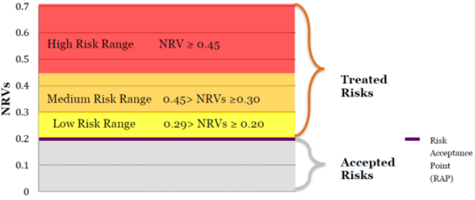

# Risk Management

[[_TOC_]]

## Theory

### Introduction. The ISO 27000 family of standards

- What is a risk
  - Risk: effect of uncertainty on objectives (ISO 31000)
  - Enterprise Risk Management (ERM) has a broader scope (beyond cyber risks): risk management in agencies
  - Risk management: process of identifying, monitoring and managing potential risks in order to minimize the negative impact they may have on an organization. Examples of potential risks include security breaches, data loss, cyber attacks, system failures and natural disasters. An effective risk management process will help identify which risks pose the biggest threat to an organization and provide guidelines for handling them at the best level of resources
    - Parts
      - Risk assessment and analysis (depends on the company): evaluates an organization's exposure to uncertain events that could impact its day to day operations and estimates the damage those events could have on an organization's revenue and reputation
        - Probability vs Impact

          

      - Risk evaluation (how company faces the risk): compares estimated risks against risk criteria that the organization has already established. Risk criteria can include associated costs and benefits socio economic factors legal requirements and system malfunctions
      - Risk treatment (how company handles risk): implementation of policies and procedures that will help avoid or minimize risks Risk treatment also extends to risk transfer and risk financing
        - Actions that can be taken
          - Avoid risk
          - Minimize risk
          - Transfer risk
          - Accept risk
    - Risk evolution

      

- The ISO 27X standards family (list of requirements aimed to certification)
  - List of documents
    - ISO/IEC 27000:2018 Information technology - Security techniques Information security management systems - Overview and vocabulary
    - ISO/IEC 27001:2013 (normative) Information technology - Security techniques - Information security management systems - Requirements
      - Uses a top down, risk-based approach and is technology-neutral:
        - Defining ISMS scope
        - Developing the risk assessment (which risks are under direct control and which not)
        - Selection of controls
        - Statement of Applicability
        - Reviewing risks
        - Management commitment
        - ISMS internal audits
        - Results of effectiveness and measurements (summarised statement on "measures of effectiveness")
        - Specify the details for documentation, management responsibility, internal audits, continual improvement, and corrective and preventive action
      - Requirements for information security management system
        - Scope of the standard
        - Normative references. How the document is referenced 
        - Reuse of the terms and definitions in ISO/IEC 27000
        - Context of the Organization 
        - Leadership and high-level support for policy
        - Planning the information security management system; risk assessment; risk treatment
        - Supporting an information security management system
        - Making an information security management system operational
        - Performance evaluation: Reviewing the system's performance
        - Improvement. Corrective actions
      - ISMS (Information Security Management System): systematic approach to managing sensitive information so that it remains secure
        - Includes policies, procedures, plans, roles, responsibilities, structures used to protect and preserve information
        - Based on a risk management process
        - The ISO 27000 family standards has been developed to help for ISMS implementation and maintenance, on the basis of a cycle of continuous improvement
      - Risk management paragraphs
        - 6.1.2. Information Security Risk assessment
          - The organization shall define and apply an Information security risk assessment process
        - 6.1.3. Information Security Risk treatment
          - The organization shall define and apply an information security risk treatment process
        - 9.2 Internal audit
        - Annex A (normative) contains the (114) control objectives and controls, aligned with ISO 27002
      - Documented information: list of evidence in written form which the auditor will use when the do the audit, also available to employees to make sure they know what they are doing
      - Security controls: TODO (slide 1)
    - ISO/IEC 27002:2013 - Information technology - Security techniques - Code of practice for information security controls
    - ISO/IEC 27003, Information security management system implementation guidance
    - ISO/IEC 27004, Information security management - Measurement
    - ISO/IEC 27005:2018 Information technology - Security techniques - Information security risk management
    - ISO/IEC 27014:2018 Information technology - Security techniques - Governance of Information security 
    - ISO/IEC 27032:2012 Information technology - Security techniques - Guidelines for Cybersecurity
      - Cybersecurity: preservation of confidentiality, integrity and availability in the Cyberspace
      - 27001 vs 27032

        

      - Areas of focus
        - Bridging the gap between the different security domains in cyberspace
          - Threats
            - Social engineering attacks
            - Hacking
            - Proliferation of malicious software (malware)
            - Spyware
            - Other potentially unwanted software
          - Controls will address these risks, preparing, detecting, monitoring and responding to attacks
        - Collaboration among stakeholders
          - Stakeholders include
            - Consumers
            - Providers
            - Law enforcements
          - Provides a framework for establishing trust and processes for
            - Information sharing
            - Coordination
            - Incident handling
      - Cybersecurity domains

        

      - Security concepts and relationships

        

      - Guidelines for stakeholders
        - Important aspects to remember when considering the goals and objectives of Cybersecurity
          - Protect the overall security of the Cyberspace
          - Plan for emergencies and crises through participation in exercise, and update response plans and plansfor continuity of operations
          - Educate stakeholders on Cybersecurity and risk management practices
          - Ensure timely, relevant and accurate threat information sharing between law enforcement and intelligence communities and key decision makers relevant to the Cyberspace
          - Establish effective cross-sector and cross-stakeholder coordination mechanisms to address critical interdependencies
        - Consumers
          - Learn and understand the security and privacy policy of the site and application concerned
          - Learn and understand the security and privacy risks involved and determine appropriate controls applicable; participate in related online discussion forums or ask someone who knows about the site or application before providing personal or organization information
          - Establish and practice a personal privacy policy for identity protection by determining the categories of personal information available and sharing principles relating to that information
          - Manage online identity: use different identifiers for different web applications, and minimize the sharing of personal information to each website or application requesting such information
          - Report suspicious events or encounters to the relevant authorities
          - As a buyer or seller, read and understand the online marketplace's site security and privacy policy, and take steps to verify the authenticity of the interested parties involved. Do not share personal data, including banking information, unless a genuine interest to sell or buy has been established. Use a trustworthy payment mechanism
          - Practice secure software development and provide a hash value of the code online so that receiving parties can verify the value if necessary to ensure integrity of the code. Provide documentation of the code security and privacy policies and practices and respect the privacy of code users
          - As a blogger or other content contributor ensure that applicable stakeholder privacy and sensitive information are not disclosed through the blogs or online publications. Review comments and postings received on the site and ensure that they do not contain any malicious content such as links to phishing websites or malicious downloads
          - As a member of an organization, an individual consumer should learn and understand the organization's corporate information security policy and ensure that classified and/or sensitive information are not released intentionally or by accident on any websites in the Cyberspace, unless prior authorization for such disclosure has been formally granted
          - When a consumer visits a site which requires authorization, and unintentionally gains access, the user may be labelled as an intruder. Exit the site immediately and report to the relevant authority, since the fact that it was possible to gain access can be an indication of a compromise
        - Organizations and service providers
          - Operate an ISMS
          - Provide secure products (by design)
          - Network monitoring and response
          - Support and escalation
          - Keep up-to-date with latest developments
          - When hosting web and cyber-application services, offer terms of agreement
      - Cybersecurity controls
        - Application level controls
          - Display of short notices, which provide clear, concise one-page summaries (using simple language) of the company’s essential online policies. With this, users are able to make more informed choices about sharing their information online
          - Secure handling of sessions for web applications (cookies)
          - Secure input validation and handling to prevent common attacks such as SQL-Injection
          - Secure web page scripting to prevent common attacks such as Cross-site Scripting
          - Code security review and testing by appropriately skilled entities
          - The organization's service should be provided in a fashion that the consumer can authenticate it
        - Server protection
          - Configure servers, including underlying operating systems, in accordance to a baseline security configuration guide, including proper definition of server users versus administrators, enforcement of access controls on program and system directories and files, and enabling of audit trails
          - Implement a system to test and deploy security updates
          - Monitor the security performance of the server through regular reviews of the audit trails
          - Review the security configuration
          - Run anti-malicious software controls
          - Perform regular vulnerability assessments and security testing for the online sites and applications
          - Regularly scan for compromises
        - End-user controls
          - Use of supported operating systems, with the most updated security patches installed
          - Use of the latest supported software applications, with the most updated patches installed
          - Use anti-virus, anti-spyware tools, pop-up blockers, script blockers, phishing filters, personal firewall and an intrusion detection system
          - Enable automated updates, ensuring that systems are updated with the latest security patches whenever they are available
        - Controls against social engineering attacks
          - Policies: governing the creation, collection, storage, transmission, sharing, processing and general use of organizational and personal information and intellectual property on the Internet and in the cyberspace
          - Methods and processes: defining for each category and classification of information involved, specific security controls for protection against accidental exposure and intended unauthorized access
          - Awareness and training: employees and third-parties contractors should be required to undergo awareness training in order to ensure that they are aware of their roles and responsibilities in the Cyberspace
          - Testing: conduct periodic tests to determine the level of awareness and compliance of the staff with related policies and practices
          - People and organizations: people need to be aware of related risks in the Cyberspace, and organizations should establish relevant policies and take proactive steps to sponsor programs to ensure people's awareness and competency
        - Framework for information sharing and cooperation
          - A system needs to be established for information sharing and coordination to help responsible organizations to prepare and respond to Cybersecurity events and incidents
          - Methods for sharing and coordinating based on classification/categorization, non-disclosure agreements, code of practice, testing and drills, reciprocal trust framework
  - ISO 27000: family of standards for IT and Communications Systems Security
    - Builds an Information Systems Management System (ISMS)
    - Based on the Plan-Do-Check-Act cycle
    - Provide trustiness to/from third parties
    - Aimed at effectiveness: spend as much as you need to counter your risks
    - Protect the Confidentiality-Integrity-Availability information triad

### The ISO 27005 standard for management of information technology risks

- Used to make risk assessment (Identification, Analysis and Evaluation) in organizations
- Risk assessment
  - Why?

    

    - Fastest way to gain a complete understanding of an organization's security profile; its strengths and weaknesses, its vulnerabilities and exposures
    - You must measure to manage
  - Very complicated to do
  - Definitions
    - Risk: effect of uncertainty on objectives
    - Threat: potential cause of an unwanted incident, which may result in harm to a system or organization
    - Vulnerability: weakness of an asset or control that can be exploited by one or more threats
    - Control: measure that is modifying risk
  - ISO 27005: Information Security Risk Management guideline
    - Provides a RA guideline and does not recommend any RA methodologies
    - Applicable to organizations of all types
    - Benefits
      - Risks being identified
      - Risks being assessed in terms of their consequences to the business and the likelihood of their occurrence
      - The likelihood and consequences of these risks being communicated and understood
      - Priority order for risk treatment being established
      - Priority for actions to reduce risks occurring
      - Stakeholders being involved when risk management decisions are made and kept informed of the risk management status
      - Effectiveness of risk treatment monitoring: are we aware?
      - Risks and the risk management process being monitored and reviewed regularly
      - Information being captured to improve the risk management approach
      - Managers and staff being educated about the risks and the actions taken to mitigate them
    - Approach
      - Depending on the scope and objectives of the risk management different approaches can be applied
      - An appropriate risk management approach should be selected or developed that addresses basic criteria such as risk evaluation criteria, impact criteria, risk acceptance criteria
        - Risk acceptance criteria: depend on the organization's policies goals objectives and the interests of stakeholders
          - Can include multiple thresholds with a desired target level of risk but provision for senior managers to accept risks above this level under defined circumstances
          - Can be expressed as the ratio of estimated profit or other business benefit to the estimated risk different
          - Can apply to different classes of risk
          - Can include requirements for future additional treatment (e.g. a risk can be accepted if there is approval and commitment to take action to reduce it to an acceptable level within a defined time period)
          - Can differ according to how long the risk is expected to exist (e.g. risk can be associated with a temporary or short term activity)
          - Should be setup considering Risk appetite
            - Business criteria
            - Operations
            - Technology
            - Finance
            - Social and humanitarian factors
      - The organization should assess whether necessary resources are available to
        - Perform risk assessment and establish a risk treatment plan
        - Define and implement policies and procedures including implementation of the controls selected
        - Monitor controls and monitor the information security risk management process
    - Organization: should be approved by the appropriate managers of the organization
      - Development of the information security risk management process suitable for the organization
      - Identification and analysis of the stakeholders
      - Definition of roles and responsibilities of all parties both internal and external
      - Establishment of the required relationships between the organization and stakeholders as well as interfaces to the organization's high level risk management functions (e.g. operational risk management) as well as interfaces to other relevant projects or activities
      - Definition of decision escalation paths
      - Specification of records to be kept
    - Methodologies
      - Qualitative: uses a scale of qualifying attributes to describe the magnitude of potential consequences (low medium and high) and the likelihood that those consequences will occur
        - Pros and cons
          - Advantage: ease of understanding by all relevant personnel 
          - Disadvantage: is the dependence on subjective choice of the scale
        - These scales can be adapted or adjusted to suit the circumstances and different descriptions can be used for different risks
        - Usage
          - As an initial screening activity to identify risks that require more detailed analysis
          - Where this kind of analysis is appropriate for decisions where the numerical data or resources are inadequate for a quantitative risk analysis
      - Quantitative: uses a scale with numerical values for both consequences and likelihood
        - Uses historical incident data
          - Pros and cons
            - Advantage: can be related directly to the information security objectives and concerns of the organization
            - Disadvantage
              - Lack of such data on new risks or information security weaknesses
              - Auditable data is not available thus creating an illusion of worth and accuracy of the risk assessment
        - Formulas

          

          - Legend

            

          - Acceptance threshold
            - All risks that fall under a pre-established NRV (threshold) are acceptable and can be retained
            - The threshold is modifiable/ied by management during the process of repetition/continuous improvement
          - Levels (risk categories)

            

    - Workflow

      

      - Information Security Risk Assessment = Risk Analysis + Risk Evaluation
        - Risk Analysis = Risk Identification + Risk Estimation
          - Risk Identification: risk characterized in terms of organizational conditions
            - Identification of Assets
            - Identification of Threats
          - Risk Estimation: specifies the measure of risk
            - Qualitative
            - Quantitative
        - Risk Evaluation: compares and prioritizes Risk Level based on Risk Evaluation Criteria and Risk Acceptance Criteria
      - Risk assessment workflow

        

        1. General description of ISRA

           

        2. Risk analysis: risk identification
           1. Identification of assets

              

           2. Identification of threats)

              

           3. Identification of existing controls

              

           4. Identification of vulnerabilities

              

           5. Identification of consequences

              

        3. Risk analysis: risk estimation
           1. Assessment of consequences

               

           2. Level of risk estimation

              
            
        4. Risk analysis: risk evaluation

              

      - Decision tables
        - Ranking of Threats by measure of risks

          

        - Ranking of threats in order of their associated measure of risks

          

          - `Consequence * Likelihood = Measure of risk`
        - Likelihood of an incident scenario

          

        - Decision table (matrix of acceptance)
          - A: Acceptable; retain, do nothing, prepare recovery
          - N: Non acceptable; countermeasures

          

      - Risk treatment

        

        - Modification (mitigation): handling the risk
        - Acceptance/retention: accept that nothing can be done (the risk owner decides, take care of consequences)
        - Avoidance: decide to do nothing (if the risk of going as a tourist in Siria then you don't go)
        - Sharing/transfer: insurance
      - Risk communication
        - Provide assurance of the outcome of the organization’s risk management
        - Collect risk information
        - Share the results from the risk assessment and present the risk treatment plan
        - Avoid or reduce both occurrence and consequence of information security breaches due to the lack of mutual understanding among decision-makers and stakeholders
        - Support decision making
        - Obtain new information security knowledge
        - Coordinate with other parties and plan responses to reduce consequences of any incident
        - Give decision-makers and stakeholders a sense of responsibility about risks
        - Improve awareness
      - Risk monitoring and review: monitor and review risk factors