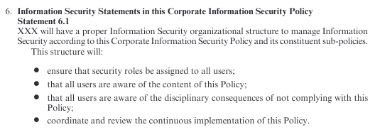
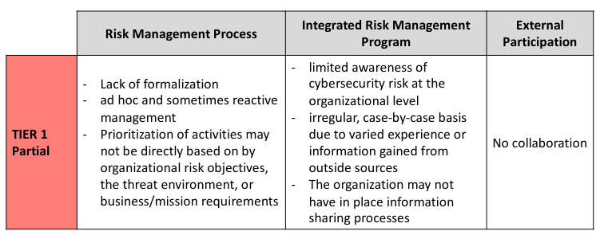
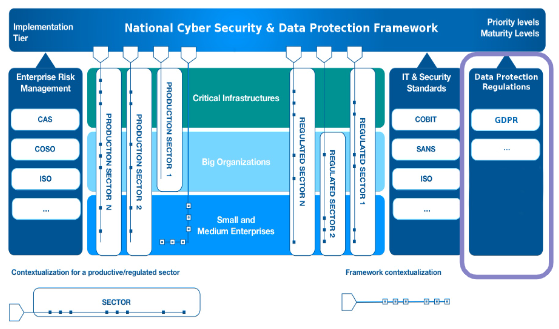
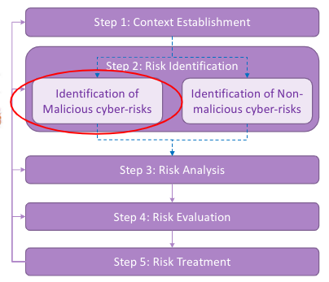
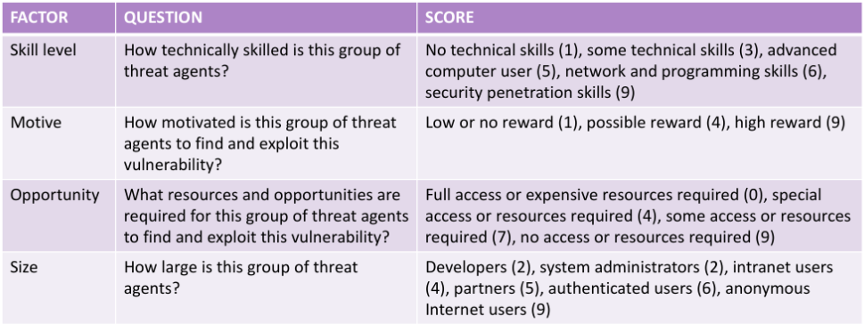
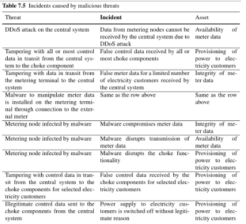
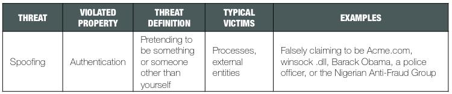
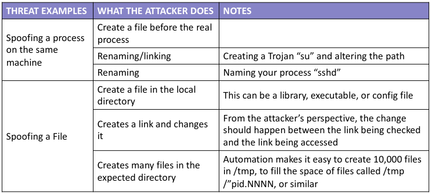
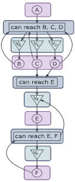

# Security Governance

[[_TOC_]]

## Theory

### Introduction

- Example: there is an enterprise that has a mission, a business objective
  - In order to do that it will use several ingredients
    - Employees
    - ICT (IT)
    - Business process that regulates how people work (organization) and how these people use the ICT infrastructure
  - We want to protect the enterprise from people who use ICT infrastructures and those
- Governance
  - What is?
    - Governance is all of the processes of governing, whether undertaken by a government, a market or a network, over a social system  and whether through the laws, **norms**, power or language of an organized society
    - The Governance is the processes of interaction and decision-making among the actors involved in a collective problem that lead to the creation, reinforcement, or reproduction of social **norms** and institutions
    - Summary: governance = processes in compliance with norms
  - Levels

    

    - Enterprise governance: structure and relationships that control, direct, or regulate the performance of an enterprise [and its] projects, portfolios, infrastructure, and processes (i give the direction and check if it is right, else i change direction; more or less like cruise control)
      - Business governance: set of policies and business processes that set the way that the organisation's business is run (handles the process of buying stuff, selling ecc..)
      - Corporate governance: system of rules, practices and processes by which a firm is directed and controlled (check that what is done in the business governance is done well)
        - Process

          

          - Direct: from abstract to concrete level
          - Execute: check what has been defined by the "direct" process (that it works) and apply it
          - Control: check if the policy is working well, if not query the higher levels
        - Problems: you could have problems in the process, in employees, in the network, in the organizational part... when you talk about governance you must consider everything together
        - Risk management: enterprise governance is a set of responsibilities and practices exercised by the board and executive management with the goal of providing strategic direction, ensuring that objectives are achieved, accertaining that risks are managed appropriately and verifying that the enterprise's resources are used responsibly

          

  - Enterprise governance decomposition

    

    - Note: lower levels don't talk to eachother, they talk using the corporate governance
    - IT Governance: IT based systems causes serious risks to a company as it manages and stores many (if not all) electronic assets like
      - I have to consider all the possible attacks/positions/behaviors of the attacker; protecting from the outside is not enough
      - I need numbers of what i'm doing to check if i'me getting better or not
- Security governance
  - Definition: security governance is the means by which you control and direct your organisation's approach to security
  - NIST special publications (SP) formalize a lot of things about security governance
  - Approach: no "one size fits all"

    

    - How to identify the correct approach
      - Everything should be cost-effective, no overprotection or underprotection
      - Questions
        - How large and complex is your organisation?
        - What resources are available for security governance?
        - What does your organisation do and how important is security to those aims?
        - Are there any external considerations (for example contractual, legal, regulatory or sector specificrequirements)?
      - Identify:

        

        - WHAT i have to do?
        - WHO is going to take the decision?
        - DATA: instrument to take decision
  - Positioning

    

  - Statistical notes
    - Incidents are more problematic than breaches (security, confidentiality ecc are compromised, in breaches just confidentiality)
    - People are the major source of problems
    - Organized crime is the major source of problems (not single criminals/script kids)
    - Motivations are financial or espionage
    - Phishing and social engineering are the most used techniques
    - The most hit domains aren't the most critical ones, because critical infrastructures are more prone to cybersec
    - No one is safe, vulns grow
    - Higher the time you use to discover the problem higher will be the restoring cost

### Security governance model


- Front dimension (core part)
  - It represents the execution of processes and actions and the influence of the Direct and Control loop on these processes
    - Core principles
      1. It covers the 3 well known level of management (strategic = what to do, tactical = how to do this, operational = practical)
         - Granularity 
           - Bottom to top: you have to aggregate
           - Top to bottom: you have to divide 
      2. Across these 3 levels, there are very distinct actions
         - Example
           - The Board is not interested in knowing that 321 virus attacks occurred last week and that 27 software patched and 7 anti-virus software updates took place  
           - The Board wants to know whether the company's access to the internet causes any unmitigated risks to the company
  - Direct part
    
    

  - Control part
    - You can only manage what you can measure (number of ids alerts, vulns, IOCs...), this measurability must be at the centre of all directives, policies, standards and procedures produced during the Direct part of the model

    

  - Best practices (and standards): tell how to do the right things in the right way
    - What is: set of documents reporting experiences and solutions experienced by experts in ISM
    - You have to adapt to your situation
    - Families of documents
      - ISO 27000 family
        - ISO 27002
          - Used by organizations that intend to
            - Select controls within the process of implementing an ISM System based on ISO/IEC 27001
            - Implement commonly accepted information security controls
            - Develop their own information security management guidelines
          - Each clause (in the index the bold ones) defining security controls contains one or more main security categories
            - Each main category contains
              - A control objective stating what needs to be achieved
              - One or more controls that can be applied to achieve the control objective
            - Control description structure

              

        - ISO 27001
          - Specifies the requirements for establishing, implementing, maintaining and continually improving an ISMS within the context of the organization
          - Includes requirements for the assessment and treatment of information security risks tailored to the needs of the organization
        - Comparison
          - 27001 vs 27002: the first is specific and strict (some sort of checklist), the second is a guideline so is not very specific (is like an experienced suggestion)
          - Together, 27001 and 27002 are used to get certified
      - COBIT
      - NIST SP 800-*
      - CSC
      - NIST CSF
- Depth dimension
  - Directive: Security Policy documents are required from Standards and Best Practices
    - Example: from ISO 27002 we have

      
    
    - Information Security Policy Architecture (ISPA) and related Documents: set of documents
      - Documents sets
        - Board-initiated Directive concerning Information Security Governance: what is the asset and how to protect it
        - Corporate Information Security Policy (CISP) flowing from the Directive: translates direction of the board directive into a frame of policies, describe how policies are created and point to them
          - Guidelines of creation
            - Must indicate Board and executive management support and commitment and it must be clear that the CISP flows from a higher-level directive
            - Must be accepted and signed by the CEO or equivalent officer
            - Must not be a long document, nor must it be written in a technical form, the maximum length should be about four to five pages, and it must contain high-level statements concerning Information Security
            - Should not change very often, and must be "stable" as far as technical developments and changes are concerned
            - Must not contain any references to specific technologies
            - Must indicate who is the owner of the Policy and what the responsibilities of other relevant people are
            - Must clearly indicate the Scope of the Policy, that is, all people who will be subject to the Policy
            - Must refer to possible (disciplinary) actions for non-conformance to it and its lower-level policies
            - Must be distributed as widely as possible in the company
            - Must have a Compliance Clause
        - Set of detailed sub-policies flowing from the CISP: describe one by one all the policies
          - Malicious Software Control Policy (Anti-Virus Policy)
          - Acceptable Internet Usage Policy
          - Acceptable Email Usage Policy
          - Logical Access Control Policy 
          - Disaster Recovery (Backup) Policy 
          - Remote Access Control Policy
          - Third Party Access Control Policy
        - Set of company standards based on the Corporate and Detailed Policies: how the company setup all the procedures standards (different from external standards, ISO, NIST ecc..)
        - Set of administrative and operational procedures, again flowing from the detailed set of sub-policies

      

  - Control: providing feedback of the effectiveness of the compliance model
    - Control is explained in the best practice
    - Compliance clauses
      - Compliance monitoring is done by performing periodic ICT Audit sessions
        - ICT risks are evaluated
        - An audit report is produced and its results compared with compliances clauses
      - Issues
        - Timing is a crucial factor
        - The world is dynamic and monitoring should be done in near real time
      - Guidelines: not really defined
        - Must be clear and precise
        - Compliance Clauses should express a way to measure its satisfaction
      - Examples
        - For the board directive
          - "The Board of XXX accepts the importance of the company’s IT infrastructure in furthering the strategic goals of the company. The Board also realizes the potential impact it can have on the company, and the consequences to the company if this IT infrastructure is compromised in any way. For this reason, the Board demands a proper environment to protect the IT infrastructure against any disruptions or compromises. The Board fully supports a proper ISG environment for XXX"
            - Clause: "The Board requires a detailed feedback, every three months, of any serious risks which may compromise the protection of XXX’s ICT infrastructure."
        - For CISP
          - Compliance clause for each statement

          

          - "The way the Information Security function in XXX is organized and the reporting structures within this functions hall be evaluated every 12 months to ensure that the structure stays adequate to ensure the proper protection of all the electronic assets of XXX. The results of this evaluation will be part of the annual evaluation and reporting of organizational structures in the company."
  - Risk management: process to identify and assess all potential risks as well as introducing controls that should mitigate all these risks to acceptable low levels
    - Risk has two factors associated with it
      - Probability or frequency aspect
      - Magnitude of gains or losses (impact) aspect
    - Aim
      - Determine what the impact will be if the risk does materialize
      - Determine how often probability or frequency this risk might materialize
    - Examples
      - If fire destroys the entire computer centre the impact will be serious although the probability that it might happen is fairly small
      - On the other hand the probability that a malicious software virus might infect some business data is fairly high but normally the impact is not serious
    - `Risk = Threat * Probability * Impact = Likelihood * Impact`

      

    - How to reduce risks
      - Reduce the potential impact or the risk
      - Reduce the probability or frequency of the risk
    - ISO27002 sees IT risk analysis as an essential part of best practices in IT
    - Risk + Governance
      - All risks that could possibly have a negative effect on the well being of the organization if and once they materialize are definitely the responsibility of management so all levels of organizational management should be involved in the process of Risk Management
  - Organization: structure the security inside the company from organization pov
    - There must be at least two components in the organization
      - One looking after the day-to-day operational aspects related to it
        - Logical access control management (changing and deleting user access rights from access control lists, etc)
        - Identification and authentication management (the real actions of adding to, changing and deleting from the user ID database and password files etc.)
        - Firewall management (configuring firewalls with the authorized access rights, connecting workstations to LANS and the Internet, etc.)
        - Virus and malicious software management (installing and updating antivirus software)
        - Handling antivirus and related types of security incidents
        - Setting and updating the security settings and configurations of workstations and servers
        - Ensuring availability through UPS systems
        - Ensuring backups and secure storage of backups
        - ...
      - One which is responsible for the compliance monitoring function
        - The level to which previously identified IT risks are managed and mediated
        - The level of Information Security awareness of users
        - The availability, completeness and comprehensiveness of Information Security policies, procedures and standards
        - The level of compliance to such policies, procedures and standards
        - The impact on the IT risk level of the company when policies are not complied with
        - The compliance with regulatory, legal and statutory requirements
        - Software licensing issues
        - ...

      

      - Avoid conflict of interests between who is doing and who is checking; they mustn't overlap (who is doing things will be sure of what he did, but that's not good!)

  - Awareness: spread information inside the company (cybersecurity)
    - Must be vertical, span all over the 3 levels
    - Information Security procedures guidelines and practices must be drafted and conveyed to ALL users of information and IT in the organization
    - Information Security Education, Training and Awareness (SETA)
      - Objectives
        - Improve awareness of the importance and need to protect organizational information resources
        - Acquire the necessary skills and know-how to do their jobs more securely
        - Create an understanding and insight into why it is important to protect organizational information assets

      

    - Conscious competence learning model

      

      - Conscious incompetent: start here the training, it will lead to conscious competence
    - Training program
      - Employees must be trained about aspects such as
        - Why information is such an important asset?
        - The information security policy and procedures
        - The role and responsibility of every employee
        - The consequences of not complying with the policy
      - To address issues such as
        - User identification and authentication (passwords)
        - How to choose a password
        - No sharing of user IDs and passwords, etc.
        - Virus control
        - Backing-up information
        - ...

### A Methodology for Establishing an Information Security Governance Environment

- High level: starting from scratch

  

  1. Get the Board's buy-in about IT Risk Management and Information Protection
  2. Select some guiding Best Practices
  3. Perform a basic Risk Analysis and determine all controls needed 
     - Ensure that the relevant controls are installed and operational 
  4. Create a Corporate Information Security Policy (CISP) and get it signed by the Chairman/CEO
     - A CISP must be drafted, be circulated amongst the stakeholders and then submitted to top management
  5. Create the rest of the Information Security Policy Architecture (ISPA)
     - Documents composing the ISPA must be defined
     - This can be done taking as input the risk analysis conducted in Step 3 and the CISP produced in Step 4
  6. Create the organizational structure for ISG
     - Related to Step 7, must be done in parallel
     - Separation between Operational Management and Compliance Management sides but should collaborate
  7. Create an initial set of Compliance/Control measures and start using these measures to create reports on all three management levels
     - Related to Step 6, must be done in parallel
     - Refined over time
     - It will form the basis of the "Control"
     - Let everybody look at these measures
  8. Create an Awareness Programme including aspects like information security job responsibilities
     - Must be performed continuously
  9. Get the cycle going, kick start the process
  10. Redo the Risk Analysis from time to time to identify the possible changes in risks and controls
      - Risks are dynamic (depends on current situation, vulns come and go); it is, therefore, important to redo any Risk Analysis from time to time to ensure that the risk situation is up to date and that relevant controls are installed and operational
  11. Keep the ISPA up to date and in line with newly identified risks
  12. Refine and expand the Compliance Control measures to cater for newly identified risks, enforce compliance and keep reporting to top management
      - Process never stops 
  13. Continue to make all users more Information Security Aware 
      - Process never stops, in other words restart the loop

### Frameworks and best practices

- National Institute of Standards and Technology (NIST, USA)
  - NIST must identify "a prioritized, flexible, repeatable, performance-based, and cost-effective approach, including information security measures and controls that may be voluntarily adopted by owners and operators of critical infrastructure to help them identify, assess, and manage cyber risks"
  - Applicability
    - Developed to improve cyber security risk management in critical infrastructure but it can be used by organizations in any sector
    - It provides a common organizing structure assembling standards guidelines and practices
    - It is applicable to organizations relying on technology
  - Features
    - Technology neutral, general
    - It provides a common taxonomy and mechanism for organizations to
      - Describe their current cybersecurity posture
      - Describe their target state for cybersecurity
      - Identify and prioritize opportunities for improvement within the context of a continuous and repeatable process
      - Assess progress toward the target state
      - Communicate among internal and external stakeholders about cybersecurity risk: NIST scale is comparable with other scales
    - Supports cyber security assessment, planning and monitoring activities
    - The framework can be used to compute the risk
  - NIST CSF document parts
    - Core: set of activities to achieve specific cybersecurity outcomes
      - Not a checklist of actions to perform, it presents key cybersecurity outcomes identified by stakeholders as helpful in managing cybersecurity risk
      - Components

        

        - Explanation
          - Functions: organize basic cybersecurity activities at their highest level

            

          - Categories: subdivisions of a Function into groups of cybersecurity outcomes closely tied to programmatic needs and particular activities
            - Examples:  "Asset Management", "Identity Management and Access Control" and "Detection Processes"
          - Subcategories: further divide a Category into specific outcomes of technical and/or management activities
            - They provide a set of results that, while not exhaustive, help support achievement of the outcomes in each Category
            - Examples: "External information systems are catalogued", "Data-at-rest is protected" and "Notifications from detection systems are investigated"
          - Informative References: specific sections of standards, guidelines, and practices common among critical infrastructure sectors that illustrate a method to achieve the outcomes associated with each Subcategory
        - Examples
          - Identify

            
          
          - Protect

            

          - Detect

            

          - Respond

            

          - Recover

            

    - Implementation Tiers: provide context on how an organization views cyber security risk and the processes in place to manage that risk, is aimed at checking how robust are your processes
      - Ranging from Tier 1 to Tier 4, Tiers describe an increasing degree of rigor and sophistication in cyber security risk management practices
      - Tiers

        

        

        

        

    - Profiles: alignment of the Functions, Categories, and Subcategories with the business requirements, risk tolerance, and resources of the organization
      - Used to describe the current state or the desired target state of specific cybersecurity activities
  - How to use the framework
    1. Basic Review of Cybersecurity Practices
    2. Establishing or Improving a Cybersecurity Program 
    3. Communicating Cybersecurity Requirements with Stakeholders
    4. Buying Decisions 
    5. Identifying Opportunities for New or Revised Informative References
    6. Methodology to Protect Privacy and Civil Liberties
    7. Self-Assessing Cybersecurity Risk with the Framework 
- National Cybersecurity Framework (Italy)

  

  - Initial Objectives
    - Bring cyber risk awareness to the highest levels of the business considering the Italian economic landscape (small companies are the higher part, big companies are few)
    - Create something which is recognized at international level
    - Do not reinvent the wheel (based on NIST)
  - What the National Framework is and what is not
    - The National Framework is not a Standard (not certifiable)
    - It is a tool for self-assessment: allows organizations to assess their current cybersecurity posture (current profile) and define the desired one (target profile)
    - Support in the gap analysis and the definition of a roadmap to close the gap between the current and the target profile 
  - What has been added?
    - In the table two cols have been added for Contextualization (customization so as to adapt the framework to a specific context)

      

      - Priority Levels: define which categories are the most important based on the company i'm applying the framework to
      - Maturity Levels
    - With contextualization we can
       1. Select subcategories
       2. Definition of priority level for each subcategory
       3. Define maturity level and controls to reach them
    - Given a contextualization it is possible to define 
      - The Current Profile ("as is" state)
      - A Target Profile ("to be" state)
    - When NIST evolved from 1.0 to 1.1 in italy we added the GDPR handling
- Framework comparisons

  

  - FISMA Ecosystem (Federal Information System Management Act, USA): "each federal agency develops, documents and implements an agency-wide program to provide information security to all information and information systems that support assets and agency processes, including those provided or managed by other agencies, contractors or third parties"
    - Implementation
      - Phase 1: Standards and Guidelines Development
        - Documents
          - FIPS Publication 199, Standards for Security Categorization of Federal Information and Information Systems (Final)
            - Defines the potential impact on organizations and individuals in case of confidentiality, integrity, or availability loss (3 levels)
          - FIPS Publication 200, Minimum Security Requirements for Federal Information and Federal Information Systems (Final)
            - All agencies owning federal data must have their information systems certified according to 800-53 with low, moderate and high profiles compared to baseline 800-53
          - NIST Special Publication 800-53 Revision 4, Security and Privacy Controls for Federal Information Systems and Organizations (Final)
            - Other revisions
              - NIST Special Publication 800-53 Revision 3, Recommended Security Controlsfor Federal Information Systems and Organizations(Final)
              - NIST Special Publication 800-53A Revision 1, Guide for Assessing the Security Controls in Federal Information Systems and Organizations, Building Effective Security Assessment Plans (Final)
            - Aims
              - Provide a security and privacy controls catalogue for federal organizations and information systems
              - Provide a process to select controls to protect Mission, functions, image, reputation, assets, individuals, State from cyber attacks, disasters, malfunctions and human errors
              - Provide a methodology for selecting critical controls (baseline)
            - Organization
              - Controls are organized into 18 families, each contains security controls related to the general security topic of the family

              

            - Security control structure

              

            - Security control baseline
              - Aim: assist organizations in making the appropriate selection of security controls for information systems
              - Baseline controls
                - Starting point for the security control selection process (as described in the document)
                - Chosen based on the security category and associated impact level of information systems (determined in accordance with FIPS Publication 199 and FIPS Publication 200)
              - Three security control baselines have been identified corresponding to the low-impact, moderate-impact, and high-impact information systems 
            - Limitations
              - Tied to the concept of federal information systems, to the US Legislation
              - Very complex and oriented to operational people
              - Not certifiable outside the USA 
            - Target audience

              

          - ...
      - Phase 2: Implementation and Assessments Aids
  - ISO 27001 and 27002: most international framework
    - Limitations
      - It is expensive and therefore it is rare to see adopting the standard
      - It does not define any priority between controls
      - All requirements are mandatory
      - It is voluntary
    - Target audience

      

  - ISO 27k vs NIST SP 800-53
    - The 800-53 has an appendix that provides the mapping between the controls of the two standards
    - All FISMA standards are very "system-oriented" while ISOs are dedicated to the organization
    - The FISMA certification is for "IT-System" while for the ISO it is for "management System"

    

    - Image is a bit outdated
  - NIST is more or less an aggregation of all the above cited

### Risk management

- Risk: likelihood of an incident and its consequence for an asset
  - Asset: anything of value to a party
  - Party: organization, company, person, group, or other body on whose behalf a risk assessment is conducted
  - Likelihood: chance of something to occur
  - Incident: event that harms or reduces the value of an asset
  - Consequence: impact of an incident on an asset in terms of harm or reduced asset value
- Risk management: coordinated activities to direct and control an organization with regard to risk

  

  - Use standards, don't reinvent the wheel!
- Standards
  - ISO 31000
    - Provides a common approach to managing any type of risk and is not industry or sector specific
    - Can be used throughout the life of the organization and can be applied to any activity, including decision-making at all levels
    - Can not be used for certification purposes, but does provide guidance for internal or external audit programmes
    - Structure 

      

      - Principles

        

        - Integrated: make actions to perform really actionable in the environment of the company (if you say: "patch the vulnerability" but the vulnerability is on a submarine at the bottom of the ocean then the system is not integrated)
        - Structured and comprehensive: consisted and comparable results (because we apply the system iteratively)
        - Customized: customize to the specific environment
        - Inclusive: involving stakeholders (and all personnel) increases awareness and informed risk management
        - Dynamic: it's not static, the company is dynamic so the system must be too
        - Best available information: analyze information you need and involve it in the process ("filter"), also represent the information clearly
        - Human and cultural factors: keep in mind that when there are people you must consider the human aspect that brings risk
        - Continual improvement: cyclic process, always refines
      - Framework

        

        - Informartion
          - Purpose: assist the organization in integrating risk management into significant activities and functions
          - Effectiveness: depends on the framework integration into the governance of the organization, including decision-making
          - Customization is needed
        - Components
          - Leadership and commitment: there must be a leader that applies the framework and people must be committed to the process
          - Steps are the same of a software development!
      - Process

        

        - General

          

          - Communication and consultation: create a "snapshot" of the current state
            - Establish a Consultative Team
              - Identify people that should take part to the activity (decision makers,  risk  managers,  employees  with  insight  into  the  organization,  board members, customers..)
              - Roles and responsibilities of the team members must be clearly defined and specified
            - Define a Plan for Communication and Consultation
              - Define how information will be spread consulting the consultative team
                - Formal? Informal?
                - How to acquire information from external stakeholders
                - Based on with who i'm talking to i will use a different language
                - ...
              - Organizations should establish procedures for how to support any of the processes of the overall risk management
                - Different areas of expertise are brought together during risk assessments
                - Interests of all relevant stakeholders are considered
                - Risk evaluation criteria are appropriate
                - Decision making is informed
            - Ensure Endorsement of the Risk Management Process
              - Good procedures for communication help to ensure endorsement and support for the risk management processo
              - Achieve a common agreement on and mutual understanding of how risk should be managed
            - Communicate Risk Assessment Results
              - Results important for
                - Demonstrating policy adherence or compliance with directives and regulations
                - Justifying treatment plans, including the required resources for risk mitigation
              - Communicating the results helps those with a vested interest to  understand the basis on which decisions are made and why particular actions are required
          - Risk assessment: understand and document the risk picture for specific parts or aspects of a system or an organization (from each step you can always come back)
            1. Context Establishment: Identify and Describe the Context (and goals) of the Risk Assessment
               - Context type 
                 - External Context: description of societal, legal, regulatory, and financial environment  and of the relationships with external stakeholders
                 - Internal Context: description of relevant goals, objectives, policies, and capabilities that may determine how risk should be assessed
               - Activities definition
                 - Target of assessment: parts and aspects of the system that are the subject of the risk assessment
                 - Scope of the assessment: extent or range of a risk assessment
                 - Focus of the assessment: main issue or central area of attention in a risk assessmen (identification and documentation of the assets with respect to which the risk assessment is conducted)
               - Context description: input for the risk assessment process
                 1. Identification of the party involved in the Assessment
                 2. Assumption declaration
                 3. Relevant Assets identification for the Risk Assessment (focus of the assessment)
                 4. Risk scales Definition
                    - For consequences and likelihoods
                    - Can be quantitative or qualitative, continuous, discrete, or given as intervals
                 5. Risk evaluation criteria (terms of reference by which the significance of risk is assessed)
            2. Risk Identification: identify, describe, and document risks and possible causes of risk
               - Observations 
                 - Risk is always associated with an incident
                 - There are three elements without which there can be no risk
                   - Asset
                   - Vulnerability: what can be exploited to hurt the asset
                   - Threat: how it is exploited
                 - If we don't have one of these elements then there is no risk!
               - What to identify
                 - Threats, understanding how they may lead to incidents and exploit vulnerabilities
                 - Vulnerabilities
            3. Risk Analysis: estimate and determine the level of the identified risks
               - Observation: risk level is derived from the combination of the likelihood and consequence so `Risk estimation = Likelihoods estimation + Consequences estimation`
               - Likelihoods estimation: determine the frequency or probability of incidents to occur using the defined likelihood scale
                 - How risks are most likely to arise, and which threat sources are most important
                   - Estimate the likelihood that threat sources initiate threats
                   - Estimate the likelihood that such threats may lead to incidents
               - Consequences estimation: estimate the consequence for each assets harm
                 - Conducted by a walk-through of all identified incidents and assigning the estimates with the involvement of personnel representing the party or someone who can judge consequences on behalf of the party
            4. Risk Evaluation: comparison of the risk analysis results with the risk evaluation criteria to determine which risks should be considered for treatment
               1. Consolidation of risk analysis results: focus on the risk estimates that we are uncertain about and where this uncertainty implies doubt about the actual risk level
               1. Evaluation of risk level
               1. Risk aggregation: investigate the identified risks to see whether certain sets of risks should be aggregated and evaluated as a single risk (they interest the same asset, they come from the same threat..)
               1. Risk grouping: group risks that have elements in common
            5. Risk Treatment: identify and select means for risk mitigation and reduction
               - In principle, we should seek to treat all risks that are unacceptable, but in the end this is a question of cost and benefit, no matter the risk level
                 - If a low risk is very cheap to eliminate, we might do so even if the risk in principle is acceptable
                 - If the cost of treating a very high risk is unbearable there may be no other option than to accept it
               - Involve both the identification and the analysis of treatments
               - Take into account that some treatments can create new risks, and that some groups of treatments can reduce the isolated effect of each other
               - Options
                 - Risk Reduction: reducing the likelihood and/or consequence of incidents
                 - Risk Retention: accept the risk
                 - Risk Avoidance: avoid the activity that gives rise to the risk in question
                 - Risk Sharing: transfer the risk or parts of it to another party (insurance or sub-contracting) 
          - Monitoring and review (of risk, risk management): continuously check the snapshot, review and evaluate it
            - Applies to
              - Underlying risk management framework
              - Risk management process
              - Identified risks
              - Measures that the organization implements in order to treat risks
            - Purposes
              - Ensure that controls are effective and efficient
              - Obtain further information to improve risk assessment
              - Analyse and learn lessons from incidents, changes, trends, successes, and failures
              - Detect changes
              - Identify emerging risks 
            - What to check
              - Assets: check changes in asset value or priority over time and internal or external context because assets change over time
              - Vulnerability: check vulnerability that potentially could be exposed to new threats and vulnerability parameters (e.g., exploitability, diffusion, etc.)
              - Threat: check changes in internal or external (new threats can be observed directly, sometimes a new risk assessment is needed)
              - Legal and environmental context
              - Competition context
              - Risk evaluation criteria
              - Resources required for adhering to the risk management framework 
            - Why monitoring?
              - To ensure that the framework and process, as well as all related activities, procedures, roles, and responsibilities, remain relevant, appropriate, and adequate for the organization

### National framework for cybersecurity and data protection

- Based on NIST, extends it
- Version 1.0
  - Contextualization: can be applied to all agencies (targeted to italy, so not a lot of big agencies but a lot of small agencies)
    - How
      - Selection fo subcategories

        

      - Definition of priority for each selected subcategory

        

      - Definition of maturity levels and the controls to reach them

        

    - Given a contextualization is possible to define
      - Current profile (state)
      - Target profile (i want to be!) and also an intermediate target
    - Who should create contextualization? Everybody, or you can "copy" the others
  - Methodology
    1. Identify or define a contextualization
    2. Define priorities and context
    3. Identify systems and assets
    4. Identify current profile
    5. Conduct the risk analysis
    6. Identify the target profile
    7. Identify the gap between current and target profile
    8. Define a roadmap to reach the target profile
    9. Measure performances 
- Version 2.0
  - What's new
    - Update
      - +1 category, +10 subcategories
      - +1 category, +9 subcategories
    - Enriched informative references (GDPR and minimum measures)
    - Integration of the core with Data protection

      

      

      

    - Introduction of Contextualization prototypes
      - Problem
        - Contextualizations aren't good at capturing specific aspects of laws, standards and best practices
        - Contextualizations are tied to the domain in which they are defined
      - Solution: contextualization prototypes
        - Define contextualization templates for specific sectors
          - Specific regulations
          - Technical standards
          - Best practices
        - A contextualization prototype for each subcategory of the framework core
          - Must define its class (mandatory, reccomended, free)
          - May define a priority level
        - A contextualization prototype comes bundled with the relative implementation guide that describes
          - Application context
          - Constraints on the selection of subcategories
          - Definition of priority levels
          - List of security checks for the considered subcategories that will be positioned through several maturity levels inside the contextualization prototype
        - Implementation of the prototype into a contextualization
          - All the mandatory subcategories in the prototype are included in the contextualization
          - The inclusion of reccommended subcategories in the prototype must be evaluated, considering elements coming from the application context
          - Eventual additional constraints regarding the selection of subcategories, and described in the implementation guide, must be considered
        - For each selected subcategory a priority level must be defined; it should be at least equal or more strict than the one defined in the prototype, following what is written in the implementation guide
        - Security checks can be integrated in the implementation guide of the whole contextualization
        - Using prototypes: they are "modular"

          

          - For each subcategory, if at leat one priority level is High, the final priority level of that subcategory must be set to High
            - In other cases two strategies
              - Risk based: assign the maximum priority level
              - Cost based: assign the minimum priority level
          - If prototypes overlap integrate them, always taking in consideration your context

            
      
      - General process

        

### Cyber-risk management

- Cyber-systems
  - Cyberspace: collection of interconnected computerized networks, including services, computer systems, embedded processors, and controllers, as well as information in storage or transit
  - Cyber-system: system that makes use of a cyberspace
  - Cyber-physical system: cyber-system that controls and responds to physical entities through actuators and sensors
- Cybersecurity: protection of cyber-systems against cyber-threats
  - Cyber-threat: threat that exploits a cyberspace
    - Types: effects are the same but the source is different (different actions to restore and to measure)
      - Malicious
      - Non-malicious (accidental)
  - Relation between cybersecurity and information security

    

  - Relation between cybersecurity and critical infrastructure protection/critical information infrastructure protection (CIP/CIIP, prevention of the disruption, disabling, destruction, or malicious control of infrastructure)

    

    - Example: electricity grid is just from the pov of CIP
    - Example: software switches that control the electricity is just from the pov of cybersecurity
  - Cyber-risk: risk that is caused by a cyber-threat
    - Types
      - Malicious
      - Non-malicious
      - In the middle
        - Example: incident of unauthorized access to some sensitive data can be caused by
          - A hacker (malicious) + Accidental posting of the data on an open website (non-malicious) 
    - Communication and consultation
      - Challenges: the cyberspace is SO WIDE
        - Cyber-systems may potentially have stakeholders everywhere (how to reach them safely?)
        - There may potentially be adversaries everywhere
      - Help from repositories (mantained by the community) of up-to-date information regarding
        - Cyber-threats
        - Vulnerabilities and incidents
        - Potential and confirmed adversary profiles
        - Current strategies and mechanisms for cyber-risk mitigation
        - ...
    - We need to define procedures and techniques to face communication and consultation challenges (and in general cyber-risk challenges)
    - Main difference between malicious and non-malicious

      

      - Difference: malicious there are attackers and defenders, in the other not
      - Just at the evaluation the two aspects are merged
    - Procedure
      1. Context establishment for cyber-risk
         - Define
           - Attack surface: all of the different points where an attacker or other threat source could get into the cyber-system, and where information or data can get out (huge surface)
             - Very difficult to define an attack surface because is huge
           - Assets (also here huge)
             - Must be defined taking into account technical and business perspective
      2. Identification of malicious cyber-risk

         

         - Risk assessor observe the match and tries to define techniques to face the risk generated by the attacker from a high point of view
         - Process

            

            1. Malicious threat source identification
               - Who is? 
               - Is a human, a software or a malware?
               - What is the motivation? (effort)
               - Are they skilled? What is the scope?
               - How attack can be launched?
                 - Internal/external
                 - Policy that doesn't work
                 - Vulnerability
               - Is he internal or external the society? 
            2. Malicious threat identification 
               - Pay attention to your entrypoints (higher is the number of people accessing that machine higher is the likely of it being an entrypoint)
               - Make active use of the description of the target of assessment, investigating where and how attacks can be launched 
                 - You can use MITRE, OWASP, NIST... frameworks
            3. Malicious vulnerability identification
               - Focus on the identified attack surface 
                 - Investigate existing controls and defence mechanisms to determine their strength
                 - Run security testing (penetration testing and vulnerability scanning)
            4. Malicious incident identification
               - Investigating how the malicious threats can cause harm to the identified assets given the identified vulnerabilities 
      3. Identification of Non-malicious Cyber-risk
         - Info 
           - There is no intent or motive behind non-malicious risks
           - Not practical to start by identifying and documenting threat sources
           - Recommended to start from the valuables to be defended (start from the incident and identify the process that lead to the incident)
         - How to
           1. Answer to the question "In which way the considered asset may be directly harmed?"; each possibility corresponds to an incident
           2. Identify the vulnerabilities and threats that may cause these incidents
           3. Identify the non-malicious threat sources that can cause threats

           

           1. Non-malicious Incident Identification
              - Accidents and unintended acts are often recurring and known (use logs, monitored data, and other historical data to support the identification) 
           2. Non-malicious vulnerability identification
              - Investigate technical parts of the target of assessment, as well as the culture, routines, awareness, and so forth of the organization and personnel in question (help in ISO 27005)
                - Example (taken from ISO 27005 annex, done manually)

                  

           3. Non-malicious threat identification
              - Which unintended events may lead to the identified incidents due to the identified vulnerabilities, and how?
                - Set of situation given the vulnearability and that leads to the incident
              - Info in ISO 27005

                

           4. Non-malicious threat source identification
              - Who are the users of the system, and how can they cause the unintended or accidental events?
              - Consider also non-human threat sources, such as failure of hardware or other technical components, wear and tear, acts of nature...
              - Event logs and historical data aid the identification of non-malicious threat sources
      4. Analysis of cyber-risk
         - Analysis of cyber-risk vs risk analysis in general
           - For malicious threats behind which there is human intent and motive, it can be hard to estimate the likelihood of occurrence
           - Due to the nature of cyber-systems we have several options for logging, monitoring, and testing that can facilitate the analysis
         - Use techniques for threat modelling to describe aspects such as attack prerequisites, attacker skills or knowledge required, resources required, attacker motive, attack opportunity..
         - Similar descriptions can be made for vulnerabilities, such as ease of discovery and ease of exploit
         - In combination, this information can be used to derive likelihoods of threats and incidents 
      5. Evaluation of cyber-risk

         

      6. Treatment of cyber-risk
         - Two features that distinguish the risk treatment of cyber-systems from the general case
           - The highly technical nature of cyber-systems means that the options for risk treatment are also technical (consider also sociotechnical aspects and human involvement)
           - The distinction between malicious and non-malicious cyber-risks has implications for the most adequate risk treatment
    - Sources of information and frameworks
      - MITRE CAPEC: publicly available catalogue of attack patterns along with a comprehensive schema and classification taxonomy created to assist in the building of secure software
      - MITRE CWE: community-developed list of common software security weaknesses. It serves as a common language, a measuring stick for software security tools, and as a baseline for weakness identification, mitigation, and prevention efforts
      - NIST national vulnerability database

### Cyber-risk management: challenges and guidelines

- Challenges
  - Which Measure of Risk Level to Use?
    - Measures
      - Two-factor measure
        - Factors
          - Consequences
          - Likelihood
        - Conceptually 

          

      - Three-factor measure
        - Risk: a combination of the likelihood that a threat will occur, the likelihood that a threat occurrence will result in an adverse impact, and the severity of the resulting impact

          

          - Likelihood is split in threat and vulnerability
        - Factors
          - Consequence
          - Threat
          - Vulnerability
        - Conceptually

          

      - Many-factor measure: threats and vulnerabilities are analyzed under different factors
        - Factors
          - Likelihood
            - Threat agent factors
            - Vulnerability factors
          - Consequence
            - Technical impact factors
            - Business impact factors
        - Conceptually

          
    - Which is the model I should select? It depends
      - Considerations
        - Data availability is an important parameter when deciding how to measure risk level
          - If you have good data on frequency and consequence you will probably go for the two-factor approach
          - You could use multi-factor when for example you have a lot of sensors (H/NIDS) and logging capabilities
        - Problem: not the lack of data, but the lack of the right kind of data with respect to predefined factors
          - Most cyber-systems generate logs automatically with respect to a (large) number of indicators; in such situations you may try to define your own risk function from factors matching the indicators logged by the cyber-system in question (multi-factor)
          - If we aren't in a cyber context then the lack of right data is highly probable; there isn't a human scanner that gives you back vulnerabilities of the human (maybe a psychilogist but it doesn't scale and people aren't discrete as machines)
        - If you rely on expert or stakeholder opinions to estimate risk level make sure that the factors are carefully defined and easy to keep apart
        - Select the right kind of scale for each factor
  - What Scales Are Best Suited Under What Conditions?
    - The suitability of a scale depends on
      - Factor
      - Kind of risk assessment we are conducting (technical level or business level?)
      - Target of assessment (technical part or business one?)
      - Available data sources
    - Classification of scales
      - Qualitative
        - Nominal Scale
          - Allow the determination of equality
          - Allow to represent disjoint categories
          - Example: NORD, SUD, OVEST, EST
        - Ordinal scale
          - Allow the determination of greater or less
          - Nominal scale + ordering
          - Example: LOW, MEDIUM, HIGH
      - Quantitative
        - Difference scale
          - Allow the determination of equality of intervals or differences
          - Is an ordinal scale such that equality of difference at the level of values implies that the corresponding phenomena are equally distinct
          - Example: celsius scale
        - Ratio scale
          - Allow the determination of equality of ratios
          - Is a difference scale such that equality of ratios at the level of values implies that the corresponding phenomena are equally distinct
          - Example: the number of identity thefts in Europe per year
    - Qualitative vs quantitative
      - Information type
        - Quantitative: information that need to be quantified are homogeneous
          - Works better when the assessment is at a technical level or it requires fine level of granularity
        - Qualitative: information that need to be quantified are NOT homogeneous
        - Passing from quantitative to qualitative is easy, the opposite is not
      - Praticity
        - Quantitative: not practical
          - It depends on at which level you are working: at business is not good, at technical level yes (you have to translate going "up")
        - Qualitative: not satisfactory, result of any risk assessment must be converted to a quantitative scale
    - Scales for likelihood
      - It is not recommended to use probabilities when interacting with people in a risk assessment situation, intervals of frequencies or qualitative scales work best in practice
    - Scales for consequence
      - More or less cost-benefit analysis; depending on the kinds of assets to be protected, this may not work well
        - Example (OK): if the asset in question is a bag of diamonds the consequence of an incident in which some or all of the diamonds are stolen might be equal to the monetary value of the diamonds stolen
        - Example (MHH): if the asset is the integrity of a customer database, it may be easy to characterize the number of records harmed, but hard to say what this means in euros
        - Example (BAD): if the asset is the company’s reputation, it is hard to know or characterize the impact of some incident on it, and even harder to estimate what this impact corresponds to in euros
      - The suitability of a consequence scale depends on the asset in question
        - Define specialized consequence scales for each asset of relevance
      - Define a consequence scale in such a way that it fits its intended usage (e.g., a consequence scale suited for communicating consequences to decision makers may be unsuited to discussions with technical people)
    - What scale to choose (for cyber-risk)? It depends
      - Cyber-risk concerns systems computerized so well-suited for automatic measurement and logging
      - A complicating feature is the openness of cyberspace and the fact that it is often necessary to measure human intentions and skills
  - How to Deal with Uncertainty?
    - Uncertainty: the state, even partial, of deficiency of information related to, understanding or knowledge of an event, its consequence, or likelihood
    - Type
      - Epistemic: uncertainty due to ignorance or lack of evidence (for example you don't know that an asset exists)
      - Aleatory: relates to the uncertainty due to inherent randomness
    - How to represent uncertainty
      - Using quantitative scale we may represent uncertainty by using intervals; the width of the interval specifies the level of uncertainty

        

      - Using qualitative scales should be expressed as a separate attribute (separate natural language expression for each measurement according to an ordinal scale)

        

    - How much uncertainty is tolerable?
      - It depends on the uncertainty impacts over the decision procedure
    - Reducing uncertainty
      - Fuzzy logic
      - Iterating data collection (i think rechecking it)
      - Comparative Analysis between you and other companies of the market
      - Testing the risk model against historical data or by conducting various surveys across larger groups of stakeholders
  - High-consequence Risk with Low Likelihood
    - Black swan: incident that is extremely rare and unexpected, but has very significant consequences
      - Not likely to be discovered by risk assessment
        - Developing good contingency plans is the best approach to cope with black swans (risk assessment does not make contingency planning/disaster planning) 
    - Gray swan: incident which has far-reaching consequences, but can be anticipated to a certain degree
      - May also easily be overlooked (not noticed)
      - If found must be put in the documentation that we (as risk assessors) consider as input
      - If found we must interact with stakeholders
        - It is fundamental to define an effective process to convey the good message to managers
        - Using probability is not recommended
        - When using quantitative scale, always use a reference
        - If there is considerable uncertainty then it must be communicated to relevant decision makers 
      - Dealing with gray swans
        - Cost of treatment
          - Low: treat gray swans
          - High: decrease consequences and likelihood

### Risk management methodologies overview

- OWASP Risk Rating Methodology
  - Based on the standard two-factors risk model: `Risk = Likelihood * Impact`
  - At first quantitative, then qualitative
  - Steps
    1. Identifying risk (you get better at doing this the more you do it)
       - Gather information about
         - Threat agent involved
         - Attack that will be used
         - Vulnerability involved
         - Impact of a successful exploit on the business
    2. Factors for estimating likelihood
       1. Estimate the likelihood of the particular group of possible attackers (this is not a strict definition, just to give you an idea)

          

       2. Estimate the likelihood of the particular vulnerability involved (assume the threat agent selected above)

          

    3. Factors for estimating impact
       - Technical impact: on the application, the data it uses and the functions it provides

         

       - Business impact: on the business and company operating the application

         

    4. Determining the Severity of the Risk: map quantitative averages to a qualitative level
       - Scale: quantitative -> qualitative

         

       - Approaches
         - Informal Method: just do everything in a way that you prefer, not discrete
         - Repeatable Method: structured

           

           - Determining severity
             - Likelihood and impact estimates can now be combined to get a final severity rating for this risk
               - Business Impact Information are good enough?
                 - YES: use business impact
                 - NO: use technical impact
             - Perform the final mapping

               

    5. Deciding What to Fix: OWASP doesn't give much information, just a guideline 
       - Most severe risks should be fixed first: it does not help the overall risk profile to fix less important risks, even if they are easy or cheap to fix
       - Not all risks are worth fixing: if it would cost $100,000 to implement controls to stem $2,000 of fraud per year, it would take 50 years return on investment to stamp out the loss
    6. Customizing the Risk Rating Model
       - Adding Factors
       - Customizing options
       - Weighting factors 
  - Pros and cons
    - Pros
      - Structured in few simple steps
      - Easy to apply
      - Supported by open source tools
    - Cons
      - Allows only a course grained risk analysis
      - Does not provide too much support to the risk mitigation phase
- CRAMM (CCTA Risk Analysis and Management Method)
  - Qualitative
  - Developed by UK
  - Scope: provide government departments with a method for information systems security reviews
  - Use of meetings, interviews and structured questionnaires for data collection
  - Steps
    1. Identification and Valuation of Assets
       - Data
       - Application software
       - Physical assets (equipment, buildings, staff...)
    2. Threat and Vulnerability Assessment: split threats and vulnerabilities into groups
       - There are predefined tables for threat/asset group and threat/impact combinations
       - Targeting a managerial level risk assessment (never consider technical vulnerabilities)
       - Modes
         - Full risk assessment
           - Threats and vulnerabilities analysis is driven by questionnaires allowing to entering the answers in the tool
           - The tool calculates levels of threat to assets as well as levels of vulnerability to threats
         - Rapid risk assessment: threat and vulnerability levels are inputted directly into the system with a rating guide
    3. Identify and prioritize countermeasures
       - A set of countermeasures are produced
       - The recommended security profile will then be compared against existing countermeasures to identify areas of weakness or over-provision
       - Assisting the prioritization by giving to a countermeasure a higher priority if
         - It protects against several threats
         - It is required to protect a high risk system
         - There are no alternative countermeasures already installed
         - It is less inexpensive to implement (based on a general cost estimation)
         - It is more effective to meet the objectives of its sub-group
         - It prevents an incident rather than detect or facilitate recovery
  - Pros and cons
    - Pros
      - Structured in few simple steps
      - Oriented to the management
    - Cons
      - It can be only applied by using a proprietary tool
- MEHARI (MEthod for Harmonized Analysis of RIsk)
  - Open source
  - Created by ENISA
  - Steps

    

    - Assessment
      - Identification

        

        

        - Primary asset

          

          - In the document there is a list of primary assets, useful to identify your company assets
            - In the previous table the column names are substituted by the name of the asset (based on their region of interest)
        - Secondary asset
          - Derived from the primary, they are the specialization of primary assets
        - Intrinsic vs contextual vulnerability
          - Intrinsic Vulnerability: intrinsic feature of a system, object or asset that may be susceptible to threats (e.g. the fact that the material on which a document is written is degradable)
            - It is the CVE
          - Contextual Vulnerability: shortcoming or flaw in a security system that could be exploited by a threat to strike a targeted system, object or asset (e.g. lack of protection against storms)
            - Context needed to exploit the vulnerability
        - Originating events

          

        - Actors
          - Relate everything with the level of access a user has to the system

          

      - Estimation: `Risk = Likelihood * Impact`
        - Likelihood and impact are split in a lot of variables
        - Intrinsic likelihood and impact are used
          - Intrinsic impact: excluding all security measures (worst case)
          - Intrinsic likelihood: excluding all security measures (worst case)

        

        - Residual: difference between worst case and my case
      - Evaluation: is this risk situation acceptable as it stands or, if not, what should be done?
        - Three types of risk
          - Intolerable risks: require emergency measures outside of normal budget cycles
          - Inadmissible risks: must be reduced or eliminated at some point in time
          - Accepted risks
        - Table: S is the global seriousness evaluated as a function of the impact (I) and likelihood (L)

          

          - 4: intolerable
          - 3: inadmissible
          - 2, 1: acceptable
    - Treatment: cost/benefit analysis, easy
    - Management

### Cyber-risk management: a case study (just an example)

- Advanced Metering Infrastructure (AMI) in a Smart Grid
  - A smart grid is an electricity distribution network that can monitor the flow of electricity within itself and automatically adjust to changing conditions
  - AMI consists of power meters that use two-way communication to collect information related to electric power usage from electricity customers and also to provide information to these customers
  - Aim: assess risks for such an infrastructure, which includes components for switching on/off power to an electricity customer or limiting the amount of power provided (choking) 
  - Perspective: distribution system operator
- Assessment
  - General template

    

  1. Context establishment
     1. Context Identification and Description
        - External context: description of societal, legal, regulatory, and financial environment and of the relationships with external stakeholders
          - The distribution system operator (our party) is subject to a number of national laws and regulations governing its operations: identify and document these laws and regulations
        - Internal context: description of relevant goals, objectives, policies, and capabilities that may determine how risk should be assessed
          - Party’s Mission: distributing electrical power to electricity customers
          - Overall goals of the operator
            - Provide power in a reliable manner so that the electricity customers do not experience unintended power failures
            - Exchange correct and timely information with customers at all times so that they can be charged the right amount
            - Protect the privacy of its customers 
     2. Definition of the Assessment Goals and Objectives
        1. Assess Risks with respect to the business continuity (identify appropriate treatments for the important risks)
        2. Law and regulation compliance (legal availability)
        3. Improve Situation Awareness: the risk assessment should be documented in a way that can be understood by a wide range of internal and external stakeholders
     3. Target, Scope and Focus of Assessment Definition
        - Target

          

        - Scope: we limit the scope of the assessment to risks due to attacks on or via the target of assessment (in our case the scope is internet communication)
        - Focus
          - Exchange of meter data and control data via the Internet and the ways in which this may affect the provisioning of power, as the distribution system operator is particularly concerned about this aspect
          - Risks caused by malicious as well as non-malicious threat sources 
          - Regarding functionality, the focus of the assessment is on basic AMI functions, which includes
            - Registering electricity customer meter data
            - Transfer of data between Electricity customer and Distribution system operator
            - Switching on/off or choking of power provided to the electricity customer 
     4. Assumptions
        - Threat sources may be both internal and external
        - Malicious and non-malicious threats may be both internal and external  
        - Target of assessment may be targeted not only by individuals with a purely financial or personal motivation, but also by actors who wish to disrupt society
        - All data sent between the central system and metering nodes are encrypted
     5. Assets Identification

        

     6. Definition of the Likelihood Scale: we determine the interval of likelihood

        

     7. Definition of the Consequence Scale: related to assets, one scale for each asset

        

        

        

     8. Definition of the Risk Evaluation Criteria

        

  2. Risk identification
     - Goal: arrive at a collection of
       - Threat sources
       - Threats
       - Vulnerabilities
       - Incidents
       - Risks 
     - Techniques: gather information about the environment
       - Logs, intrusion detection systems (IDSs) and other monitoring tools, vulnerability scanners, results from penetration tests or other kinds of security tests, source code reviews
       - External Vulnerability and Threats Repositories
       - Extract information from people who know the target of assessment well from their particular viewpoints
     1. Identification of Malicious Cyber-risk

        

        1. Threat Source Identification: who could be the attacker
           - The potential for causing harm will depend on
             - Motive and intention of the threat sources
             - Their capabilities and available resources 

           

           

        2. Threat identification

           

           - Attack point: focus on how the threat sources may exploit the attack surface identified during the context establishment 
           - Threat: for each malicious threat source we identify the threats it may initiate
        3. Vulnerability identification: for each malicious threat we identify the existing vulnerabilities that the threat may exploit (looking to Vulnerability lists, scanners...)

           

           

        4. Incident identification: what relate the threat with the asset

           

     2. Identification of Non-malicious Cyber-risk: the same but in the opposite order

        

  3. Risk analysis
     - Goal: assess the likelihood of the identified incidents and their consequence for each of the affected assets
     - Information sources: same as those used for risk identification
     - Difference: need to consider the severity of vulnerabilities, likelihood of threats and incidents, consequence of incidents 
     1. Threat analysis 
        1. Malicious Threat Analysis 
           - Sources for likelihood estimation
             - Event logs provided by the distribution system operator
             - Expert judgments of the participants
           - We choose to follow an approach inspired by the OWASP risk-rating method (factors are rated on a scale from 0 to 9)
           1. For each threat agent identified in the previous phase look at this table

              

           2. Analyze each row of the Table relating Threats and Threat Sources
              - Example
                - Script kiddie
              
                  

                  
                 
                - Cyber-terrorist

                   

                   

                - Using our own likelihood scale, we estimate the likelihood of this threat to be Likely

                  

                - Iterating over all the Threats identified we get the following estimation

                  

        2. Non-Malicious Threat Analysis: for each identified threat, we start by considering the threat source to estimate the likelihood
           - Consider information such as event logs, expert judgments, interviews or questionnaires  

              

     2. Vulnerability analysis
        - Scale

          

        1. Malicious Threat Vulnerabilities
           - Use OWASP risk rating method

             

           - As a result of the analysis done in step 2 Risk Identification, we identified 5 different vulnerabilities associated to the malicious threats
             1. Inadequate attack detection and response on central system

                

             2. Weak encryption and integrity check
             3. Unprotected local network, no sanitation of input data from the external meter 
             4. Outdated antivirus protection on metering node 
             5. Four-eyes principle not implemented, no logging of actions of individual central system operators
           - Iterating over all the Vulnerabilities identified we get the following estimation

             

        2. Non-malicious Threat Vulnerabilities 
           - As a result of the analysis done in step 2 Risk Identification, we identified 4 different vulnerabilities associated to non-malicious threats
             1. Single communication channel between central system and metering terminal
             2. Poor Testing
             3. Poor training and heavy workload
             4. Inadequate overvoltage protection 

             

     3. Likelihood of Incidents 
        - To do this consider the analysis of threats that lead to the incidents and the vulnerabilities that the threats exploit 
        1. Likelihood of Incidents caused by malicious threats
           - At the end of the Analysis done in step 2 Risk Identification we identified these incidents 

             

             - Example

               

               - Considerations
                 - Event logs show only two such incidents for the last three years (which corresponds to Possible)
                 - However, there is an increasing trend of this type of incidents
                 - Although  the  number  of  DDoS  attacks  that  succeed  will  likely  be  lower  than  the number of attempts, we still estimate that the frequency for the incident also lies within the interval of Likely on our scale
        2. Likelihood of Incidents caused by non-malicious threats
           - Same as before 
           - Example 

             

             

           - Note
             - At first glance the two incidents seems to occur with the same frequency
             - However, considering that provisioning of power to the electricity customer is more critical than the continuous reading of meter data, the routines are stronger with respect to updates and changes that may affect control data -> change of likelihood

             

     4. Consequences of Incidents: must be judged for each asset it harms
        - At the end of the Analysis done in step 2 Risk Identification we identified  these  incidents harming the 3 identified assets

          

        - In  order  to  estimate  consequences, we need to consider the consequence scale for the identified asset
        - Example

          

          

        - In the experience of the distribution system operator, which is supported by their internal investigation reports of the incidents, the DDoS attacks that have occurred before have never caused loss of availability for more than one day
        - The number of electricity customers whose meter data becomes unavailable can, however, be higher than before, as the customer base has increased
        - Based on this information we therefore assign the consequence estimate Moderate to the incident
        - Other valuations

          

          

  4. Risk evaluation

     

     1. Consolidation of Risk Analysis Results: make sure that the correct risk level is assigned to each risk (is the risk level correct?)
        - Examples
          - Let us consider the risk “Malware compromises meter data”
            - We assigned likelihood Rare and consequence Moderate
            - According to the risk evaluation criteria defined in step 1 we get a risk level Low
            - Even if the likelihood is increased to Unlikely, the risk level will remain Low
            - Hence, for this risk, the distinction between these two likelihood levels is not essential for determining the risk level 
          - Let us consider the risk “Mistakes during maintenance of the central system prevent reception of data from metering nodes”
            - If we are uncertain whether the consequence should remain at Minor or perhaps be increased to Moderate, then we need to investigate the issue, as this would bring the risk level from Low to Medium
        - Additional operations
          - Make sure to check whether there are any risks that are both malicious and non-malicious
            - In our case, this would mean that the same incident occurs in both malicious and non-malicious Table
            - In such cases we need to check that the likelihood and consequence estimates are consistent
     2. Evaluation of Risk Level: risk level of each risk is determined by its likelihood and consequence according to the risk matrix

        

        

     3. Risk Aggregation: some risks may “pull in the same direction” to the degree that they should actually be evaluated as a single risk
        - Cases 
          1. Even if the risk of incident X harming asset A and the risk of incident X harming asset B are both low, it may be that the combined effect of harm to A and B warrants a higher risk level for the aggregation of these risks
             - Likelihood of the aggregated risks remains the same
             - Consequence  is  the  joint  consequence  of  the  two risks
          2. Even if the risk of each individual incident harming the asset in question is low, it may be that the combined effect on the asset yields a higher risk
             - Example: the incidents are of the same nature
             - Example: the occurrences of the incidents are triggered by the same threat
        - In our case there are no instances where a single incident harms more than one asset so case 1 does not hold
        - Risk 4, Malware compromises meter data, and risk 11, Software bug on the metering terminal compromises meter data, both concern software on the metering nodes and harm the integrity of meter data, case 2 hold

          

          - With  similar  considerations,  it  seems  reasonable  to aggregate risks 5 and 12, and risks 6 and 13
        - Risk matrix after aggregation

          

     4. Risk grouping: several risks may have benefit from the same treatment
        - Example 

          

          

          - Increasing the likelihood or consequence of either of them by a single step would bring its risk level to Medium
          - Treatments that address both these risks are therefore quite likely to be worth the cost
          - By grouping such risks we make it easier to take such considerations into account
  5. Risk treatment
     - General path 
       1. Identification of treatments for selected risks
       2. Assess the effect of the treatments and consider whether the residual risk is acceptable
       3. If it is, the documentation is finalized and the process terminates, otherwise we need to go back and do another iteration of the treatment identification
     1. Treatment Identification for malicious risks
        - Focus on risks that are most important

          

          

        - For each risk we therefore create a small table summarizing relevant information for the treatment 
          - Example

            

     2. Risk acceptance 
        - Implementing treatments always carries a cost
        - For each treatment we therefore need to weigh its effect against its cost
        - We first estimate the effect of a treatment in terms of reduced risk level for the affected risks, before estimating its cost 
        - Cost-benefit analysis
          - Example

            

            - Implementing the treatment will hardly prevent script kiddies or cyber-terrorists from launching DDoS attacks -> No effect on the threat
            - However, early detection will reduce the likelihood that the attack actually leads to the incident in question -> Likelihood moves from Likely to Possible
            - A prompt response implies that fewer electricity customers are affected, and that they are affected for a shorter period -> Consequence moves from Moderate to Minor
            - The overall risk level decreases from High to Low
            - The treatment requires a significant investment in hardware and network infrastructure
            - Arriving at an adequate set of detectors will take time and effort
            - The cost of the treatment is therefore High
            - Final table

              

### Introduction to threat modelling

- What is it: structured approach to identify, quantify, and address threats; it allows system security staff to communicate the potential damage of security flaws and prioritize remediation efforts
- What is a threat

  

- How is a threat connected with risk: `RISK = THREAT x PROBABILITY x IMPACT`
- Learning to Threat Model
  - You begin threat modelling by focusing on four key questions
    1. What are you building? (What your system is supposed to do, useful to define boundaries)
       - Diagrams are useful for this phase

         

    2. What can go wrong? 
       - Use STRIDE (in depth in the next argument), check for
         - Spoofing: pretending to be something or someone you’re not
         - Tampering: modifying something you’re not supposed to modify
         - Repudiation: claiming you didn’t do something (regardless of whether you did or not)
         - Information Disclosure: exposing information to people who are not authorized to see it
         - Denial of Service: attacks designed to harm system availability
         - Elevation of Privilege: when a program or user is technically able to do things that they’re not supposed to do

         

    3. What should you do about those things that can go wrong?
    4. Did you do a decent job of analysis? (in depth in the next argument)
- Strategies
  - Asset-centric

    

    - Implementation
      1. Make a list of your assets and then consider how an attacker could threaten each
      2. Connect each item on the list to particular computer systems or sets of systems
      3. Draw the systems (showing the assets and other components as well as interconnections) until you can tell a story about them
  - Attacker-centric: security experts may be able to use various types of attacker lists to find threats against a system; given a list of attackers it’s possible to use it to provide some structure to a brainstorming approach
    - But hard to identify a threat source
  - Software-centric
    - Ideal software development

      

    - Real software development

      

    - Different layers to analyze

      

    - Note
      - Ideally, threat models are created during system design prior to any deployment

        

      - In practice, threat models are often created for existing systems, making it part of maintenance
    - How to model your Software
      - Flow Chart
        - Less commonly used
        - Difficult to overlay threats
      - Data Flow Diagrams (DFD)
        - Hierarchical in nature
        - Focused on data input
        - Representation used by Microsoft
      - Universal Modeling Language (UML)
    - Data flow diagrams (DFD): graphical representation of flow of data through an information system
      - Used to visualize
        - What data is input for the system
        - What data is produced as output
        - Processing steps
        - Data persistence activities
      - Elements explanation table

        

        - External entity
          - Can be duplicated on the diagram one or more times
          - Are not part of the system being studied
          - May be part of the same organization, but are beyond the influence of the system being described
          - We have no direct control on external entities
          - Can represent another system or subsystem within the same organization
          - Must receive data from or send data to the system being described
          - Are placed on the edges of the DFD
          - Rule: never include in a DFD direct data flows from one external entity to another; they are irrelevant to the system being described because they are external
        - Data flows
          - Represent data moving between elements of the system
          - Data movements are always directed
          - Each arrow has a name representing the specific data moved through the flow
          - A fork in a data flow means that the same data goes to two destinations
          - The same data coming from several locations can also be joined
          - Rules
            - Only represent data, not material goods
            - Only include one type of data per arrow (e.g. “Orders”, “Customer Data”)
        - Processes
          - Where the business logic is implemented
          - Are named with a verb and an object of the verb (the thing being processed)
            - E.g. “Calculate (verb) average income (object)”
          - Each process should represent only one function or action
          - Processes represented with a double circling line are composite
            - Can be further detailed by breaking them in subprocesses connected by flows
            - Their internal structure can be detailed at lower DFD levels
              - Processes must be univocally numbered
              - The break down of composite process x generates processes numbered as x.y

              

          - Rule: processes must have at least one data flow in and one data flow out
        - Data store
          - Where data is stored
          - Name is usually the plural form of the data being flowed into it
          - Can be duplicated one or more times to avoid line crossing
          - Can be shared by two or more systems
          - Contents of datastore are detailed elsewhere in a data dictionary
        - Trust boundaries: represent limits in the trustability of subparts of the system

          
        
      - Common wring design choices
        - Do not use direct data flows from one data store to another, there must be a process between the stores
        - Do not use direct data flows from an external entity to a data store, a process is needed between them
        - Do not show direct data flows between external entities
      - Building a DFD
        1. Identify actions and actor with use cases
        2. Build context level DFD (separate external entities from the system)
           - Purpose: focus on external entities (which are the actors that can interact with the system?) and data flows between each external entity and the process 

             

           - Example

             

        3. Build level 0 DFD (identify processes in the system and connect them)
           - Example

             

        4. Build level 1 DFD
           - Subthings
             - Break down processes
             - Identify inter-process data flows
             - Identify data stores
        5. Add trust boundaries
        - Example: lemonade stand
           1. Think about activities that take place at a lemonade stand

              

           2. Build a context-level DFD

              

           3. Drill down the system to build a Level-0 DFD

              

           4. Further break processes apart to detail their internals

               
 
 ### STRIDE, attack trees and attack libraries

- STRIDE (refering to "What can go wrong?" in last argument)
  - Classification
    - Spoofing

      

      - Threats

        

        

    - Tampering

      

      - Threats

        

        

      - Repudiation

        

        - Threats

          

      - Information disclosure

        

        - Threats

          

          

      - Denial of service

        

        - Threats

          

      - Elevation of privileges

        

        - Threats

          

  - Variants
    - STRIDE-per-Element (Microsoft): certain threats are more prevalent with certain elements of a diagram

      

      - Class by class we go in the DFD and we analyze starting from the classes of this table (higher priority)
      - There could be also "grey" areas
    - STRIDE-per-Iteration (interaction): considers tuples of (origin, destination, interaction) and enumerates threats against them

      

      - Example (geen = trust boundaries, i won't check it)

        

        

        

        

        

        

- Check your STRIDE-driven model (refers to "Did you do a decent job of analysis?" in the last argument)
  1. Check if you have a threat of each type in STRIDE
  2. (Slightly harder) Check you have one threat per element of the diagram
  3. Use STRIDE-per-element, and ensure you have one threat per check
  - Not having met these criteria will tell you that you have not done, but having met them is not a guarantee of completeness 
- Attack trees
  - What is: hierarchical data structure to represent attack patterns (and countermeasures)
    - Root node is the goal of the attack
    - In a complex system there are probably several trees, each representing a different goal
    - Leaf nodes represent specific attacks used to reach the goal
  - Can be combined with STRIDE
  - Uses
    - Thinking and describing security of systems and subsystems
    - Building an automatic database that describes the security of a system
    - Capturing expertise, and reusing it
    - Making decisions about how to improve security, or the effects of a new attack on security
  - Example

    

  - Ways to enumerate threats
    1. Use an attack tree someone else created to help you find threats
    2. Create a tree to help you think through threats for a project you’re working on
    3. Create trees with the intent that others will use them (share between CSIRTs), hard to do
  - Attack trees and DFDs to find threats

    

  - Creating New Attack Trees
    - Process
      1. Decide on a Representation
         - Representation
           - AND trees: state of a node depends on all of the nodes below it being true
             - Represent different steps in achieving a goal
             - E.g., to enter through a window you need to break the window AND climb through the opening
           - OR trees: node is true if any of its sub nodes are true
             - Represent different ways to achieve the same goal
             - E.g., to break into a house you can either pick the lock OR break a window
      2. Create a Root Node
         - Can be
           - The component that prompts the analysis: subnodes should be labelled with what can go wrong for the node
           - An adversary’s goal: subnodes should be labelled with ways to achieve that goal
           - Problematic state
         - Usually
           - Create a root node with an attacker goal or high-impact action
           - Use OR trees
           - Draw them into a grid that the eye can track linearly
         - We could use multiple different trees which are nested together
      3. Create sub nodes
         - You can assign values to leaf nodes; simples values are boolean (Possible vs. Impossible)

           

           - Other values could be
             - Easy/Complex
             - Expensive/Cheap
             - Intrusive/Non-intrusive
             - Legal/Illegal
             - Special Equipment required or not required
           - We could also use continuous values
             - Cost of the attack
               - Using this you could for example calculate the cheapest attack
             - Cost of defense
             - Time to achieve
             - Resources needed to attack
             - Probability of attack success
             - Likelihood that an attacker will try a given attack
           - Values could also be combined (example: equipment needed + cost of the attack)
         - A node’s value is a function of its children’s
           - Start from the bottom and go to the top

             

      4. Consider Completeness (check if all possibilities have been considered)
      5. Prune the Tree
      6. Check the Presentation
    - Keep the tree compact, 1 page (if too large split in multiple pages)
    - Graphical representations must be information-rich and communicative

      

      

- Attack libraries: tool for finding threats against the system you’re building

  

  - CAPEC: publicly available catalogue of attack patterns along with a comprehensive schema and classification taxonomy created to assist in the building of secure software
    - Usage
      - Review a system being built against either each CAPEC entry or the 15 CAPEC categories
      - Reviewing against the individual entries is a large task
      - Train people about the breadth of threats (create a training class)
    - CAPEC vs STRIDE: CAPEC is a classification of common attacks, whereas STRIDE is a set of security properties (more general and less technical)
  - OWASP top 10: broad consensus about the most critical security risks to web applications (de facto application security standard)
    - Useful to understand what will be most used techniques by attackers
    - Threat ranking

      

### Attack graph

- Definition: represents possible ways via which a potential attacker can intrude into the target network by exploiting a series of vulnerabilities on various network hosts and gaining certain privileges at each step
- Components
  - Nodes: represent the privileges gained by the attacker on the network hosts
  - Edges: represent the software vulnerability exploits employed by the attacker to gain these privileges
- The computation of an attack graph requires the computation of the reachability conditions among the network hosts by considering all network protocol layers, modelling attacks and attack paths, and devising an efficient method to compute possibly huge number of attack paths 
- Example

  

  - Format
    - Purple square: privilege nodes indicating attacker privileges that can be obtained on the software installed on the network hosts with specific IP addresses
    - Yellow square: nodes indicating vulnerability exploits that can be applied by an attacker on the installed software
    - Green square: nodes indicating information source usages that can be applied by an attacker
    - Blue triangle: conjunction (AND) nodes combining more than one privilege required by an attacker to successfully exploit a vulnerability or use an information source
  - All nodes (except conjunction node) contains the following information
    - IP Address
    - CPE Id: indicates the unique product identifier of an installed software in Common Product Enumeration (CPE) database
    - Application Name: indicates user-defined name of the installed software
  - Additionally
    - In Privilege nodes there is a Category field indicating the software system right related to the privilege
    - In Vulnerability nodes there is a CVE Id field representing the unique identifier for the exploited vulnerability defined by Common Vulnerability Exposure (CVE)
    - In Information Source Usage node there is an Information Source Name field showing the name of the used information source 
- Further example

  

  

- Problems in attack graph generation
  - Reachability analysis (network reachability)
    - Represented as a reachability matrix
      - Columns and rows include the hosts in the network
      - Each entry represents the reachability condition between the two hosts on the corresponding row and column
      - Each entry in the reachability matrix may be a boolean or indicate the protocols used between the two corresponding hosts to reach each other
      - Can be used to represent any type of connection among the hosts; physical, network, transport or application-level connection

      

    - The configuration information can include
      - Topology of the target network
      - Applications (software or hardware installations) on the network hosts
      - Employed filtering and access control rules
      - Intrusion detection/prevention system configurations 
      - Trust relations among the network hosts
    - The more network configuration information is obtained, the more accurate the attack graphs will be 
  - Attack template determination
    - Attack template: specifies the conditions required by an attacker to perform a set of specific attacks successfully; it also describes the conditions gained by an attacker, after the corresponding attacks are successfully performed (attack templates are created collectively form the attack model)
    - The determination of what can be a privilege should be performed in the attack template design process
    - When the detail level of the determined privileges increases, the precision of the resulting chains of the vulnerability exploits in the generated attack graphs increases, but the time and space requirements of the attack graph core building process also grow
  - Attack graph structure determination
    - Problem: the space complexity of a full attack graph may easily reach an exponential order on the number of hosts in the target network
    - Solution: create a summary of information (compression); reduce the space complexity of a full attack graph and the time complexity of building attack graphs
      - Explode the node just when traversed 
  - Attack graph core building mechanism 
    - For full attack graph generation, each possible attack path from the initial to the target privileges is found
    - Issue: scalability
    - Countermeasures
      - Monotonicity: an attack can not negate any of the privileges obtained by the attacker so far
      - Pruning the attack paths based on the depth and/or the transitive likelihood of success value of the traversed attack path
      - In partial attack graph generation, only a number of critical (shortest) attack paths can be found
      - Cycle-free attack graph
- Generation process taxonomy
  - Three high level phases

    

    - Reachability analysis phase: investigates the network reachability conditions
      - Classification criteria for the reachability information
        - Reachability scope: determines the scope of the network hosts among which the reachability conditions are computed before the attack graph core building process
        - Reachability content: determines the network security objects (entities) that are accounted for in the computation of the reachability information

      

    - Attack graph modelling phase

      

      

      

      

### NetSPA: Practical attack graph generation

- Attack graph generation system
- How it works

  

  - Vulnerability scanner reports and vulnerability database definitions are merged to generate the Multiple-prerequisite (MP) graph (graph that defines the prerequisites to make a vulnerability exploitable)
- Data modelling

  

- Node types
  - State nodes (pink): represent an attacker’s level of access on a particular host
    - Outbound edges from state nodes point to the prerequisites they are able to provide to an attacker
  - Prerequisite nodes (grey): represent either a reachability group or a credential
    - Outbound edges from prerequisite nodes point to the vulnerability instances that require the prerequisite for successful exploitation
  - Vulnerability instance nodes (green): represent a particular vulnerability on a specific port
    - Outbound edges from vulnerability instance nodes point to the single state that the attacker can reach by exploiting the vulnerability

  

- Graph construction
  - Breadth-first technique: no node is explored more than once, and a node only appears on the graph if the attacker can successfully obtain it
  - Pseudocode
    ```
    BFSQueue starts with the root node(s),
             representing the attacker’s
             starting STATE(s)
    while(BFSQueue is nonempty)
      CurNode = BFSQueue.dequeue()
      // Note
      DestSet = all nodes that can be
                reached from CurNode
    foreach node DestNode in DestSet
      add an edge from CurNode to DestNode
      if DestNode is brand-new
        BFSQueue.enqueue(DestNode)
    ```
    - Note: the result of this line depends on the type of node under analysis
      - It is a state
      - It is a prerequisite that is a reach ability group
      - It is a prerequisite that is a credential
      - It is a vulnerability instance
- Example exercise

  

  - Problem: compute the attack path having as target M3 considering that
    - M3 is reachable only from machines in LAN2 and from M4
    - Alice has user access to M8 and she has the bad habits of sharing her credentials with all her colleagues
    - Bob has user access to M1 and he has poor memory, he leaves all his credentials written around on post it
    - Charlie has access to M4 and he is very careful in managing his credentials, however, he tends sometimes to leave his machine logged in while he is out for a coffee
  - Solution
    - M8, M1, M4 are all possible entry points
    - So we must start from each and expand each path
    - Real solution: apply the algorithm seen (not done but it's pretty easy)

### Intrusion Detection Systems (IDS)

- Intrusion detection: process of monitoring the events occurring in a computer system or network and analyzing them for signs of intrusions, defined as attempts to compromise the confidentiality, integrity, availability, or to bypass the security mechanisms of a computer or network
- Attack taxonomy: which are the characteristics of attack from which we must defend

  

  - Attack types
    - DoS

      

    - Probing/Scanning

      

    - Compromises

      

    - Viruses/Worms/Trojan horses/RootKits

      

      

    - Man-in-the-Middle

      

  - Automation level
    - Automated attacks: use automated tools that are capable of probing and scanning a large part of the Internet in a short time period
    - Semi-automated attacks: deploy automated scripts for scanning and compromise of network machines and installation of attack code, and then use the handler (master) machines to specify the attack type and victim’s address
    - Manual attacks: involve manual scanning of machines and typically require a lot of knowledge and work; not very frequent but more dangerous and harder to detect
- Intrusion detection systems
  - Architecture

    

  - Desired characteristics
    - Detection precision: we want that the problem found is really a problem and all the problems are found (in other words, maximize detection rate and minimize false alarm rate)
      - detection rate = identified attacks / total attacks
      - false alarms rate = wrong attack identifications / total normal connections
    - Timeliness (i.e., Total time needed to detect an intrusion): it mustn't be huge!
    - Fault tolerance: IDSs are vulnerable as well, we want it to be robust
  - Taxonomy

    

    - Information source
      - Host based: monitor events occurring within a single host
        - What
          - Network traffic
          - Logs
          - Running processes
          - File access
          - Configuration changes
        - Notes
          - Monitoring can also be limited to a single specific application
          - If you monitor too much -> performance loss, try to find the correct balance
          - The lack of context for detected actions make more difficult to detect attacks (no correlation)
        - Techniques
          - Code analysis (in real time)
          - Sandbox-based execution
          - Network traffic analysis
          - Filesystem monitoring (integrity checking, attribute checking, access monitor)
          - Log analysis
      - Network based: monitor traffic within specified network segments
        - Notes
          - Often deployed at the boundary between separated networks
          - Doesn't affect activities
          - Requires dedicated hardware (usually)
          - Cannot monitor data passing though encrypted channels (SSL, SSH, etc.)
          - Positioning it is not trivial, there are guidelines but in the end you must discover it by yourself
        - Layers
          - Application (HTTP, SMTP, POP/IMAP, DNS)
          - Transport/network (IP, TCP, UDP, ICMP)
          - Lower layers (MAC, ARP)
        - Types
          - In line: all the traffic it monitor passes through it (gateway/firewall); in this way it can block traffic/attacks (IPS)
          - Passive: monitors a copy of the traffic
      - Application logs (subcategory of host based): monitor only specific applications, complex tuning
      - Wireless networks
        - Physical layer in wireless networks is essentially a broadcast medium (less secure than wired); there are no specific traffic concentration points (e.g. routers) where packets can be monitored
        - Separation between normal and anomalous traffic is often not clear in wireless ad-hoc networks (normal nodes out of sync)
        - Directional transmission impedes interception
        - Effective deployment is difficult: the network has imprecise boundaries, where do I need to place sensors?
      - Sensor alert: IDSs can be stacked at different levels with different roles
    - Analysis strategy
      - Group
        - Misuse detection: based on the knowledge about previously happened attacks
          - Abnormal behaviors are modeled, everything that departs from the model is normal behavior 
          - Drawback: can't detect attack that have a small difference with respect to the defined model
          - Software category
            - Signature based IDS (like SNORT)
            - Rules based: if this happen then do this (define a reaction), can also use correlation (you can use a rule based on top of a signature based)
            - State transition analysis
              - Requires the construction of a finite state machine
                - States correspond to different IDS states
                - Transitions characterize certain events that cause IDS states to change
              - IDS states correspond to different states of the network protocol stacks or to the integrity and validity of current running processes, etc.
              - When the automaton reaches a state that is flagged as a security threat, the intrusion is reported as a sign of malicious attacker activity
            - Machine-learning based techniques: each instance in a data set is labeled as normal or intrusive and a learning algorithm is trained over the labeled data
        - Anomaly detection: the normal system behavior is modeled, everything that departs from the model is a potential attack
          - Methods
            - Default deny: the system expected behavior is accurately modeled, only modeled states are allowed
            - Descriptive statistics: the normal behavior of the system is described by a statistical model
          - Approach
            - Self-learning systems: build automatically a model representing the system normal behavior
              - Non-time series: not consider time
                - Rule-based modeling: characterize normal behavior of users, networks and/or computer systems by a set of rules; when rules are broken, an attack is suspected
                - Statistical modeling
                  - Monitor the user or system behavior by measuring certain variables over time
                  - Keep averages of these variables (moving event/time windows) and detect whether thresholds are exceeded based on the standard deviation of the variable
              - Time series: take into account time correlation between events
                - Examples
                  - Neural Networks
                  - Hidden Markov Model
              - Both
                - Distance based methods: detect outliers by computing distances among points
                  - These techniques are based on computing the full dimensional distances of points from one another using all the available features, and on computing the densities of local neighborhoods (clusters)
                - Profiling methods: profile characterizing the normal execution of protocols and services is generated, any deviation from the profile is considered as suspicious
      - Time distinction: types
        - Online: can check streams of incoming data, useful to timely detect attacks and promptly react (require strong processing capabilities)
        - Offline: Post-analysis of audit data, can perform more complex analysis (performance is rarely an issue)
      - Architecture distinction: types
        - Centralized: analysis of the data is performed in a fixed number of locations, independent of how many hosts are being monitored
          - We are interested only in the analysis aspects, not on data gathering
          - Less fault tolerant
          - Simpler configuration
        - Distributed: analysis of the data is performed in a number of locations that is proportional to the number of hosts being monitored
          - Complex configuration but easier to customize (single instances can be adapted to ad-hoc duties)
          - Fault tolerant
      - Reaction distinction: types
        - Passive: decision is left to the operator in most of cases
        - Active: decision is taken by the software

### Incident management

- Definitions
  - Incident: event that could lead to loss of, or disruption to, an organization's operations, services or functions
    - Cyber security incident
      - Any malicious act or suspicious event that
        - Compromises or was an attempt to compromise the Electronic Security Perimeter or Physical Security Perimeter of a Critical Cyber Asset or
        - Disrupts or was an attempt to disrupt the operation of a Critical Cyber Asset
      - The act of violating an explicit or implied security policy; these include but are not limited to
        - Attempts either failed or successful to gain unauthorized access to a system or its data
        - Unwanted disruption or denial of service the unauthorized use of a system for the processing or storage of data
        - Changes to system hardware firmware or software characteristics without the owner's knowledge instruction or consent
  - Incident management: process aimed at identifying, analysing, and correcting hazards to prevent a future re-occurrence
    - Seeks to prevent such incidents from happening
    - When they do happen, incident management aims to containand resolve them, and use the lessons learnt for the next time
    - Process

      

      - Incident handling: it's a loop

        

        - Preparation: establishing an incident response capability to timely respond to incidents is fundamental but preventing incidents by ensuring that systems, networks, and applications are sufficiently secure is also paramount
          - Activities
            - Preparing to handle Incidents
              - Define
                - Communication and Facilities: Contact Information, Incident reporting mechanism, Issue tracking system...
                - Analysis of Hardware and Software tools: Digital Forensics workstation, Laptops, Removable media...
                - Incident Analysis Resources: documentation, list of critical assets
                - Incident Mitigation Software: clean OS and application for restoration
              - Many incident response teams create a jump kit (portable case that contains materials that may be needed during an investigation)
                - Laptop, loaded with appropriate software (e.g., packet sniffers, digital forensics)
                - Backup devices
                - Blank media (USB)
                - Basic networking equipment and cables
            - Preventing Incident: use security controls (checks)
              - Activities
                - Risk Assessment
                - Host Security
                - Network Security
                - Malware Prevention
                - User Awareness and Training
        - Detection and analysis (detection and reporting)
          - Try to detect the class of the incident, not details
          - Focus on being prepared to handle incidents that use common attack vectors
            - External/Removable Media
            - Attrition (e.g., brute force attacks)
            - Web
            - Emails
            - Impersonation
            - Improper Usage (you can't use technologies at work as you were at home)
            - Loss or Theft of Equipment
            - ...
          - Signs of an incident: traces that the attacker left, analyze and correlate (not easy)

            

            - Sources

              

        - Incident analysis (triage)
          - Problems
            - Accuracy (False Positive)
            - Huge amount of events/alerts to analyse
            - Indicators may follows from different root causes (not necessarily related to an incident)
            - Many incidents are not associated with clear symptoms 
          - Solutions
            - Build a team of highly experienced and proficient staff members who can analyse the precursors and indicators effectively and efficiently and take appropriate actions
            - Recommendations
              1. Profile Networks and Systems
              2. Understand Normal Behaviors
              3. Create a Log Retention Policy
              4. Perform Event Correlation
              5. Keep All Host Clocks Synchronized (to have consistent logs)
              6. Maintain and Use a Knowledge Base of Information (inventory)
              7. Use Internet Search Engines for Research
              8. Run Packet Sniffers to Collect Additional Data
              9. Filter the Data
              10. Seek Assistance from Others
        - Analysis
          - Documentation: in case of suspect of an incident running, it is fundamental to start to record facts related to the possible incident
          - Prioritization
            - Factors
              - Business (most important)
                - Functional Impact of the Incident
                  
                  
                
                - Information Impact of the Incident

                  

              - Recoverability from the Incident

                

            - An organization can best quantify the effect of its own incidents because of its situational awareness
        - Incident response
          - Notification: incidents should be notified to the appropriate individuals so that all who need to be involved in the response will play their roles
            - Notification list and procedures should be specified in the security policies
            - Multiple Communication strategies should be defined to be fault toleran
          - Choosing a Containment Strategy (response plan, short term)
            - Example decision-making actions: shut down a system, disconnect it from a network, disable certain functions...
            - Such decisions are much easier to make if there are predetermined strategies and procedures
            - Organizations should define acceptable risks in dealing with incidents and develop strategies accordingly
            - Containment Strategies are incident dependent
            - Criteria for determining the appropriate strategy
              - Potential damage to and theft of resources
              - Need for evidence preservation
              - Service availability
              - Time and resources needed to implement the strategy
              - Effectiveness of the strategy
              - Duration of the solution
          - Evidence Gathering and Handling: to resolve the incident and for legal proceedings
          - Identifying the Attacking Hosts
            - WARNING: can be a time-consuming and futile process
            - Most commonly performed activities
              - Validating the Attacking Host’s IP Address
              - Researching the Attacking Host through Search Engines
              - Using Incident Databases
              - Monitoring Possible Attacker Communication Channels 
          - Eradication and Recovery
            - Eliminate components of the incident
            - Disable breached user accounts
            - Identify and mitigate all vulnerabilities that were exploited 
            - Restore systems to normal operation
        - Lesson learned (post incident activities): learning and improving
          - What happened, and at what times?
          - How well did staff and management perform in dealing with the incident? Were the documented procedures followed? Were they adequate?
          - What information was needed sooner?
          - Were any steps or actions taken that might have inhibited the recovery?
          - What would the staff and management do differently the next time a similar incident occurs?
          - How could information sharing with other organizations have been improved?
          - What corrective actions can prevent similar incidents in the future?
          - What precursors or indicators should be watched for in the future to detect similar incidents?
          - What additional tools or resources are needed to detect, analyse, and mitigate future incidents?

### SOC and CERT

- Security Operation Centre (SOC): centralized security organization that assists companies with identifying managing and remediating distributed security attacks
  - Can also be responsible for the management of technical controls
  - End goal: improve the security posture of an organization by detecting and responding to threats and attacks before they have an impact on the business
  - Services provided
    - Main
      - Log Management
      - Security Monitoring and Alerting
      - Security Incident Management
    - Additional
      - Security Operation Management
      - Vulnerability Assessment
    - Evolved
      - Service security assessment
      - Security analytics starting from data collected from SIEM
      - Threat intelligence (in partial overlapping with CERTs)
  - Building blocks

    

    - Technology must be addressed to the specific user (skilled) who is going to use it
    - People must be a group of eterogeneus and coordinated
      - Hire people that have knowledge about what you use (CISCO, so people that know CISCO)
    - Train to create a common background
    - Formal training: training done by a third party
    - Everything works if the process is good (design processes)
    - 
  - Organization

    

    - Hierarchical
    - Going from the outside to inside we have an aggregation of duties
    - To report findings you should be "connected" to the manager 
  - Data aggregation

    

  - When you should adopt a SOC
    - In presence of critical or "sensitive" data or processes
    - There is a growing trend of the company and an internal information security function can no longer "keep up"
    - There is the need to equip themselves with "pushed" monitoring and technical response capacities to information security events
- Computer Emergency Response Team (CERT): group of experts who respond to cybersecurity incidents
  - Functions
    - Providing preventive services (such as alerts on cyber security attacks)
    - Providing security bulletins (advisory)
    - Training
    - Providing management of security services (function in overlap with a SOC)
  - Computer Security Incident Response Team (CSIRT) is a synonym of CERT
  - Framework for building it
    - Mission
    - Constituency: organisations and/or people whose incidents you handle
    - Responsibility: what the CERT is expected to do according to its mission
      - What types of incidents must be handled by the CERT, and with what priorities?
      - Must the CERT keep track of incident resolution and, at the end, close it? Or it is sufficient just to notify constituents to fulfil that task?
      - Is the CERT obliged to actively solve an incident which goes one step beyond guarding? Or just notify and give advice? 
      - Must the CERT escalate incidents when they do not get solved quickly enough and, if so, when and what must be escalated?
      - Must the CERT inform specific entities about specific incidents? For example, when an employee may have done something ‘wrong’, must the CERT inform its management, or the management of the employee, or the human resources department?
      - Think through the CERTs responsibility by examining specific incidents; was the responsibility clear enough? Where can it be improved or extended?
    - Mandate: power to do what it must do according to its mission
      - Does the CERT only give advice to its constituents, or can it also expect them to react in some way, such as giving acknowledgements, or even update reports or can the CERT oblige them to solve the issue in a given time and keep the CERT informed?
        - What and what not can the CERT expect from its constituents?
      - Can the CERT give deadlines to its constituents to solve incidents? If they do not meet that deadline, what sanctions can the CERT impose? Can the CERT isolate them from the internet or corporate network, or impose protocol specific filters? Can the CERT escalate and to whom, just to its own management, or also to the constituent’s management? 
      - Can the CERT just provide coordination and advice regarding an incident, or can it also actively gather data in constituents’ computers, possibly do forensics, etc? 
      - Think through the CERT’s mandate by examining specific incidents; is the mandate well defined? Where can it be improved or clarified? 
    - Organisational framework (organization)
      - Define
        - Escalation
        - Relationship with CISO and CIO
        - Relationship with Crisis Management inside organisation
    - Available Services

      

    - Roles
      - Mandatory
        - Duty officer: take care of all incoming requests as well as carry out periodic or ad hoc activities dedicated to this role
        - Triage officer
          - Deal with all incidents that are reported to or by the team
          - Decide whether it is an incident that is to be handled by the team, when to handle it and who is going to be the incident handler according to the triage process
          - Be up to date with all the latest trends, attack vectors and methods used by miscreants (sometimes duty officers are also the triage officers) 
        - Incident handler: deals with the incidents analysing data, creating workarounds, resolving the incident and communicating clearly about the progress he has made to his incident manager and to and with the appropriate constituents
        - Incident manager: responsible for the coordination of all incident handling activities, represents the incident handling team outside his team
      - Optional
        - Public relations officer
        - Legal officer
        - Team manager
        - Hotline operator
    - Workflows
      - Incident management

        

      - Incident handling

        

        

        

    - Policies
      - Information classification policy: how to classify the information exchanged with constituency (avoid sensible data to be exposed)
      - Information disclosure policy
      - Media policy: how you want to pose yourself to the medias
      - Privacy policy
      - Security policy
- SOC vs CERT

  

### Measuring security and security metrics

- Security metrics
  - System Security Metrics

    

    - Attacker-Defender security approach
      - How it works
        - Attacker: entity representing a computer or an IP address from which cyber attacks are launched against other normal entities
        - Incident: successful attack
      - Scope
        - Enterprise system

          

        - Computer/device

          

      - Situation understanding: outcome of attack-defense interaction is the evolution of the situation (or situation(t)) which is described by three classes of metrics

        

    - Ontology

      

  - Vulnerability metrics

    

    - Measuring user vulnerabilities
      - Users’ cognitive bias (or error), measures performed on the user
        - Phishing Susceptibility (ratio)
          - False positives (FP): % of flagging genuine email as phishing email
          - False negatives (FN): % of detecting a phishing email as a genuine email
        - Malware susceptibility (ratio)
          - Users who often install many applications are more likely exposed to malware
          - If users visit many websites then there is a higher vulnerability for malware infection
      - Users’ awareness limitation
        - Password Vulnerabilities 
          - Entropy: most intuitive metric to measure the strength of a password
          - Password guessability: measure password vulnerability via the time or number of guesses that a password cracking algorithm takes to recover a password or a set of passwords
            - Statistical password guessability
            - Parameterized password guess ability
    - Measuring Interface-Induced Vulnerabilities
      - Attack surface metrics aim to measure the ways by which an attacker can compromise a targeted software; measures the subset of resources that can be abused to compromise the software
    - Measuring Software Vulnerabilities
      - Temporal Attributes
        - Measuring the Evolution of Vulnerabilities

          

        - Measuring vulnerability lifetime (how long it takes to patch a vulnerability since its disclosure)

          

      - Severity of Individual Software Vulnerabilities
        - Common Vulnerability Scoring System (CVSS) aims to measure software vulnerabilities with an emphasis on ranking them for prioritizing patching operations
          - Metrics
            - Base metrics: reflect the severity of a vulnerability according to its intrinsic characteristics which are constant overtime and assumes the reasonable worst case impact across different deployed environments
            - Temporal metrics: adjust the Base severity of a vulnerability based on factors that change overtime such as the availability of exploit code
            - Environmental metrics: adjust the Base and Temporal severities to a specific computing environment (consider factors such as the presence of mitigations in that environment)

            

          - Scoring: 0.0 to 10.0
        - Common Weakness Scoring System (CWSS) aims to prioritize software weaknesses for a different purpose
          - Provides
            - Quantitative Measurements of the unfixed weaknesses that are present within a software application
            - Common Framework for prioritizing security errors weaknesses that are discovered in software applications
            - Customized Prioritization
          - Metrics
            - Base Finding metric group: captures the inherent risk of the weakness, confidence in the accuracy of the finding, and strength of controls
            - Attack Surface metric group: the barriers that an attacker must overcome in order to exploit the weakness
            - Environmental metric group: characteristics of the weakness that are specific to a particular environment or operational context

            

          - Scoring
            1. Each factor in the Base Finding metric group is assigned a value; these values are converted to associated weights, and a Base Finding sub-score is calculated (between 0 and 100)
            2. The same method is applied to the Attack Surface and Environmental metric group (between 0 and 1)
            3. The three sub-scores are multiplied together to get a CWSS score between 0 and 100
      - Severity of a Collection of Vulnerabilities
        - Metrics
          - Deterministic
            - Topology: measure how the topological properties of attack graphs (e.g., connectivity) affect network attacks
              - Depth metric: refers to a ratio of the diameter of a domain-level attack graph over the diameter in the most secure case (larger the diameter the more secure the network)
              - Existence, number, and lengths of attack paths metrics: use the attributes of attack paths from an initial state to the goal state (used to compare two attacks e.g., an attack with a set X of attack paths is more powerful than an attack with a set Y of attack paths if Y ⊂ X)
            - Effort: degree of effort by a defender to mitigate vulnerability exploitation by attackers or by an attacker to exploit a given vulnerability
              - Necessary defense: estimates a minimal set of defense countermeasures necessary for thwarting a certain attack
              - Effort-to-security-failure: measures an attacker’s effort to reach its goal state
              - Weakest adversary: estimates minimum adversary capabilities required to achieve an attack goal
              - K-zero-day-safety: measures a number of zero-day vulnerabilities for an attacker to compromise a target
          - Probabilistic
            - Metrics treating CVSS scores as atomic parameters (i.e., likelihood of exploitation metric)
            - Metrics not treating CVSS scores as atomic parameters
  - Defence metrics: aim to measure the strength of defence mechanisms placed in a system

    

    - Measuring the Strength of Preventive Defences (aim to block attacks)
      - Preventive defences
        - Blacklisting
          - Reaction time: captures the delay between the observation of the malicious entity at time `t` and the blacklisting of the malicious entity at time `tʹ`
          - Coverage: estimates the portion of blacklisted malicious players
        - Data Execution Prevention (DEP), like NX
          - The effectiveness of DEP can be measured based on the probability of being compromised by a certain attack A(t) over all possible classes of attacks
        - Control-Flow Integrity (CFI)
          - Average indirect target reduction: measures the overall reduction in terms of the number of targets exploitable by the attacker (defense leading to few but large targets offers less security than a defense leading to more, but smaller, targets)
          - Average target size: ratio between the size of the largest target and the number of targets (smaller the ratio, better the security)
          - Evasion resistance: measured against control flow bending attacks, reflecting the effort (or premises) that an attacker must make (or satisfy) for evading the CFI scheme
    - Measuring the Strength of Reactive Defenses (detection mechanisms, intrusion detection systems (IDSs), anti-malware programs)
      - Monitoring

        

      - Detection Mechanisms
        - Individual strength

          

        - Relative strength
          - Reflects the strength of a defense tool when employed in addition to other defense tools
          - Relative strength of a defense tool dʹ ∈ Dʹ with respect to a set of defense tools D ⊂ Dʹ is defined as
          
            
          
        - Collective strength

            

    - Measuring the Strength of Proactive Defenses
      - Measuring the Strength of Overall Defenses
        - Penetration resistance (PR) can be measured by running a penetration test to estimate the level of effort required for a red team to penetrate into a system
          - Can be used to compare the defense strength of two systems against a same red team
        - Network diversity (ND) measures the least or average effort an attacker must make to compromise a target entity based on the causal relationships between resource types to be considered as the inclusion in an attack graph
          - In the attack graph, this metric can be defined as the ratio of the minimum number of pathwise distinct resources among all attack paths
  - Attack metrics: measure the strength of attacks performed against a system

    

    - Measuring Zero-Day Attacks
      - Lifetime of zero-day attacks: measures the period of time between when an attack was launched and when the corresponding vulnerability is disclosed to the public
      - Victims by zero-day attacks: measures the number of computers compromised by zero day attacks
    - Measuring Targeted Attacks (APTs)
      - Depends on
        - The delivery of malware
        - The tactics to lure a target to open malicious email attachments
      - How
        - Let
          - `α` denote a social engineering tactic, ranging from the least sophisticated to the most sophisticated (ex: `α ∈ {0, ... , 10}`)
          - `β` denote a technical sophistication of the malware in the attacks, ranging from the least sophisticated to the most sophisticated (ex: `β ∈[0, 1]`)
        - The targeted threat index metric is `α × β`
    - Metrics for Measuring Botnets

      

    - Measuring Malware Spreading
      - Infection rate metric measures the average number of vulnerable computers that are infected by a compromised computer per time unit at the early stage of spreading
    - Measuring Adversarial Machine Learning Attacks
      - The spectrum of evasion scenarios considers the following situations
        - Set of features used by a defender
        - Both a set of features and training samples used by the defender
        - Set of features, the training samples, and the attack detection model used by the defender
      - The strength of attacks can be measured by `t` increased false-positive and increased false-negative rates as a consequence of applying a certain evasion method
    - Measuring Obfuscation Attacks
      - Obfuscation prevalence metric: measures the occurrence of obfuscation in malware samples
      - Structural complexity metric: measures the runtime complexity of packers in terms of their layers or granularity
  - Situation metrics (situation(t)): attack-defense interactions

    

    - Data-Driven State Metrics

      

    - Model-Driven Metrics: measures system states in terms of the outcome of attack-defense interaction models
      - Fraction of compromised computers
      - Probability a computer is compromised at time `t` 
    - Measuring Frequency of Security Incidents

      

    - Measuring Damage of Security Incidents
      - Delay in incident detection: measures the time between the occurrence and detection (a longer delay is a higher damage)
      - Cost of incidents: it may include both the direct cost (e.g., the amount of lost money) and the indirect cost (e.g., negative publicity and/or the recovery cost)
    - Measuring Security Investment: investment to ensure an enterprise’s security
      - Security spending: indicates a percentage of IT budget
      - Security budget allocation: estimates how the security budget is allocated to various security activities and resources
      - Return on security investment (ROSI): measures the reduction in the loss caused by incompetent security

### Case study: Panoptesec system

- Promise: PANOPTESEC consortium will deliver a beyond-state-of-the-art  prototype  of  a  cyber  defence  decision  support system, demonstrating a risk based approach to automated cyber  defence  that  accounts  for  the  dynamic  nature  of information  and  communications  technologies  (ICT)  and the constantly evolving capabilities of cyber attackers
- Architecture

  

  

- MAPE-K cycle for continuous cyber security management

  

  - MONITOR for cyber vulnerabilities and incidents
    - Proactive
      - Collect network and security relevant information from diverse data sources and build the following correlated information
        - Network Inventory
        - Vulnerability inventory
        - Mission Graph (identifies critical supporting assets)
        - Network and system dependency model (from real-time flow data)
        - Reachability matrix
    - Reactive
      - Augment proactive data with real-time (reactive) incident data
        - Network events
        - Intrusion events
  - ANALYZE cyber risks and operational impacts
    - Proactive
      - Perform security analysis of collected information to
        - Generate the Attack Graph from hypothetical source to critical supporting assets
        - Quantify risk to critical supporting assets
    - Reactive
      - Perform security analysis of collected information to
        - Localize incidents on Attack Graphs
        - Quantify risk to critical supporting assets
  - PLAN and prioritize mitigation actions through response modeling
    - Proactive
      - Conduct automated decision support analysis to
        - Identify potential response plans to reduce risk
        - Evaluate response plans against business/mission and financial impact
        - Propose prioritized response plans
    - Reactive: same (restricted, aimed)
  - EXECUTE mitigation actions
    - Proactive
      - Prepare and issue selected response plans
        - Response plans may consist of several mitigation actions
        - Defined according to acceptable policies
        - Formatted for connected deployment capability
    - Reactive: same (restricted, aimed)
  - Knowledge-base contains raw and processed information
    - Provides access to relevant data at different levels of detail/abstraction
      - Contains raw data collected by the system
      - Contains current and historical results of analytic processes
  - Sensors, Effectors & Scanners
    - Out of scope, leverage third party products
    - The System can adapt to many different topology/inventory/vulnerability scanners or different data sources
- General approach
  - Dynamic Risk Approaches (DRA) for Automated Cyber Defence
    - Address constantly evolving state of the operations, systems and threat
    - Accurately assess the risk (impact, likelihood)
    - Provide continuous monitoring
  - Proactive Response System (Strategic Response)
    - Focus on potential attack paths to high priority systems
    - Response optimization to minimize operational impact and financial costs
  - Reactive Response System (Tactical Response)
    - Focus on blocking or preventing spread of ongoing attacks
    - Rapid response through automation
- Modularized architecture

  

- Simulation environment
  - Created starting from ACEA Distribution Energy environment (Rome), using the resources of the Disaster Recovery site
  - The Disaster Recovery systems used are real operational systems in 'cold standby' mode
  - These are then augmented by real (standby and test) equipment with virtual clones in order to 'emulate' the scale of the operational environment
- Data flow
  - Proactive

    

  - Reactive

    

- On-Line Multi-step Attack Detector
  - Done by ABE, automata based approach & QBE, query based approach: they work in parallel
  - Highlight on Modules Interaction

    

    - Example

      

  - Attach Graph translation in to Correlation Queries

    

  - QEB: query based engine
    - Employment of Complex Event Processing (CEP) techniques to detect temporal and spatial correlation among events happening at different hosts
    - Innovation and challenges
      - At the state of the art
        - Concerning alerts correlation
          - It is mainly used to detect basic steps of an attack (e.g., a port scan)
          - The knowledge of the signature is needed
        - Concerning attack graphs
          - They are used off-line
          - The main focus is on the semantic and the expressiveness of the attack graph model
      - Innovation
        - Apply alert correlation to realize on-line multi-step attack detection
          - Exploiting the attack graph to correlate alerts
          - Dealing with (possible) incomplete or incorrect information
      - Challenges
        - (Potential) Big Data Problem
        - Incomplete or inaccurate information: IDSs accuracy, Unknown attacks
    - Definition of suitable metrics
      - LLCNotifications are interpreted as text
      - Attack Paths are coded as text 
      - Metrics widely used in the domain of text mining and use them in the context of attack matching
        - Allows to take into account possible errors in the notification order
        - Allows to take into account the (possible) inaccuracy in the set of LLCNotifications
    - Metrics Estimation and InstantiatedAttackPath Generation

      

  - ABE: automation based engine
    - Requirements and Objectives
      - Take as input automatically generated correlation rules
      - Predict incoming multi-step attacks
      - Detect attack scenarios with some missing steps
      - Scale to handle hundreds of alerts per second while supporting thousands of correlation rules
    - Approach: for each Attack Path (also called correlation tree), an automaton should be created to trace the evolution of a possible attack over it 
    - Automata generation

      

    - Attack Recognition Process

      

    - Managing Missing Alerts

      

- Proactive chain

  

  - Input data
    - Network Inventory: contains information of active devices of the monitored system
      - Each device
        - Has a unique identifier (ID)
        - Belongs to a given type (PEP_Type)
        - Has an annual cost (AEC)
          - The sum of the AEC for all devices result into the annual infrastructure value (AIV), used to compute the RORI index
        - Has associated vulnerabilities (CVEs)
    - Abstract security policies: information required for the instantiation of security policies
      - Threats
        - Threat ID
        - Severity
        - Frequency
        - Likelihood threshold
      - Policy enforcement points (PEP)
      - Mitigation actions
    - Authorized mitigation actions: list of mitigation actions that are authorized to be executed as a response to a given threat
      - Each mitigation action is defined by
        - Identifier
        - Scope of enforcement, indicating whether it is applicable for strategic or tactical response
        - Enforcement points on which it is permitted to be deployed
        - Annual equipment value associated to the Policy Enforcement Point (PEP)
        - Annual response cost associated to the enforcement of the action
  - Output data
    - Mission Graph: business model of an organization (i.e., business function and valuable assets for the business of an organization)
      - Associates to each assets one or several business processes
      - Any failure of these processes will lead to an impact on the company, mission or organization
    - Proactive risk profile: contains structured information representing the risk posture of the monitored system on the mid-long term
      - Includes information about
        - Attack scenarios
        - Detrimental events: fact of harming the accomplishment of an organization’s objective or mission, i.e., a business process
        - Risk associated to each detrimental events
        - Contribution of each attack scenario to the risk of each detrimental event
    - Enriched response plan: actions that best mitigate the threat scenarios
  - Functional processing modules 
    - Attack graph Generation
      - Modeling Attack actions based on
        - Provide/Require concept
          - Pre-conditions
          - Post-conditions
        - First-order logical inference: match a post-condition of Step i with a pre-condition of Step j (i != j)
        - Allows Attack Graph construction offline and online
      - E.g. LAMBDA attack language

        

      - Approach
        - Topological graphs => nodes of graphs are identified devices of Monitored System
        - Simplify the predicates dictionary => 3 kinds of predicates
          - Reachability between nodes => `reachable(Host1, Host2, protocol_list, port_list)`
          - Vulnerability on nodes => `vulExists(Host, vulnerability_identifier, protocol_list_ port_list, privilege)`
          - Privilege level gained on nodes => `gainedPrivilege(Host, level)` with level `[User; Root]`
        - Transform logical inference problem in graph theory problem
          - Plenty of well-known and optimum algorithms on graphs exists
      - Innovation
        - Non-monotonic attack paths i.e., Backtracking (on already compromised nodes to escalate the compromising status from an unprivileged User level to a privilege Root level)
        - Generation optimizations (more than 100x) to cluster Attack Paths in case of full-mesh networks
      - Issues: fully-meshed networks -> Exponential growth of Attack Paths number
    - Threat Risk Quantifier
      - Principles

        

        

      - Uniqueness of the approach
        - Elementary Risk (ER)
          - Likelihood dimension of the Risk (both for proactive or reactive)
            - Attack Path transformation on equivalent Markov Chains to compute MTAO metric (i.e.MTTF)
              - Exit rate of the mean sojourn time based on  complexity and exploitability CVSS metrics

                

                - Vulnerability Attribute Conversion Table for CVSS V2/3

                  

            - Likelihood computation example

              

              

            - Observation
              - The core part of the metric (i.e. the part inside the log function) is normalized between zero and one
              - The metric increases as a fictitious attacker progresses on the attack path
              - The likelihood progression evolves as a non linear metric
              - For two attack paths with the same number of steps, the lowest likelihood value is assigned to the attack path with the easiest vulnerability exploitation. 
          - Impact dimension extracted from Business Process definitions in the Mission Graph
            - Impact Assessment of an Elementary Risk (ER)
              - `Impact i = [(ImpC∧ViolC) ∨(ImpI∧ViolI) ∨(ImpA∧ViolA)] · Magnitude`
              - `Impx` are Boolean variables reporting the successful exploitation of a vulnerability leading to a violation of one of the CIA properties (resp. Confidentiality, Integrity and Availability)
              - `Violx` are Boolean variables that indicate whether the detrimental event arises following a violation of one of the CIA properties (resp. Confidentiality, Integrity and Availability)
              - `Magnitude` is a quantitative or qualitative variable that indicates the impact’s magnitude on the organization
            - Proactive risk profile construction
              - Each possible attack path may lead to zero, one or several detrimental events DEj; a Detrimental Event can be seen a relationship (a path) between a business process and a network device

                

                - To a given possible attack path P related to DEj corresponds
                  - Set of Proactive Elementary Impacts {PEIjP} i.e., elementary impacts on DEj caused by P
                  - Set of Proactive Elementary Risks {PERjP} i.e., elementary risks relative to DEjcaused by P and expressed in terms of Likelihood of the attack path P and impact its PEIs 
                - For each detrimental event DE jwe have a set of {PERjPi} composed of all the proactive elementary risks derived from the set of possible attack paths {Pi} relevant to DEj
                - The proactive risk profile is composed by aggregating the various computed elementary risks

                  

    - Response operational impact assessor (ROIA)
      - Aims at using a mission impact assessment to ponder about negative side-effect soft response plans and individual mitigation actions
      - Rational
        - Every Mitigation action inherently represents a threat to the operational capability on involved nodes e.g.
          - Shutting down a node in a network will reduce its operational capability with probability 1
          - Applying a patch on a node might lead to an immediate conflict witha probability of 10% and requires a reboot in some intermediate time
        - Any local impact may spread throughout a network
          - If a node is highly dependent on receiving information from a node that has been shutdown, it will be highly impacted and it will not be able to operate as intended anymore
      - Resource Dependency Model
        - It is probabilistic graphical model (PGM) representing dependencies of involved resources supporting the company
          - Every involved resource is a random variable
          - Every dependency among resources is a conditional probability of failure
        - The resource dependency model is constantly and automatically learned from network traffic analyses
          - It supports a mission dependency model in identifying mission critical devices and dynamically captures changing environments
      - Mission Dependency Model: probabilistic graphical model (PGM) capturing dependencies of a company (or mission) on its business processes
        - Each node of a mission dependency model represents a random variable
        - Every dependency represents a conditional probability of impact

        

    - Strategic Response Decider (SRD)
      - Goal: assess & combine mitigation actions from a pool of candidates
        - Guidance for the selection of response plans (from a financial and mission perspective) mapped into contextual policies
        - Response plan = one or more mitigation actions
      - Use of RORI (Return On Response Investment) metric & OrBAC (Organization-based Access Control) policies
        - Return On Response Investment (RORI) per Mitigation Action

          

          - Params
            - Annual Loss Expectancy (ALE) per Threat
            - Annual Infrastructure Value (AIV)
            - Risk Mitigation (RM, effectiveness & coverage per action)
            - Annual Response Cost (ARC, direct costs per mitigation action)
      - Correlation of Upward assessment (based on reporting of results & measurements) and Downward deployment (management & enforcement of mandatory policies)