# Statistics

[[_TOC_]]

## Practice

- [Website](https://mazzinistatistics.wordpress.com/)
- [Website's repo](https://gitlab.com/myasnik/sapienza-statistics-homeworks)

## Theory

### Lesson 1: Intro

#### Descriptive statistics

  

  

#### Inferential statistics

- From smaller set i infer something about a larger set

  

#### Descriptive vs Inferential statistics

- Inferential is an extension of the descriptive

  

#### Univariate and Multivariate statistics

- Both can be descriptive and inferential, univariate can be expanded to multivariate
  - Univariate: just one attribute
    - Example

      

  - Multivariate: more attributes

#### Distribution

- Ideal goal of statistics: describe the distribution of the population either in case of a know one (descriptive statistics) or unknown (inferential statistics)
- Types
  - Empirical
    - Grouping and counting to get **relative frequencies** (n over the total)

      

    - How to

      

    - Example
      - Uniform

        

      - In this other case 60 can be considered in two different places so we must decide which is the correct one (using parenthesis)

        

  - Theoretical
    - Inferential statistics is strictly connected with it

### Lesson 2: Intro

#### Attribute vs Variable

- While an attribute is often intuitive, the variable is the operationalized (define the values that a variable can take) way in which the attribute is represented for further data processing
- Example
  - Attribute: age
  - Variable: young, old

#### Variable types

- Qualitative
  - Ordinal: we can define a scale of importance

    

  - Nominal: can't define a scale of importance (example: hair color)
- Quantitative
  - Interval
  - Ratio

#### Time series analysis

- There is always an order and time is infinite so time is always imaginable as part of a larger set

#### Spatial data analysis

- Data analysis performed on space (ex: regions)
- Can be ordered on a lot of factors (latitute, longitude...)

#### Statistical data in real world

#### Stream processing vs store processing (batch processing)

- One pass: single passage on the data is required to compute
- Multi pass: multiple passage on the data is required to compute
- Offline algorithm: data is stored
- Online algorithm: data can be a stream from the net

#### Random, timer and collections

- Random: generates random number
- Timer: ticks every x time
- Collections: list, array, dictionary...

#### Average as a representative value

- Average **represents** the "going" of something

#### Metadata

- Metadata gives context to an analysis
- An object contains data and metadata

#### Knuth's formula (average with stream processing, running mean)

- Always use this formula, never the naive formula!!!

### Lesson 3: Frequency and probability

- We substitute (in inferential statistic) the relative frequency of a variable with its probability

  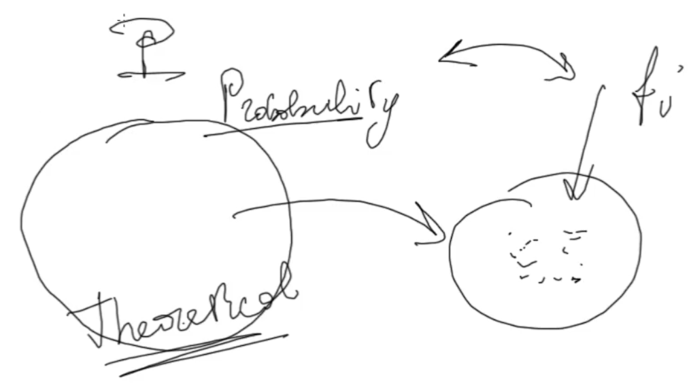

#### Bivariate distribution

  - Marginal distribution: right and down parts of the table, define distribution of Y and X

- Conditional distribution (rows and cols): in the example defines the distribution of the height (Y) on the `[60 -70]` weight group (X1)

  

  

- Contingency table: table that represent the bivariate distribution

#### Correlation between bivariate relative frequency and univariate relative frequency

  - So `conditional frequency = joint frequency / marginal frequency` and`conditional probability = joint probability / marginal probability`

#### Explanation of probability of an intersection, conditional probability and independence

#### Statistical independence

- Strong correlation

  

- Independence

  

  - Condition for independence

    

    

    

  - So joint frequency (same for joint probability):

    

    

- Kolmogorov says that defining properties of probability is equal to defining properties for the relative frequency

### Lesson 4: Summary statistics

#### Summary statistics

- Summary statistics: any function applied to the dataset (it's summaryzing an aspect of the dataset)
  - Example
    - Mean
    - Median
    - Mode
    - Standard deviation
    - Variance
    - Mean absolute deviation
    - ...

#### Measure of central tendency

- Measure of central tendency: summarize more or less how values are placed on a "line"
  - Example (mean)

    

  - Types
    - Mean (quantitative)
    - Median (ordinal): value of X such that 50% of the observations are <= median and 50% are >= median

      

      

    - Mode (nominal): most frequent value

      

      

#### Measure of dispersion

- Measure of dispersion: how close are the x to my measure of central tendency

  

  

  - Types
    - Variance (mean squared deviation) and mean absolute deviation

      

      

    - Standard deviation

      

    - Range
    - ...

#### Variance online algorithm (Welford)

- Recall online mean

  

  

- Identity for variance

  

  - In other words, like this we demonstrate that the best value with respect to we have to calculate the "distance" is, in fact, the mean!
- So, the online algorithm for variance is explained like this:

  

  

#### Measures of shape

- Types
  - Skewness: measures the asymmetry (the higher is, the higher is asymmetry)
  - Kurtosis: the higher is, the more frequency you have on the tails

#### Covariance

- Covariance: linear relationship between two variables (measure the correlation)

  

    - We can consider the variance as the covariance of X with itself
- Example of how covariance works

  

  - So, if we have a covariance that is "more positive" this means that the points are placed on the "positive line" (direct relationship), else the opposite (inverse relationship)

    

    

    - Direct: to more positive values of x you have more positive values of y
    - Inverse: to more positive values of x you have more negative values of y
- Online algorithm and correlation with variance

  

#### Coefficient of correlation

  

#### General mean

- Types
  - Arithmetic: h = 1
  - Quadratic: h = 2

    

  - Harmonic: h = -1

    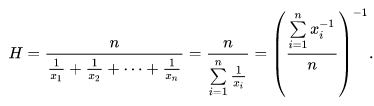

  - Geometric: r -> 0

    

#### Distance

- Given different types of distances we can compute an `x_c` that minimize those distances; this `x_c` is 100% of times the "Middle value" 

  

  - For the mean the correct word is "premetric" and not distance

#### Variance and covariance naive formula

- Covariance

  

  

- Variance

  

#### Regression

- Regression is finding the distance (premetric) but we are in a multivariate case

##### Linear regression (bivariate)

  

- Ordinary least squares (OLS)

  

- Regression line

  

    - We want to minimize a and b, the final line has this shape:

      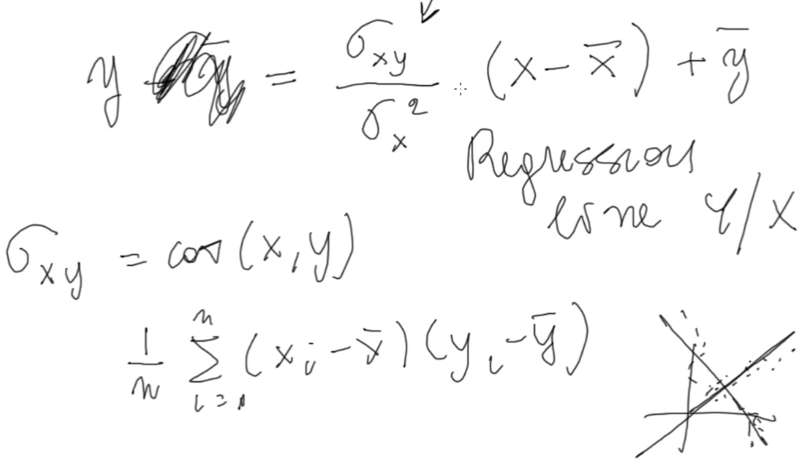

- There are two regression lines: one nearer to x, one to y
  - Regression lines are coincident if points are perfectly aligned

    

##### Variance Decomposition and Coefficient Of Determination

- Coefficient of determination: the name is `R^2`

### Lesson 5: Probability

#### Measure theory vs Probability theory

- By Kolmogorov
  - Probability is just a measure between 0 and 1 (probability theory is a subset of the measure theory)
- Measure theory
  - A measure is positive
  - It is 0 for the empty set
  - Countable additivity

    

    - Even if they are infinite
- Probability theory
  - Same as measure theory
  - Falls in 0 - 1 (probability of at least one of the events is 1)
- Measure space

  

  - A probability space is the same but with different letters (see next)
- Power set: set of all subset of a given set including the empty set and the set itself
- Sigma-algebra: subset of power set that satisfies
  - Must contain the set itself
  - Closed with respect to the complement
  - Closed with respect to the union
- Parallelism: measure theory and probability theory

  

  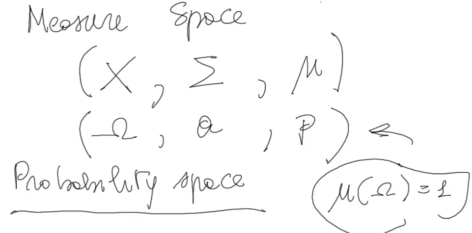

#### Parametric inference

- We want to find what values of parameters (given that we can choose various and different parameters, theta, states of nature) of the family are more likely to generate the empirical distribution: this is parametric inference (or parametric statistics)

  

  

- Most important theoretical distribution model: normal distribution
  - Example of parametric inference using the normal distribution as the family of theoretical distribution

    

    - I want to find which is the pair of state of natures more probable given the empirical distribution E

      

      

      - We know the likelihood!

        

#### Inductive reasoning

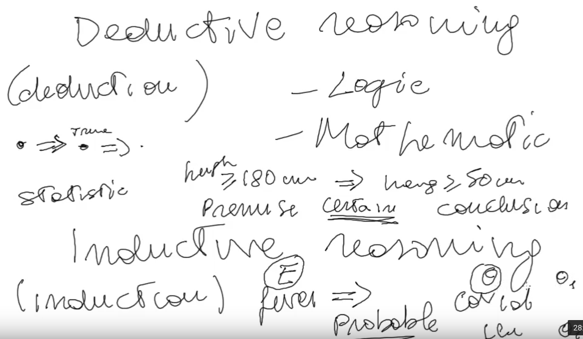

- Which one is more probable?

  

#### Role of probability in statistics

- Probability in the end is relative frequency; all axioms of probability are also true for relative frequency
- Again, relative frequency is just the materialization of the abstract model which is the probability

  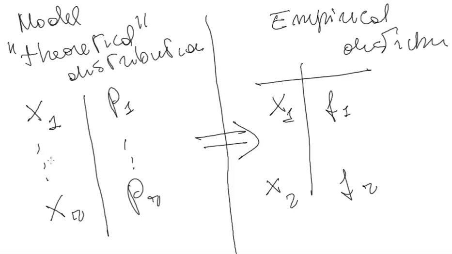

  - This is inferential statistics
- Goal of inference

  

  

- Symmetry between inference and relative frequency

  

#### Probability space

- Probability space

  

  

  - P is the measure of the event space (space of all the probabilities, for each event space event)

#### Random variable

  

- Informally: a random variable is a variable with a probability attached
- Formally

  

- CDF and PDF
  - Cumulative distribution function (CDF)

    

  - PDF is the derivative of CDF, CDF is the integral of PDF

    

- Generation of random variable distribution

  

  - Given the uniform distribution u in 0-1 (random number generator in 0-1), applying to the generated number the inverse of F we obtain a (in this case) negative exponential distribution
  - Why?

    

    

#### Lebesgue integral and mean, variance of random variables

- Probability: theoretical vs empirical

  

  - Inference: passing from empirical to theoretical (generalization)
- Conditional frequency, statistical independence, mean and variance are empirical concepts that can be translated to the theoretical model
  
  

  

  

  

  - For continuous random variables this is the formula
  - Dividing mean in two different formulas based on the continuity/discreet fo the random variable is not done anymore, now Lebesgue-Stielties integral is used
- Lebesgue-Stielties integral
  - Lebesgue works in a measure space, so is more general!
  - Lebesgue vs Riemann (classic integral used for continuous random variables)

    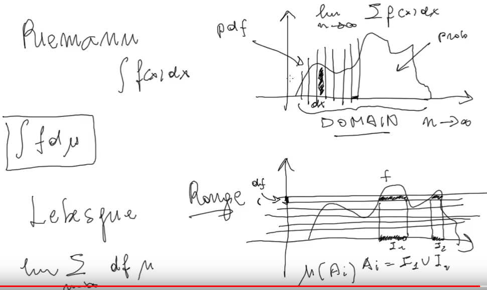

  - Lebesgue general formula (mean)

    

    - Why?

      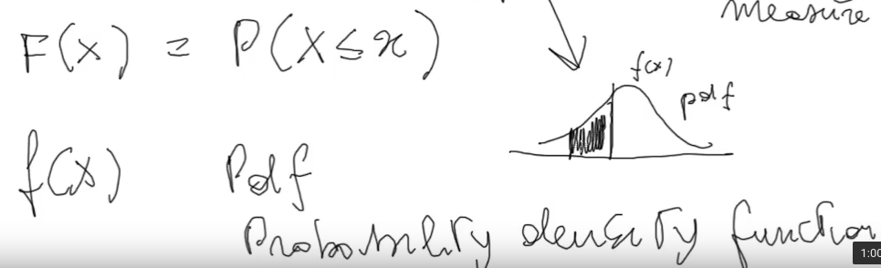

      

      

  - Lebesgue general formula (variance)

    

### Lesson 6: Convergence

#### Sequences Of Random Variables

- Given a simple random variable (ex: bernoulli, i hit or miss a tag)

  

- A sequence of random variables is simply considering more random variables together

  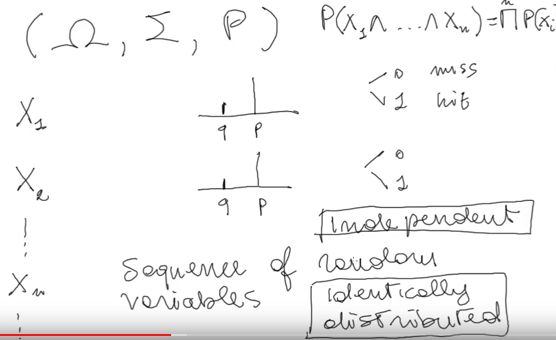

  - When this sequence has variables with same probability distribution (in this case probability of variables is always the same) it is called identically distributed
  - When the probability of the intersection of all the variables is the general product those variables are called independent
  - Usually we will be in this case but a sequence can be nor independent or identically distributed

#### Convergence In Distribution

- In this example, will the frequency (with n -> inf) stabilize near a value or it will continuously oscillate between 0 and 1?

  

- This is called convergence in distribution

  

#### Convergence in probability

- The probability of "going outside the street" (tails of curves) going to infinity comes to 0
  - For a Bernoulli random variable this converges to P (law of large numbers)

    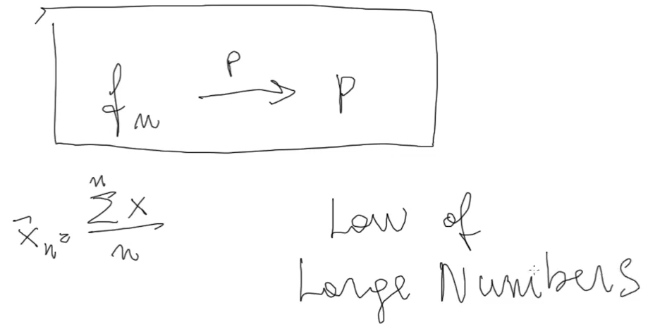

    - This is called weak convergence (probability convergence)
- There are various types of convergence

  

  - Almost sure (a.s.) convergence implies convergence in probability which implies convergence in distribution
- So, for the law of large numbers (LLN) we create a link between relative frequency and probability: going to infinite the relative frequency converges to the probability

  

#### Almost sure convergence

- Going to infinite the paths that go outside the street are 0

  

- This is called strong convergence
- So there are two LLNs

  

#### Mean in convergence (mean of a sample mean)

#### Variance in convergence (variance of a sample mean)

### Lesson 7

#### Concentration Inequalities

- Definition: bounds to distributions (statistical and also of random variables)

##### Markov inequality
  
- Definition: provide an upper bound knowing the average

  

- I must consider `k` that is larger than the mean
- Example

  

  - Frequency of 25, 25, 29 is certainly less than 93.2%
  - Pretty simple knowing values, but if we just know the mean is useful!
  - Example proof

    

    

    

    

    

    

    

    - Same proof can be done for random variables

##### Chebyshev inequality (from Markov inequality)

- Definition: probability on the tails is certainly lower than `1/a^2`

  

  - (Error) Sigma is squared
- From this the Law of Large Numbers arises

  

  

#### Almost sure convergence

- In convergency probability (weak LLN) am i sure that paths will never go beyond the limits defined by epsilon? NO

  

  - To say this i need almost sure convergence (strong LLN): i am sure that i won't go beyond the epsilon limits infinite number of times but just a finite number of times and for an `n` sufficiently large the bounds will be completely respected
- To recap

  

- Proof (Borel-Cantelli)

  

  - Also the opposite is true

#### Glivenko-Cantelli theorem

- Recall: CDF

  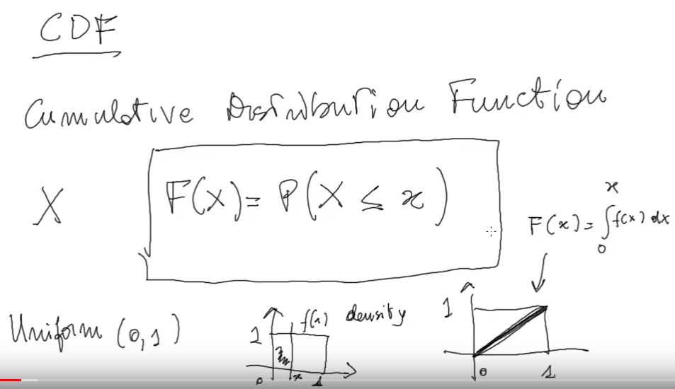

- Convergence of empirical CDF to theoretical CDF

  

  

  

- Glivenko-Cantelli theorem refines this result: uniform convergence instead of point-wise convergence
  - What is uniform and point-wise convergence
    - Uniform: the line gets nearer to `y = x` uniformly

      

    - Not uniform (point-wise): convergence is not the same for all the points of the line

      

    - Point-wise vs uniform

      

      - Uniform: for all x

        

      - Point-wise: for each x

        

#### Standardization

- Property of deviation

  

  

  - With deviation we could compare two statistical populations that are completely different? Yes but actually no (variance could be different)

    

    

    - Solution: z score eliminates those differences

      

- Standardization: used to "center" variables to make comparisons
- As we have seen in the simulation (random vars converging to `p`) the convergence degenerates to one point (`p`)

  

  - Standardizing this variable (so the variance is equal to 1) we will not make the simulation degenerate

    

    - Or like this, the important is that the variance doesn't oscillate but is constant

      

    - Subtracting the mean we will center into the origin

      

    - Doing this we end up with a standard normal distribution (central limit theorem, CLT)

      

      

### Lesson 8

#### Probability zero

- In continuous uniform distribution the probability of an event `e` MUST be zero; continuous distribution is "infinite", so even if `P(e) = epsilon` (where epsilon is a very small number) then the sum of all events probability will exceed 1 (impossible!)
- So having an event with probability 0 doesn't mean that this event is impossible
- We could also have a countable union of probabilites of events which is equal to zero
- In continuous probability infact we use the probability of an interval (more interesting)
- But also in discrete uniform we could have an event with probability zero which could still be possible
- Empty set is the impossible event; still has probability 0

#### Almost sure

- We can revise the almost sure meaning knowing the "probability zero"

  

  - Probability of the complementary is zero but is not impossible!
- Example
  - Imagine throwing a dart at a unit square (a square with an area of 1) so that the dart always hits an exact point in the square, in such a way that each point in the square is equally likely to be hit
  - Since the square has area 1, the probability that the dart will hit any particular subregion of the square is equal to the area of that subregion
  - For example, the probability that the dart will hit the right half of the square is 0.5, since the right half has area 0.5
  - Next, consider the event that the dart hits exactly a point in the diagonals of the unit square
  - Since the area of the diagonals of the square is 0, the probability that the dart will land exactly on a diagonal is 0
  - That is, the dart will almost never land on a diagonal (equivalently, it will almost surely not land on a diagonal), even though the set of points on the diagonals is not empty, and a point on a diagonal is no less possible than any other point

#### Order statistics

- Useful to find median

#### Generalizing order statistics - Quantiles

- For example the median is a quantile with `q = 2`

- Going from left to right it becomes `2/q, 3/q...`
- Definition

  

- Example

  

#### Generalized inverse

- P-quantile: i want to find a quantile so that the probability on the left is at least `P`

  

  

  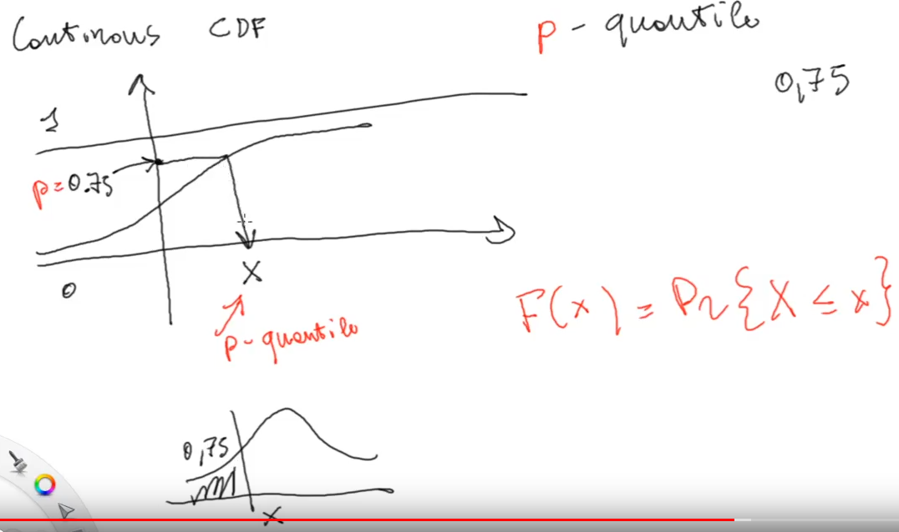

  - The quantile function is just the inverse of the CDF (generalized inverse)

    

#### Density (PDF) in order statistics

- Minimum and maximum

  

- General case

  

#### CDF in order statistics

- Minimum

  

- Maximum

  

- General

  

#### Rank order statistics (ranks)

- Place occupied in the order sample with respect to te empirical sample

  

- Coefficient of correlation of rankings

  

- Handling ties (mid-rank method)

  

### Lesson 9

#### Stochastic process definition

- Recall
  - Probability space is a measure space (P is the measure)

    

  - Measurable space

    

  - Random variable: measurable function from omega to a measurable space (real line)

        

- Definitions
  - Empirical

    

  - Formal: a stochastic process is a function from the set T of indexes (finite, infinite, countable, uncountable...) to the multiset (because we can have repetitions, surjetive but not injective) X of random variables all from the same probability space
    
    
    
    - When indexes are discrete: discrete time process (if T is countable)
      - Example: random walk
    - When indexes are continuous: continuous time process (if T is not countable)
      - Example: poisson process

    

    - Alternative: an indexed family of random variables

#### Discrete/Continuous state process

- Definitions
  - Discrete: random variables are discrete
  - Continuous: random variables are continuous
- We can combine these with discrete/continuous time process

  

  

#### Stochastic process and sample paths

- Parallelism between random variables and random (stochastic) processes

  

  

#### Examples of stochastic processes

#### Stationary increment

- Increment: increment (or decrement) of the random walk in the interval specified

  

  - It is itself a random variable because it is a sum of random variables
  - Mean: sum of the means of the variables in the interval
  - Variance: sum of the variances of the variables in the interval
    - The larger is the interval the larger is the variance
  - **Stationary increment**: the distribution generated is not affected by the interval starting point considered, it is only affected by the size of the interval; all the increments with same interval size have same distribution

#### Continuity

- In probability

  

  

  - Like that the point s converges to the point t
- Almost sure

  

  - I can make this quantity smaller the more i go near to the point t
  - No matter how much epsilon is small, i will always find an s in which the difference with t is smaller than epsilon

#### CADLAG process

- Mandatory properties

  

- Example of CADLAG: CDF

  

#### Levy processes

- Note: as for the central limit theorem every var collapses to a N(0,1), in stochastic processes we collapse to a Brownian motion
- Mandatory properties
  - Continuity in probability
  - X0 = 0
  - Stationary increment
  - Independence of the increments: fo all choices of n and t increments must be independent (joint probability = product of probabilities)

    

#### Brownian motion (Wiener process)

- Properties
  - Same as Levy processes (plus the continuity is almost surely)
  - The distribution of the increment must be a normal

    

### Lesson 10

#### Generalized Brownian motion

- Brownian motion structure (formula)

  

  - Standardization vs generalized

    

  - Definition using increments (Stochastic differential equation, SDE)

    

    

    - In our homeworks we just simulated this SDE
- Brownian motion is the basic building block for other types of stochastic processes

#### Geometric Brownian motion

- In finance absolute (arithmetic) increment is useless, we have to use relative (geometric)

  

  

#### Solving an SDE

- Given an initial point and an SDE we can find a solution; in this case we are considering a general stochastic process (Brownian motion), the solution is the sum of its random variables
  
  

  

- Solving the standard Brownian motion

  

  

- Solving the general Brownian motion

  

#### Ornstein Uhlenbeck and Vasicek SDE

- Ornstein Uhlenbeck SDE: prices of materials tend to return to their initial price (like an elastic force, F = -kx)

  

  - Tendency to return to 0
- Vasicek SDE: generalization of Ornstein Uhlenbeck SDE

  

  - Tendency to return to P

#### Euler Maruyama Method

- What is: method to find a solution to an SDE; it is what we are doing with our simulations

  