# 3 - Basic Broadcast Primitives

## Part 1 - Broadcast

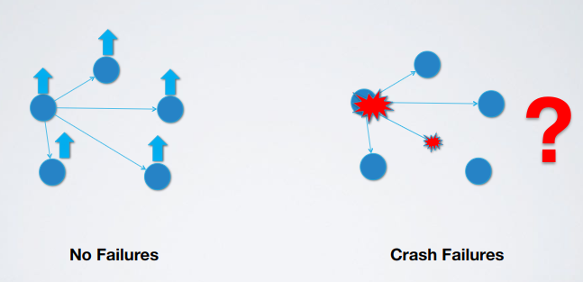

- Types
  - Best effort (doesn't handle well failures)
    - Model
      - Asynchronous
      - Perfect link
      - Crash failures
    - Events
      - Send,`〈beb,Broadcast|m〉`: broadcasts a message `m` to all processes
      - Deliver,`〈beb,Deliver|p,m〉`: delivers a broadcast message `m` by process `p`
    - Properties
      - BEB1 (Validity): if a correct process broadcasts a message `m` then every correct process eventually delivers (receives) `m`
      - BEB2 (No duplication): no message is delivered more than once
      - BEB3 (No creation): if a process delivers (receives) a message `m` with sender `s`,then `m` was previously broadcast by process `s`
    - Visual concept

        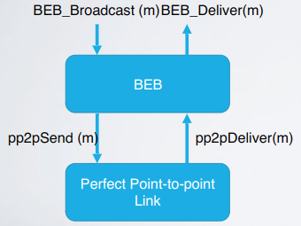

    - Algorithm
      ```
      upon event〈beb,Broadcast|m〉do
        for all q ∈ Π do
          trigger〈pl,Send|q,m〉;
      
      upon event〈pl,Deliver|p,m〉do 
        trigger〈beb,Deliver|p,m〉;
      ```
    - Formal proof
      - BEB1 (Validity): it comes from the reliable delivery property of perfect links and the fact that the sender sends the message to every other process in the system
      - BEB2 (No duplication): it directly follows from the No Duplication of perfect links
      - BEB3 (No creation): it directly follows from the corresponding property of perfect links
    - Note
      - Problem: this algorithm ensures the delivery of messages as long as the sender does not fail; a broadcast message could be seen not by everyone
      - Solution: we would like to have an agreement on the set of messages to be delivered, at least among the correct processes (all-correct or nothing)
  - (Regular) reliable
    - Events: same as best effort
    - Properties
      - Same as best effort
      - RB4 (Agreement, liveness): if a message `m` is delivered (received) by some correct process then `m` is eventually delivered (received) by every correct process
    - Theoretical examples (two arrows means `broadcast send m`, one means `deliver m`)
      - Best effort because green is not delivered to anyone (violation of agreement property)

          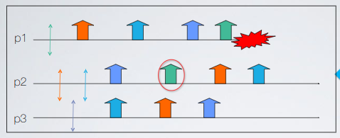

      - Reliable because all messages sent (**by correct processes**) are delivered (**to all correct processes**)

        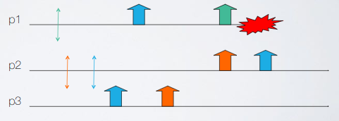

    - Visual concept (fail-stop, lazy so it retransmit only when necessary)

        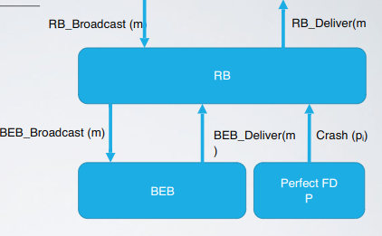

    - Algorithm (fail-stop, lazy so it retransmit only when necessary)
      ```
      upon event〈rb,Init〉do
        correct:=Π;
        from[p]:=[∅]^(N);  // Map of sets initialized for each process as null
        
      upon event〈rb,Broadcast|m〉do
        // Send the broadcast message and who is sending this message (self)
        trigger〈beb,Broadcast|[DATA,self,m]〉;
        
      // Here s is the original source of the broadcast message
      // p is the process that forwarded the message of s (relay)
      upon event〈beb,Deliver|p,[DATA,s,m]〉do
        if m !∈ from[s] then  // (2)
          trigger〈rb,Deliver|s,m〉;
          from[s]:=from[s] ∪ {m};
          // If s is crashed then relay the message that s sent
          if s !∈ correct then
            trigger〈beb,Broadcast|[DATA,s,m]〉;
      
      upon event〈P,Crash|p〉do
        correct:=correct - {p};
        forall m ∈ from[p] do
          // Resend all the messages sent by the crashed process
          trigger〈beb,Broadcast|[DATA,p,m]〉;
      ```
      - Algorithm examples (3 different)

          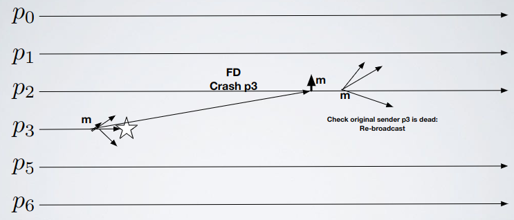

          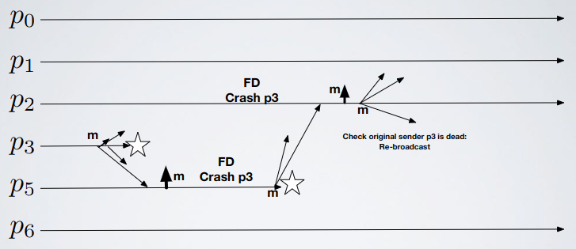

          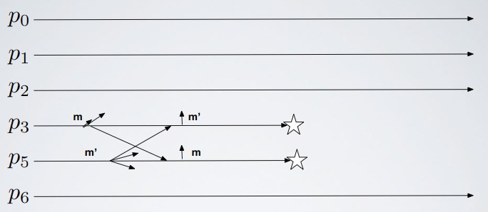
        
      - Exercises
        - [Exercise 1](../../ex/broadcast/ex1.md)
    - Formal proof
      - Validity and No creation: same as best effort
      - No duplication: (2)
      - RB4 (Agreement, liveness): proof by contradiction
        - Suppose by contradiction that process `p` is correct and delivers (receives) message `m` with original sender `q`, while another correct `p’` does not deliver (receive) `m`
          1. If `q` does not crash then by BEB also `p’` delivers `m`
          2. If `q` crashes and `p` detects the crash before receiving `m` then `p` relays message `m`; by BEB `p’` also delivers (receives) `m`
          3. If `q` crashed and `q` detects the crash after delivering (receiving) `m`, then `p` also relays message `m`; by BEB `p’` also delivers (receives) `m`
    - Performances (fail-stop, lazy so it retransmit only when necessary)
      - Number of messages
        - Best: `1` BEB message per `1` RB message (`n` total point-to-point messages) 
        - Worst: `n-1` BEB messages per `1` RB, this is the case of one failure (`n^2` total messages)

            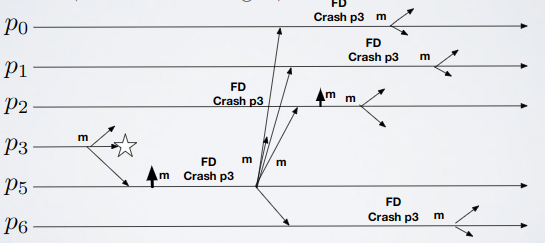

      - Message delays or communication steps (measure time performances, each message takes `1` time unit to be delivered if delivered)
        - Best: `1` unit of time (`0` failures)

            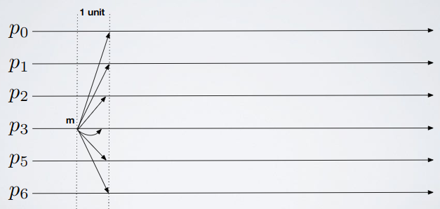

        - Worst: `O(n)` unit of times per `1` RB (chain of `n-1` failures)

            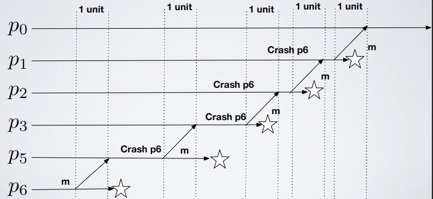

    - Notes
      - If we use ◊P (eventually perfect failure detector) in place of P the algorithm still works
    - Visual concept (fail-silent so no failure detector, eager so it retransmit every message)

        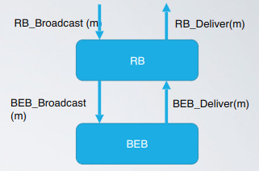

    - Algorithm (fail-silent so no failure detector, eager so it retransmit every message)
      ```
      // Messages are unique

      upon event〈rb,Init〉do
        delivered:=∅;
        
      upon event〈rb,Broadcast|m〉do
        trigger〈beb,Broadcast|[DATA,self,m]〉;
        
      upon event〈beb,Deliver|p,[DATA,s,m]〉do 
        if m !∈ delivered then
          delivered:=delivered ∪ {m};
          trigger〈rb,Deliver|s,m〉;
          trigger〈beb,Broadcast|[DATA,s,m]〉;  // Relay the message
      ```
    - Performances (fail-silent so no failure detector, eager so it retransmit every message)
      - Number of messages
        - Best = Worst: `N` BEB messages per `1` RB (`N^2` point to point messages)
      - Message delays or communication steps: same as fail-stop RB
    - Failures bound (of every implementation): processes number
  - Uniform reliable: the set of messages delivered by a correct process is a superset of the ones delivered by a faulty one
    - Events: same as reliable
    - Properties
      - URB1–URB3: same as reliable and best effort
      - URB4 (Uniform agreement): if a message `m` is delivered by some process (whether correct or faulty), then `m` is eventually delivered by every correct process
    - Theoretical examples
      - Uniform reliable (both)

          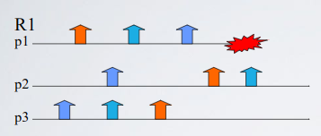

          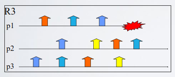

      - Best effort if yellow message is sent by `p1`, non-correct otherwise

          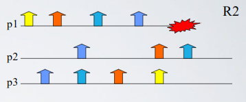

      - Regular if yellow message is sent by `p1`, non-correct otherwise

          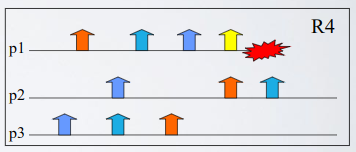

    - Visual concept (fail-stop)

        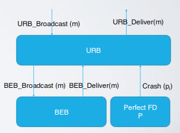

    - Algorithm (fail-stop)
      ```
      // You broadcast a message, everyone who receives it starts relaying
      // and also starts keeping track (in its personal memory) of the processes
      // that have seen that message (through ack mechanism); 
      // when every correct process has seen the message I deliver it

      upon event〈urb,Init〉do
        delivered:=∅;
        pending:=∅;
        correct:=Π;
        // Empty map, we use this to know who have seen the message m
        // If this is a super set of non-crashed processes 
        // then i can deliver the message because all the correct processes have seen it
        forall m do ack[m]:=∅;
        
      upon event〈urb,Broadcast|m〉do
        pending:=pending ∪ {(self,m)};
        trigger〈beb,Broadcast|[DATA,self,m]〉;
        
      upon event〈beb,Deliver|p,[DATA,s,m]〉do
        ack[m]:=ack[m] ∪ {p};  // If a process p is sending message m then p has seen m
        // If the message is not in pending then add it and start broadcasting (relay)
        if(s,m) !∈ pending then
          pending:=pending ∪ {(s,m)};
          trigger〈beb,Broadcast|[DATA,s,m]〉;

      upon event〈P,Crash|p〉do
        correct:=correct - {p};
        
      // Return true if correct processes are a subset of the processes that have seen the message
      function candeliver(m) returns Boolean is
        return(correct ⊆ ack[m]);
        
      upon exists(s,m) ∈ pending such that
          [candeliver(m)] ∧ [m !∈ delivered] do
        delivered:=delivered ∪ {m};
        trigger〈urb,Deliver|s,m〉;
      ```
      - Exercises
        - [Exercise 2](../../ex/broadcast/ex2.md)
    - Formal proof
      - Statement: if a correct process `p` sees a message `m` it will eventually deliver it
      - Proof
        - By assumption `p` is correct, so its message will reach every other correct process (BEB)
        - By the strong completeness of FD P eventually process `p` detects as crashed all the crashed processes, so it will not wait forever for an `ack` of a crashed process
        - So `candeliver(m)` on `p` will be true
      - URB4 (Uniform agreement): proof by contradiction
        - Suppose `p5` (faulty) delivers `m` and `p6` correct does not, the only possibility is that `p6` does not see the message
        - This implies that `p6` is detected faulty by `p5` so `p5` delivers without receiving the ack from `p6`
        - This contradicts the strong accuracy of the failure detector P

          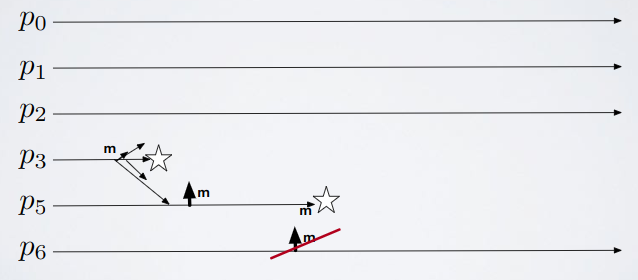

    - Performances (fail-stop)
      - Number of messages: same as eager (fail-silent)
      - Message delays or communication steps
        - Best: `2` unit of time (`0` failures) (`1` for broadcast `1` for acks)
        - Worst: same as lazy (fail-stop)
    - Failures bound (fail-stop): processes number
    - Visual concept (fail-silent, async)

        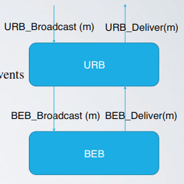

    - Algorithm (fail-silent, async)
      - Quorum
        - Explanation
          - We have `n` processes in our set of total processes `P`, a quorum is any subset of `P` of size at least `n/2+1` (majority)
          - Any two quorums intersect in at least one process
            - Proof by contradiction: suppose two quorums do not intersect, then they have all distinct processes. This implies `|P|>n`)
      - Idea
        - We have `n` processes in total and `f` faulty (crash-stop)
        - `C` set of correct processes (that will not crash during our execution)
        - `F` set of faulty processes (that will crash during our execution)
        - We do not know who is in `C` and who is in `F` (adversary will pick)
        - If we assume `f < n/2` (majority of processes are in `C`) then any quorum `Q` of `P` contains at least one correct process (`C` is a quorum, `Q` is a quorum, two quorums intersect)
        - So you can safely deliver the message because you know that one of the process that ACKed you is correct and started relaying the message
        - **Disclaimer**: the number of failures must be `f < n/2`
      ```
      // Same as before but candeliver() is different and Crash handler doesn't exist

      upon event〈urb,Init〉do
        delivered:=∅;
        pending:=∅;
        correct:=Π;
        // Empty map, we use this to know who have seen the message m
        // If this is a super set of non-crashed processes then
        / i can deliver the message because all the correct processes have seen it
        forall m do ack[m]:=∅;
        
      upon event〈urb,Broadcast|m〉do
        pending:=pending ∪ {(self,m)};
        trigger〈beb,Broadcast|[DATA,self,m]〉;
        
      upon event〈beb,Deliver|p,[DATA,s,m]〉do
        ack[m]:=ack[m] ∪ {p};  // If a process p is sending message m then p has seen m
        // If the message is not in pending then add it and start broadcasting (relay)
        if(s,m) !∈ pending then
          pending:=pending ∪ {(s,m)};
          trigger〈beb,Broadcast|[DATA,s,m]〉;
        
      // Return true if the majority of processes (so at least a correct process) seen our message
      function candeliver(m) returns Boolean is
        return #(ack[m])>N/2
        
      upon exists(s,m) ∈ pending such that
          [candeliver(m)] ∧ [m !∈ delivered] do
        delivered:=delivered ∪ {m};
        trigger〈urb,Deliver|s,m〉;
      ```
      - Note
        - Suppose to have this:
          ```
          function candeliver(m) returns Boolean is
            return #(ack[m])>|F|
          ```
        - If `|P|=n` and `|F|=n/2+1`, does this algorithm work? No, if `|F| > n/2` and I wait for `|F|+1` I will wait forever once everyone in `F` crashed
  - Probabilistic: broadcast algorithm less expensive
    - Events
      - Broadcast `〈pb,Broadcast|m〉`: broadcasts a message `m` to all processes
      - Deliver `〈pb,Deliver|p,m〉`: delivers a message `m` broadcast by process `p`
    - Properties
      - PB1 (Probabilistic validity): there is a positive value `ε` such that when a correct process broadcasts a message `m` the probability that every correct process eventually delivers `m` is at least `1−ε`
      - PB2 (No duplication): no message is delivered more than once
      - PB3 (No creation): if a process delivers a message `m` with senders then `m` was previously broadcast by process `s`
    - Visual concept

        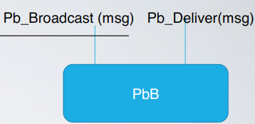

    - Theoretical example: Gossip dissemination
      - A process sends a message to a set of randomly chosen `k` processes with attached a TTL
      - A process receiving a message for the first time forwards it to a set of `k` randomly chosen processes and decrease the TTL (this operation is called a round) 
      - The algorithm performs a maximum number of `r` (`r = TTL`) rounds
      - With a "correct" chosen TTL and `k` the message will reach everyone with high probability

      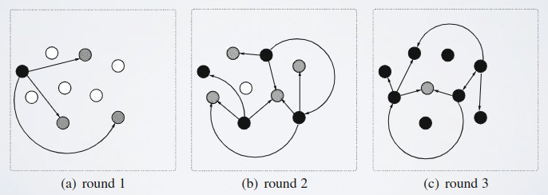
    - Algorithm
      ```
      upon event〈pb,Init〉do
        delivered:=∅;
        
      procedure gossip(msg) is
        forall t ∈ picktargets(k) do trigger〈fll,Send|t,msg〉;

      // Choose a set of k processes
      function picktargets(k) returns set of processes is
        targets:=∅;
        while #(targets)<k do
          candidate:=random(Π - {self});
          if candidate !∈ targets then
            targets:=targets ∪ {candidate};
        return targets;
        
      // Deliver to yourself and then call gossip()
      upon event〈pb,Broadcast|m〉do
        delivered:=delivered ∪ {m};
        trigger〈pb,Deliver|self,m〉;
        gossip([GOSSIP,self,m,R]);  // R = TTL
        
      upon event〈fll,Deliver|p,[GOSSIP,s,m,r]〉do
        if m !∈ delivered then
          delivered:=delivered ∪ {m};
          trigger〈pb,Deliver|s,m〉;
        // Relay the message to k processes with TTL = TTL - 1 (r = TTL)
        if r>1 then
          gossip([GOSSIP,s,m,r−1]);
      ```
    - Notes
      - If you increment the number of rounds the probability of delivery increments
      - If you have to do a communication that isn't so important (even if someone doesn't receive it it's ok) then gossiping is ok
    - Exercises
      - [Exercise 3](../../ex/broadcast/ex3.md)

## Part 2 - Ordered communications

- What does this mean: define guarantees about the order of deliveries inside group of processes (when broadcasting messages)
- Types
  - FIFO ordering: order messages for each process
    - Regular
      - Events
        - Broadcast `〈frb,Broadcast|m〉`: broadcasts a message `m` to all processes
        - Deliver `〈frb,Deliver|p,m〉`: delivers a message `m` broadcast by process `p`
      - Properties
        - Same as regular reliable broadcast
        - FRB5 (FIFO delivery): if some process broadcasts message `m1` before it broadcasts message `m2`, then no correct process delivers `m2` unless it has already delivered `m1`
      - Visual concept

          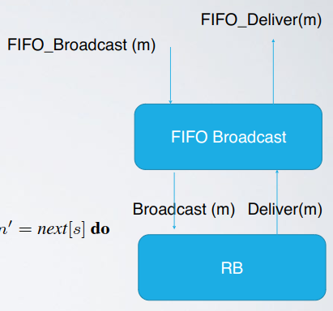

      - Algorithm
        ```
        upon event〈frb,Init〉do
          lsn:=0;  // Sequence number of the message
          pending:=∅;  // Pending set of messages
          next:=[1]^N;  // Array of next sequence numbers per process
          
        upon event〈frb,Broadcast|m〉do
          lsn:=lsn+1;
          trigger〈rb,Broadcast|[DATA,self,m,lsn]〉;
          
        upon event〈rb,Deliver|p,[DATA,s,m,sn]〉do
          pending:=pending ∪ {(s,m,sn)};  // sn = sequence number, s = source
          // If a message inside pending has the sn equal to next sn then this message gets delivered
          while exists(s,m',sn') ∈ pending such that sn'=next[s] do
            next[s]:=next[s]+1;
            pending:=pending - {(s,m',sn')};
            trigger〈frb,Deliver|s,m'〉;
        ```
    - Uniform
      - Same as regular but instead of using `RB` (reliable broadcast) use `URB` (uniform reliable broadcast)
    - Best effort
      - Same as regular but instead of using `RB` (reliable broadcast) use `BEB` (best effort broadcast)
  - Causal ordering: order messages in general, if they're concurrent the order doesn't matter
    - Regular
      - Events: same as FIFO
      - Properties
        - Same as (regular) reliable broadcast
        - CRB5 (Causal delivery): for any message `m1` that potentially caused a message `m2` (`m1→m2`), no process delivers `m2` unless it has already delivered `m1`
      - Exercises
        - [Exercise 4](../../ex/broadcast/ex4.md)
        - [Exercise 5](../../ex/broadcast/ex5.md)
        - [Exercise 6](../../ex/broadcast/ex6.md) - Out of context
        - [Exercise 7](../../ex/broadcast/ex7.md)
        - [Exercise 8](../../ex/broadcast/ex8.md)
        - [Exercise 9](../../ex/broadcast/ex9.md)
      - Visual concept

          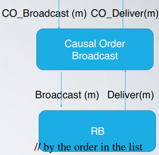

      - Algorithm (no-wait: when a message is received you deliver it, there's no pending set)
        ```
        upon event〈crb,Init〉do
          delivered:=∅;  // Set of delivered messages
          past:=[];  // Our entire messages history, all the messages you received/sent in order
          
        upon event〈crb,Broadcast|m〉do
          trigger〈rb,Broadcast|[DATA,past,m]〉;  // Broadcast also my already sent messages
          append(past,(self,m));
          
        upon event〈rb,Deliver|p,[DATA,mpast,m]〉do  // p = source, m = message, mpast = past messages
          if m !∈ delivered then
            forall(s,n) ∈ mpast do  // By the order in the list, s = source, n = message
              if n !∈ delivered then
                trigger〈crb,Deliver|s,n〉;
                delivered:=delivered ∪ {n};
                if(s,n) !∈ past then
                  append(past,(s,n));
            trigger〈crb,Deliver|p,m〉;
            delivered:=delivered ∪ {m};
            if(p,m) !∈ past then
              append(past,(p,m));
        ```
      - Example

          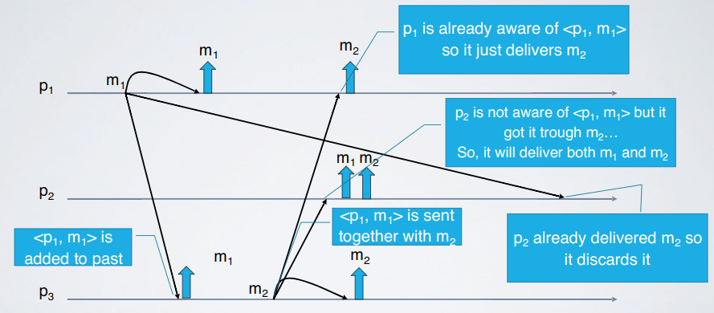

      - Improvement (no-wait, with perfect failure detector)
        - Problem: huge amount of messages
        - Solution: there is no need to retain old messages forever
          - A message can be discarded once it has been delivered by all correct processes
          - We can implement a "garbage collection" mechanisms by keeping track of "who delivered what"
        - Algorithm
          ```
          upon event〈crb,Init〉do
            delivered:=∅;  // Set of delivered messages
            past:=[];  // Our entire messages history, all the messages you received/sent in order
            correct:=Π;
            forall m do ack[m]:=∅;  // Map containing messages and set of ACKs for each message
            
          // Same as before
          upon event〈crb,Broadcast|m〉do
            trigger〈rb,Broadcast|[DATA,past,m]〉;  // Broadcast also my already sent messages
            append(past,(self,m));
            
          // Same as before
          upon event〈rb,Deliver|p,[DATA,mpast,m]〉do  // p = source, m = message, mpast = past messages
            if m !∈ delivered then
              forall(s,n) ∈ mpast do  // By the order in the list, s = source, n = message
                if n !∈ delivered then
                  trigger〈crb,Deliver|s,n〉;
                  delivered:=delivered ∪ {n};
                  if(s,n) !∈ past then
                    append(past,(s,n));
              trigger〈crb,Deliver|p,m〉;
              delivered:=delivered ∪ {m};
              if(p,m) !∈ past then
                append(past,(p,m));
          
          upon event〈P,Crash|p〉do
            correct:=correct - {p};
            
          // When you deliver a message you add yourself to the ACK set of this message
          // and then you broadcast this information
          upon exists m ∈ delivered such that self !∈ ack[m] do
            ack[m]:=ack[m] ∪ {self};
            trigger〈rb,Broadcast|[ACK,m]〉;
            
          upon event〈rb,Deliver|p,[ACK,m]〉do
            ack[m]:=ack[m] ∪ {p};
            
          // Remove from past already ACKed (by everyone) messages
          upon correct ⊆ ack[m] do
            forall(s',m') ∈ past such that m'=m do
              remove(past,(s',m))
          ```
      - Improvement (wait, fail-silent so no failure detector)
        - Visual concept

            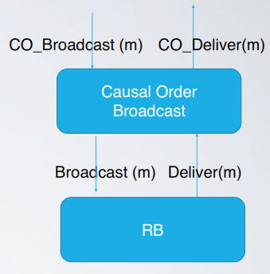

        - Algorithm
          ```
          upon event〈crb,Init〉do
            V:=[0]^N;  // Vector clock init to 0 for each process
            lsn:=0;  // Sequence number inside the vector clock that corresponds to myself
            pending:=∅;  // Pending set
            
          upon event〈crb,Broadcast|m〉do
            W:=V;  // Create a vector clock to append to the message
            W[rank(self)]:=lsn;
            lsn:=lsn+1;
            trigger〈rb,Broadcast|[DATA,W,m]〉;
            
          upon event〈rb,Deliver|p,[DATA,W,m]〉do
            pending:=pending ∪ {(p,W,m)};
            // W'≤V what does this mean? See example below
            while exists(p',W',m') ∈ pending such that W'≤V do
              pending:=pending - {(p',W',m')};
              V[rank(p')]:=V[rank(p')] + 1;
              trigger〈crb,Deliver|p',m'〉;
          ```
        - Example

            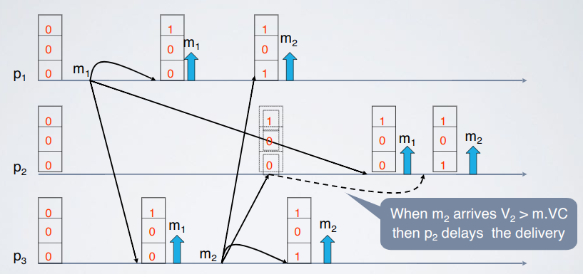

            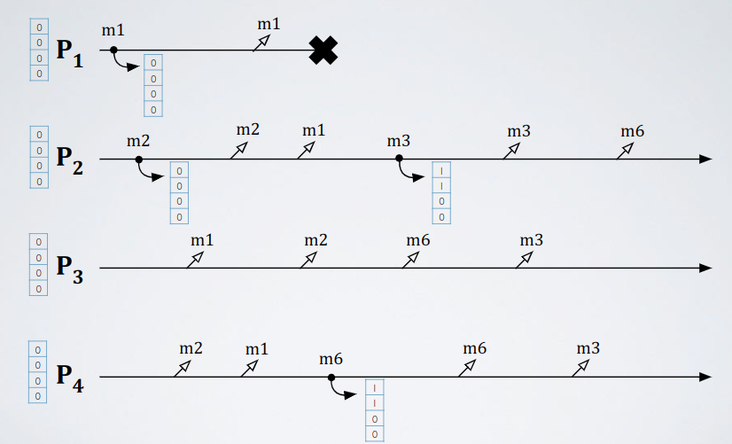

            - As you can see if vector clocks of two messages are equal this means that the messages are concurrent so they can be delivered in any order (only those two)

    - Uniform
      - Same as regular but instead of using `RB` (reliable broadcast) use `URB` (uniform reliable broadcast), this applies also for all improvements
  - Total (atomic) ordering: every correct process delivers messages in the same order
    - Important: total order doesn't imply causal or FIFO order

      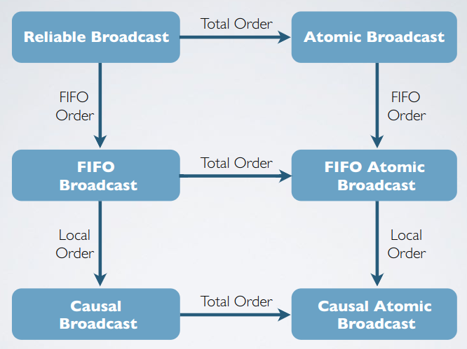

    - Explained in next chapters