# 7 - BFT (Byzantine fault tolerant)

- Definition: "There is an impostor among us"
  - `Byz(pj)`: after this event process `pj` behaves in an arbitrary way (`pj` will no more follow the algorithm defined)
    - Memory corruption
    - Adversarial failures
    - Crash stop failures
    - ...
    - All types of failures
  - Byzantine processes may
    - Deviate arbitrarily from the instructions that an algorithm assigns to them
      - Creating fake messages
      - Dropping messages
      - Delaying the deliveries
      - Altering the content of messages
      - ...
    - Act as if they were deliberately preventing the algorithm from reaching its goals
      - If in a system there are more than a byzantine process those can "collaborate"
    - Get control of asynchrony
      - Delaying messages on p2p channels influencing the scheduler (but scheduler fairness is maintained: if a maximum delay defined by the scheduler can be of a time `t` then byzantine processes can't make it longer than `t`)
      - ...
- Problem: assume a system with a byzantine process that can fake an arbitrary sender
  - This process can entirely decide the local view of a process `pn`
  - If a byzantine can impersonate other processes non-trivial computations are impossible
  - So **authentication is necessary**
- Authentication
  - Primitives
    - Message authentication codes
      - There is a distributed oracle `Auth` that can do two operations
        - `Authenticate`: any sender process `p` invokes the oracle call with message `m`, and destination `q` and it obtains a special object `a` (authentication code)
        - `VerifyAuth`: any receiving process `q` invokes the oracle call with message `m`, sender `p` and object `a`; the oracle answers `yes` if and only if the `p` previously invoked `Authenticate` on `m` with destination `q`, and it obtained object `a` otherwise it answers `no`
    - Public signatures
      - There is a distributed oracle `Sign` that can do two operations
        - `Sign`: any sender process `p` invokes the oracle call with message `m` and it obtains a special object `s` (signed object)
        - `VerifySign`: any process `q` invokes the oracle call with message `m`, sender `p` and object `s`; the oracle answers `yes` if and only if the `p` previously invoked `Sign` on `m`, and it obtained object `s` otherwise it answers `no`
  - Authenticated perfect link
    - Events
      - Send`〈al,Send|q,m〉`: requests to send message `m` to process `q`
      - Deliver`〈al,Deliver|p,m〉`: delivers message `m` sent by process `p`
    - Properties
      - AL1 (Reliable delivery): same as pp2p
      - AL2 (No duplication): same as pp2p
      - AL3 (Authenticity): if some correct process `q` delivers a message `m` with sender `p` and process `p` is correct, then `m` was previously sent to `q` by `p` (includes no creation)
        - Why `p` must be correct? Because byzantine processes (non correct) can "cooperate" so for example a byzantine process `px` could authenticate a message `m` and then send it to `py` (also byzantine) and then `py` could fake itself as `px` 
    - Algorithm (stubborn)
      ```
      upon event〈al,Init〉do
        delivered:=∅;  // Avoid duplicated messages
        
      upon event〈al,Send|q,m〉do
        // Call the oracle to authenticate
        a:=authenticate(self,q,m);
        trigger〈sl,Send|q,[m,a]〉;
        
      upon event〈sl,Deliver|p,[m,a]〉do
        // Call the oracle to verify
        if verifyauth(self,p,m,a) ∧ m !∈ delivered then
          delivered:=delivered ∪ {m};
          trigger〈al,Deliver|p,m〉;
      ```
- Some properties and constructs with byzantine failures become inconsistent
  - Properties
    - "Uniformity"
      - Example
        - Uniform consensus - Uniform agreement: no two processes decide differently
          - A byzantine process can always decide an arbitrary value
      - Rules
        1. We do not define any "uniform" variant of primitives in the Byzantine failure model
        2. No properties can be enforced on faulty processes (ex: in consensus they can decide more than once, they can deliver arbitrary messages in pp2p...)
  - Constructs
    - Failure detector: can't create a general failure detector in a system which is byzantine
- Broadcast
  - Problem: the byzantine can send different messages, making the view of processes diverge

      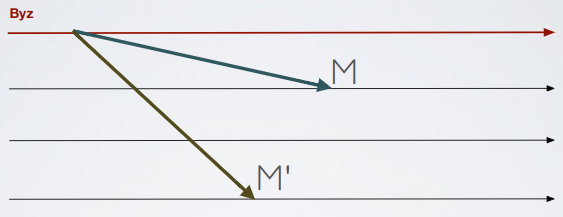

  - Goal: build a broadcast primitive that prevents the byzantine to make honest processes deliver different messages
  - How to: steps
    1. Byzantine Consistent Broadcast: with a byzantine broadcaster an honest process either does not deliver any message, or if delivers it delivers a message `m`, then no other correct delivers a message different than `m` (this makes a byzantine failure behave as a crash faulty process)
        - Note: for each process in the system there exists an instance of this broadcast algorithm, for each message sent a new instance of the algorithm must be created; to simplify the explanation we assume that there is just one broadcaster
        - Events
          - Broadcast`〈bcb,Broadcast|m〉`: broadcasts a message `m` to all processes; executed only by process `s`
          - Deliver`〈bcb,Deliver|p,m〉`: delivers a message `m` broadcast by process `p`
        - Properties
          - BCB1 (Validity): if a correct process `p` broadcasts a message `m`, then every correct process eventually delivers `m`
          - BCB2 (No duplication): every correct process delivers at most one message (broadcast is "one shot")
          - BCB3 (Integrity): if some correct process delivers a message `m` with sender `p` and process `p` is correct, then `m` was previously broadcast by `p`
          - BCB4 (Consistency): if some correct process delivers a message `m` and another correct process delivers a message `m'`, then `m=m'`
        - Necessary condition: `N>3f`
          - `f`: total number of failures (byzantine/crash)
          - `N`: processes number
        - Explanation
          - Considering a system of `3` correct processes and `1` byzantine how many echos for a message `m` I have to see to be safe to deliver?
            - One echo: NO

                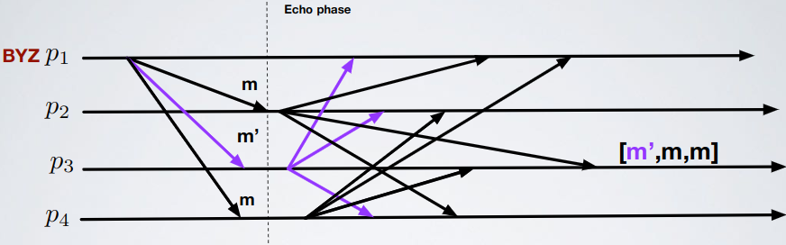

            - Two echoes: NO

                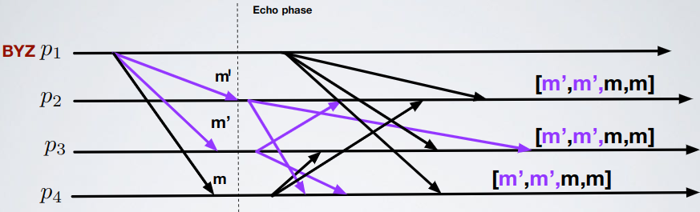

            - Three echoes: YES

                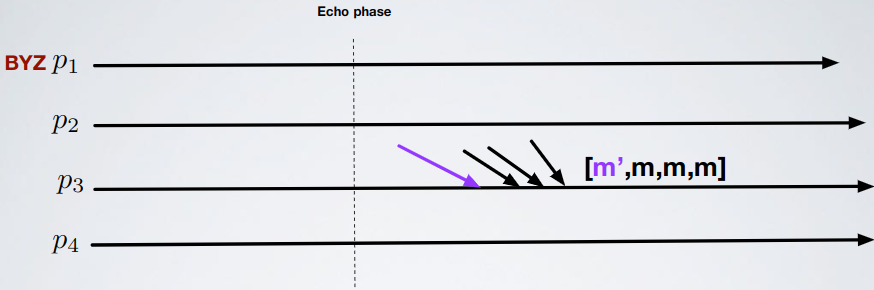

              - Why?
                - A correct can see at most one different message (generated by byzantine)
                  - `[m',m',m,m]`
                    - How: byzantine sends `m'` to `1` process who echoes `m'` and also byzantine echoes `m'`
                    - No delivery so no problem
                  - `[m',m,m,m]`
                    - How: byzantine echoes `m'`
                    - Correct delivery
                  - `[m',m,m]`
                    - How: byzantine sends `m'` to `1` process who echoes `m'` and byzantine doesn't echoes 
                    - No delivery so no problem
                  - `[m,m,m]`
                    - How: byzantine doesn't echoes
                    - Correct delivery
                  - `[m',m',m]`: impossible, we just have `1` byzantine
                    - `[m',m,m]` or `[m',m',m,m]`
                - I don't wait for `4` echoes because also if the sender is correct the byzantine could send no echoes
          - Generalization: what is the threshold `k` of echoes we have to see?
            - Echoes are votes for a certain message
              - A byzantine could give a different vote to each honest process
              - An honest process gives the same vote to everyone
            - Suppose `p` delivers message `m` that reaches threshold `k`. Then it means there is a set `Vm` of `k` processes that voted `m`
            - Suppose `p'` delivers `m'` that reaches threshold `k`, then there is a set `Vm'` of `k` processes that voted `m'`
            - If `(Vm ∩ Vm') = (f + 1)` then the same honest process voted in both set (impossible), so `m = m'`
              - The intersection must be `f + 1` because we need at least one honest
            - $`k>\frac{N+f}{2}`$
        - Algorithm: authenticated echo broadcast
          ```
          upon event〈bcb,Init〉do
            sentecho:=FALSE;
            delivered:=FALSE;
            echos:=[⊥]^N;
            
          // Send broadcast message
          upon event〈bcb,Broadcast|m〉do  // Only process s
            forall q∈Π do
              trigger〈al,Send|q,[SEND,m]〉;

          // Receive broadcast message
          // p=s because s is the only one who can broadcast (3)
          // sentecho=FALSE check you didn't start the echo phase
          upon event〈al,Deliver|p,[SEND,m]〉such that p=s and sentecho=FALSE do
            sentecho:=TRUE;  // Start echo phase
            forall q∈Π do  // Send echo to everyone
              trigger〈al,Send|q,[ECHO,m]〉;
              
          // Deliver echoes
          upon event〈al,Deliver|p,[ECHO,m]〉do
            if echos[p]=⊥ then
              echos[p]:=m;
              
          // If exists a message m and i received > (N+f)/2 echoes for m, deliver
          // (5)
          upon exists m!=⊥ such that #({p∈Π|echos[p]=m}) > (N+f)/2 and delivered=FALSE do
            delivered:=TRUE;
            trigger〈bcb,Deliver|s,m〉;
          ```
        - Formal proof
          - Validity: if the sender is correct at least `N-f` processes do the echo (all the correct) of `m`; in order for others to deliver `m` we need  `N-f > (N+f)/2` (threshold in the algorithm) that is `N>3f`
          - No duplication: from authentication and (5)
          - Integrity: from authentication and (3)
          - Consistency
            - Byzantine quorum = `(N+f)/2` processes
              - Any two byzantine quorums overlap in at least one correct process

              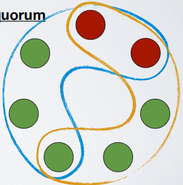

            - Let `p` correct deliver message `m`, this means that `m` has been received from a byzantine quorum
            - Let `p'` correct deliver `m'`, this means that `m'` has been received from a byzantine quorum
            - The two byzantine quorum intersect in a correct `p''`; since `p''` sends a single message then `m=m'`
        - Note: is possible for some correct to not deliver a message, while other corrects deliver the same message (in this case `p1` sends an echo only to `p2`)

            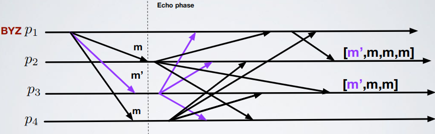

        - Performances
          - Messages number: `n^2` (only messages generated by correct are counted because byzantine can generate infinite messages)
          - Steps: `2`
    2. Byzantine Reliable Broadcast (all or nothing semantic): when the broadcaster is byzantine either no correct process delivers a message, or all correct processes deliver the same message
       - Note: same as Byzantine Consistent Broadcast
       - Events: same as Byzantine Consistent Broadcast
       - Properties
         - BRB1-BRB4: same as properties BCB1–BCB4 in Byzantine Consistent Broadcast
         - BRB5 (Totality): if some message is delivered by any correct process, every correct process eventually delivers a message
       - Necessary condition: `N>3f`
         - `f`: total number of failures (byzantine/crash)
         - `N`: processes number
       - Explanation
          - Send and echo phases are the same of Byzantine Consistent Broadcast 
          - The next phase is ready phase: if you reached the byzantine quorum send ready message
          - If you see `f+1` ready messages then start doing the relay o those messages
          - When you get `2f+1` ready messages for a message `m` deliver it
       - Algorithm: authenticated double-echo broadcast
          ```
          upon event〈bcb,Init〉do
            sentecho:=FALSE;
            sentready:=FALSE;
            delivered:=FALSE;
            echos:=[⊥]^N;
            readys:=[⊥]^N
            
          // Send broadcast message
          upon event〈bcb,Broadcast|m〉do  // Only process s
            forall q∈Π do
              trigger〈al,Send|q,[SEND,m]〉;

          // Receive broadcast message
          // p=s because s is the only one who can broadcast (3)
          // sentecho=FALSE check you didn't start the echo phase
          upon event〈al,Deliver|p,[SEND,m]〉such that p=s and sentecho=FALSE do
            sentecho:=TRUE;  // Start echo phase
            forall q∈Π do  // Send echo to everyone
              trigger〈al,Send|q,[ECHO,m]〉;
              
          // Deliver echoes
          upon event〈al,Deliver|p,[ECHO,m]〉do
            if echos[p]=⊥ then
              echos[p]:=m;
              
          // If exists a message m and i received > (N+f)/2 echoes for m, send ready messages
          upon exists m!=⊥ such that #({p∈Π|echos[p]=m}) > (N+f)/2 and sentready=FALSE do
            sentready:=TRUE;
            forall q∈Π do
              trigger〈al,Send|q,[READY,m]〉;
              
          // Handler receive ready messages    
          upon event〈al,Deliver|p,[READY,m]〉do
            if readys[p]=⊥ then
              readys[p]:=m;

          // If a message appears in the ready list more than f times (so f+1) start doing the relay 
          upon exists m != ⊥ such that #({p∈Π|readys[p]=m}) > f and sentready=FALSE do
            sentready:=TRUE;
            forall q∈Π do
              trigger〈al,Send|q,[READY,m]〉;
              
          // Deliver handler
          // If a message appears in the ready list more than 2f times (so 2f+1) deliver it
          // (8)
          upon exists m != ⊥ such that #({p∈Π|readys[p]=m}) > 2f and delivered=FALSE do
            delivered:=TRUE;
            trigger〈brb,Deliver|s,m〉;
          ```
       - Formal proof
         - Validity: if the sender is correct at least `N-f` processes do the echo (all the correct) of `m`; all corrects will send ready messages so each correct receive (at least) `2f+1` ready form `m` and delivers
           - Why? Just remember that `f` must be less than `N/3`
         - No duplication: from authentication and (8)
         - Integrity: from authentication and (3)
         - Consistency
           - A correct process `p` sends a ready for `m` only in two cases
             1. If `m` was received from a quorum of echo
                - It is not possible that two correct send ready for messages different from `m`
             2. If it received `f+1` ready for `m`
                - At least one of that `f+1` is correct
           - So no two corrects send ready for two different messages; therefore, it is impossible that two corrects see `2f+1` ready for different messages (at least `f+1` of these `2f+1` are correct)
         - Totality
           - A correct process `p` delivers if it sees `2f+1` ready for `m`; at least `f+1` of those `2f+1` are correct so any correct sees at least `f+1` ready for `m`
           - This implies that any correct will amplify (if it does not send a ready upon receipt of a byzantine quorum of echo); there are at least `2f+1` corrects in our system, thus each correct will see at least `2f+1` ready for `m`, delivering
- Consensus
  - Model: synchronous round
    - If a correct sends a message at round `0`, every correct receives it by the end of round `0` (no delay of messages)
    - Computations are instantaneous
  - Events: same as general consensus
  - Properties
    - C1 (Termination): every correct process eventually decides some value
    - C2 (Validity): if a process decides `v`, then `v` was proposed by some process
      - Problem: this is "Any input validity"; it's not enough, we would like something like "Correct input validity" ("If a process decides `v`, then `v` was proposed by some **correct** process") but byzantine processes are often impossible to distinguish from a correct one
      - Solution: "All-same validity" (weak validity)
        - If all correct processes start with value `v`, then the decision value must be `v`
    - C3 (Integrity): no correct process decides twice
    - C4 (Agreement): all correct decides the same value
  - Note: assume authentication but no signature
  - Explanation
    - Toy algorithm: assume a single byzantine (`f=1`) and at least `3` correct processes (`n >= 4`)
      - How it works
        - Two rounds
          1. Send your `(value,id)` to anyone (where `value` is the proposed value) and wait other one's tuples
          2. Send the set of tuples collected in the previous round to anyone (except your tuple) and wait for other one's sets (discard all sets that are malformed); take any value that appears in at least two sets and build multiset `T`. Among these values take the most frequents and then the minimum ID

        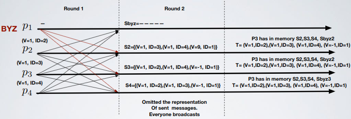

      - Algorithm
        ```
        // Code for node u, with input value x
        
        Round 1
          Send tuple(u,x) to all other nodes  // Do not send to yourself
          Receive tuple(v,y) from all other nodes v  // Discard malformed
          Store all received tuple(v,y) in a set Su  // Does not contain your tuple
          
        Round 2
          Send set Su to all other nodes
          Receive sets Sv from all nodes v  // Discard malformed
          T=set of tuple(v,y) seen in at least two sets Sv, including own Su
          Let tuple(v,y) ∈ T be the tuple with the smallest value y apperaing more frequently
          Decide on value y
        ```
      - Formal proof
        1. All correct process will have the same set `T`
           - Explanation
             - A tuple `(v,pi)` generated by a correct is in the set of all other corrects
               - There are at least other `2` correct in the system
               - Process `pi` sends `(v,pi)` to these processes at round `1`
               - At round `2` the two correct relay the tuple
               - Each correct will see tuple `(v,pi)` in two sets `S{*}`
               - Tuple `(v,pi)` is in `T` on each correct
             - If correct `p` has in `T` the tuple `(v,pbiz)` then `(v,pbiz)` is in the `T` of each correct
               - `p` puts `(v,pbiz)` in `T` only if `(v,pbiz)` is in the sets `Sp1`, `Sp2` sent by two corrects `p1`, `p2` at the beginning of round two (note that `(v,pbiz)` cannot be in `Sbiz`)
               - Since `p1`, `p2` are correct they send `Sp1`, `Sp2` to all correct
               - So each correct has in `T` the tuple `(v,pbiz)`
           - Notes
             - This implies agreement: all correct processes have the same `T` so the output is the same on all corrects
             - If a byzantine injects tuple `(x,pbiz)` in `T` then it has sent `(x,pbiz)` to two correct process in round `1` (so a byzantine can inject in the system a maximum of `N/2` values)
        2. If all correct propose the same value `v`, then `v` is the most frequent in `T`
           - Each tuple `(v,p)` proposed by a correct is in `T`; in T there are `n-1` tuples `(v,p1),(v,p2)...(v,p{n-1})` so `v` has frequency `n-1`. The byzantine can insert at most `n/2` different tuples in `T` but since `n/2 < n-1` the correct processes decide value `v`
    - NOT REQUIRED FOR THE EXAM: Intuition on why there is no algorithm that solves Byzantine Agreement (BA) when `n=3f` (when there are no signatures)
      - Proof execution

          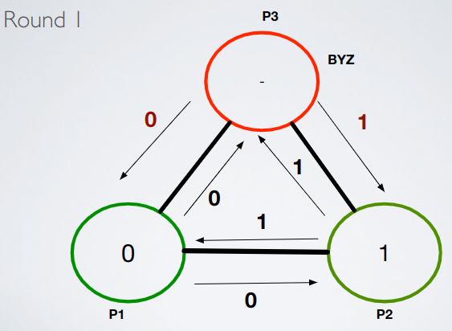

          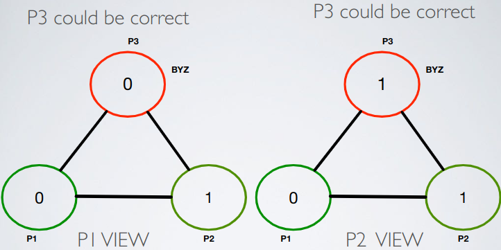

          - At the end of round `1` you cannot decide
            - Suppose `P1` decides `0`, then `P2` decides `1` (no agreement)
            - Suppose `P1` decides `1` (no all-same validity)
            - Those proof are symmetric for `P2`

          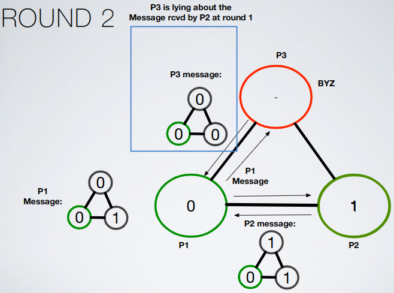

          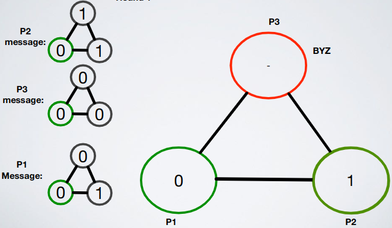

          - In round `2` everyone sends its view of the entire system
            - At the end of round `2` you cannot decide who is byzantine, adding rounds doesn't add information
            - (There is a symmetric execution where `P2` is byzantine, same thing happens)
          - We can iterate this for any round `r`
            - No consensus algorithm with all-same validity exists for `3` processes if one is byzantine
            - Even generalizing if `n=3f` is still impossible: suppose exists algorithm `A` that can with `n=3f`, then you can use `A` to solve the case of `n=3`, impossible

                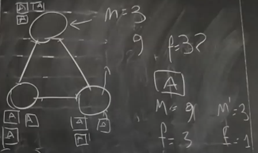
      - Final theorem: even in a synchronous setting, there is no algorithm solving consensus with any-input validity (and thus all the same validity) on authenticated channels if one third or more of the processes are byzantine; `f<N/3` is a necessary requirement
    - King algorithm: solve BA as long as `N=3f+1`
      - Requirements
        - `N>3f`
        - Authenticated channel
        - Synchronous system
      - How it works
        - `f+1` phases
          - In each phase `j` there is a king (leader); king of phase `j` is the node with `id=j`
          - Each node keep a variable `x` (its proposal at the beginning); is updated during the algorithm
          - At the end of phase `f+1` each correct decides variable `x`
        - Each phase is divided in `3` rounds (synchronous rounds)
          1. Vote round: each correct broadcasts `x`
          2. Propose round: each correct broadcasts a value `y` if it has been received at least `n-f` times in vote round; at the end of propose round a correct updates its value `x` to `z` if it sees `z` proposed at least `f+1` times
          3. King round: the king is the only one that broadcast its value `x`; at the end of king round a node sets its value to king’s value if during propose round no valued has reached the threshold of `n-f`
      - Execution example (`N=4, f=1, N-f=3, f+1=2`)
        - All correct start with the same value
          - Phase `1`

              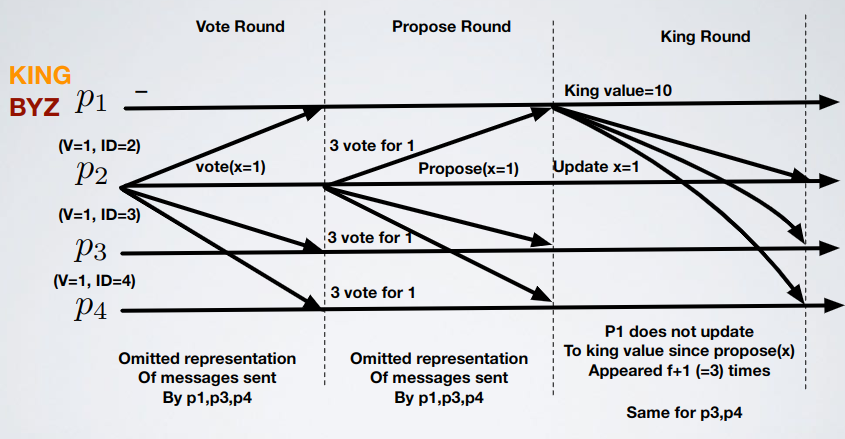

          - All the `f+1` phases in this case are the same
        - Not all correct start with the same value
          - Phase `1`

              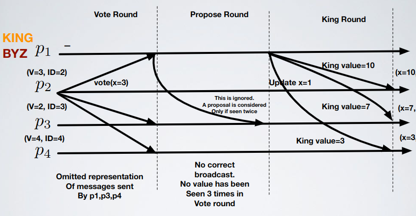

          - If corrects do not have all the same value, then byzantine king forces disagreement; but thanks to the `f+1` phases this is no more a problem: eventually a correct king will be elected so it will set all processes' values to the same value, so the next run all processes will agree on the value to choose ("All correct start with the same value")
      - Mechanisms
        1. If all correct processes have the same value for `x`, they detect this during Vote-Propose round and they do not get influenced by a byzantine king and other byzantines
        2. Correct King imposes value (implemented in the king round): if corrects disagree the correct king imposes agreement
      - Algorithm
        ```
        x=my input value
        
        for phase = 1 to f+1 do
          // Vote
          Broadcast value(x)
          // Propose
          if some value(y) received at least n-f times then
            Broadcast propose(y)
          end if
          if some propose(z) received more than f times then
            x=z
          end if
          // King
          Let node vi be the predefined king of this phase i
          The king vi broadcasts its current value w
          if received strictly less than n-f propose(y) then
            x=w
          end if
        end for
        ```
      - Formal proof
        - Mechanism `1`
          - Each correct broadcast `v` at the vote round
          - Each correct sees `v` voted `n-f` times (note that the value voted by the byzantine has at most `f` votes)
          - Each correct proposes `v` at the propose round
          - Each correct sees `v` proposed `n-f` times (note that the value proposed by the byzantine has at most `f` proposes)
          - Each correct ignore the king and keep its value to `v`
          - At phase `f+1` each correct decides `v`
        - Mechanism `2`
          1. If a correct process `p` proposes a value `x` in a phase, no other correct `p'` proposes a value `y` different than `x`
             - If `p` proposes `x`, then `N-2f` votes seen are from correct (`(N-f)-f`: `N-f` = correct, `f` = byzantine)
             - If `p'` proposes `y`, then `N-2f` votes seen are from correct (`(N-f)-f`: `N-f` = correct, `f` = byzantine)
             - This implies that `N=2(N-2f)+f` (`+f` because you readd byzantine processes), `N=3f` (but `3f < N`), impossible
          2. There is a phase with a correct king: there are `f` failures and `f+1` phases, in each phase we pick a different king; any set of `f+1` processes contains a correct process
             - Only a single value can be proposed more than `f+1` times: suppose there are two values `v` and `v'` each proposed `f+1` times, then there is a correct that proposes `v` and a correct that propose `v'`; by Lemma `1` we have `v=v'`
          3. After a phase with a correct king, all correct processes have the same value
             - The correct king sends the same value to each process, all correct that change their proposal to the one of the king get the same value
             - What happens to a correct process `p'` that do not accept the value of the king (let `p` be the king)? `p'` does not accept the value if it has seen a value `v` proposed `n-f` times in the propose phase, this means that `v` has been proposed by `n-2f` (same reasoning as before) correct processes (at least) `n-2f>f+1` (recall `n>3f`)
             - This implies that `v` has been seen at least `f+1` time by each correct in the system
             - This implies that at the end of the propose round all correct have set their value to `v` (also the king `p`)
             - So `p'`, even if does not accept the value of the king, has the same value `v` of the king
      - Performances
        - Messages: `O(f+1)*N^2` (phases * messages), but `f~=N/3` so the total is `O(N^3)` messages
        - Steps: `3f+1`
- Replication: replicated state machine
  - Rules
    - All replicas start in the same initial state
    - Every replica applies operations in the same order
    - All operations must be deterministic
    - All replicas end up in the same state
  - Problems
    - Agreement: every non-faulty state machine replica receives every request
    - Order: every non-faulty state machine replica processes the requests it receives in the same relative order
  - Solution: Atomic Broadcast (consensus)
  - System model
    - `n=3f+1` replicas -> `(n+f)/2 == 2f+1`
    - Eventually synchronous distributed system
    - Nodes connected by network
    - Messages can be lost, delayed, duplicated, no order
    - `delay(t)` does not grow faster than `t` indefinitely
    - At most `f` byzantine replicas
      - **Independent node failure**: if replicas run the exact same platform, a bug compromise all of them
      - Diversity of replicas: different OS, hardware, RSM implementations
    - Cryptographic techniques (needed to avoid spoofing, replay attacks and corruption)
      - Public key signatures
      - MAC (authentication)
      - Message digest produced by collision resistant hash functions
    - All replicas know each other's public keys to verify signatures
    - Adversary can
      - Coordinate the action of faulty nodes
      - Delay communication (not indefinitely)
      - Delay correct nodes (not indefinitely)
    - The adversary cannot subvert the cryptographic techniques cited above
  - Properties
    - Safety
      - Satisfies linearizability: like a centralized system that executes operations atomically one at a time
      - Regardless of faulty clients
      - Faulty clients can do strange (legal) operations (e.g. write garbage in a file system)
      - Limit damage by access control mechanisms
    - Liveness: clients receive responses to their requests if at most `(n-1)/3` replicas are faulty
  - Idea
    - A client sends a signed command to a primary and the backups
    - The primary assigns an unique sequence number to command and waits for a byzantine quorum of backups to execute it
    - Replicas execute the request and send a reply to the client
    - The client waits for `f+1` replies from different replicas with the same result; this is the result of the operation
  - Continues... see `DS-PBFT.pdf`: what follows is not required for the exam, for the lack of time this won't be included in the summary