# 8 - Blockchains

- Permissioned blockchain: small scale
  - Definition: decentralized fully replicated DB on a FIXED KNOWN network containing a history of transactions
  - Features
    - Private: you can access the blockchain only if you are part of a fixed known set of participants
    - Immutable: you can not change the structure of the blockchain by not following the protocol 
    - Non-repudiable: "everything is recorded"
  - Key points
    - The entities have to update in a concurrent way a set of data, keeping an history of transactions
    - The entities do not trust each others, neither they can agree on using a common trusted third-party (but not byzantine tolerant, a bit of a contradiction)
  - In real life: Hyperledger Fabric

      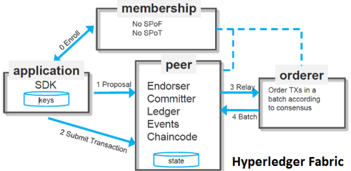
    
    - General explanation
      - Application (client)
        - Built by developer
        - Uses the blockchain using a smart contract (aka chaincode)
      - Membership
        - Handles memberships; gives key pairs to people who want to participate to the blockchain
      - Peers (replicas, backups)
        - In this case peers are not uniform (different purposes):
          - Endorser
          - Committer
        - Components
          - Ledger: replicated log of transactions
          - Events
      - Orderer: order transactions using consensus
    - In depth explanation
      - Smart contract (developer perspective): distributed application that acts on a shared context (distributed log, ledger) kept by the blockchain; like an **interface to the log**
        - Example

            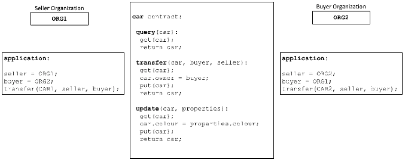

        - How it works

            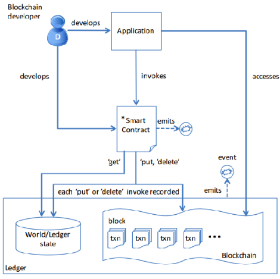

          - Application invokes transactions (functions) of the contract
          - The contract interacts with the log adding transactions (`put, delete`)
            - The log is the ordered list of all the transactions (the log always grows)
            - The world state is the state of the blockchain at a given time
      - Implementation example
        - Asset
          ```
          // Asset describes basic details of what makes up a simple asset
          type Asset struct {     
              ID             string json:"ID"
              Color          string json:"color"
              Size           int    json:"size"
              Owner          string json:"owner"
              AppraisedValue int    json:"appraisedValue"
          }
          ```
        - API
          - Create Asset
          - Delete Asset
          - Update Asset
        - Code (chaincode)
          ```
          // InitLedger adds a base set of assets to the ledger
          func (s *SmartContract) InitLedger(ctx contractapi.TransactionContextInterface) error {
              assets := []Asset{
                  {ID: "asset1", Color: "blue", Size: 5, Owner: "Tomoko", AppraisedValue: 300},
                  {ID: "asset2", Color: "red", Size: 5, Owner: "Brad", AppraisedValue: 400}
              }
              for_, asset := range assets {
                  assetJSON, err := json.Marshal(asset)  // Convert into JSON
                  if err != nil {
                      return err
                  }
                  // ctx interacts with the world state
                  err = ctx.GetStub().PutState(asset.ID, assetJSON)
                  if err != nil {
                      return fmt.Errorf("failed to put to world state. %v", err)
                  }
              }
              return nil
          }

          // AssetExists returns true when asset with given ID exists in world state
          func (s *SmartContract) AssetExists(ctx contractapi.TransactionContextInterface, id string) 
            (bool, error) {
              assetJSON, err := ctx.GetStub().GetState(id)
              if err != nil {
                  return false, fmt.Errorf("failed to read from world state: %v", err)
              }
              return assetJSON != nil, nil
          }
          
          // DeleteAsset deletes an given asset from the world state
          func (s *SmartContract) DeleteAsset(ctx contractapi.TransactionContextInterface, id string)
            error {
              exists, err := s.AssetExists(ctx, id)
              if err != nil {
                  return err
              }
              if !exists {
                  return fmt.Errorf("the asset %s does not exist", id)
              }
              return ctx.GetStub().DelState(id)
          }

          // CreateAsset issues a new asset to the world state with given details
          func (s *SmartContract) CreateAsset(ctx contractapi.TransactionContextInterface, id string,
            color string, size int, owner string, appraisedValue int) error {
              exists, err := s.AssetExists(ctx, id)
              if err != nil {
                  return err
              }
              if exists {
                  return fmt.Errorf("the asset %s already exists", id)
              }
              asset := Asset{
                  ID:             id,
                  Color:          color,
                  Size:           size,
                  Owner:          owner,
                  AppraisedValue: appraisedValue,
              }
              assetJSON, err := json.Marshal(asset)
              if err != nil {
                  return err
              }
              return ctx.GetStub().PutState(id, assetJSON)
          }

          // UpdateAsset updates an existing asset in the world state with provided parameters
          func (s *SmartContract) UpdateAsset(ctx contractapi.TransactionContextInterface,
            id string, color string, size int, owner string, appraisedValue int) error {
              exists, err := s.AssetExists(ctx, id)
              if err != nil {
                  return err
              }
              if !exists {
                  return fmt.Errorf("the asset %s does not exist", id)
              }
              // overwriting original asset with new asset
              asset := Asset{
                  ID:             id,
                  Color:          color,
                  Size:           size,
                  Owner:          owner,
                  AppraisedValue: appraisedValue,
              }
              assetJSON, err := json.Marshal(asset)
              return ctx.GetStub().PutState(id, assetJSON)
          }
          ```
      - Transaction flow

          

        1. The client creates, sign and send the transaction to a set of endorsing peers
        2. Endorsing peers simulate the transaction and see if this transaction is legal or not; if it's legal they sign it and send back to the client
        3. If the client gets a majority of endorsements the it commits the transaction sending it to the endorsing peers that forward the transaction to the ordering service (or directly to the ordering service)
        4. The ordering service (now migrating to RAFT) run consensus and assign a sequence number to the transaction; using committing peers and endorsing peers the ordering service check if the transaction is still regular (suppose that we create two concurrent transactions on the same object, the first transaction that is committed may invalidate the second), if it is commit and send the result to the client else the transaction remains in the log but is flagged as invalid
  - In real life: Corda R3
    - A Permissioned Blockchain that is crash tolerant, and has a prototype for PBFT
  - In real life: Hyperledger sawtooth
    - A Permissioned Blockchain based on two consensus algorithms:
      - PBFT
      - Sawtooth (Proof-of-Elapsed Time) PoET
        - Uses intel SGX (a secure co-processor inside intel processors that can execute operations in a "secure way" even on a compromised system)
        - In a nutshell SGX is a secure-tamper resistant enclave in your pc that executes some code that you cannot modify neither examine
        - SGX simulates a PoW oracle, you call it and it gives you a winning ticket after a random amount of time (similar to PoW-based blockchains)
- Permissionless blockchain: world scale
  - Definition: decentralized fully replicated DB on a trustless p2p network containing a history of transactions
  - Features
    - Public
    - Immutable
    - Non-repudiable
  - Bitcoin blockchain: from now on we will talk considering this blockchain
    - Bitcoin: virtual currency without a centralized authority (bank), transactions' validity is verified by the network
    - Bitcoin Public Ledger: the Bitcoin blockchain contains the list of all transactions ever made
    - Bitcoin transaction (txn)
      - Each transaction cost an amount of crypto-currencies (coins)
      - Each transaction is broadcasted to the whole p2p network
      - Each node verifies on his own all transactions and stores them to his ledger copy
  - Joining to the network with an address

      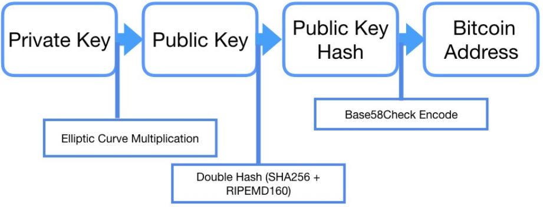

    1. Create a key pair
    2. Create the hash of the public key
    3. Encode the hash and you have your address
       - You can always check if the public key that signed the transaction is the one that matches the address of the transaction
  - Do a transaction: UTXO (unspent transaction output model)
    - You always put all of your money for a transaction; the ones not needed come back to you

        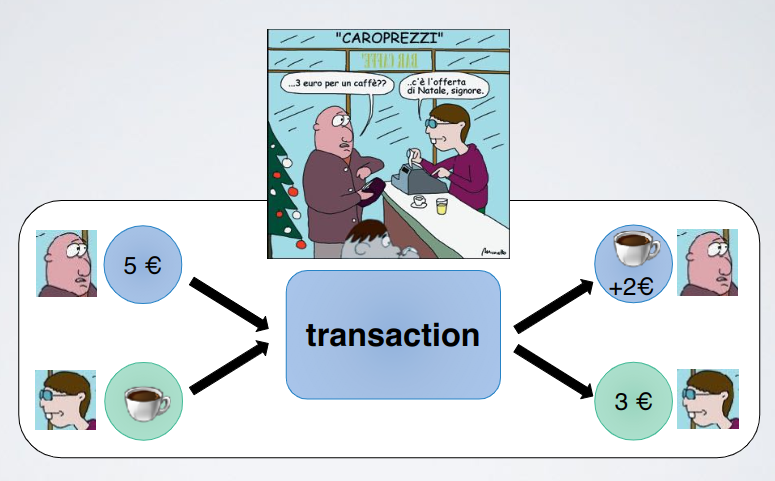

    - All transactions are chained together 

        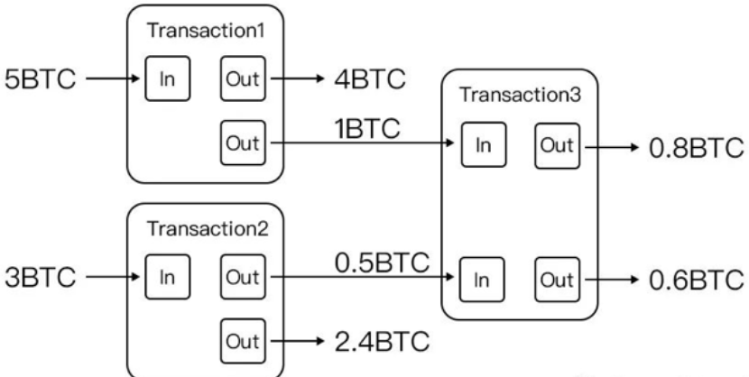

      - The "absolute value" of the bitcoins should be conserved; here it decrease i think for the transaction fees, maybe
    - Steps for a transaction
      - Alice wants to send 5 crypto-currencies to Bob
        1. She updates her ledger
        2. She broadcasts the msg
        3. All nodes verify the transaction

            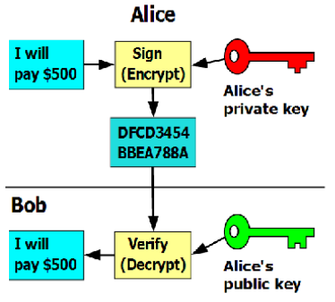

           - If a transaction takes several input this transaction must be signed by several people
      - If Alice is byzantine

          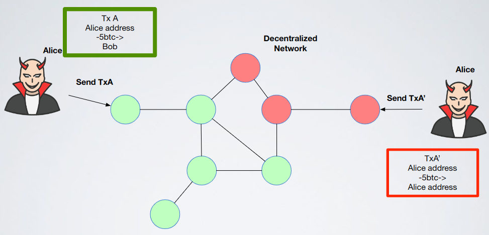

        - Solution: valid block and proof of work
          - Block: set of transactions

              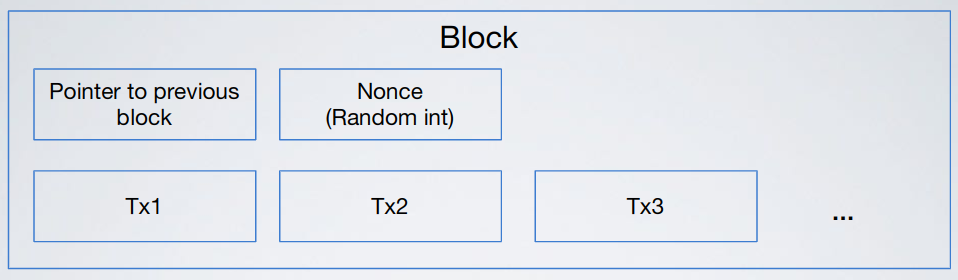

            - A block is valid if transactions inside are not conflicting
            - Only transactions inside a valid block could be considered valid (necessary but not sufficient)
            - A valid block can be created by a leader
          - To elect a leader on a dynamic network with an unknown number of nodes: the block itself should be the proof that the creator was a "leader"
            - The election is a probabilistic process in which the block is a ticket showing that you won
              - You compute an hash of `h(Block|nonce)` such that the results should have a certain trail of `k` zeros (like brute force)
                - `h(Block|1)=0xAB321313...`
                - `h(Block|2)=0x00BAB10C...`
                - ...
                - `h(Block|42431)=0x0000..00AB...`
                  - Probability: `(1/2)^k`
            - Important: inside the `Block` there is also a pointer to the parent (is included in the input of the hash function)
      - Example
        - Initial situation

            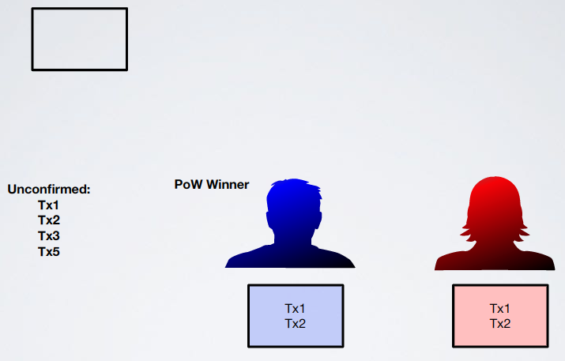

        - Blue wins leader election

            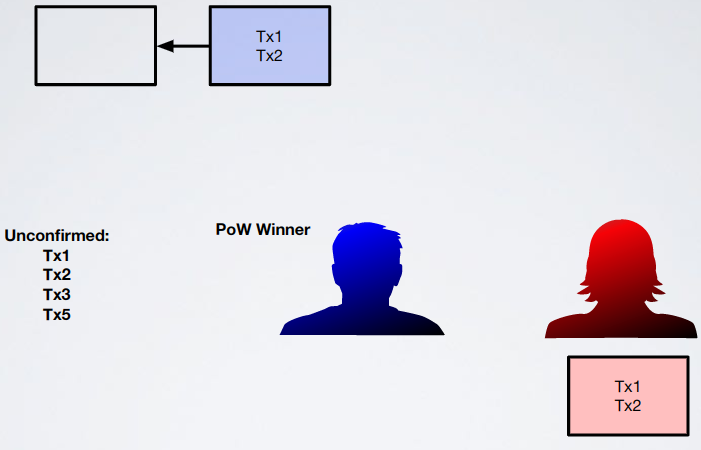

        - New block is created

            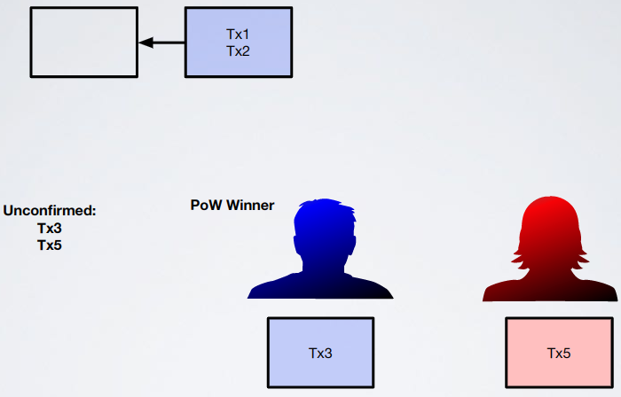

        - Blue wins leader election

            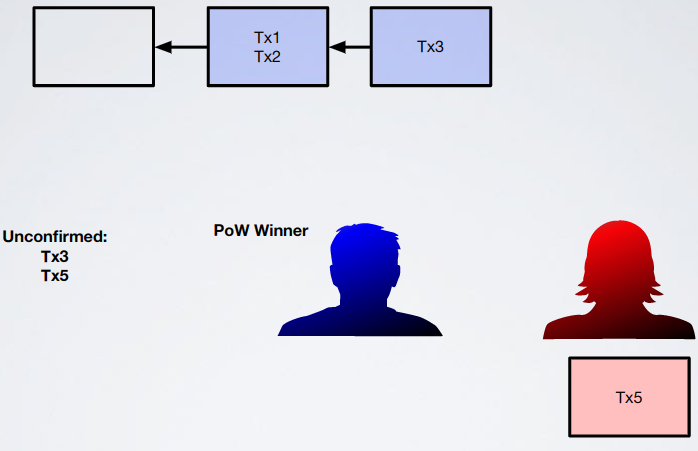

        - New block is created

            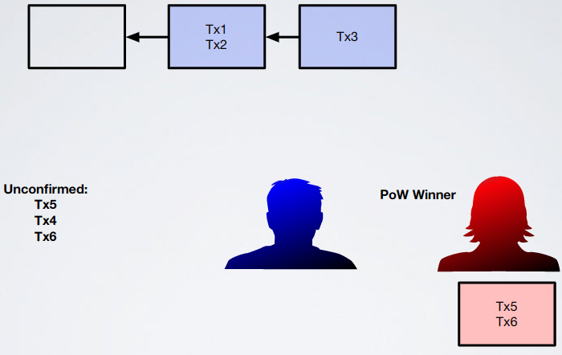

        - Red wins leader election

            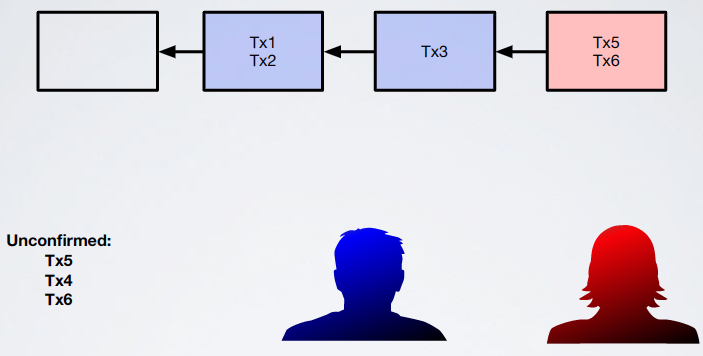

        - New block is created

            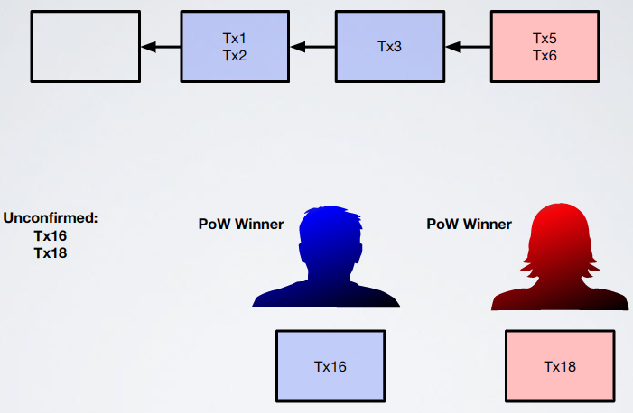

        - Blue and also red win leader election, fork

            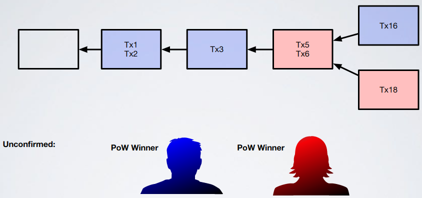

          - Fork probability (honest)
            - Depends on the number of participants and the probability of winning with one query
            - Depends on the asynchrony of the system
              - Example: if the red player does not see the block with `Tx3` it keeps mining on an extension of `Block(Tx1,Tx2)` wasting power and increasing the fork probability

                  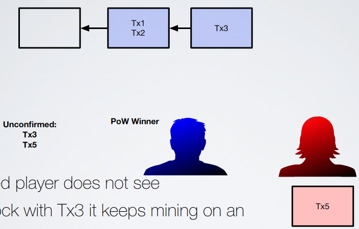

              - Fight asynchrony: falcon network
                - This is an overlay of Bitcoin that has `n` super-peers that are connected with a back-channel connection; every super-peer propagates updates to the other in a faster way and then to normal peers

                    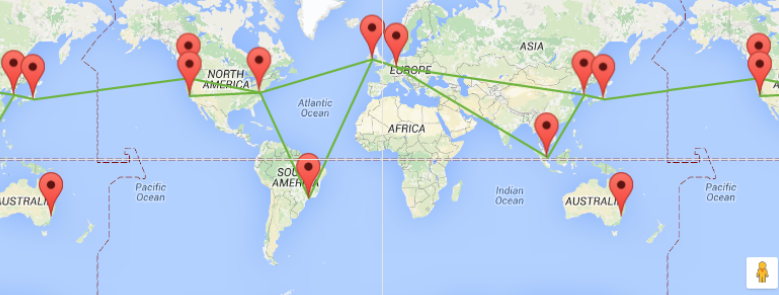

        - General final structure: tree

            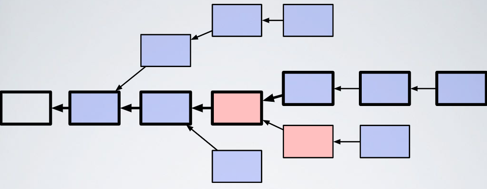

          - Pick a valid sequence: longest chain
            - So values are never definitively committed because there could always be a chain longer than the current longest chain
            - To solve this we use the `K`-blocks confirmation: accept a transaction only when it is `k` blocks in the past on the chain

                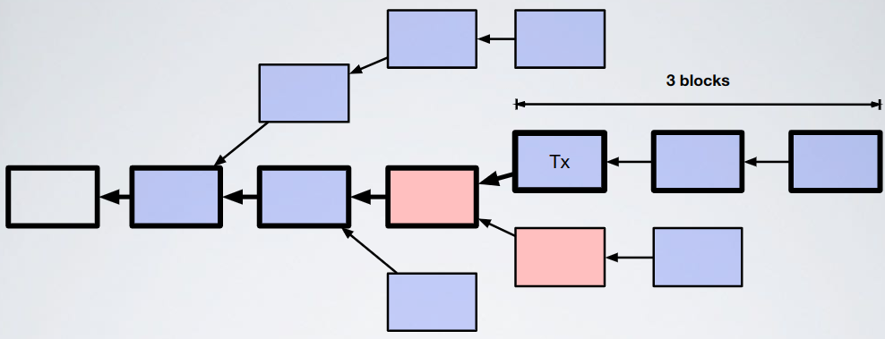

              - An adversary, to overwrite `tx`, must generate `k` blocks in a row (a lot of computation power!!)
  - Bitcoin oracle vs Sawtooth oracle
    - Bitcoin oracle: hash function
      - The probability to be elected depends on the number of queries
    - Sawtooth oracle: SGX
      - The probability of winning does not depend on the number of queries
  - Why "Block"-"Chain"?
    - Because transactions are grouped in blocks and the blocks are connected to each other in a chain
  - Performances

      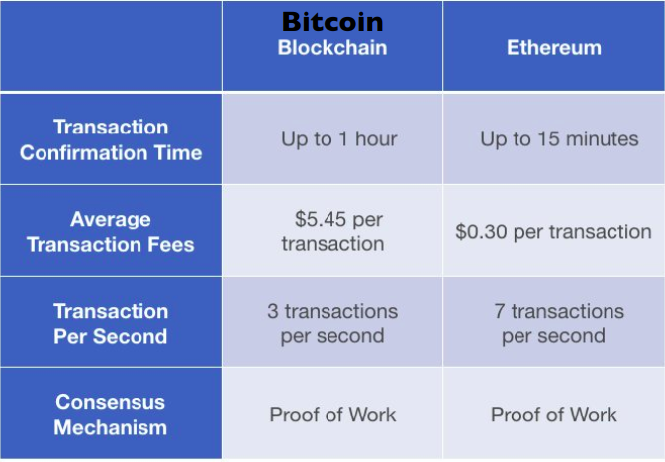

  - Performances vs security

      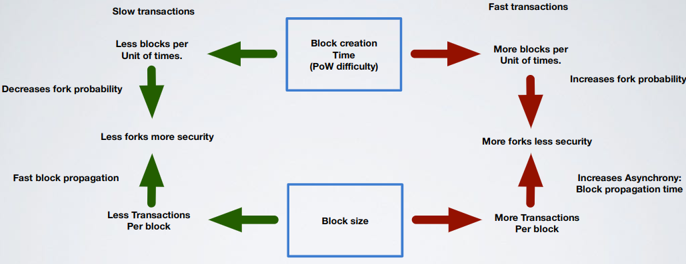

  - Scalability

      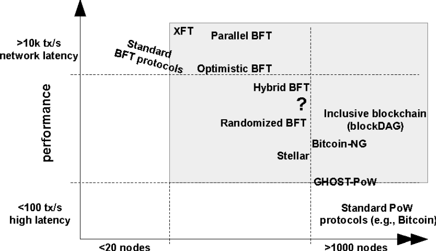

  - Is Bitcoin really decentralized?
    - A miner needs a high computational power to compute a thousands of hash per seconds (KH/s or MH/s), specific hardware that is expensive and consume a lot of electricity
      - Why mining?
        - Solving a block gives coins to node that found the PoW (create money from nothing)
        - Block solving is done in pools where the money earned is split equally (based on how much you "worked")
    - Pools make Bitcoins not decentralized: if (in the figure) some pools work together to gain the majority they will gain the control of transactions

        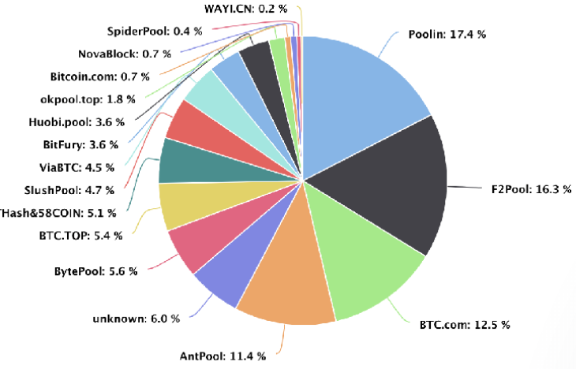

    - Bitcoin traffic goes through the internet: `3` autonomous systems see 69% of all Bitcoin connections so if they decide to shut down the net bitcoin will no longer work
  - Attacks
    - Majority attack

        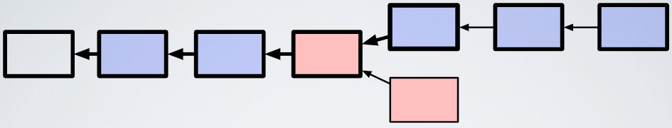
    
      - Red is the adversary: ratio of hash power `α`
      - Blu is the rest of the network: hash power `1-α`
      - The adversary is 2 blocks behind; it wins if its chain is `k` blocks longer than the blu chain (`k`-confirmation)
      - If so the adversary can double spend: rewrite a block and confirm it
      - Probability: $`(\frac{\alpha}{1-\alpha})^k`$ (`k`-confirmation); if `α >= 1/2` then eventually the attacker will win
        - As we have seen mining pools (creating a team) could reach the majority but they don't do this because then no one will trust anymore Bitcoins; selfish reason but those reasons are the best in those cases
    - Selfish-mining attack

        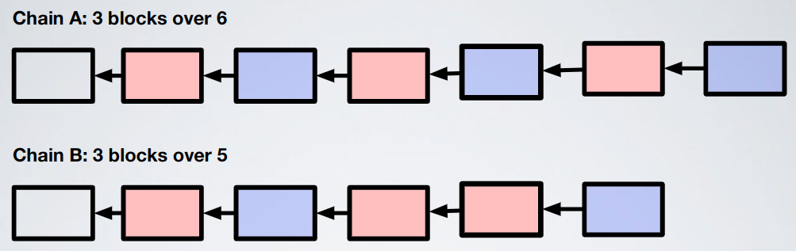

      - Rational adversary: the purpose of the adversary is to bias the chain so that its percentage of blocks in chain is more than the one it would include thanks to its hash power (so for example if the adversary is the red one then it will work for chain `B`)
      - How to: block withholding
        - When you find a valid block you keep it to yourself in order to gain some advantage

            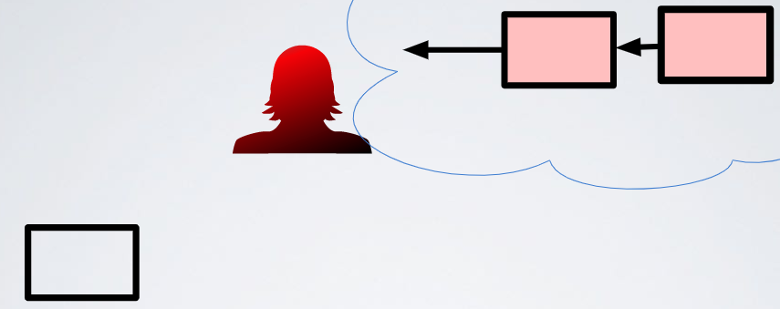
        
        - When you see a block from an honest you release two blocks (if you have it), this kills the block of the honest

            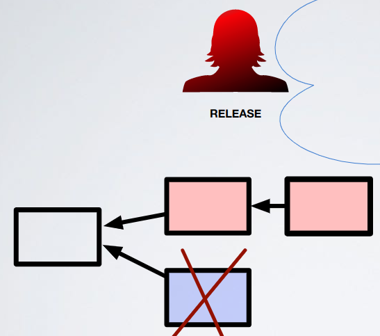

        - If your private chain is empty you start mining on top of the public

            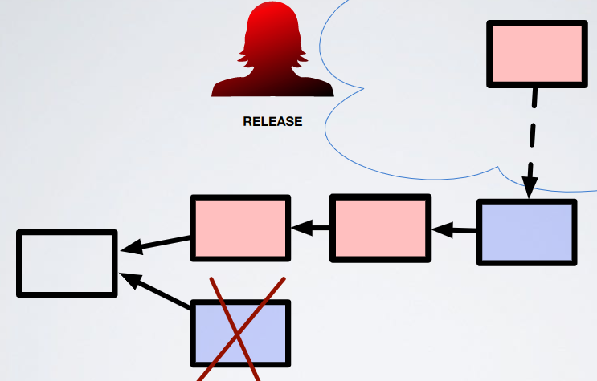

        - In this case there is a race

            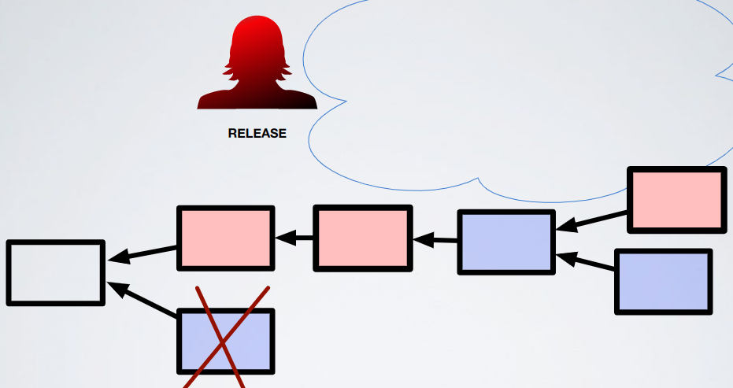

      - Probability: `α > 1/4`
        - Not used for the same reason of majority attack
    - Eclipse attack (patched)
      - Isolate a node that has a lot of power, do MITM and then do selfish mining

      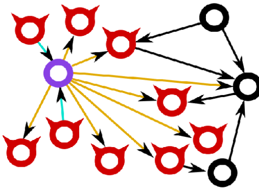

    - Erebus attack
      - Based on eclipse attack, and adversary tier-1 AS can eventually isolate 99% of bitcoin nodes and then use them to its advantage through MITM

      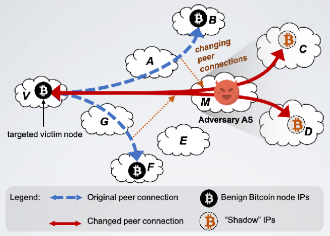