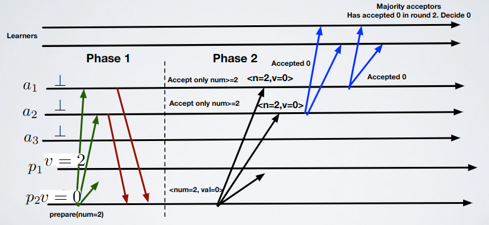

# 5 - Consensus

- Dummy example
  - Definition
    - Set of initial values: `{0,1}`
    - All process shall decide the same value `∈ {0,1}` based on the initial proposals

    

- Consensus in synchronous systems
  - Types
    - Regular
      - Events
        - Propose `〈c,Propose|v〉`: proposes value `v` for consensus
        - Decide `〈c,Decide|v〉`: outputs a decided value `v` of consensus
      - Properties
        - C1 (Termination): every correct process eventually decides some value (in the sense that sooner or later it terminates)
        - C2 (Validity/Non-triviality): if a process decides `v` then `v` was proposed by some process
        - C3 (Integrity): no process decides twice (you can not change idea when you decide)
        - C4 (Agreement): no two correct processes decide differently
      - Visual concept

          

      - Examples
        - Correct

            

            

        - Agreement violated

            

        - Integrity violated

            

        - Termination violated

            

        - Validity violated

            

            

      - How it works
        - Leader imposes consensus

            

        - Upon crash, new leader new impose

            

        - To avoid this type of problems we use Hierarchical consensus

            

        - Hierarchical consensus
          - How it works
            - Round based; locally a new round `r` starts either when:
              - The leader of `r-1` crashes
              - I receive a message from the leader of `r-1`
            - When in round `r` I receive a message from the leader of `r`, I assume its proposal
            - When `r=my_id` I decide my proposal, and I `BEB` it
          - Examples

              

              

      - Algorithm: Hierarchical consensus
        ```
        upon event〈c,Init〉do
          detectedranks:=∅;  // Set of dead processes
          round:=1;
          proposal:=⊥;  // Value that you propose
          proposer:=0;  // ID of the guy that make you change idea
          delivered:=[FALSE]^N;  // Messages delivered
          broadcast:=FALSE;  // Make sure that do something just once
          
        // (2)
        upon event〈P,Crash|p〉do
          detectedranks:=detectedranks ∪ {rank(p)};
          
        // Set your proposal
        // (3)
        upon event〈c,Propose|v〉such that proposal=⊥ do
          proposal:=v;

        // If you're the leader and you have a proposal broadcast it and decide it
        // (4)
        upon round=rank(self) ∧ proposal != ⊥ ∧ broadcast=FALSE do
          broadcast:=TRUE;
          trigger〈beb,Broadcast|[DECIDED,proposal]〉;
          trigger〈c,Decide|proposal〉;

        // Switch round if round is dead or you received a message from process round
        // (5)
        upon round ∈ detectedranks ∨ delivered[round]=TRUE do
          round:=round+1;
          
        // Receive the proposal
        // (6)
        upon event〈beb,Deliver|p,[DECIDED,v]〉do
          r:=rank(p);
          // If the rank of the actual proposer is lower than mine
          // and is greater than the proposer that pushed its value to me
          // (like this you avoid considering old messages)
          // then update proposal and proposer
          // We check r>proposer because we don't want
          // an old leader to change our proposal
          if r<rank(self) ∧ r>proposer then
            proposal:=v;
            proposer:=r;
          delivered[r]:=TRUE;
        ```
      - Formal proof
        - C3 (Integrity): there is only a function in which you decide; this is protected by a boolean variable `broadcast` (4)
        - C2 (Validity/Non-triviality): you can only decide the value of your `proposal` variable; it can be set on two lines:
          - (3): you set your own `proposal` by yourself
          - (6): you set your own `proposal` to a value proposed by someone
        - C1 (Termination): by induction on the process id; eventually you will be the leader because processes with ID lower than your crash (failure detector, (2)) or terminate (4) so you'll end up executing (5)
        - C4 (Agreement)
          - Let `p_i` be the correct process with minimum ID
          - No process will go in round `i+1` without receiving the decided message by `p_i`
          - This means that for a process to update its round to `i+1` it has to put proposal to the same proposal of `p_i`
          - Therefore each process with ID greater than `p_i` decides the same proposal of `p_i`
      - Performances
        - Number of messages: `O(N^2)`, `N` round, in each round the leader `Beb`-Broadcasts
        - Message delays or communication steps: `O(N)`, each round is a step
    - Uniform
      - Events: same as regular consensus
      - Properties
        - UC1–UC3: same as properties C1–C3 in regular consensus
        - UC4 (Uniform agreement): no two processes decide differently
      - Visual concept

          

      - How it works: same as regular consensus (hierarchical consensus) but with ACKs for proposals, before deciding and broadcasts for decides

          

      - Algorithm: Uniform hierarchical consensus
        ```
        // If a leader doesn't die the round is never updated, is not necessary

        upon event〈uc,Init〉do
          detectedranks:=∅;  // Set of dead processes
          ackranks:=∅;  // Set of ACKs
          round:=1;  // Actual round
          proposal:=⊥;  // Actual proposal
          decision:=⊥;  // Actual decision
          proposed:=[⊥]^N;  // Array of proposed values by processes
          
        upon event〈P,Crash|p〉do
          detectedranks:=detectedranks ∪ {rank(p)};

        // Set your proposal
        upon event〈uc,Propose|v〉such that proposal=⊥ do
          proposal:=v;
          
        // If i am the leader, my proposal is not null and
        // i haven't decided yet i broadcast my proposal
        upon round=rank(self) ∧ proposal != ⊥ ∧ decision=⊥ do
          trigger〈beb,Broadcast|[PROPOSAL,proposal]〉;

        // Handler for proposal receiving 
        upon event〈beb,Deliver|p,[PROPOSAL,v]〉do
          proposed[rank(p)]:=v;
          if rank(p)≥round then  // Avoid that old leaders update their proposals
            trigger〈pl,Send|p,[ACK]〉;  // Send ACK

        // If leader dies update round;
        // if leader proposed a value to you set this value as new proposal
        upon round ∈ detectedranks do
          if proposed[round] != ⊥ then
            proposal:=proposed[round];
          round:=round+1;
          
        // Handler for ACKs receiving
        // (just add ids of processes that ACKed to a list)
        upon event〈pl,Deliver|q,[ACK]〉do
          ackranks:=ackranks ∪ {rank(q)};
          
        // Here we use rb because processes MUST receive the DECIDED message,
        // else the algorithm will block:
        // if for example p1 is leader, it trigger DECIDED broadcast,
        // DECIDED is delivered only in p2, then the round is updated,
        // p2 terminates because it delivered DECIDED and then
        // other processes are stuck
        // When dead processes + processes that ACKed = all processes
        // trigger decide broadcast
        upon detectedranks ∪ ackranks={1,...,N} do
          trigger〈rb,Broadcast|[DECIDED,proposal]〉;
          
        // Handler of decision receiving
        upon event〈rb,Deliver|p,[DECIDED,v]〉such that decision=⊥ do
          decision:=v;
          trigger〈uc,Decide|decision〉;
        ```
      - Formal proof
        - UC3–UC2: same as C3–C2 in regular consensus
        - UC1 (Termination): similar to previous, by induction on the ids (now doing the full demonstration)
          - Base Case `ID=1`: for the `Beb`Cast and the perfect failure detector if `p1` is correct it eventually executes the `ReliableBroadcast` of `Decided` and delivers it terminating
          - Inductive Hypothesis `ID=k-1`: terminates or crashes
          - Inductive step `ID=k`: if a process with id less or equal to `k-1` is correct then it terminates by a `ReliableDeliver` of a `Decided` messages, for the property of the reliable broadcast if I am correct I will also receive a `Decided` message terminating; if all processes with ID less or equal to `k-1` crash, then I go to round `r=k`, since my ID is `k` I crash or terminate with the same prof of the base case
        - UC4 (Uniform agreement)
          - Let `pi` be the first process that decides, then it received the acks from all correct process (each process has `proposed[i]=v`, where `v` is the value decided by `pi`)
            - `pi` is correct: the other processes receive the decided message from `pi`, they have to decide the same value
            - `pi` crashes: all the processes that go to round `i+1` set `proposal=v` so sooner or later `v` will be decided
      - Performances
        - Number of messages: `(1Beb + 1 Rb)*(f+1)` (`f` = failures)
        - Message delays or communication steps: `2` delays for each leader failed, and `3` for each leader that succeeds in sending and delivering one decided = `O(f)` (`f` = failures)
  - Time lower bound
    - Assumptions
      - Processes switch rounds exactly at the same time
      - If a correct process send a message to a set of processes at the beginning of round `r`, messages will reach all correct processes in the set by the end of round `r`

      

    - Full-information protocol (FIP)
      - Information
        - At each round, each process sends its entire state to others (broadcast); so each process builds a view of the system and then decides locally
        - Each synchronous protocol (or algorithm) can be expressed as a FIP because a FIP is the most powerful thing you can do in a system
      - Consensus
        - Assumptions
          - Processes don't have IDs
        - How it works
          1. Broadcast my set of proposed values (initially, just my value) to all at the beginning of round `r`
          2. Collect all messages at the end of round `r` and update proposed value as union of the received messages 
          3. At round `r=k` take the maximum value in the proposed value set and decide; deciding locally is safe because every process has the same local state

            

        - Failures
          - If `1` failure happens it's impossible to decide at the end of round `1`

              

          - But if `f=1` at the end of round `2` i can decide

              

          - So in general: if i have `f` failures (also `0`) i need `f+1` rounds
      - Final theorem: "Given a synchronous system with `f` crash failures and `n` processes there exists no algorithm that terminates in less than `f+1` rounds, and so there exists no algorithm that has a step complexity of `f` or less."
- Consensus in asynchronous systems
  - Theorem: "Consider an asynchronous system composed by `n` processes; if `f>0` then consensus is unsolvable in such system."
- Consensus in eventually synchronous systems: Paxos
  - Information about properties
    - Safety (validity + integrity + agreement) is always guaranteed
      - Only a value that has been proposed may be chosen
      - Only a single value is chosen
      - A process never learns that a value has been chosen unless it actually has been
    - The algorithm is live (termination) only when the network behaves in a "good way" (synchronous) for long enough periods of time
      - Assumption: majority of correct processes
  - Actors: can run on the same physical process (for example machine `N` can have multiple different actors)
    - Proposers: propose value
    - Acceptors: processes that must commit on a final decided value (majority assumption only need here)
    - Learners: passively assist to the decision and obtain the final decided value
  - Explanation
    - Multiple acceptors
    - A value is chosen when accepted by the majority of acceptors
    - **P1**: an acceptor must accept the first proposal it receives
      - An acceptor can accept multiple proposals but all chosen proposals must have the same value
    - We keep track of different proposed values assigning them a proposal number that is unique (`<round number,value>` - `<n,v>`)
      - `round number`: function based on the id of the process
    - **P2**: for any `v` and `n`, if a proposal with value `v` and round number `n` is issued, then there is a set `S` consisting of a majority of acceptors such that either:
      - No acceptor in `S` has accepted any proposal round numbered less than `n`
      - `v` is the value of the highest-numbered proposal among all proposals round numbered less than `n` accepted by the acceptors in `S`
  - How it works

      

    - Phase 1: prepare request
      1. A proposer chooses a new proposal round number `n` and sends a prepare request `(PREPARE,n)` to a majority of acceptors
         - `(PREPARE,n)`: can I make a proposal with number `n`? If yes, do you suggest some value for my proposal?
      2. Cases:
         1. If an acceptor receives a prepare request `(PREPARE, n)` with `n` greater than `n'` where `n'` is the round number of any prepare request the acceptor has already responded (old `PREPARE` requests), the acceptor sends out `(ACK, n, n', v')` or `(ACK, n, ⊥, ⊥)`
            - `(ACK, n, n', v')` or `(ACK, n, ⊥, ⊥)`: promise not to accept any more proposals numbered less than `n` and suggests the value `v'` of the old highest-number proposal `n'` if any, else `⊥`
         2. If an acceptor receives a prepare request `(PREPARE, n)` with `n` lower than `n'` where `n'` is the round number of any prepare request the acceptor has already responded (old `PREPARE` requests), the acceptor sends out `(NACK, n')`
            - `(NACK, n')`: the proposal sent is too old, i am at round `n'`
    - Phase 2: accept request
      1. If the proposer receives responses from a majority of the acceptors, then it can issue an accept request `(ACCEPT, n, v)` with round number `n` and value `v`
         - `(ACCEPT, n, v)`: `n` is the number that appears in the prepare request, `v` is the value of the highest-numbered proposal among the responses (or the proposer’s own proposal if none was received)
      2. If the acceptor receives an accept request `(ACCEPT, n, v)`, it accepts the proposal unless it has already responded to a prepare request having a number greater than `n` 

    

    - "Phase 3": learning the decided value
      1. Whenever an acceptor accepts a proposal, it sends to all learners `(ACCEPT, n, v)`
      2. A learner that receives `(ACCEPT, n, v)` from a majority of acceptors, decides `v`, and sends `(DECIDE, v)` to all other learners
      3. Learners that receive `(DECIDE, v)`, decide `v`
  - Example

      

  - Algorithm (here NACKs are not used, instead just don't send ACKs)
    - Proposer `p`
      ```
      Constants:
        A  // Set of acceptors
        n = |A|  // Number of acceptors
        f = lower((n-1)/2)  // Number of possible failures, f is a minority
        
      Init:
        crnd = -1  // Current round number
        
      // Propose handler
      on〈Propose,val〉
        crnd = pickNextRound(crnd)
        cval = val  // Value proposed (p1)
        P = ∅  // ACKs multiset (Promises multiset = set with repeated values)
        send〈Prepare,crnd〉to A
        
      // If i get a Promise for my current Propose i add this to my Promise set
      on〈Promise,rnd,vrnd,vval〉with rnd=crnd from acceptor a
        P = P ∪ (vrnd, vval)  // Promise contains acceptor's prev round and val 
        
      // If Promise set contains a number of elements 
      // that is the majority of working (correct) acceptors
      on event |P| ≥ n-f
        // Pick highest previous round number accepted by acceptors
        j = max{vrnd:(vrnd,vval) ∈ P}
        // Check if this is not the first round,
        // if so use the previous proposed value, else use your own
        if j ≥ 0 then
          // Create a set of j's values (always 1 value i think)
          V = {vval:(j,vval) ∈ P}
          // Pick previous proposed val vval with largest prev round number
          cval = pick(V)
        send〈Accept,crnd,cval〉to A
      ```
    - Acceptor `a`
      ```
      Constants:
        L  // Set of learners
        
      Init:
        rnd = -1  // Round number
        vrnd = -1  // Previous round number
        vval = -1  // Value
        
      // If the prepare has a valid round number
      // accept it and ACK back with a Promise
      on〈Prepare,prnd〉with prnd > rnd from proposer p
        rnd = prnd
        send〈Promise,rnd,vrnd,vval〉to proposer p
        
      // If the proposer round number is greater than my current round
      // set values and spread those to learners 
      on〈Accept,i,v〉with i≥rnd from proposer p
        rnd = i
        vrnd = i
        vval = v
        send〈Learn,i,v〉to L
      ```
    - Learner `l`
      ```
      Init:
        V = ∅  // Multiset of rounds and values
        
      // Handler for Learn messages
      on〈Learn,(i,v)〉from acceptor a  // i = round, v = value
        V = V ∪ (i,v)

      // Trigger for deciding
      // If a certain (i,v) is accepted
      // by the majority of acceptors then decide
      // (l2) 
      on event ∃ i,v: |{(i,v): (i,v) ∈ V}| ≥ n-f
        v is chosen
      ```
  - Formal proof
    - Only a value that has been proposed may be chosen: values proposed are set by proposers in `(p1)` so verified
    - Only a single value is chosen
      - We will show this claim that contains the property above: if acceptor `a` has voted for value `v` at round `i`, then no value `v'` different from `v` can be chosen in a previous round `j<i`
        - Observation: if `a` voted for `v` at round `r=i` then, there is a proposer `p` that collected a set of acks `S` from a quorum `Q` of acceptors for its `prepare(r=i)`
        - Proof by induction on rounds number
          - `r=0`: the claim is correct since round `r=-1` does not exist
          - Inductive hypothesis: the claim is correct for rounds `r=1,2,3,4,...,i-1`
          - Inductive step: let us investigate round `r=i`; let `<r=j,v>` the vote for the highest round seen in the set `Q` (recall that `i>j`)
            - Example (`j=4`, `i=8`, `Q:{A1,A2,A3}`)
              - Caption and table
                - `-` means that the acceptor promised `p` to not vote for any proposal less than acceptor's in that round
                - `?` means that we do not know since `A4` is not in `Q`
                - `v` = value

                

              - Explanation
                - For rounds that are between `j` and `r=i-1` we have that acceptors in `Q` have promised to not vote, so is not possible for another proposer to get a quorum, so no value can be chosen between `r=j` and `r=i-1` other than `v`
                - Let's show that different value cannot be chosen between `r=0` and `r=j`
                  - If `j=0` (that is no acceptor in our quorum voted for `v` in previous rounds, then the previous case prove the bound)
                  - If `r=j` some acceptor voted for `v` then we can apply the inductive hypothesis and this shows that in all round between `0` and `j` no value different from `v` can be chosen
    - A process never learns that a value has been chosen unless it actually has been: verified in `(l2)`
    - Liveness: not guaranteed due to FLP (consensus can not be asynchronous)
      - Imagine a scenario with two competing proposers; they kill each other's proposes 

          

      - Solution: use an eventual leader elector on proposers and when the system becomes synchronous you have one leader and so you can progress
  - Paxos IRL: it's a lot more complex than the pseudocode
    - Problems
      1. Multi-Paxos: practical systems use Paxos as a building block to achieve consensus on a _sequence of values_; the simple way to implement this is to repeatedly execute the Paxos algorithm
      2. Handling disk corruption: a replica with a corrupted disk rebuilds its state as follows; it participates in Paxos as a non-voting member, meaning that it uses the catch-up mechanism to catchup but does not respond with promise or acknowledgment messages. It remains in this state until it observes one complete instance of Paxos that was started after the replica started rebuilding its state
      3. Master leases: we mustn't use Paxos also in read operations because this would slow down a lot the entire system, we must use another method to read values; not simple
      4. Group membership: total number of processes can change (increase or decrease), in original Paxos this doesn't exist
      5. Expressing the algorithm effectively: fault-tolerant algorithms are hard to express correctly even as pseudo-code; this problem is worse when the code for such an algorithm is intermingled with all the other code that goes into building a complete system. So is difficult to understand and debug the code
      6. Testing: impossible to prove correctness of the system so a massive amount of tests must be executed
      7. Unexpected failures: a pain to restore and fix
    - How to prove non-trivial correctness?
      - Use `TLA+`: language in which you model algorithms; you write the algorithm specification and proofs to be proven and then the software check those proofs (works only with safety properties)
  - Exercises
    - [Exercise 1](../../ex/consensus/ex1.md)
    - [Exercise 2](../../ex/consensus/ex2.md)