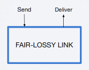
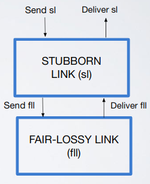
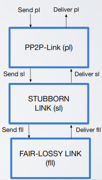

# Abstractions, pseudo-code conventions and our first algorithm
    
- Abstractions
  - How to build a distributed abstraction
    - Method
      1. Define a system model (sync/async, fairness)
      2. Formalize a problem (object) with an abstraction
          - What does this object has to do?
          - Input?
          - Output?
          - Properties?
      3. Implement the abstraction with a distributed protocol/algorithm
      4. Prove that the protocol implements the abstraction
  - Abstracting a real communication link between two processes: Fair-lossy link
    - Informal description
      1. We have a link
      2. It loses messages with a certain probability $`pr`$
      3. The channel can duplicate a message a finite number of times: if a message in a particular channel is not delivered with a probability of $`0.x`$ then resending the message $`n`$ times decrease the probability of not delivering it up to $`0`$ ($`n \times 0.x \rightarrow 0`$); so resending the message infinite times doesn't make sense
      4. It does not create messages from thin air: the channel doesn't create a message from nothing
    - Formalization
      - (1) A link exposes two events (about the same message)
        - Requests: $`<Send | q,m>`$ send a message $`m`$ to process $`q`$
        - Indication: $`<Deliver, p,m>`$ delivers message $`m`$ from process $`p`$ (receive)
      - Properties
        - (2) FL1 (Fair-loss): if a correct process $`p`$ sends infinitely often $`m`$ to a process $`q`$, then $`q`$ delivers (better saying receive) $`m`$ an infinite number of times (the two "infinites" are not the same)
        - (3) FL2 (Finite duplication): if a correct process $`p`$ sends $`m`$ a finite number of times to $`q`$, then $`q`$ cannot deliver $`m`$ an infinite number of times
        - (4) FL3 (No creation): if some process $`q`$ delivers a message $`m`$ with sender $`p`$, then $`m`$ was sent by $`p`$ to $`q`$

        

- Properties
  - Classes
    - Safety (example: FL3, No creation)
      - Definition 
        - Simple: if violated at a time $`t`$, it can never be satisfied after $`t`$
        - Formal: if a safety property is violated in execution $`E`$, there is a prefix $`E'`$ of $`E`$ such that any extension of $`E'`$ also violates the property
    - Liveness (example: FL1, Fair-loss and FL2, Finite duplication)
      - Definition
        - Simple: in finite executions if the liveness property is not satisfied it is possible that this property could be satisfied in the future 
        - Formal: given any finite execution $`E`$ that does not satisfy a liveness property there is an extension of $`E`$ that satisfy it
  - Important: liveness can become safety if we put a bound 
    - Example: FL2 (At-most 7 duplication), if a correct process $`p`$ sends $`m`$ a finite number of times to $`q`$, then $`q`$ cannot deliver $`m`$ more than 7 times
- Algorithms
  - Preamble
    - In algorithms we use pseudo code that reflects a reactive computing model
    - Components of the same process communicate by exchanging events
    - The algorithm is described as a set of event handlers
    - Handlers react to incoming events and possibly trigger new events
    - Handlers are atomic, they can only be interrupted in case of a crash
  - Communication links
    - Stubborn link
      - Events: same as Fair-lossy link
      - Properties
        - SL1 (Stubborn-delivery) = FL1 + FL2: if a correct process $`p`$ sends $`m`$ to $`q`$, then $`q`$ delivers $`m`$ an infinite number of times
        - FL3 (No creation)
      - Visual concept

          

      - Algorithm
        ```
        // Handler for Init event
        // "When the event Init happens..."
        upon event〈sl,Init〉do  // Init event triggered in stubborn link
          sent:=∅;
          starttimer(∆);  // Timer that triggers every ∆ LOCAL time
        
        // (2) Handler of: if timeout occurs resend every message
        upon event〈Timeout〉do
          forall (q,m) ∈ sent do 
            trigger〈fll,Send|q,m〉;
          starttimer(∆);
        
        // (3) Handler of message sent from stubborn link 
        upon event〈sl,Send|q,m〉do
          trigger〈fll,Send|q,m〉;
          sent:=sent ∪ {(q,m)};
        
        // (4) Handler of message received from fair lossy link 
        upon event〈fll,Deliver|p,m〉do
          trigger〈sl,Deliver|p,m〉;  // When fl deliver pass to sl deliver
        ```
      - Formal proof
        - FL3 (No creation): proof by contradiction
          - Suppose process $`q`$ executing our algorithm receives message $`m`$ that was not sent by $`p`$
          - If $`q`$ delivers a message, then it delivers in (4) but this implies that $`fll`$ is delivering a message that was not sent by $`p`$, so it isn't fair-lossy; absurd
        - SL1 (Stubborn-delivery): proof by contradiction
          - Suppose that $`q`$ delivers $`m`$ a finite number of times
          - $`p`$ sends $`m`$ on $`fll`$ an infinite number of times (2) (3)
          - If $`q`$ "stubborn delivers" $`m`$ a finite number of times, then $`fll`$ delivered $`m`$ a finite number of times (4)
          - Absurd: this isn't fair-lossy because we are sending a message an infinite number of times and we are receiving it a finite number of times
    - Perfect P2P link
      - Events: same as Fair-lossy link
      - Properties
        - SL1 (Stubborn-delivery)
          - PL1 (Reliable delivery): if a correct process $`p`$ sends $`m`$ to $`q`$ and _$`q`$ is correct_, then $`q`$ eventually (sooner or later) delivers (receive) $`m`$
          - PL2 (No duplication): a message is delivered at most once
        - FL3 (No creation)
      - Visual concept

          

      - Algorithm
        ```
        upon event〈pl,Init〉do
          delivered:=∅;

        upon event〈pl,Send|q,m〉do
          trigger〈sl,Send|q,m〉;

        // (3)  
        upon event〈sl,Deliver|p,m〉do
          if m !∈ delivered then
            delivered:=delivered ∪ {m};
            trigger〈pl,Deliver|p,m〉;
        ```
      - Formal proof
        - FL3 (No creation): proof by contradiction
          - Suppose process $`q`$ executing our algorithm receives message $`m`$ that was not sent by $`p`$
          - If $`q`$ delivers a message, then it delivers in (3) but that means that $`sl`$ delivered a message that was not created; absurd
        - PL2 (No duplication): proof by contradiction
          - The p2p-delivery of a message is "guarded" by `if m in delivered` (3)
          - Suppose $`m`$ is delivered twice, at time $`t`$ and $`t'`$ (with $`t < t'`$)
          - At time $`t`$ the delivery handler is executed, since the handler is atomic we have that $`delivered:=delivered \cup m`$ is executed before $`t'`$ so at $`t'`$ $`m`$ is in $`delivered`$, this contradict the fact that $`trigger <pl, deliver | P, m>`$ is executed at (or after) time $`t'`$
        - PL1 (Reliable delivery): proof by contradiction
          - Suppose $`p`$ sends $`m`$ and $`q`$ does not deliver it; there could be two reasons for $`q`$ to not deliver $`m`$:
            1. $`m`$ is in $`delivered`$ when the delivery handler is executed (3) but if this happens $`q`$ will execute `trigger〈pl,Deliver|p,m〉;`, this contradicts the fact that $`q`$ does not deliver $`m`$
            2. The delivery handler is never triggered (3), this means that $`sl`$ is not stubborn, absurd