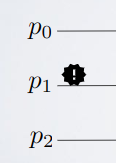
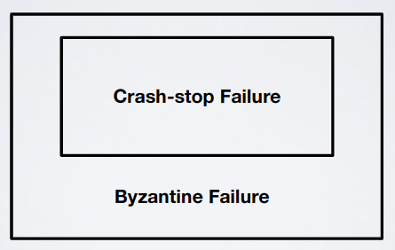

# Model

- System and processes
  - System
    - Formal definition
      - $`n`$ processes in $`\Pi:\{p_{0},...,p_{n-1}\}`$ with distinct identities
      - Processes communicate using a communication graph $`G:(\Pi, E)`$ (usually, $`G`$ is complete or fully connected)
      - The communication happens by exchanging messages on communication links (edges, $`E`$), those could also be indirect (ex: internet connection through various hops)

        

  - Process: (Possibly) Infinite State Machine
    - Simple definition

        

      - Upper layer: control layer
      - Link layer: connection layer
    - Formal definition
      - Think of this as an algorithm:
        1. $`P_{j}(q \in Q \cup Q_{in}, InBuf_{j}) = (q' \in Q, Send\_msg \sub M)`$
        2. $`OutBuf_{j} = OutBuf_{j} \cup Send\_msg`$
        3. $`InBuf_{j} = \empty`$
      - Components
        - Process ($`P_{j}`$)
        - Internal states (set $`Q`$, could be infinite)
        - Initial states (set $`Q_{in}`$, subset of $`Q`$)
        - Messages (set $`M`$, format <sender,receiver,payload>)
        - $`InBuf_{j}`$: multiset (set that can contain more equal elements) of received messages
        - $`OutBuf_{j}`$: multiset (set that can contain more equal elements) of "in-flight" messages (messages sent but not delivered)
  - Asynchronous execution
    - Execution
      - Simple definition: set of events (ordered)
      - Example
        1. Execution of a local step: $`Exec(i)`$, process $`i`$ executes a step of its state machine 

            

            

            - $`P_{1}(q,\{m\}) = (q',\{<1, 2, m'>\})`$
            - $`OutBuf_{1} = OutBuf_{1} \cup \{<1, 2, m'>\}`$
        2. Delivery of a message: $`Del(m, i, j)`$, move a message $`m`$ from $`OutBuf_{i}`$ to $`InBuf_{j}`$

            

            

            - $`InBuf_{2} = InBuf_{2} \cup \{<1, 2, m'>\}`$
      - Configuration ($`C_{t}`$): vector of $`n`$ components (state of a process $`C_{t}[j](q_{j}, InBuf_{j}, OutBuf_{j})`$)
        - Example

            

            - $`C_{0} = <(q_{0},\{\},\{\}),(q_{1},\{m\},\{\}),(q_{2},\{\},\{\})>`$
        - Important: an event is enabled in a configuration if it can happen
      - Formal definition (of execution): infinite sequence that alternates configurations and events $`(C_{0},e_{0},C_{1},e_{1},C_{2},e_{2},...)`$ such that each event $`e_{t}`$ is enabled in configuration $`C_{t}`$ and $`C_{t}`$ is obtained by applying $`e_{t-1}`$ to $`C_{t-1}`$
        - Important: is possible that if (for example) $`e_{1}`$ is a delivery event the effective delivery of the message could happen a lot of time after next execution steps (see next diagram)
        - Important: the effective delivery must happen (fair execution, we'll always consider this case); unfair executions brake any possible non-trivial algorithm (non-trivial means that there must be a message exchange)
        - State space diagram

            

      - Local execution (local view): given an execution $`E`$ and a process $`p_{j}`$, we define as local execution ($`E|p_{j}`$) of $`p_{j}`$ the subset of events in $`E`$ that "impact" $`p_{j}`$
        - In this example $`p_{1}`$ just knows about $`p_{0}`$, $`e_{0}`$ and $`m`$, it doesn't know about $`p_{2}`$, $`p_{3}`$... an analogous thing can be said of for example $`p_{2}`$

            

        - Different executions could lead to the same local execution
          - In this example $`\forall p_{j} \in \Pi, \xi|p_{j} = \xi'p_{j}`$, so $`\xi`$ and $`\xi'`$ are indistinguishable 

              

        - **Theorem**: in the asynchronous model there is no distributed algorithm capable of reconstructing the system execution
  - Synchronous vs asynchronous
    - A System is synchronous if there is fixed bound on the delay of messages
      - Adversary differences
        - Asynchronous system = adversary powerful, user not powerful
        - Synchronous system = adversary not so powerful, user powerful
  - Failures
    - Types
      - Crash-Stop
        - Definitions
          - Simple: process stops receiving/responding to messages (forever)
          - Formal: $`Crash(p_{j})`$ = process $`p_{j}`$ doesn't execute any local computation ($`Exec(j)`$)

              

      - Byzantine: 
        - Definitions
          - Simple: process starts behaving differently from what we expect
          - Formal: $`Byz(p_{j})`$ = process $`p_{j}`$ behaves in an arbitrary way

              

    - Relationship Byzantine-Crash: byzantine could also stop sending/responding to messages because a byzantine failure can do "everything it wants", so it's like a crash failure in this case; crashes are a subset of byzantine failures

        

    - Terminology
      - Correct process: it doesn't experience a failure
      - $`f`$: maximum number of processes that can experience a failure event in an execution (exclusive)
      - Byzantine $`f`$: $`\frac{1}{3}tot`$
      - Crash-stop $`f`$: $`\frac{1}{2}tot`$
      - Important: we never do assumptions on when a failure event happens (we never know)