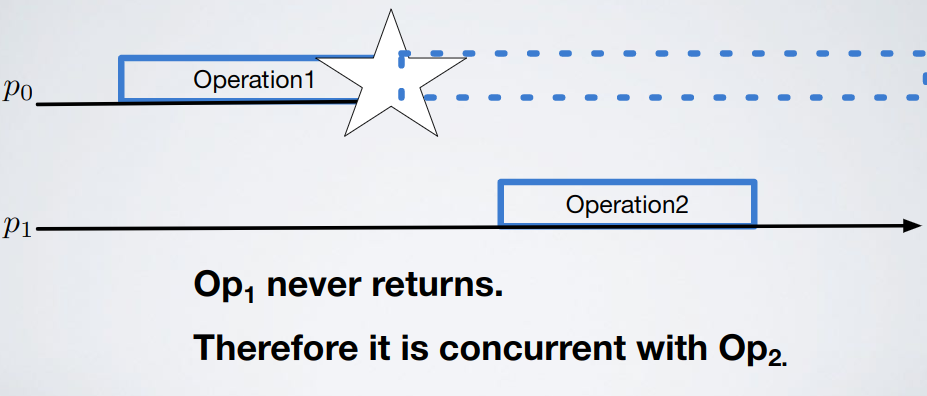
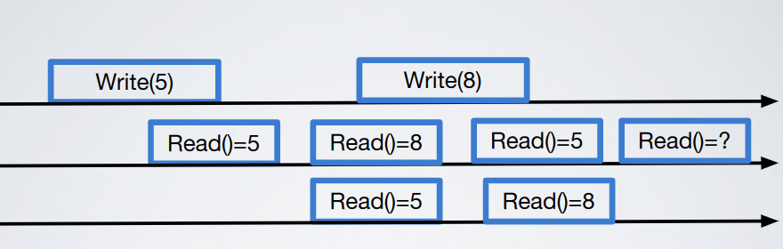
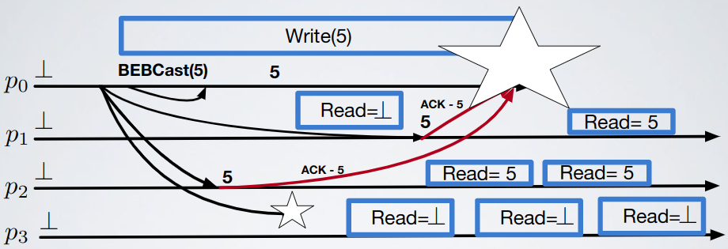
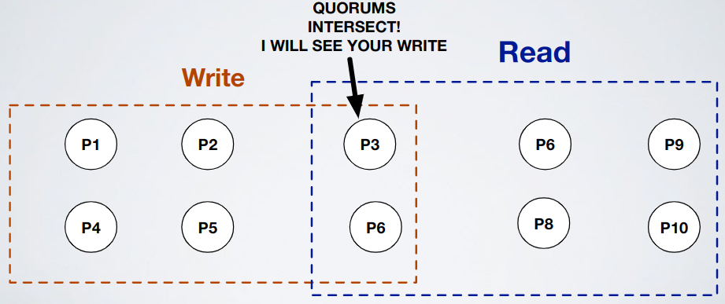

# 4 - Shared Memories

- Register: shared variable accessed by processes through read and write operations
  - Types
    - Multiprocessor machine

        

    - Distributed message passing system
      - Important: no physical shared memory
      - Register abstraction (simulation): as if shared hardware memory 

      

      - How it works
        - Register assumptions
          - A register stores only positive integers and it is initialized to `0` (`⊥`)
          - Each written value is univocally identified (use like a timestamp to make every value different from the others)
          - Processes are sequential: a process cannot invoke a new operation before the one it previously invoked (if any) returned
        - Operations
          - Types
            - Read `read()→v`: returns the "current" value `v` of the register
            - Write `write(v)`: writes the value `v` in the register and returns `true` at the end of the operation
          - Sub-events
            - Invocation
            - Return 
              - Confirmation for the write operation
              - A value for the read operation
          - Notes
            - Each of these events occur at a single indivisible point of time
            - Each operation starts with an invocation and terminates when the corresponding response (return) is received; in this case an operation is complete
            - The execution of an operation invoked by a process `p`, is the time interval defined by the invocation event and the return event
          - Failed operations: operation invoked by some process `pi` that crashes before obtaining a return
          - Precedence
            - Given two operations (on two different processes) `o` and `o'`, `o` precedes `o'` if the return event of `o` precedes the invocation event of `o'`
            - An operation `o` invoked by a process `p` may precede an operation `o'` invoked by `p'` only if `o` completes
            - If no precedence relation between two operations can be defined, they are said to be concurrent

            

            
        
          - Register notation
            - `(X,Y)` denotes a register where `X` processes can write and `Y` processes can read; it is a priori known which process can write and which can read
            - `(1,1)` doesn't mean that the system is composed by just two processes, there could be various processes working that can't read/write into register

                

            - `(1,N)`

                

            - `(N,N)`

                

        - Register semantic
          - Types
            - Strictly serialized semantic
              - Assumptions
                - Serial access: a process does not invoke an operation on the register if there is another process that previously invoked an operation and hasn't finished yet
                - No failures
              - Specification
                - Liveness: each operation eventually terminates
                - Safety: each read operation returns the last value written
            - Regular consistency (regular registers `(1,N)`)
              - Specification
                - Termination: if a correct process invokes an operation then the operation eventually receives the corresponding confirmation (the operation ends)
                - Validity: a read operation returns the last value written or the value concurrently written
                - Note: a process can read a value `v` and then a value `v'` even if the writer has written `v'` and then `v`, as long as the write and the read operations are concurrent
              - Examples

                  

                - Answer: `8`

                

                - Answer: `5` or `8`
              - Events
                - Read `〈onrr,Read〉`: invokes a read operation on the register
                - Write `〈onrr,Write|v〉`: invokes a write operation with value `v` on the register
                - Read return `〈onrr,ReadReturn|v〉`: completes a read operation on the register with return value `v`
                - Write return `〈onrr,WriteReturn〉`: completes a write operation on the register
              - Properties
                - ONRR1 (Termination): if a correct process invokes an operation then the operation eventually completes (ends)
                - ONRR2 (Validity): a read that is not concurrent with a write returns the last value written; a read that is concurrent with a write returns the last value written or the value concurrently written
                - Note: the writer could die, if it happens then it is NOT substituted
              - Visual concept

                  

              - Explanation: READ-ONE-WRITE-ALL
                - Uses
                  - Perfect failure detector
                  - Perfect point-to-point link
                  - Best effort broadcast
                - How it works
                  - Each process stores a local copy of the register
                  - Read-One: each read operation returns the value stored in the local copy of the register
                  - Write-All: each write operation updates the value locally stored at each process the writer consider to have not crashed
                  - A write completes when the writer receives an ack from each process that has not crashed

                 

                

                  - Important: `Read ⊥` then `Read N` then `Read ⊥` is impossible in our implementation (see algorithm below) but is possible for the specification (see specification above)

              - Algorithm: READ-ONE-WRITE-ALL
                ```
                upon event〈onrr,Init〉do
                  val:=⊥;  // Register value
                  correct:=Π;  // Correct processes
                  writeset:=∅;  // Set containing ACKs
                  
                upon event〈P,Crash|p〉do
                  correct:=correct - {p};
                  
                upon event〈onrr,Read〉do
                  trigger〈onrr,ReadReturn|val〉;
                  
                upon event〈onrr,Write|v〉do
                  trigger〈beb,Broadcast|[WRITE,v]〉;
                  
                upon event〈beb,Deliver|q,[WRITE,v]〉do
                  val:=v;
                  trigger〈pl,Send|q,ACK〉;

                upon event〈pl,Deliver|p,ACK〉do
                  writeset:=writeset ∪ {p};
                  
                // Terminate the write when all correct process ACKed back
                upon correct ⊆ writeset do
                  writeset:=∅;  // Clear ACK set, else algorithm stops working
                  trigger〈onrr,WriteReturn〉;
                ```
              - Formal proof: READ-ONE-WRITE-ALL
                - ONRR1 (Termination)
                  - Read: is local
                  - Write: from the properties of the communication primitives and from the completeness property of the perfect failure detector
                - ONRR2 (Validity): because of the strong accuracy property of the perfect failure detector, each write operation can complete only after all processes that have not crashed updated their local copy of the register
                  - Not concurrent read: read the last value written
                  - Concurrent read: for the no creation property of the channels, the value returned is either the last value written or the one being written
              - Performances: READ-ONE-WRITE-ALL
                - Number of messages
                  - Write: `O(N)`, `1` Beb and at most `N` ACKs
                  - Read: `O(1)` (local, no message exchanged)
                - Message delays or communication steps
                  - Write: `2`: `1` to reach everyone and `1` to get ACKs back
                  - Read: `0`
              - Failures bound (READ-ONE-WRITE-ALL): processes number
              - Explanation: MAJORITY VOTING
                - Uses
                  - Failure model: crash
                  - No failure detector
                  - Perfect point-to-point link
                  - Best-effort broadcast
                - Assumptions
                  - A majority of correct processes
                - How it works: 
                  - Write: through BEB then I wait for acks from `n/2+1` processes (a quorum)
                  - Read: through BEB and then I wait for register values from `n/2+1` processes (another quorum)

                  

                  - To avoid the below problem we also add a timestamp to write messages

                    

              - Algorithm: MAJORITY VOTING
                ```
                upon event〈onrr,Init〉do
                  (ts,val):=(0,⊥);  // Tuple: timestamp, value
                  wts:=0;  // Timestamp used by the writer
                  acks:=0;  // ACKs counter
                  rid:=0;  // Timestamp used by the reader (rid is meh, consider it as rts)
                  readlist:=[⊥]^N;  // Read values' ACKs, collect vals and timestamps of read answers
                  
                // Send write request
                upon event〈onrr,Write|v〉do
                  wts:=wts+1;
                  acks:=0;
                  trigger〈beb,Broadcast|[WRITE,wts,v]〉;
                  
                // Receive write request and send ACK
                upon event〈beb,Deliver|p,[WRITE,ts',v']〉do
                  if ts'>ts then
                    (ts,val):=(ts',v');
                  trigger〈pl,Send|p,[ACK,ts']〉;  // ACK with the new timestamp received
                  
                // Receive ACK
                upon event〈pl,Deliver|q,[ACK,ts']〉such that ts'=wts do
                  acks:=acks+1;
                  if acks>N/2 then  // If quorum then return write
                    acks:=0;
                    trigger〈onrr,WriteReturn〉;

                // Read request
                upon event〈onrr,Read〉do
                  rid:=rid+1;
                  readlist:=[⊥]^N;
                  trigger〈beb,Broadcast|[READ,rid]〉;
                  
                // Read reply
                upon event〈beb,Deliver|p,[READ,r]〉do
                  // Send back received timestamp (r), value timestamp (ts) and value (val)
                  trigger〈pl,Send|p,[VALUE,r,ts,val]〉;
                  
                // Receive read reply and return read
                upon event〈pl,Deliver|q,[VALUE,r,ts',v']〉such that r=rid do
                  readlist[q]:=(ts',v');
                  if #(readlist)>N/2 then
                    v:=highestval(readlist);  // Get the one with highest timestamp
                    readlist:=[⊥]^N;
                    trigger〈onrr,ReadReturn|v〉
                ```
              - Formal proof: MAJORITY VOTING
                - ONRR1 (Termination): from the properties of the communication primitives and the assumption of a majority of correct processes
                - ONRR2 (Validity): from the intersection property of the quorums
              - Performances: MAJORITY VOTING
                - Number of messages
                  - Write: `O(N)` (`2N`), `1` Beb and at most `N` ACKs
                  - Read: `O(N)` (`2N`),  `1` Beb and at most `N` ACKs
                - Message delays or communication steps
                  - Write: `2`: `1` to reach everyone and `1` to get ACKs back
                  - Read: `2`: `1` to reach everyone and `1` to get ACKs back
              - Failures bound (MAJORITY VOTING): `N/2-1`
              - Exercises
                - [Exercise 6](../../ex/shared_memories/ex6.md)
            - Sequential consistency
              - Definition: "The result of any execution is the same as if the (read and write) operations by all processes on the data store were executed in some sequential order and the operations of each individual process appear in this sequence in the order specified by its program" (Lamport, 1979)
                - Important: there exists a global ordering (where concurrency "doesn't exists") that respects the local ordering seen by each process; the global order has nothing to do with the real execution of the system

                    

                - Counter example: this is not sequential because we can't find a global order that is consistent
                  - `SHUFFLE1` isn't correct because the second read should be `5`
                  - `SHUFFLE2` isn't correct because the first read reads `5` before someone writing `5`
                  - `SHUFFLE3` isn't correct because you should read two times `⊥`

                  

                - Another example: this time this is sequential (read, read, read, write)
                  - Sequential consistency gives to each process the illusion of using a single storage even if the result does not respect the global constraint that happens in the real execution

                  

                - Important

                    

            - Linearizability/Atomicity consistency (atomic registers)
              - Definition: "Each operation should appear to take effect instantaneously at some moment between its start and completion; the moment is the linearization point of the operation"

                  

                - Example (not linearizable but regular and sequential)

                    

                - Important: linearizability implies regular and sequential consistency

                    
                    
              - Specification
                - Termination and Validity: same as regular registers
                - Ordering: if a read returns `v2` after a read that precedes it has returned `v1`, then `v1` has not been written after `v2` (if someone reads `1` then processes that read after must read `1`)
              - Examples

                  

                - Answer: non-atomic

                

                - Answer: atomic (and regular)

                

                - Answer: regular but not atomic

                

                - Answer: atomic and regular
              - Events: same as regular registers
              - Properties
                - ONAR1 (Termination) - ONAR2 (Validity): same as regular registers
                - ONAR3 (Ordering): if a read returns a value `v` and a subsequent read returns a value `w` then the write of `w` does not precede the write of `v`
              - Implementation: `(1,N)` using `(1,N)` regular register; won't use messages to communicate, just regular registers
                - Phase 1: use a `(1,N)` regular register (RR) to build a `(1,1)` atomic register (AR)
                  - Visual concept

                      

                  - Explanation
                    - `p1` is the writer and `p2` is the reader of the `(1,1)` atomic register
                    - We use a `(1,N)` regular register where `p1` is the writer and `p2` is the reader
                    - Each write operation on the atomic register writes the pair (value, timestamp) into the underlying regular register
                    - The reader tracks the timestamp of previously read values to avoid to read something old
                  - Algorithm
                    ```
                    upon event〈ooar,Init〉do
                      (ts,val):=(0,⊥);
                      wts:=0;
                      
                    upon event〈ooar,Write|v〉do
                      wts:=wts+1;
                      trigger〈onrr,Write|(wts,v)〉;

                    upon event〈onrr,WriteReturn〉do
                      trigger〈ooar,WriteReturn〉;
                      
                    upon event〈ooar,Read〉do
                      trigger〈onrr,Read〉;
                      
                    upon event〈onrr,ReadReturn|(ts',v')〉do
                      if ts'>ts then
                        (ts,val):=(ts',v');
                      trigger〈ooar,ReadReturn|val〉;
                    ```
                  - Formal proof
                    - ONAR1 (Termination) and ONAR2 (Validity): from regular registers
                    - ONAR3 (Ordering): from the validity property and from the fact that the read tracks the last value read and its timestamp; a read operation always returns a value with a timestamp greater or equal to the one of the previously read value
                  - Performances
                    - Write: each write operation performs `1` write on a `(1,N)` regular register
                    - Read: each read operation performs `1` read on a `(1,N)` regular register
                  - Failures bound: same as regular register
                  - Exercises
                    - [Exercise 3](../../ex/shared_memories/ex3.md)
                    - [Exercise 4](../../ex/shared_memories/ex4.md)
                - Phase 2: use a set of `(1,1)` atomic registers to build a `(1,N)` atomic register
                  - Visual concept

                      

                  - Explanation
                    - Each one has a `(1,1)`-register on which `p1` writes

                        

                    - Multiple writes on different registers are not instantaneous, so a write could appear on `p2` but not on `p4`
                    - To fix this when `p2` reads, before completing its operation writes the value `X` (and a timestamp) on the other processes using another register

                        

                    - The same thing is done for all processes

                        

                  - Algorithm
                    ```
                    upon event〈onar,Init〉do
                      ts:=0;  // Timestamp
                      acks:=0;  // Count how many writes terminate
                      writing:=FALSE;  // Are you the real writer or you just help?
                      readval:=⊥;
                      readlist:=[⊥]^N; // Values in our "column" (see image above)
                      forall q ∈ Π, r ∈ Π do
                        Initialize a new instance ooar.q.r of (1,1)-AtomicRegister...
                        ...with writer r and reader q;

                    // "Real" writer write handler
                    upon event〈onar,Write|v〉do
                      ts:=ts+1;
                      writing:=TRUE;
                      // Write ts and value in your row (image above: blue)
                      forall q ∈ Π do
                        trigger〈ooar.q.self,Write|(ts,v)〉;
                      
                    // "Real" writer write return handler
                    upon event〈ooar.q.self,WriteReturn〉do
                      acks:=acks+1;
                      if acks=N then
                        acks:=0;
                        // If we are the "real" writer WriteReturn,
                        // else ReadReturn because we just disseminated the message
                        // so we can end our read operation
                        if writing=TRUE then
                          trigger〈onar,WriteReturn〉;
                          writing:= FALSE;
                        else
                          trigger〈onar,ReadReturn|readval〉;

                    // Read all your "columns"
                    upon event〈onar,Read〉do
                      forall r ∈ Π do
                        trigger〈ooar.self.r,Read〉;
                      
                    // ReadReturn handler 
                    upon event〈ooar.self.r,ReadReturn|(ts',v')〉do
                      // Append to readlist new values
                      readlist[r]:=(ts',v');
                      // When readlist is complete choose the element with higher ts
                      // and disseminate value to other processes
                      if #(readlist)=N then
                        (maxts,readval):=highest(readlist);
                        readlist:=[⊥]^N;
                        // Write to your row
                        forall q ∈ Π do
                          trigger〈ooar.q.self,Write|(maxts,readval)〉;
                    ```
                  - Formal proof
                    - ONAR1 (Termination) and ONAR2 (Validity): from `(1,1)` atomic registers
                    - ONAR3 (Ordering)
                      - Consider a write operation `w1` which writes value `v1` with timestamp `s1`
                      - Let `w2` be a write that starts after `w1`
                      - Let `v2`  and `s2` (`s1 < s2`) be the value and the timestamp corresponding to `w2`
                      - Let assume that a read returns `v2`: by the algorithm, for each `j` in `[1;N]`, `pi` has written `(s2,v2)` in `readers[i, j]` (look  at the image)
                      - For the ordering property of the underlying `(1,1)` atomic registers, each successive read will return a value with timestamp greater or equal to `s2`; `s1` cannot be returned
                  - Performances
                    - Write: each write operation performs `N` write (you write on an entire row)
                    - Read
                      - Read: `N` read (you read your entire column)
                      - Write: `N` write (you write on an entire row)
                  - Linearization points: of the write is the minimum between the end of the write (all writes of a row) and the end of the first read that sees the value of the write
              - Implementation: `(1,N)` using message passing and failure detector (READ-IMPOSE WRITE-ALL)
                - Visual concept

                    

                - Explanation
                  - Write: increase `wts` and disseminate a write order to anyone; terminate write when all correct ACK you
                  - Read: read locally a `(wts,val)` and disseminate a write order to anyone; terminate read when all correct ACK you
                  - Process: accept a write if your `ts` is less than the one in the order, send ACK in any case

                  

                - Algorithm
                  ```
                  upon event〈onar,Init〉do
                    (ts,val):=(0,⊥);
                    correct:=Π;
                    writeset:=∅;  // Used for ACKs
                    readval:=⊥;  // Local register value
                    reading:=FALSE;  // Am i the real writer or am i just helping?
                    
                  upon event〈P,Crash|p〉do
                    correct:=correct - {p};
                    
                  // If i want to read the value that i have in memory
                  upon event〈onar,Read〉do
                    reading:= TRUE;
                    readval:=val;
                    // Ask everyone to write the value that you are reading (disseminate)
                    trigger〈beb,Broadcast|[WRITE,ts,val]〉;
                    
                  upon event〈onar,Write|v〉do
                    trigger〈beb,Broadcast|[WRITE,ts+1,v]〉;

                  upon event〈beb,Deliver|p,[WRITE,ts',v']〉do
                    if ts'>ts then
                      (ts,val):=(ts',v');
                    trigger〈pl,Send|p,[ACK]〉;
                    
                  upon event〈pl,Deliver|p,[ACK]〉then
                    writeset:=writeset ∪ {p};
                    
                  upon correct⊆writeset do
                    writeset:=∅;
                    // If i'm the one who triggered the broadcast read return,
                    // if i'm the one who triggered the write return
                    if reading=TRUE then
                      reading:=FALSE;
                      trigger〈onar,ReadReturn|readval〉;
                    else
                      trigger〈onar,WriteReturn〉;
                  ```
                - Formal proof
                  - ONAR1 (Termination) and ONAR2 (Validity): from Read-One Write-All `(1,N)` Regular Register
                  - ONAR3 (Ordering): to complete a read operation the reader process has to be sure that every other process has a value with timestamp bigger or equal of the timestamp of the value read; in this way any successive read could not return an older value
                - Performances
                  - Messages number
                    - Write: each write operation performs `N` write and `N` ACKs
                    - Read: each read operation performs `N` read and `N` ACKs
                  - Steps: 2 for write and read
                - Failures bound: processes number
              - Implementation: `(1,N)` using message passing and NO failure detector (READ-IMPOSE WRITE-MAJORITY)
                - Visual concept

                    

                - Explanation
                  - A majority of correct processes is assumed
                  - Write: increase `wts` and disseminate a write order to anyone; terminate write when A QUORUM ACK you
                  - Read
                    1. Read locally a `(wts,val)` and ask everyone their value, when A QUORUM answer use the value with highest timestamp
                    2. Disseminate a write order to anyone; terminate read when A QUORUM ACK you
                  - Process: accept a write if your `ts` is less than the one in the order, send ACK in any case

                  

                - Algorithm
                  ```
                  upon event〈onar,Init〉do
                    (ts,val):=(0,⊥);
                    wts:=0;  // Write timestamp
                    acks:=0;  // ACKs counter
                    rid:=0;  // Read timestamp
                    readlist:=[⊥]^N;  // Values read from other processes
                    readval:=⊥;  // Buffer to store message we are reading
                    reading:=FALSE;  // Am i a real reader or am i helping?
                    
                  // Read request
                  upon event〈onar,Read〉do
                    rid:=rid+1;
                    acks:=0;
                    readlist:=[⊥]^N;
                    reading:=TRUE;
                    trigger〈beb,Broadcast|[READ,rid]〉;
                    
                  // Answer to the read with local value and same timestamp
                  upon event〈beb,Deliver|p,[READ,r]〉do
                    trigger〈pl,Send|p,[VALUE,r,ts,val]〉;
                    
                  // Read responses delivery for actual read timestamp
                  upon event〈pl,Deliver|q,[VALUE,r,ts',v']〉such that r=rid do
                    // Add to readlist values received
                    readlist[q]:=(ts',v');
                    // If QUORUM then choose highest timestamp and impose the value to everyone
                    if #(readlist)>N/2 then
                      (maxts,readval):=highest(readlist);
                      readlist:=[⊥]^N;
                      trigger〈beb,Broadcast|[WRITE,rid,maxts,readval]〉;

                  // Write handler
                  upon event〈onar,Write|v〉do
                    rid:=rid+1;  // Increase also read because we don't want to read old values
                    wts:=wts+1;
                    acks:=0;
                    trigger〈beb,Broadcast|[WRITE,rid,wts,v]〉;  // Send both rid and wts
                    
                  // Write request handler  
                  upon event〈beb,Deliver|p,[WRITE,r,ts',v']〉do
                    if ts'>ts then
                      (ts,val):=(ts',v');
                    trigger〈pl,Send|p,[ACK,r]〉;
                    
                  // Receive ACKs for the write request
                  upon event〈pl,Deliver|q,[ACK,r]〉such that r=rid do
                    acks:=acks+1;
                    // If ACKs QUORUM and you're not the one who reads return write,
                    // else return read readval 
                    if acks>N/2 then
                      acks:=0;
                      if reading=TRUE then
                        reading:=FALSE;
                        trigger〈onar,ReadReturn|readval〉;
                      else
                        trigger〈onar,WriteReturn〉;
                  ```
                - Formal proof
                  - ONAR1 (Termination) and ONAR2 (Validity): from Majority Voting `(1,N)` Regular Register
                  - ONAR3 (Ordering): due to the fact that the read imposes the write of the value read to a majority of processes and to the property of intersection of quorums
                - Performances
                  - Messages number
                    - Write: each write operation performs `N` write and `N` ACKs
                    - Read: each read operation performs `N` read, `N` return value, `N` force write and `N` ACKs
                  - Steps: 2 for write and 4 for read
                - Exercises
                  - [Exercise 5](../../ex/shared_memories/ex5.md)
              - Implementation: `(N,N)` atomic using `(1,N)` atomic (!!NOT PART OF THE EXAM!!)
                - Properties
                  - NNAR1 (Termination): same as property ONAR1 of a `(1,N)` atomic register
                  - NNAR2 (Atomicity): every read operation returns the value that was written most recently in a hypothetical execution, where every failed operation appears to be complete or does not appear to have been invoked at all, and every complete operation appears to have been executed at some instant between its invocation and its completion
                - Explanation: just use timestamp + id

                    

                    

                    

                - Algorithm
                  ```
                  upon event〈nnar,Init〉do
                    val:=⊥;  // Local value
                    writing:=FALSE;  // Am i writing or just helping?
                    readlist:=[⊥]^N;  // Responses list
                    // Create atomic registers
                    forall q∈Π do
                      Initialize a new instance onar.q of(1,N)-AtomicRegister with writer q;
                  
                  // Write handler
                  upon event〈nnar,Write|v〉do
                    val:=v;  // Save value to be written in a local buffer
                    writing:=TRUE;
                    // Read all registers values
                    forall q∈Π do
                      trigger〈onar.q,Read〉;
                      
                  // Read (just read everyone's register)
                  upon event〈nnar,Read〉do
                    forall q∈Π do
                      trigger〈onar.q,Read〉;

                  // Return value of the read request done on the registers
                  upon event〈onar.q,ReadReturn|(ts',v')〉do
                    readlist[q]:=(ts',rank(q),v');
                    // If response from everyone
                    if #(readlist)=N then
                      (ts,v):=highest(readlist);
                      readlist:=[⊥]^N;
                      // If i'm the writer i just want the highest timestamp,
                      // then i trigger write to my register
                      if writing=TRUE then
                        writing:= FALSE;
                        trigger〈onar.self,Write|(ts+1,val)〉;
                      // If i'm not the writer i just return the read value
                      else
                        trigger〈nnar,ReadReturn|v〉;
                        
                  // Just write return
                  upon event〈onar.self,WriteReturn〉do
                    trigger〈nnar,WriteReturn〉;
                  ```
        - Compositionality of consistency conditions
          - Definition: "Given a set of registers, such that each one of them independently respects a consistency condition, we would like that any execution on this set of registers respects the same consistency conditions"
            - Example: if we have `N` regular or atomic registers then even if the implementation of algorithms that use those registers is different the whole system is still regular or atomic
            - Important: sequential consistency is not compositional
              - Example: addends are sequential but the result isn't

                  
              
        - Exercises
          - [Exercise 1](../../ex/shared_memories/ex1.md)
          - [Exercise 2](../../ex/shared_memories/ex2.md)
          - [Exercise 7](../../ex/shared_memories/ex7.md)
          - [Exercise 8](../../ex/shared_memories/ex8.md)