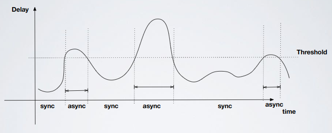
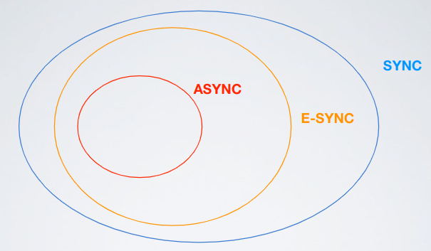
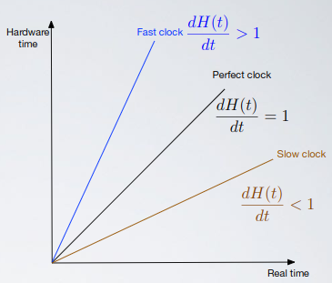
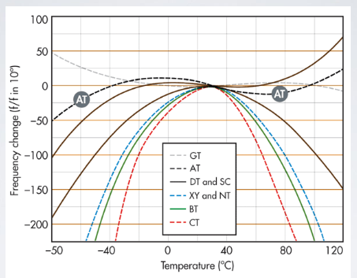
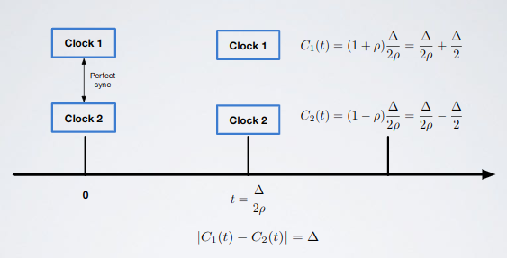
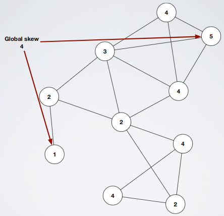
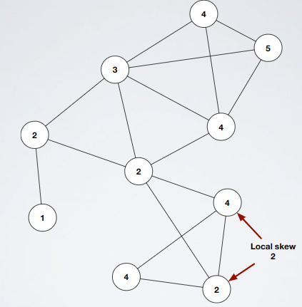

# Time - Part 1

- Time models: Asynchronous, Synchronous and Eventually Synchronous
  - Asynchronous
    - Definition
      - No Global-clock
      - No Bound on message delays
      - Local-computational steps (Exec) happen at unpredictable time (scheduler)
    - Pros and cons
      - Models everything
      - Cons: agreement (agreement problem) impossible and a lot of other things
  - Synchronous 
    - Definition
      - Delays are bounded
      - You can synchronize clocks (up-to a certain precision)
      - You can assume that local execution steps happen at certain predetermined interval, and that they take bounded time
    - Pros and cons
      - Pros: almost everything is possible
      - Cons: Models restricted networks
  - Eventually Synchronous (partially synchronous): the internet
    - Definition
      - Initially asynchronous
      - There is a time, unknown to us, after which the system will be synchronous
    - Explanation
      - Real systems are synchronous _most of the time_, this means that the system oscillates between a synchronous state and an asynchronous one

          

          - Safety properties: must be held in synchronous and asynchronous periods because if those are violated they'll never recover
          - Liveness properties: held only in asynchronous period (or synchronous) because if it is not satisfied it is possible that this property could be satisfied in the future
  - Relationship: if an algorithm works in asynchronous systems then it will work also in eventually synchronous and synchronous but in general algorithms solvable in asynchronous systems are less than the ones solvable in synchronous systems

      

- Clock synchronization in synchronous systems
  - Why is synchronization important?
    - It is important because it gives an order to the events

        

  - Physical clocks
    - Computers
      - Local clock is obtained by the operating system by reading a local hardware clock which consists of an oscillator and a counting register that is incremented at every tick of the oscillator; looking at the register (and knowing the oscillator frequency) you can know how many seconds have passed
      - The system clock is a function of the hardware clock that uses some adjustment values $`\alpha`$ and $`\beta`$: $`C_{i}(t)=\alpha H_{i}(t) + \beta`$
    - Accuracy parameters
      - Drift rate: the hardware clock is inaccurate

          

          - Using adjustment values doesn't solve the problem because the inaccuracy of the hardware clock varies based on temperature, drift range changes in time

              

          - To solve this problem we keep drift rate limited to a bound of $`\rho > 0`$ (ex: $`10^{-5}`$ secs/sec): $`1 - \rho \le \frac{dH(t)}{dt} \le 1 + \rho`$
      - Skew: differences between two clocks (of different machines)
        - Skew, because of the drift rate, tends to increase

            

            - `Clock 1` = Fast clock
            - `Clock 2` = Slow clock

        - To fix this we need a protocol that periodically synchronizes the clocks
          - IMPORTANT: when synchronizing a clock is never a good idea to jump _backward_ in time (monotonicity) because it creates security issues; the solution is to freeze/slow down our clock
            - We slow down clocks hiding interrupts: we have to hide a number of interrupt equals to slowdown-time divided by the interrupt period
- UTC, Internal and External Clock Synchronization
  - Universal Time Coordinated (UTC): international standard, base of any international time measure
    - Atomic time: 1 second = time a cesium atom needs for 9192631770 state transitions
  - External vs Internal
    - Terms
      - $`S`$ = time source
      - $`C`$ = clocks
      - $`D`$ = bound
      - $`I`$ = each time interval
    - External synchronization: i synchronize myself with an external authoritative entity (UTC)
      - $`|S(t) - C_{i}(t)| < D`$ $`\forall i \in \{1,2,...,N\},\forall t \in I`$: clocks $`C_{i}`$ are accurate within the bound of $`D`$
    - Internal synchronization: a group of clocks synchronize with each other
      - $`|C_{i}(t) - C_{j}(t)| < D`$ $`\forall i,j \in \{1,2,...,N\}, \forall t \in I`$: clocks $`C_{i}`$, $`C_{j}`$ agree within the bound of $`D`$
    - Notes
      - Clocks that are internally synchronized are not necessarily externally synchronized
      - A set of processes $`P`$, externally synchronized within the bound of $`D`$, is also internally synchronized within the bound of $`2D`$
- Synchronization in complete graphs (by a time server)
  - Centralized time service
    - Request driven: Christian's algorithm
      - General information
        - External synchronization: use a time server that receives a signal from an UTC source
        - Works also in asynchronous systems
        - Is based on the measurement of message round trip times (RTTs)
        - Synchronization is reached only if RTTs are small with respect to the required accuracy
      - How it works
        - A process $`p`$ asks the current time through a message $`m_{r}`$ and receives $`t`$ in $`m_{t}`$ from $`S`$
        - $`p`$ sets its clock to $`t + T_{round}/2`$, $`T_{round}`$ is round trip time measured by $`p`$
      - Problems
        - A time server can crash
        - A time server can be attacked
        - ...
      - Accuracy
        - Cases
          1. Request fast but response slow
          2. Request slow but response fast
        - Total: $`\pm (RTT/2 - min)`$ where $`min`$ is the minimum delay
    - Broadcast based: Berkeley Unix algorithm
      - General information
        - Internal synchronization algorithm
        - Master-slave structure
      - How it works
        1. Gathering of all the clocks from other processes and computation of the difference
           1. The master process $`p_{m}`$ sends a message with a timestamp $`t_{1}`$ (local clock value) to each process of the system ($`p_{m}`$ included)
           2. When a process $`p_{i}`$ receives a message from the master, it sends back a reply with its timestamp $`t_{2}`$ (local clock value)
           3. When the master receives the reply message it reads the local clock ($`t_{3}`$) and computes the difference between the clocks.
        2. Computation of the correction
           - Master behavior
             1. Step above obtaining various $`\Delta p_{i}`$
             2. Computes the average $`avg`$ of all $`\Delta p_{i}`$ without considering faulty processes (process that has a clock which differ from the one of the master more than a given threshold)
             3. Computes the correction for each process (including faulty processes): $`adg_{p_{i}} = avg - \Delta p_{i}`$
           - Slave behavior
             - Each process receives the correction and applies it to the local clock; if the correction is a negative value the clock is slowed down
      - Accuracy
        - Depends on the maximum round-trip time: the master does not consider clock values associated to RTT grater than the maximum one
        - Fault tolerance
          - If the master crashes another master is elected
          - It is tolerant to arbitrary behavior (ex. slaves that send wrong values)
  - Distributed time service (Network Time Protocol, NTP)
    - General information
      - Scalable
      - Reliability by mean of redundant servers and paths
    - How it works
      - Is a hierarchy of servers that use christian-like approach
    - Global Skew VS Local Skew
      - Global skew: maximum possible skew between two nodes in a graph $`G`$

          

      - Local skew: maximum possible skew between neighbors

          