# Time - Part 2

- Clocks
  - Causal relationships
    - Happened-before relation (by Lamport)
      - Syntax
        - $`\rarr_{i}`$: happened-before relation between events in a process $`p_{i}`$ (ex: $`e_{0} \rarr_{0} e_{1}`$)
        - $`\rarr`$: happened-before relation between any pair of events (could also be different processes)
      - Explanation
        1. Local ordering: two events occurred at some process $`p_{i}`$ happened in the same order as $`p_{i}`$ observes them ($`\exist p_{i} | e \rarr_{i} e'`$)
        2. Send-receive ordering: when $`p_{i}`$ sends a message $`m`$ to $`p_{j}`$ the send event $`send(m)`$ happens before the receive event $`receive(m)`$ ($`\forall m, send(m) \rarr receive(m)`$)
        3. Transitivity: $`\exist e_{2}: (e_{1} \rarr e_{2}) \land (e_{2} \rarr e_{3}) \space then \space e_{1} \rarr e_{3}`$

        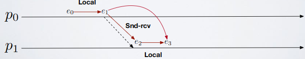

    - Concurrency
      - If $`e_{4}`$ and $`e_{3}`$ are not in happened-before relation then they are concurrent ($`e_{4} || e_{3}`$); for any two events $`e_{x}`$ and $`e_{y}`$ in the execution history of a distributed system, either $`e_{x} \rarr e_{y}`$, $`e_{y} \rarr e_{x}`$ or $`e_{y} || e_{x}`$

        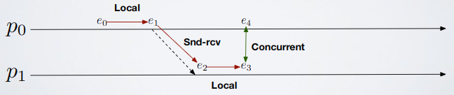

      - Dumb how to: if in a graph you can link two events with a path then they're not concurrent, else they are
  - Scalar/Logical/Lamport clock: if $`e \rarr e' \space then \space L(e) < L(e')`$
    - Explanation
      1. Each process $`p_{i}`$ initializes its logical clock $`L_{i} = 0`$
      2. Then
         - Send: when $`p_{i}`$ sends a message `m`
           1. Creates an event `send(m)`
           2. Increases $`L_{i}`$
           3. Timestamps `m` with $`t = L_{i}`$ 
         - Receive: when $`p_{i}`$ receives a message `m` with timestamp `t`
           1. Updates its logical clock $`L_{i} = max(t, L_{i})`$
           2. Produces an event `receive(m)`
           3. Increases `L`
    - Demonstration: if $`e \rarr e'`$ then there's a path that connects those two events, so the logical clock never goes back 
    - Limits
      - Not guaranteed: if $`L(e) < L(e') \space then \space e \rarr e'`$
        - It is not possible to determine, analyzing only scalar clocks, if two events are concurrent or correlated by the happened-before relation
        - Solution: Vector clock
    - Application: Lamport's mutual exclusion
  - Vector clock
    - Properties
      - If $`e \rarr e' \space then \space L(e) < L(e')`$
      - If $`L(e) < L(e') \space then \space e \rarr e'`$
    - Formal explanation: $`L(e_{i}) > L(e_{j}) \space if \space and \space only \space if \space \forall k: L(e_{j})_{History_{k}} \subseteq L(e_{i})_{History_{k}} \land \exist x:L(e_{j})_{History_{x}} \subset L(e_{i})_{History_{x}}`$
      - $`L(e)`$ is a history of events

          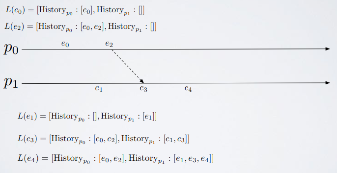

      - Receive
        1. Check for all histories whether the message contains a newer version of them (longer)
        2. If so adopt it
        3. Append the receive event to you history
    - Engineer explanation: $`L(e_{i}) > L(e_{j}) \space if \space and \space only \space if \space \forall k \in [0, n - 1]: L(e_{j})_{k} \le L(e_{i})_{k} \exist x: L(e_{j})_{x} < L(e_{i})_{x}`$
      - Different histories for a same process CAN'T exist 

        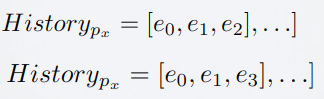

        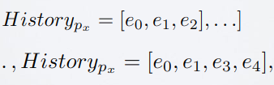

      - So $`History_{x} \subset History_{x}' \rarr History_{x} \space is \space a \space proper \space prefix \space of \space History_{x}'`$
      - So $`History_{x} \sub History_{x}' \rarr len(History_{x}) < len(History_{x}')`$
      - So: 

        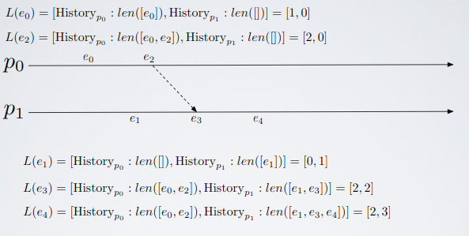

    - Final summary
      - Definition: $`e \rarr e' \lrArr V(e) < V(e')`$
        - A vector clock for a set of $`N`$ processes is an array of $`N`$ integer counters
          - Each process $`p_{i}`$ maintains a vector clock $`V_{i}`$ and timestamps events inside of it
          - A vector clock is attached to message $`m`$ (we attach an array of integers)
      - How it works
        1. Each process $`p_{i}`$ initializes its clock $`V_{i}`$: $`V_{i}[j] = 0 \forall j \in \{1,...,N\}`$
        2. $`p_{i}`$ increases $`V_{i}[i]`$ by $`1`$ when it generates a new event: $`V_{i}[i] = V_{i}[i] + 1`$
        3. When $`p_{i}`$ sends a message $`m`$
           1. Creates an event $`send(m)`$
           2. Increases $`V_{i}`$
           3. Timestamps $`m`$ with $`t = V_{i}`$
        4. When $`p_{i}`$ receives a message $`m`$ containing timestamp $`V_{t}`$
           1. Updates its logical clock: $`V_{i}[j] = max(V_{t}[j],V_{i}[j]) \forall j \in \{1,...,N\}`$
           2. Generates an event $`receive(m)`$
           3. Increases $`V_{i}`$
      - Properties
        - $`V = V' \lrArr V[j] = V'[j] \forall j \in \{1,...,N\}`$
        - $`V \le V' \lrArr V[j] \le V'[j] \forall j \in \{1,...,N\}`$
        - $`V < V' \lrArr V \le V' \land \exist j \in \{1,...,N\} | V[j] < V'[j]`$
      - Application: casual broadcast
    - Examples

        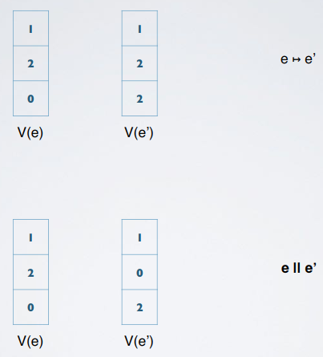

        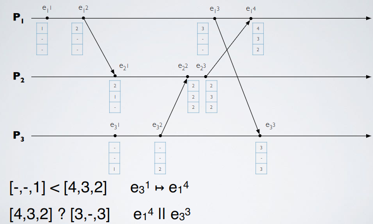

- Algorithms using time
  - FIFO link
    - Events: same as Fair-lossy link
    - Properties
      - SL1 (Stubborn-delivery)
      - FL3 (No creation)
      - FIFO: if a process $`p`$ delivers $`m`$ before $`m'`$, then $`m`$ was sent before $`m'`$
    - Visual concept

        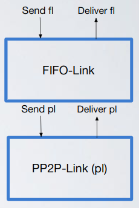

    - Algorithm
      ```
      upon event Init
        Pending:=∅ // Messages that have been received but are out of order
        seq:=0 // Sequence number of the messages
        del_seq:=0 // Sequence number of the last message delivered

      upon event Send fl(〈pd,m〉) // pd = process destination
        Send perfect(pd,< m,seq >)
        seq=seq+1
        
      // Every time i deliver a message i add this to the Pending set
      upon event Delivery from perfect(〈ps,< m,seq >〉) // ps = process source
        Pending=Pending ∪ {〈ps,< m,seq >〉}
      
      // (4)
      // Triggered if in Pending set exists a message that has send_seq = del_seq
      upon event ∃〈ps,< m,send_seq >〉∈ Pending such that send_seq=del_seq
        Delivery FL(ps,m) 
        Pending=Pending-{〈ps,< m,send_seq >〉}
        del_seq=del_seq+1
      ```
    - Formal proof
      - FIFO: proof by contradiction
        - Suppose `p` delivers `m'` and then `m` even if `m` was sent before `m'` (`timestamp(m) < timestamp(m')`)
        - Let `t` be the instant at which `p` delivers `m'`, this implies that `del_seq = timestamp(m')` (4)
        - Absurd, for `del_seq` to be equal to `timestamp(m')` we should have had `del_seq = timestamp(m)` (`del_seq` grows by one for each delivery)
    - Exercises
      - [Exercise 2](../../ex/time/ex2.md)
  - Lamport's mutual exclusion (NO CRASH TOLERANT)
    - Events
      - Request: requests access to Critical Section (CS), from upper layer
      - Grant: grant the access to CS, to upper layer
      - Release: release the CS, from upper layer
    - Properties
      - Mutual Exclusion: at any time `t`, only one process is inside the CS
      - Liveness: if a process `p` requests access, then it eventually (sooner or later) enters the CS
        - When a process wants to enter the CS it sends a request message to all the other
        - An history of the operations is maintained using Scalar Clocks
      - Fairness: if the request of process `p` happens before the request of process `q`, then `q` cannot access the CS before `p`
    - Visual concept

        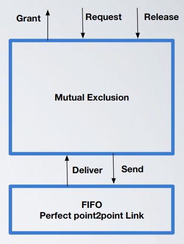

    - Algorithm 
      ```
      upon event Init
        // Requests: contains requests by you or someone in general
        // Acks: contains acks
        Requests=Acks=∅
        scalar_clock=0
        my_req=⊥ // ⊥ = nothing, my current pending request
        Π={p0,p1,...,pn-1} // Processes set

      // Request access to CS from upper layer  
      upon event Request
        scalar_clock=scalar_clock+1
        // ts = timestamp, i = my id
        my_req=(REQ, ts=<i,scalar_clock >) // Create request message
        // Send a REQ containing my ID (i) and ts (scalar_clock)
        // to all processes including yourself
        for all pj ∈ Π do
          Send FIFOPerfectLink(pj,my_req)
            
      // Release CS from upper layer
      upon event Release
        Requests=Requests-{req_msg}
        scalar_clock=scalar_clock+1
        for all pj ∈ Π do
          Send FIFOPerfectLink(pj,(RLS, ts=<i,scalar_clock >))

      // Check if you can access the CS    
      // ts(x)<ts(y):
      //   [when scalar_clock of x is less than the one of y]
      //   or
      //   [they are equal and the id that sent x is less than the id that sent y]
      // (if clocks are equal the one that win is the one with lower id)
      // Remember: timestamp != logical clock, timestamp = id + logical clock
      upon event [∄ req ∈ Requests:ts(req)<ts(my_req)] ∧
          [∀ p ∈ Π: ∃ m ∈ Acks|ts(m)>ts(my_req)] ∧ sender(m)=p
        trigger event Granted
        
      upon event Deliver Message(m)
        scalar_clock=max(clock(m),scalar_clock)+1
        if m is a REQ then // Send an ACK with scalar_clock + 1
          Request_set=Request_set ∪ {m}
          scalar_clock=scalar_clock+1
          Send FIFOPerfectLink(sender(m),(ACK, ts=<i,scalar_clock >))
        else if m is a ACK then // Receive an ACK
          Acks=Acks ∪ {m}
        else if m is a RLS ∧ ∃ req ∈ Request_set: sender(req)=sender(m) then
          Requests=Requests-{req}
      ```
    - Formal proof
      - Mutual exclusion: proof by contradiction
        - Assume that both $`p_{i}`$ and $`p_{j}`$ enter the CS (i < j)
        - You cannot enter CS if you have not received request ACKs from everyone, and such ACKs happened after your request
        - Both the processes have received an ACK from any other process and each `my_req` is the smallest in the respective queue: absurd since request are ordered (also by id)
      - Fairness: proof by contradiction
        - Suppose $`p_{i}`$ enters before $`p_{j}`$, even if $`(req,p_{i})`$ happened after $`(req,p_{j})`$
        - Since $`(req,p_{j})`$ happens before $`(req,p_{i})`$ we have $`ts((req,p_{j}))< ts((req,p_{i}))`$ so $`(req,p_{i})`$ is not the request with minimal timestamp in the set of $`p_{i}`$
      - Liveness: proof made by me (NOT SURE)
        - If a process `p` requests to enter the CS then its request will be added to the `Requests` set; since requests are ordered and all the requests in the `Requests` set will be evaluated (because of the structure of the algorithm) sooner or later the request of the process `p` will be satisfied
    - Example

        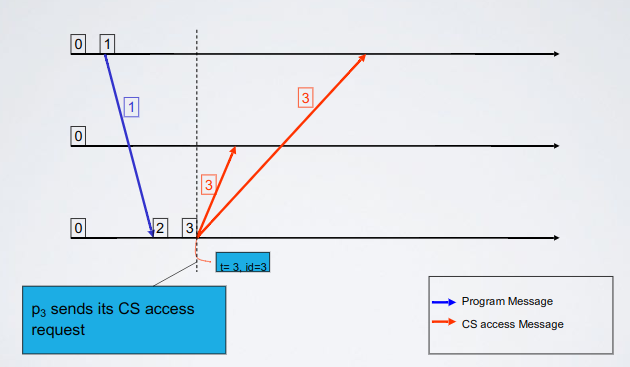

        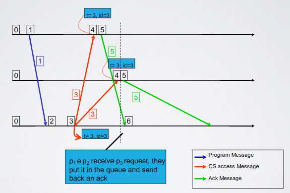

        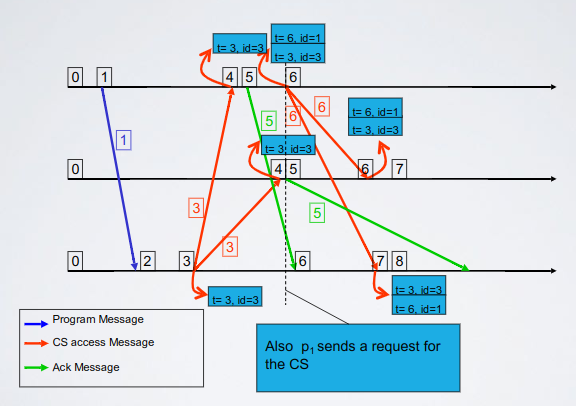

        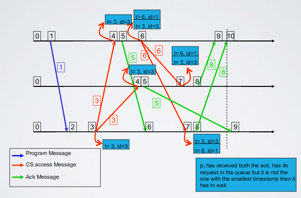

        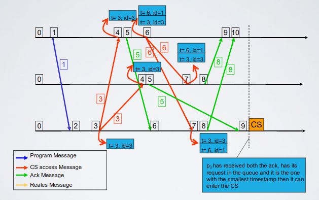

        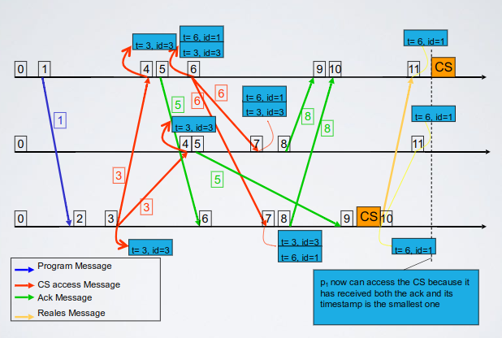

    - Exercises
      - [Exercise 1](../../ex/time/ex1.md)
