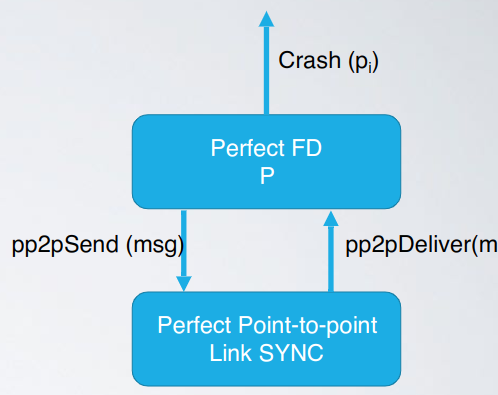
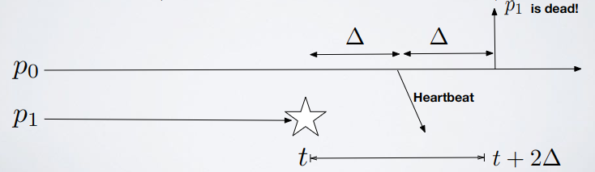
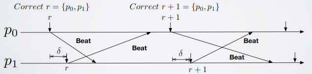
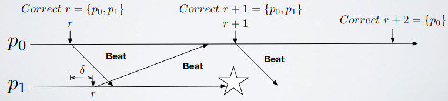
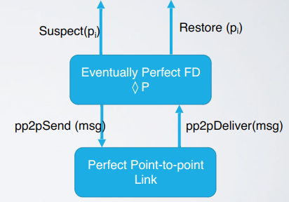
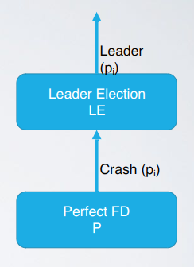
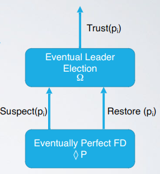
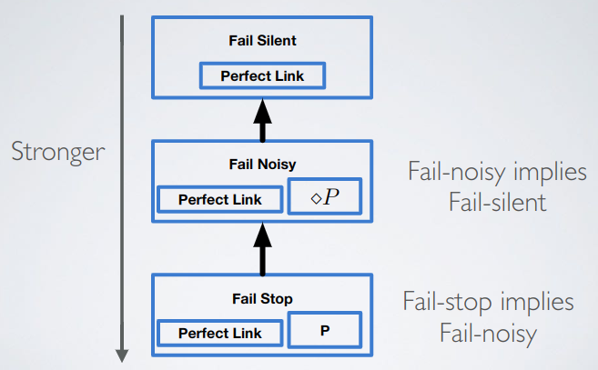
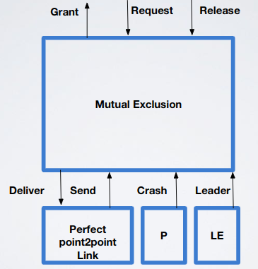

# Time - Part 3

- Failure detector
  - Abstraction: software module to be used together with process and link abstractions
    - Encapsulates timing assumptions of a either eventually/partially synchronous or fully synchronous system
    - The purpose of this module is to detect processes that crashed (only work for Crash Failures)
    - The stronger the timing assumption are, the more accurate the information provided by a failure detector will be (eventually synchronous assumptions are weaker than synchronous)
  - Properties
    - Accuracy: ability to avoid mistakes in the detection
      - Gives bound on wrong detections (false positive/false negative)
    - Completeness: ability to detect all failures
      - If the failure detector is able or not to detect all the failures that happen in the system
  - Basic concept: Pinging (send a message, wait for response, if no response then the destination is dead)
  - Types
    - Perfect (P)
      - System model
        - Synchronous
        - Crash failures (no byzantine)
        - Perfect Synchronous Point2point link: Perfect Point2point + synchronous delivery (if a message `m` is sent at time `t`, `m` is received by at most `t + max_delay`)
      - How: use clock and bounds of the synchrony model to infer if a process has crashed
      - Events
        - Crash:`〈P,Crash|p〉`, detects that process `p` has crashed
      - Properties
        - PFD1 (Strong completeness, liveness): eventually, every process that crashes is permanently detected by every correct process; so this means that a crash can be detected by different processes in different times
        - PFD2 (Strong accuracy, safety): if a process `p` is detected by any process, then `p` has crashed
      - Visual concept

          

      - Algorithm
        ```
        // Hartbeat = Ping

        upon event〈P,Init〉do
          alive:=Π; // All the processes are alive
          detected:=∅; // Set fo process you detect have crashed
          starttimer(∆); // Set timeout
         
        upon event〈Timeout〉do
          forall p ∈ Π do // For every process
            // Check if is not alive and not crashed
            if (p !∈ alive) ∧ (p !∈ detected) then 
              // Add it to the detected (crashed) set
              detected:=detected ∪ {p};
              trigger〈P,Crash|p〉;
            // Send to process p a ping request
            trigger〈pl,Send|p,[HEARTBEATREQUEST]〉;
          alive:=∅;
          starttimer(∆);
          
        // When you receive a ping request send a reply
        upon event〈pl,Deliver|q,[HEARTBEATREQUEST]〉do
          trigger〈pl,Send|q,[HEARTBEATREPLY]〉;
        
        // When you receive a ping reply from process p add it to the alive set
        upon event〈pl,Deliver|p,[HEARTBEATREPLY]〉do
          alive:=alive ∪ {p}
        ```
      - Formal proof
        - PFD1 (Strong completeness, liveness)
          - Assume `p1` crashes at time `t`, then  `p0` detects it at most by time `t + 2*delta`
            - At time `t + delta` (at most) `p0` sends an heartbeat request 
            - At time `t + 2*delta` `p0` does not receive the heartbeat reply

              

        - PFD2 (Strong accuracy, safety): proof by contradiction
          - Assume $`2 \times max\_delay \le \Delta`$ to accommodate an entire RTT request/reply
          - If `p` is detected faulty but it was alive, then either:
            - My `hearthbeatREQ` did not reached it by the timeout; impossible because i have an entire `∆` of time and my request takes at most `max_delay` which is a lot less
            - Its `hearthbeatREPL` did not reached me by timeout; impossible because i have an entire `∆` of time and my request takes at most `max_delay` which is a lot less
      - Number of messages: $`2n^{2}`$
    - Round-based (an improvement of the perfect failure detector)
      - Improvement: cut the messages by half, "In synchronous networks silences are expressive" - N. Santoro
        - Suppose to have clock synchronizer with global skew `δ`, and synchronous link with `min_delay > δ` (so this means that we are synchronized)
        - This system is round-based; rounds are long a time `t` and they are synchronized so if for a process `pn` is round `1` then for a process `pj` is round `1` and so on
      - Algorithm
        ```
        // BEAT = "i'm alive"

        upon event Init
          Cv  // Synchronyzer's clock, always synched between everyone
          T  // Round length: T > 2*(max_delay + δ)
          Corrects:={p0,p1,p2,...,pn}  // Corrects processes
          RoundAlive:=Corrects  // First time alive
          r:=-1  // Initial round value
          
        // Actions to execute at each new round
        // "When the clock is at k*round_lenght where k ∈ N+"
        upon event Cv=kT for some k ∈ N+
          r=r+1
          // For each correct process which is not in RoundAlive trigger crash
          for all pj ∈ Corrects-RoundAlive do
            Corrects=Corrects-{pj}
            trigger〈Crash|pj〉
          RoundAlive={pi}  // Reset RoundAlive
          // For every correct process send BEAT
          for all pj ∈ Corrects do
            Send(<pi,BEAT>)
            
        // When you receive the BEAT of someone then it is alive at that round
        upon event Delivery(〈pj,BEAT〉)
          RoundAlive=RoundAlive ∪ {pj}
        ```

        

        

      - Formal proof
        - Basic lemma: if I send a `BEAT` to `p` when my round number shows `r` then the beat reaches `p` when its round number shows `r`
          - By the algorithm, I send my `BEAT` as soon as my round is `r`
          - By the bounded skew of the clock, if time `t` is the first time at which my round number is `r`, then `p` will be at round `r` by at most `t + δ` 
          - `p` stays in round `r` at least until `t - δ + T = t - δ + 2δ + 2max_delay > t + δ + max_delay`
          - By the delay of the link, my `BEAT` reaches `p` in the interval `[t + δ, t + max_delay]`, so the lemma is verified
        - PFD1 (Strong completeness, liveness): if `p` dies, I will not receive the `BEAT` and I will signal it
        - PFD2 (Strong accuracy, safety): if I do not receive the expected `BEAT` from `p` then the only possible reason is that `p` did not send it; therefore `p` is dead
      - Number of messages: $`n^{2}`$
      - Notes
        - Synchronous = round-based
          - An alternative way to see synchronous systems is to imagine time divided in logical slots, the so called round
          - Synchrony assumptions are abstracted by assuming
            - Processes switch rounds exactly at the same time
            - If a correct process send a message to a set of processes at the beginning of round `r`, the messages will reach all correct processes in the set by the end of round `r`
        - What happens if I decrease `∆`?
          - Simply there could be false positives
    - Eventually perfect (◊P, ◊ = sooner or later)
      - System model
        - Partial/eventually synchrony
        - Crash failures
        - Perfect point-to-point links
      - High point of view
        - There is a (unknown) time `t` after that crashes can be accurately detected
        - Before `t` the systems behaves as an asynchronous one
          - The failure detector makes mistakes in that periods assuming correct processes as crashed
          - The notion of detection becomes (I suspect that someone crashed)
      - Events
        - Suspect: `〈◊P,Suspect|p〉`, notifies that process `p` is suspected to have crashed
        - Restore: `〈◊P,Restore|p〉`, notifies that process `p` is not suspected anymore
      - Properties
        - Suspected property: take two correct processes, `p1` and `p2` and let `suspected1` and `suspected2` be the respective sets; there is a time `t` (stabilization time), after which `suspected1=suspected2`
          - EPFD1 (Strong completeness): eventually, every process that crashes is permanently suspected by every correct process
          - EPFD2 (Eventual strong accuracy): eventually, no correct process is suspected by any correct process
      - How it works
        - Use timeouts to suspect processes that did not sent expected messages
        - A suspect may be wrong, a process `p` may suspect another one `q` because the chosen timeout was too short
        - ◊P is ready to change its judgment as soon as it receives a message from `q` (updating also the timeout value)
        - If `q` has actually crashed, `p` will not change its judgment anymore because `q` will not send to `p` new messages
      - Visual concept

          

      - Algorithm
        ```
        upon event〈◊P,Init〉do
          alive:=Π;  // Everyone is alive
          suspected:=∅;  // Nobody is suspected
          delay:=∆;
          starttimer(delay);
          
        upon event〈Timeout〉do
          // Only works when the system becomes synchronous
          if alive ∩ suspected != ∅ then  // (1)
            delay:=delay+∆;
          forall p ∈ Π do
            if(p !∈ alive)∧(p !∈ suspected) then  // (2)
              suspected:=suspected ∪ {p};
              trigger〈◊P,Suspect|p〉;
            else if(p ∈ alive)∧(p ∈ suspected) then  // (3)
              suspected:=suspected-{p};
              trigger〈◊P,Restore|p〉;
            trigger〈pl,Send|p,[HEARTBEATREQUEST]〉;  // (4)
          alive:=∅;
          starttimer(delay);

        // Ping request handler
        upon event〈pl,Deliver|q,[HEARTBEATREQUEST]〉do
          trigger〈pl,Send|q,[HEARTBEATREPLY]〉;
          
        // Ping reply handler (5)
        upon event〈pl,Deliver|p,[HEARTBEATREPLY]〉do
          alive:=alive ∪ {p};
        ```
        - Core of the algorithm: if for example a process `p` satisfy the condition `(2)` and then I send the ping request `(4)` to it and I receive the response `(5)`, `p` will be added to alive set and then condition `(2)` will be satisfied; later also condition `(3)` will be satisfied
        - Note: pings aren't numbered so also an old ping is valid, in this algorithm there aren't timestamps
      - Formal proof
        - EPFD1 (Strong completeness): if a process crashes, it will stop sending messages; therefore the process will be suspected by any correct process and no process will revise the judgement
        - EPFD2 (Eventual strong accuracy)
          - After time `t` the system becomes synchronous so after that time a message sent by a correct process `p` to another one `q` will be delivered within a bounded time (the time is `MAX_DELAY` unknown to us)
          - If `p` was wrongly suspected by `q`, then `q` will revise its suspicious and increase its delay
          - If the new delay is less than `MAX_DELAY`, eventually `q` suspects again `p` and then it corrects again its delay
          - After a finite number of errors the delay of `q` will be greater than `MAX_DELAY` 
          - I think: the thing about `MAX_DELAY` means that if the `RTT` of a process is greater than `MAX_DELAY` then this process is considered as crashed and that is OK!
        - Suspected property: proof by contradiction
          - After time `t` suppose exists a `p` in `suspected1` but not `suspected2`
            - If `p` is correct this violates the eventual strong accuracy
            - If `p` is crashed this violates the strong completeness
      - Exercises
        - [Exercise 3](../../ex/time/ex3.md)
    - Leader election: perfect that reports a process that is alive
      - Events
        - Leader, `〈le,Leader|p〉`: indicates that process `p` is elected as leader
      - Properties
        - LE1 (Eventual detection, liveness): either there is no correct process, or some correct process is **eventually** elected as the leader
        - LE2 (Accuracy, safety): if a process is leader, then all previously elected leaders have crashed
      - Visual concept

          

      - Algorithm
        ```
        upon event〈le,Init〉do
          suspected:=∅;
          leader:=⊥;  // Set to null (⊥ = null)
        
        // (2)
        upon event〈P,Crash|p〉do
          suspected:=suspected ∪ {p};
        
        // maxrank() returns the process with lowest ID
        upon leader != maxrank(Π-suspected) do
          leader:=maxrank(Π-suspected);
          trigger〈le,Leader|leader〉;
        ```
      - Formal proof
        - LE1 (Eventual detection, liveness): from the strong completeness of P (2)
        - LE2 (Accuracy, safety): from the strong accuracy of P and the total order on the ranks (IDs) of processes
    - Eventual leader election (Ω): the failure detector is not perfect
      - Events
        - Trust, `〈Ω,Trust|p〉`: indicates that process `p` is trusted to be leader
      - Properties: eventually correct processes will elect the same correct process as their leader (stabilization)
        - ELD1 (Eventual accuracy, liveness): there is a time after which every correct process trusts some correct process (not the same)
        - ELD2 (Eventual agreement, liveness): there is a time after which no two correct processes trust different correct processes (everyone trust the same process)
      - Visual concept

          

      - Algorithm
        ```
        upon event〈Ω,Init〉do
          suspected:=∅;
          leader:=⊥; // Null
          
        upon event〈◊P,Suspect|p〉do
          suspected:=suspected ∪ {p};
          
        upon event〈◊P,Restore|p〉do
          suspected:=suspected - {p};
          
        upon leader != maxrank(Π-suspected) do
          leader:=maxrank(Π-suspected);
          trigger〈Ω,Trust|leader〉
        ```
      - Formal proof
        - ELD1 (Eventual accuracy, liveness): by the strong completeness of the Failure Detector we have that eventually suspected set contains all the crashed processes so `Π-suspected` contains only correct processes (or is empty)
        - ELD2 (Eventual agreement, liveness): for any pair of correct processes, their suspected sets eventually stabilizes to the same content (by the property of the Failure Detector); if sets are equal `Π-suspected` returns the same ID on both processes
  - Models in which failure detectors are used

      

      - Problems solvable in fail stop include problems solvable in fail noisy which include problems solvable in fail silent
      - Analogy
        - Fail silent $`\approx`$ Asynchronous
        - Fail noisy = Eventually synchronous
        - Fail stop = Synchronous
          - Fail stop is a subcategory of synchronous systems so problems solvable in fail stop are also solvable in synchronous systems but not vice-versa
  - Applications
    - Using P to make Lamport’s Mutual Exclusion fault tolerant
      - Events: same
      - Properties
        - Mutual Exclusion: at any time `t`, at most one non-crashed process is inside the `CS`
        - Liveness: if a correct process `p` requests access, then it eventually enters the `CS`
        - Fairness: if a correct process `p` requests access before a process `q`, then `q` cannot access the `CS` before `p`
      - Algorithm
        - Original algorithm (underlying problems)
          ```
          upon event Init
            // Requests: contains requests by you or someone in general
            // Acks: contains acks
            Requests=Acks=∅
            scalar_clock=0
            my_req=⊥ // ⊥ = nothing, my current pending request
            Π={p0,p1,...,pn-1} // Processes set

          // Request access to CS from upper layer  
          upon event Request
            scalar_clock=scalar_clock+1
            // ts = timestamp, i = my id
            my_req=(REQ, ts=<i,scalar_clock >) // Create request message
            // Send a REQ containing my ID (i) and ts
            // (scalar_clock) to all processes including yourself
            for all pj ∈ Π do
              Send FIFOPerfectLink(pj,my_req)
                
          // !!!CRITICAL: IF YOU CRASHED YOU CAN NOT RELEASE!!!
          // Release CS from upper layer
          upon event Release
            Requests=Requests-{req_msg}
            scalar_clock=scalar_clock+1
            for all pj ∈ Π do
              Send FIFOPerfectLink(pj,(RLS, ts=<i,scalar_clock >))

          // Check if you can access the CS    
          // ts(x)<ts(y):
          //   [when scalar_clock of x is less than the one of y]
          //   or
          //   [they are equal and the id that sent x is less than the id that sent y]
          //  (if clocks are equal the one that win is the one with lower id)
          // Remember: timestamp != logical clock, timestamp = id + logical clock
          // !!!CRITICAL (second condition): IF YOU CRASHED YOU CAN NOT ACK!!!
          upon event [∄ req ∈ Requests:ts(req)<ts(my_req)] ∧ [∀ p ∈ Π: ∃ m ∈ Acks|ts(m)>ts(my_req)]
            trigger event Granted
            
          upon event Deliver Message(m)
            scalar_clock=max(clock(m),scalar_clock)+1
            if m is a REQ then // Send an ACK with scalar_clock + 1
              Request_set=Request_set ∪ {m}
              scalar_clock=scalar_clock+1
              Send FIFOPerfectLink(sender(m),(ACK, ts=<i,scalar_clock >))
            else if m is a ACK then // Receive an ACK
              Acks=Acks ∪ {m}
            else if m is a RLS ∧ ∃ req ∈ Request_set: sender(req)=sender(m) then
              Requests=Requests-{req}
          ```
        - Patch version 1 (WRONG)
          ```
          upon event Init
            // Requests: contains requests by you or someone in general
            // Acks: contains acks
            Requests=Acks=∅
            scalar_clock=0
            my_req=⊥ // ⊥ = nothing, my current pending request
            Π={p0,p1,...,pn-1} // Processes set
            Crashed={}
                
          upon event Crash(process pj)
            Crashed=Crashed ∪ {pj}
            for all req ∈ Requests such that pj is the sender of req do 
              remove req from Requests
              
          upon event ∄ req ∈ Requests: [ts(req)<ts(myreq)] ∧
              [∀ p ∈ (Π-Crashed): ∃ m ∈ Acks|ts(m)>ts(my_req)]
            trigger event Granted
          ```
          - If you receive a request from `pj` after the crash detection you handle the request that will be in your queue blocking your requests forever
        - Patch version 2 (CORRECT)
          ```
          upon event Init
            Requests=Acks=∅
            scalar_clock=0
            my_req=⊥
            Π={p0,p1,...,pn-1}
            Crashed={}
                
          upon event Crash(process pj)
            Crashed=Crashed ∪ {pj}
            for all req ∈ Requests such that pj is the sender of req do 
              remove req from Requests
              
          upon event ∄ req ∈ Requests: [ts(req)<ts(myreq)] ∧
              [∀ p ∈ (Π-Crashed): ∃ m ∈ Acks|ts(m)>ts(my_req)]
            trigger event Granted

          upon event Deliver Message(m)
            if m is a REQ and the sender of m is not in Crashed then  // Handle request, else ignore it
              scalar_clock=max(clock(m),scalar_clock)+1
              Request_set=Request_set ∪ {m}
              scalar_clock=scalar_clock+1
              Send FIFOPerfectLink(sender(m),(ACK, ts=<i,scalar_clock >))
            else if m is a ACK then
              ...
          ```
    - Using PP2P, PFD and LE to make Lamport’s Mutual Exclusion simpler and fault tolerant

        

      - How it works
        - Process
          1. Use LE to elect a leader
          2. Ask the leader for CS with a request message
          3. The leader allows access to CS using FIFO order on requests
          4. When done release CS using a release message
          5. If the leader detects a crash of `p`
             - If `p` is not in CS, it removes the pending request of `p` (if any)
             - If `p` is in CS, it acts as `p` released the CS
        - Problem: what to do when a new leader is elected? The old leader was the only one to know who was in CS
          1. The new leader interrogates any process that has not been detected as faulty to know if is in CS
          2. When a new leader is elected processes send the old requests (if not satisfied) to the new leader
  - Exercises
    - [Exercise 4](../../ex/time/ex4.md)