# 6 - Total Ordering and Replicated State Machine

- Total ordering (TO)
  - Introduction
    - Problem to solve: clients are concurrent

        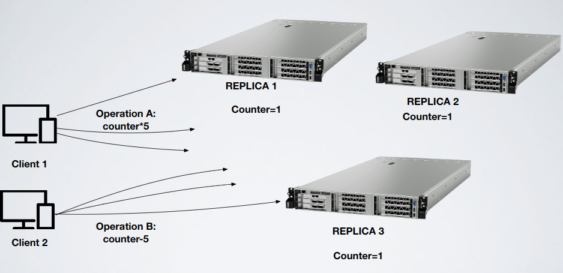

        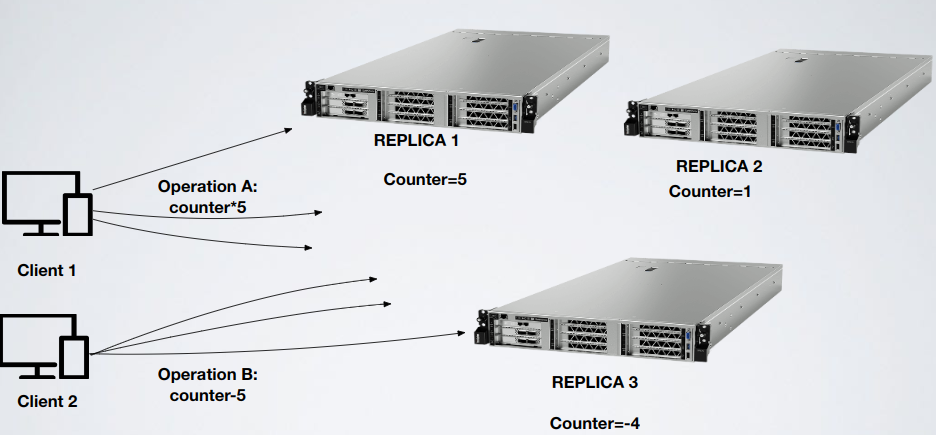

        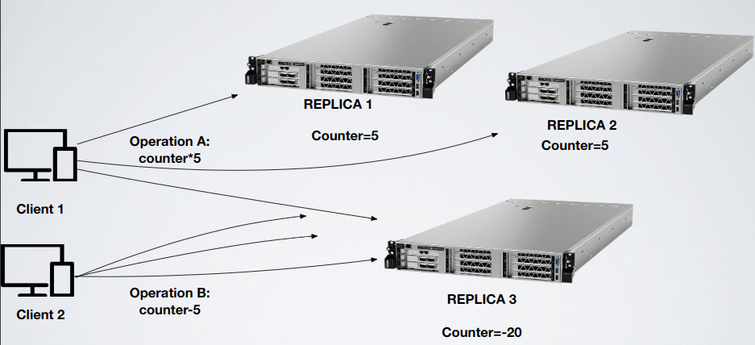

        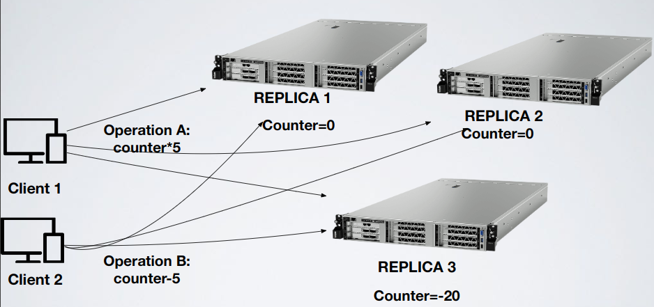

    - Solution: with total ordering this doesn't happen
  - General properties
    - Validity: messages sent by correct processes will eventually be delivered at least by correct processes
    - Integrity: no spurious or duplicate messages are delivered
    - Agreement: at least correct processes deliver the same set of messages
      - Uniform: if a process (correct or not) TODelivers a message `m`, then all correct processes will eventually TODeliver `m`
      - Non-uniform (regular): if a correct process TODelivers a message `m`, then all correct   processes will eventually TODeliver `m`
    - Order: at least correct processes deliver same messages in the same order
  - Note: total order doesn't imply causal or FIFO
  - Implementations
    - Regular
      - Events
        - Broadcast,`〈tob,Broadcast|m〉`: broadcasts a message `m` to all processes
        - Deliver,`〈tob,Deliver|p,m〉`: delivers a message `m` broadcast by process `p`
      - Properties
        - TOB1 (Validity): if a correct process `p` broadcasts a message `m`, then `p` eventually delivers `m`
        - TOB2 (No duplication): no message is delivered more than once
        - TOB3 (No creation): if a process delivers a message `m` with sender `s`, then `m` was previously broadcast by process `s`
        - TOB4 (Agreement): if a message `m` is delivered by some correct process, then `m` is eventually delivered by every correct process
        - TOB5 (Total order): let `m1` and `m2` be any two messages and suppose `p` and `q` are any two correct processes that deliver `m1` and `m2`; if `p` delivers `m1` before `m2`, then `q` delivers `m1` before `m2`
      - Visual concept

          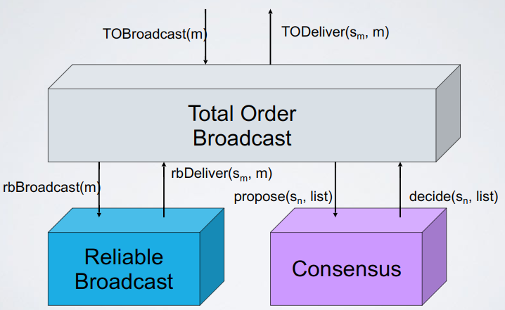

      - Explanation: using consensus for each value received we will deliver values in the same order of all processes; instead of using a single value we use list of values proposed by a process in every turn
      - Algorithm
        ```
        // IMPORTANT: this implementation does not imply FIFO order;
        // if a process sends m1 and then m2 this doesn't mean that 
        // m1 is delivered before m2, just that every process
        // will deliver messages with the same order

        upon event〈tob,Init〉do
          unordered:=∅;  // Set of messages to be ordered
          delivered:=∅;  // Already delivered messages
          round:=1;  // Round number
          wait:=FALSE;  // Synchronization
          
        // Broadcast send handler
        upon event〈tob,Broadcast|m〉do
          // Here i need broadcast because elsewhere
          // if for example i have two processes p1 and p2
          // it could be that the message chosen by the consensus
          // is always the one proposed by p1 blocking so p2
          // We could also use best effort broadcast
          trigger〈rb,Broadcast|m〉;
          
        // Delivery of broadcasted message (3)
        upon event〈rb,Deliver|p,m〉do
          if m !∈ delivered then
            unordered:=unordered ∪ {(p,m)}

        // If there's something in unordered set and
        // this is the first time i'm executing this
        upon unordered != ∅ ∧ wait=FALSE do
          wait:=TRUE;  // Used to trigger Propose just once per round
          // Initialize a new instance c.round (where round is round variable)
          // of consensus proposing the unordered set of messages
          // Unordered set could be different for every process (probably)
          trigger〈c.round,Propose|unordered〉;

        // Consensus decide handler
        // decided set will be the same for every process
        // (5)
        upon event 〈c.r,Decide|decided〉such that r=round do
          // For every element of decided set
          // (ordered, ordering is the same on every process) deliver element
          forall (s,m) ∈ sort(decided) do
            trigger〈tob,Deliver|s,m〉;
          delivered:=delivered ∪ decided;
          unordered:=unordered - decided;
          round:=round+1;
          wait:=FALSE;  // Unlock previous handler
        ```
      - Example

          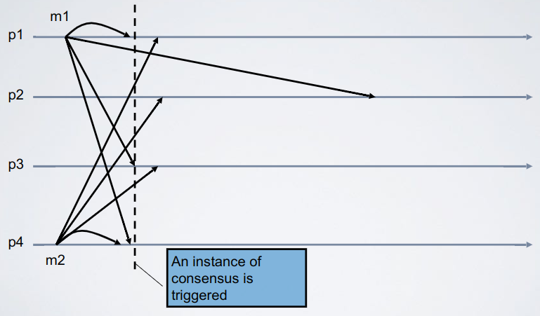

          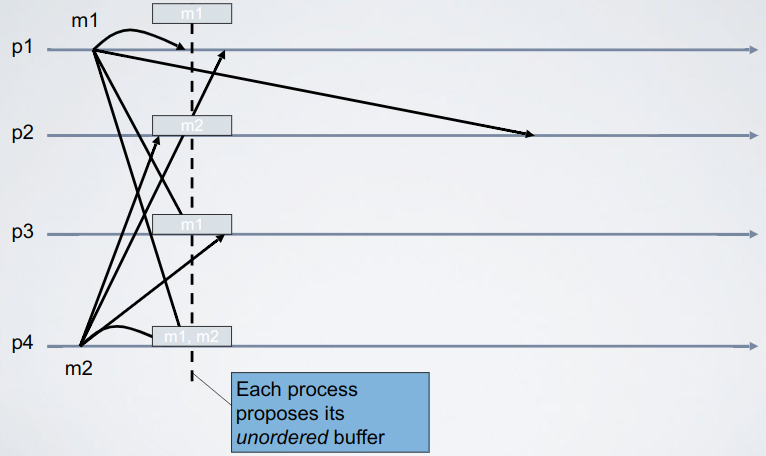

          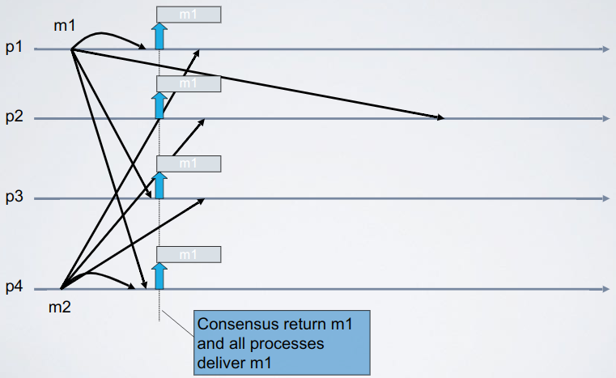

          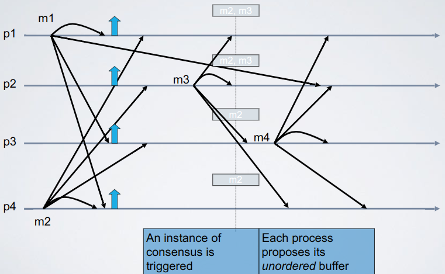

          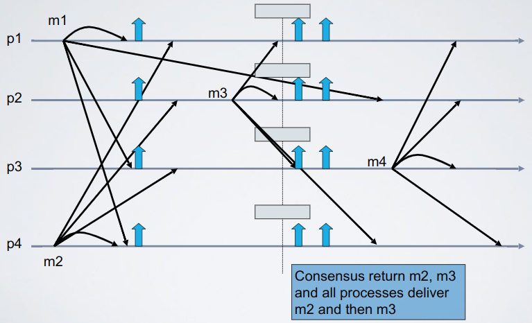
        
      - Formal proof
        - TOB3 (No creation): there are two points at which a message may be created
          - (3): impossible by no creation of reliable broadcast
          - (5): impossible by validity of consensus
        - TOB2 (No duplication): suppose by contradiction you deliver message `m` twice; you deliver it because it is in the decided of two different instances of consensus (`r` and `r'` with `r' > r`) else you can't because we are using only sets in the algorithm and a set can't contain two same objects
          - At round `r` you put `m` in delivered (and also other processes do this), and you remove it from unordered
          - If at `r'` you see `m` in decided then someone, let it `p`, triggered `< r', Propose, unordered>` with unordered containing `m`
          - But at the end of round `r`, `p` puts `m` in delivered and removes it from unordered, so it means it had to add it between the end of round `r` and the beginning of round `r'`
          - But unordered is guarded by delivered (3)
        - TOB4 (Agreement): suppose a correct process `p0` delivers `m` at round `r` then `m` is in decided of the consensus of round `r`
          - If `m` is not in the decided of the consensus of round `r` of a correct process `p1` we are violating consensus' agreement property, so `m` has to be in the decided of any correct process at round `r`
        - TOB1 (Validity): if you send message `m` you will deliver message `m` (same process)
        - TOB5 (Total order): two cases
           1. `m` and `m'` are delivered in the same round
              - They must be delivered in the same round on each pair of correct process (consensus' agreement) so the order is fixed by the deterministic function `sort()`
           2. `m` and `m'` are delivered in two different rounds `r` and `r'` on correct process `p`
              - Each other correct delivers them at the exact same round `r` and `r'` for the agreement of the consensus
    - Uniform
      - Events: same as regular
      - Properties
        - UTOB1–UTOB3: same as TOB1–TOB3 in regular
        - TOB4 (Uniform agreement): if a message `m` is delivered by some process (whether correct or faulty), then `m` is eventually delivered by every correct process
        - TOB5 (Uniform total order): let `m1` and `m2` be any two messages and suppose `p` and `q` are any two processes that deliver `m1` and `m2` (whether correct or faulty); if `p` delivers `m1` before `m2`, then `q` delivers `m1` before `m2`
      - Algorithm: same as regular but with uniform consensus
      - Example

          

          

          

          

          
        
      - Formal proof
        - TOB3 (No creation): there are two points at which a message may be created
          - (3): impossible by no creation of reliable broadcast
          - (5): impossible by validity of consensus
        - TOB2 (No duplication): suppose by contradiction you deliver message `m` twice; you deliver it because it is in the decided of two different instances of consensus (`r` and `r'` with `r' > r`) else you can't because we are using only sets in the algorithm and a set can't contain two same objects
          - At round `r` you put `m` in delivered (and also other processes do this), and you remove it from unordered
          - If at `r'` you see `m` in decided then someone, let it `p`, triggered `< r', Propose, unordered>` with unordered containing `m`
          - But at the end of round `r`, `p` puts `m` in delivered and removes it from unordered, so it means it had to add it between the end of round `r` and the beginning of round `r'`
          - But unordered is guarded by delivered (3)
        - TOB4 (Agreement): suppose a correct process `p0` delivers `m` at round `r` then `m` is in decided of the consensus of round `r`
          - If `m` is not in the decided of the consensus of round `r` of a correct process `p1` we are violating consensus' agreement property, so `m` has to be in the decided of any correct process at round `r`
        - TOB1 (Validity): if you send message `m` you will deliver message `m` (same process)
        - TOB5 (Total order): two cases
           1. `m` and `m'` are delivered in the same round
              - They must be delivered in the same round on each pair of correct process (consensus' agreement) so the order is fixed by the deterministic function `sort()`
           2. `m` and `m'` are delivered in two different rounds `r` and `r'` on correct process `p`
              - Each other correct delivers them at the exact same round `r` and `r'` for the agreement of the consensus

    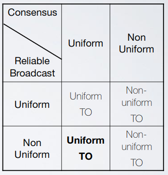

  - Final note: total order = consensus (more or less); with consensus you can implement total order and with total order you can implement consensus (yes, so you can implement total order also without using consensus but the result is an algorithm that satisfy consensus)
  - Exercises
    - [Exercise 1](../../ex/total_ordering/ex1.md)
    - [Exercise 2](../../ex/total_ordering/ex2.md)
- Software replication
  - Motivation
    - Fault tolerance: guarantees the availability of a service (also called object) despite failures
      - Assuming `p` the failure probability of an object `O`, `O`’s availability is `1-p`
      - Replicating an object `O` on `N` nodes and assuming `p` the failure probability of each replica, `O`’s availability is $`1-p^{n/k}`$ (`k` is algorithm dependent, is the number of replica that can fail)
  - System model

      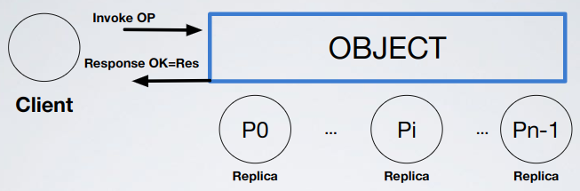

    - Processes (Client) interact with a set of objects `X` located at different sites
      - Each object has a state accessed trough a set of operations
      - An operation by a process `pi` on an object `x ∈ X` is a pair invocation/response
        - The operation invocation is noted `[x op(arg) pi]` where `arg` are the arguments of the operation `op`
        - The operation response is noted `[x ok(res) pi]` where `res` is the result returned
        - The pair invocation/response is noted `[x op(arg)/ok(res) pi]`
      - After issuing an invocation a process is blocked until it receives the matching response
    - In order to tolerate crash failures a logical object must have several physical replicas located at different sites of the distributed system
      - Replicas of an object `x` are noted `x1, x2, ... xN`
      - Invocation of replica `xj` located on site `s` is handled by a process `pj` also located on `s`
        - We assume that `pj` crashes exactly when `xj` crashes (so replicas and processes that control replicas are more or less the same thing)
      - Replication must be "transparent" to client processes
  - Consistency criteria: defines acceptable results returned by an operation
    - Types
      - Strong consistency
        - Sequential consistency
        - Linearizability: same as registers (remember linearization points)
          - Sufficient conditions
            - Atomicity: given an invocation `[x op(arg) pi]`, if one replica (faulty or correct) of the object `x` handles this invocation, then every correct replica of `x` also handles this invocation
            - Ordering: given two invocations `[x op(arg) pi]` and `[x op(arg) pj]` if two replicas handle both the invocations, they handle them in the same order
            - Blocking operations: the client does not see the result of an operation until at least one correct replica handled it
            - Note: a generic replicated object (deterministic) needs consensus to be implemented with linearizable semantic; consensus is sufficient to implement any generic replicated object
          - Replication techniques: note that `current_state = initial_state + list(all_commands)`
            - Passive replication (primary backup)

                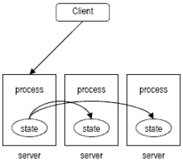

              - Replicas are partitioned in two sets:
                - Primary (just a single process)
                  - Receives invocations from clients and sends back the answers
                  - Given an object `x`, `prim(x)` returns the primary of `x`
                - Backup
                  - Interacts with `prim(x)` only
                  - Is used to guarantee fault tolerance by replacing a primary when crashes
              - In synchronous systems (with perfect FD)
                - No crashes
                  - Based on the implementation the primary process can update other processes:
                    - Sending the updated list of commands every time
                    - Sending just the new command
                    
                  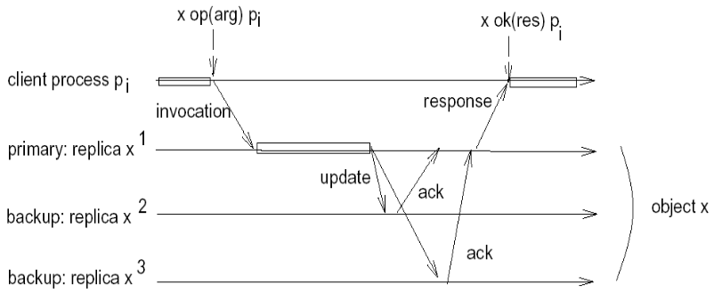

                - Crashes
                  - Cases: in all cases there is the need of electing a new leader (leader election)
                    1. Primary fails after receiving the answers of the update message
                       - Cases
                         1. Client does not receive the answer
                            1. Client retransmits the **same** request after a timeout
                            2. The new primary will recognize the request re-issued by the client as already processed and sends back the result without updating the replicas; requests have to be unique `(id_c,ts)`
                         2. Client receives the answer: it's ok, just leader election and everything goes well
                    2. Primary fails before sending update messages
                       1. Client does not get an answer and re-sends the request after a timeout
                       2. The new primary will handle the request as new
                    3. Primary fails while sending update messages and before receiving all the ACKs (some receive update, some not)
                       1. Primary dies and just `B1` receives `ADD` operation

                          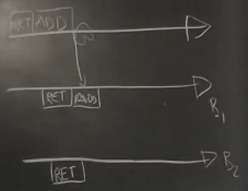

                       2. Leader election: the leader is the one with greatest length of commands list and lower `ID`

                          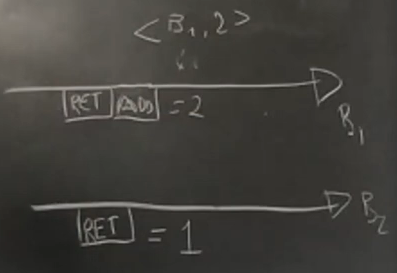

                       3. Before going on the new primary sends its list to all the backups and waits for ACKs

                          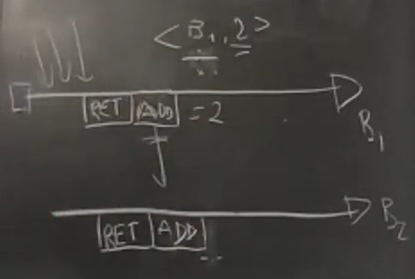

              - Pros and cons
                - Pros
                  - Easy to understand
                  - Works even if execution is non-deterministic (`getRand()`, `currentTimeMillis()`...) because you can do that only the primary executes non-deterministic operations and sends to backups `(operation,result)`
                  - New backups can be added in a relatively easy way
                  - Reads can be satisfied locally (directly on the primary)
                - Cons
                  - Delivering state change can be costly (if for example you send every time the full commands list), the client has to wait for a new primary (could take a while)
                  - Backups are just backups: you have computers that don't really do much
                  - A crash in the middle of the update is complex to solve in eventually synchronous systems
            - Active replication

                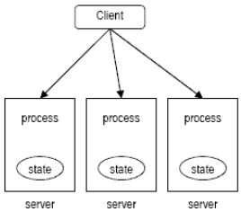

              - There is no coordinator, all replicas have the same role
              - Each replica is deterministic: if any replica starts from the same state and receives the same input, they will produce the same output
                - If each replica executes the same list of command, then the clients will receive the same response from all (non-faulty) replicas

              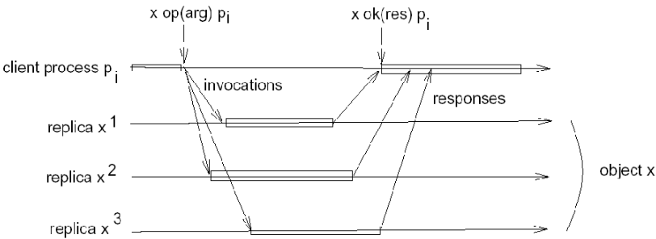

              - We use Total Order Broadcast (Uniform): through this we don't even need to handle manually failures because they are implied in UTOB
              - Pros and cons
                - Pros
                  - Crashes are handled directly in the protocol (UTOB)
                  - Can be adapted to tolerate `n/3-1` Byzantine replicas (will see later)
                  - Clients do not have to wait if a crash happens
                - Cons
                  - It is hard to implement non-deterministic operations
                  - Total order broadcast is generally expensive (not good if i have a lot of replicas)
                  - Reads cannot be local; a read has to go through the Total Order Broadcast because replicas could be not synchronized
      - Weak consistency
        - Causal consistency: similar to causal broadcast; if you do an operation on an object that depends on a certain thing you have seen then everyone that sees your operation will see also the thing that causally influenced you
  - Implementation: Raft, a consensus algorithm for replicated logs

      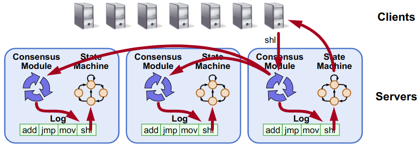

    - Raft works when we have minority of fails and the system is eventually synchronous
    - Server states
      - Leader (primary): handles all client interactions, at most `1` at a time
      - Follower (backup): completely passive, just backups
      - Candidate: used to elect a new leader; follower become a candidate if thinks that the leader is dead

      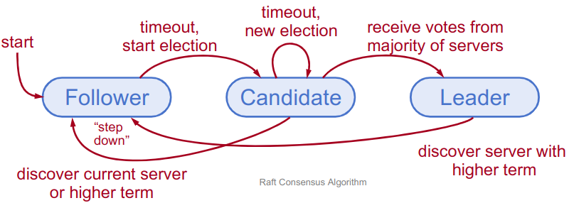

    - Time: divided in terms (like rounds)

        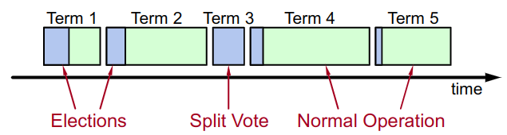

      - At most `1` leader per term
        - Each term ends when the leader seems dead
        - Every term so has two phases: election and (if election goes well) normal operation
        - Some terms have no leader (failed election)
      - Each server maintains current term value
      - Key role of terms: identify obsolete information
    - Election
      - How it works
        1. Servers start up as followers
        2. Leader must send heartbeats (empty `AppendEntries` RPCs) to maintain authority
        3. If `electionTimeout` elapses (timeout typically `100-500ms`) with no RPCs followers assume leader has crashed and start new election
        4. Increment current term
        5. Change to candidate state
        6. Vote for self
        7. Send `RequestVote` ("vote for me!") RPCs to all other servers, retry until either:
           - You win: receive votes from majority of servers
             - Become leader
             - Send `AppendEntries` heartbeat to all other servers
           - You lose: receive RPC from valid leader
             - Return to follower state
           - No-one wins election (election timeout elapses):
             - Increment term, start new election
      - Note
        - Safety: allow at most one winner per term
          - Each server gives out only one vote per term so two different candidates can’t accumulate majorities in same term
            - Someone wins

                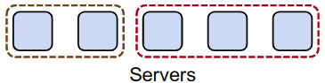

            - No one wins (problem, this could happen forever)

                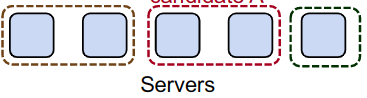

        - Liveness: some candidate must eventually win (to avoid the problem above)
          - Choose election timeouts randomly in `[T, 2T]`; one server usually times out and wins election before others wake up
          - Works well if `T >> broadcast time`
          - The system must be eventually-synchronous; if it was asynchronous implementing this timeout strategy would have not changed anything
    - Log structure

        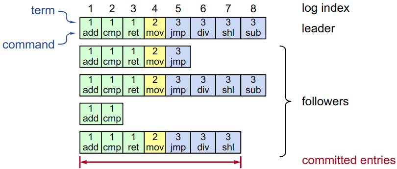

      - Log entry = index, term, command
      - Entry committed if known to be stored on majority of servers (+ SEE LOG CONSISTENCY BELOW, IMPORTANT)
        - When an entry is committed the leader executes the operation and returns the value to the client
    - Normal execution
      1. Client sends command to leader
      2. Leader appends command to its log
      3. Leader sends `AppendEntries` RPCs to followers
      4. Once new entry committed:
         1. Leader passes command to its state machine and returns result to client
         2. Leader notifies followers of committed entries in subsequent `AppendEntries` RPCs
         3. Followers pass committed commands to their state machines
      - Crashed/slow followers: leader retries RPCs
      - Performance is optimal in common case (leader is always the same): one successful RPC to any majority of servers
    - Log consistency
      - If log entries on different servers have same index and term:
        - They store the same command
        - The logs are identical in all preceding entries
      - If a given entry is committed, all preceding entries are also committed
      - `AppendEntries` consistency check: each `AppendEntries` RPC contains index and term of entry preceding new ones

          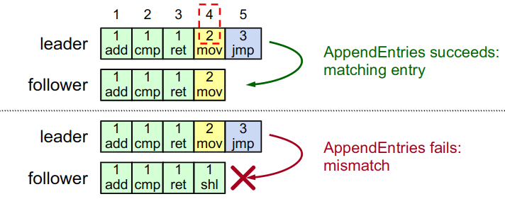

      - Consistency when leader changes 
        - Committed entries have to not be overwritten: if a leader has decided that a log entry is committed, that entry will be present in the logs of all future leaders

            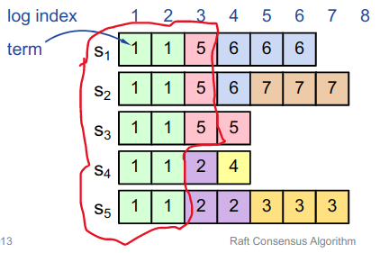

        - Picking the best leader
          - Sometimes you can’t tell which entries are committed

              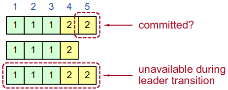

          - During elections, choose candidate with log most likely to contain all committed entries
          - Voting server `V` denies vote if its log is "more complete" `(lastTermV > lastTermC) || (lastTermV == lastTermC) && (lastIndexV > lastIndexC)`
        - IMPORTANT: when an entry is truly committed and can't be overwrote?
          1. Must be stored on a majority of servers
          2. At least one new entry from leader's term must also be stored on majority of servers
             - Bad: `S5` can be elected

                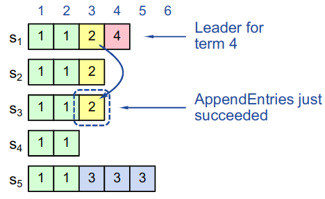

             - Good: `S5` can't be elected

                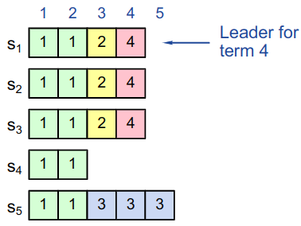

          - Note: in the last image if in index `5` would have been a term `4` element and this element would have been accepted by the majority there wouldn't have been problems (because we are talking about the same term)
        - Possible inconsistencies

            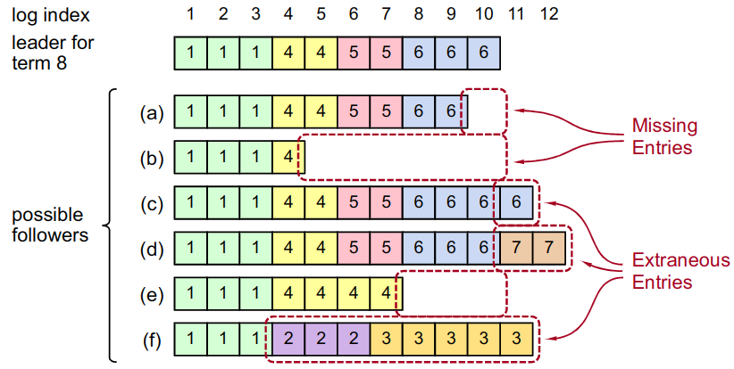

          - Repairing inconsistencies
            - Leader keeps `nextIndex` for each follower (index of next log entry to send to that follower), initialized to (`1` + leader’s last index)
            - When `AppendEntries` consistency check fails, decrement `nextIndex` and try again

                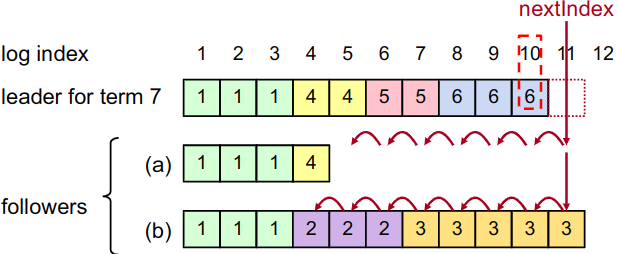

            - When follower overwrites inconsistent entry, it deletes all subsequent entries

                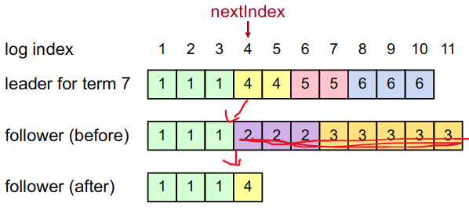

    - Neutralizing old leaders
      - Deposed leader may not be dead so they could attempt to commit log entries
      - Terms are used to detect stale leaders (and candidates)
        - Every RPC contains term of sender
        - If sender's term is older, RPC is rejected, sender reverts to follower and updates its term
        - If receiver's term is older, receiver reverts to follower, updates its term, then processes RPC normally
    - Client protocol
      - Send commands to leader: if leader unknown, contact any server; if contacted server not leader, it will redirect to leader
      - Leader does not respond until command has been logged, committed, and executed by leader's state machine
      - If request times out (e.g. leader crash) client reissues command to some other server, eventually is redirected to new leader and the request is retried
      - To avoid executing commands twice the client embeds a unique `id` in each command; before accepting command the leader checks its log for entry with that `id` and if it's found the leader ignores the new command and returns response from old command
    - Protocol summary

        

  - Exercises
    - [Exercise 1](../../ex/software_replication/ex1.md)