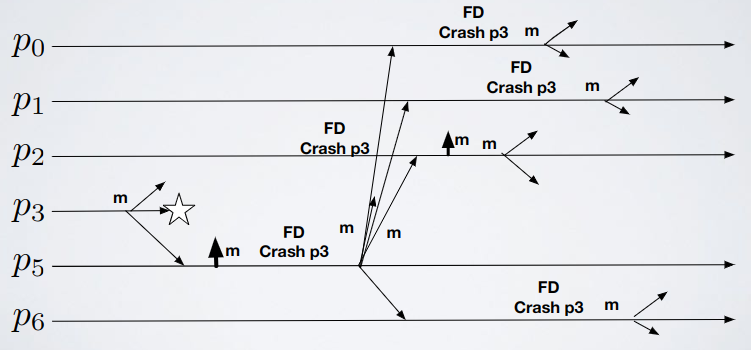

# Broadcast - Exercise 1

## Text

Modify the "Lazy Reliable Broadcast" algorithm to reduce the number of messages sent in case of `k` failures (with `k < n`) to `O(k*n)`



## Solution

We elect a leader L which is the only one that triggers a broadcast when it sees a message from a crashed process

Let's assume `p5` is the leader


### Cost analysis

- Everything multiplied for the number of leaders elected during the time
  - At most `n` point to point message to the leader: the failure could be detected by everyone, so everyone will alert the leader (including the leader itself)
  - At most `1` additional broadcast from the leader (to rebroadcast the message)
- There are at most `k` leaders because there are at most `k` failures (there is a leader election only if a leader fails)
- `O(k*n)` messages for each broadcast issued by a faulty process

### Pseudocode

(Made by me so it could be wrong)

Something is missing: i don't handle the case in which the leader fails before broadcasting the message sent to it by a process who received a message from someone who's dead

In crash function: maybe here we could just make the leader relay, not everyone

```
upon event〈rb,Init〉do
  correct:=Π;
  leader:=⊥;  // Set to null (⊥ = null)
  from[p]:=[∅]^(N);  // Map of sets initialized for each process as null

upon event〈rb,Broadcast|m〉do
  trigger〈beb,Broadcast|[DATA,self,m]〉;  // Send the broadcast message and who is sending this message (self)

upon event〈beb,Deliver|p,[DATA,s,m]〉do
  if m !∈ from[s] then
    trigger〈rb,Deliver|s,m〉;
    from[s]:=from[s] ∪ {m};
    if m !∈ correct then
      trigger〈pl,Send|leader,[ALERT,s,from[s]]〉;

upon event〈pl,Deliver|q,[ALERT,p,from[p]]〉do
  should_broadcast = false;
  if from[p] ⊂ message(from[p]) then
    from[p] = message(from[p]);
    should_broadcast = true;
  if p ∈ correct then
    correct:=correct - {p};
    should_broadcast = true;
  if should_broadcast then
    trigger〈beb,Broadcast|[DATA,p,from[p]]〉;

upon event〈P,Crash|p〉do
  correct:=correct - {p};
  trigger〈pl,Send|leader,[ALERT,p,from[p]]〉;
        
// maxrank() returns the process with lowest ID
upon leader != maxrank(correct) do
  leader:=maxrank(correct);
  trigger〈le,Leader|leader〉;
```
