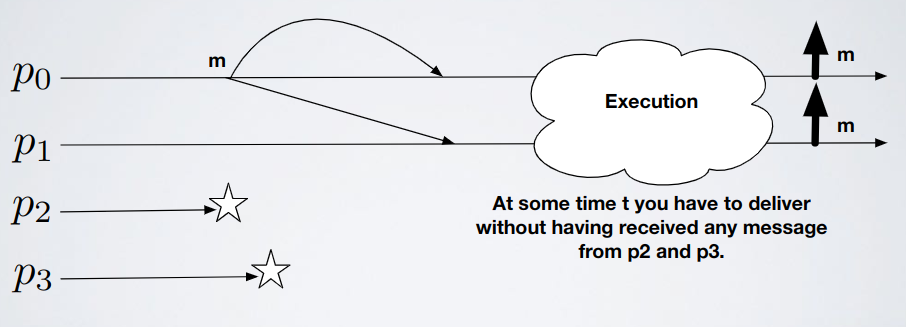
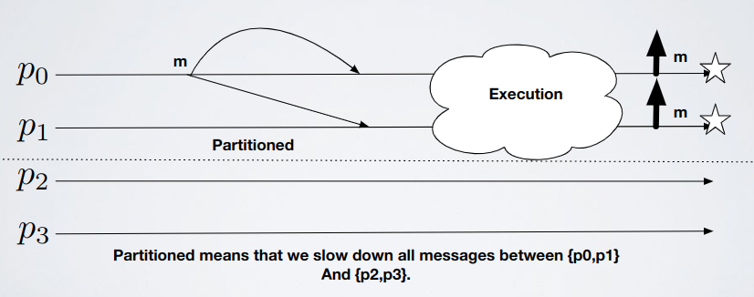
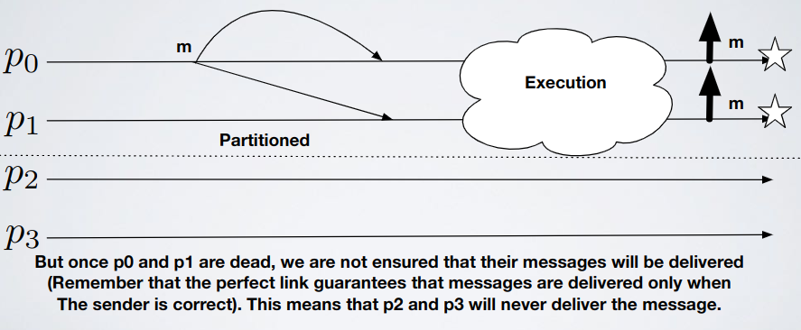

# Broadcast - Exercise 3

## Text

Can we design a uniform reliable broadcast algorithm with an eventually perfect failure detector but without assuming a majority of correct processes?

It's like having a huge window of time in which there isn't a failure detector (as you can't trust it)

## Solution

### Impossibility proof

First execution: assume half of the process we have die

Second execution: there's no difference between this execution and the first, `p0` and `p1` still can't reach `p2` and `p3` (even if this time `p2` and `p3` are alive)

In each execution `p0` and `p1` eventually will deliver the message

If we make `p0` and `p1` fail after delivering the message then...

Because for `p2` and `p3` could be that `p0` and `p1` crashed before sending the message

So we violate the safety property because `p0` and `p1` delivered a message and correct processes `p2` and `p3` will never see this message