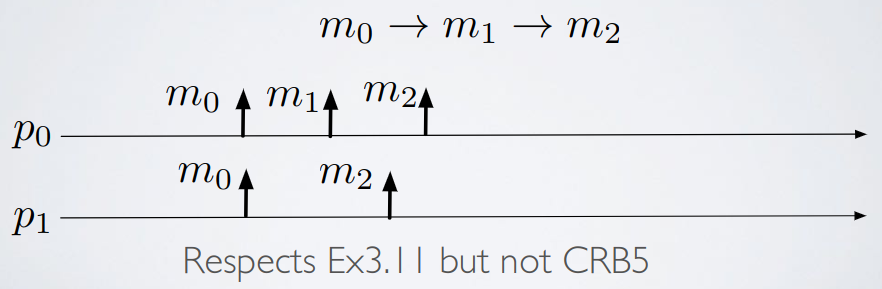

# Broadcast - Exercise 4

## Text

Compare the causal delivery property (CRB5: "For any message `m1` that potentially caused a message `m2` (`m1→m2`), no process delivers `m2` unless it has already delivered `m1`") with the following property (Ex 3.11): "If a process delivers messages `m1` and `m2`, and `m1→m2`, then the process must deliver `m1` before `m2`"

Which contains which?

## Solution

CRB5 is more strict than Ex 3.11

