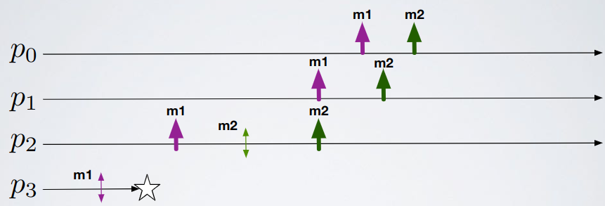
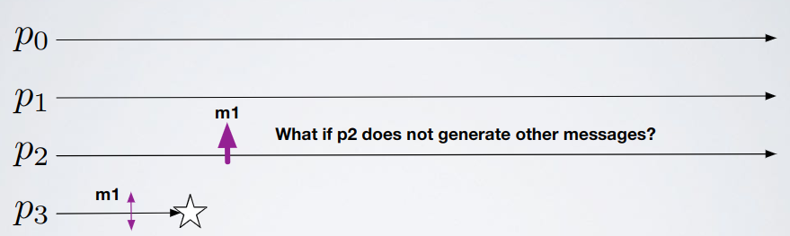

# Broadcast - Exercise 5

## Text

Can we design a best-effort broadcast algorithm that satisfies the causal delivery property without being a causal broadcast algorithm (without satisfying the agreement property of a reliable broadcast)?

Agreement property: "If a correct process delivers a message then all the correct processes deliver the message"

Causal delivery: "For any message `m1` that potentially caused a message `m2` (`m1→m2`), no process delivers `m2` unless it has already delivered `m1`"

## Solution

With this execution it may seem that causal delivery contains agreement property:

But it's not true:

