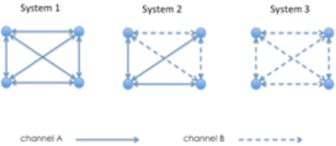

# Broadcast - Exercise 6

## Text

Let channel A and channel B be two different types of point-to-point channels satisfying the following properties:
- Channel A: if a correct process `pi` sends a message `m` to a correct process `pj` at time `t`, then `m` is delivered by `pj` by time `t+x`
- Channel B: if a correct process `pi` sends a message `m` to a correct process `pj` at time `t`, then `m` is delivered by `pj` with probability `pcons` (`pcons < 1`)

Let us consider the following systems composed by 4 processes `p1`, `p2`, `p3` and `p4` connected trough channels A and channels B

Assuming that each process `pi` is aware of the type of channel connecting it to any other process, answer to the following questions:
1. Is it possible to design an algorithm implementing a leader election primitive in system 1 if any process can fail by crash?
2. Is it possible to design an algorithm implementing a leader election primitive in system 2 if only processes having an outgoing channel of type B can fail by crash?
3. Is it possible to design an algorithm implementing a leader election primitive in system 2 if any process can fail by crash?
4. Is it possible to design an algorithm implementing a leader election primitive in system 3?

For each point, if an algorithm exists write its pseudo-code, otherwise show the impossibility

## Solution

1. Yes, use the normal leader election algorithm
2. Yes
   - Elect the process that can't crash as a leader
   - Or use the channel A to implement the leader election (because the node that connects everyone can not crash)
3. No, because if the node process that connect with channel A every process fails the system becomes asynchronous so leader election becomes impossible (leader election is not possible in asynchronous systems)
4. Depends
   - If no process can crash then yes: you just take the lowest id as leader
   - Else no