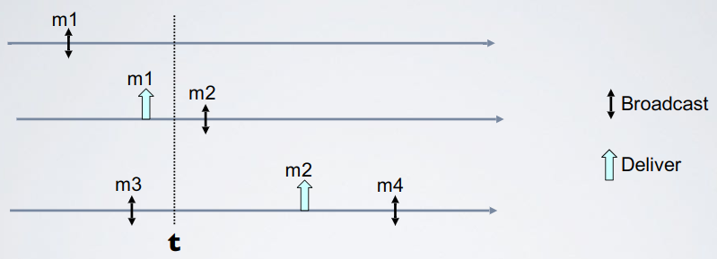

# Broadcast - Exercise 7

## Text

Provide all the delivery sequences after instant `t` such that causal order is satisfied (put delivery events just after instant `t`)

## Solution

How to:

1. Write the happened before relationship

   

   - `M1->M2->M4` for delivery events order
   - `M3->M4` for logical order
   - `M3 || M1`
   - `M3 || M2`
2. Brute force (delivery sequences)
   - If `P1` delivers `M3` after `Bcast(M2)`
     - `P0`
       - `M1, M2, M3, M4`
       - `M3, M1, M2, M4`
       - `M1, M3, M2, M4`
     - `P1`
       - `M1, M2, M3, M4`
       - `M1, M3, M2, M4`
     - `P2`
       - `M1, M2, M3, M4`
       - `M3, M1, M2, M4`
       - `M1, M3, M2, M4`
   - If `P1` delivers `M3` before `Bcast(M2)` (`M3->M2`)
     - `P0`
       - `M3, M1, M2, M4`
       - `M1, M3, M2, M4`
     - `P1`
       - `M1, M3, M2, M4`
     - `P2`
       - `M3, M1, M2, M4`
       - `M1, M3, M2, M4`

