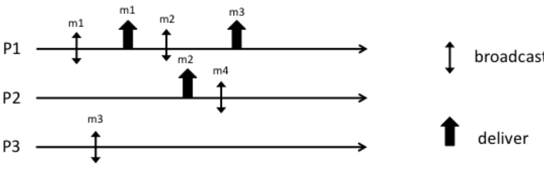
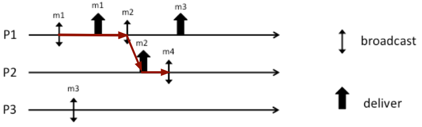

# Broadcast - Exercise 8

## Text

1. Provide all the possible sequences satisfying Causal Order
2. Complete the execution in order to have a run satisfying FIFO order but not causal order

## Solution

How to:

1. Write the happened before relationship
   - `M1->M2->M4` for delivery events order
   - `M3 || M1`
   - `M3 || M4`
   - `M3 || M2`
1. Brute force (delivery sequences)
   - If `P2` delivers `M3` after `Bcast(M4)` on `P2`
     - `P1`
       - `M1, M2, M3, M4`
       - `M1, M3, M2, M4`
       - `M1, M2, M4, M3`
     - `P2`
       - `M1, M2, M3, M4`
       - `M1, M2, M4, M3`
     - `P3`
       - `M1, M2, M3, M4`
       - `M1, M2, M4, M3`
       - `M1, M3, M2, M4`
       - `M3, M1, M2, M4`
   - If `P2` delivers `M3` before `Bcast(M4)` on `P2` (`M3->M4`)
     - `P1`
       - `M1, M2, M3, M4`
       - `M1, M3, M2, M4`
     - `P2`
       - `M1, M2, M3, M4`
     - `P3`
       - `M1, M2, M3, M4`
       - `M3, M1, M2, M4`
       - `M1, M3, M2, M4`
3. FIFO not causal

    

     - `FIFO`: `M1, M2`
     - `P1`: `M1, M2, M4, M3`
     - `P2`: `M1, M2, M3, M4`
     - `P3`: `M4, M1, M2, M3`