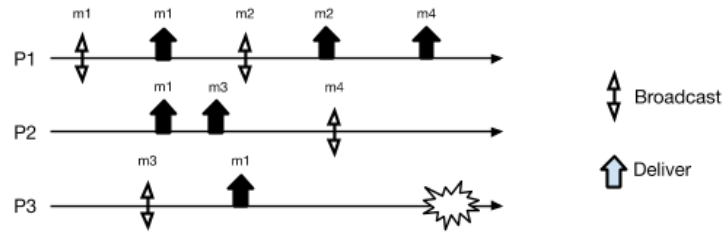

# Broadcast - Exercise 9

## Text

1. Complete the execution by adding the minimal number of send/deliver events such that the run satisfies best effort broadcast and does not satisfy reliable broadcast
2. Complete the execution by adding the minimal number of send/deliver events such that the run satisfies regular reliable broadcast and does not satisfy uniform reliable broadcast
3. Which kind of ordering do the two runs defined for the previous question satisfy (if any)?

## Solution

1. Question 1
   - Best Effort: if I am correct any other correct delivers my messages
   - Regular = Beb + Agreement: if a message `m` is delivered by some correct process, then `m` is eventually delivered by every correct process
   - Beb but not regular
     - `P1`: `M1,M2,M4`
     - `P2`: `M1,M3,M2,M4`
     - `P3`: `M1`
2. We have to add a send event in the faulty process `Send(M5)` after `Send(M3)`, and the faulty process has to be the only one that delivers `M5`
   - `P1=P2`: `M1,M2,M3,M4`
   - `P3`: `M1,M3,M5`
3. Question 3
   1. `FIFO` (not causal `M3->M4`)
   2. Causal