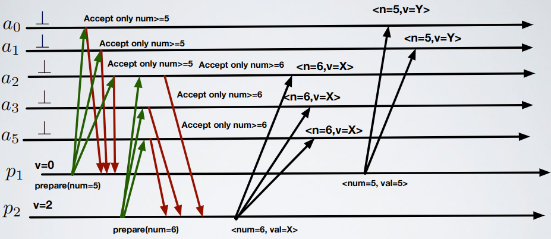

# Consensus - Exercise 1

## Text

In Paxos, suppose that a cluster contains `5` servers and `3` of them have accepted proposal `6` with value `X`. Once this has happened, is it possible that **any** (at least one) server in the cluster could accept a different value `Y`?

Explain your answer:
- If possible show an execution
- If not possible describe the rules of the algorithm that prevent such behavior

## Solution

Yes it's possible: if a process sent a prepare before round `6` with a lower round id then this process could send the accept after the accept of `6`

The answer "No, each proposal prepared after `6` has to see value `X`" is not correct because it does not take into account old proposal `(t' < t)`