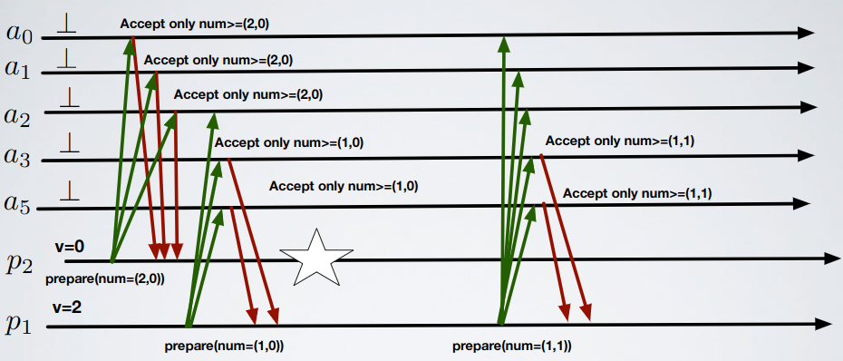

# Consensus - Exercise 2

## Text

In Paxos, suppose we let each participant timestamps its prepare requests with the pair `(ID, ts)` (where `ts` is an increasing counter), and we use the following rule `(ID',ts') > (ID, ts)` if `ID'>ID` or (`ID'=ID` and `ts'>ts`); discuss if the properties of safety and liveness are impacted

## Solution

- Safety is preserved
- Liveness is not anymore ensured even in a fully-synchronous system; assume that the proposer with the greatest `ID` prepare a request with number `(n,0)` and then crashes, after this no one can effectively get a majority of acks for any proposal number
  - Wrong: "if `ID'>ID` or (`ID'=ID` and `ts'>ts`)"

