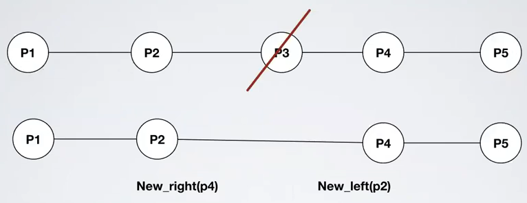

# Misc - Exercise 1

## Text

Consider a distributed system composed by `n` processes `{p1,p2,...,pn}` that communicate by exchanging messages on top of a line topology, where `p1` and `pn` are respectively the first and the last process of the network.

Initially, each process knows only its left neighbor and its right neighbor (if they exist) and stores the respective identifiers in two local variables `LEFT` and `RIGHT`.

Processes may fail by crashing, but they are equipped with a perfect oracle that notifies  at each process the new neighbor (when one of the two fails) through the following primitives:
- `Left_neighbor(px)`: process `px` is the new left neighbor of `pi`
- `Right_neighbor(px)`: process `px` is the new right neighbor of `pi`

Both the events may return a `NULL` value in case `pi` becomes the first or the last process of the line.

Each process can communicate only with its neighbors.




## Solution

How to:
1. Explain the idea of the algorithm
2. Write pseudocode
3. [OPT] Show validity

### Explanation

To send a message send left and right


A process could die


So when i see a new neighbor i resend all the messages


### Pseudocode

```
upon event Init
   Delivered=∅
   left_process=LEFT
   right_process=RIGHT

// Send message
upon event ReliableBroadcast(〈m〉)
   MSG=[pi,m]  // Message contains also source process
   DeliverUp(pi,m)
   SendLeft(MSG)
   SendRight(MSG)

upon event DeliveryFromPerfectLink(〈p,m〉)
   source=m[0]
   payload=m[1]
   if (source,payload) !∈ Delivered then
      SendLeft(m)
      SendRight(m)
      DeliverUp(source,payload)

upon event NewLeftNeighbor(p_left)
   left_process=p_left
   // Resend all already delivered messages to the new neighbor
   forall (s,m) ∈ Delivered do
      SendLeft([s,m])

upon event NewRightNeighbor(p_right)
   right_process=p_right
   // Resend all already delivered messages to the new neighbor
   forall (s,m) ∈ Delivered do
      SendRight([s,m])

function SendLeft(m)
   if left_process != ⊥ then
      SendPerfect(left_process,m)

function SendRight(m)
   if right_process != ⊥ then
      SendPerfect(right_process,m)

// To avoid multiple delivery use the Deliver set
function DeliverUp(source,m)
   if (source,m) !∈ Delivered then
      ReliableBroadcastDeliver(source,m)
      Delivered=Delivered ∪ {(source,m)}
```