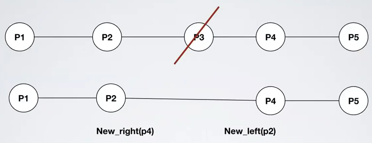
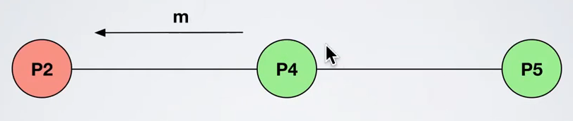
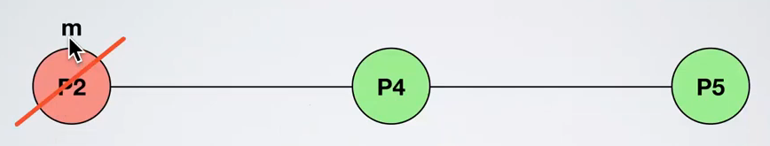
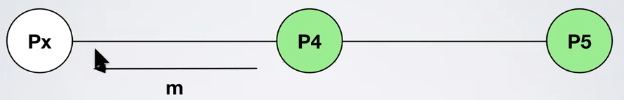
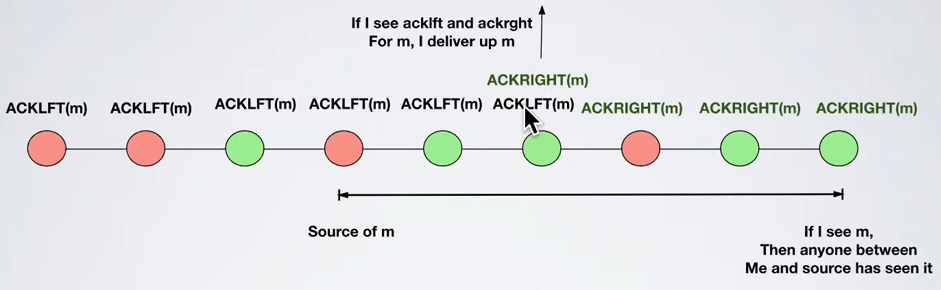

# Misc - Exercise 2

## Text

Consider a distributed system composed by `n` processes `{p1,p2,...,pn}` that communicate by exchanging messages on top of a line topology, where `p1` and `pn` are respectively the first and the last process of the network.

Initially, each process knows only its left neighbor and its right neighbor (if they exist) and stores the respective identifiers in two local variables `LEFT` and `RIGHT`.

Processes may fail by crashing, but they are equipped with a perfect oracle that notifies  at each process the new neighbor (when one of the two fails) through the following primitives:
- `Left_neighbor(px)`: process `px` is the new left neighbor of `pi`
- `Right_neighbor(px)`: process `px` is the new right neighbor of `pi`

Both the events may return a `NULL` value in case `pi` becomes the first or the last process of the line.

Each process can communicate only with its neighbors.

Use Uniform Broadcast



## Solution

How to:
1. Explain the idea of the algorithm
2. Write pseudocode
3. [OPT] Show validity

### Explanation

To send a message send left and right



A process could die



So when i see a new neighbor i resend all the messages



If the extreme left and extreme right process seen the message then the message has been seen by everyone so we just use ACKs by those extreme processes



### Pseudocode

```
upon event Init
   Delivered=∅  // No duplication
   Pending=∅  // Save messages and then send them when everyone is ready 
   left_process=LEFT
   right_process=RIGHT
   iam_left_endpoint=false
   iam_right_endpoint=false

// Send message
upon event ReliableBroadcast(〈m〉)
   MSG=[DATA,pi,m]  // Message contains also source process
   Pending=Pending ∪ {(DATA,pi,m)}
   SendLeft(MSG)
   SendRight(MSG)

upon event DeliveryFromPerfectLink(〈p,m〉)
   HEADER=m[0]
   source=m[1]
   payload=m[2]
   if (HEADER,source,payload) !∈ Pending then
      SendLeft(m)
      SendRight(m)
      Pending=Pending ∪ {(HEADER,source,payload)}

upon event NewLeftNeighbor(p_left)
   left_process=p_left
   // Resend all pending messages to the new neighbor
   forall (H,s,m) ∈ Pending do
      SendLeft([H,s,m])
   // Am i the new one?
   if p_left=⊥ then
      iam_left_endpoint=true

upon event NewRightNeighbor(p_right)
   right_process=p_right
   // Resend all pending messages to the new neighbor
   forall (H,s,m) ∈ Pending do
      SendRight([H,s,m])
   // Am i the new one?
   if p_right=⊥ then
      iam_right_endpoint=true

function SendLeft(m)
   if left_process != ⊥ then
      SendPerfect(left_process,m)

function SendRight(m)
   if right_process != ⊥ then
      SendPerfect(right_process,m)

// To avoid multiple delivery use the Deliver set
function DeliverUp(source,m)
   if (source,m) !∈ Delivered then
      ReliableBroadcastDeliver(source,m)
      Delivered=Delivered ∪ {(source,m)}

// If i'm the left endpoint and a message is sent to me (without ACK) i generate the ACKLFT and send it to the right
upon event ∃(DATA,s,m) ∈ Pending ∧ ∄ (ACKLFT,s,m) ∈ Pending ∧ iam_left_endpoint
   Pending=Pending ∪ {(ACKLFT,s,m)}
   SendRight([ACKLFT,s,m])

// If i'm the right endpoint and a message is sent to me (without ACK) i generate the ACKRGT and send it to the left
upon event ∃(DATA,s,m) ∈ Pending ∧ ∄ (ACKRGT,s,m) ∈ Pending ∧ iam_right_endpoint
   Pending=Pending ∪ {(ACKRGT,s,m)}
   SendLeft([ACKRGT,s,m])

// If i have a message in pending and its ACKLFT and ACKRGT then deliver it
upon event ∃(DATA,s,m) ∈ Pending ∧ ∃ (ACKLFT,s,m) ∈ Pending ∧ ∃ (ACKRGT,s,m) ∈ Pending
   DeliverUp([s,m])
```