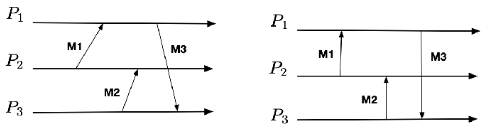
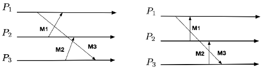
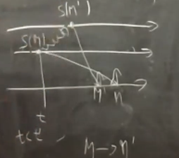

# Misc - Exercise 4

## Text

An execution is logically instantaneous if we can consider any message in the execution as if it was instantaneously delivered without any network latency.

Not all executions are logically instantaneous.

Discuss if this sentence is true: "If an execution is logically instantaneous and there are no failures then it also respects causal order."

## Solution

The sentence is true.

### Proof by contraddition

`M->M'` (so `t<t'`) and `S(M)` knows about `S(M')` (reciprocally).

As the arrow cross this communication can't be logically instantaneous.