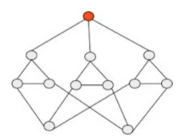

# Misc - Exercise 6

## Text

Each process can communicate only with its neighbors through perfect p2p links. For each process `pi` the set of its neighbors is known (by `pi`) and can be stored in a local variable `N`.

The system is asynchronous.

We assume that in the system there is a unique leader called `pL` (red in picture) known by all other processes.

1. Assuming that processes are always correct, write the pseudo-code of a distributed algorithm implementing a total order broadcast primitive
2. Given the topology shown in figure discuss what happens to the proposed algorithm if processes fail by crash and how many failures the algorithm is able to tolerate

IMPORTANT: premature optimization is the root of all evil

## Solution

### Solution 1 (general idea)

Everyone sends its value to the leader; to reach it just broadcast to everybody and then they'll forward. The leader has a list in which puts all the values sent to him (avoiding duplicates using sequence number and source) by other processes in order of receive. The leader sends the list using broadcast and everyone delivers messages in the list in the same order.

### Solution 2

Zero failures are tolerated; if the leader dies then it's over.

Supposing that leader can't fail:
- `3` failures aren't tolerated: you could isolate a process and this violates total order broadcast
- Also `2` failures aren't tolerated.. and also `1`: we can't implement TO (so consensus) in an asynchronous system that admit failures