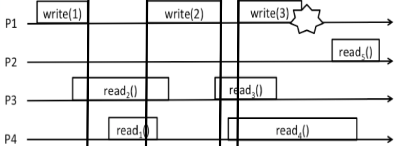

# Shared memories - Exercise 1

## Text

1. Define ALL the values that can be returned by read operations (Rx) assuming the run refers to a regular register
2. Define ALL the values that can be returned by read operations (Rx) assuming the run refers to an atomic register

## Solution

How to: write lines at the end and at the beginning of write operations (in `write(3)` there's no line at the end because the operation doesn't conclude, goes on "forever") so that you don't get confused and you know which operations are concurrent

1. Regular solution:
   - `read1`: can return `1` or `2`
   - `read2`: can return `⊥`, `1` or `2`
   - `read3`: can return `1`, `2` or `3`
   - `read4`: can return `2` or `3`
   - `read5`: can return `2` or `3`
2. Atomic solution: arbitrarily choose an order for read operations and then create a graph

    

    - Error: `READ5=3` on the top right corner should be `READ5={3,2}`
    - Error: in `READ2=1,READ1=1` `READ3` could read `1`
