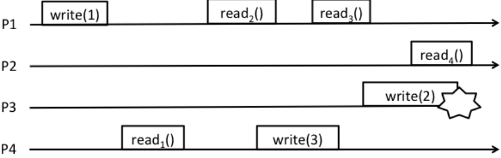
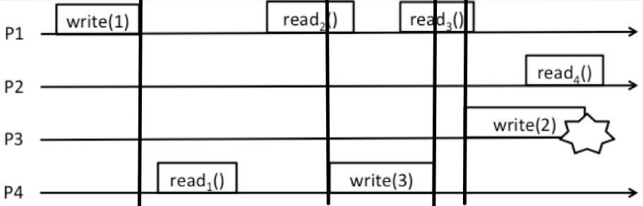
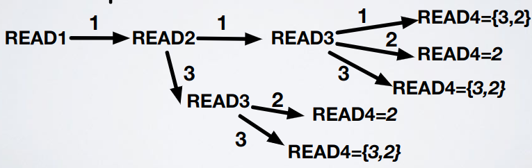

# Shared memories - Exercise 2

## Text

1. Define ALL the values that can be returned by read operations (Rx) assuming the run refers to a regular register
2. Define ALL the values that can be returned by read operations (Rx) assuming the run refers to an atomic register

## Solution

How to: write lines at the end and at the beginning of write operations (in `write(2)` there's no line at the end because the operation doesn't conclude, goes on "forever") so that you don't get confused and you know which operations are concurrent

1. Regular solution:
   - `read1`: can return `1`
   - `read2`: can return `1` or `3`
   - `read3`: can return `1`, `2` or `3`
   - `read4`: can return `2` or `3`
2. Atomic solution: arbitrarily choose an order for read operations and then create a graph

    