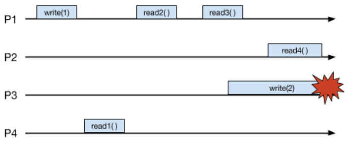
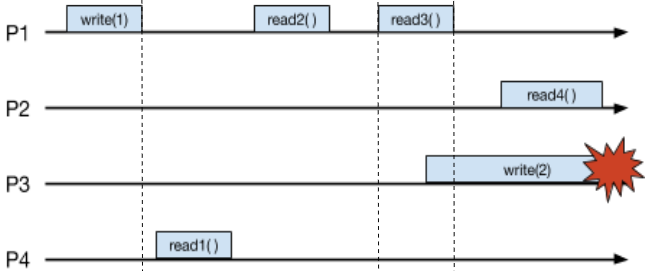
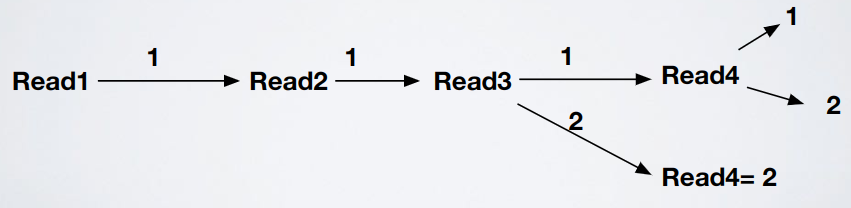

# Shared memories - Exercise 4

## Text

1. Define all values that can be returned by read operations assuming the run refers to a regular register
2. Define all values that can be returned by read operations assuming the run refers to an atomic register
3. Define one sequence of values that violates sequence consistency

## Solution

1. Regular
   - `read1() = 1`
   - `read2() = 1`
   - `read3() = {1,2}`
   - `read4() = {1,2}`
2. Atomic

    

3. `read2() = 2`, `read3() = 1`: the only possible global order should be `write(1)` after `read2()`, but this is not possible since it would violate the local order on `P1` (`write(1)`, `read2()`, `read3()`)

