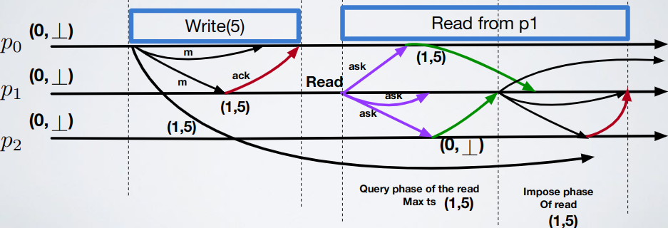

# Shared memories - Exercise 5

## Text

Give an algorithm that implements a `(1,1)` atomic register in the fail-silent model and that is more efficient than the "Read-Impose Write-Majority" algorithm which implements a `(1,N)` atomic register in the fail-silent model

`(1,N)` atomic register:



## Solution

We could just remove the impose phase (reader impose the value just read) because we have only one reader

Core modification of the algorithm:

```
upon event〈onrr,Read〉do
    rid:=rid+1;
    readlist:=[⊥]^N;
    readlist[self]:=(ts,val);
    trigger〈beb,Broadcast|[READ,rid]〉;
    
upon event〈beb,Deliver|p,[READ,r]〉do
    if p != self then
        trigger〈pl,Send|p,[VALUE,r,ts,val]〉;
        
upon event〈pl,Deliver|q,[VALUE,r,ts',v']〉such that r=rid do
    readlist[q]:=(ts',v');
    if #(readlist)>N/2 then
        (ts,val):=highest(readlist);
        readlist:=∅;
        trigger〈onrr,ReadReturn|val〉;
```

Why we can't use this strategy instead?


Because this is a fail-silent system so if the reader crashes the system is blocked forever; in every fail-silent algorithm relying on a process (that could fail) to make the system progress is a huge mistake