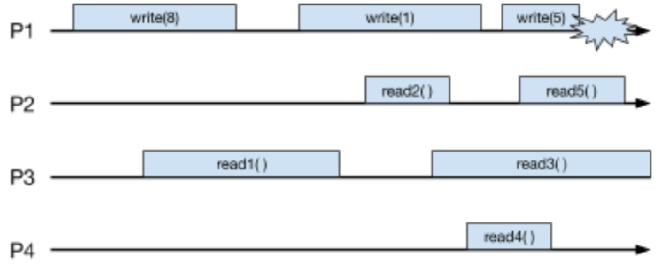
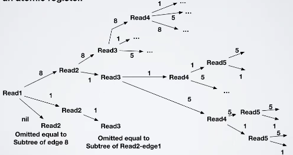
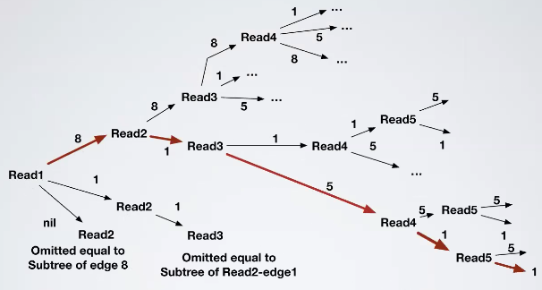

# Shared memories - Exercise 7

## Text

1. List ALL the values that can be returned by read operations (Rx) assuming the run refers to a regular register
2. List ALL the values that can be returned by read operations (Rx) assuming the run refers to an atomic register
3. Let us assume that values returned by read operations are as follow; is the run depicted in the Figure linearizable? Motivate your answer
   - `read1()→8`
   - `read2()→1`
   - `read3()→5`
   - `read4()→1`
   - `read5()→1`
4. Is it possible to create a run that violates sequential consistency and is linearizable?
5. Is it possible to create a run that is not linearizable but is sequential consistent?

## Solution

1. Regular register
   - `read1()→{8,1,null}`
   - `read2()→{8,1}`
   - `read3()→{8,1,5}`
   - `read4()→{8,1,5}`
   - `read5()→{1,5}`
2. Atomic register

    

   - Error note: in `read1(8)->read2(1)->read3` the path of value `8` is missing
3. Yes

    

4. No, linearizability implies sequential consistency
5. Yes, sequential consistency does not imply linearizability
   - Simply impose that all the reads read `null` (all before `write(8)`)