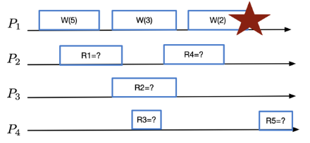
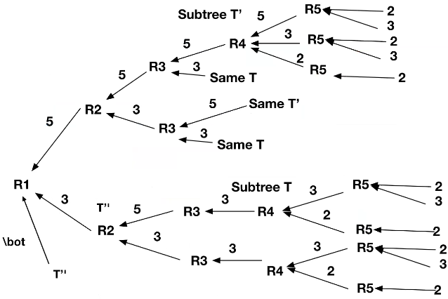

# Shared memories - Exercise 8

## Text

1. Define all the values that can be returned by read operations assuming the run refers to a regular register
2. Define all the values that can be returned by read operations assuming the run refers to an atomic register
3. Show a sequence of return values that is sequential consistent but not atomic

## Solution

1. Regular register
   - `read1()→{5,3,null}`
   - `read2()→{3,5}`
   - `read3()→{3,5}`
   - `read4()→{2,3,5}`
   - `read5()→{2,3}`
2. Atomic register

    

   - Error note: in `read1(8)->read2(1)->read3` the path of value `8` is missing
3. Exercise 3
   - Read values: `R1=5, R2=5, R4=5, R3=3, R5=2`
   - Sequential order: `W(5), R1, R2, R4, W(3), R3, W(2), R5`
   - Explanation: not atomic because `R3` reads `3` and `R4` reads `5` but this would imply that the linearization point of `W(3)` is in `R3` that contradicts the read of `5` by `R4`