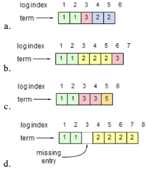

# Software replication - Exercise 1

## Text

Each figure below shows a possible log configuration for a Raft server (the contents of log entries are not shown; just their indexes and terms). Considering each log in isolation, could that log configuration occur in a proper implementation of Raft? If the answer is "no" explain why not.

## Solution

1. No because terms must be in order
2. Yes
3. Yes, terms `2` and `4` aren't here because no one gets elected, split vote
4. No, it's not possible to skip indexes