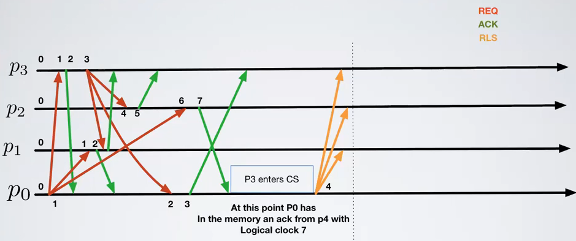

# Time - Exercise 1

## Text

### Pseudocode

```
upon eventInit
  Requests=Acks=∅
  scalar_clock=0
  my_req=⊥
  ∏={p0,p1,...,pn-1}
  
// Request access to CS from upper layer
upon event Request
  scalar_clock=scalar_clock+1
  my_req=(REQ, ts=<i,scalar_clock >)
  for all pj ∈ ∏ do
    Send FIFOPerfectLink(pj,req_msg)  // Send a REQ containing my ID (i) and ts (scalar_clock) to all p ∈ ∏

// Release CS from upper layer
upon event Release
  Requests=Requests - {req_msg}
  scalar_clock=scalar_clock+1
  for all pj ∈ ∏ do
    Send FIFOPerfectLink(pj,(RLS, ts=<i,scalar_clock >))
    
// ts(x)<ts(y) when scalar_clock of x is less than the one of y, or they are equal and the id that sent x is less than the id that sent y (4)
upon event ∄ req ∈ Requests:ts(req)<ts(my_req) ∧ ∀ p ∈ ∏: ∃ m ∈ Acks|ts(m)>ts(myreq) ∧ sender(m)=p
  trigger event Granted
  
upon event Deliver Message(m)
  // IMPORTANT: In the original algorithm here there was a scalar clock update
  if m is a REQ then
    scalar_clock=max(clock(m),scalar_clock)+1
    Request_set=Request_set ∪ {m}
    scalar_clock=scalar_clock+1
    Send FIFOPerfectLink(sender(m),(ACK, ts=<i,scalar_clock >))  // (5)
  else if m is a ACK then
    Acks=Acks ∪ {m}
  else if m is a RLS ∧ ∃ req ∈ Request_set: sender(req)=sender(m) then
    Requests=Requests - {req}
```

Consider the previous algorithm and links that are not FIFO, show that following property doesn't hold:
  - (Mutual Exclusions) At any time `t`, only one process is inside the CS (show an execution that violates it)

## Solution



Logical clock `7` is a lot grater than `3` because we aren't updating the clock (as underlined in `IMPORTANT`); the ACK with timestamp `7` is dangerous because here (4) we just see if the timestamp of the ACK is greater than ours (`Acks|ts(m)>ts(myreq)`) so we obtain an ACK that could be used in the future

For example if `p0` does another request and the ACK has a timestamp lower than `7` then `p0` thinks that he received the ACK from `p2` even if `p2` has never received that request

So it's a bad idea to not update the timestamp in `IMPORTANT`


In this image, in the second half, `REQ p0 -> p2` is really slow so `REQ p0 -> p3` and `REQ p0 -> p1` and their ACKs arrive before it; `p0` consider ACK with timestamp `7` sent before by `p2` as legit because `p0` has `scalar_clock=5, 5<7` so enters the critical session

When `p2` requests to enter the CS (`REQ p0 -> p2` isn't arrived yet) everyone ACK back because when you receive a message you immediately send back an ACK (5), you do not care if you're in the CS

So also `p2` enters CS, problem!

The facts that ACKs aren't updated (`IMPORTANT`) and the fact that links are not FIFO (text of the problem) are the source of this problem