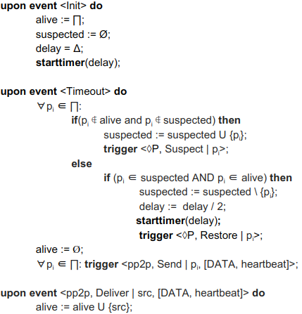

# Time - Exercise 3

## Text

Does this algorithm implements an eventual FD?



Discuss in terms of Strong completeness and eventual strong accuracy

## Solution

"Official" eventually perfect FD algorithm
```
upon event〈◊P,Init〉do
   alive:=Π;  // Everyone is alive
   suspected:=∅;  // Nobody is suspected
   delay:=∆;
   starttimer(delay);
   
upon event〈Timeout〉do
   // Only works when the system becomes synchronous
   if alive ∩ suspected != ∅ then  // (1)
      delay:=delay+∆;
   forall p ∈ Π do
      if(p !∈ alive)∧(p !∈ suspected) then  // (2)
         suspected:=suspected ∪ {p};
         trigger〈◊P,Suspect|p〉;
      else if(p ∈ alive)∧(p ∈ suspected) then  // (3)
         suspected:=suspected-{p};
         trigger〈◊P,Restore|p〉;
      trigger〈pl,Send|p,[HEARTBEATREQUEST]〉;  // (4)
   alive:=∅;
   starttimer(delay);

// Ping request handler
upon event〈pl,Deliver|q,[HEARTBEATREQUEST]〉do
   trigger〈pl,Send|q,[HEARTBEATREPLY]〉;
   
// Ping reply handler (5)
upon event〈pl,Deliver|p,[HEARTBEATREPLY]〉do
   alive:=alive ∪ {p};
```

The line `delay = delay/2` is breaking the algorithm (eventual strong accuracy) because at some point the `delay` will be so small that all the processes will be considered as dead (which is false)