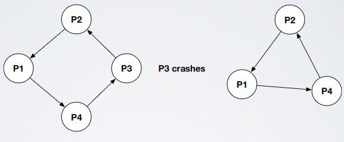
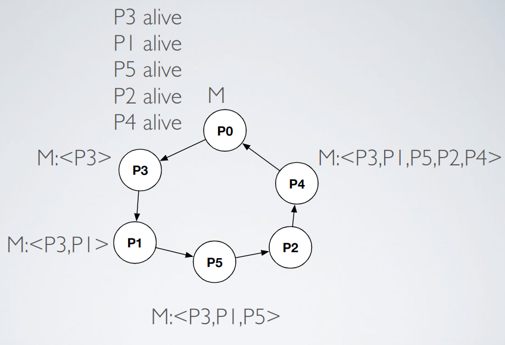
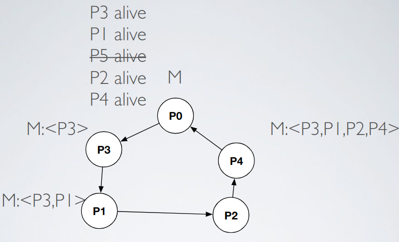

# Time - Exercise 4

## Text

You have a ring where each process communicates with its left neighbor using an unidirectional link. Each link is perfect point2point. Unfortunately, processes may crash, however you have a primitive that, upon the crash of your left neighbor, it gives you another valid left neighbor. See figure below.



Can you implement a perfect failure detector? Assume each process has an unique ID in `{1,...,n}`, you have `n` processes, each one knows `n`.

## Solution

We just use a message `M` as a check: `M` travels through all the processes and then comes back to the process who sent `M`; every process adds its ID to a set in `M` so when the message comes back to the sender the sender knows who is alive and who is dead.





If a process crashes when is handling `M` this generates problems so we just use the trick of resending all messages every time our neighbor changes.

- Algorithm
   ```
   upon event Init
      LastAlive=Π={p0,p1,...,pn-1}  // Set of all processes
      Sent=[⊥]^n  // Set of sent "message buses"
      cnt=0  // "Timestamp" of my message bus
      trigger event bootstrap
      
   // Crash handler, the crash event is generated by a perfect failure detector P
   upon event bootstrap()
      cnt++
      sendLeft(m=[BUSMESSAGE, busid:cnt, originator:pi,passengers:{pi}])
      Sent[pi]=m
      
   upon event DeliverMessage(m with type BUSMESSAGE)
      if m has originator equal to pi then
         forall pj that is in LastAlive but not in m.passengers do
            trigger event Crash pj  // (3)
         LastAlive=m.passengers
         trigger event bootstrap
      else if Sent[m.originator]=⊥ v Sent[m.originator].busid < m.busid then
         m'=[BUSMESSAGE, m.originator, m.passengers ∪ {pi}]
         Sent[m.originator]=m'
         sendLeft(m')
         
   upon event NewLeftNeighbor()
      forall pj such that Sent[pj] != ⊥ do
         sendLeft(Sent[pj])
   ```
- Formal proof (NOT REQUIRED AT EXAM)
  - Lemma 1: if a process `pi` is correct and sends a bus message `M` on the left link, then it eventually receives `M`
    - When a process `p` sends `M` to its neighbor `p'` either two things happen:
      - `M` reaches `p'`
      - `p'` crashes
        - A new neighbor is elected so eventually `M` reaches `pi`
    - Observations
      - `pi` generates an infinite number of bus messages (strong completeness, 3)
      - If `M` does not visit a process `p` during its loop, then `p` crashed (strong accuracy, 3)
      - During its loop `M` visits all the correct process in the ring (strong accuracy, 3)