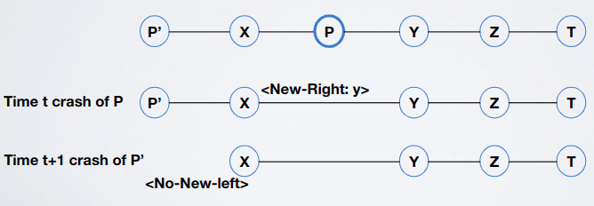
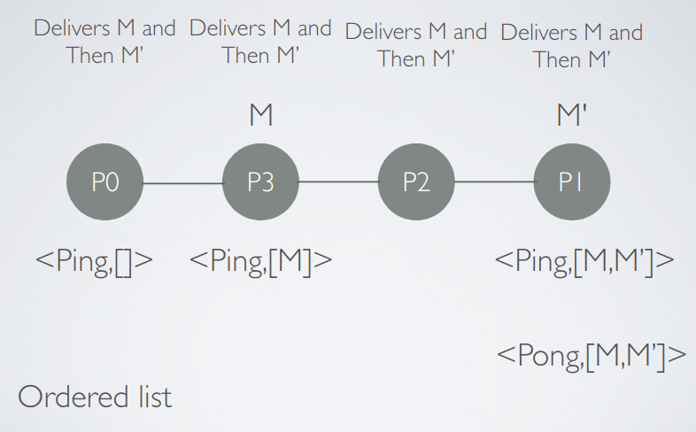
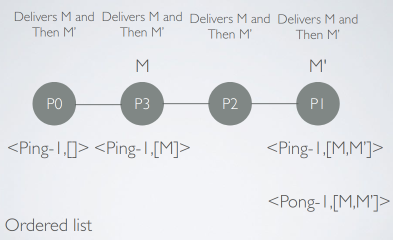

# Total ordering - Exercise 1

## Text

Consider processes arranged as a line, in a system where each one has a unique `ID`. Processes are connected by perfect point2point links. Processes are not always correct, and when they fail, they fail by crashing. Processes can communicate only with neighbors by exchanging messages. When a neighbor of a process fails a new neighbor is given: there is an oracle that notifies a process of a new link with a new-left or new-right neighbor. The only exception is if a process becomes an endpoint of the line. In this case the event `no-new-left` (or `no-new-right`) is generated. Suppose that the oracle does not shuffle the line, that is at each reconfiguration the relative order from left to right on the line is preserved. Create and write the pseudocode of an algorithm that implements a total order broadcast. A TOBcast is a regular reliable broadcast with the additional property that all correct processes deliver messages in the exact same order. 



## Solution

### Important

- Stay away from concurrency! Is better to have a serialization point (like a leader)
- Design at first the algorithm for the no-failure case; in this case the algorithm should be trivial (if it's not make it simpler)

### Explanation

`P0` is the leader; it sends `Ping[]` list to the right and everyone appends the message to broadcast to the list and forward the list. When the list reaches the rightmost process, this last sends a `Pong[]` list (which is just `Ping[]` list but with a different name) back and then everyone who receives this list forwards it and delivers messages inside the list in order.



What happens if a process dies when it has just received the `Ping[]` (or `Pong[]`) list? To solve this problem we just attach a timestamp to the lists so that if a list is lost the leader simply resends the same list with the same timestamp so that processes who already delivered messages of this list just forward the list (no duplication). 



If the leader fails? Simply the process `p` on the right of the leader `l` knows that the process on the left (`l`) is dead and check if now `p` is the leftmost; if it is this means that is also the new leader so just wait for last timestamp's `Pong[]` list and then continue with the same process of before.

If the tail dies? The new rightmost will have `Ping[]` with timestamp `n` and `Pong[]` with timestamp `n-1` so now it must generate and send `Pong[]` with timestamp `n`.

### Pseudocode

```
upon event Init
  left=P2pLink()
  right=P2pLink()
  head=False  // True on the leftmost process
  tail=False  // True on the rightmost process
  Pending=∅
  last_ping=⊥
  last_pong=⊥
  
// To broadcast add to pending a tuple with source and message
upon event TOBroadcast(m)
  m=<pi,m>
  Pending=Pending ∪ {m}

// Left neighbor crash handler; if i become the head i send again last ping  
upon event NewLeftNeighbor(new left p)
  left=p
  if p=⊥ then
    head=True
  else
    if last_pong != ⊥ then
      sendRight(last_ping)
      
// Right neighbor crash handler; if i become the tail i send again last pong
upon event NewRightNeighbor(new right p)
  right=p
  if p=⊥ then
    tail=True
  if last_ping != ⊥ then
    sendLeft(last_pong)
    
// Handler for delivering messages
upon event DeliveryFromPerfectLink(MSG)
  // If i receive a new ping i add my messages to this and forward
  if MSG=<PING,sn,list> ∧ head=False ∧ sn > last_ping.sn then  // Assumes ⊥.sn==-1
    rcv_ping(PING,sn,list)
  // If i receive a new pong i deliver messages and forward
  else if MSG=<PONG,sn,list> ∧ tail=False ∧ sn > last_pong.sn then  // Assumes ⊥.sn==-1
    rcv_pong(PONG,sn,list)

// If i'm the head and the number of the last ping is equal to the number of the last pong
// If i'm the leader and a pong comes back i create a new ping appending my eventual messages
upon event head ∧ last_ping.sn=last_pong.sn // Assumes ⊥.sn==-1
  last_ping=<PING,last_ping.sn+1,[]>
  rcv_ping(last_ping)

// Same as the function above but with pong  
upon event tail ∧ last_ping.sn=last_pong.sn+1
  last_pong=<PONG,last_pong.sn+1,last_ping.list>
  rcv_pong(last_pong)

// Create and send a ping with my messages
procedure rcv_ping(PING,sn,list)
  list=list+LIST(Pending)
  Pending=∅
  last_ping=<PING,sn,list>
  sendRight(last_ping)

// Deliver messages in order and then create and send a pong
procedure rcv_pong(PONG,sn,list)
  forall(source, message) ∈ list do  // Following the order of the list
    TRIGGER TO Deliver(source, message)
  last_pong=MSG
  sendLeft(last_pong)
```