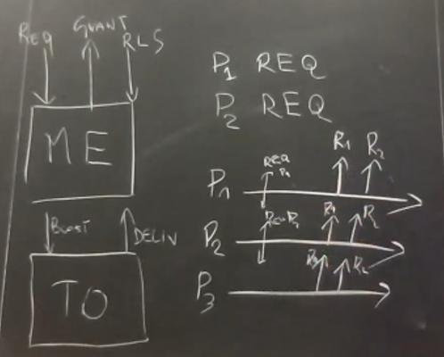
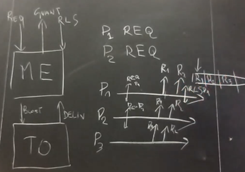
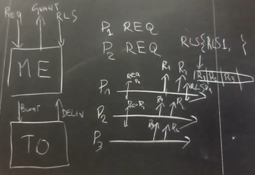
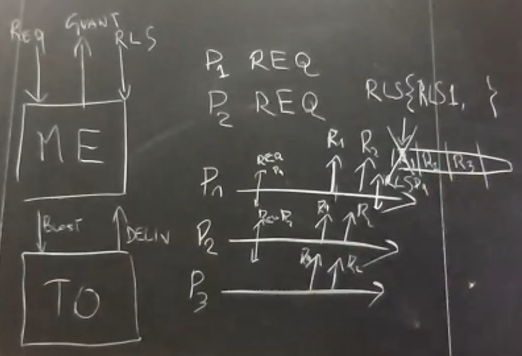

# Total ordering - Exercise 2

## Text

Show that any implementation of TO is sufficient to create a (non fault-tolerant) mutual exclusion algorithm. How would you modify your algorithm to have a fault-tolerant mutual exclusion algorithm given the `P` failure detector?

## Solution

### Non fault-tolerant

#### Explanation 

Through TO requests of mutex are delivered; in this case `p1` can immediately enter the critical section.



A queue is used to track requests for critical section; in this case `p1` has to broadcast (through TO) the release message.



A set is used to keep track of release messages; in this case someone will eventually deliver the release message of `p1` and put it in the `RLS` set.



`R1` is then removed from the queue so the next process who can enter the critical section is `p2` and everyone knows it for TO.



#### Algorithm

```
upon event Init
  Requests=[]  // Requests queue
  RLS={}  // Release set
  CS=false  // Am i in critical section?
  Requesting=false  // Am i asking for enter the critical section?

upon event Request
  m=<Request,pi>
  trigger TOBCast(m)
  Requesting=true

upon event DeliveryFromTOB(MSG from sender p)
  if MSG=<Request,*> then  // If the message is a request
    Requests.append(MSG.sender)
  else if MSG=<Release,*> then  // If the message is a release
    RLS=RLS ∪ {MSG.sender}

// If i'm the next of the queue i enter the CS
upon event Requests[0]=pi and Requesting
  Requesting=false
  CS=true
  trigger Grant CS

// When i release CS i let the other know
upon event Release CS
  CS=false
  trigger TOBCast(<Release,pi>)

// When the first of the queue is in RLS set i remove it from the queue and the RLS set
upon event Requests[0] in RLS
  RLS=RLS - {Requests[0]}
  Requests=Requests[1:]
```

### Fault-tolerant

#### Algorithm

```
upon event Init
  Requests=[]  // Requests queue
  RLS={}  // Release set
  CS=false  // Am i in critical section?
  Requesting=false  // Am i asking for enter the critical section?
  Alive=Π  // Set of alive processes

upon event Request
  m=<Request,pi>
  trigger TOBCast(m)
  Requesting=true

upon event Crash(pi)
  Alive=Alive - {pi}

upon event DeliveryFromTOB(MSG from sender p)
  if MSG=<Request,*> then  // If the message is a request
    Requests.append(MSG.sender)
  else if MSG=<Release,*> then  // If the message is a release
    RLS=RLS ∪ {MSG.sender}

// If i'm the next of the queue i enter the CS
upon event Requests[0]=pi and Requesting
  Requesting=false
  CS=true
  trigger Grant CS

// When i release CS i let the other know
upon event Release CS
  CS=false
  trigger TOBCast(<Release,pi>)

// When the first of the queue is in RLS set i remove it from the queue and the RLS set
// I do the same if the process is crashed
upon event Requests[0] in RLS or Requests[0] not in Alive
  RLS=RLS - {Requests[0]}
  Requests=Requests[1:]
```